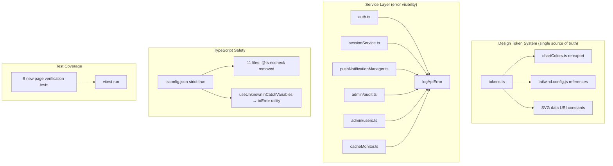

# Design Document: Admissions Quality Hardening

## Overview

This design covers six quality-hardening areas for the admissions frontend (`apps/admissions/`). No new features are introduced — the goal is to close residual gaps identified during CTO review of the `frontend-django-alignment` spec.

The work spans:
1. Removing 11 `@ts-nocheck` directives and fixing underlying type errors
2. Enabling TypeScript `strict: true` with a utility pattern for `useUnknownInCatchVariables` blast radius
3. Integrating `logApiError` into 6 remaining services
4. Consolidating chart and admin colors into the design token system
5. Adding page verification tests for 9 untested pages
6. Service layer polish (bulkStatus naming comment, N+1 documentation)

All changes are confined to `apps/admissions/`.

## Architecture

The hardening work does not alter the application architecture. It strengthens the existing layers:



### Key Design Decisions

1. **Phased strict mode**: Enable `strict: true` in a single step but provide a `toError()` utility to handle the `useUnknownInCatchVariables` blast radius. Every `catch (error)` block that accesses `error.message` needs a type guard. The utility centralizes this pattern.

2. **Token-first colors**: Chart colors and admin colors move into `tokens.ts`. `chartColors.ts` becomes a re-export. `tailwind.config.js` imports from tokens. This gives a single source of truth without breaking existing Tailwind class usage.

3. **logApiError preserves error propagation**: Each service gets `logApiError` calls in catch blocks, but the existing return/throw behavior is preserved exactly. Services that return error objects continue to do so; services that re-throw continue to re-throw.

4. **SVG color audit scoped to one instance**: The CTO review confirmed only one actual hardcoded hex in component TSX files — the SVG data URI in `EnhancedFormComponents.tsx`. The design scopes Requirement 7 as an audit-and-document pass rather than a guarantee of zero.

## Components and Interfaces

### 1. Error Handling Utility: `toError()`

A new utility in `src/lib/toError.ts` that safely narrows `unknown` catch variables:

```typescript
/**
 * Narrows an unknown catch variable to an Error instance.
 * Used across all catch blocks after enabling strict mode
 * (useUnknownInCatchVariables).
 */
export function toError(value: unknown): Error {
  if (value instanceof Error) return value
  return new Error(typeof value === 'string' ? value : String(value))
}
```

This is the minimal utility needed to handle the `useUnknownInCatchVariables` blast radius. Every existing `catch (error)` that accesses `error.message` without a type guard will use either:
- `toError(error).message` for simple cases
- An inline `instanceof Error` check where the original error object must be preserved

### 2. Design Token Extensions

New color categories added to `designTokens.colors` in `src/design-system/tokens.ts`:

```typescript
chart: {
  success: '#047857',
  warning: '#b45309',
  destructive: '#cc2424',
  primary: '#2563eb',
  purple: '#7c3aed',
},
admin: {
  bg: '#f9fafb',
  card: '#ffffff',
  border: '#858c98',
  text: '#111827',
  textSecondary: '#374151',
  textMuted: '#6b7280',
},
```

### 3. Chart Colors Module (re-export)

`src/lib/chartColors.ts` becomes:

```typescript
import { designTokens } from '@/design-system/tokens'
export const CHART_COLORS = designTokens.colors.chart
```

### 4. Tailwind Admin Colors (reference)

`tailwind.config.js` admin color block imports from tokens:

```javascript
const { designTokens } = require('./src/design-system/tokens')
// ...
admin: {
  bg: designTokens.colors.admin.bg,
  card: designTokens.colors.admin.card,
  border: designTokens.colors.admin.border,
  text: designTokens.colors.admin.text,
  'text-secondary': designTokens.colors.admin.textSecondary,
  'text-muted': designTokens.colors.admin.textMuted,
},
```

> **Note**: Since `tokens.ts` uses `export const` and `as const`, the Tailwind config (CommonJS) will need a small adapter. The simplest approach is to extract the raw color values into a `tokens.colors.js` file that both `tokens.ts` and `tailwind.config.js` can consume, or use a dynamic import. The implementation will choose the least-invasive path — likely a plain JS object file that `tokens.ts` re-exports with `as const`.

### 5. SVG Data URI Constant

A constant in `src/design-system/tokens.ts` (or a small helper) for the select chevron SVG:

```typescript
export const SELECT_CHEVRON_SVG = `url("data:image/svg+xml,%3csvg xmlns='http://www.w3.org/2000/svg' fill='none' viewBox='0 0 20 20'%3e%3cpath stroke='%23${designTokens.colors.neutral[500].slice(1)}' stroke-linecap='round' stroke-linejoin='round' stroke-width='1.5' d='m6 8 4 4 4-4'/%3e%3c/svg%3e")`
```

This replaces the hardcoded `%236b7280` in `EnhancedFormComponents.tsx`.

### 6. logApiError Integration Pattern

For each of the 6 services, the pattern is:

| Service | Current Error Handling | Change |
|---------|----------------------|--------|
| `auth.ts` | No try/catch — errors propagate to callers | Wrap each method in try/catch, call `logApiError('auth', endpoint, error)`, then re-throw |
| `sessionService.ts` | catch blocks return error objects | Add `logApiError('session', endpoint, error)` before existing return |
| `pushNotificationManager.ts` | catch blocks with `console.error` | Replace `console.error` with `logApiError('push-notifications', endpoint, error)` |
| `admin/audit.ts` | 1 catch block with `console.error` + re-throw | Add `logApiError('admin-audit', endpoint, error)` before re-throw |
| `admin/users.ts` | No catch blocks — errors propagate | Wrap methods in try/catch, call `logApiError('admin-users', endpoint, error)`, then re-throw |
| `cacheMonitor.ts` | 2 catch blocks with `console.error` | Add `logApiError('cache-monitor', endpoint, error)` alongside existing `console.error` |

The key constraint: **preserve existing error propagation behavior**. If a caller expects a thrown error, we re-throw. If a caller expects a fallback return value, we return it.

### 7. Page Verification Test Template

Each of the 9 new test files follows the established pattern from `student-dashboard.test.tsx`:

```typescript
import { describe, it, expect, vi, beforeEach, afterEach } from 'vitest'
import { createRoot } from 'react-dom/client'

// 1. Mock react-router-dom, AuthContext, and relevant services
// 2. Provide Django API response shapes (after envelope unwrap)
// 3. Render with createRoot + act
// 4. Assert key content renders
// 5. Assert error states render when service rejects
// 6. Assert empty states render when service returns empty data
```

Test files go in `apps/admissions/tests/unit/page-verification/`.

### 8. bulkStatus Documentation

The `applicationService.bulkStatus` method already correctly transforms `applicationIds` → `application_ids`. The change is documentation-only: add an inline comment at the serialization point.

### 9. Interviews N+1 Documentation

Add a `TODO` block comment to `interviewsService.list()` documenting:
- The N+1 pattern
- The recommended backend fix (`GET /api/v1/interviews/?mine=true`)
- The current mitigation (semaphore, max 5 concurrent)

## Data Models

No data model changes. All work is within the existing TypeScript types and service interfaces.

### tsconfig.json Target State

```jsonc
{
  "compilerOptions": {
    "strict": true,
    // strictNullChecks and noImplicitAny removed (implied by strict)
    "noUncheckedIndexedAccess": true,
    // ... rest unchanged
  }
}
```

### Common @ts-nocheck Fix Patterns

Based on analysis of the 11 files:

| Pattern | Files Affected | Fix |
|---------|---------------|-----|
| `any` typed catch variables | Most files | `toError()` utility or `instanceof Error` guard |
| Implicit `any` on event handlers | Page components | Add explicit parameter types |
| Loose object indexing | `api-cache.ts`, `smart-features.ts` | Add index signatures or use `Record<string, T>` |
| Zod schema `.shape` access | `EnhancedFormComponents.tsx` | Use `z.infer` or cast appropriately |
| Missing null checks on optional chaining | Student pages | Add nullish coalescing or early returns |
| `useForm` generic inference | `useWizardController.ts`, `types.ts` | Explicit generic parameters on `useForm<T>()` |


## Correctness Properties

*A property is a characteristic or behavior that should hold true across all valid executions of a system — essentially, a formal statement about what the system should do. Properties serve as the bridge between human-readable specifications and machine-verifiable correctness guarantees.*

Most of this spec's requirements are compile-time, configuration, or documentation constraints that are verified by `tsc`, `bun run build`, or code review — not by runtime property tests. The testable runtime properties focus on the service layer error handling, design token consistency, serialization correctness, and page rendering invariants.

### Property 1: logApiError is called on API failure for all instrumented services

*For any* service in the set {auth, sessionService, pushNotificationManager, admin/audit, admin/users, cacheMonitor} and *for any* error thrown by `apiClient.request`, when the service method's catch block executes, `logApiError` SHALL have been called with the correct context string and the failing endpoint path.

**Validates: Requirements 3.1, 3.2, 3.3, 3.4, 3.5**

### Property 2: Error propagation behavior is preserved after logApiError integration

*For any* service method that previously threw errors to callers (auth, admin/users, admin/audit), after adding `logApiError`, the method SHALL still throw the same error. *For any* service method that previously returned a fallback value on error (sessionService), after adding `logApiError`, the method SHALL still return the same fallback shape.

**Validates: Requirements 3.7**

### Property 3: Chart colors are identical between token system and chart module

*For any* key in `CHART_COLORS`, the value SHALL be strictly equal to the corresponding value in `designTokens.colors.chart`. The set of keys SHALL be identical between both objects.

**Validates: Requirements 4.2, 4.4, 4.5**

### Property 4: bulkStatus serializes applicationIds to snake_case

*For any* non-empty array of application ID strings, calling `applicationService.bulkStatus({ applicationIds, status, notes })` SHALL produce a JSON request body where the key is `application_ids` (snake_case) and the value is the same array.

**Validates: Requirements 9.1, 9.2**

### Property 5: All route config entries resolve to defined components

*For any* route entry in the `routes` array exported from `src/routes/config.tsx`, the `element` field SHALL be a defined value (not `undefined` or `null`).

**Validates: Requirements 11.6, 11.7**

### Property 6: Pages render without errors given valid mocked data

*For any* page component referenced in the route configuration that loads data from the Django API, rendering with valid mocked Django API response shapes SHALL not throw a JavaScript error.

**Validates: Requirements 11.1**

### Property 7: Pages display error states on API failure

*For any* page component that loads data from the Django API, when the mocked API call rejects with an error, the rendered output SHALL contain an error indicator (error message text or error UI element).

**Validates: Requirements 11.3**

### Property 8: Pages display empty states on empty API response

*For any* page component that loads data from the Django API, when the mocked API call returns an empty result set, the rendered output SHALL contain an empty-state indicator.

**Validates: Requirements 11.4**

### Property 9: toError utility always returns an Error instance

*For any* value of type `unknown` (including `undefined`, `null`, strings, numbers, objects, Error instances, and non-Error objects), `toError(value)` SHALL return an instance of `Error` with a non-empty `message` string.

**Validates: Requirements 2.4 (indirectly — ensures catch blocks work correctly under useUnknownInCatchVariables)**

## Error Handling

### Catch Block Migration Strategy

Enabling `strict: true` activates `useUnknownInCatchVariables`, which types all `catch (error)` variables as `unknown` instead of `any`. This breaks every catch block that accesses `error.message`, `error.status`, etc. without a type guard.

**Strategy**: Introduce `toError()` utility (see Components section) and apply it systematically:

1. **Simple message access**: `catch (error) { console.error(error.message) }` → `catch (error) { console.error(toError(error).message) }`
2. **Status code access**: `catch (error) { if (error.status === 401) }` → `catch (error) { const e = error as { status?: number }; if (e.status === 401) }`
3. **Re-throw with logging**: `catch (error) { logApiError(ctx, ep, error); throw error }` — `logApiError` already accepts `unknown`, so only the logging line needs no change; any `.message` access needs `toError()`.

### Service Error Handling After Integration

| Service | Error Pattern | Post-Integration Behavior |
|---------|--------------|--------------------------|
| `auth.ts` | Methods don't catch — errors propagate | Add try/catch wrapper: `logApiError` then re-throw |
| `sessionService.ts` | Catch returns `{ success: false, error: message }` | Add `logApiError` before existing return |
| `pushNotificationManager.ts` | Catch logs `console.error` and returns `false` or continues | Replace/supplement `console.error` with `logApiError` |
| `admin/audit.ts` | Catch logs `console.error` then re-throws | Add `logApiError` before re-throw |
| `admin/users.ts` | No catch — errors propagate | Add try/catch wrapper: `logApiError` then re-throw |
| `cacheMonitor.ts` | Catch logs `console.error` and returns `null` | Add `logApiError` alongside `console.error` |

## Testing Strategy

### Dual Testing Approach

This spec uses both unit tests and property-based tests:

- **Unit tests**: Page verification tests (9 new files), specific examples for error states, empty states, and edge cases
- **Property tests**: Universal properties for service error handling, token consistency, serialization, route validity, and the `toError` utility

### Property-Based Testing Configuration

- **Library**: `fast-check` (already in devDependencies at version 4.5.3)
- **Framework**: Vitest (already configured)
- **Minimum iterations**: 100 per property test
- **Test location**: `apps/admissions/tests/property/`
- **Tag format**: Each test includes a comment: `// Feature: admissions-quality-hardening, Property N: <property text>`

### Property Test Implementation Plan

| Property | Test File | Key Generators |
|----------|-----------|---------------|
| P1: logApiError called on failure | `quality-hardening.property.test.ts` | `fc.constantFrom(...serviceNames)`, `fc.string()` for endpoints, random Error instances |
| P2: Error propagation preserved | `quality-hardening.property.test.ts` | Same generators, assert throw/return behavior |
| P3: Chart color token identity | `quality-hardening.property.test.ts` | `fc.constantFrom(...Object.keys(CHART_COLORS))` |
| P4: bulkStatus serialization | `quality-hardening.property.test.ts` | `fc.array(fc.uuid())` for application IDs, `fc.string()` for status |
| P5: Route config completeness | `quality-hardening.property.test.ts` | Iterate `routes` array, assert each element is defined |
| P9: toError returns Error | `quality-hardening.property.test.ts` | `fc.anything()` — the full range of JS values |

### Unit Test Implementation Plan

| Test File | Location | What It Covers |
|-----------|----------|---------------|
| `landing-page.test.tsx` | `tests/unit/page-verification/` | LandingPage renders key sections |
| `contact-page.test.tsx` | `tests/unit/page-verification/` | ContactPage renders form, accepts input |
| `not-found-page.test.tsx` | `tests/unit/page-verification/` | NotFoundPage renders 404 with home link |
| `public-tracker.test.tsx` | `tests/unit/page-verification/` | PublicTracker renders search results |
| `admin-programs.test.tsx` | `tests/unit/page-verification/` | Programs table renders with data |
| `admin-intakes.test.tsx` | `tests/unit/page-verification/` | Intakes table renders with data |
| `admin-settings.test.tsx` | `tests/unit/page-verification/` | Settings page renders config sections |
| `admin-audit-trail.test.tsx` | `tests/unit/page-verification/` | Audit log table renders with entries |
| `student-interview.test.tsx` | `tests/unit/page-verification/` | Interview scheduling UI renders |

Each page verification test follows the established pattern:
1. Mock `react-router-dom`, `AuthContext`, and relevant services
2. Provide Django API response shapes (after envelope unwrap)
3. Render with `createRoot`
4. Assert key content renders without errors
5. Assert error states when service rejects
6. Assert empty states when service returns empty data

### Test Execution

All tests run via `cd apps/admissions && bun run test` (which executes `bunx vitest run`). Property tests must be included in the vitest config's `include` pattern (`tests/**/*.{test,spec,property}.{ts,tsx}`).

### Each correctness property MUST be implemented by a SINGLE property-based test

- Property 1 → one `fc.assert(fc.property(...))` call testing logApiError across all services
- Property 2 → one `fc.assert(fc.property(...))` call testing error propagation
- Property 3 → one `fc.assert(fc.property(...))` call testing chart color equality
- Property 4 → one `fc.assert(fc.property(...))` call testing bulkStatus serialization
- Property 5 → one `fc.assert(fc.property(...))` call testing route completeness
- Property 9 → one `fc.assert(fc.property(...))` call testing toError with `fc.anything()`
