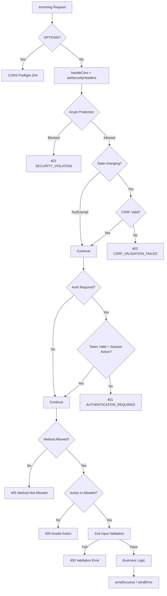

# Design Document: API Endpoint Hardening

## Overview

This design systematically hardens all 11 API endpoints in `api-src/` plus the catch-all route by enforcing consistent security layers across every request path. The current codebase has most security primitives in place (`lib/arcjet.ts`, `lib/csrf.ts`, `lib/auth/middleware.ts`, `lib/validation/middleware.ts`, `lib/errorHandler.ts`) but applies them inconsistently across endpoints. Some endpoints skip CSRF checks, others lack Zod validation on certain actions, method guards are ad-hoc, and security headers are only partially applied.

The hardening effort introduces:
1. A shared `setSecurityHeaders()` utility applied uniformly
2. A documented middleware composition order enforced in every endpoint
3. Missing Zod schemas for unvalidated actions
4. Action allowlist validation at the top of every endpoint
5. Explicit HTTP method guards before action dispatch
6. Idempotency key support on key state-changing operations
7. Bootstrap and catch-all route hardening with Arcjet protection

No new endpoints are created. No database schema changes are required (the `idempotency_keys` table already exists). The work is purely additive hardening of existing code paths.

## Architecture

### Current State

Each endpoint independently composes its security layers in slightly different orders:

```
health.ts:      CORS → (no Arcjet) → (no CSRF) → (no auth) → handler
bootstrap.ts:   CORS → (no Arcjet) → (no CSRF) → secret check → handler
auth.ts:        Arcjet → CORS → CSRF (selective) → handler
payments.ts:    Arcjet → CORS → auth → handler (no CSRF)
documents.ts:   Arcjet → CORS → CSRF → auth → handler
[...path].ts:   CORS → 404 (no Arcjet, no headers)
```

### Target State

All endpoints follow a uniform middleware composition:

```
CORS → Security Headers → Arcjet → CSRF → Auth → Method Guard → Input Validation → Business Logic
```



### Key Design Decision: Composition via Convention, Not Abstraction

Rather than creating a generic middleware pipeline function (which would require refactoring all 11 endpoints), we enforce the composition order via:
1. A documented template in the design
2. A shared `setSecurityHeaders()` utility
3. Existing `withArcjetProtection()` wrapper (already handles CORS preflight + Arcjet)
4. Existing `requireCsrf()` middleware
5. Existing `requireAuth()`/`requireRole()` middleware

This approach minimizes code churn while achieving uniform security. Each endpoint follows the same pattern but retains its action-specific routing logic.

## Components and Interfaces

### New: `lib/securityHeaders.ts`

Shared utility for setting security response headers on all API responses.

```typescript
import type { VercelResponse } from '@vercel/node';

interface SecurityHeaderOptions {
  cacheControl?: string; // Override default 'no-store'
}

/**
 * Apply standard security headers to all API responses.
 * Called after CORS handling, before any business logic.
 *
 * Requirements: 8.1, 8.2, 8.3, 8.4, 8.7
 */
export function setSecurityHeaders(
  res: VercelResponse,
  options?: SecurityHeaderOptions
): void;
```

Headers applied:
- `X-Content-Type-Options: nosniff` (Req 8.1)
- `X-Frame-Options: DENY` (Req 8.2)
- `Cache-Control: no-store` (Req 8.3, overridable for cacheable data)
- `Referrer-Policy: strict-origin-when-cross-origin` (Req 8.4)

### New: `lib/idempotency.ts`

Extracted from `applications.ts` into a shared module so multiple endpoints can use it.

```typescript
/**
 * Validate idempotency key format.
 * Alphanumeric + colons, underscores, hyphens. Max 128 chars.
 * Returns normalized key or empty string if invalid.
 *
 * Requirements: 10.5
 */
export function normalizeIdempotencyKey(
  rawHeader: string | string[] | undefined
): string;

/**
 * Scope key by userId:endpoint:key to prevent cross-user collisions.
 *
 * Requirements: 10.4
 */
export function scopeIdempotencyKey(
  userId: string, endpoint: string, key: string
): string;

/**
 * Check for cached response within 24-hour window.
 * Returns cached response or null.
 *
 * Requirements: 10.1, 10.2
 */
export async function checkIdempotencyKey(
  userId: string, key: string, endpoint: string
): Promise<unknown | null>;

/**
 * Store response for future deduplication.
 * Also cleans up expired keys (>24h).
 *
 * Requirements: 10.3, 10.9
 */
export async function storeIdempotencyKey(
  userId: string, key: string, endpoint: string, responseData: unknown
): Promise<void>;
```

### Modified: `lib/arcjet.ts`

No interface changes. The `withArcjetProtection()` wrapper already handles OPTIONS preflight before Arcjet. Endpoints that currently lack Arcjet wrapping (`health.ts`, `bootstrap.ts`, `[...path].ts`) will be wrapped.

### Modified: `lib/errorHandler.ts`

Minor addition: ensure `Content-Type: application/json` is set on all responses (Req 4.6). The existing `sendSuccess()`, `sendError()`, and `handleError()` already set this header. No interface changes needed — just verification that all code paths use these functions.

### Modified: `lib/cors.ts`

For `health.ts`, a narrower `Access-Control-Allow-Methods` header is needed (Req 8.5). The existing `getCorsHeaders()` returns the full method set. We add an optional parameter:

```typescript
export function getCorsHeaders(
  origin: string | undefined,
  allowedMethods?: string // Override default method set
): Record<string, string>;
```

### Modified Endpoints Summary

| Endpoint | Changes |
|----------|---------|
| `health.ts` | + Arcjet (`general`), + security headers, + narrowed CORS methods |
| `bootstrap.ts` | + Arcjet (`admin`), + security headers, + CSRF on POST, + Zod body validation, + method guard (POST only) |
| `[...path].ts` | + Arcjet (`general`), + security headers |
| `payments.ts` | + CSRF on state-changing, + security headers |
| `admin.ts` | + security headers, + Zod on `handleUpdateSetting`/`handleDeleteSetting`, + action allowlist validation |
| `applications.ts` | + security headers, + Zod on `handleScheduleInterview`, + action allowlist, + UUID validation on `id` param |
| `notifications.ts` | + security headers, + Zod on `handleCheckDuplicate`/`handlePreferences` POST, + action allowlist |
| `email.ts` | + security headers, + action allowlist, + method guard at top level, + idempotency on `send` |
| `catalog.ts` | + security headers, + method guard at top level (reject non-GET/POST/PUT/DELETE) |
| `documents.ts` | + security headers, + path traversal validation on `path` query param, + action allowlist |
| `sessions.ts` | + security headers, + action allowlist |

### Validation Schemas (New/Modified)

New Zod schemas needed in `lib/validation/`:

| Schema | File | Purpose |
|--------|------|---------|
| `scheduleInterviewBodySchema` | `applications.ts` | Replace manual field checks in `handleScheduleInterview` |
| `updateSettingBodySchema` | `admin.ts` | Validate `handleUpdateSetting` body |
| `deleteSettingQuerySchema` | `admin.ts` | Validate `handleDeleteSetting` identifier |
| `checkDuplicateBodySchema` | `notifications.ts` | Validate `handleCheckDuplicate` body |
| `preferencesBodySchema` | `notifications.ts` | Validate `handlePreferences` POST body |
| `bootstrapBodySchema` | (new) `bootstrap.ts` | Validate bootstrap request body |
| `idempotencyKeySchema` | `idempotency.ts` | Validate key format |
| `uuidParamSchema` | `common.ts` | Reusable UUID format validator |
| `paginationQuerySchema` | `common.ts` | Reusable page/pageSize validator |
| `documentPathSchema` | `documents.ts` | Path traversal prevention |

## Data Models

### No Schema Changes Required

All required tables already exist:

- `idempotency_keys` — `key` (PK), `endpoint`, `response_json`, `created_at`
- `csrf_tokens` — `user_id`, `token_hash`, `expires_at`
- `device_sessions` — `user_id`, `is_active`, `last_active`

### Idempotency Key Scoping

Keys are scoped as `{userId}:{endpoint}:{clientKey}` and stored in the `key` column. The 24-hour TTL is enforced by checking `created_at > NOW() - INTERVAL '24 hours'`. Cleanup runs opportunistically on each `storeIdempotencyKey()` call.

### Security Headers Data Flow

Security headers are pure response metadata — no database interaction. The `setSecurityHeaders()` function is called once per request, immediately after CORS handling.


## Correctness Properties

*A property is a characteristic or behavior that should hold true across all valid executions of a system — essentially, a formal statement about what the system should do. Properties serve as the bridge between human-readable specifications and machine-verifiable correctness guarantees.*

### Property 1: Invalid input payloads are rejected with structured errors

*For any* API endpoint action that accepts a request body or query parameters, and *for any* payload that violates the corresponding Zod schema, the endpoint SHALL return HTTP 400 with a response matching `{ success: false, error: string, code: "VALIDATION_ERROR", fieldErrors: Record<string, string> }`.

**Validates: Requirements 1.1, 1.2, 1.3**

### Property 2: Unrecognized actions are rejected with descriptive errors

*For any* endpoint and *for any* string value of the `action` query parameter that is not in that endpoint's allowlist, the endpoint SHALL return HTTP 400 with an error message that lists the valid action values.

**Validates: Requirements 1.4, 7.1, 7.2**

### Property 3: CSRF enforcement on state-changing requests

*For any* authenticated state-changing request (POST, PUT, PATCH, DELETE) to any endpoint that is not CSRF-exempt, if the `X-CSRF-Token` header is missing or contains an invalid/expired token, the endpoint SHALL return HTTP 403 with code `CSRF_VALIDATION_FAILED`.

**Validates: Requirements 2.1, 2.2, 2.3**

### Property 4: Error responses follow the envelope format

*For any* error condition across all endpoints, the response body SHALL be valid JSON matching `{ success: false, error: string, code: string }` where `success` is exactly `false`, `error` is a non-empty string, and `code` is a non-empty string.

**Validates: Requirements 4.1**

### Property 5: Success responses follow the envelope format

*For any* successful operation across all endpoints, the response body SHALL be valid JSON matching `{ success: true, data: T }` where `success` is exactly `true` and `data` is present.

**Validates: Requirements 4.2**

### Property 6: Unexpected errors produce generic 500 responses

*For any* unexpected error thrown during request processing, the endpoint SHALL return HTTP 500 with code `INTERNAL_ERROR` and a generic message that does not contain stack traces, file paths, or internal function names.

**Validates: Requirements 4.3**

### Property 7: PII is sanitized from error messages

*For any* string containing email addresses, UUIDs, JWT tokens, file paths, IP addresses, or phone numbers, the `sanitizeError()` function SHALL replace all PII patterns with placeholder tokens (e.g., `[EMAIL]`, `[ID]`, `[TOKEN]`, `[PATH]`, `[IP]`, `[PHONE]`) such that the output contains none of the original PII.

**Validates: Requirements 4.4**

### Property 8: Unauthenticated requests to protected endpoints are rejected

*For any* protected endpoint action and *for any* request without a valid access token, the endpoint SHALL return HTTP 401 with code `AUTHENTICATION_REQUIRED`.

**Validates: Requirements 5.1**

### Property 9: Insufficient role access is rejected

*For any* admin-only endpoint action and *for any* authenticated user whose role is not in the required role set, the endpoint SHALL return HTTP 403 with code `INSUFFICIENT_PERMISSIONS`.

**Validates: Requirements 5.2**

### Property 10: Reviewer role is blocked from write operations

*For any* write operation (POST, PUT, PATCH, DELETE) on the applications endpoint, and *for any* authenticated user with role `reviewer`, the endpoint SHALL return HTTP 403 with code `INSUFFICIENT_PERMISSIONS`.

**Validates: Requirements 5.5**

### Property 11: Unsupported HTTP methods are rejected

*For any* endpoint action and *for any* HTTP method not in that action's supported method set, the endpoint SHALL return HTTP 405 with the message "Method not allowed".

**Validates: Requirements 6.1**

### Property 12: UUID parameters reject non-UUID strings

*For any* endpoint that reads an `id` or `userId` query parameter, and *for any* string that is not a valid UUID v4 format, the endpoint SHALL return HTTP 400 with a validation error.

**Validates: Requirements 7.3, 7.5**

### Property 13: Pagination parameters are validated

*For any* value of `page` or `pageSize` query parameters that is not a positive integer, or exceeds the upper bound (pageSize > 100), the endpoint SHALL either reject with HTTP 400 or clamp to valid bounds.

**Validates: Requirements 7.4**

### Property 14: Path traversal patterns are rejected

*For any* `path` query parameter value containing `../`, `..\\`, null bytes (`%00`), or other traversal sequences, the documents endpoint SHALL return HTTP 400 with a validation error.

**Validates: Requirements 7.6**

### Property 15: Catalog type parameter is validated against allowlist

*For any* string value of the `type` query parameter to the catalog endpoint that is not one of `programs`, `intakes`, `subjects`, or `institutions`, the endpoint SHALL return HTTP 400.

**Validates: Requirements 7.7**

### Property 16: Security headers are present on all API responses

*For any* API response from any endpoint, the response headers SHALL include `X-Content-Type-Options: nosniff`, `X-Frame-Options: DENY`, `Referrer-Policy: strict-origin-when-cross-origin`, and a `Cache-Control` value (either `no-store` for authenticated responses or an explicit cache directive for public data).

**Validates: Requirements 8.1, 8.2, 8.3, 8.4**

### Property 17: Revoked sessions are rejected

*For any* authenticated request where the session ID in the JWT corresponds to an inactive or revoked session in the `device_sessions` table, the endpoint SHALL return HTTP 401 with code `SESSION_REVOKED`.

**Validates: Requirements 9.1, 9.2**

### Property 18: Idempotency key round-trip

*For any* state-changing request with a valid `Idempotency-Key` header, if the operation succeeds and the response is stored, then a subsequent request with the same scoped key within 24 hours SHALL return the identical cached response without re-executing the operation.

**Validates: Requirements 10.1, 10.2, 10.3**

### Property 19: Idempotency key scoping prevents cross-user collision

*For any* two distinct user IDs and *for any* idempotency key string, the scoped keys `scopeIdempotencyKey(userA, endpoint, key)` and `scopeIdempotencyKey(userB, endpoint, key)` SHALL be different strings.

**Validates: Requirements 10.4**

### Property 20: Idempotency key format validation

*For any* string that contains characters outside `[a-zA-Z0-9:_-]` or exceeds 128 characters, `normalizeIdempotencyKey()` SHALL return an empty string (key ignored).

**Validates: Requirements 10.5**

### Property 21: Middleware short-circuits on rejection

*For any* request that is rejected by an earlier middleware layer (e.g., Arcjet, CSRF, Auth), the response SHALL be sent immediately and no subsequent middleware layer or business logic SHALL execute.

**Validates: Requirements 12.1, 12.2**

### Property 22: Blocked request logs contain no PII

*For any* request blocked by Arcjet, CSRF, or Auth middleware, the log output SHALL not contain email addresses, raw tokens, IP addresses, or other PII — only sanitized identifiers and reason codes.

**Validates: Requirements 12.4**

### Property 23: Catch-all route does not leak internal information

*For any* request to an unmatched route, the 404 response SHALL not contain file paths, available endpoint names, internal routing details, or stack traces.

**Validates: Requirements 13.4**

### Property 24: Content-Type is application/json on all responses

*For any* response from `sendSuccess()` or `sendError()`, the `Content-Type` header SHALL be `application/json`.

**Validates: Requirements 4.6**

## Error Handling

### Error Response Strategy

All endpoints use the existing `sendError()` / `sendSuccess()` / `handleError()` functions from `lib/errorHandler.ts`. These already:
- Set `Content-Type: application/json`
- Sanitize error messages via `sanitizeError()`
- Return the `{ success, error, code }` envelope
- Map common error patterns to appropriate HTTP status codes
- Log errors without PII via `logError()`

### Middleware Error Handling Order

| Layer | Error | HTTP Status | Code | Short-circuits? |
|-------|-------|-------------|------|-----------------|
| CORS | N/A (always succeeds) | 204 for OPTIONS | — | Yes (OPTIONS only) |
| Security Headers | N/A (always succeeds) | — | — | No |
| Arcjet | Rate limit / bot / shield | 403 | `SECURITY_VIOLATION` | Yes |
| Arcjet | Service unavailable | 503 | `SECURITY_SERVICE_ERROR` | Yes |
| CSRF | Missing token | 403 | `CSRF_VALIDATION_FAILED` | Yes |
| CSRF | Invalid/expired token | 403 | `CSRF_VALIDATION_FAILED` | Yes |
| Auth | No token | 401 | `AUTHENTICATION_REQUIRED` | Yes |
| Auth | Expired token | 401 | `TOKEN_EXPIRED` | Yes |
| Auth | Revoked session | 401 | `SESSION_REVOKED` | Yes |
| Auth | Insufficient role | 403 | `INSUFFICIENT_PERMISSIONS` | Yes |
| Method Guard | Wrong method | 405 | `METHOD_NOT_ALLOWED` | Yes |
| Action Allowlist | Unknown action | 400 | `VALIDATION_ERROR` | Yes |
| Input Validation | Schema failure | 400 | `VALIDATION_ERROR` | Yes |
| Business Logic | Unexpected error | 500 | `INTERNAL_ERROR` | Yes |

### Idempotency Error Handling

- If `checkIdempotencyKey()` fails (DB error), the request proceeds normally (fail-open for idempotency, not security)
- If `storeIdempotencyKey()` fails, the operation still succeeds — the key just won't be cached for dedup
- Invalid idempotency key format is silently ignored (key treated as absent)

### Bootstrap Endpoint Error Handling

- Missing `MIGRATE_SECRET` env var → 503 `SERVICE_UNAVAILABLE`
- Invalid secret → 401 `UNAUTHORIZED` (changed from current behavior to use sendError)
- Missing email/password → 400 via Zod validation
- All responses use `sendError()`/`sendSuccess()` envelope

## Testing Strategy

### Dual Testing Approach

This feature requires both unit tests and property-based tests:

- **Property-based tests** (fast-check): Verify universal properties across randomly generated inputs. Each correctness property above maps to one property-based test.
- **Unit tests** (Vitest): Verify specific examples, edge cases, integration points, and endpoint-specific behaviors.

### Property-Based Testing Configuration

- Library: `fast-check` (already in project dependencies)
- Framework: Vitest
- Minimum iterations: 100 per property test (use `numRuns: 100`)
- Each test tagged with: `// Feature: api-endpoint-hardening, Property {N}: {title}`
- Test location: `tests/property/api-hardening/`

### Property Test Plan

| Property | Test File | What to Generate |
|----------|-----------|-----------------|
| P1: Invalid input rejection | `input-validation.property.test.ts` | Random invalid payloads for each Zod schema |
| P2: Action allowlist | `action-allowlist.property.test.ts` | Random strings not in allowlists |
| P3: CSRF enforcement | `csrf-enforcement.property.test.ts` | Random token strings, missing headers |
| P4-P5: Envelope format | `response-envelope.property.test.ts` | Random error/success scenarios |
| P6: Generic 500 | `error-handling.property.test.ts` | Random Error objects |
| P7: PII sanitization | `pii-sanitization.property.test.ts` | Random strings with embedded PII patterns |
| P11: Method guard | `method-guard.property.test.ts` | Random HTTP methods per action |
| P12: UUID validation | `uuid-validation.property.test.ts` | Random non-UUID strings |
| P14: Path traversal | `path-traversal.property.test.ts` | Random paths with traversal patterns |
| P16: Security headers | `security-headers.property.test.ts` | Verify header presence on mock responses |
| P18: Idempotency round-trip | `idempotency.property.test.ts` | Random keys, user IDs, responses |
| P19: Idempotency scoping | `idempotency.property.test.ts` | Random user ID pairs + same key |
| P20: Idempotency format | `idempotency.property.test.ts` | Random strings with special chars |
| P22: Log PII-free | `log-sanitization.property.test.ts` | Random log messages with PII |
| P23: Catch-all no leak | `catch-all.property.test.ts` | Random URL paths |
| P24: Content-Type header | `response-envelope.property.test.ts` | Combined with P4-P5 |

### Unit Test Plan

| Area | Test File | Key Scenarios |
|------|-----------|---------------|
| `setSecurityHeaders()` | `tests/unit/security-headers.test.ts` | Default headers, cache override, health endpoint narrowed methods |
| `normalizeIdempotencyKey()` | `tests/unit/idempotency.test.ts` | Valid keys, too long, invalid chars, empty, array input |
| `scopeIdempotencyKey()` | `tests/unit/idempotency.test.ts` | Scoping format, different users same key |
| Bootstrap hardening | `tests/unit/bootstrap.test.ts` | POST-only, secret validation, Zod body, error envelope |
| Catch-all hardening | `tests/unit/catch-all.test.ts` | 404 envelope, no info leak, security headers |
| CSRF exemptions | `tests/unit/csrf-exemptions.test.ts` | Auth actions exempt, health exempt, bootstrap enforced |
| Action allowlists | `tests/unit/action-allowlists.test.ts` | Each endpoint's valid/invalid actions |
| Path traversal | `tests/unit/path-validation.test.ts` | `../`, `..\\`, `%00`, encoded variants |
| Middleware order | `tests/integration/middleware-order.test.ts` | Verify short-circuit at each layer |

### Test Execution

```bash
# Run all property tests
bun run vitest --run tests/property/api-hardening/

# Run all unit tests for hardening
bun run vitest --run tests/unit/security-headers.test.ts tests/unit/idempotency.test.ts

# Run everything
bun run vitest --run
```
