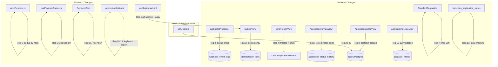

# Design Document: Application Process Hardening

## Overview

This design addresses Requirements 2–22 from the application process hardening spec. Requirement 1 (amount mismatch blocking) is already implemented and excluded from scope. No database schema changes are needed — all existing tables and indexes are leveraged.

The changes span backend (Django/DRF), frontend (React/TypeScript), and database remediation (SQL scripts against Neon Postgres).

## Architecture

All changes are scoped to existing modules. No new services, routes, or database tables are introduced.



### Change Scope by Requirement

| Req | Files Modified | Type |
|-----|---------------|------|
| 2 | `backend/apps/documents/webhook_processor.py` | Add dedup query |
| 3 | `backend/apps/applications/views.py`, wizard `index.tsx` | Wire idempotency_keys + header |
| 4 | `backend/apps/common/error_views.py`, `settings/base.py` | ScopedRateThrottle + limits |
| 5 | `backend/apps/applications/views.py` | Force-bypass notes/changes |
| 6 | `apps/admissions/src/lib/errorReporter.ts` | Hash-based dedup |
| 7 | `backend/apps/common/pagination.py` | `100` → `500` |
| 8 | `backend/apps/applications/views.py` | prefetch_related |
| 9 | `apps/admissions/src/hooks/usePaymentStatus.ts` | setTimeout chain |
| 10 | `backend/apps/applications/serializers.py` | program_intakes lookup |
| 11 | `backend/apps/applications/serializers.py` | Age validator |
| 12 | `backend/apps/common/validators.py`, wizard phone input | E.164 regex |
| 13 | `backend/apps/applications/services.py` | ALLOWED_TRANSITIONS map |
| 14 | wizard `index.tsx` | Enhance aria-live region |
| 15 | `PaymentStep.tsx` | role=alert + focus |
| 16 | `admin/Applications.tsx` | Keyboard handlers + ARIA |
| 17 | wizard `index.tsx` | Focus first errored field |
| 18 | `index.css` or Tailwind config | Contrast fix |
| 19 | `admin/Applications.tsx` | Batched CSV |
| 20-22 | `backend/scripts/remediate_integrity.sql` | SQL remediation |

## Components and Interfaces

### Req 2: Webhook Replay Protection

Add deduplication check in `WebhookProcessor.process()`, after signature validation but before delegation:

```python
# In webhook_processor.py, inside process() after extracting reference
already_processed = WebhookEventLog.objects.filter(
    reference=reference,
    event_type=event_type,
    processed=True,
).exists()

if already_processed:
    WebhookEventLog.objects.create(
        event_type=event_type,
        reference=reference,
        payload=payload,
        signature_valid=signature_valid,
        processed=True,
        processing_error='Duplicate event — already processed',
        created_at=timezone.now(),
    )
    logger.info("Duplicate webhook skipped: ref=%s event=%s", reference, event_type)
    return
```

Uses existing `idx_webhook_event_logs_reference` index. No schema changes.

### Req 3: Submission Idempotency

Backend — add idempotency check in submit view before calling `submit_application()`:

```python
# In ApplicationSubmitView.post()
idempotency_key = request.META.get('HTTP_IDEMPOTENCY_KEY')
if idempotency_key:
    from apps.common.models import IdempotencyKey
    try:
        existing = IdempotencyKey.objects.get(key=idempotency_key)
        return Response(existing.response_json)
    except IdempotencyKey.DoesNotExist:
        pass

# ... proceed with submit_application() ...

# After success, store the response
if idempotency_key:
    IdempotencyKey.objects.create(
        key=idempotency_key,
        endpoint=f'/api/v1/applications/{application_id}/submit/',
        response_json=response_data,
    )
```

Frontend — generate UUID v4 header in wizard submission:

```typescript
const idempotencyKey = crypto.randomUUID()
await apiClient.request(`/applications/${appId}/submit/`, {
  method: 'POST',
  headers: { 'Idempotency-Key': idempotencyKey },
})
```

Cleanup — add inline cleanup after successful insert: `IdempotencyKey.objects.filter(created_at__lt=timezone.now() - timedelta(hours=1)).delete()` (bounded by low volume).

### Req 4: Error Report Endpoint Hardening

```python
# In error_views.py
from rest_framework.throttling import ScopedRateThrottle

class ErrorReportView(APIView):
    authentication_classes = []
    permission_classes = [AllowAny]
    throttle_classes = [ScopedRateThrottle]
    throttle_scope = 'error_report'

    def post(self, request):
        if len(request.body) > 16_384:
            return Response(
                {"success": False, "error": "Payload too large", "code": "PAYLOAD_TOO_LARGE"},
                status=413,
            )
        reports = self._extract_reports(request.data)
        reports = reports[:10]  # Cap at 10 items
        # ... rest of existing logic
```

Settings: add `'error_report': '5/min'` to `DEFAULT_THROTTLE_RATES`.

### Req 5: Admin Force-Bypass Audit Logging

In `ApplicationReviewView`, when `force=True` for approval without payment:

```python
if force and new_status == 'approved':
    bypass_notes = f"[FORCE-BYPASS] Payment verification bypassed. Reason: {reason or 'Not provided'}"
    bypass_changes = {"force_bypass": True, "reason": reason or "Not provided"}
    logger.warning("Force-bypass: app=%s admin=%s status=%s", app.id, request.user.id, new_status)
else:
    bypass_notes = notes
    bypass_changes = None

old_status = transition_application_status(
    application=app, new_status=new_status, changed_by=str(request.user.id),
    notes=bypass_notes, ip_address=ip_hash, user_agent=user_agent,
)
if bypass_changes:
    history = ApplicationStatusHistory.objects.filter(application=app).order_by('-created_at').first()
    if history:
        history.changes = bypass_changes
        history.save(update_fields=['changes'])
```

No schema changes — uses existing `notes`, `changes JSONB`, `ip_address`, `user_agent` columns.

### Req 6: Frontend Error Reporter Deduplication

Replace buffer array with a Map keyed by error hash:

```typescript
const bufferMap = new Map<string, { payload: ErrorPayload; count: number }>()

function computeHash(message: string, stack?: string): string {
  const input = `${message}::${stack ?? ''}`
  let hash = 0
  for (let i = 0; i < input.length; i++) {
    hash = ((hash << 5) - hash + input.charCodeAt(i)) | 0
  }
  return hash.toString(36)
}

function enqueue(payload: ErrorPayload): void {
  const hash = computeHash(payload.message, payload.stack_trace)
  const existing = bufferMap.get(hash)
  if (existing) { existing.count++; return }
  bufferMap.set(hash, { payload, count: 1 })
  if (timer !== null) return
  timer = setTimeout(flush, BATCH_DELAY_MS)
}

function flush(): void {
  timer = null
  if (bufferMap.size === 0) return
  const batch = Array.from(bufferMap.values()).map(({ payload, count }) => ({ ...payload, count }))
  bufferMap.clear()
  // ... POST batch
}
```

### Req 7: Pagination Max Page Size

One-line change in `backend/apps/common/pagination.py`:

```python
max_page_size = 500  # Changed from 100
```

### Req 8: N+1 Query Prevention

```python
# Detail view
app = Application.objects.select_related('user').prefetch_related(
    'applicationdocument_set', 'applicationgrade_set', 'applicationinterview_set',
).get(id=application_id)

# List view (when documents included)
queryset = Application.objects.select_related('user').prefetch_related('applicationdocument_set')
```

### Req 9: Payment Status Polling with Exponential Backoff

Replace `setInterval` with `setTimeout` chaining:

```typescript
const INITIAL_INTERVAL = 2_000
const BACKOFF_FACTOR = 1.5
const MAX_INTERVAL = 30_000

export function usePaymentStatus(applicationId: string) {
  const [status, setStatus] = useState<PaymentStatusValue>(null)
  const intervalRef = useRef(INITIAL_INTERVAL)
  const timeoutRef = useRef<ReturnType<typeof setTimeout> | null>(null)

  const fetchStatus = useCallback(async () => { /* existing fetch logic */ }, [applicationId])

  const scheduleNext = useCallback(() => {
    if (status === 'successful' || status === 'failed') return
    timeoutRef.current = setTimeout(async () => {
      await fetchStatus()
      intervalRef.current = Math.min(intervalRef.current * BACKOFF_FACTOR, MAX_INTERVAL)
      scheduleNext()
    }, intervalRef.current)
  }, [status, fetchStatus])

  const refetch = useCallback(() => {
    intervalRef.current = INITIAL_INTERVAL
    if (timeoutRef.current) clearTimeout(timeoutRef.current)
    fetchStatus().then(scheduleNext)
  }, [fetchStatus, scheduleNext])

  useEffect(() => {
    if (!applicationId) return
    fetchStatus().then(scheduleNext)
    return () => { if (timeoutRef.current) clearTimeout(timeoutRef.current) }
  }, [applicationId])

  return { status, refetch }
}
```

### Req 10: Program-Intake Compatibility Validation

Note: `Application.program` and `Application.intake` are `CharField` fields storing codes/names, not UUIDs. Must resolve to UUIDs first.

```python
from apps.catalog.models import ProgramIntake, Intake, Program

def validate_program_intake(program_code, intake_name):
    program = Program.objects.filter(code=program_code).first()
    intake = Intake.objects.filter(name=intake_name).first()
    if not program or not intake:
        raise ValidationError(
            {"program": "Program or intake not found."},
            code="INVALID_PROGRAM_INTAKE",
        )
    if not ProgramIntake.objects.filter(program_id=program.id, intake_id=intake.id).exists():
        raise ValidationError(
            {"program": "The selected program is not available for this intake."},
            code="INVALID_PROGRAM_INTAKE",
        )
    if not intake.is_active:
        raise ValidationError({"intake": "The selected intake is not currently active."}, code="INACTIVE_INTAKE")
```

Uses existing `program_intakes_program_id_intake_id_key` unique index.

### Req 11: Backend Age Validation

```python
from datetime import date
from dateutil.relativedelta import relativedelta

def validate_minimum_age(date_of_birth):
    if date_of_birth is None:
        return
    age = relativedelta(date.today(), date_of_birth).years
    if age < 16:
        raise ValidationError({"date_of_birth": "Applicants must be at least 16 years old."}, code="MINIMUM_AGE_NOT_MET")
```

### Req 12: International Phone Number Validation

Note: no phone validator currently exists in the codebase. This is a new function.

```python
import re
E164_PATTERN = re.compile(r'^\+?[0-9]{7,15}$')

def validate_phone_e164(phone):
    if not E164_PATTERN.match(phone):
        raise ValidationError({"phone": "Phone must be 7-15 digits, optionally prefixed with +."}, code="INVALID_PHONE")
```

Frontend — update Zod schema in wizard profile step to accept `+` prefix.

### Req 13: Application Status State Machine

```python
ALLOWED_TRANSITIONS: dict[str, set[str]] = {
    'draft': {'submitted'},
    'submitted': {'under_review', 'approved', 'rejected'},
    'under_review': {'approved', 'rejected', 'waitlisted'},
    'waitlisted': {'approved', 'rejected'},
}

def transition_application_status(application, new_status, changed_by, **kwargs):
    old_status = application.status
    allowed = ALLOWED_TRANSITIONS.get(old_status, set())
    if new_status not in allowed:
        logger.warning("Invalid transition: app=%s from=%s to=%s by=%s", application.id, old_status, new_status, changed_by)
        raise ValueError(f"Cannot transition from '{old_status}' to '{new_status}'.")
    # ... existing transition logic continues ...
```

### Req 14: Wizard Step Accessible Announcements

```tsx
<div aria-live="polite" className="sr-only">
  {`Step ${currentStepIndex + 1} of ${wizardSteps.length}: ${currentStepConfig.title}`}
  {validationErrors.length > 0 ? '. Validation errors found.' : ''}
</div>
```

Ensure this element is in the DOM before the first step renders.

### Req 15: Payment Error Recovery Accessibility

```tsx
{paymentStatus === 'failed' && (
  <div role="alert" className="rounded-xl border border-destructive/30 bg-destructive/5 p-4">
    <p className="font-semibold text-destructive">Payment failed: {statusMessage}</p>
    <p className="text-sm text-muted-foreground">You can retry or contact support.</p>
    <Button ref={retryRef} onClick={handleRetry}>Retry payment</Button>
  </div>
)}
// Focus retry button on failure:
useEffect(() => { if (paymentStatus === 'failed') retryRef.current?.focus() }, [paymentStatus])
```

### Req 16: Admin Applications Grid Keyboard Navigation

Add `onKeyDown` to virtualized rows, `role="grid"` to container, `role="row"` + `aria-rowindex` to rows:

```tsx
const handleRowKeyDown = (e: React.KeyboardEvent, appId: string, index: number) => {
  if (e.key === 'ArrowDown') focusRow(index + 1)
  if (e.key === 'ArrowUp') focusRow(index - 1)
  if (e.key === 'Enter' || e.key === ' ') navigate(`/admin/applications/${appId}`)
}
```

### Req 17: Validation Error Focus Management

```tsx
useEffect(() => {
  if (validationErrors.length > 0) {
    const first = document.querySelector('[aria-invalid="true"]')
    if (first instanceof HTMLElement) first.focus()
  }
}, [validationErrors])
```

Add `aria-describedby` linking each field to its error message element.

### Req 18: Error Display Color Contrast

Audit `--destructive` CSS variable. Ensure foreground-to-background ratio >= 4.5:1. Add error icon alongside color.

### Req 19: Admin Export Streaming

```typescript
async function exportCSV(apps: Application[]) {
  const BATCH = 500
  const parts: string[] = [headerRow]
  for (let i = 0; i < apps.length; i += BATCH) {
    parts.push(apps.slice(i, i + BATCH).map(formatRow).join('\n'))
    await new Promise(r => setTimeout(r, 0)) // yield to main thread
  }
  downloadBlob(new Blob(parts, { type: 'text/csv' }), `export-${Date.now()}.csv`)
}
```

### Req 20-22: Database Remediation

```sql
-- Req 20: Fix approved app with NULL payment_status
UPDATE applications SET payment_status = 'force_approved',
  admin_feedback = COALESCE(admin_feedback,'') || E'\n[REMEDIATION] payment_status backfilled.',
  updated_at = NOW()
WHERE application_number = 'APP-20260401-D169738A' AND payment_status IS NULL;

INSERT INTO application_status_history (application_id, status, old_status, new_status, notes, created_at)
SELECT id, 'approved', 'approved', 'approved', '[REMEDIATION] payment_status backfilled to force_approved', NOW()
FROM applications WHERE application_number = 'APP-20260401-D169738A';

-- Req 21: Flag draft app with verified payment
UPDATE applications SET admin_feedback = COALESCE(admin_feedback,'') || E'\n[REMEDIATION] Draft with verified payment — flagged for review.',
  updated_at = NOW()
WHERE application_number = 'MIHAS202661975' AND status = 'draft' AND payment_status = 'verified';

INSERT INTO application_status_history (application_id, status, old_status, new_status, notes, created_at)
SELECT id, 'draft', 'draft', 'draft', '[REMEDIATION] Flagged: draft with verified payment', NOW()
FROM applications WHERE application_number = 'MIHAS202661975';

-- Req 22: Backfill missing submitted_at
UPDATE applications a SET submitted_at = COALESCE(
  (SELECT MIN(h.created_at) FROM application_status_history h WHERE h.application_id = a.id AND h.new_status = 'submitted'),
  a.created_at
), updated_at = NOW()
WHERE a.status != 'draft' AND a.submitted_at IS NULL;
```

## Data Models

No schema changes. All modifications use existing tables and columns:

- `webhook_event_logs` — `reference`, `event_type`, `processed`, `processing_error`
- `idempotency_keys` — `key`, `endpoint`, `response_json`, `created_at`
- `application_status_history` — `notes`, `changes`, `ip_address`, `user_agent`
- `program_intakes` — `program_id`, `intake_id` with unique constraint
- `applications` — `payment_status`, `admin_feedback`, `submitted_at`

## Correctness Properties

### Property 1: Webhook deduplication prevents reprocessing
*For any* webhook with a `reference` and `event_type` that already has `processed=True` in `webhook_event_logs`, the processor must not delegate to `PaymentService`.
**Validates: Req 2.1, 2.2**

### Property 2: Idempotency key returns cached response
*For any* submission with an `Idempotency-Key` matching an existing row, the response must equal stored `response_json` without executing `submit_application()`.
**Validates: Req 3.2**

### Property 3: Error report rate limiting
*For any* sequence of >5 requests from the same IP within 60s, the 6th must receive 429.
**Validates: Req 4.1**

### Property 4: Error report payload size limit
*For any* request body >16 KB, the response must be 413.
**Validates: Req 4.2**

### Property 5: Error report batch cap
*For any* batch with >10 items, only the first 10 are processed.
**Validates: Req 4.4**

### Property 6: Force-bypass creates audit trail
*For any* transition with `force=True`, the history entry must contain `[FORCE-BYPASS]` in `notes` and `{"force_bypass": true}` in `changes`.
**Validates: Req 5.1, 5.4**

### Property 7: Frontend error deduplication
*For any* set of identical errors within 5s, only one report is sent with `count` equal to occurrences.
**Validates: Req 6.1, 6.3**

### Property 8: Pagination max page size cap
*For any* request with `pageSize > 500`, actual page size must be 500.
**Validates: Req 7.1, 7.2**

### Property 9: Exponential backoff interval growth
*For any* sequence of N polls while `pending`, the Nth interval must equal `min(2000 * 1.5^(N-1), 30000)` ms.
**Validates: Req 9.1, 9.2**

### Property 10: Program-intake validation rejects invalid combos
*For any* program/intake pair not in `program_intakes`, create must return 400 `INVALID_PROGRAM_INTAKE`.
**Validates: Req 10.1, 10.2**

### Property 11: Age validation rejects underage
*For any* DOB where age < 16, create must return 400 `MINIMUM_AGE_NOT_MET`.
**Validates: Req 11.1, 11.2**

### Property 12: E.164 phone validation
*For any* phone matching `^\+?[0-9]{7,15}$`, accept. Otherwise reject.
**Validates: Req 12.1, 12.2**

### Property 13: State machine rejects invalid transitions
*For any* `(old, new)` pair not in `ALLOWED_TRANSITIONS`, `transition_application_status()` must raise `ValueError`.
**Validates: Req 13.1, 13.2**

### Property 14: Wizard step announcement format
*For any* step change, aria-live region must contain "Step N of M: title".
**Validates: Req 14.1**

### Property 15: Payment error alert role
*For any* payment failure, error container must have `role="alert"`.
**Validates: Req 15.1**

### Property 16: Error text contrast ratio
*For any* error text, foreground-to-background contrast must be >= 4.5:1.
**Validates: Req 18.1**

## Error Handling

### Backend
- Webhook dedup query failure → fall through to normal processing (fail-open)
- Idempotency key lookup failure → fall through to `SELECT FOR UPDATE` guard
- Program-intake / age / phone validation → return 400 with structured error
- State machine violation → raise `ValueError`, caught by view as 400

### Frontend
- Error reporter hash collision → acceptable (low probability)
- Payment polling cleanup → `setTimeout` chain stops on unmount via cleanup
- Idempotency key → `crypto.randomUUID()` available in all modern browsers

## Testing Strategy

### Backend (pytest + hypothesis)
- Property tests: state machine transitions, phone validation, age validation
- Unit tests: webhook dedup, idempotency, error endpoint hardening, force-bypass audit
- Integration tests: program-intake validation against test database

### Frontend (vitest + fast-check)
- Property tests: exponential backoff intervals, error reporter deduplication
- Unit tests: wizard aria-live announcements, payment error role="alert", keyboard nav

### Test Files
- Backend: `backend/tests/unit/test_application_hardening.py`, `backend/tests/property/test_application_hardening.py`
- Frontend: `apps/admissions/tests/property/application-process-hardening.test.tsx`, `apps/admissions/tests/unit/application-process-hardening.test.tsx`
- Test commands: `cd backend && python3 -m pytest`, `cd apps/admissions && bun run test`
