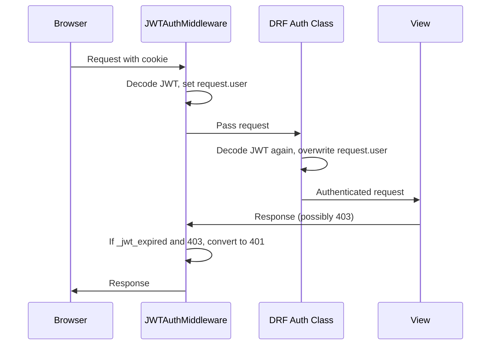
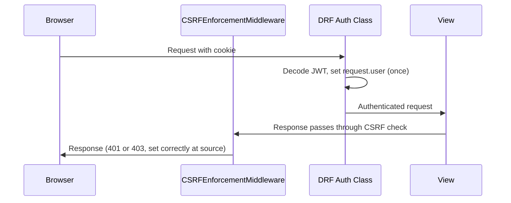
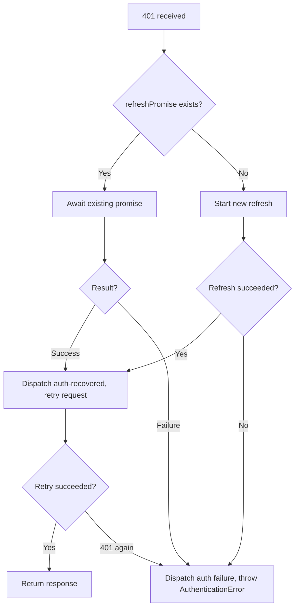

# Design Document: Auth Architecture Simplification

## Overview

This design simplifies the MIHAS platform's authentication architecture by removing the redundant `JWTAuthenticationMiddleware` from the Django middleware chain, making every view's authentication strategy explicit via DRF class-level declarations, enforcing an unambiguous 401/403 HTTP status contract, and reducing frontend auth complexity in the `ApiClient` and `AuthContext`.

The current architecture has four overlapping auth layers that conflict:
1. `JWTAuthenticationMiddleware` sets `request.user` on the raw `HttpRequest` before DRF runs
2. `JWTCookieAuthentication` (DRF class) overwrites the middleware's user during DRF authentication
3. The middleware's `__call__` method post-processes responses, converting 403→401 when `_jwt_expired` is flagged
4. The frontend `ApiClient` has cooldown timers, cached refresh results, and duplicate 403-handling paths that mirror the backend's ambiguity

After this simplification:
- DRF authentication classes are the sole mechanism for setting `request.user`
- Every view explicitly declares one of three auth strategies: auth-exempt, public-personalizable, or protected
- 401 always means "unauthenticated", 403 always means "forbidden but authenticated" (with CSRF errors using a distinct code within 403)
- The frontend `ApiClient` uses a simple promise-lock for refresh with no cooldown timers
- `AuthContext` visibility handling has no payment-in-progress guards

## Architecture

### Current Auth Flow (Before)



### Target Auth Flow (After)



### View Classification Strategy

Every view falls into exactly one of three categories:

| Category | `authentication_classes` | `permission_classes` | Examples |
|----------|------------------------|---------------------|----------|
| Auth-Exempt | `[]` | `[AllowAny]` | login, register, refresh, password-reset, webhooks, health, error report, platform meta |
| Public-Personalizable | `[OptionalJWTCookieAuthentication]` | `[AllowAny]` | catalog (programs, intakes, subjects, institutions), session check, application tracking, public job listings |
| Protected | DRF default `[JWTCookieAuthentication]` | `[IsAuthenticated]` or role-based | all other endpoints |

### Frontend Simplification Strategy

The `ApiClient.attemptRefresh()` method is reduced to a pure promise-lock pattern:



Removed from `ApiClient`:
- `lastRefreshSuccessTime`, `lastRefreshFailureTime`, `lastRefreshResult`
- `REFRESH_COOLDOWN_MS`, `REFRESH_FAILURE_COOLDOWN_MS`
- The 403 `TOKEN_EXPIRED` intercept path (no longer needed since backend returns 401 directly)

Removed from `AuthContext`:
- `_isPaymentInProgress()` import and checks in visibility handler and auth failure dispatch

## Components and Interfaces

### Backend Components

#### 1. Settings Change (`backend/config/settings/base.py`)

Remove `apps.common.middleware.JWTAuthenticationMiddleware` from the `MIDDLEWARE` list. The middleware ordering becomes:

```
1. SecurityHeadersMiddleware
2. django.middleware.security.SecurityMiddleware
3. whitenoise.middleware.WhiteNoiseMiddleware
4. corsheaders.middleware.CorsMiddleware
5. RequestIDMiddleware
6. RateLimitMiddleware
7. django.middleware.common.CommonMiddleware
8. CSRFEnforcementMiddleware          ← was position 9, moves up
9. AuditMiddleware                     ← was position 10, moves up
10. ReadOnlyMiddleware                 ← was position 11, moves up
11. IdempotencyMiddleware              ← was position 12, moves up
12. Django session/auth/messages/clickjacking defaults
```

#### 2. Exception Handler Fix (`backend/apps/common/exceptions.py`)

Update `envelope_exception_handler` to ensure `AuthenticationFailed` and `NotAuthenticated` exceptions always map to HTTP 401 with the exception's error code preserved:

```python
def envelope_exception_handler(exc, context):
    response = exception_handler(exc, context)
    # ... existing None handling ...

    if isinstance(exc, (AuthenticationFailed, NotAuthenticated)):
        # Force 401 status regardless of what DRF's default handler chose
        response.status_code = 401
        exc_code = getattr(exc, 'detail', {})
        if hasattr(exc, 'get_codes'):
            code_val = exc.get_codes()
            code = code_val.upper() if isinstance(code_val, str) and code_val else "AUTHENTICATION_REQUIRED"
        elif isinstance(exc, NotAuthenticated):
            code = "AUTHENTICATION_REQUIRED"
        else:
            code = "AUTHENTICATION_REQUIRED"
    else:
        code = error_code_map.get(response.status_code, "INTERNAL_ERROR")
```

This ensures DRF never returns 403 for auth failures, eliminating the need for the middleware's 403→401 conversion.

#### 3. View Reclassification

Views currently using `authentication_classes = []` that should become public-personalizable:

| View | File | Current | Target |
|------|------|---------|--------|
| `ProgramListView` | `catalog/views.py` | `[]` | `[OptionalJWTCookieAuthentication]` |
| `IntakeListView` | `catalog/views.py` | `[]` | `[OptionalJWTCookieAuthentication]` |
| `SubjectListView` | `catalog/views.py` | `[]` | `[OptionalJWTCookieAuthentication]` |
| `InstitutionListView` | `catalog/views.py` | `[]` | `[OptionalJWTCookieAuthentication]` |
| `ApplicationTrackView` | `applications/views.py` | `[]` | `[OptionalJWTCookieAuthentication]` |
| `JobListView` | `jobs/views.py` | `[]` | `[OptionalJWTCookieAuthentication]` |
| `JobDetailView` | `jobs/views.py` | `[]` | `[OptionalJWTCookieAuthentication]` |

Views that remain auth-exempt (`authentication_classes = []`):

| View | File | Reason |
|------|------|--------|
| `LoginView` | `accounts/views.py` | Auth endpoint — no token expected |
| `RegisterView` | `accounts/views.py` | Auth endpoint — no token expected |
| `RefreshView` | `accounts/views.py` | Uses refresh cookie, not access token |
| `PasswordResetRequestView` | `accounts/views.py` | Auth endpoint — no token expected |
| `PasswordResetConfirmView` | `accounts/views.py` | Auth endpoint — no token expected |
| `LivenessView` | `common/health.py` | Infrastructure probe |
| `ReadinessView` | `common/health.py` | Infrastructure probe |
| `PlatformMetaView` | `common/meta_views.py` | Public metadata |
| `ErrorReportView` | `common/error_views.py` | Unauthenticated error reporting |
| `LencoWebhookView` | `documents/views.py` | Webhook — HMAC-validated, not JWT |
| `TelegramWebhookView` | `integrations/views.py` | Webhook — no JWT |
| `EmailDeliveryWebhookView` | `integrations/email_views.py` | Webhook — no JWT |

Views that remain protected (DRF default `[JWTCookieAuthentication]`):
All other views that don't explicitly set `authentication_classes`. These inherit from `REST_FRAMEWORK.DEFAULT_AUTHENTICATION_CLASSES`.

`SessionView` already uses `[OptionalJWTCookieAuthentication]` — no change needed.

#### 4. `JWTCookieAuthentication` — Already Correct

The `authenticate_header` method already returns `'Bearer realm="api"'`, which tells DRF to return 401 instead of 403 for authentication failures. No change needed.

#### 5. `OptionalJWTCookieAuthentication` — Already Correct

Already catches `AuthenticationFailed` and returns `None`. No change needed.

### Frontend Components

#### 1. `ApiClient` Simplification (`apps/admissions/src/services/client.ts`)

Remove from the class:
- `lastRefreshSuccessTime: number`
- `lastRefreshFailureTime: number`
- `lastRefreshResult: boolean`
- `static readonly REFRESH_COOLDOWN_MS`
- `static readonly REFRESH_FAILURE_COOLDOWN_MS`

Simplify `attemptRefresh()` to:
```typescript
private async attemptRefresh(): Promise<boolean> {
  if (this.refreshPromise) return this.refreshPromise;
  this.refreshPromise = this.performRefresh();
  try {
    const result = await this.refreshPromise;
    if (result) {
      dispatchAuthRecovered();
    }
    return result;
  } finally {
    this.refreshPromise = null;
  }
}
```

Remove the 403 `TOKEN_EXPIRED` intercept block from `executeRequest()`. After the backend fix, expired tokens always return 401, so the existing 401 intercept handles everything. The 403 CSRF intercept remains unchanged.

#### 2. `AuthContext` Simplification (`apps/admissions/src/contexts/AuthContext.tsx`)

Remove:
- `import { isPaymentInProgress as _isPaymentInProgress } from '@/hooks/useApplicationPaymentAction'`
- The `if (_isPaymentInProgress()) return` guard in the auth failure callback
- The `if (_isPaymentInProgress()) return` guard in the visibility change handler

The visibility handler becomes:
```typescript
function handleVisibilityChange() {
  if (document.visibilityState === 'hidden') {
    hasHiddenOnce = true
  } else if (document.visibilityState === 'visible' && hasHiddenOnce) {
    const now = Date.now()
    if (now - lastSessionInvalidationRef.current >= VISIBILITY_DEBOUNCE_MS) {
      lastSessionInvalidationRef.current = now
      queryClient.invalidateQueries({ queryKey: ['auth', 'session'] })
    }
  }
}
```

#### 3. `useSessionListener` — No Changes

The hook already serves as the single source of truth for auth state. Its interface remains unchanged.

## Data Models

No database schema changes are required. The existing models are unaffected:

- `CSRFToken` — continues to store hashed CSRF tokens per user
- `DeviceSession` — continues to track active sessions
- `Profile` — continues to be the user model
- `PasswordResetToken` — continues to handle password reset flow

The `JWTUser` lightweight object (built from JWT payload, no DB lookup) continues to be the `request.user` for authenticated requests — now set exclusively by DRF authentication classes instead of being set twice (middleware + DRF).

