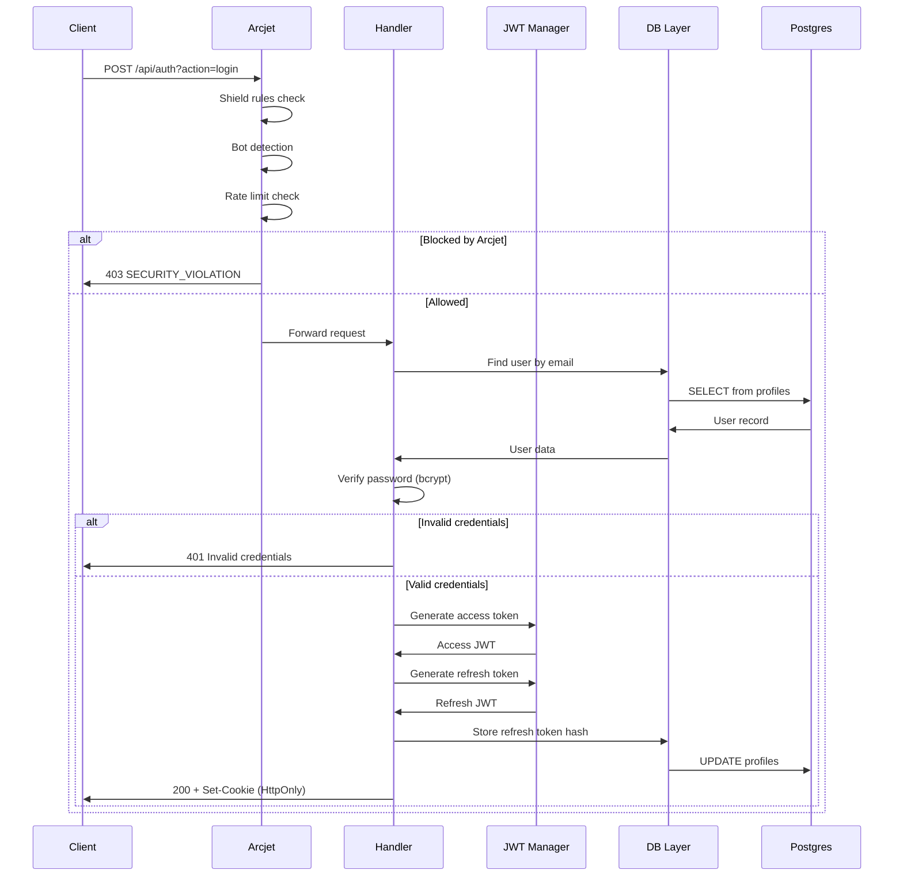

# Design Document: Auth Security Hardening

## Overview

This design document specifies the technical architecture for replacing Supabase Auth with a custom Bun-native authentication system, integrating Arcjet security perimeter, implementing Bun-native realtime, and abstracting the database layer for Neon migration. The system is designed for a production Vercel deployment with strict security requirements and zero tolerance for silent failures.

### Design Principles

1. **Zero Supabase Auth Dependencies**: All authentication flows use Bun-native crypto and jose library
2. **Fail Secure**: Security failures block requests rather than allowing them through
3. **Deterministic Responses**: All error responses are predictable and don't leak internal state
4. **Database Agnostic**: SQL abstraction enables Supabase → Neon migration with zero code changes
5. **Audit Everything**: All security events are logged without PII

### Target Architecture

```
Browser
  ↓
Arcjet Shield (shield, bot detection, rate limits)
  ↓
Bun API Layer (Vercel Serverless)
  ├── Auth (/api/auth?action=login|logout|refresh|session)
  ├── Sessions (/api/sessions?action=track|list|revoke)
  ├── Admin (/api/admin?action=dashboard|users|settings)
  └── Realtime (/api/realtime?action=connect|poll)
  ↓
DB Abstraction Layer
  ↓
Postgres (Supabase Phase 1 → Neon Phase 2)
```

## Architecture

### Component Diagram

```mermaid
graph TB
    subgraph "Client Layer"
        Browser[Browser/PWA]
        AuthStore[Zustand Auth Store]
        ReactQuery[React Query]
    end

    subgraph "Security Layer"
        Arcjet[Arcjet Shield]
        RateLimiter[Rate Limiter]
        BotDetection[Bot Detection]
    end

    subgraph "API Layer"
        AuthAPI[/api/auth]
        SessionAPI[/api/sessions]
        AdminAPI[/api/admin]
        RealtimeAPI[/api/realtime]
    end

    subgraph "Auth Core"
        JWTManager[JWT Manager]
        PasswordHasher[Password Hasher]
        CookieManager[Cookie Manager]
        TokenRotation[Token Rotation]
    end

    subgraph "Data Layer"
        DBAbstraction[DB Abstraction]
        SupabaseDriver[Supabase REST Driver]
        NeonDriver[Neon Serverless Driver]
    end

    subgraph "Storage"
        Postgres[(Postgres DB)]
        Profiles[profiles table]
        Sessions[device_sessions table]
        AuditLogs[audit_logs table]
    end

    Browser --> Arcjet
    Arcjet --> RateLimiter
    Arcjet --> BotDetection
    RateLimiter --> AuthAPI
    BotDetection --> AuthAPI
    
    AuthAPI --> JWTManager
    AuthAPI --> PasswordHasher
    AuthAPI --> CookieManager
    JWTManager --> TokenRotation
    
    AuthAPI --> DBAbstraction
    SessionAPI --> DBAbstraction
    AdminAPI --> DBAbstraction
    
    DBAbstraction --> SupabaseDriver
    DBAbstraction --> NeonDriver
    SupabaseDriver --> Postgres
    NeonDriver --> Postgres
    
    Postgres --> Profiles
    Postgres --> Sessions
    Postgres --> AuditLogs
    
    Browser --> AuthStore
    AuthStore --> ReactQuery
    ReactQuery --> AuthAPI
```

### Request Flow Diagram



## Components and Interfaces

### 1. Auth System (`api/_lib/auth.ts`)

The core authentication module providing password hashing, JWT management, and cookie handling.

```typescript
// Password Operations
interface PasswordHasher {
  hashPassword(password: string): Promise<string>;
  verifyPassword(password: string, hash: string): Promise<boolean>;
}

// JWT Operations
interface JWTManager {
  generateAccessToken(userId: string, email: string, role: UserRole, permissions: string[]): Promise<string>;
  generateRefreshToken(userId: string): Promise<string>;
  verifyAccessToken(token: string): Promise<JWTPayload>;
  verifyRefreshToken(token: string): Promise<{ sub: string }>;
}

// Cookie Operations
interface CookieManager {
  setAuthCookies(res: VercelResponse, accessToken: string, refreshToken: string): void;
  clearAuthCookies(res: VercelResponse): void;
  extractBearerToken(req: VercelRequest): string | null;
}

// Auth Context
interface AuthContext {
  userId: string;
  email: string;
  role: UserRole;
  permissions: string[];
}

// Middleware
interface AuthMiddleware {
  getAuthUser(req: VercelRequest): Promise<AuthContext | null>;
  requireAuth(req: VercelRequest): Promise<AuthContext>;
  requireRole(req: VercelRequest, roles: UserRole[]): Promise<AuthContext>;
}
```

### 2. Arcjet Shield (`api/_lib/arcjet.ts`)

Security perimeter with route-specific rate limiting and attack protection.

```typescript
// Rate Limit Configurations
interface RateLimitConfig {
  auth: FixedWindowConfig;      // 5 req / 5 min
  session: TokenBucketConfig;   // 30 req / 10 min
  admin: FixedWindowConfig;     // 20 req / 10 min
  notification: TokenBucketConfig; // 50 req / 10 min
  general: FixedWindowConfig;   // 100 req / 10 min
}

// Protection Wrapper
type ProtectedHandler = (req: VercelRequest, res: VercelResponse) => Promise<void>;

interface ArcjetShield {
  withArcjetProtection(handler: ProtectedHandler, routeType: keyof RateLimitConfig): ProtectedHandler;
  arcjetProtect(req: VercelRequest, routeType: keyof RateLimitConfig): Promise<{ allowed: boolean; reason?: string }>;
  handleArcjetDecision(decision: ArcjetDecision, res: VercelResponse): boolean;
}
```

### 3. Database Abstraction (`api/_lib/db.ts`)

Vendor-agnostic database layer supporting Supabase and Neon.

```typescript
// Query Types
interface QueryConfig {
  text: string;
  values?: unknown[];
}

interface QueryResult<T = Record<string, unknown>> {
  rows: T[];
  rowCount: number;
  command: string;
}

// Database Operations
interface DatabaseLayer {
  query<T>(queryText: string, params?: unknown[]): Promise<QueryResult<T>>;
  transaction<T>(operations: QueryConfig[]): Promise<QueryResult<T>[]>;
  verifyDatabaseSchema(): Promise<{ ok: boolean; errors: string[] }>;
}

// User Queries
interface UserQueries {
  findByEmail(email: string): QueryConfig;
  findById(id: string): QueryConfig;
  create(id: string, email: string, passwordHash: string, role: string, firstName: string, lastName: string): QueryConfig;
  updatePassword(id: string, passwordHash: string): QueryConfig;
  updateRefreshToken(id: string, tokenHash: string | null): QueryConfig;
}

// Session Queries
interface SessionQueries {
  create(id: string, userId: string, deviceInfo: string, ipAddress: string): QueryConfig;
  updateActivity(id: string): QueryConfig;
  deactivate(id: string): QueryConfig;
  deactivateAllForUser(userId: string): QueryConfig;
}
```

### 4. Realtime System (`api/_lib/realtime.ts`)

SSE-based realtime with polling fallback.

```typescript
// Event Types
type SSEEventType = 
  | "application_update"
  | "notification"
  | "payment_update"
  | "interview_scheduled"
  | "document_processed"
  | "ping";

interface SSEEvent {
  id: string;
  type: SSEEventType;
  data: Record<string, unknown>;
  timestamp: string;
  userId?: string;
}

// Realtime Operations
interface RealtimeSystem {
  initializeSSE(req: VercelRequest, res: VercelResponse, userId: string): boolean;
  sendSSEEvent(res: VercelResponse, event: SSEEvent): void;
  broadcastToUser(userId: string, type: SSEEventType, data: Record<string, unknown>): void;
  broadcastToAll(type: SSEEventType, data: Record<string, unknown>): void;
  getEventsForPolling(userId: string, lastEventId?: string): SSEEvent[];
}
```

### 5. API Endpoints

#### Auth API (`api/auth.ts`)

| Action | Method | Auth Required | Arcjet Protected | Description |
|--------|--------|---------------|------------------|-------------|
| login | POST | No | Yes (5/5min) | Authenticate with email/password |
| logout | POST | Yes | Yes | Clear tokens, revoke refresh |
| refresh | POST | No (cookie) | Yes | Rotate tokens |
| session | GET | Yes | Yes | Get current session info |
| register | POST | Admin only | Yes | Create new user |

#### Sessions API (`api/sessions.ts`)

| Action | Method | Auth Required | Arcjet Protected | Description |
|--------|--------|---------------|------------------|-------------|
| track | POST | Yes | Yes (30/10min) | Track device session |
| list | GET | Yes | Yes | List user's active sessions |
| revoke | POST | Yes | Yes | Revoke specific session |
| revoke-all | POST | Yes | Yes | Revoke all sessions |

#### Admin API (`api/admin.ts`)

| Action | Method | Auth Required | Arcjet Protected | Description |
|--------|--------|---------------|------------------|-------------|
| dashboard | GET | Admin | Yes (20/10min) | Get dashboard stats |
| users | GET | Admin | Yes | List users with pagination |
| settings | GET/POST/PUT/DELETE | Admin | Yes | Manage system settings |

#### Realtime API (`api/realtime.ts`)

| Action | Method | Auth Required | Arcjet Protected | Description |
|--------|--------|---------------|------------------|-------------|
| connect | GET | Yes | Yes | Establish SSE connection |
| poll | GET | Yes | Yes | Poll for events (fallback) |

## Data Models

### Database Schema

#### profiles Table (Extended)

```sql
-- Existing columns preserved for backward compatibility
-- New columns added for custom auth

ALTER TABLE profiles ADD COLUMN IF NOT EXISTS password_hash VARCHAR(255);
ALTER TABLE profiles ADD COLUMN IF NOT EXISTS refresh_token_hash VARCHAR(255);
ALTER TABLE profiles ADD COLUMN IF NOT EXISTS password_changed_at TIMESTAMPTZ;
ALTER TABLE profiles ADD COLUMN IF NOT EXISTS failed_login_attempts INTEGER DEFAULT 0;
ALTER TABLE profiles ADD COLUMN IF NOT EXISTS locked_until TIMESTAMPTZ;

-- Index for email lookups
CREATE INDEX IF NOT EXISTS idx_profiles_email ON profiles(email);

-- Index for refresh token lookups
CREATE INDEX IF NOT EXISTS idx_profiles_refresh_token ON profiles(refresh_token_hash) WHERE refresh_token_hash IS NOT NULL;
```

#### device_sessions Table

```sql
CREATE TABLE IF NOT EXISTS device_sessions (
  id UUID PRIMARY KEY DEFAULT gen_random_uuid(),
  user_id UUID NOT NULL REFERENCES profiles(id) ON DELETE CASCADE,
  device_info JSONB NOT NULL DEFAULT '{}',
  ip_address VARCHAR(45),
  user_agent TEXT,
  is_active BOOLEAN DEFAULT true,
  last_activity TIMESTAMPTZ DEFAULT NOW(),
  created_at TIMESTAMPTZ DEFAULT NOW(),
  expires_at TIMESTAMPTZ DEFAULT (NOW() + INTERVAL '30 days')
);

CREATE INDEX IF NOT EXISTS idx_device_sessions_user_id ON device_sessions(user_id);
CREATE INDEX IF NOT EXISTS idx_device_sessions_active ON device_sessions(user_id, is_active) WHERE is_active = true;
```

#### audit_logs Table (Existing, Referenced)

```sql
-- Existing table, used for auth event logging
-- Columns: id, actor_id, action, entity_type, entity_id, changes, ip_address, user_agent, created_at
```

### TypeScript Types

```typescript
// User Role Enum
export const USER_ROLES = {
  SUPER_ADMIN: "super_admin",
  ADMIN: "admin",
  REVIEWER: "reviewer",
  STUDENT: "student",
} as const;

export type UserRole = typeof USER_ROLES[keyof typeof USER_ROLES];

// JWT Payload
export interface JWTPayload {
  sub: string;           // User ID
  email: string;
  role: UserRole;
  permissions: string[];
  type: "access" | "refresh";
  iat?: number;
  exp?: number;
  iss?: string;
  aud?: string;
}

// Auth Context (returned from middleware)
export interface AuthContext {
  userId: string;
  email: string;
  role: UserRole;
  permissions: string[];
}

// Session Record
export interface DeviceSession {
  id: string;
  userId: string;
  deviceInfo: {
    browser?: string;
    os?: string;
    device?: string;
  };
  ipAddress: string;
  userAgent: string;
  isActive: boolean;
  lastActivity: Date;
  createdAt: Date;
  expiresAt: Date;
}

// Permission Sets (deterministic, no DB lookup)
export const ROLE_PERMISSIONS: Record<UserRole, string[]> = {
  super_admin: [
    "users:read", "users:write", "users:delete",
    "applications:read", "applications:write", "applications:review",
    "programs:read", "programs:write",
    "payments:read", "payments:verify",
    "documents:read", "documents:verify",
    "analytics:read",
    "settings:read", "settings:write",
  ],
  admin: [
    "users:read",
    "applications:read", "applications:write", "applications:review",
    "programs:read",
    "payments:read", "payments:verify",
    "documents:read", "documents:verify",
    "analytics:read",
  ],
  reviewer: [
    "applications:read", "applications:review",
    "documents:read",
  ],
  student: [
    "applications:create", "applications:read_own", "applications:update_own",
    "documents:upload_own", "documents:read_own",
    "payments:make_own", "payments:read_own",
    "profile:read_own", "profile:update_own",
  ],
};
```

### API Response Types

```typescript
// Standard Success Response
interface SuccessResponse<T> {
  success: true;
  data: T;
}

// Standard Error Response
interface ErrorResponse {
  success: false;
  error: string;
  code: string;
}

// Login Response
interface LoginResponse {
  user: {
    id: string;
    email: string;
    role: UserRole;
    permissions: string[];
  };
  message: string;
}

// Session Response
interface SessionResponse {
  user: {
    id: string;
    email: string;
    role: UserRole;
    permissions: string[];
  };
  authenticated: true;
}

// Arcjet Block Response
interface ArcjetBlockResponse {
  success: false;
  error: "Request blocked by security policy";
  code: "SECURITY_VIOLATION";
}
```

