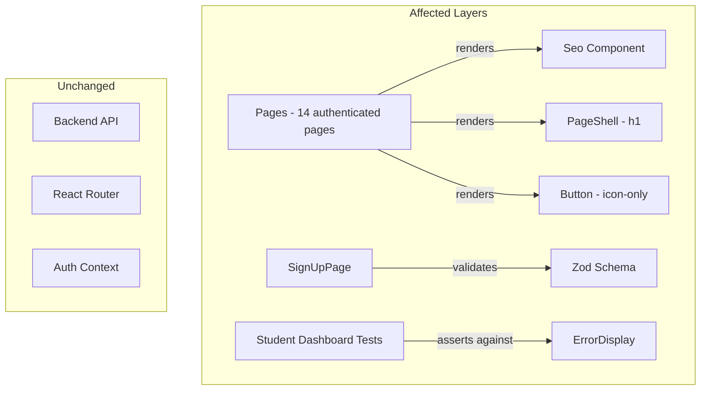

# Design Document: Authenticated Pages Polish

## Overview

This design addresses six frontend-only improvements within `apps/admissions/` that close gaps in SEO metadata, heading hierarchy, accessibility labels, signup friction, and test reliability. All changes target existing React components and test files — no backend modifications, no new routes, no new dependencies.

The six workstreams are:

1. Add `<Seo noindex={true}>` to 14 authenticated pages (7 student, 7 admin) that currently lack it.
2. Fix heading hierarchy in admin Settings page so headings flow h1 → h2 → h3 → h4 without skips.
3. Fix AuditTrail heading levels so section headings use `<h2>` and detail sub-sections use `<h4>`.
4. Add `aria-label` attributes to icon-only `<Button>` elements across authenticated pages.
5. Remove the "Residence and identity" and "Emergency contact" fieldsets from SignUpPage, trimming the Zod schema to match.
6. Update student dashboard test assertions to match the ErrorDisplay component's actual rendered output (user-friendly messages, not raw API URLs).

## Architecture

All changes are scoped to the existing admissions SPA architecture. No new modules, services, or routing changes are introduced.



### Change Scope by Requirement

| Req | Files Modified | Type |
|-----|---------------|------|
| 1 | 14 page files (add `<Seo>` import + JSX) | Additive |
| 2 | `src/pages/admin/Settings.tsx` | Heading tag changes |
| 3 | `src/pages/admin/AuditTrail.tsx` | Heading tag changes |
| 4 | `src/pages/admin/Settings.tsx` + audit of other pages | Add `aria-label` props |
| 5 | `src/pages/auth/SignUpPage.tsx` | Remove fieldsets + schema fields |
| 6 | `tests/unit/page-verification/student-dashboard.test.tsx` | Fix assertions |

## Components and Interfaces

### Seo Component (existing, unchanged)

```typescript
interface SeoProps {
  title: string          // e.g. "My Settings | MIHAS-KATC Admissions"
  description: string    // One-sentence page purpose
  path?: string          // Route path for canonical URL
  noindex?: boolean      // When true, sets robots to "noindex, nofollow"
  // ... other optional props (image, type, twitterCard, structuredData)
}
```

Each authenticated page will render `<Seo>` with:
- `title`: `"{Page Name} | MIHAS-KATC Admissions"`
- `description`: A concise sentence describing the page purpose
- `noindex={true}`: Prevents search engine indexing of private content
- `path`: The page's route path

### Pages Receiving Seo Component

**Student pages** (7):
| Page | File | Title |
|------|------|-------|
| Settings | `student/Settings.tsx` | "My Settings \| MIHAS-KATC Admissions" |
| NotificationSettings | `student/NotificationSettings.tsx` | "Notification Settings \| MIHAS-KATC Admissions" |
| Payment | `student/Payment.tsx` | "Payment \| MIHAS-KATC Admissions" |
| Interview | `student/Interview.tsx` | "My Interview \| MIHAS-KATC Admissions" |
| ApplicationStatus | `student/ApplicationStatus.tsx` | "Application Status \| MIHAS-KATC Admissions" |
| ApplicationDetail | `student/ApplicationDetail.tsx` | "Application Details \| MIHAS-KATC Admissions" |
| ApplicationWizard | `student/applicationWizard/index.tsx` | "Application Wizard \| MIHAS-KATC Admissions" |

**Admin pages** (7):
| Page | File | Title |
|------|------|-------|
| Applications | `admin/Applications.tsx` | "Applications \| MIHAS-KATC Admissions" |
| Programs | `admin/Programs.tsx` | "Programs & Intakes \| MIHAS-KATC Admissions" |
| Intakes | `admin/Intakes.tsx` | "Intakes \| MIHAS-KATC Admissions" |
| Users | `admin/Users.tsx` | "User Management \| MIHAS-KATC Admissions" |
| AuditTrail | `admin/AuditTrail.tsx` | "Audit Trail \| MIHAS-KATC Admissions" |
| ProgramFees | `admin/ProgramFees.tsx` | "Program Fees \| MIHAS-KATC Admissions" |
| Settings | `admin/Settings.tsx` | "Operational Settings \| MIHAS-KATC Admissions" |

### Heading Hierarchy Fixes

**Admin Settings page** — current vs. target:

| Element | Current | Target |
|---------|---------|--------|
| Page title (PageShell) | `<h1>` | `<h1>` (unchanged) |
| "Guided Configuration" | `<h2>` | `<h2>` (correct) |
| "Advanced Keys" | `<h2>` | `<h2>` (correct) |
| Section group titles (e.g. "Portal Experience") | `<h3>` | `<h3>` (correct) |
| Blueprint labels (e.g. "Portal name") | `<h4>` | `<h4>` (correct) |
| "Create Advanced Key" | `<h3>` | `<h3>` (correct) |
| Empty-state headings in advanced section | `<h3>` | `<h3>` (correct) |

After review, the Settings page heading hierarchy is already correct (h1 → h2 → h3 → h4). No heading tag changes needed — only the `aria-label` additions for icon-only buttons.

**AuditTrail page** — current vs. target:

| Element | Current | Target |
|---------|---------|--------|
| Page title (PageShell) | `<h1>` | `<h1>` (unchanged) |
| "Category breakdown" | `<h2>` | `<h2>` (correct) |
| "Most frequent actions" | `<h2>` | `<h2>` (correct) |
| "Filter activity" | `<h2>` | `<h2>` (correct) |
| Audit entry action title | `<h3>` | `<h3>` (correct) |
| "Request context" / "Change payload" | `<h4>` | `<h4>` (correct) |

After review, the AuditTrail heading hierarchy is already correct. No heading tag changes needed.

### Icon-Only Button Aria Labels

The admin Settings page has icon-only buttons in the advanced settings table that need `aria-label`:

| Button | Icon | aria-label |
|--------|------|------------|
| Edit | `<Edit2>` | `"Edit setting"` |
| Delete | `<Trash2>` | `"Delete setting"` |
| Save (editing mode) | `<Save>` | `"Save setting"` |
| Cancel (editing mode) | `<X>` | `"Cancel editing"` |

Other pages will be audited for icon-only buttons. The `<Button>` component already accepts standard HTML attributes including `aria-label` — no component changes needed.

### SignUp Schema Changes

Current schema fields to remove from `signUpSchema`:
- `residence_town` (optional string)
- `nationality` (optional string)
- `next_of_kin_name` (optional string)
- `next_of_kin_phone` (optional string)

Fieldsets to remove from JSX:
- "Residence and identity" fieldset
- "Emergency contact" fieldset

Also remove from `FormErrorAnnouncer` `fieldLabels` map:
- `residence_town`, `nationality`, `next_of_kin_name`, `next_of_kin_phone`

The `signUp` mutation destructuring will also drop these fields since they won't exist in the form data.

### Test Assertion Fixes

The student dashboard tests currently assert raw API URLs in error output:
```typescript
// Current (wrong) — ErrorDisplay doesn't render URLs
expect(text).toContain('/api/v1/applications/')
expect(text).toContain('/api/v1/catalog/intakes/')
expect(text).toContain('/api/v1/interviews/')
```

The Dashboard sets error messages like:
```
"Failed to load applications. Network timeout"
```

And renders them via `<ErrorDisplay title="Applications failed to load" message={applicationsError} onRetry={...} />`.

The ErrorDisplay component renders a "Retry" button when `onRetry` is provided. Tests should assert:
1. The `title` text (e.g. "Applications failed to load")
2. The user-friendly error `message` text
3. The presence of a "Retry" button
4. Partial failure isolation (other sections still render)

## Data Models

No data model changes. All modifications are presentational (JSX, heading tags, aria attributes) or test-level. The Zod schema change in SignUpPage only removes optional client-side fields — the backend already accepts registration without these fields.


## Correctness Properties

*A property is a characteristic or behavior that should hold true across all valid executions of a system — essentially, a formal statement about what the system should do. Properties serve as the bridge between human-readable specifications and machine-verifiable correctness guarantees.*

### Property 1: Authenticated pages set noindex robots directive

*For any* authenticated page in the set of 14 pages (7 student + 7 admin), after rendering, the `robots` meta tag in `document.head` must have content equal to `"noindex, nofollow"`.

**Validates: Requirements 1.1, 1.2, 1.5**

### Property 2: Authenticated page titles include site name suffix

*For any* authenticated page that renders a Seo component, the `document.title` must contain the substring `"MIHAS-KATC Admissions"`.

**Validates: Requirements 1.3**

### Property 3: Heading hierarchy is valid within PageShell pages

*For any* page rendered inside a PageShell (which provides the `<h1>`), the sequence of heading levels extracted from the DOM must not skip levels (e.g., no jump from h2 to h4 without an intervening h3), must start with h1, and must contain exactly one h1.

**Validates: Requirements 2.5, 3.4**

### Property 4: Icon-only buttons have accessible labels

*For any* `<button>` element in the rendered authenticated pages whose text content is empty (contains only SVG/icon children and no visible text), the element must have a non-empty `aria-label` attribute.

**Validates: Requirements 4.1, 4.2**

### Property 5: SignUp schema accepts registration without deferred fields

*For any* valid combination of email, password, first_name, last_name, and phone values, the `signUpSchema` (with confirmPassword matching password) must successfully parse without requiring `residence_town`, `nationality`, `next_of_kin_name`, or `next_of_kin_phone`.

**Validates: Requirements 5.3**

### Property 6: SignUp schema rejects registration without required fields

*For any* input object missing one or more of the required fields (email, password, confirmPassword, first_name, last_name, phone), the `signUpSchema` must reject the input with a validation error.

**Validates: Requirements 5.1, 5.6**

## Error Handling

No new error handling patterns are introduced. All changes use existing patterns:

- **Seo component**: Already handles missing/undefined props gracefully via defaults. No error states to add.
- **Heading hierarchy**: The existing `validateHeadingHierarchy` dev-mode warning in PageShell will catch regressions during development.
- **Aria labels**: Static attributes — no runtime error scenarios.
- **SignUp schema**: Zod validation errors are already surfaced via `react-hook-form` and `FormErrorAnnouncer`. Removing optional fields reduces error surface.
- **Dashboard tests**: Error scenarios are the subject of the test fixes — the tests will assert that ErrorDisplay renders user-friendly messages and Retry buttons when API calls fail.

## Testing Strategy

### Dual Testing Approach

Both unit tests and property-based tests are used. Unit tests cover specific examples and edge cases. Property tests verify universal properties across generated inputs.

### Property-Based Testing

- Library: **fast-check** (already in the project's test dependencies)
- Minimum iterations: 100 per property test
- Each property test references its design document property via tag comment

### Property Test Plan

| Property | Test Approach | Tag |
|----------|--------------|-----|
| Property 1 (noindex robots) | Generate page identifiers from the set of 14 pages, render each, assert robots meta tag | `Feature: authenticated-pages-polish, Property 1: Authenticated pages set noindex robots directive` |
| Property 2 (title suffix) | Same page set, assert document.title contains suffix | `Feature: authenticated-pages-polish, Property 2: Authenticated page titles include site name suffix` |
| Property 3 (heading hierarchy) | Render Settings and AuditTrail pages in various states, extract heading levels, validate with `validateHeadingHierarchy` | `Feature: authenticated-pages-polish, Property 3: Heading hierarchy is valid within PageShell pages` |
| Property 4 (icon-only aria-label) | Render Settings page, query all buttons, filter to icon-only, assert aria-label present | `Feature: authenticated-pages-polish, Property 4: Icon-only buttons have accessible labels` |
| Property 5 (schema accepts without deferred) | Generate random valid email/password/name/phone via fast-check, parse with signUpSchema, assert success | `Feature: authenticated-pages-polish, Property 5: SignUp schema accepts registration without deferred fields` |
| Property 6 (schema rejects missing required) | Generate inputs with one or more required fields missing, parse with signUpSchema, assert failure | `Feature: authenticated-pages-polish, Property 6: SignUp schema rejects registration without required fields` |

### Unit Test Plan

| Area | Tests |
|------|-------|
| Dashboard error display (Req 6) | Fix 3 existing tests to assert user-friendly error messages instead of raw API URLs. Add assertions for "Retry" button presence. Verify partial failure isolation. |
| Seo regression (Req 1.6) | Verify student Dashboard and admin Dashboard retain existing Seo usage. |
| SignUp form (Req 5) | Verify "Residence and identity" and "Emergency contact" fieldsets are absent. Verify "Portal access" and "Profile basics" fieldsets remain. |
| Settings aria-labels (Req 4.2) | Verify Edit, Delete, Save, Cancel buttons have descriptive aria-labels. |
| AuditTrail headings (Req 3) | Verify section headings are h2, entry titles are h3, detail sub-sections are h4. |

### Test File Locations

- Property tests: `apps/admissions/tests/property/authenticated-pages-polish.test.tsx`
- Unit test fixes: `apps/admissions/tests/unit/page-verification/student-dashboard.test.tsx` (existing file, fix assertions)

### Test Execution

```bash
cd apps/admissions && bun run test
```

Each correctness property must be implemented by a single property-based test. Each test must run a minimum of 100 iterations and include a tag comment referencing the design property.
