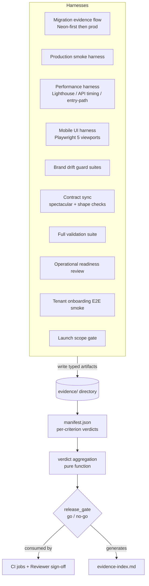

# Design Document

## Overview

This design describes **how** the Beanola production-readiness requirements are
satisfied. The deliverable is not a feature — it is a body of **captured,
reviewable evidence** plus the harnesses that produce it and the gates that
block a release until each requirement meets its threshold.

The design is organized around a single principle: every requirement produces
**typed artifacts** that land in one **evidence directory**, are **indexed by a
manifest**, and are assigned a **pass/fail verdict per acceptance criterion**.
A release is "go" only when the manifest's aggregate verdict is green. Most
work is therefore *measurement, capture, and gating* rather than new product
code; the few code changes (the OpenAPI type-hint fix, the optional client-PDF
preview cleanup, new check scripts and tests) are scoped explicitly.

The design respects the repo steering without exception:

- **Neon-first-then-production** database workflow (`.kiro/steering/infrastructure.md`):
  author and validate on Neon (branch for risk), prove it, then apply to the
  self-hosted production Postgres `mihas-postgres-1` via `docker compose exec`
  on the EC2 box.
- **No autonomous destructive operations**: destructive SQL and destructive
  Neon MCP tools are never run autonomously; they require explicit operator
  confirmation. The existing additive-only lint in `apply_sql_migrations`
  enforces this at the tool layer.
- **`/api/v1/` REST contract** and the **`{"success": true, "data": ...}`**
  response envelope are treated as invariants the smoke/contract harnesses
  assert against, never modify.
- **Design guardrails** (no purple gradients/glassmorphism/emoji icons, WCAG AA
  contrast, ≥44×44px touch targets, full Inter fallback chain) are encoded as
  the Mobile UI verification assertions.

### Sources Grounded In The Real Repo

This design was written after reading the actual implementation. Key anchors:

| Concern | Real location |
|---|---|
| SQL migration runner | `backend/apps/common/management/commands/apply_sql_migrations.py` (`--dry-run`, `--allow-non-additive`, `migration_history` tracking, additive-only lint) |
| Production backup | `deploy/backup-db.sh` |
| OpenAPI warning source | `backend/apps/catalog/serializers.py` → `CanonicalProgramSerializer.get_available_offerings` |
| `extend_schema_field` precedent | `backend/apps/applications/serializers.py` (multiple `@extend_schema_field` decorators) |
| Entry-path guard | `apps/admissions/scripts/check-entry-chunk.ts` (`bun run check:entry`) |
| Smoke harness | `backend/scripts/staging_smoke.py` (envelope-aware) + `.github/workflows/staging-smoke.yml` |
| Playwright | `apps/admissions/playwright.config.ts` (testDir `tests/e2e`, single chromium project today) |
| Tenant-admin frontend service | `apps/admissions/src/services/admin/tenants.ts` (`tenantAdminService`) |
| Brand allowlist | `docs/legacy-brand-allowlist.json` |
| Launch scope flag | `backend/config/settings/base.py` → `ENABLE_JOBS_OPS_ROUTES`; gated in `backend/config/urls.py` |
| CI pipelines | `.github/workflows/ci.yml`, `staging-smoke.yml`, `backend-governance.yml` |

## Architecture

### High-Level Flow

The release-evidence system has four layers: **harnesses** (produce artifacts),
the **evidence store** (typed artifact directory), the **manifest** (index +
verdicts), and the **gate** (aggregate go/no-go consumed by CI and the human
Reviewer).



### Evidence Directory Location

The evidence store lives **inside the spec** so it travels with the spec and is
versioned with the requirements it proves:

```
.kiro/specs/beanola-production-readiness/evidence/
  manifest.json            # machine-readable index + verdicts (source of truth)
  evidence-index.md        # human-readable view, generated from manifest.json
  migration/               # R1  Neon + production migration logs, validation SQL, backup proof
  smoke/                   # R2  deployed-env smoke results (tenant-admin + django-admin distinct)
  performance/
    lighthouse/            # R3  five mobile reports (.json + summary)
    api-timing/            # R3  p50/p95 table per endpoint
    entry-path/            # R3  check:entry output + forbidden-chunk verdict
    doc-budget/            # R3  measured PDF-action gzip budget
  mobile-ui/               # R4  Playwright screenshots + DOM-assertion JSON per route×viewport
  brand/                   # R5  guard suite output, allowlist validity, stale-entry report
  contract/                # R6  fresh OpenAPI artifact, shape diffs, error-code map
  validation/              # R7  frontend + backend suite logs, spectacular zero-error/zero-warning proof
  ops/                     # R8  env presence (no secret values), secure-settings, backup-restore drill, storage/audit/break-glass
  onboarding/              # R9  end-to-end tenant walkthrough capture
  scope/                   # R10/R11 ENABLE_JOBS_OPS_ROUTES=False confirmation + scope-out record
```

Rationale for choosing the in-spec path over `docs/release-evidence/`: the
manifest's verdicts are tied 1:1 to this spec's acceptance criteria, the
Reviewer reads them together, and completion is marked in this spec's
`.config.kiro`. Large binary artifacts (Lighthouse JSON, Playwright PNGs) are
also uploaded as CI artifacts (mirroring the existing `actions/upload-artifact`
pattern in `ci.yml`) so the committed tree is not bloated; the manifest records
both the in-tree path and the CI artifact name.

### CI Integration Points

New and extended GitHub Actions, all under `.github/workflows/`:

| Workflow | New/Extend | Role |
|---|---|---|
| `ci.yml` | Extend | Already enforces `spectacular` zero-errors and the drift-guard inventory. Add: (a) **zero-warnings** assertion for the `get_available_offerings` fix, (b) `bun run check:entry` as a blocking step (it exists but is not yet wired), (c) a `manifest validate` step that fails if `manifest.json` is malformed or references missing artifacts. |
| `staging-smoke.yml` | Extend | Already `workflow_dispatch` running `staging_smoke.py`. Add distinct `/admin/tenants` and `/beanola-admin-panel/` checks and write results into `evidence/smoke/`. |
| `release-evidence.yml` | **New** | `workflow_dispatch` orchestrator that runs the performance, mobile-UI, contract-sync, and brand harnesses against a deployed target, assembles `manifest.json`, computes the gate, and uploads the evidence bundle. Non-blocking on PRs; blocking as a named release gate. |
| `backend-governance.yml` | Reuse | Existing schema drift-guard on a Neon branch fork — referenced by R1 as the Neon-side validation proof. |

### Where New Code Lives (respecting `structure.md`)

| Artifact | Location |
|---|---|
| Manifest builder + verdict aggregator (pure) | `backend/scripts/release_evidence/manifest.py` (importable, unit+property tested) |
| Production smoke extension | `backend/scripts/staging_smoke.py` (extend) + `backend/scripts/prod_smoke_admin_surfaces.py` |
| API timing capture | `backend/scripts/api_timing_capture.py` |
| Lighthouse runner + threshold evaluator | `apps/admissions/scripts/lighthouse-mobile.ts` (+ pure evaluator in `apps/admissions/src/lib/releaseEvidence/`) |
| Entry-path forbidden-chunk verdict | reuse `apps/admissions/scripts/check-entry-chunk.ts` |
| Mobile UI Playwright specs + DOM predicates | `apps/admissions/tests/e2e/mobile-ui/` (specs) + pure predicates in `apps/admissions/src/lib/releaseEvidence/domChecks.ts` |
| Contract shape diff | `backend/scripts/contract_shape_check.py` + frontend fixtures under `apps/admissions/tests/contract/` |
| Brand stale-entry detector (pure) | extend existing `tests/unit/test_brand_drift_guard.py` + `apps/admissions/tests/unit/brandDriftGuard.test.ts`; allowlist logic in a pure module |
| Backend property tests | `backend/tests/property/` |
| Backend unit/integration tests | `backend/tests/unit/`, `backend/tests/integration/` |
| Frontend property tests | `apps/admissions/tests/property/` |
| Onboarding E2E | `apps/admissions/tests/e2e/onboarding/` |
| Operator runbooks | `deploy/` and `docs/runbooks/` (referenced, not duplicated) |

## Components and Interfaces

The eleven requirement areas map to eleven harness components. Each component
defines: its inputs, the artifacts it writes, the verdict rule, and the steering
constraints it must honor.

### Component 1 — Database Migration Evidence Flow (R1)

Implements the Neon-first-then-production workflow exactly as
`infrastructure.md` mandates. The flow is **operator-driven**; the harness
captures evidence, it does not autonomously mutate production.

Ordered evidence steps, each producing an artifact under `evidence/migration/`:

1. **Neon authoring + branch validation** — for risky changes, a Neon branch id
   (`create_branch` via the Neon MCP power) on which the change was validated
   before applying to the Neon default branch. Captured: branch id, validation
   output. (R1.1, R1.2)
2. **Dry-run** — `python manage.py apply_sql_migrations --dry-run` output listing
   pending additive scripts. (R1.3)
3. **Staging apply** — apply log against the staging DB showing additive scripts
   applied without error. (R1.4)
4. **Idempotency re-apply** — second `apply_sql_migrations` run showing
   "All N migrations already applied. Nothing to do." (no additional schema
   change). (R1.5)
5. **Validation SQL** — results confirming `canonical_programs` count non-zero,
   no duplicate institution hostnames/slugs, active membership counts present
   (the exact read-only queries from `infrastructure.md`). (R1.6)
6. **Backup confirmation** — `deploy/backup-db.sh` output captured **before** the
   production apply. (R1.7)
7. **Production apply** — `docker compose -f docker-compose.prod.yml exec web
   python manage.py apply_sql_migrations` output from the EC2 box. (R1.8)
8. **`migration_history` verification** — post-apply
   `SELECT migration_name FROM migration_history ORDER BY 1;` matching the
   intended additive scripts. (R1.8)
9. **Rollback/disable posture** — a written record stating which changes are
   additive-only (reversible by feature-flag flip rather than schema revert),
   mirroring the payment-hardening rollback convention. (R1.9)

**Destructive-op guard (R1.10):** the additive-only lint already in
`apply_sql_migrations` (`_find_non_additive_violations`) rejects `DROP COLUMN`,
`DROP TABLE`, `TRUNCATE`, unbounded `DELETE FROM`, and narrowing
`ALTER COLUMN ... TYPE ... USING` unless the operator passes
`--allow-non-additive` after manual review. The harness never passes that flag
autonomously. This is the single enforcement point cited as proof.

**Verdict rule:** R1 passes only when all nine artifacts exist and the
`migration_history` set equals the intended additive-script set.

### Component 2 — Production Smoke Harness (R2)

Extends `backend/scripts/staging_smoke.py` (already envelope-aware) and adds an
admin-surfaces probe. Runs against the **deployed** frontend and backend.

Interface (`prod_smoke_admin_surfaces.py`):

- `GET /admin/tenants` (frontend route, authorized super-admin) → records a
  **distinct** result. (R2.2, R2.4)
- `GET /beanola-admin-panel/` (Django operational admin, authorized operator) →
  records a **distinct** result. (R2.3, R2.4)
- For each authenticated API surface probed, assert the body matches
  `{"success": true, "data": ...}`. (R2.5)
- On any failure, record the failing surface + observed response so the release
  is blocked. (R2.6)

Artifacts under `evidence/smoke/`: a JSON report per run (extends the existing
`SmokeResult` dataclass shape) plus a checklist markdown. `/admin/tenants` and
`/beanola-admin-panel/` are **never** treated as interchangeable.

### Component 3 — Performance Validation Harness (R3)

Three sub-harnesses, all writing under `evidence/performance/`.

**3a. Lighthouse mobile** (`apps/admissions/scripts/lighthouse-mobile.ts`): runs
mobile audits on the five named routes and records the Performance score.
Threshold evaluation is a **pure function** (testable):

| Route | Class | Threshold |
|---|---|---|
| `/` | public | ≥ 90 |
| `/auth/signup` | public | ≥ 90 |
| `/track-application` | public | ≥ 90 |
| `/student/dashboard` | auth | ≥ 80 |
| `/admin/dashboard` | admin | ≥ 80 |

(R3.1, R3.2, R3.3)

**3b. API timing** (`backend/scripts/api_timing_capture.py`): captures p50/p95
for the named endpoints and marks each against its p95 target. The endpoint set
(R3.4): tenant context, catalog offerings, draft save, application submit,
payment init, payment status, tenant admin list, tenant admin detail, official
document queue, official document status, official document download, settlement
summary. Each row records measured p50, p95, the **defined p95 target**, and a
`meets_target` boolean. (R3.4, R3.5)

**3c. Entry-path + document budget** (reuse `check-entry-chunk.ts`): the guard
confirms `vendor-react-pdf`, `vendor-pdf`, `html2canvas`, OCR, charts, and
admin-heavy chunks are **absent** from the first-paint entry path. (R3.6) The
document-action budget sub-check measures the gzip transfer for the first
PDF/document-generation action and confirms it does not exceed ~772 KB across
the two PDF engines. (R3.7)

**Gap recording (R3.8):** any metric below threshold is written to the manifest
with route/endpoint, measured value, and threshold — it is tracked, not
silently dropped.

### Component 4 — Mobile UI Verification Harness (R4)

Playwright-driven rendered-UI checks. Today `playwright.config.ts` defines a
single desktop chromium project; this component adds the five **Named_Viewports**
as projects (or a parametrized matrix) and a new spec directory
`tests/e2e/mobile-ui/`:

| Viewport | px |
|---|---|
| mobile-1 | 360×800 |
| mobile-2 | 390×844 |
| tablet-portrait | 768×1024 |
| tablet-landscape | 1024×768 |
| desktop | 1440×900 |

For each representative public/auth/student/admin route, capture a screenshot
and run **deterministic DOM assertions**. Each assertion is a pure predicate
over measured geometry (component 4 properties below), so the same logic is
property-tested in isolation and applied in Playwright:

- horizontal body overflow (`scrollWidth > clientWidth`) → fail (R4.2)
- clipped button text (`scrollWidth > clientWidth` on the label node) → fail (R4.3)
- touch target < 44×44 px → fail (R4.4)
- icon-only control with no accessible name → fail (R4.5)
- overlapping cards/tables/forms (bounding-box intersection) → fail (R4.6)
- broken dialog focus management on dialog-opening routes → fail (R4.7)

**Named risk routes:** `/admin/tenants` records its ten-tab tab-list behavior
across all viewports (R4.8); `/admin/applications` records its dense-table
scroll-or-card strategy across all viewports (R4.9). Artifacts under
`evidence/mobile-ui/`: one screenshot + one DOM-assertion JSON per
route×viewport.

### Component 5 — Brand Drift Guard Completeness (R5)

Reuses and extends the existing guard suites: `tests/unit/test_brand_drift_guard.py`
(backend) and `apps/admissions/tests/unit/brandDriftGuard.test.ts` (frontend),
both already in the CI drift-guard inventory.

Interfaces:

- **Hard-leak scan (R5.1):** assert no platform-brand leak tokens
  (`MIHAS Platform APIs`, `MIHAS Admissions`, `MIHAS-KATC PDF`, `MIHAS/2.0`,
  `mihas-admin-panel`, `mihas.edu.zm` platform addresses) in scanned active
  paths.
- **Allowlist coverage (R5.2):** every remaining MIHAS/KATC string in active
  source maps to a reviewed entry in `docs/legacy-brand-allowlist.json`
  classified as tenant data / legacy compatibility / historical example /
  preview fixture.
- **Allowlist validity + stale-entry detection (R5.3):** `legacy-brand-allowlist.json`
  is valid JSON and contains **no stale entries** (entries pointing at files
  that no longer contain a legacy-brand string). Stale detection is a **pure
  function** of `(allowlist, current scan results)` — property-tested.
- **Optional client-PDF preview cleanup (R5.4):** where performed, replace
  MIHAS/KATC client PDF preview sample profiles with neutral/backend-driven
  data in `apps/admissions/src/lib/pdf/documents/acceptanceLetterProfiles.ts`.
- **Neutral fallback (R5.5):** an acceptance-letter preview for an unknown/empty
  institution resolves to a neutral Beanola profile, never MIHAS — already
  partially covered by `acceptanceLetterProfiles.test.ts`; strengthened to a
  property.

### Component 6 — Contract Sync (R6)

Runs in CI, writing under `evidence/contract/`.

- **Fresh OpenAPI (R6.1):** `python manage.py spectacular --file ...` generates
  the artifact (CI already does this in `ci.yml`).
- **Shape contract check (R6.2):** `backend/scripts/contract_shape_check.py`
  compares the frontend `tenantAdminService` request/response shapes
  (`apps/admissions/src/services/admin/tenants.ts`) against the backend
  serializers for: institution CRUD, domains, offerings & rules, routing
  simulator, required documents, templates, document profiles, assets, staff
  memberships & grants, settlement, audit. The shape sets are exported as
  fixtures under `apps/admissions/tests/contract/` and diffed field-by-field.
- **Divergence reporting (R6.3):** any diverging endpoint+field is reported
  (the diff is a pure function — property-tested).
- **Error-code mapping (R6.4):** confirm frontend error handling maps the
  backend error code per tenant-admin endpoint, including recoverable routing
  failures (`NO_ELIGIBLE_OFFERING`) and out-of-scope 404s.

### Component 7 — Full Validation Suite Orchestration (R7)

Captures pass/fail for each suite step under `evidence/validation/`:

- Frontend: `bun run type-check`, `bun run lint`, `bun run build`, unit+property
  tests (`bun run test`), Playwright mobile+desktop smoke. (R7.1, R7.2)
- Backend: `python manage.py check` (R7.3); full `pytest` including tenant
  lifecycle/admin/student journeys (R7.4); `spectacular` with **zero errors**
  (R7.5) and **zero warnings** (R7.6).
- **OpenAPI warning fix (R7.6):** add an explicit schema field/type hint to
  `CanonicalProgramSerializer.get_available_offerings`. The method returns
  `ProgramSerializer(..., many=True).data`, so the fix is a decorator following
  the existing precedent in `apps/applications/serializers.py`:

  ```python
  from drf_spectacular.utils import extend_schema_field

  @extend_schema_field(ProgramSerializer(many=True))
  def get_available_offerings(self, obj):
      ...
  ```

- **Failure recording (R7.7):** any failing step records the step name + output;
  the release is blocked.

### Component 8 — Operational Readiness Review (R8)

Captures proof under `evidence/ops/` **without echoing secret values**:

- **Env presence (R8.1):** confirm required vars set (`SECRET_KEY`,
  `LENCO_API_SECRET_KEY`, …) by key-name presence only — never value echo.
- **Secure settings (R8.2):** `DEBUG=False`, HSTS enabled, CSP present, CORS &
  CSRF trusted origins configured (assert against production settings).
- **Backup-restore drill (R8.3):** captured evidence of a completed drill
  against the production DB (per `docs/runbooks/database-backup-restore.md`).
- **Asset-upload security (R8.4):** tenant asset upload on R2/object storage
  enforces content-type and file-shape validation.
- **Audit retention/redaction (R8.5):** retention settings + sensitive-metadata
  redaction in effect; no PII/secrets in audit records.
- **Break-glass (R8.6):** documented super-admin recovery procedure, confirmed
  account recovery is possible.

### Component 9 — Tenant Onboarding End-to-End Smoke (R9)

Scripted/manual walkthrough captured under `evidence/onboarding/`, exercising
the real `tenantAdminService` surfaces: school create (R9.1), logo+signature
asset upload (R9.2), document profile+template (R9.3), program/offering
assignment (R9.4), staff membership + access grant (R9.5), routing simulator
(R9.6), student application + payment (R9.7), official document generation via
the backend tenant profile/assets (R9.8). Scoped-visibility assertions: scoped
staff see only in-scope records (out-of-scope masked as not-found) (R9.9);
super-admin sees across all tenants (R9.10).

### Component 10 — Launch Scope Gate (R10/R11)

- Confirm `ENABLE_JOBS_OPS_ROUTES=False` for the admissions launch
  (`backend/config/settings/base.py` default is already `false`). (R11.1)
- While the flag is `False`, the jobs/automation/integrations stub routes are
  excluded from the launch surface (gated in `backend/config/urls.py`). (R11.2)
- Record the scope-out decision as evidence so excluded stub modules are
  explicitly acknowledged. (R11.3)

(Requirement 10 in the requirements doc is the "Launch Scope Confirmation"
requirement; its criteria are numbered R10.x there. This design treats the
launch-scope criteria as Component 10.)

## Data Models

### Evidence Manifest

`manifest.json` is the machine-readable source of truth. The human-readable
`evidence-index.md` is generated from it.

```jsonc
{
  "spec": "beanola-production-readiness",
  "schema_version": 1,
  "generated_at": "2026-06-16T12:00:00Z",
  "release_candidate": "<git-sha-or-tag>",
  "requirements": [
    {
      "id": "1",
      "title": "Production Database Migration And Schema Validation Evidence",
      "verdict": "pass | fail | pending | waived",
      "criteria": [
        {
          "id": "1.3",
          "verdict": "pass | fail | pending | waived | n/a",
          "artifacts": ["migration/dry-run-2026-06-16.txt"],
          "ci_artifact": "staging-smoke-report",
          "measured": { "pending_scripts": 2 },
          "threshold": null,
          "notes": "two additive scripts pending"
        }
      ]
    }
  ],
  "release_gate": "go | no-go"
}
```

**Field semantics:**

- `criteria[].verdict` — leaf verdict for one acceptance criterion. `n/a` is
  used for criteria that do not apply to this release (e.g. optional cleanup).
  `waived` requires a non-empty `notes` justification.
- `criteria[].measured` / `threshold` — used by performance and timing rows so a
  Reviewer sees the number and the bar side by side.
- `requirements[].verdict` — **derived** from its criteria (aggregation rule
  below), never hand-set.
- `release_gate` — **derived** from all requirement verdicts.

### Verdict Aggregation Rule (pure)

Ordering of severity: `fail` > `pending` > `pass`. `waived` and `n/a` are
treated as non-blocking (equivalent to `pass` for gating), but `waived` must
carry justification.

- A **requirement** verdict is:
  - `fail` if **any** criterion is `fail`;
  - else `pending` if **any** criterion is `pending`;
  - else `pass` (all criteria are `pass`/`waived`/`n/a`).
- The **release_gate** is `go` iff **every** requirement is `pass`; otherwise
  `no-go`.

This function — and the manifest serialize/deserialize round-trip — is the core
piece of pure logic in the system and is property-tested (see Correctness
Properties).

### Lighthouse Threshold Model (pure)

```
threshold(routeClass) = 90 if routeClass == "public" else 80   # auth | admin
passes(score, routeClass) = score >= threshold(routeClass)
```

### API Timing Row Model (pure)

```
{ endpoint, p50_ms, p95_ms, p95_target_ms, meets_target }
meets_target = p95_ms <= p95_target_ms
```

### Brand Allowlist Models

- **Allowlist entry**: `{ file, string, classification }` where classification ∈
  `{tenant-data, legacy-compat, historical-example, preview-fixture}`.
- **Stale entry (pure):** an entry is stale iff its `string` no longer appears in
  its `file` according to the current scan. The stale-entry set is
  `{ e ∈ allowlist : e.string ∉ scan(e.file) }`.

### Mobile DOM Measurement Model (pure)

A measured element box: `{ role, width, height, accessibleName, scrollWidth,
clientWidth, box: {x,y,w,h} }`. The DOM predicates (overflow, clipped text,
touch-target, icon-only-name, overlap) are pure functions of these measurements,
independent of the browser, which is what makes them property-testable.

## Correctness Properties

*A property is a characteristic or behavior that should hold true across all
valid executions of a system — essentially, a formal statement about what the
system should do. Properties serve as the bridge between human-readable
specifications and machine-verifiable correctness guarantees.*

This is primarily an evidence-and-gating initiative, so most acceptance
criteria are **integration** checks (run once against a real deployed target or
database) or **smoke** checks (one-time configuration confirmation). Those are
covered by the Testing Strategy below, **not** by property-based tests.

A focused subset of the system is **pure logic** with a wide input space — the
manifest verdict engine, the threshold/timing/entry-path evaluators, the brand
allowlist stale detector and preview-profile resolver, the mobile DOM
predicates, the contract diff, the additive-only SQL lint, the envelope
validator, and the access-scope visibility rule. These are where property-based
testing adds real value, and the properties below (deduplicated during the
prework reflection) target exactly them.

### Property 1: Verdict aggregation is severity-monotone at both levels

*For any* set of criterion verdicts, the requirement verdict is `fail` if any
criterion is `fail`, otherwise `pending` if any criterion is `pending`,
otherwise `pass` (treating `waived`/`n/a` as non-blocking); and *for any* set of
requirement verdicts, the release gate is `go` if and only if every requirement
is `pass`.

**Validates: Requirements 2.6, 3.8, 7.7**

### Property 2: Manifest serialization round-trip

*For any* valid evidence manifest, deserializing its serialized form yields an
equivalent manifest (no field, verdict, measurement, or artifact path is lost or
altered).

**Validates: Requirements 1.1, 2.1, 7.1**

### Property 3: Additive-only lint rejects destructive SQL

*For any* SQL script containing a `DROP COLUMN`, `DROP TABLE`, `TRUNCATE`,
unbounded `DELETE FROM`, or narrowing `ALTER COLUMN ... TYPE ... USING`
construct (regardless of surrounding comments or whitespace), the additive-only
lint flags it as non-additive; and *for any* purely additive script, the lint
passes it.

**Validates: Requirements 1.10**

### Property 4: Authenticated success responses use the data envelope

*For any* authenticated success response body, the envelope validator accepts it
if and only if it has `success: true` and a `data` key; any body missing either
is rejected.

**Validates: Requirements 2.5**

### Property 5: Lighthouse threshold evaluation respects route class

*For any* Lighthouse Performance score and route class, the evaluator marks the
route as passing if and only if the score meets the class threshold (≥ 90 for
public routes, ≥ 80 for authenticated/admin routes).

**Validates: Requirements 3.2, 3.3**

### Property 6: API timing target evaluation

*For any* measured p95 latency and defined p95 target, the timing row is marked
as meeting its target if and only if the measured p95 is less than or equal to
the target.

**Validates: Requirements 3.5**

### Property 7: Entry-path guard excludes forbidden chunks

*For any* set of first-paint entry chunks, the entry-path guard passes if and
only if none of the forbidden chunk markers (`vendor-react-pdf`, `vendor-pdf`,
`html2canvas`, OCR, charts, admin-heavy) appear in that set.

**Validates: Requirements 3.6**

### Property 8: Overflow/clipping predicate

*For any* measured DOM node, the overflow/clipping check fails the node if and
only if its `scrollWidth` exceeds its `clientWidth` (applied to the document
body for horizontal overflow and to a button's label node for clipped text).

**Validates: Requirements 4.2, 4.3**

### Property 9: Touch-target size predicate

*For any* interactive element box, the touch-target check fails the element if
and only if its rendered width or height is less than 44 pixels.

**Validates: Requirements 4.4**

### Property 10: Icon-only accessible-name predicate

*For any* icon-only control, the accessible-name check fails the control if and
only if it has no non-empty accessible name.

**Validates: Requirements 4.5**

### Property 11: Overlap predicate

*For any* pair of card/table/form bounding boxes, the overlap check fails them if
and only if their rectangles intersect with non-zero area.

**Validates: Requirements 4.6**

### Property 12: Brand allowlist stale-entry detection

*For any* allowlist and any current scan result, an entry is reported stale if
and only if its declared legacy-brand string no longer appears in its declared
file.

**Validates: Requirements 5.3**

### Property 13: Unknown-institution preview resolves to neutral Beanola

*For any* institution identifier not in the known set (including empty and
whitespace-only identifiers), the acceptance-letter preview resolver returns the
neutral Beanola preview profile and never a MIHAS profile or MIHAS banking data.

**Validates: Requirements 5.5**

### Property 14: Contract diff detects and names divergence

*For any* pair of frontend service field set and backend serializer field set,
the contract diff reports a divergence if and only if the two sets differ, and
the reported divergence names exactly the symmetric-difference fields.

**Validates: Requirements 6.2, 6.3**

### Property 15: Scoped visibility equals the in-scope subset

*For any* collection of records spread across tenants and any staff access
scope, the records visible to that staff member equal exactly the in-scope
subset and every out-of-scope record is masked as not-found; and *for any* such
collection, a super-admin scope sees all records.

**Validates: Requirements 9.9, 9.10**

## Error Handling

The harnesses are evidence producers, so "error handling" means **failing
loudly and recording the failure as evidence**, never silently degrading a
verdict to green.

- **Harness execution failure** (a script throws, a deployed target is
  unreachable): the affected criterion verdict is set to `pending` (not `pass`)
  with a `notes` explanation, and the orchestrator exits non-zero. A missing
  measurement is never interpreted as a pass.
- **Threshold miss** (Lighthouse below bar, p95 over target, doc budget
  exceeded): the criterion verdict is `fail`, the manifest records the measured
  value and threshold (R3.8), and the gate becomes `no-go`.
- **Destructive SQL encountered** (R1.10): the additive-only lint raises
  `CommandError` with one `REJECTED_NON_ADDITIVE_OPERATION` line per violation
  and exits non-zero. The harness surfaces this to the operator and **never**
  passes `--allow-non-additive` autonomously.
- **Neon-side failure during validation**: mirrors the existing
  `backend-governance.yml` degrade-to-skip posture for Neon branch forks — the
  Neon drift-guard may skip, but the hard production gate (migration_history
  match + backup proof) still blocks the release.
- **Malformed manifest**: the `manifest validate` CI step fails the build if
  `manifest.json` is invalid JSON, references a missing artifact, or contains a
  hand-set (non-derived) requirement/gate verdict.
- **Secret safety**: env-presence checks (R8.1) and any log output assert by
  **key name only**; a check that would echo a secret value is itself a failure.
- **Smoke envelope violation**: a non-`{"success":true,"data":...}` body on an
  authenticated surface records the failing surface and observed response
  (R2.6) and fails the smoke verdict.

## Testing Strategy

A dual approach: **property-based tests** for the pure-logic core, and
**example / integration / smoke tests** for everything that touches a real
deployed target, database, or one-time configuration.

### Property-Based Tests

- **Libraries:** `hypothesis` for backend (Python, per `tech.md`); `fast-check`
  for frontend (per `tech.md`). Do not hand-roll property generation.
- **Iterations:** minimum **100** per property test.
- **Tagging:** each property test references its design property with a comment
  in the form `Feature: beanola-production-readiness, Property {number}: {property_text}`.
- **One test per property:** each of the 15 properties above is implemented by a
  single property-based test.
- **Placement:**
  - Backend properties (1, 2 backend half, 3, 4, 6, 12, 14, 15) →
    `backend/tests/property/`.
  - Frontend properties (1 frontend half if the evaluator is shared, 2 frontend
    half, 5, 7, 8, 9, 10, 11, 13) → `apps/admissions/tests/property/`.
  - The manifest verdict engine is the source of truth; if it is implemented in
    `backend/scripts/release_evidence/manifest.py`, Properties 1, 2, 5, 6 are
    backend property tests and the frontend evaluators (entry-path, DOM
    predicates, preview resolver) are tested with `fast-check`.

### Example / Edge-Case Unit Tests

- Smoke harness records `/admin/tenants` and `/beanola-admin-panel/` as **two
  distinct results** (R2.4) — example test of the harness output shape.
- Failing-step recording blocks the release (R2.6, R7.7) — example tests over a
  manifest with one injected failure.
- Optional client-PDF preview cleanup leaves no MIHAS/KATC strings (R5.4) — scan
  example if the cleanup is performed.
- Frontend error-code map covers every backend tenant-admin error code (R6.4) —
  coverage example over the fixed code set, including `NO_ELIGIBLE_OFFERING` and
  out-of-scope 404.
- Launch-scope gating: flag `False` → jobs/automation/integrations routes absent
  from the URL conf; flag `True` → present (R11.2) — two-state example test.

### Integration Tests (1–3 examples each, not PBT)

- Migration evidence flow end-to-end against staging then production
  (R1.1–R1.8): dry-run, staging apply, idempotency re-apply (observe no-op),
  validation SQL, backup, production apply via `docker compose exec`,
  `migration_history` verification.
- Production smoke against the deployed environment (R2.1–R2.3).
- Lighthouse capture on the five routes (R3.1), API timing capture (R3.4),
  document-action budget measurement (R3.7).
- Mobile UI Playwright runs at the five viewports including dialog focus
  management (R4.1, R4.7) and the named risk routes (R4.8, R4.9).
- Brand hard-leak and allowlist-coverage scans of the active tree (R5.1, R5.2).
- Full validation suite execution (R7.1–R7.4) and OpenAPI generation
  (R7.5, R7.6).
- Operational readiness: backup-restore drill (R8.3), asset-upload security
  (R8.4), audit retention/redaction (R8.5).
- Tenant onboarding end-to-end walkthrough (R9.1–R9.8).

### Smoke Tests (single execution)

- Rollback/disable posture documented (R1.9).
- OpenAPI zero errors / zero warnings (R7.5, R7.6) — already partly enforced in
  `ci.yml`.
- Env-var presence with no secret echo (R8.1); secure settings (R8.2);
  break-glass procedure documented (R8.6).
- `ENABLE_JOBS_OPS_ROUTES=False` confirmation and scope-out record
  (R11.1, R11.3).

### Why PBT Is Limited Here

Property-based testing is deliberately **not** applied to migration execution,
deployed-environment smoke, Lighthouse/API capture, infrastructure
configuration, or the tenant-onboarding walkthrough. Those test external service
behavior or one-time setup whose outcome does not vary meaningfully with
generated input, where 100 iterations add cost without finding new bugs. They
are integration or smoke tests with a small number of representative runs. PBT
is reserved for the pure decision logic that sits between the raw artifacts and
the gate verdict.

## Requirements Traceability

| Requirement | Component | Primary verification | Property |
|---|---|---|---|
| 1.1–1.9 Migration evidence | C1 Migration flow | Integration (operator flow), Smoke (1.9) | P2 (manifest) |
| 1.10 No autonomous destructive SQL | C1 / `apply_sql_migrations` lint | Property | **P3** |
| 2.1–2.4, 2.6 Smoke surfaces | C2 Smoke harness | Integration + Example | P1, P2 |
| 2.5 Response envelope | C2 Smoke harness | Property | **P4** |
| 3.1 Lighthouse capture | C3a | Integration | — |
| 3.2, 3.3 Lighthouse thresholds | C3a evaluator | Property | **P5** |
| 3.4 API timing capture | C3b | Integration | — |
| 3.5 Timing target marking | C3b evaluator | Property | **P6** |
| 3.6 Entry-path guard | C3c (`check:entry`) | Property | **P7** |
| 3.7 Document-action budget | C3c | Integration | — |
| 3.8 Gap recording | C3 / manifest | Example | P1 |
| 4.1 Viewport capture | C4 Playwright | Integration | — |
| 4.2, 4.3 Overflow/clipped text | C4 DOM predicate | Property | **P8** |
| 4.4 Touch target ≥44px | C4 DOM predicate | Property | **P9** |
| 4.5 Icon-only accessible name | C4 DOM predicate | Property | **P10** |
| 4.6 Overlap | C4 DOM predicate | Property | **P11** |
| 4.7 Dialog focus | C4 Playwright | Integration | — |
| 4.8, 4.9 Named risk routes | C4 Playwright | Integration | — |
| 5.1, 5.2 Brand leak/coverage | C5 guard suites | Integration | — |
| 5.3 Allowlist validity/stale | C5 stale detector | Property | **P12** |
| 5.4 Optional PDF cleanup | C5 | Example | — |
| 5.5 Neutral fallback | C5 preview resolver | Property | **P13** |
| 6.1 Fresh OpenAPI | C6 | Smoke | — |
| 6.2, 6.3 Shape contract diff | C6 diff | Property | **P14** |
| 6.4 Error-code mapping | C6 | Example | — |
| 7.1, 7.2, 7.4 Suites pass | C7 | Integration | P1, P2 |
| 7.3 Django check | C7 | Smoke | — |
| 7.5 OpenAPI zero errors | C7 | Smoke | — |
| 7.6 `get_available_offerings` fix | C7 serializer fix | Smoke | — |
| 7.7 Failing-step recorded | C7 / manifest | Example | P1 |
| 8.1, 8.2, 8.6 Env/settings/break-glass | C8 | Smoke | — |
| 8.3, 8.4, 8.5 Drill/storage/audit | C8 | Integration | — |
| 9.1–9.8 Onboarding walkthrough | C9 | Integration | — |
| 9.9, 9.10 Scoped visibility | C9 / AccessScopeService | Property | **P15** |
| 11.1, 11.3 Scope confirmation | C10 | Smoke | — |
| 11.2 Routes excluded | C10 / `urls.py` gating | Example | — |
| Manifest verdict engine / gate | Data model | Property | **P1, P2** |

Every numbered acceptance criterion maps to a component and a verification
method; the 15 deduplicated correctness properties cover the testable pure-logic
core, and the remaining criteria are covered by integration, smoke, or example
tests as recorded above.
