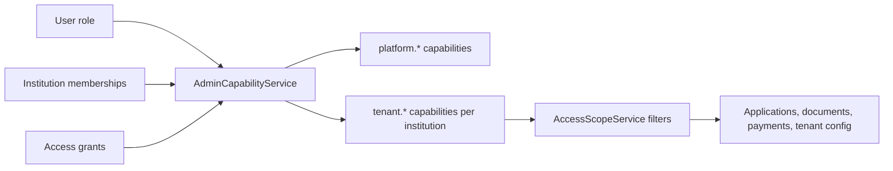
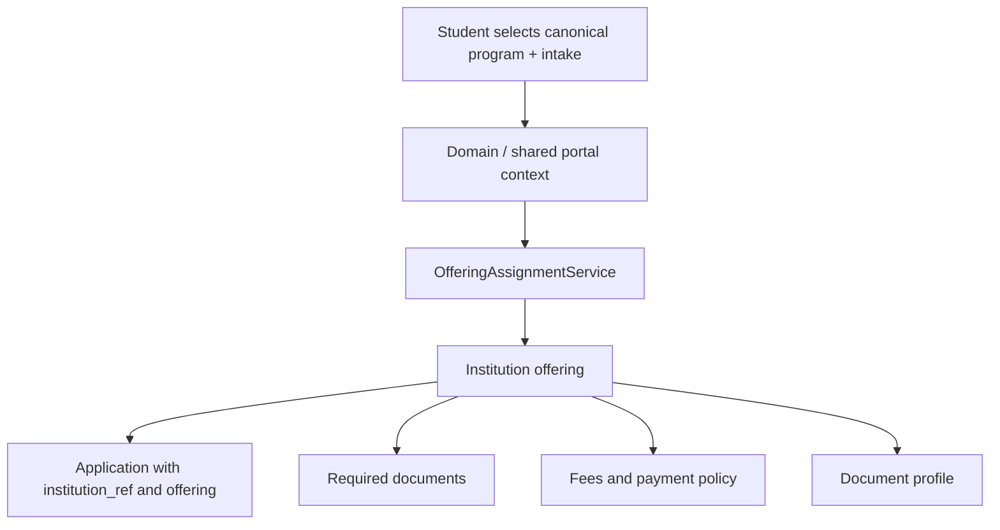
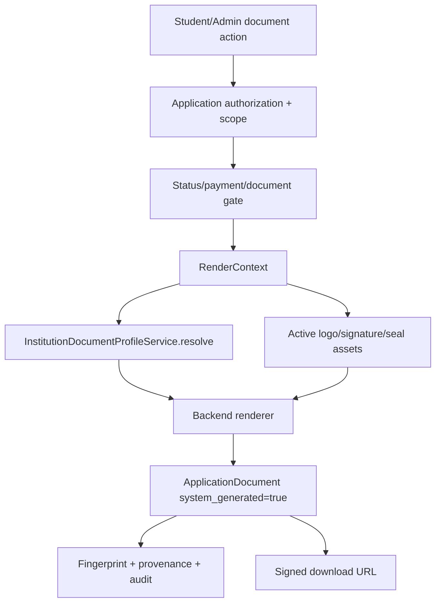

# Design Document

## Overview

This design finishes the migration from an admissions app shaped around MIHAS
and KATC into a Beanola-owned multi-tenant admissions platform. It is not a
rewrite. It is a canonicalization pass: keep the already-good tenant foundation,
delete or delegate stale paths, and make the frontend, backend, documents,
routes, permissions, and operations describe the same product.

The design has four operating principles:

1. **One business model.** Beanola owns the platform; schools are tenants.
2. **One authority model.** Backend capabilities and scope enforce access.
3. **One document authority.** Backend official documents are the only official
   records.
4. **One user intent model.** Starting a new application and resuming an old
   one are explicit actions.

## Canonical Surfaces

| Surface | Canonical path | Purpose |
| --- | --- | --- |
| Public/shared portal | `/` | Beanola shared admissions portal |
| Student dashboard | `/student/dashboard` | Student-owned applications, drafts, payments, documents |
| Student application wizard | `/student/application-wizard` and supported aliases | Program-first application flow |
| Product admin | `/admin/*` | Beanola admissions product admin |
| Tenant console | `/admin/tenants` | Super admin tenant console or tenant admin "My School" console |
| Tenant onboarding | `/admin/tenants/new` | Super_Admin-only onboarding wizard |
| Django operational admin | `/beanola-admin-panel/` | Low-level Django admin only |
| Admin API | `/api/v1/admin/*` | Product admin APIs |
| Official documents API | `/api/v1/applications/{id}/official-documents/*` | Backend official documents |

## Role And Capability Model



Endpoint code must not re-derive authority. It should ask one of the canonical
services:

- `AdminCapabilityService` for capability decisions.
- `AccessScopeService` for queryset scoping.
- `InstitutionContextService` for host/domain/tenant context.
- `OfferingAssignmentService` for program-first assignment.
- `InstitutionDocumentProfileService` for document profile resolution.

Frontend capability checks exist only for usability. They must mirror backend
decisions but never replace them.

## Frontend Route Registry

The current frontend has route knowledge spread across:

- `apps/admissions/src/routes/config.tsx`
- `apps/admissions/src/components/navigation/tenantNav.ts`
- `apps/admissions/src/components/navigation/MobileBottomNav.tsx`
- `apps/admissions/src/components/navigation/DesktopSidebar.tsx`
- `apps/admissions/src/components/navigation/AppLayout.tsx`
- `apps/admissions/src/components/ui/BottomNavigation.tsx`
- `apps/admissions/src/components/DashboardRedirect.tsx`
- `apps/admissions/src/pages/auth/SignInPage.tsx`
- `apps/admissions/src/pages/NotFoundPage.tsx`

Design target:

```ts
type ProductRouteId =
  | 'public.home'
  | 'student.dashboard'
  | 'student.applicationWizard'
  | 'admin.dashboard'
  | 'admin.applications'
  | 'admin.tenants'
  | 'admin.tenantOnboarding'
  | 'admin.users'
  | 'admin.settings'

interface ProductRouteDefinition {
  id: ProductRouteId
  path: string
  aliases?: string[]
  guard: 'public' | 'auth' | 'student' | 'admin'
  requiresSuperAdmin?: boolean
  requiredCapabilities?: string[]
  nav?: {
    desktop?: boolean
    mobile?: boolean
    label: string
    icon: LucideIcon
    order: number
  }
  skeletonType: SkeletonType
}
```

All navigation, redirects, prefetching, route guards, and helpful links should
derive from this registry. A test should allow hard-coded route strings only in
the registry, route tests, and explicit external documentation.

## Admin Information Architecture

`/admin/tenants` is intentionally shared:

- Super_Admin renders `SuperAdminTenantConsole`.
- Tenant_Admin renders `TenantAdminSchoolConsole`.
- No-scope staff render a no-access state.

`/admin/tenants/new` is Super_Admin-only in frontend and backend.

Tenant admins can manage only what their capabilities allow. A tenant admin
with `tenant.profile.read` but not `tenant.profile.manage` can view the school
profile but cannot upload branding or edit document profiles. A tenant admin
must never see "create new institution" unless they are a Super_Admin.

## Application Lifecycle Design

The current product behavior is split across:

- server draft endpoint returning latest draft
- application rows with `status='draft'`
- localStorage wizard snapshots
- sessionStorage wizard snapshots
- draft store events
- duplicate-check adoption logic
- dashboard continue cards

The target lifecycle has explicit modes:

| User intent | URL contract | Loader behavior |
| --- | --- | --- |
| Start brand new | `/student/application-wizard?mode=new` | Clear wizard-local state, ignore existing drafts for this session |
| Resume selected draft | `/student/application-wizard?draft_id={id}` | Load only that draft/application |
| Continue latest draft | Dashboard action chooses a concrete draft id first | Navigate to selected draft |
| View application | `/student/application/{id}` | Read-only or status-specific detail page |

The implementation must choose and document one backend model:

1. **True multi-draft model.** Recommended. Add list/create/read/update/delete
   draft resources keyed by draft/application id.
2. **Single active draft model.** Acceptable only if the UI removes the
   multi-draft illusion and uses one explicit "Continue active draft" action.

The current hybrid model is not acceptable because it makes start-new and resume
ambiguous.

## Program-First Assignment Design



Students should not be asked to understand internal tenant routing. Admins need
visibility into the decision for support, including domain, priority, capacity,
eligibility, and fallback reason.

## Official Document Design

Official documents must resolve through the backend:



Frontend `@/lib/pdf` is allowed only for dev previews or explicitly non-official
draft previews. Student and admin official flows must use
`services/officialDocuments.ts` or a backend-delegating successor.

Legacy endpoints such as `/application-slip/` must either call the official
document service internally or be marked deprecated and removed after callers
are migrated.

## Tenant Onboarding Design

The onboarding wizard should become a real lifecycle, not just forms:

1. Institution identity.
2. Domains.
3. Branding assets.
4. Programs and offerings.
5. Intakes and capacity.
6. Fees and settlement metadata.
7. Document profiles.
8. Required documents.
9. Staff invite.
10. Readiness validation.
11. Activation.

The backend should expose a tenant readiness result with machine-readable
checks:

```json
{
  "institution_id": "uuid",
  "ready": false,
  "checks": [
    {"code": "LOGO_MISSING", "status": "failed", "message": "Upload a logo."},
    {"code": "SIGNATURE_MISSING", "status": "failed", "message": "Upload a signature."},
    {"code": "APPLICATION_SLIP_PROFILE_MISSING", "status": "failed", "message": "Configure application slip profile."}
  ]
}
```

The frontend should block launch/activation until hard-fail checks pass.

## De-AI Cleanup Design

Generated-looking drift should be handled as engineering debt, not style
preference. The cleanup pass should:

- remove compatibility re-exports after tests import canonical modules;
- replace history comments with business-rule comments;
- create import boundaries for deprecated modules;
- remove duplicate route/nav maps;
- remove duplicate document hooks;
- remove stale aliases only after adding redirect tests;
- preserve useful compatibility endpoints only when they delegate to canonical
  services.

The goal is not fewer files for its own sake. The goal is one obvious path for
each business capability.

## Mobile-First UI Design

This is an operational SaaS-style platform. The UI should be quiet, dense, and
clear, not decorative. Requirements for implementation:

- use familiar Lucide icons in buttons;
- keep touch targets at least 44px;
- no nested cards;
- no decorative gradient/orb styling;
- no marketing-style admin panels;
- tables must collapse into mobile-friendly list/detail views where needed;
- text must wrap or adapt without overflowing;
- every async action needs loading, success, failure, and retry states;
- tenant-admin screens must say "My School" behavior through structure, not
  by exposing super-admin controls disabled in place.

## API Contract Design

Each frontend service should have an explicit backend owner:

| Frontend service | Backend owner |
| --- | --- |
| `services/admin/tenants.ts` | `backend/apps/catalog/admin_views.py` |
| `services/admin/capabilities.ts` | `backend/apps/accounts/admin_user_views.py` |
| `services/admin/scope.ts` | `backend/apps/accounts/admin_user_views.py` |
| `services/officialDocuments.ts` | `backend/apps/applications/official_document_views.py` |
| application draft service | `backend/apps/applications/student_draft_views.py` |
| catalog/program context | `backend/apps/catalog/views.py` |

Contract tests should verify envelopes, status codes, error codes, field names,
permission behavior, and setup-required states.

## Observability Design

Audit events should cover:

- tenant creation and update;
- domain create/verify/activate/disable;
- asset upload and activation;
- document profile create/activate/deactivate;
- required-document changes;
- offering assignment changes;
- staff invite/disable/grant/revoke;
- assignment decisions;
- official document generation;
- access denied for tenant-sensitive actions.

Logs and audit metadata must not include raw document bodies, full secrets, or
unnecessary PII.

## Release Design

The work should ship in phases:

1. Specification and drift inventory.
2. Route registry.
3. Draft lifecycle.
4. Official document consolidation.
5. Tenant onboarding/readiness.
6. Permission hardening.
7. De-AI cleanup.
8. Mobile-first polish.
9. Contract and E2E tests.
10. Production smoke and runbook update.

Each phase should be separately verifiable. Do not merge large ambiguous batches
without tests because this codebase already has overlapping historical plans.

