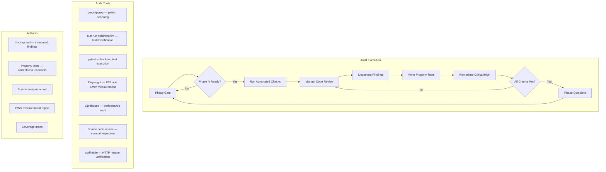

# Design Document — Comprehensive System Audit

## Overview

This design describes how to execute a full-stack audit of the MIHAS monorepo across 8 audit areas: security, frontend quality (admissions + jobs-ops), backend correctness, infrastructure reliability, design system consistency, documentation hygiene, and test coverage. The audit produces structured findings reports, remediation tracking items, and property-based tests that verify correctness invariants.

The audit follows the CTO's phased shipping order:

| Phase | Scope | Requirements |
|-------|-------|-------------|
| Phase 1 — Security | CSP, cookies, CORS, JWT, rate limiting, CSRF, error pipeline, secrets, input validation, file uploads, auth edge cases | Req 1–10, 29 |
| Phase 2 — Production Stability | TS strict mode, test suite health, bundle size, CWV, lazy loading, service worker, jobs-ops test gap, Vercel/Koyeb deployment, Neon/Redis connections | Req 11–16, 20, 32–35 |
| Phase 3 — Backend Quality | Serializer coverage, query performance, Celery reliability, response format, pagination, audit logging, health checks, R2 storage, backend test coverage | Req 24–28, 30–31, 36, 50 |
| Phase 4 — Frontend Quality | Error boundaries, loading/empty states, mobile responsiveness, jobs-ops API/routes/states, admissions test coverage, jobs-ops test plan, integration/E2E, property test correctness | Req 17–19, 21–23, 48–49, 51–52 |
| Phase 5 — Design & Docs | Design tokens, color/contrast, typography, component library, accessibility, animation, documentation freshness, architecture docs, API docs, deployment runbooks, env vars | Req 37–47 |

### Audit Execution Model

Each audit area follows the same execution pattern:

1. **Investigate** — Read source code, configuration, and settings to understand current state
2. **Verify** — Run automated checks (scripts, grep patterns, build commands, test suites) to confirm or deny each acceptance criterion
3. **Document** — Record findings with severity, evidence, and remediation recommendations
4. **Test** — Write property-based tests for verifiable invariants that should hold going forward

### Finding Severity Classification

| Severity | Definition | SLA |
|----------|-----------|-----|
| Critical | Exploitable security vulnerability, data loss risk, or production outage risk | Fix before next deploy |
| High | Correctness bug, missing protection, or reliability gap that affects users | Fix within current sprint |
| Medium | Code quality issue, inconsistency, or missing coverage that increases maintenance risk | Fix within next 2 sprints |
| Low | Documentation gap, style inconsistency, or minor improvement opportunity | Backlog |

### Remediation Tracking

Each finding produces a structured record:

```
Finding ID: {PHASE}-{AREA}-{SEQ}  (e.g., P1-SEC-001)
Severity: Critical | High | Medium | Low
Requirement: Req X.Y
Summary: One-line description
Evidence: File path, line number, command output, or screenshot
Remediation: Specific action to resolve
Status: Open | In Progress | Resolved | Won't Fix
```

Findings are tracked in a `findings.md` file within the spec directory, organized by phase.

## Architecture



### Phase Dependencies

Phases are ordered by risk. Phase 1 (security) ships first because security vulnerabilities have the highest blast radius. Each subsequent phase can begin once the previous phase's critical findings are resolved.

## Components and Interfaces

### Phase 1: Security Audit (Req 1–10, 29)

#### 1.1 CSP Analysis (Req 1)

**Approach:**
- Read `apps/admissions/vercel.json` to extract the current CSP header value
- Search Zod v4 source in `node_modules/zod/` for `new Function` or `eval` usage that requires `unsafe-eval`
- Test the admissions app build with `unsafe-eval` removed from CSP to see if Zod validation breaks
- If Zod v4 JIT requires `unsafe-eval`, document the specific code path and check if `zod.setGlobalConfig({ jitless: true })` or similar config disables JIT
- Verify CSP blocks inline scripts by checking for absence of `unsafe-inline` in `script-src` (currently only `'self' 'unsafe-eval' https://va.vercel-scripts.com`)

**Tools:** ripgrep (search Zod source), manual `vercel.json` inspection, production build test
**Artifacts:** Finding documenting `unsafe-eval` necessity, mitigation plan if required

#### 1.2 Cookie Attribute Verification (Req 2)

**Approach:**
- Read `backend/config/settings/base.py` and `backend/config/settings/prod.py` for `AUTH_COOKIE_*` settings
- Current state: `base.py` has `SameSite=Lax`, `prod.py` overrides to `SameSite=None` with `Secure=True`, `HttpOnly=True`
- Trace cookie-setting code in `backend/apps/accounts/` to verify `Set-Cookie` headers include correct attributes
- Search frontend code for `localStorage.setItem` or `sessionStorage.setItem` with token-related keys
- Verify the `SameSite=None` in prod is justified by the cross-origin requirement (api.mihas.edu.zm → apply.mihas.edu.zm)

**Tools:** ripgrep (search for `localStorage`, `sessionStorage`, `Set-Cookie`), settings file inspection
**Artifacts:** Cookie attribute matrix documenting each cookie's attributes per environment

#### 1.3 CORS Verification (Req 3)

**Approach:**
- Enumerate `CORS_ALLOWED_ORIGINS` and `CORS_ALLOWED_ORIGIN_REGEXES` from `base.py`, `prod.py`, `dev.py`, and `.env.*` files
- Verify `CORS_ALLOW_ALL_ORIGINS = False` in production
- Verify `CORS_ALLOW_CREDENTIALS = True` is paired with explicit origin lists (not `*`)
- Test preflight request handling: simulate `OPTIONS` request from unauthorized origin and verify no `Access-Control-Allow-Origin` header in response
- Review regex patterns in `CORS_ALLOWED_ORIGIN_REGEXES` for overly permissive matches

**Tools:** settings file inspection, ripgrep, curl/httpie for preflight testing
**Artifacts:** CORS origin inventory per environment, regex pattern analysis

#### 1.4 JWT Flow Verification (Req 4)

**Approach:**
- Trace the refresh cycle end-to-end:
  1. Frontend: `apiClient` interceptor detects 401 → calls refresh endpoint
  2. Backend: `JWTCookieAuthentication` in `authentication.py` extracts token from cookie or Bearer header
  3. Backend: SimpleJWT `ROTATE_REFRESH_TOKENS=True` and `BLACKLIST_AFTER_ROTATION=True` settings
  4. Backend: `JWTAuthenticationMiddleware` in `middleware.py` validates token, checks JTI blacklist
- Verify `ACCESS_TOKEN_LIFETIME=15min` and `REFRESH_TOKEN_LIFETIME=7days` in `SIMPLE_JWT` config
- Verify cross-origin cookie handling: `CORS_ALLOW_CREDENTIALS=True` + `SameSite=None` + `Secure=True`
- Check frontend refresh deduplication (multiple concurrent 401s should trigger only one refresh)

**Tools:** Source code tracing across `authentication.py`, `middleware.py`, `base.py`, frontend `apiClient`
**Artifacts:** JWT flow diagram, finding for any gaps in rotation/blacklisting

#### 1.5 Rate Limiting Verification (Req 5)

**Approach:**
- Read `RateLimitMiddleware` in `middleware.py` to enumerate rate limit scopes and their limits
- Map each API endpoint to its rate limit scope
- Verify auth endpoints (`/api/v1/auth/login/`, `/register/`, `/password-reset/`) have stricter limits
- Verify error reporting endpoint has 10-req/5-min/IP limit
- Verify Redis-unavailable fallback: check the middleware's exception handling around `cache` calls
- Run existing property tests in `backend/tests/property/test_rate_limiting.py`

**Tools:** Source code inspection, ripgrep for `@ratelimit` decorators, pytest execution
**Artifacts:** Rate limit scope inventory, endpoint-to-limit mapping

#### 1.6 CSRF Flow Verification (Req 6)

**Approach:**
- Trace token issuance: where does the backend set the CSRF token? (response header, cookie, or body)
- Trace frontend storage: how does the frontend store and attach `X-CSRF-Token` header?
- Read `CSRFEnforcementMiddleware` to enumerate exempt patterns and verify each is justified
- Verify that POST/PUT/PATCH/DELETE without valid `X-CSRF-Token` returns 403
- Check that the CSRF token is tied to the user session (not a static value)

**Tools:** Source code tracing across `middleware.py`, frontend `apiClient`, ripgrep
**Artifacts:** CSRF flow diagram, exempt endpoint inventory with justifications

#### 1.7 Error Monitoring Pipeline (Req 7)

**Approach:**
- Verify backend 500 path: `envelope_exception_handler` → `ErrorLog.create(source='backend')` → throttled alert
- Verify frontend path: `errorReporter.ts` captures `window.onerror`/`unhandledrejection` → batches → POST `/api/v1/errors/report/` → `ErrorReportView` → `ErrorLog.create(source='frontend')` → throttled alert
- Verify throttle: `cache.add(key, 1, 900)` — 15-min TTL per unique message hash
- Verify fail-open: if `cache.add` throws, alert dispatches anyway
- Verify `ErrorLog` schema has timestamp, source, message, stack_trace fields

**Tools:** Source code inspection of `exceptions.py`, `error_views.py`, `errorReporter.ts`
**Artifacts:** Pipeline flow verification, finding for any gaps

#### 1.8 Secrets Scanning (Req 8)

**Approach:**
- Grep for common secret patterns across all source files:
  - API key patterns: `sk_live_`, `pk_live_`, `re_`, `rk_`
  - Connection strings: `postgres://`, `rediss://`, `redis://` with credentials
  - JWT/signing keys: hardcoded base64 strings in non-env files
  - Generic patterns: `password\s*=\s*["']`, `secret\s*=\s*["']`, `token\s*=\s*["']`
- Verify `.gitignore` excludes `.env`, `.env.local`, `.env.production`, etc.
- Verify `REQUIRED_ENV_VARS` in `base.py` matches actual secrets used
- Verify `SECRET_KEY` default `insecure-dev-key-change-me` is overridden in prod settings
- Review `docs/runbooks/secrets-rotation.md` for completeness

**Tools:** ripgrep with secret patterns, `.gitignore` inspection
**Artifacts:** Secrets scan report, rotation runbook gap analysis

#### 1.9 Input Validation (Req 9) and File Upload Security (Req 10)

**Approach:**
- Enumerate all DRF views with `POST`/`PUT`/`PATCH` methods
- Verify each uses a serializer class (not raw `request.data`)
- For file upload endpoints in `backend/apps/documents/`: verify MIME type allowlist, size limits, filename sanitization
- Verify uploaded files get non-guessable R2 keys and signed URLs
- Check for `fields = "__all__"` in serializers (should be explicit field lists)

**Tools:** ripgrep for `request.data`, `APIView`, `ViewSet`, serializer definitions
**Artifacts:** Serializer coverage matrix, file upload security checklist

#### 1.10 Auth Edge Cases (Req 29)

**Approach:**
- Review `JWTAuthenticationMiddleware` and `JWTCookieAuthentication` for edge case handling:
  - Expired token → 401 with clear message (not internal error details)
  - Malformed JWT → 401 without stack trace leakage
  - No credentials → anonymous request, permission checks apply
  - Token from both cookie and Bearer header → which takes precedence?
- Verify JTI blacklist check in middleware
- Run existing tests in `backend/tests/property/test_jwt_middleware.py` and `backend/tests/unit/test_jwt_middleware.py`

**Tools:** Source code inspection, pytest execution
**Artifacts:** Auth edge case matrix with expected vs actual behavior

### Phase 2: Production Stability (Req 11–16, 20, 32–35)

**Execution approach:**
- **Req 11 (TS strict):** Run `bun run build` in admissions, grep for `@ts-ignore` and `as any`, verify `tsconfig.json` strict settings
- **Req 12 (Test suite):** Run `bun run test` in admissions 3 times, identify flaky tests, verify property test seeds
- **Req 13 (Bundle size):** Run production build, analyze chunk sizes with `rollup-plugin-visualizer` or `source-map-explorer`
- **Req 14 (CWV):** Run Lighthouse on built app with simulated 3G throttling
- **Req 15 (Lazy loading):** Grep for `React.lazy`, `import()`, verify `LazyLoadErrorBoundary` wrapping
- **Req 16 (Service worker):** Inspect `service-worker.ts`, verify `injectManifest` strategy, check offline behavior
- **Req 20 (Jobs-ops tests):** Verify zero test files exist, run `type-check`, `lint`, `vite build`
- **Req 32 (Vercel):** Inspect `vercel.json` headers, rewrites, build config
- **Req 33 (Koyeb):** Inspect `Dockerfile`, verify entrypoint, health probes
- **Req 34 (Neon):** Verify `DATABASE_URL` pooler config, `CONN_MAX_AGE`, `ssl_require`
- **Req 35 (Redis):** Verify TLS config, `CELERY_BROKER_USE_SSL`, graceful degradation

**Artifacts:** Test suite health report, bundle analysis report, CWV measurement report, deployment config verification

### Phase 3: Backend Quality (Req 24–28, 30–31, 36, 50)

**Execution approach:**
- **Req 24 (Serializers):** Enumerate all views, verify serializer usage, check for `fields = "__all__"`
- **Req 25 (Query perf):** Search for `.filter()` without `select_related`/`prefetch_related`, identify missing indexes
- **Req 26 (Celery):** Enumerate tasks, verify `autoretry_for`, `retry_backoff`, `max_retries`
- **Req 27 (Response format):** Verify `EnvelopeRenderer` wraps all responses, check error format
- **Req 28 (Pagination):** Verify `StandardPagination` on all list endpoints, check bounds
- **Req 30 (Audit logging):** Verify `AuditMiddleware` logs POST/PUT/PATCH/DELETE, check PII exclusion
- **Req 31 (Health checks):** Verify `/health/live/` and `/health/ready/` behavior, check middleware exemptions
- **Req 36 (R2):** Verify `django-storages` config, signed URL expiry, ACL settings
- **Req 50 (Backend tests):** Produce coverage map by app, identify gaps

**Artifacts:** Serializer coverage matrix, query performance findings, Celery task inventory, backend test coverage map

### Phase 4: Frontend Quality (Req 17–19, 21–23, 48–49, 51–52)

**Execution approach:**
- **Req 17 (Error boundaries):** Verify every route page has error boundary wrapping
- **Req 18 (Loading/empty states):** Verify skeleton/spinner on data-fetching pages, empty state messages
- **Req 19 (Mobile):** Verify touch targets ≥44px, viewport rendering at 320/375/414px
- **Req 21 (Jobs-ops API):** Enumerate service files, verify `apiClient` usage, no raw `fetch`
- **Req 22 (Jobs-ops routes):** Enumerate routes in `router.tsx`, verify component resolution
- **Req 23 (Jobs-ops states):** Verify loading/error states on all feature pages
- **Req 48 (Admissions coverage):** Produce test coverage map, identify untested critical flows
- **Req 49 (Jobs-ops test plan):** Produce prioritized test plan, define Vitest config
- **Req 51 (Integration/E2E):** Verify Playwright tests, identify cross-boundary gaps
- **Req 52 (Property tests):** Verify round-trip, idempotency, metamorphic, and error properties

**Artifacts:** Frontend coverage maps, jobs-ops test plan, route resolution matrix

### Phase 5: Design & Docs (Req 37–47)

**Execution approach:**
- **Req 37 (Env vars):** Produce complete env var inventory, verify `.env.example` documentation
- **Req 38 (Design tokens):** Grep for hardcoded hex/rgb values, verify Tailwind token usage
- **Req 39 (Color/contrast):** Check WCAG AA contrast ratios for text/background combinations
- **Req 40 (Typography):** Verify heading hierarchy, spacing scale consistency
- **Req 41 (Component library):** Verify Radix UI usage, check for re-implementations
- **Req 42 (Accessibility):** Verify ARIA attributes, keyboard navigation, focus management
- **Req 43 (Animation):** Verify `prefers-reduced-motion` support, animation duration limits
- **Req 44 (Doc freshness):** Enumerate `docs/` files, classify as current/stale/legacy
- **Req 45 (Architecture docs):** Verify steering files match current state
- **Req 46 (API docs):** Generate OpenAPI schema, verify completeness
- **Req 47 (Runbooks):** Verify secrets rotation runbook, deployment guides

**Artifacts:** Env var inventory, design token audit, accessibility findings, documentation cleanup list

## Data Models

### Finding Record

```typescript
interface AuditFinding {
  id: string              // e.g., "P1-SEC-001"
  phase: 1 | 2 | 3 | 4 | 5
  area: string            // e.g., "Security", "Frontend Quality"
  requirement: string     // e.g., "Req 1.1"
  severity: 'critical' | 'high' | 'medium' | 'low'
  summary: string         // One-line description
  evidence: string        // File path, line number, command output
  remediation: string     // Specific action to resolve
  status: 'open' | 'in_progress' | 'resolved' | 'wont_fix'
}
```

### Audit Phase Record

```typescript
interface AuditPhase {
  phase: number
  name: string
  requirements: number[]
  status: 'not_started' | 'in_progress' | 'blocked' | 'complete'
  findings: AuditFinding[]
  criticalCount: number
  highCount: number
  resolvedCount: number
}
```

### Test Coverage Map Entry

```typescript
interface CoverageEntry {
  module: string          // e.g., "apps/accounts", "src/services/api"
  testType: 'unit' | 'integration' | 'property' | 'e2e' | 'ui'
  testFiles: string[]     // Paths to test files covering this module
  coverageGaps: string[]  // Untested functions or flows
  riskLevel: 'high' | 'medium' | 'low'
}
```

