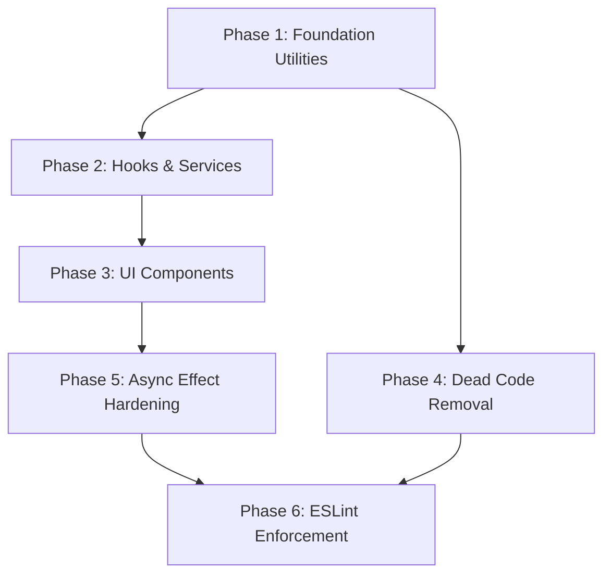

# Design Document: Duplicate & Deprecated Code Consolidation

## Overview

This design covers the systematic consolidation of duplicate modules, removal of dead code, and hardening of async effects across the MIHAS admissions portal frontend. The codebase has accumulated significant duplication between `src/lib/` and `src/utils/`, redundant hook implementations, overlapping security/sanitization modules, duplicate UI components, and ~25 dead code files with zero import references.

The consolidation follows a phased approach ordered by dependency depth: foundational utilities first, then hooks and components that depend on them, then dead code removal, async hardening, and finally ESLint enforcement to prevent regression.

Key constraints:
- The 8-second auto-save interval must never break
- PWA offline functionality must be preserved
- All 28 database tables remain untouched (no query logic changes)
- React Query cache keys must be preserved
- `bun run build` and `bun run test` must pass after each phase

## Architecture

### Consolidation Phase Order

The work is organized into 6 phases, ordered so that each phase's outputs are stable before downstream consumers are migrated.



**Phase 1 — Foundation Utilities** (Requirements 1, 2, 3, 9, 11, 12, 16, 17):
Consolidate all `src/utils/` → `src/lib/` utilities, sanitization modules, logger, error messages, draft manager, and security modules. These are leaf-level modules with no intra-project dependencies on hooks or components.

**Phase 2 — Hooks & Services** (Requirements 5, 13, 14, 15, 21, 22):
Consolidate duplicate hooks (error handling, loading state, network status, draft management, notifications) and service modules. These depend on Phase 1 canonical modules.

**Phase 3 — UI Components** (Requirements 4, 19, 20):
Consolidate duplicate skeleton components, error boundaries, responsive layout components, and other duplicated UI. These may depend on hooks from Phase 2.

**Phase 4 — Dead Code Removal** (Requirements 6, 18):
Delete all files with zero import references. This is independent of Phases 2-3 but scheduled after Phase 1 to avoid deleting files that might be needed as merge sources.

**Phase 5 — Async Effect Hardening** (Requirement 7):
Add AbortController guards, timer cleanup, and event listener cleanup across all hooks. Depends on hooks being in their final canonical locations from Phase 2.

**Phase 6 — ESLint Enforcement** (Requirement 8):
Add `no-restricted-imports` rules for all deprecated paths. Must be last since it locks down the import graph.

### Import Rewrite Strategy

Each consolidation follows a 4-step process:
1. **Merge** — Combine implementations into the canonical module, keeping the strictest/most complete behavior
2. **Rewrite** — Update all import statements to use `@/{canonical-path}`
3. **Verify** — Run `bun run build` and `bun run test`
4. **Delete** — Remove the deprecated source file

If a deprecated path has external consumers that can't be immediately migrated, a re-export shim is placed temporarily:
```typescript
// src/utils/logger.ts (temporary shim)
export { logger } from '@/lib/logger';
```

### Rollback Strategy

Each phase is an atomic unit. If `bun run build` or `bun run test` fails after a consolidation step:
1. Revert the step's changes (git checkout)
2. Investigate the failure
3. Fix and retry before proceeding

No phase proceeds until the previous phase's build and tests pass.

## Components and Interfaces

### Phase 1: Canonical Module Map

| Domain | Canonical Module | Deprecated Paths to Delete |
|--------|-----------------|---------------------------|
| General utilities | `src/lib/utils.ts` | `src/utils/file-helpers.ts` (after merging `formatFileSize`, `compressImage`, `validateFile`) |
| Accessibility | `src/lib/accessibility-utils.ts` | `src/utils/keyboardNavigation.ts`, `src/utils/contrastChecker.ts` |
| Sanitization | `src/lib/sanitize/index.ts` | `src/lib/sanitizer.ts`, `src/lib/sanitize.ts`, `src/lib/securityEnhancements.ts` |
| Logger | `src/lib/logger.ts` | `src/utils/logger.ts` |
| Error messages | `src/lib/errorMessages.ts` | `src/utils/errorMessages.ts` |
| Draft management | `src/lib/draftManager.ts` | `src/lib/draftCleanup.ts` |
| Security config | `src/lib/securityConfig.ts` | `src/lib/securityPatches.ts`, `src/lib/securityHeaders.ts`, `src/lib/securityUtils.ts` |
| Network status | `src/hooks/useNetworkStatus.ts` + `src/hooks/useOffline.ts` | `src/lib/networkChecker.ts`, `src/lib/networkDiagnostics.ts` |

### Phase 1: Canonical Module Interfaces

**`src/lib/logger.ts`** — Merged logger retaining class-based structure with timestamps:
```typescript
export interface LogEntry {
  level: 'debug' | 'info' | 'warn' | 'error';
  message: string;
  data?: unknown;
  timestamp: string;
}

export interface Logger {
  debug(message: string, data?: unknown): void;
  info(message: string, data?: unknown): void;
  warn(message: string, data?: unknown): void;
  error(message: string, data?: unknown): void;
}

export const logger: Logger;
```

**`src/lib/sanitize/index.ts`** — Unified sanitization API:
```typescript
export function sanitizeForDisplay(input: string | null | undefined): string;
export function sanitizeForLog(input: unknown): string;
export function sanitizeHtml(html: string): string;
export function sanitizeText(input: string): string;
export function sanitizeFilePath(path: string): string;
export function sanitizeEmail(email: string | null | undefined): string;
export function safeJsonParse<T>(json: string, fallback: T): T;
export class SecuritySanitizer { /* consolidated from securityConfig + securityEnhancements */ }
```

**`src/lib/errorMessages.ts`** — Merged error message system:
```typescript
export const ERROR_CODE_MESSAGES: Record<string, string>;
export function getErrorMessageForCode(code: string | undefined, fallback?: string): string;
export function isNetworkError(error: unknown): boolean;

// From utils/errorMessages.ts
export interface ErrorMessage { /* rich error with category, retry info */ }
export enum ErrorCategory { /* auth, application, file, payment, network, etc. */ }
export function getErrorMessage(error: unknown): ErrorMessage;
export function formatError(error: unknown): ErrorMessage;
export function isRetryableError(error: unknown): boolean;
export function getRetryDelay(error: unknown, attempt: number): number;
```

**`src/lib/draftManager.ts`** — Merged draft manager:
```typescript
export class DraftManager {
  static getInstance(): DraftManager;
  clearAllDrafts(userId: string): Promise<{ success: boolean; error?: string }>;
  hasDrafts(): boolean;
  forceCleanBrowserStorage(): void;
}

// Merged from draftCleanup.ts
export function clearAllDraftData(): boolean;
export function isDraftDeleted(): boolean;
export function clearDraftDeletedFlag(): void;
export function hasDraftData(): boolean;

export const draftManager: DraftManager;
```

### Phase 2: Hook Consolidation Map

| Domain | Canonical Hook(s) | Deprecated Paths |
|--------|-------------------|-----------------|
| Error handling | `src/hooks/useErrorHandler.ts` (toast+retry), `src/hooks/useAsyncOperation.ts` (AbortController+async) | `src/hooks/useErrorHandling.ts` (merge rollback support into useErrorHandler) |
| Loading state | `src/stores/loadingStore.ts` (global), `src/hooks/useLoadingState.ts` (local) | Remove loading logic from `useAsyncOperation` |
| Network/offline | `src/hooks/useNetworkStatus.ts` (status+quality), `src/hooks/useOffline.ts` (sync queue) | `src/lib/networkChecker.ts`, `src/lib/networkDiagnostics.ts` |
| Applications | `src/hooks/queries/useApplicationDataQueries.ts` | `src/hooks/useApiServices.ts` (application hooks only) |
| Notifications prefs | `src/hooks/queries/useNotificationQueries.ts` | `src/hooks/useNotificationPreferences.ts` |
| Draft management | `src/hooks/useDraftManager.ts` | Inline `useDraftManager` from `useAutoSave.ts` into standalone hook |
| Toast | `src/hooks/useToast.ts` (hook), `src/components/ui/Toast.tsx` (source) | `src/stores/toastStore.ts` |
| Notification service | `src/services/notifications.ts` | `src/lib/notificationService.ts`, `src/lib/adminNotifications.ts` |

### Phase 3: Component Consolidation Map

| Component | Canonical Location | Deprecated Paths |
|-----------|-------------------|-----------------|
| DashboardSkeleton | `src/components/ui/skeletons/DashboardSkeleton.tsx` (parameterized with variant prop) | `src/components/student/DashboardSkeleton.tsx`, `src/components/admin/DashboardSkeleton.tsx`, `src/components/student/StudentDashboardSkeleton.tsx` |
| ErrorBoundary | `src/components/ui/ErrorBoundary.tsx` (base with extension-error filtering) | `src/components/ErrorBoundary.tsx`, `src/components/ui/SimpleErrorBoundary.tsx` |
| ResponsiveLayout | `src/components/ui/ResponsiveLayout.tsx` | `src/components/ui/ResponsiveContainer.tsx` |
| NotificationPreferences | `src/components/notifications/NotificationPreferences.tsx` | `src/components/student/NotificationPreferences.tsx` |

### Phase 4: Dead Code Deletion List

Files confirmed with zero import references (from forensic scan):

**Utilities:** `src/utils/uploadTest.ts`, `src/utils/extension-conflict-prevention.ts`, `src/utils/duplicate-detection.ts`, `src/utils/testNotifications.ts`

**Lib modules:** `src/lib/secureDisplay.ts`, `src/lib/secureMessaging.ts`, `src/lib/secureExecution.ts`, `src/lib/emailTemplates.ts`, `src/lib/historyTracker.ts`, `src/lib/devMode.ts`, `src/lib/maintenance.ts`, `src/lib/schemas/ai.ts` (+ empty `src/lib/schemas/` dir)

**Types:** `src/types/analytics.ts`, `src/types/compliance.ts`, `src/types/plugins.ts`

**Components:** `src/components/ui/FeedbackWidget.tsx`, `src/components/ui/ConflictResolution.tsx`, `src/components/ui/DraftDeletionTest.tsx`, `src/components/ui/SimpleErrorBoundary.tsx`, `src/components/application/FileUploadTest.tsx`, `src/components/application/UploadDebugger.tsx`, `src/components/dev/NotificationTester.tsx`

**Directories:** `src/components/eligibility/` (empty)

**Admin dead code:** `src/pages/admin/featureRegistry.ts`, staged admin modules (`EligibilityManagement.tsx`, `CacheMonitor.tsx`, `CacheMonitorDashboard.tsx`, `ReportTemplates.tsx`)

**Hooks/Services:** `src/hooks/useCacheMonitor.ts`, `src/services/cacheMonitor.ts` (evaluate App.tsx usage)

**Deprecated shims:** `src/lib/submissionUtils.ts`, `src/hooks/useAuth.ts` (re-export shim)

### Phase 5: Async Effect Hardening Pattern

All `useEffect` hooks performing async operations will follow this pattern:

```typescript
useEffect(() => {
  const controller = new AbortController();
  
  async function fetchData() {
    try {
      const response = await fetch(url, { signal: controller.signal });
      if (!controller.signal.aborted) {
        // safe to update state
      }
    } catch (error) {
      if (error instanceof DOMException && error.name === 'AbortError') return;
      // handle real errors
    }
  }
  
  fetchData();
  return () => controller.abort();
}, [deps]);
```

Timer cleanup pattern:
```typescript
useEffect(() => {
  const intervalId = setInterval(callback, 8000); // e.g., auto-save
  return () => clearInterval(intervalId);
}, [deps]);
```

Event listener cleanup pattern (replacing deprecated `addListener`):
```typescript
useEffect(() => {
  const mql = window.matchMedia('(prefers-reduced-motion: reduce)');
  const handler = (e: MediaQueryListEvent) => { /* ... */ };
  mql.addEventListener('change', handler); // NOT addListener
  return () => mql.removeEventListener('change', handler);
}, []);
```

### Phase 6: ESLint Configuration

Extend the existing `no-restricted-imports` in `eslint.config.js`:

```typescript
{
  patterns: [
    // Existing patterns...
    {
      group: ['@/utils/logger'],
      message: 'Use @/lib/logger instead.',
    },
    {
      group: ['@/utils/errorMessages'],
      message: 'Use @/lib/errorMessages instead.',
    },
    {
      group: ['@/lib/sanitizer', '@/lib/sanitize', '@/lib/securityEnhancements'],
      message: 'Use @/lib/sanitize/index instead.',
    },
    {
      group: ['@/utils/keyboardNavigation', '@/utils/contrastChecker'],
      message: 'Use @/lib/accessibility-utils instead.',
    },
    {
      group: ['@/lib/draftCleanup'],
      message: 'Use @/lib/draftManager instead.',
    },
    {
      group: ['@/lib/networkChecker', '@/lib/networkDiagnostics'],
      message: 'Use @/hooks/useNetworkStatus instead.',
    },
    {
      group: ['@/stores/toastStore'],
      message: 'Use @/hooks/useToast instead.',
    },
    {
      group: ['@/lib/notificationService', '@/lib/adminNotifications'],
      message: 'Use @/services/notifications instead.',
    },
    {
      group: ['@/lib/securityPatches', '@/lib/securityHeaders', '@/lib/securityUtils'],
      message: 'Use @/lib/securityConfig or @/lib/sanitize instead.',
    },
    {
      group: ['@/hooks/useErrorHandling'],
      message: 'Use @/hooks/useErrorHandler or @/hooks/useAsyncOperation instead.',
    },
    {
      group: ['@/hooks/useNotificationPreferences'],
      message: 'Use @/hooks/queries/useNotificationQueries instead.',
    },
    {
      group: ['@/components/ErrorBoundary'],
      message: 'Use @/components/ui/ErrorBoundary instead.',
    },
  ],
}
```

## Data Models

No database schema changes are required. This consolidation is entirely frontend-scoped.

The following data structures are preserved exactly as-is:
- All 28 database tables and their schemas
- React Query cache key structures (e.g., `['applications', userId]`, `['notifications', userId]`)
- Zustand store shapes (`applicationStore`, `authStore`, `loadingStore`, `realtimeStore`)
- localStorage/sessionStorage key names used by the auto-save system (`applicationWizardDraft`, `applicationDraft`, etc.)
- Service worker registration and cache names

The `DraftManager` consolidation merges the key lists from both `draftManager.ts` and `draftCleanup.ts` into a single comprehensive list:
```typescript
const DRAFT_KEYS = [
  'applicationDraft',
  'applicationWizardDraft', 
  'applicationDraftOffline',
  'draftFormData',
  'wizardFormData',
  'applicationFormData',
  'wizardState',
  'applicationState',
] as const;
```

This ensures no draft keys are missed during cleanup operations.


## Correctness Properties

*A property is a characteristic or behavior that should hold true across all valid executions of a system — essentially, a formal statement about what the system should do. Properties serve as the bridge between human-readable specifications and machine-verifiable correctness guarantees.*

The prework analysis across all 22 requirements revealed massive redundancy — most acceptance criteria follow the same consolidation pattern (merge → rewrite imports → delete deprecated file). After reflection, 16 unique properties remain.

### Property 1: Single Canonical Source

*For any* module name in the canonical module map (utilities, accessibility helpers, sanitization functions, logger, error messages, draft manager, security config, UI components, hooks, services), the symbol should be defined in exactly one file in the `src/` directory — the designated canonical module.

**Validates: Requirements 1.1, 2.1, 3.1, 3.3, 4.1, 4.2, 4.3, 4.4, 4.5, 4.6, 5.1, 5.2, 5.3, 11.1, 12.1, 16.1, 17.1, 17.2, 17.3, 17.4, 17.5, 19.1, 19.2, 20.1, 21.1, 22.1**

### Property 2: Canonical Module Export Completeness

*For any* canonical module and its expected export list (derived from the union of all deprecated sources), every expected symbol should be present as a named export from the canonical module.

**Validates: Requirements 1.2, 2.2, 12.2**

### Property 3: No Imports From Deprecated Paths

*For any* TypeScript/TSX source file in `src/`, no import statement should reference any path in the deprecated path list. The deprecated path list includes: `@/utils/logger`, `@/utils/errorMessages`, `@/utils/keyboardNavigation`, `@/utils/contrastChecker`, `@/lib/sanitizer`, `@/lib/securityEnhancements`, `@/lib/draftCleanup`, `@/lib/networkChecker`, `@/lib/networkDiagnostics`, `@/stores/toastStore`, `@/lib/notificationService`, `@/lib/adminNotifications`, `@/lib/securityPatches`, `@/lib/securityHeaders`, `@/lib/securityUtils`, `@/hooks/useErrorHandling`, `@/hooks/useNotificationPreferences`, `@/components/ErrorBoundary` (root-level).

**Validates: Requirements 1.3, 2.3, 3.4, 4.7, 5.6, 8.1, 8.3, 9.5, 11.3, 12.3, 13.3, 15.5, 19.3, 20.4, 21.3, 22.3**

### Property 4: Deprecated and Dead Files Deleted

*For any* file path in the deletion list (deprecated sources + dead code files from forensic scan), the file should not exist on disk after consolidation is complete.

**Validates: Requirements 1.4, 3.5, 6.1, 6.2, 6.3, 9.2, 11.4, 12.4, 13.4, 15.4, 16.3, 17.6, 17.7, 18.1–18.25, 20.3, 21.2**

### Property 5: Re-export Shims Only Re-export

*For any* file that remains at a deprecated path (temporary shim), the file should contain only re-export statements (`export { ... } from '...'` or `export * from '...'`) referencing the canonical module — no local logic.

**Validates: Requirements 1.5**

### Property 6: Sanitization Neutralizes XSS and Protects PII

*For any* input string containing HTML tags, script elements, or event handler attributes, `sanitizeHtml` and `sanitizeForDisplay` should produce output that contains no executable HTML. *For any* input string passed to `sanitizeForLog`, the output should be truncated to at most 200 characters and contain no newline/tab characters.

**Validates: Requirements 3.2, 3.6**

### Property 7: Focus Trap Preserves Tab-Wrapping and Escape Handling

*For any* DOM container with N focusable elements (N ≥ 1), activating the focus trap should: (a) wrap focus from the last element back to the first on forward Tab, (b) wrap focus from the first element to the last on Shift+Tab, and (c) release the trap on Escape key press.

**Validates: Requirements 2.4**

### Property 8: Auto-Save Interval Preserved

*For any* form state managed by the auto-save system, the save callback should be invoked at 8000ms intervals, and the draft data should be persisted to storage after each invocation.

**Validates: Requirements 5.4, 10.4, 16.5**

### Property 9: Async Effects Have Proper Cleanup

*For any* `useEffect` hook in `src/hooks/` that performs a fetch call, sets a timer (`setInterval`/`setTimeout`), or adds an event listener, the effect's cleanup function should: (a) call `controller.abort()` for fetch operations, (b) call `clearInterval`/`clearTimeout` for timers, and (c) call `removeEventListener` for event subscriptions.

**Validates: Requirements 7.2, 7.3, 7.4**

### Property 10: No Deprecated MediaQueryList API

*For any* source file in `src/`, no call to `MediaQueryList.addListener` or `MediaQueryList.removeListener` should exist. Only `addEventListener('change', ...)` and `removeEventListener('change', ...)` are permitted.

**Validates: Requirements 7.7**

### Property 11: ESLint Rules Cover All Deprecated Paths

*For any* deprecated path in the consolidation map, the ESLint configuration should contain a `no-restricted-imports` pattern entry with: (a) the deprecated path in the `group` array, (b) a non-empty `message` referencing the canonical module, and (c) error-level severity (not warning).

**Validates: Requirements 8.2, 8.4**

### Property 12: No Database DDL in Frontend Code

*For any* source file in `src/`, the file content should not contain SQL DDL statements (`ALTER TABLE`, `DROP TABLE`, `CREATE TABLE`, `DROP COLUMN`, `ADD COLUMN`) — ensuring consolidation does not accidentally modify database schema.

**Validates: Requirements 10.3**

### Property 13: React Query Cache Keys Preserved

*For any* React Query hook in the canonical hook set, the query key array used after consolidation should be identical to the query key used in the pre-consolidation implementation.

**Validates: Requirements 10.6**

### Property 14: Logger Produces Structured Entries with Timestamps

*For any* log level (`debug`, `info`, `warn`, `error`) and any message string, calling the corresponding logger method should produce a `LogEntry` with a valid ISO 8601 timestamp and the correct level field.

**Validates: Requirements 11.2**

### Property 15: Error Handler Preserves Core Capabilities

*For any* async operation executed through the canonical error handling hook, the hook should: (a) accept an optional `AbortSignal` for cancellation, (b) surface errors via toast notifications, and (c) support an optional rollback callback for database operations.

**Validates: Requirements 13.2**

### Property 16: DraftManager Deduplicates Concurrent Calls

*For any* sequence of N concurrent `clearAllDrafts(userId)` calls (N ≥ 2), the DraftManager should execute the clearing operation exactly once and return the same promise to all callers.

**Validates: Requirements 16.2**

## Error Handling

### Consolidation-Time Errors

| Error Scenario | Handling Strategy |
|---------------|-------------------|
| Build failure after consolidation step | Revert the step via git, investigate, fix before retrying |
| Test failure after consolidation step | Same as build failure — atomic revert per step |
| Circular import introduced by merge | Detected by `bun run build`; resolve by extracting shared types into a separate file |
| Missing export after merge | Detected by TypeScript compiler; add the missing export to the canonical module |
| Runtime error from changed import path | Caught by existing test suite; if tests miss it, the re-export shim pattern provides a safety net |

### Runtime Error Handling (Post-Consolidation)

The consolidated error handling hooks follow a layered approach:

1. **`useAsyncOperation`** — Wraps any async function with AbortController cancellation, loading state, and error capture. Errors are caught and stored in hook state.

2. **`useErrorHandler`** — Provides toast-based error display with retry support. Consumes errors from `useAsyncOperation` or standalone try/catch blocks. Supports optional rollback callbacks for database operations (merged from `useErrorHandling`).

3. **Global ErrorBoundary** — The consolidated `src/components/ui/ErrorBoundary.tsx` catches unhandled React rendering errors. Includes extension-error filtering (shared logic extracted from `AdminErrorBoundary` and `StudentErrorBoundary`).

### Auto-Save Error Handling

The auto-save system (8-second interval) handles errors silently to avoid disrupting the student experience:
- Storage quota exceeded → Log warning, continue without save
- Network error during server-side draft sync → Queue for retry via offline sync
- Component unmount during save → AbortController cancels in-flight request, clearInterval stops the timer

### PWA/Offline Error Handling

- Service worker registration failure → Log error, app continues without offline support
- Offline sync queue failure → Retry with exponential backoff (preserved from `useOffline`)
- Network status change → `useNetworkStatus` notifies subscribers, UI shows offline banner

## Testing Strategy

### Dual Testing Approach

This consolidation requires both unit tests and property-based tests:

- **Unit tests**: Verify specific examples, edge cases, integration points, and build/lint verification
- **Property tests**: Verify universal properties across all inputs using `fast-check`

### Property-Based Testing Configuration

- **Library**: `fast-check` (already in the project)
- **Framework**: Vitest (existing test runner)
- **Minimum iterations**: 100 per property test (use `numRuns: 100`)
- **Location**: `tests/property/` directory (existing convention)
- **Tag format**: Each test must include a comment: `// Feature: duplicate-deprecated-consolidation, Property {N}: {title}`

### Property Test Plan

Each correctness property maps to a single property-based test:

| Property | Test File | Generator Strategy |
|----------|-----------|-------------------|
| P1: Single Canonical Source | `tests/property/consolidation-canonical-source.test.ts` | Generate module names from canonical map, verify single definition |
| P2: Export Completeness | `tests/property/consolidation-exports.test.ts` | Generate (module, expectedExports) pairs, verify all present |
| P3: No Deprecated Imports | `tests/property/consolidation-imports.test.ts` | Generate source file paths, scan for deprecated import patterns |
| P4: Dead Files Deleted | `tests/property/consolidation-dead-files.test.ts` | Generate file paths from deletion list, verify non-existence |
| P5: Re-export Shims | `tests/property/consolidation-shims.test.ts` | Generate shim file paths, parse AST for re-export-only content |
| P6: Sanitization | `tests/property/consolidation-sanitize.test.ts` | Generate strings with XSS vectors, verify neutralization |
| P7: Focus Trap | `tests/property/consolidation-focus-trap.test.ts` | Generate DOM structures with N focusable elements, verify wrapping |
| P8: Auto-Save Interval | `tests/property/consolidation-autosave.test.ts` | Generate form states, verify 8000ms interval and persistence |
| P9: Async Effect Cleanup | `tests/property/consolidation-async-cleanup.test.ts` | Static analysis: generate hook file paths, verify cleanup patterns |
| P10: No Deprecated MediaQueryList | `tests/property/consolidation-mql.test.ts` | Generate source file paths, grep for deprecated API |
| P11: ESLint Rules | `tests/property/consolidation-eslint.test.ts` | Generate deprecated paths, verify ESLint config entries |
| P12: No Database DDL | `tests/property/consolidation-no-ddl.test.ts` | Generate source file paths, scan for DDL patterns |
| P13: Cache Keys Preserved | `tests/property/consolidation-cache-keys.test.ts` | Generate query hook names, verify key arrays match expected |
| P14: Logger Structured Entries | `tests/property/consolidation-logger.test.ts` | Generate (level, message, data) tuples, verify LogEntry format |
| P15: Error Handler Capabilities | `tests/property/consolidation-error-handler.test.ts` | Generate error scenarios, verify AbortSignal + toast + rollback |
| P16: DraftManager Deduplication | `tests/property/consolidation-draft-dedup.test.ts` | Generate N concurrent calls, verify single execution |

### Unit Test Plan

Unit tests cover specific examples, edge cases, and integration verification:

| Test Area | Test File | What It Covers |
|-----------|-----------|---------------|
| Build verification | `tests/unit/consolidation-build.test.ts` | `bun run build` exits 0 |
| Lint verification | `tests/unit/consolidation-lint.test.ts` | `bun run lint` exits 0 |
| announceToScreenReader | `tests/unit/consolidation-a11y.test.ts` | Configurable politeness levels |
| Error boundary composition | `tests/unit/consolidation-error-boundary.test.ts` | Admin/Student boundaries extend base |
| Auto-save cleanup | `tests/unit/consolidation-autosave-cleanup.test.ts` | clearInterval called on unmount |
| PWA service worker | `tests/unit/consolidation-pwa.test.ts` | Registration code present, cleanup on unmount |
| Notification service | `tests/unit/consolidation-notifications.test.ts` | Admin workflows function after consolidation |
| Empty src/utils/ | `tests/unit/consolidation-utils-dir.test.ts` | Directory deleted or documented |
