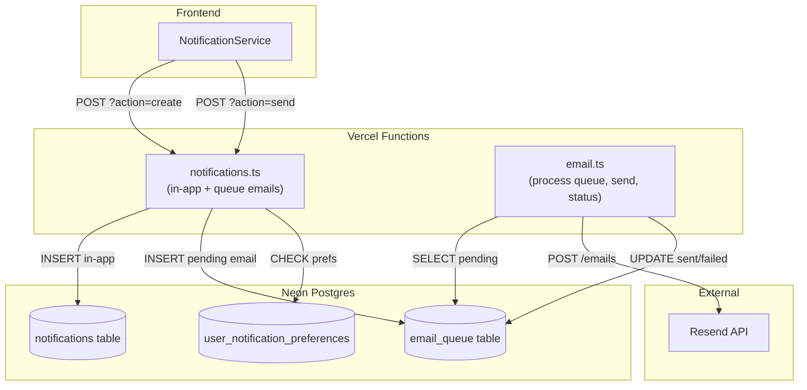
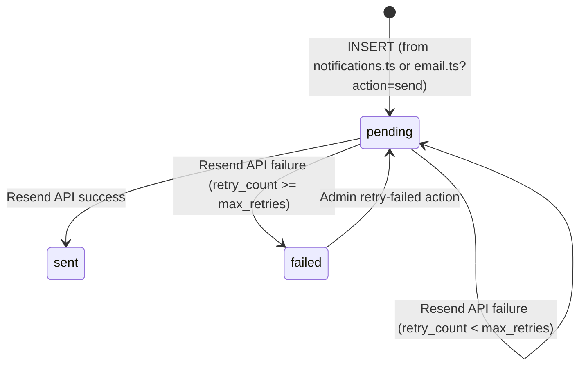

# Design Document: Email Notification Cleanup

## Overview

This design covers four workstreams:

1. A reliable email delivery pipeline using Resend, backed by the existing `email_queue` database table
2. Replacing the unused `api-src/ping.ts` endpoint with `api-src/email.ts` to stay within Vercel's 12-function limit
3. A template system for generating branded HTML emails for lifecycle events
4. Cleanup of legacy directories (`infra/`, `supabase/`) and root-level file clutter

The core architectural change separates email delivery from notification creation. Currently, `notifications.ts` sends emails inline during the admin `send` action via a direct `fetch` to Resend. The new design moves all email sending to a dedicated `email.ts` endpoint that processes a database-backed queue. The `notifications.ts` endpoint becomes responsible only for in-app notifications and inserting rows into `email_queue`. This decoupling means email failures never block notification creation, and failed emails can be retried independently.

## Architecture



### Request Flow

1. Frontend calls `notifications.ts?action=create` or `?action=send`
2. `notifications.ts` inserts an in-app notification row, checks user preferences, and if email-eligible, inserts a row into `email_queue` with status `pending`
3. `email.ts?action=process-queue` (called by admin or cron) selects pending emails ordered by priority and creation time, sends each via Resend, and updates status to `sent` or increments `retry_count`
4. `email.ts?action=queue-status` returns aggregate counts for monitoring
5. `email.ts?action=retry-failed` resets failed emails back to pending

### Endpoint Replacement Strategy

`ping.ts` is a zero-dependency health check that returns `{ success: true, message: "pong" }`. The existing `health.ts?action=ping` already provides this functionality. Replacing `ping.ts` with `email.ts` keeps the function count at 12.

Files to delete: `api-src/ping.ts`, `api/ping.js`
Files to create: `api-src/email.ts` → bundled to `api/email.js`

## Components and Interfaces

### 1. Email Endpoint (`api-src/email.ts`)

Vercel function with query parameter routing, Arcjet protection, and auth middleware.

**Actions:**

| Action | Method | Auth | Role | Description |
|--------|--------|------|------|-------------|
| `send` | POST | Required | Any authenticated | Queue a single email |
| `process-queue` | POST | Required | admin, super_admin | Process pending emails |
| `retry-failed` | POST | Required | admin, super_admin | Reset failed → pending |
| `queue-status` | GET | Required | admin, super_admin | Get counts by status |

```typescript
// api-src/email.ts - Pseudocode structure
import type { VercelRequest, VercelResponse } from '@vercel/node';
import { handleCors } from '../lib/cors';
import { query } from '../lib/db';
import { getAuthUser } from '../lib/auth/middleware';
import { withArcjetProtection } from '../lib/arcjet';
import { sendSuccess, sendError, handleError, HttpStatus } from '../lib/errorHandler';
import { USER_ROLES } from '../lib/queries';
import { renderEmailTemplate } from '../lib/emailTemplates';

async function handler(req: VercelRequest, res: VercelResponse) {
  if (handleCors(req, res)) return;
  const action = req.query.action as string;

  switch (action) {
    case 'send':       return handleSendToQueue(req, res);
    case 'process-queue': return handleProcessQueue(req, res);
    case 'retry-failed':  return handleRetryFailed(req, res);
    case 'queue-status':  return handleQueueStatus(req, res);
    default: return sendError(res, 'Invalid action', HttpStatus.BAD_REQUEST);
  }
}

export default withArcjetProtection(handler, 'general');
```

**`handleSendToQueue`**: Validates recipient/subject/body, inserts into `email_queue` with status `pending`. Optionally accepts `template_name` and `template_data` to render HTML via the template module.

**`handleProcessQueue`**: Admin-only. Selects up to 10 pending emails ordered by `priority ASC, created_at ASC`. For each, calls Resend API. On success: sets `status = 'sent'`, `sent_at = NOW()`. On failure: increments `retry_count`; if `retry_count >= max_retries`, sets `status = 'failed'` and records `error_message`.

**`handleRetryFailed`**: Admin-only. Runs `UPDATE email_queue SET status = 'pending', retry_count = 0, error_message = NULL WHERE status = 'failed'`.

**`handleQueueStatus`**: Admin-only. Returns `SELECT status, COUNT(*) FROM email_queue GROUP BY status`.

### 2. Email Template Module (`lib/emailTemplates.ts`)

Pure function module, no side effects. Takes a template name and data object, returns an HTML string.

```typescript
interface EmailTemplateData {
  recipientName?: string;
  applicationNumber?: string;
  programName?: string;
  status?: string;
  interviewDate?: string;
  interviewLocation?: string;
  actionUrl?: string;
  message?: string;
}

function renderEmailTemplate(templateName: string, data: EmailTemplateData): string
```

**Supported templates:** `welcome`, `application-submitted`, `status-change`, `payment-verified`, `interview-scheduled`, `generic`

Each template wraps content in a shared layout with MIHAS branding header and footer. If `templateName` is unrecognized, falls back to `generic` template using `data.message`.

### 3. Modified Notifications Endpoint (`api-src/notifications.ts`)

Changes to existing actions:

- **`create` action**: After inserting the in-app notification, check if the notification type is email-eligible. If so, look up the user's email from `profiles`, check notification preferences (skip if user opted out of that category, unless mandatory), and insert a row into `email_queue`.
- **`send` action** (admin): Same as above but also queues email. Remove the inline `fetch` to Resend API — all email sending goes through the queue now.
- Remove `buildNotificationEmailHtml` function (replaced by `lib/emailTemplates.ts`).

### 4. Notification Policy Updates (`lib/notificationPolicy.ts`)

Extend with a mapping from notification types to email template names and preference categories:

```typescript
interface EmailMapping {
  templateName: string;
  preferenceKey: keyof NotificationPreferences | null; // null = always send
}

const EMAIL_TYPE_MAP: Record<string, EmailMapping> = {
  'welcome': { templateName: 'welcome', preferenceKey: null },
  'application_submitted': { templateName: 'application-submitted', preferenceKey: 'application_updates' },
  'application_status_change': { templateName: 'status-change', preferenceKey: null },
  'payment_verified': { templateName: 'payment-verified', preferenceKey: null },
  'interview_scheduled': { templateName: 'interview-scheduled', preferenceKey: null },
  'info': { templateName: 'generic', preferenceKey: 'application_updates' },
  'warning': { templateName: 'generic', preferenceKey: 'application_updates' },
};
```

### 5. Frontend NotificationService (`src/lib/notificationService.ts`)

No structural changes needed. The service already calls `?action=create` and `?action=send` on the notifications API. Email queuing happens server-side transparently. The only change is ensuring lifecycle event methods pass the correct notification `type` so the backend can map to the right email template.

## Data Models

### Existing: `email_queue` Table

Already exists in the database (from `migrations/003_supporting_tables.sql`):

```sql
CREATE TABLE IF NOT EXISTS email_queue (
    id UUID PRIMARY KEY DEFAULT gen_random_uuid(),
    recipient_email VARCHAR(255) NOT NULL,
    recipient_name VARCHAR(255),
    subject VARCHAR(255) NOT NULL,
    body TEXT NOT NULL,
    html_body TEXT,
    template_name VARCHAR(100),
    template_data JSONB,
    status VARCHAR(20) DEFAULT 'pending',    -- pending | sent | failed
    priority INTEGER DEFAULT 5,               -- 1 = highest, 10 = lowest
    retry_count INTEGER DEFAULT 0,
    max_retries INTEGER DEFAULT 3,
    error_message TEXT,
    sent_at TIMESTAMPTZ,
    created_at TIMESTAMPTZ DEFAULT now()
);
```

No schema changes needed. The table already supports all required fields.

### Existing: `notifications` Table

Used for in-app notifications. No changes needed.

### Existing: `user_notification_preferences` Table

Used to check opt-out preferences before queuing emails. No changes needed.

### Email Queue State Machine




## Correctness Properties

*A property is a characteristic or behavior that should hold true across all valid executions of a system — essentially, a formal statement about what the system should do. Properties serve as the bridge between human-readable specifications and machine-verifiable correctness guarantees.*

### Property 1: Notification create queues email for eligible types

*For any* notification created via the `create` or `send` action with an email-eligible type, and for any user who has not opted out of that email category (or for mandatory types regardless of preferences), a corresponding row SHALL exist in `email_queue` with status `pending`, the correct recipient email, subject, and template metadata.

**Validates: Requirements 1.1, 3.3, 5.2**

### Property 2: Email send action inserts pending row

*For any* valid recipient email, subject, and body provided to the email endpoint's `send` action, a row SHALL be inserted into `email_queue` with status `pending` and the provided fields preserved exactly.

**Validates: Requirements 2.2**

### Property 3: Process-queue sends in priority order and updates status

*For any* set of pending emails in the queue, when `process-queue` is called and the Resend API succeeds for all, every processed email SHALL have status `sent` and a non-null `sent_at` timestamp, and emails SHALL be processed in ascending priority then ascending creation time order.

**Validates: Requirements 1.2**

### Property 4: Retry behavior on send failure

*For any* email in the queue with `retry_count < max_retries`, if the Resend API fails during processing, the `retry_count` SHALL be incremented by 1, the `error_message` SHALL be recorded, and the status SHALL remain `pending`. If `retry_count` equals `max_retries` after incrementing, the status SHALL be set to `failed`.

**Validates: Requirements 1.3, 1.4**

### Property 5: Retry-failed resets all failed emails

*For any* set of emails with status `failed` in the queue, after calling `retry-failed`, all previously failed emails SHALL have status `pending` and `retry_count` equal to 0.

**Validates: Requirements 1.5, 6.2**

### Property 6: Queue-status returns accurate counts

*For any* distribution of emails across `pending`, `sent`, and `failed` statuses in the queue, the `queue-status` action SHALL return counts that exactly match the actual row counts per status in the database.

**Validates: Requirements 1.6, 6.1**

### Property 7: RBAC enforcement on email endpoint

*For any* request to the email endpoint, unauthenticated requests SHALL receive a 401 response. *For any* authenticated request with a non-admin role (student, reviewer) to `process-queue` or `retry-failed`, the endpoint SHALL return a 403 response. Only `admin` and `super_admin` roles SHALL be permitted.

**Validates: Requirements 2.3, 2.4**

### Property 8: Preference enforcement with mandatory bypass

*For any* non-mandatory notification type and any user whose preferences have that email category disabled, no email SHALL be queued. *For any* mandatory notification type (`application_status_change`, `payment_verified`, `interview_scheduled`), an email SHALL always be queued regardless of user preferences.

**Validates: Requirements 3.6, 6.3**

### Property 9: Template rendering produces branded HTML

*For any* recognized template name and any valid `EmailTemplateData` object, `renderEmailTemplate` SHALL return a non-empty string containing the MIHAS branding header text and footer text. *For any* unrecognized template name, the function SHALL return HTML using the generic template with the provided message content.

**Validates: Requirements 4.1, 4.3, 4.4**

## Error Handling

| Scenario | Behavior |
|----------|----------|
| Resend API returns non-2xx | Increment `retry_count`, record error message, keep `pending` (or set `failed` at max retries) |
| Resend API network timeout | Same as non-2xx — treat as transient failure |
| `RESEND_API_KEY` not configured | `process-queue` returns error; emails stay `pending` |
| Invalid recipient email format | `send` action rejects with 400 before inserting |
| Missing required fields (subject, body) | `send` action rejects with 400 |
| Database query failure | Return 500 via `handleError`; no partial state changes (queue insert is atomic) |
| User profile not found (no email) | Skip email queuing, log warning (no PII), in-app notification still created |
| Unknown template name | Fall back to `generic` template — never throw |
| Unauthenticated request | Return 401 via auth middleware |
| Non-admin calling admin actions | Return 403 |

All errors are sanitized through `lib/errorHandler.ts` before being returned to clients. No PII is ever included in error responses or logs.

## Testing Strategy

### Property-Based Testing

Library: **fast-check** (already in project dependencies)
Minimum iterations: 100 per property test
Tag format: `Feature: email-notification-cleanup, Property N: {title}`

Property tests focus on:
- Email template rendering (Property 9) — generate random template names and data objects, verify HTML structure
- Retry state machine (Property 4) — generate emails with random retry_counts and max_retries, verify state transitions
- Preference enforcement (Property 8) — generate random preference configurations and notification types, verify queuing decisions
- Queue-status aggregation (Property 6) — generate random email distributions, verify counts match

### Unit Testing

Framework: **Vitest**

Unit tests focus on:
- Each email endpoint action (send, process-queue, retry-failed, queue-status) with specific examples
- Notification create action with email queuing for each lifecycle event type (welcome, submitted, status-change, payment-verified, interview-scheduled)
- RBAC enforcement: specific role/action combinations
- Template rendering: each named template produces expected content
- Edge cases: empty queue processing, all emails already sent, mixed success/failure in batch

### Integration Testing

- End-to-end flow: create notification → verify email_queue row → process queue with mocked Resend → verify status update
- Admin retry flow: insert failed emails → retry-failed → process-queue → verify sent

### Test File Locations

| Test Type | Location |
|-----------|----------|
| Property tests | `tests/property/emailTemplates.test.ts`, `tests/property/emailQueue.test.ts` |
| Unit tests | `tests/unit/emailEndpoint.test.ts`, `tests/unit/emailTemplates.test.ts` |
| Integration tests | `tests/integration/emailPipeline.test.ts` |
