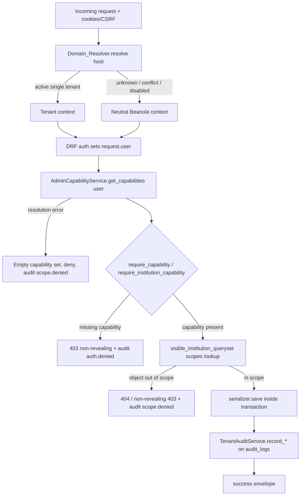
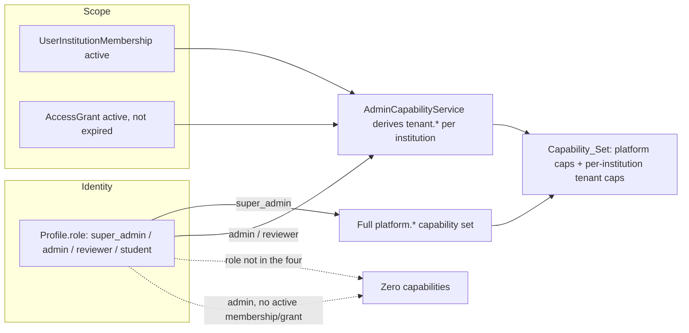
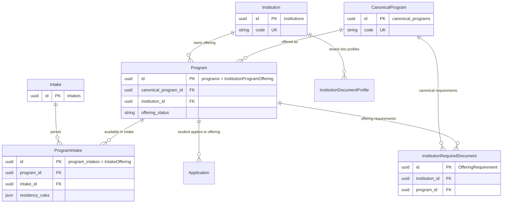
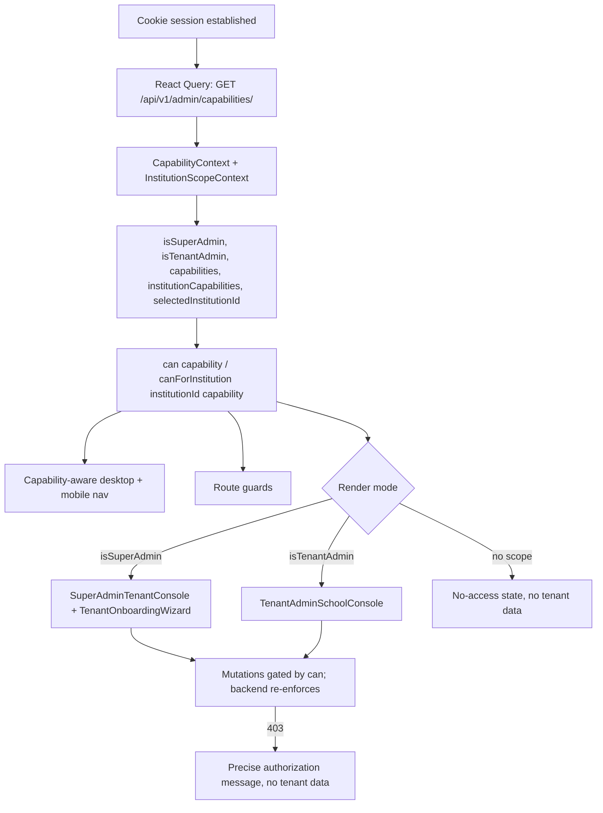
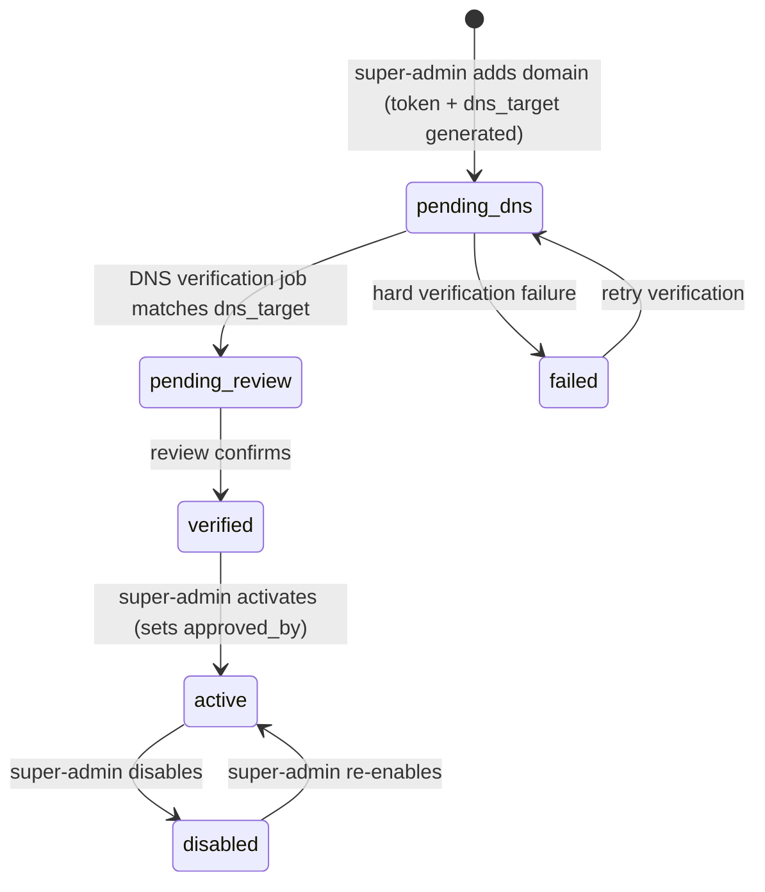

# Design Document

## Overview

This design turns the admissions platform from a MIHAS/KATC-shaped single-purpose admin into a **Beanola-owned enterprise multi-tenant admissions platform**, where MIHAS, KATC, and every future university or college are *tenants* and Beanola Technologies is the platform owner. It satisfies the 19 requirements in `requirements.md` and executes the remediation in `docs/tenant-admin-super-admin-permissions-plan.md`.

The platform already has strong tenant-aware foundations: `AccessScopeService` and `InstitutionContextService` (`backend/apps/catalog/services.py`), the super-admin-gated tenant onboarding endpoints (`backend/apps/catalog/admin_views.py`), `AdminScopeView` (`GET /api/v1/admin/scope/`), `TenantAuditService` (audit reuse of `audit_logs`), and the frontend `InstitutionScopeContext`. The gap this design closes is **authority drift**: the legacy catalog write paths in `backend/apps/catalog/views.py` (`InstitutionListCreateView`, `ProgramListCreateView`, `IntakeListCreateView`, and their detail views) still gate on the generic `IsAdmin`, and `apps/admissions/src/pages/admin/Tenants.tsx` still renders one all-powerful admin console without capability gating. Both treat a generic `admin` as if it were platform-wide authority, which is the central security risk.

The design's non-negotiable principle: **the backend is the only security boundary.** Every frontend `can()`/`canForInstitution()` check is a usability layer over mandatory backend enforcement evaluated through a single centralized service. The work is additive and backward compatible — Neon/production records keep working, schema changes ship as additive SQL scripts under `backend/scripts/` (the `managed = False` convention), and there is no legacy MIHAS/KATC hardcoding.

The design introduces one authoritative authorization service (`AdminCapabilityService`), a first-class **capability** vocabulary (`platform.*` and `tenant.*`) layered over the existing four roles, an enriched capability endpoint, DRF permission classes that defer to the service, a complete `InstitutionDomain` lifecycle with a verification job and a fail-closed `Domain_Resolver`, a canonical program/offering data model, capability-aware frontend state, and an authority-split admin console with a tenant onboarding wizard.

### Design principles

1. **One authorization brain.** All authority decisions resolve through `AdminCapabilityService`, which composes the existing `is_super_admin`, `ROLE_HIERARCHY`, and `AccessScopeService` rather than re-deriving scope. Endpoint code never compares raw role strings.
2. **Scope before lookup.** Every tenant-sensitive object lookup filters through `visible_institution_queryset(user)` (or the existing `AccessScopeService` filters) *before* `.get()`, so an out-of-scope identifier returns 404 / non-revealing 403 and cannot be confirmed to exist.
3. **Fail closed.** Capability-resolution errors yield an empty capability set and deny; unknown/conflicting/disabled domains resolve to the Neutral Beanola context.
4. **Additive and reversible.** New columns/tables ship as idempotent additive SQL under `backend/scripts/`; rollbacks accompany each script. No `managed = True` Django migrations against production tables.
5. **Reuse, don't reinvent.** Audit reuses `audit_logs` via `TenantAuditService`; scope reuses `AccessScopeService`; brand fallback reuses `InstitutionContextService.BEANOLA_BRAND`.

## Architecture

### 1. Request → domain-resolution → capability → scope → audit pipeline

Every authenticated admin write passes through the same five stages. The backend is the boundary at each stage.



The ordering is deliberate: capability checks happen **before any serializer save** (R3.4), and queryset scoping happens **before object retrieval** (R3.5, R4.5), so out-of-scope identifiers are never confirmed.

### 2. Role / membership / grant / capability relationship

Roles say *who you are globally*; memberships and grants say *which tenants you touch*; capabilities say *what you may do*. Capabilities are derived, never stored as the authority for new logic.



Super-admin authority comes **only** from `role == "super_admin"` (R1.4) and never from a membership or grant. A generic `admin` with no active membership and no active grant resolves to **zero** capabilities and zero tenant data (R1.3, R3.3). Any role string outside the four canonical roles also resolves to zero capabilities (R1.1).

### 3. Program / offering data model

The canonical-program / offering model already exists in part (`CanonicalProgram`, `Program` with `canonical_program_id`, `ProgramIntake`). This design names the offering-requirement and intake-offering concepts explicitly and maps them onto the existing tables so students apply to a tenant-specific *offering*.



Mapping of requirement names to existing tables: **Canonical_Program** = `CanonicalProgram` (`canonical_programs`); **Institution_Program_Offering** = `Program` (`programs`, the `program_offering_id`); **Offering_Requirement** = `InstitutionRequiredDocument` + `InstitutionDocumentProfile`; **Intake_Offering** = `ProgramIntake` (`program_intakes`). This reuse preserves all existing applicant data and the canonical-truth map.

### 4. Frontend capability-aware admin state flow



The frontend never trusts itself: a hidden button is convenience, and the backend returns 403/404 regardless. The capability set is the single source of truth for both navigation and controls, so super-admins and tenant-admins render distinct surfaces from one backend payload.

## Components and Interfaces

### Backend

#### AdminCapabilityService (`backend/apps/catalog/services.py`)

The centralized authorization brain (R3). It composes existing primitives (`is_super_admin`, `ROLE_HIERARCHY`, `AccessScopeService`) and is the only place authority is decided. It never compares raw role strings in endpoint code (R1.5).

```python
class CapabilityResolutionError(Exception):
    """Raised when a Capability_Set cannot be resolved (R1.6). Callers fail closed."""

class AdminCapabilityService:
    # --- Capability catalogues (R2.5, R2.6) ---
    PLATFORM_CAPABILITIES: frozenset[str]   # platform.* (17 strings)
    TENANT_CAPABILITIES: frozenset[str]     # tenant.* (17 strings)

    def get_capabilities(self, user) -> CapabilitySet:
        """Resolve platform caps + per-institution tenant caps. Empty on any
        non-canonical role, or admin with no active membership/grant (R1.1, R1.3).
        Super_Admin -> all PLATFORM_CAPABILITIES (R2.2, R3.2). Raises
        CapabilityResolutionError on dependency failure (R1.6)."""

    def get_institution_capabilities(self, user, institution) -> frozenset[str]:
        """tenant.* capabilities the user holds for one institution (R3.1)."""

    def require_capability(self, user, capability) -> None:
        """Raise PermissionDenied if the platform capability is absent (R3.4)."""

    def require_institution_capability(self, user, institution, capability) -> None:
        """Raise PermissionDenied if the per-institution capability is absent."""

    def visible_institution_queryset(self, user):
        """Institution queryset scoped to the actor (all for super-admin; the
        membership/grant set otherwise; .none() for no-scope). Used before every
        tenant-sensitive object lookup (R3.5, R4.5)."""

    def can_manage_institution(self, user, institution) -> bool: ...
    def can_manage_program(self, user, program) -> bool:
        """Canonical/global programs need platform caps; school-local offerings
        need the tenant program capability for the owning institution (R5.2)."""
    def can_manage_domain(self, user, domain) -> bool: ...
    def can_invite_staff(self, user, institution, target_role) -> bool:
        """True only if user holds tenant.staff.invite for institution AND
        target_role is at or below the inviter's delegated authority (R6.3, R6.4)."""
```

`CapabilitySet` is a frozen dataclass: `role: str`, `is_super_admin: bool`, `all_access: bool`, `platform_capabilities: frozenset[str]`, `institution_capabilities: dict[str, frozenset[str]]` (keyed by institution id). Tenant capabilities are derived from active memberships and active, non-expired grants exactly as `AccessScopeService.filters_for_user` already computes scope (R3.3) — the service reuses `AccessScopeService` so there is one scope computation.

**Capability derivation rule.** A membership's `role`/`permissions` and a grant's `permissions` map to a fixed tenant-capability bundle. The default bundle for a tenant-admin membership is read-oriented (`tenant.profile.read`, `tenant.application.read`, `tenant.document.read`, `tenant.payment.read`, `tenant.staff.read`, `tenant.audit.read`, `tenant.program.read`, `tenant.domain.read`) plus any explicitly granted mutation capabilities (`tenant.application.review`, `tenant.document.verify`, `tenant.payment.verify`, `tenant.staff.invite`, `tenant.staff.disable`, `tenant.profile.request_change`, `tenant.program.request_change`, `tenant.domain.request_change`, `tenant.application.export`). This keeps "read-only by default, mutate only when granted" (plan §4.2).

#### Capability_Endpoint (`backend/apps/accounts/admin_user_views.py`)

Extends the existing `AdminScopeView` and adds a sibling alias so both paths in the plan work:

- `GET /api/v1/admin/scope/` — extended to include `is_super_admin`, platform `capabilities`, and per-institution `capabilities` while keeping the existing `role`, `all_access`, `institutions[{id, code, name}]` shape (backward compatible).
- `GET /api/v1/admin/capabilities/` — new alias returning the full `CapabilitySet` payload (R2.1).

Response (inside the `{"success": true, "data": ...}` envelope, R2.4):

```json
{ "success": true, "data": {
  "role": "admin", "is_super_admin": false, "all_access": false,
  "capabilities": ["tenant.application.read", "tenant.application.review"],
  "institutions": [
    { "id": "uuid", "code": "MIHAS", "name": "MIHAS",
      "capabilities": ["tenant.application.read", "tenant.staff.invite"] }
  ]
}}
```

Super-admins receive the full `platform.*` list (R2.2); non-super-admins receive only `tenant.*` capabilities scoped per institution (R2.3).

#### DRF permission classes / mixins (`backend/apps/catalog/permissions.py` — new)

Thin DRF classes that delegate to the service so views stay declarative:

```python
class HasPlatformCapability(BasePermission):
    capability: str  # set per view, e.g. "platform.tenant.create"
    def has_permission(self, request, view):
        try:
            AdminCapabilityService().require_capability(request.user, view.required_capability)
            return True
        except (PermissionDenied, CapabilityResolutionError):
            TenantAuditService.record_scope_denied(...)  # R10.6
            return False

class TenantScopedCapabilityMixin:
    """Provides get_scoped_object(): scopes via visible_institution_queryset
    BEFORE .get(), returning 404 for out-of-scope ids (R3.5, R4.3, R4.5)."""
```

Legacy catalog write views (`InstitutionListCreateView`, `InstitutionDetailView`, `ProgramListCreateView`, `ProgramDetailView`, `IntakeListCreateView`, `IntakeDetailView`) are retrofitted (R5):

- Institution create/update/delete → require `platform.tenant.create` / `platform.tenant.update` / `platform.tenant.deactivate` (R5.1).
- Program create/update/delete → `platform.canonical_program.manage` for canonical/global programs, or `can_manage_program` (tenant `tenant.program.request_change` for school-local offerings) (R5.2); a submitted out-of-scope `institution_id` is rejected without mutation (R5.4).
- Intake create/update/delete → `platform.intake.manage` (intakes remain global) (R5.3).
- Public/Student `GET` behavior is unchanged (R5.5) — only the write methods change permission classes.

#### Domain_Resolver (`InstitutionContextService.resolve` extended, `backend/apps/catalog/services.py`)

The resolver already maps a host to a tenant or the Beanola context and fails closed on multi-tenant collisions. It is extended to honor the new `status` field: a host resolves to a tenant **only** when a single `InstitutionDomain` with `status == "active"`, `is_active == true`, and an active institution matches (R7.8). Unknown hosts, hostnames mapped to more than one active tenant, or domains in `pending_dns`/`pending_review`/`verified`/`disabled`/`failed` resolve to the Neutral Beanola context without exposing tenant context (R7.9, R19). Collisions and unknowns are logged for operations review (R19.4). Resolution is a single indexed lookup on `institution_domains.hostname` plus the tenant fetch, satisfying the 100 ms budget (R7.8).

Application creation binds to the resolved tenant (R7.11). If an application-create request supplies an `institution_id` that differs from the resolved tenant, the request is rejected without mutation and the resolved binding is retained (R7.12) — implemented in the application create path by comparing the posted institution against the resolved context before assignment.

#### Domain verification Celery task (`backend/apps/catalog/tasks.py`)

```python
@shared_task
def verify_institution_domain_task(domain_id):
    """R7.4/R7.5. DNS lookup (10s timeout) for the domain's expected dns_target.
    Match -> status pending_dns->pending_review, set verified_at + last_checked_at,
    emit audit. No match / timeout -> stay pending_dns, set descriptive last_error,
    update last_checked_at. Never raises out (fail-safe)."""
```

Activation stays super-admin-only (R7.14): `verified → active` only via the super-admin domain-activate endpoint, which sets `approved_by` (R7.6) and rejects activation of any non-`verified` domain (R7.7). Adding a domain generates a ≥32-char `verification_token` and a `dns_target`, sets `status = pending_dns`, and returns the required DNS record (R7.3). Duplicate active hostnames across tenants are rejected (R7.10) via a partial unique index.

#### Audit emission helper (`TenantAuditService`, `backend/apps/catalog/tenant_audit_service.py`)

Reuse the existing service (ADR-003, audit reuse of `audit_logs`). New/confirmed actions: tenant create/update/deactivate, domain create/verify/activate/disable, asset/template/document-config/program-assignment changes, user-invite/membership/grant changes, review/document-verify/payment-verify decisions, and **failed authorization on a sensitive admin endpoint** (`auth.denied`, joining the existing `scope.denied`) (R10.1–R10.6). All payloads run through the shared PII redactor (R10.7 fields recorded with no raw PII; plan §6). Tenant-admins with `tenant.audit.read` read only their own institution's events (R10.8) via institution-scoped filtering on `changes.institution_id`.

#### Staff creation transaction (`backend/apps/accounts/admin_user_views.py` + `backend/apps/catalog/admin_views.py`)

Tenant-admin staff creation wraps user + profile + `UserInstitutionMembership` in one `transaction.atomic()` block; a membership failure rolls back the user and profile (R6.5, R6.6). The existing privilege-escalation guards (`_role_level`, "cannot assign a role higher than your own", self-deactivation block) are retained and extended so only super-admins create/promote `super_admin` or unscoped global admins (R6.1, R6.2), tenant-admins invite only into institutions they manage (R6.3) with `target_role` at or below their authority (R6.4), and tenant-admins cannot alter their own grants/memberships (R6.7) or grant cross-tenant access (R6.8). Deactivating a tenant suspends that tenant's memberships predictably (R6.9).

### Frontend

#### CapabilityContext + InstitutionScopeContext additions (`apps/admissions/src/contexts/`)

A new `CapabilityContext` (or extension of `InstitutionScopeContext`) consumes the Capability_Endpoint via React Query and exposes (R11.1, R11.2):

```typescript
interface CapabilityValue {
  isSuperAdmin: boolean
  isTenantAdmin: boolean
  capabilities: string[]                                   // platform.* for super-admin
  institutionCapabilities: Record<string, string[]>        // institutionId -> tenant.*
  selectedInstitutionId: string | null
  can: (capability: string) => boolean
  canForInstitution: (institutionId: string, capability: string) => boolean
}
```

`isSuperAdmin`/`isTenantAdmin` derive from the backend `is_super_admin` flag and the presence of institution capabilities — not from raw role strings (consistent with `types/roles.ts` helpers). Selected institution scope persists across refresh in `sessionStorage` (R11.4), reusing the existing `InstitutionScopeContext` persistence. With no tenant scope, the context yields a clear no-access state and renders no tenant data (R11.5). `AuthContext` is left as the cookie/session authority and gains no role logic; capability state is a sibling context so the security source stays the backend.

#### Tenants.tsx split (`apps/admissions/src/pages/admin/`)

`Tenants.tsx` becomes a thin switcher that renders by capability (R12.1):

```
Tenants.tsx
├── SuperAdminTenantConsole.tsx      (isSuperAdmin)
│   ├── TenantListPanel.tsx          (all tenants + "New institution")
│   ├── TenantOnboardingWizard.tsx
│   ├── TenantBrandingPanel.tsx / TenantDomainPanel.tsx / TenantDocumentsPanel.tsx
│   ├── TenantProgramsPanel.tsx / TenantStaffPanel.tsx
│   ├── TenantAccessGrantsPanel.tsx / TenantAuditPanel.tsx
└── TenantAdminSchoolConsole.tsx     (isTenantAdmin)
    └── assigned-institution panels (read-only / request-only by capability)
```

A super-admin sees all tenants and the create control (R12.2); a tenant-admin sees only the assigned institution(s) (R12.3) and never the "New institution" control (R12.4) or global access-grant tooling unless explicitly granted (R12.5). Mutation controls are removed/disabled when the corresponding capability is absent (R12.6). A backend 403 renders a precise authorization message and no tenant data (R12.7).

#### Capability-based navigation + route guards (`apps/admissions/src/components/layout/`, route config)

Navigation and guards consume `can()` identically on desktop and mobile (R13.4). Super-admins see the "Tenants" item (R13.1); tenant-admins with `tenant.profile.read` see a school-specific item ("My School") instead of platform tenant management (R13.2). Global tenant creation/management links are super-admin-only (R13.3). A route guard blocks a tenant-admin deep-linking into a super-admin-only route, and the backend re-enforces the permission regardless (R13.5).

#### TenantOnboardingWizard (`apps/admissions/src/pages/admin/tenants/TenantOnboardingWizard.tsx`)

A super-admin-only stepper: institution profile → branding → domains → application templates → required documents → program assignments → intake availability → tenant-admin invitation → review & activate (R14.1). Completing it persists the tenant with no manual DB edit (R14.2, R16.1), shows it in the tenant list immediately (R14.3), verifies and activates the domain to `active` (R14.4), creates the tenant-admin with a membership scoped to the new tenant (R16.2), and the invited admin then sees only that tenant (R14.5, R16.3). Each step calls the existing admin tenant APIs; the wizard is just an orchestrated UI over them.

## Data Models

### Capability catalogue (`platform.*` and `tenant.*`)

Defined as frozensets on `AdminCapabilityService` and registered in `docs/canonical-truth-map.md` with a frontend drift guard (the capability strings are a cross-layer mirror).

**Platform capabilities (R2.5):** `platform.tenant.read_all`, `platform.tenant.create`, `platform.tenant.update`, `platform.tenant.deactivate`, `platform.domain.manage`, `platform.asset.manage`, `platform.template.manage`, `platform.document.manage`, `platform.canonical_program.manage`, `platform.program_assignment.manage`, `platform.intake.manage`, `platform.user.create_global`, `platform.user.manage_all`, `platform.access_grant.manage`, `platform.audit.read_all`, `platform.routing.simulate_all`, `platform.settings.manage`.

**Tenant capabilities (R2.6):** `tenant.profile.read`, `tenant.profile.request_change`, `tenant.application.read`, `tenant.application.review`, `tenant.application.export`, `tenant.document.read`, `tenant.document.verify`, `tenant.payment.read`, `tenant.payment.verify`, `tenant.staff.read`, `tenant.staff.invite`, `tenant.staff.disable`, `tenant.audit.read`, `tenant.program.read`, `tenant.program.request_change`, `tenant.domain.read`, `tenant.domain.request_change`.

### InstitutionDomain lifecycle fields and status state machine

The existing `institution_domains` table has only `hostname`, `is_primary`, `is_active`, `verified_at`, `created_at`. This design **adds** (additively) `status`, `verification_token`, `dns_target`, `last_checked_at`, `last_error`, `created_by_id`, `approved_by_id` (R7.1). `hostname` holds a valid DNS hostname of 1–253 chars; `last_error` is capped at 1000 chars.



Allowed transitions (R7.2), enforced in a `DomainStatusMachine` (pure, table-driven): `pending_dns→pending_review`, `pending_dns→failed`, `pending_review→verified`, `verified→active`, `active→disabled`, `failed→pending_dns`, `disabled→active`. Any other transition is rejected. Only `status == active` resolves a tenant (R7.9). The DNS job leaves `status` at `pending_dns` and records `last_error` on mismatch/timeout (R7.5).

### Canonical program / offering models (existing tables, named)

| Requirement concept | Model | Table | Notes |
|---|---|---|---|
| Canonical_Program | `CanonicalProgram` | `canonical_programs` | Beanola-owned global definition (R8.1). |
| Institution_Program_Offering | `Program` | `programs` | Tenant offering; `canonical_program_id`, `institution_id`, `offering_status`, `assignment_rules`, `assignment_priority` (R8.2). |
| Offering_Requirement | `InstitutionRequiredDocument` + `InstitutionDocumentProfile` | `institution_required_documents`, `institution_document_profiles` | Tenant docs, payment rules, eligibility, templates (R8.3). |
| Intake_Offering | `ProgramIntake` | `program_intakes` | Tenant participation in a global intake; `residency_rules`, capacity (R8.4). |

Students apply against an `Institution_Program_Offering` (R8.5) — already the case via `applications.program_offering` (db_column `program_offering_id`). The shared Beanola portal lists all active offerings grouped by canonical program (R8.6); a tenant portal lists only that tenant's offerings (R8.7) via `InstitutionContextService` filtering. Only super-admins assign canonical programs to tenants; tenant-admins may only `tenant.program.request_change` (R8.8).

### AuditEvent fields (mapped onto `audit_logs`)

The requirement's `Audit_Event` (R10.7) maps onto the existing `audit_logs` columns plus the `changes` jsonb payload (no new table — ADR-003):

| Requirement field | Storage |
|---|---|
| `actor_user_id` | `audit_logs.actor_id` |
| `actor_role`, `actor_institution_scope`, `target_institution_id`, `object_type`, `request_id`, `status`, `reason` | `audit_logs.changes` jsonb keys |
| `action` | `audit_logs.action` |
| `object_id` | `audit_logs.entity_id` |
| `ip_address`, `user_agent` | `audit_logs.ip_address`, `audit_logs.user_agent` (SHA-256 hashes — never raw) |
| `created_at` | `audit_logs.created_at` |

`institution_id` is always written into `changes` so per-institution audit reads (R10.8) filter on it. PII is redacted via the shared `PaymentAuditService._redact_pii` (R10.7, plan §6).

### Additive SQL migration scripts (`backend/scripts/`, `managed = False`)

All scripts follow the established convention (idempotent, additive-only, `CREATE TABLE/INDEX IF NOT EXISTS`, `NOT VALID` FKs, no `DROP`/rewrite, re-applies as a no-op), are applied by `apply_sql_migrations`, tracked in `migration_history`, with a matching `_rollback.sql`. They preserve backward compatibility with existing Neon/production records.

1. **`2026_06_18_01_institution_domain_lifecycle.sql`** — `ALTER TABLE institution_domains ADD COLUMN IF NOT EXISTS status varchar(20) NOT NULL DEFAULT 'active'`, plus `verification_token varchar(128)`, `dns_target varchar(255)`, `last_checked_at timestamptz`, `last_error varchar(1000)`, `created_by_id uuid`, `approved_by_id uuid`. Existing rows default to `status='active'` (they are already live), preserving current resolution behavior. Adds a **partial unique index** `CREATE UNIQUE INDEX IF NOT EXISTS uq_institution_domains_active_hostname ON institution_domains (lower(hostname)) WHERE status = 'active'` to forbid duplicate active hostnames (R7.10), and `idx_institution_domains_status` for resolution. `NOT VALID` FKs for `created_by_id`/`approved_by_id` → `profiles(id)`.

The `Program`/`ProgramIntake`/`CanonicalProgram`/`InstitutionRequiredDocument` tables already exist (multi-tenant migrations `2026_06_08_*`), so no new program/offering tables are required — only the named mapping above. If `tenant.program.request_change` requires a request record, a future additive `tenant_change_requests` table can be added the same way; V1 routes requests through audit + admin notification, avoiding new tables.

## Correctness Properties


*A property is a characteristic or behavior that should hold true across all valid executions of a system — essentially, a formal statement about what the system should do. Properties serve as the bridge between human-readable specifications and machine-verifiable correctness guarantees.*

These correctness properties apply strongly here because the authorization core (capability derivation, scope filtering, the domain status machine, fail-closed resolution, no-privilege-escalation) is pure logic over large, structured input spaces. The backend suite uses **pytest + hypothesis**; the frontend capability/nav suite uses **fast-check** (`apps/admissions/tests/property/`). Each property below was distilled from the prework and de-duplicated so each provides unique validation value.

### Property 1: Capability-set derivation

*For all* actors, `AdminCapabilityService.get_capabilities` returns the full `platform.*` catalogue when and only when the actor's role is `super_admin`; for every other actor it returns only `tenant.*` capabilities, each attributable to an active (`is_active` true) and non-expired Membership or Access_Grant for the institution it is scoped to; and it returns an empty capability set whenever the actor's role is not one of the four canonical roles or the actor is a non-super-admin with no active Membership and no active Access_Grant.

**Validates: Requirements 1.1, 1.2, 1.3, 1.4, 2.2, 2.3, 3.2, 3.3**

### Property 2: Capability endpoint payload shape

*For all* actors, the Capability_Endpoint response is wrapped in the `{"success": true, "data": ...}` envelope and its data always contains `role`, `is_super_admin`, `all_access`, a platform `capabilities` list, and an `institutions` list whose every entry carries `id`, `code`, `name`, and a per-institution `capabilities` list.

**Validates: Requirements 2.1, 2.4**

### Property 3: Capability-resolution failure fails closed

*For all* actors, if capability resolution raises a `CapabilityResolutionError` (dependency unavailable), then the actor's effective capability set is empty, the requested action is denied, no tenant data is returned, and an authorization error is produced.

**Validates: Requirements 1.6**

### Property 4: Cross-tenant invisibility across every scoped surface

*For all* pairs of distinct tenants and any non-super-admin actor scoped only to the first tenant, no surface — institution list, detail, search, exports, dashboards, documents, payments, audit logs, applications, users, routing simulation, or analytics — returns any row, identifier, name, count, or attribute belonging to the second tenant.

**Validates: Requirements 4.1, 4.2, 7.13, 10.8, 17.1, 17.2, 18.5**

### Property 5: Scope-before-lookup non-revealing not-found

*For all* out-of-scope object identifiers requested by a non-super-admin actor, the tenant-sensitive queryset is scoped before retrieval so the lookup returns a 404 (or a non-revealing 403) whose body discloses no tenant identifier, name, count, or attribute, and the out-of-scope identifier can never be confirmed to exist.

**Validates: Requirements 3.5, 4.3, 4.5, 17.4**

### Property 6: Foreign / override institution id never mutates

*For all* mutation requests (legacy catalog writes, admin tenant writes, and application creation) that carry an institution identifier the actor is not authorized for — including an application-create institution that differs from the resolved tenant context — the request is rejected with no data mutation, the resolved tenant binding is retained, and no target-tenant data is disclosed.

**Validates: Requirements 4.4, 5.4, 7.12, 17.5**

### Property 7: Capability-gated writes / no privilege escalation

*For all* tenant-sensitive write operations (legacy institution/program/intake writes, domain activation, canonical-program assignment, production template edits, super-admin/global-admin creation, and staff invitation), the operation evaluates the required capability through `AdminCapabilityService` before any serializer save and succeeds only if the actor holds that capability; otherwise it is denied with no mutation. Creating or promoting a `super_admin` or an unscoped global admin succeeds only for a `super_admin`.

**Validates: Requirements 3.4, 5.1, 5.2, 5.3, 6.1, 6.2, 7.14, 8.8, 9.4**

### Property 8: Invite scope and role ceiling

*For all* staff invitations by a non-super-admin actor, the invitation succeeds only when the actor holds `tenant.staff.invite` for the target institution and the assigned tenant role is at or below the actor's delegated authority; an invitation into an institution the actor does not manage, or with a role above the actor's authority, is rejected.

**Validates: Requirements 6.3, 6.4, 17.6**

### Property 9: Transactional staff creation rollback

*For all* tenant-admin staff-creation requests, the user, profile, and Institution Membership are created within one database transaction; if Membership creation fails, no user row and no profile row persist.

**Validates: Requirements 6.5, 6.6**

### Property 10: Tenant-admins cannot self-escalate or cross-grant

*For all* grant/membership mutations attempted by a tenant-admin, a mutation that targets the actor's own grants or memberships, or that grants access to any institution outside the actor's scope, is rejected.

**Validates: Requirements 6.7, 6.8**

### Property 11: Domain status machine allows only defined transitions

*For all* pairs of domain statuses `(from, to)`, the transition is permitted by the `DomainStatusMachine` if and only if `(from, to)` is one of `pending_dns→pending_review`, `pending_dns→failed`, `pending_review→verified`, `verified→active`, `active→disabled`, `failed→pending_dns`, or `disabled→active`; activating a domain whose status is not `verified` is rejected with the status left unchanged, and a `verified→active` transition records `approved_by`.

**Validates: Requirements 7.2, 7.6, 7.7**

### Property 12: Domain creation initializes verification state

*For all* domains added by a super-admin, the created record has a `verification_token` of at least 32 characters, a generated `dns_target`, and `status == pending_dns`.

**Validates: Requirements 7.3**

### Property 13: Domain verification outcome

*For all* verification-job runs (with a mocked DNS resolver), a DNS record matching the expected `dns_target` transitions `pending_dns → pending_review` and sets `verified_at` and `last_checked_at`, while a non-matching record or a lookup exceeding the 10-second timeout leaves `status` at `pending_dns`, records a descriptive `last_error` of at most 1000 characters, and updates `last_checked_at`.

**Validates: Requirements 7.4, 7.5**

### Property 14: Fail-closed domain resolution

*For all* incoming hosts, the Domain_Resolver resolves to a tenant context if and only if exactly one `InstitutionDomain` with `status == active` and an active institution matches the host; an unknown host, a host mapped to more than one tenant, or a host whose domain status is `pending_dns`, `pending_review`, `verified`, `disabled`, or `failed` resolves to the Neutral Beanola context and exposes no tenant-private branding or offering.

**Validates: Requirements 7.8, 7.9, 18.1, 19.1, 19.2, 19.3**

### Property 15: Active hostname uniqueness

*For all* attempts to create a second active domain for a hostname already `active` for another tenant, the creation is rejected with a hostname-conflict error.

**Validates: Requirements 7.10**

### Property 16: Application binds to the resolved offering

*For all* applications created under a resolved tenant context, the application is recorded against an `Institution_Program_Offering` belonging to the resolved tenant.

**Validates: Requirements 7.11, 8.5, 18.4**

### Property 17: Offering visibility by portal

*For all* sets of offerings, the shared Beanola portal lists exactly the active offerings grouped by canonical program, and a resolved tenant portal lists only the offerings belonging to that tenant and no other tenant's offerings.

**Validates: Requirements 8.6, 8.7, 18.3**

### Property 18: Tenant document requirement resolution

*For all* application contexts (tenant, program, intake), document-requirement resolution returns the single most-specific active profile matching that context, never a profile from another tenant.

**Validates: Requirements 9.1**

### Property 19: Neutral branding fallback never leaks a legacy school

*For all* tenants with a missing branding asset, document generation falls back to the neutral Beanola asset and never to a MIHAS or KATC asset.

**Validates: Requirements 9.3**

### Property 20: Audit event emitted and well-formed

*For all* tenant-sensitive writes (tenant/domain/asset/template/document/program-assignment/user/membership/grant changes and review/document-verify/payment-verify decisions) and all failed authorizations on sensitive admin endpoints, exactly one Audit_Event is emitted carrying `actor_user_id`, `actor_role`, `actor_institution_scope`, `target_institution_id`, `action`, `object_type`, `object_id`, `request_id`, `ip_address`, `user_agent`, `status`, `reason`, and `created_at`, with no raw PII (phone/NRC/passport/document body) in any field.

**Validates: Requirements 10.1, 10.2, 10.3, 10.4, 10.5, 10.6, 10.7**

### Property 21: Frontend capability derivation

*For all* Capability_Endpoint payloads, the frontend derives `isSuperAdmin` true iff the payload's `is_super_admin` flag is set, `isTenantAdmin` true iff there is at least one institution with capabilities and the actor is not a super-admin, `capabilities`/`institutionCapabilities` equal to the payload, and `can(c)` true iff `c` is in the platform capabilities while `canForInstitution(i, c)` is true iff `c` is in that institution's capability list; mutation controls and navigation items render or enable if and only if their governing capability is present.

**Validates: Requirements 11.1, 11.2, 12.3, 12.4, 12.5, 12.6, 13.1, 13.2, 13.3**

### Property 22: Desktop and mobile navigation parity

*For all* actors, the set of navigation items rendered on desktop equals the set rendered on mobile.

**Validates: Requirements 13.4**

### Property 23: Selected institution scope persists across refresh

*For all* selected institution identifiers, persisting the selection and then rehydrating it (as on a page refresh) yields the same selected institution.

**Validates: Requirements 11.4**

## Error Handling

- **Capability resolution failure (R1.6):** `AdminCapabilityService.get_capabilities` catches dependency errors and raises `CapabilityResolutionError`; permission classes treat it as deny, return an authorization error envelope, expose an empty capability set, and emit a `scope.denied`/`auth.denied` audit event. Never partially trust a half-resolved set.
- **Out-of-scope lookups (R4.3, R4.5):** scoped querysets return `.none()` for out-of-scope ids, surfacing a `{"success": false, "code": "NOT_FOUND"}` 404 — never a 403 that confirms the object exists, and never an error body containing a tenant identifier, name, count, or attribute. Where a 403 is used it is non-revealing.
- **Foreign/override institution id (R4.4, R5.4, R7.12):** rejected before any mutation with a stable code (`FORBIDDEN` for legacy catalog writes, `INSTITUTION_OVERRIDE_NOT_PERMITTED` for application creation). No row is written and the resolved binding is retained.
- **Domain activation of a non-verified domain (R7.7):** rejected with `DOMAIN_NOT_VERIFIED`, status unchanged.
- **Duplicate active hostname (R7.10):** the partial unique index raises an `IntegrityError`, mapped to a `HOSTNAME_CONFLICT` 409 envelope.
- **Verification job failures (R7.5):** the Celery task never propagates; DNS mismatch/timeout is captured into `last_error` (≤1000 chars) and the status stays `pending_dns`.
- **Staff-creation membership failure (R6.6):** the `transaction.atomic()` block rolls back the user and profile; the response is a `STAFF_CREATION_FAILED` error.
- **Frontend 403 (R12.7):** the console renders a precise authorization message via `ErrorDisplay` and shows no tenant data; capability gating means most mutation controls are already hidden/disabled, so a 403 is the backstop, not the primary control.
- **Audit-writer failures (R10):** `TenantAuditService` swallows audit-write exceptions (a transient `audit_logs` issue must never abort a tenant operation), logging the failure rather than raising.

## Security Considerations

- **Backend is the only security boundary.** Frontend `can()`/`canForInstitution()` are usability controls; every tenant-sensitive endpoint independently enforces the capability through `AdminCapabilityService`. A tenant-admin who forges a request, hides a button, or deep-links a route still receives 403/404 from the backend (R13.5).
- **Non-revealing denials.** Out-of-scope reads return 404 (or non-revealing 403) so a tenant-admin cannot enumerate or infer another tenant's existence, counts, or attributes (R4.3). Error bodies never echo a foreign tenant's identifiers.
- **No PII in audit/logs.** Audit events store SHA-256 hashes of IP and user-agent (existing `audit_logs` convention) and run all payloads through the shared PII redactor; recipient emails and document bodies are never recorded (R10.7). Domain `last_error` carries diagnostic text only.
- **Fail closed.** Capability-resolution errors deny; unknown/conflicting/disabled domains resolve to the neutral Beanola context and never guess a tenant (R7.9, R19).
- **No privilege escalation.** Only super-admins create/promote super-admins or unscoped global admins; invite roles are capped at the inviter's authority; tenant-admins cannot alter their own grants/memberships or grant cross-tenant access (R6).
- **CSRF + cookie auth preserved.** All new state-changing endpoints keep cookie-based auth with CSRF enforcement at the `JWTCookieAuthentication` layer; no endpoint is exposed without authentication.
- **No legacy hardcoding.** Branding fallback uses `InstitutionContextService.BEANOLA_BRAND`; there is no MIHAS/KATC default anywhere in resolution, branding, or capabilities, guarded by the existing brand drift guards.
- **Additive, reversible schema.** Domain lifecycle columns ship as additive SQL with rollbacks; existing rows default to `status='active'` so production routing is unchanged on deploy.

## Testing Strategy

A dual approach: property-based tests verify the universal authorization invariants across large input spaces; example/integration tests verify concrete scenarios, edge cases, and wiring. Property tests are complementary to (not a replacement for) the example tests.

### Property-based tests (the suite driven by the properties above)

- **Library:** pytest + hypothesis on the backend (`backend/tests/property/`); fast-check on the frontend (`apps/admissions/tests/property/`). Do not hand-roll PBT.
- **Iterations:** minimum 100 per property.
- **Tagging:** each property test is tagged with a comment of the form `Feature: enterprise-tenant-authority, Property {number}: {property_text}` and references the design property it implements.
- **Coverage:** Properties 1–10, 16–20 (backend authorization, scope, domain machine/resolution, audit) under pytest + hypothesis; Properties 21–23 (frontend capability derivation, nav parity, persistence) under fast-check. Property 13 (verification job) mocks the DNS resolver to keep iterations cheap and deterministic.

### Backend permission tests

- Super-admin can list/create tenants, configure domains, assign programs (positive paths).
- MIHAS tenant-admin: lists only MIHAS; cannot list/fetch/patch KATC; cannot create an institution; cannot use the legacy catalog institution-create path; cannot create a program for KATC by UUID; cannot create a super-admin; cannot grant themselves KATC access (these are concrete instances backing Properties 4–10 and Requirement 17).
- No-scope admin sees an empty scope and no tenant data.
- Legacy catalog write retrofit: each of the six legacy views denies the unauthorized actor and preserves public/student GET behavior (R5.5).

### Frontend capability tests

- Capability context derives flags correctly from sample payloads; `can()`/`canForInstitution()` correctness (Property 21).
- Super-admin sees tenant onboarding and the "New institution" control; tenant-admin sees the school console and no create control (R12.2–12.4).
- Tenant-admin cannot select another institution in dropdowns; mobile nav hides platform tenant management (R12, R13.4).
- Deep-link to a super-admin route is blocked by the route guard (R13.5); a 403 renders a clean unauthorized state (R12.7).

### Domain portal tests

- Known active MIHAS/KATC domains resolve their tenant context; unknown host resolves neutral Beanola; disabled domain does not resolve an active tenant; duplicate active domain creation is rejected; a tenant-portal application cannot override the institution assignment (Properties 14–16, R18, R19).
- Performance smoke: tenant context resolution performs one indexed `institution_domains` lookup plus the tenant fetch (R7.8 latency budget) and the admin institution list avoids N+1 queries.

### Acceptance scenario tests (integration)

Four end-to-end scenarios as 1–3 example integration tests each:

- **Scenario A (R16):** super-admin completes the onboarding wizard → tenant + config persisted with no manual DB edit; invited tenant-admin is membership-scoped to the new tenant; tenant-admin logs in and sees only the new tenant; a student on the new tenant's portal sees only its offerings.
- **Scenario B (R17):** MIHAS tenant-admin is fully isolated from KATC across every path including legacy catalog endpoints (re-verified by the cross-tenant property at the API layer).
- **Scenario C (R18):** the MIHAS domain serves MIHAS branding/offerings, hides KATC offerings, stores a submitted application against a MIHAS offering, and denies a KATC admin access to it.
- **Scenario D (R19):** unknown/disabled domains fail closed to the neutral Beanola context with the event logged for operations review.

### Steering documentation (R15)

`product.md`, a new `enterprise-tenancy.md`, `tech.md`, `structure.md`, and `docs/canonical-truth-map.md` are updated to reflect Beanola-owned multi-tenancy, the capability model, isolation invariants, domain lifecycle, the offering model, audit rules, and the no-legacy-hardcoding rule; the capability catalogue is registered in the canonical truth map with a frontend drift guard. These are verified by doc-presence/lint checks rather than PBT.

## Requirements Coverage Map

Each requirement maps to the design elements that satisfy it.

| Req | Design elements |
|-----|-----------------|
| 1. First-class role model | `AdminCapabilityService.get_capabilities` (composes `is_super_admin` + `ROLE_HIERARCHY` + `AccessScopeService`); empty-set rules; `CapabilityResolutionError` fail-closed. Properties 1, 3. |
| 2. Capability source endpoint | Extended `AdminScopeView` + new `GET /api/v1/admin/capabilities/`; `CapabilitySet` payload; platform/tenant catalogues. Properties 1, 2. |
| 3. Centralized authorization service | `AdminCapabilityService` nine methods; `HasPlatformCapability` / `TenantScopedCapabilityMixin`; write-before-save and scope-before-lookup ordering. Properties 1, 5, 7. |
| 4. Tenant isolation invariant | `visible_institution_queryset`; cross-tenant invisibility on every scoped surface; non-revealing 404; foreign-id rejection. Properties 4, 5, 6. |
| 5. Close legacy catalog write bypasses | Retrofit of `InstitutionListCreateView`/`DetailView`, `ProgramListCreateView`/`DetailView`, `IntakeListCreateView`/`DetailView` to capability checks; public/student GET preserved. Properties 6, 7. |
| 6. Admin user and staff management | Super-admin-only super/global-admin creation; invite scope + role ceiling; `transaction.atomic` staff creation with rollback; self/cross-tenant grant blocks; tenant-deactivation membership suspension. Properties 7, 8, 9, 10. |
| 7. Tenant domain lifecycle | Additive `institution_domains` lifecycle columns; `DomainStatusMachine`; `verify_institution_domain_task`; extended `Domain_Resolver`; partial unique active-hostname index; super-admin activation. Properties 11, 12, 13, 14, 15, 16. |
| 8. Program and offering data model | `CanonicalProgram`/`Program`/`ProgramIntake`/`InstitutionRequiredDocument` named mapping; offering visibility by portal; super-admin-only canonical assignment. Properties 7, 16, 17. |
| 9. Tenant documents, templates, branding | `InstitutionDocumentProfileService.resolve`; tenant asset/template gating; neutral Beanola fallback via `InstitutionContextService.BEANOLA_BRAND`. Properties 18, 19; Property 7 (template edit gate). |
| 10. Audit logging | `TenantAuditService` over `audit_logs`; `auth.denied`/`scope.denied`; AuditEvent field mapping; PII redaction; institution-scoped audit reads. Properties 4, 20. |
| 11. Capability-aware frontend state | `CapabilityContext` flags + `can`/`canForInstitution`; `selectedInstitutionId` persistence; no-access state. Properties 21, 23. |
| 12. Authority-specific console split | `SuperAdminTenantConsole` / `TenantAdminSchoolConsole` + panels; capability-gated controls; 403 messaging. Property 21; example tests. |
| 13. Capability-based nav + route guards | Capability-driven desktop/mobile nav; route guards; backend re-enforcement. Properties 21, 22. |
| 14. Super-admin onboarding wizard | `TenantOnboardingWizard` orchestrating admin tenant APIs; create-without-DB-edit; immediate list visibility; domain verify+activate. Integration Scenario A; Properties 14, 16. |
| 15. Steering documentation alignment | Updates to `product.md`, new `enterprise-tenancy.md`, `tech.md`, `structure.md`, `canonical-truth-map.md`; capability catalogue registration + drift guard. Doc/lint checks. |
| 16. Acceptance — super admin creates tenant E2E | Wizard + scoped tenant-admin membership + student tenant portal. Integration Scenario A; Properties 16, 17. |
| 17. Acceptance — MIHAS tenant admin isolated | Cross-tenant invisibility, scope-before-lookup, foreign-id rejection, invite scope. Properties 4, 5, 6, 7, 8; Integration Scenario B. |
| 18. Acceptance — tenant domain routes correctly | Fail-closed resolution positive case, tenant offering listing, application binding, KATC denial. Properties 14, 16, 17, 4; Integration Scenario C. |
| 19. Acceptance — unknown/broken domain fails closed | Fail-closed resolution; neutral context; disabled non-resolution; operations logging. Property 14; Integration Scenario D. |
