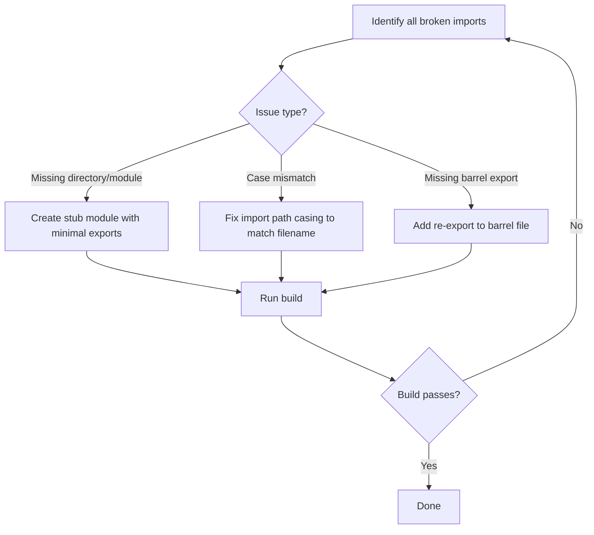

# Design Document: Fix Vercel Build

## Overview

The Vercel production build fails because the Vite bundler cannot resolve modules referenced by imports across the codebase. The root causes fall into several categories: missing component directories (`smoothui`, `8starlabs`, `navigation`, `icons`), case-sensitivity mismatches between import paths and filenames on Linux, a missing `Spinner` component, and incomplete re-exports from the UI barrel file. This design addresses all identified issues systematically to restore a passing production build.

## Architecture

The fix is purely a file-level resolution exercise — no architectural changes are needed. The approach is:

1. Audit every import path in `src/` against actual files on disk
2. For each unresolvable import, choose the minimal fix: create a stub file, fix the casing, or add the missing re-export
3. Verify the build passes with `bunx --bun vite build`

## Components and Interfaces

### Issue Category 1: Missing Component Directories

These directories are imported but do not exist on disk. They were likely removed during the migration cleanup but their imports were not updated.

| Missing Module | Imported By | Symbols Used |
|---|---|---|
| `@/components/smoothui` | `LandingPage.tsx`, `ContactPage.tsx` | `PageTransition`, `ScrollReveal`, `StaggerReveal`, `StaggerItem`, `AnimatedCounter` |
| `@/components/8starlabs` | `ApplicationTimeline.tsx`, `DashboardStatusOverview.tsx` | `Timeline`, `TimelineItem`, `StatusIndicator`, `StatusBadge` |
| `@/components/navigation` | `ContactPage.tsx`, `LandingPage.tsx` | `ResponsiveHeader` |
| `@/components/icons` | `ContactPage.tsx` | `ArrowLeft`, `Mail`, `Phone`, `MapPin` |

**Fix strategy**: Create minimal stub modules that export the expected symbols as simple pass-through or no-op components. For `icons`, re-export from `lucide-react` since those are standard icon names. For `navigation/ResponsiveHeader`, create a minimal header component. For `smoothui` and `8starlabs`, create lightweight wrapper components that render children without animation (since framer-motion is being phased out per project rules).

### Issue Category 2: Case-Sensitivity Mismatches

On Linux (Vercel), `Button.tsx` and `button.tsx` are different files. These imports work on macOS but fail on Linux:

| Import Path (broken on Linux) | Actual Filename | Files Affected |
|---|---|---|
| `@/components/ui/button` | `Button.tsx` | `OfflineFormWrapper.tsx`, `CacheMonitorDashboard.tsx`, `CacheMonitor.tsx` |
| `@/components/ui/alert` | `Alert.tsx` | `OfflineFormWrapper.tsx`, `RealtimeStatus.tsx` |

**Fix strategy**: Update the import paths in the affected files to match the exact casing of the filenames on disk.

### Issue Category 3: Missing Spinner Component

`@/components/ui/Spinner` is imported in `tests/property/stateVerifier.property.test.ts` but no `Spinner.tsx` file exists. Since this is only in test files, the impact on the production build depends on whether tests are included in the build. However, to be safe, a minimal `Spinner.tsx` stub should be created.

**Fix strategy**: Create `src/components/ui/Spinner.tsx` that re-exports `LoadingSpinner` as `Spinner` for backward compatibility.

### Issue Category 4: Missing Barrel File Re-exports

`FieldHelp.tsx` imports `Tooltip, TooltipContent, TooltipProvider, TooltipTrigger` from `@/components/ui`, but the barrel file only exports `Tooltip`. The `tooltip.tsx` file exports all four symbols, but the barrel doesn't re-export the Radix primitives.

**Fix strategy**: Update the barrel file to re-export `TooltipProvider`, `TooltipTrigger`, `TooltipContent` alongside `Tooltip`.

### Issue Category 5: Already-Fixed Files (Verification Only)

These files were recently created and pushed. They need verification that they export the correct symbols:

| File | Expected Exports | Status |
|---|---|---|
| `skeleton.tsx` | `Skeleton`, `SkeletonText` | ✅ Verified |
| `tooltip.tsx` | `Tooltip`, `TooltipProvider`, `TooltipRoot`, `TooltipTrigger`, `TooltipContent` | ✅ Verified |
| `card.tsx` | `Card`, `CardHeader`, `CardTitle`, `CardDescription`, `CardContent`, `CardFooter` | ✅ Verified |

## Data Models

No data model changes. This is a build-fix-only change.

## Correctness Properties

*A property is a characteristic or behavior that should hold true across all valid executions of a system — essentially, a formal statement about what the system should do. Properties serve as the bridge between human-readable specifications and machine-verifiable correctness guarantees.*

Based on the prework analysis, the following properties were identified. Properties 1.1 and 2.1 from the requirements were consolidated since on a case-sensitive filesystem, a casing mismatch is equivalent to a missing file.

**Property 1: Barrel import paths resolve with exact casing**
*For any* import path in the barrel file (`src/components/ui/index.ts`), resolving that path relative to the barrel file's directory should yield an existing file whose name matches the import path's casing exactly.
**Validates: Requirements 1.1, 2.1**

**Property 2: Named exports exist in target modules**
*For any* named import in the barrel file (e.g., `export { Foo } from './bar'`), the target module `./bar` should export a symbol named `Foo`.
**Validates: Requirements 3.1**

**Property 3: Consumer imports are satisfied by barrel exports**
*For any* TypeScript/TSX file in `src/` that imports a symbol from `@/components/ui`, the barrel file should export that symbol.
**Validates: Requirements 5.1**

**Property 4: No duplicate barrel exports**
*For any* two export statements in the barrel file, no exported symbol name should appear more than once.
**Validates: Requirements 5.3**

## Error Handling

- If a stub component is created for a missing module (e.g., `smoothui`, `8starlabs`), it should render children or return `null` gracefully — never throw.
- If a re-exported icon from `lucide-react` doesn't exist, the icons stub should fall back to a generic icon or fragment.
- The build verification step should capture and report all errors, not just the first one, to enable batch fixing.

## Testing Strategy

**Unit tests**: Verify specific examples of the fixes:
- The build command `bunx --bun vite build` completes with exit code 0
- Each newly created stub file exports the expected symbols
- The barrel file exports all symbols that consumer files expect

**Property tests**: Using `fast-check` (already in the project's test stack):
- Property 1: Parse barrel file, extract all import paths, verify each resolves to an existing file with exact casing
- Property 2: Parse barrel file, extract all named imports per module, verify each symbol is exported by the target
- Property 3: Scan all consumer files, extract symbols imported from `@/components/ui`, verify barrel exports them
- Property 4: Parse barrel file, collect all exported symbol names, verify no duplicates

Each property test should run a minimum of 100 iterations. Since these properties operate over static file analysis rather than random generation, they function more as exhaustive checks than randomized tests. The generators would produce subsets of the barrel file's exports to verify.

**Tag format**: `Feature: fix-vercel-build, Property {N}: {title}`
