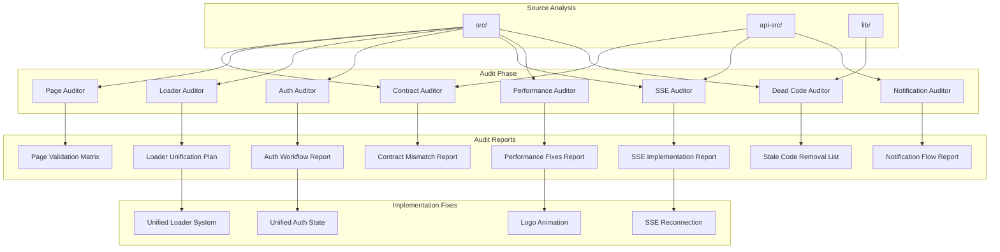

# Design Document: Frontend-Backend Forensic Audit

## Overview

This design describes a systematic forensic audit of the MIHAS Application System to ensure frontend-backend synchronization, eliminate dead code, unify loading states, and optimize for low-end mobile devices in Zambia. The audit produces actionable reports with file paths, line numbers, and evidence-based recommendations.

The system consists of:
1. **Audit Scripts**: TypeScript analysis tools that scan the codebase
2. **Report Generators**: Tools that produce structured audit reports
3. **Unified Components**: Replacement implementations for fragmented systems (loaders, auth)
4. **Cleanup Scripts**: Tools to safely remove identified dead code

## Architecture




## Components and Interfaces

### 1. Contract Auditor

Scans frontend services and hooks for API calls, maps them to backend endpoints.

```typescript
interface APICallInfo {
  filePath: string;
  lineNumber: number;
  endpoint: string;
  method: 'GET' | 'POST' | 'PUT' | 'DELETE' | 'PATCH';
  headers: Record<string, string>;
  authMechanism: 'cookie' | 'bearer' | 'none';
  requestSchema?: object;
  responseSchema?: object;
}

interface EndpointInfo {
  filePath: string;
  endpoint: string;
  method: string;
  actions: string[];  // Query param actions supported
  requiresAuth: boolean;
  roles?: string[];
}

interface ContractMismatch {
  type: 'MISSING_ENDPOINT' | 'UNUSED_ENDPOINT' | 'METHOD_MISMATCH' | 
        'SCHEMA_MISMATCH' | 'AUTH_MISMATCH';
  frontendCall?: APICallInfo;
  backendEndpoint?: EndpointInfo;
  evidence: string;
}

interface ContractAuditor {
  scanFrontend(): Promise<APICallInfo[]>;
  scanBackend(): Promise<EndpointInfo[]>;
  compareContracts(
    frontend: APICallInfo[], 
    backend: EndpointInfo[]
  ): ContractMismatch[];
  generateReport(mismatches: ContractMismatch[]): string;
}
```

### 2. Page Auditor

Examines each page for data loading, error handling, and mobile compatibility.

```typescript
interface PageAuditResult {
  pagePath: string;
  componentName: string;
  dataLoadPath: DataLoadStep[];
  authCheck: AuthCheckResult;
  errorHandling: ErrorHandlingResult;
  emptyStates: boolean;
  loadingStates: boolean;
  raceConditions: RaceConditionRisk[];
  mobileResponsive: boolean;
  networkRecovery: boolean;
  deadCode: DeadCodeItem[];
  duplicateLogic: DuplicateItem[];
  unusedHooks: string[];
  overFetching: OverFetchItem[];
}

interface DataLoadStep {
  hook: string;
  endpoint: string;
  dependencies: string[];
  cacheStrategy: string;
}

interface PageAuditor {
  auditPage(pagePath: string): Promise<PageAuditResult>;
  auditAllPages(): Promise<PageAuditResult[]>;
  generateMatrix(results: PageAuditResult[]): string;
}
```


### 3. Loader Auditor and Unified Loader System

Identifies all loader implementations and provides a unified replacement.

```typescript
interface LoaderInstance {
  filePath: string;
  lineNumber: number;
  componentName: string;
  type: 'spinner' | 'skeleton' | 'progress' | 'overlay' | 'inline';
  isGlobal: boolean;
}

interface LoaderAuditor {
  findAllLoaders(): Promise<LoaderInstance[]>;
  identifyRedundant(loaders: LoaderInstance[]): LoaderInstance[];
  generateUnificationPlan(loaders: LoaderInstance[]): string;
}

// Unified Loader Component
interface UnifiedLoaderProps {
  variant?: 'page' | 'inline' | 'skeleton' | 'overlay';
  size?: 'sm' | 'md' | 'lg';
  label?: string;  // For accessibility
}

// Global loading state managed via Zustand
interface LoadingState {
  isLoading: boolean;
  loadingKeys: Set<string>;
  startLoading: (key: string) => void;
  stopLoading: (key: string) => void;
  isKeyLoading: (key: string) => boolean;
}
```

### 4. Auth Auditor

Maps auth flows and identifies fragmentation or security issues.

```typescript
interface AuthFlowStep {
  action: string;
  component: string;
  filePath: string;
  nextStep?: string;
  roleRequired?: string[];
  redirectOnFail?: string;
}

interface AuthAuditResult {
  studentWorkflow: AuthFlowStep[];
  adminWorkflow: AuthFlowStep[];
  stateManagement: {
    stores: string[];
    contexts: string[];
    isFragmented: boolean;
  };
  securityIssues: SecurityIssue[];
  brokenTransitions: BrokenTransition[];
  staleSessionRisks: string[];
}

interface SecurityIssue {
  type: 'CROSS_ROLE_LEAKAGE' | 'MISSING_AUTH_CHECK' | 'STALE_TOKEN' | 'PERMISSION_BYPASS';
  filePath: string;
  lineNumber: number;
  evidence: string;
  severity: 'critical' | 'high' | 'medium' | 'low';
}

interface AuthAuditor {
  mapStudentWorkflow(): Promise<AuthFlowStep[]>;
  mapAdminWorkflow(): Promise<AuthFlowStep[]>;
  auditStateManagement(): Promise<AuthAuditResult['stateManagement']>;
  findSecurityIssues(): Promise<SecurityIssue[]>;
  generateReport(): Promise<string>;
}
```

### 5. SSE Auditor and Reconnection System

Audits realtime implementation and provides robust reconnection.

```typescript
interface SSEEndpoint {
  path: string;
  filePath: string;
  events: string[];
  requiresAuth: boolean;
}

interface SSEListener {
  filePath: string;
  lineNumber: number;
  endpoint: string;
  events: string[];
  hasReconnect: boolean;
  hasBackoff: boolean;
}

interface SSEAuditResult {
  backendEndpoints: SSEEndpoint[];
  frontendListeners: SSEListener[];
  missingReconnect: SSEListener[];
  missingBackoff: SSEListener[];
  unwiredFeatures: string[];  // Features that should use SSE but don't
}

// Robust SSE Client with reconnection
interface SSEClientConfig {
  endpoint: string;
  maxRetries?: number;
  initialBackoff?: number;  // ms
  maxBackoff?: number;      // ms
  onConnect?: () => void;
  onDisconnect?: () => void;
  onError?: (error: Error) => void;
}

interface SSEClient {
  connect(): void;
  disconnect(): void;
  subscribe(event: string, handler: (data: unknown) => void): () => void;
  isConnected(): boolean;
}
```


### 6. Notification Auditor

Audits notification triggers and email dispatch for idempotency.

```typescript
interface NotificationTrigger {
  event: string;
  filePath: string;
  lineNumber: number;
  deliveryMechanism: 'realtime' | 'email' | 'both';
  hasIdempotencyKey: boolean;
}

interface NotificationAuditResult {
  triggers: NotificationTrigger[];
  duplicateRisks: NotificationTrigger[];
  missingIdempotency: NotificationTrigger[];
  emailDispatchPoints: EmailDispatchPoint[];
}

interface EmailDispatchPoint {
  filePath: string;
  lineNumber: number;
  template: string;
  hasRetry: boolean;
  hasDeduplication: boolean;
}

interface NotificationAuditor {
  findAllTriggers(): Promise<NotificationTrigger[]>;
  findEmailDispatches(): Promise<EmailDispatchPoint[]>;
  identifyDuplicateRisks(): Promise<NotificationTrigger[]>;
  generateReport(): Promise<string>;
}
```

### 7. Performance Auditor

Identifies performance issues for low-end mobile devices.

```typescript
interface PerformanceIssue {
  type: 'HEAVY_ANIMATION' | 'LARGE_BUNDLE' | 'MEMORY_LEAK' | 
        'EXCESSIVE_RERENDER' | 'UNOPTIMIZED_IMAGE' | 'BLOCKING_SCRIPT';
  filePath: string;
  lineNumber?: number;
  evidence: string;
  impact: 'high' | 'medium' | 'low';
  recommendation: string;
}

interface PerformanceAuditResult {
  issues: PerformanceIssue[];
  bundleAnalysis: {
    totalSize: number;
    largestChunks: { name: string; size: number }[];
  };
  animationUsage: AnimationUsage[];
  mobileOptimizations: string[];  // Recommendations
}

interface AnimationUsage {
  filePath: string;
  library: 'framer-motion' | 'css' | 'custom';
  isHeavy: boolean;
  recommendation: string;
}

interface PerformanceAuditor {
  analyzeBundle(): Promise<PerformanceAuditResult['bundleAnalysis']>;
  findAnimations(): Promise<AnimationUsage[]>;
  findPerformanceIssues(): Promise<PerformanceIssue[]>;
  generateReport(): Promise<string>;
}
```

### 8. Dead Code Auditor

Identifies unused code with evidence.

```typescript
interface DeadCodeItem {
  type: 'COMPONENT' | 'HOOK' | 'SERVICE' | 'UTIL' | 'LEGACY_INTEGRATION' | 
        'COMMENTED_CODE' | 'FEATURE_FLAG';
  filePath: string;
  name: string;
  evidence: string;  // Why it's considered dead
  safeToRemove: boolean;
  dependencies?: string[];  // Other files that might break
}

interface DeadCodeAuditResult {
  unusedComponents: DeadCodeItem[];
  unusedHooks: DeadCodeItem[];
  unusedServices: DeadCodeItem[];
  legacyIntegrations: DeadCodeItem[];  // Supabase, Cloudflare references
  commentedCode: DeadCodeItem[];
  deadFeatureFlags: DeadCodeItem[];
  totalLinesRemovable: number;
}

interface DeadCodeAuditor {
  findUnusedExports(): Promise<DeadCodeItem[]>;
  findLegacyIntegrations(): Promise<DeadCodeItem[]>;
  findCommentedCode(): Promise<DeadCodeItem[]>;
  findDeadFeatureFlags(): Promise<DeadCodeItem[]>;
  generateRemovalList(): Promise<string>;
}
```


## Data Models

### Audit Report Structure

```typescript
// Master audit report combining all sub-reports
interface ForensicAuditReport {
  timestamp: string;
  version: string;
  summary: {
    totalIssues: number;
    criticalIssues: number;
    filesAnalyzed: number;
    linesOfCodeAnalyzed: number;
  };
  contractAudit: {
    frontendCalls: number;
    backendEndpoints: number;
    mismatches: ContractMismatch[];
  };
  pageAudit: {
    pagesAnalyzed: number;
    pagesWithIssues: number;
    results: PageAuditResult[];
  };
  loaderAudit: {
    totalLoaders: number;
    redundantLoaders: number;
    loaders: LoaderInstance[];
  };
  authAudit: AuthAuditResult;
  sseAudit: SSEAuditResult;
  notificationAudit: NotificationAuditResult;
  performanceAudit: PerformanceAuditResult;
  deadCodeAudit: DeadCodeAuditResult;
}
```

### Evidence Format

All findings must include evidence in this format:

```typescript
interface Evidence {
  filePath: string;           // Relative to project root
  lineNumbers?: number[];     // Specific lines
  codeSnippet?: string;       // Relevant code (max 10 lines)
  reason: string;             // Why this is flagged
  confidence: 'certain' | 'likely' | 'possible';
}
```

### API Endpoint Mapping

Based on the existing backend structure:

| Endpoint | Actions | Auth Required |
|----------|---------|---------------|
| `/api/auth` | login, logout, refresh, session, register | Varies |
| `/api/admin` | dashboard, users, settings, stats, errors, migrate | Yes (admin+) |
| `/api/applications` | details, documents, grades, summary, review | Yes |
| `/api/catalog` | programs, intakes, subjects | No |
| `/api/documents` | upload, extract | Yes |
| `/api/health` | ping, db, env, arcjet | No |
| `/api/notifications` | preferences, send | Yes |
| `/api/payments` | receipt | Yes |
| `/api/sessions` | track, list, revoke, revoke-all | Yes |

### Frontend Service Mapping

Key services that make API calls:

| Service | File | Endpoints Called |
|---------|------|------------------|
| auth | `src/services/auth.ts` | /api/auth |
| applications | `src/services/applications.ts` | /api/applications |
| catalog | `src/services/catalog.ts` | /api/catalog |
| documents | `src/services/documents.ts` | /api/documents |
| notifications | `src/services/notifications.ts` | /api/notifications |
| sessionService | `src/services/sessionService.ts` | /api/sessions |
| admin/dashboard | `src/services/admin/dashboard.ts` | /api/admin |
| admin/users | `src/services/admin/users.ts` | /api/admin |


## Correctness Properties

*A property is a characteristic or behavior that should hold true across all valid executions of a system—essentially, a formal statement about what the system should do. Properties serve as the bridge between human-readable specifications and machine-verifiable correctness guarantees.*

### Property 1: API Call Extraction Completeness

*For any* valid API call in frontend code (fetch, axios, or custom client), the Contract Auditor SHALL extract all required fields: file path, line number, endpoint URL, HTTP method, headers, and auth mechanism.

**Validates: Requirements 1.1**

### Property 2: Contract Mismatch Detection

*For any* pair of frontend API calls and backend endpoints, the Contract Auditor SHALL correctly identify and flag all mismatches (missing endpoints, unused endpoints, method mismatches) with specific file paths and line numbers.

**Validates: Requirements 1.2, 1.5, 1.6, 1.7**

### Property 3: Schema Comparison Correctness

*For any* pair of request or response schemas from frontend and backend, the schema comparator SHALL correctly identify whether they match, and if not, specify the exact differences.

**Validates: Requirements 1.3, 1.4**

### Property 4: Page Data Load Path Tracing

*For any* page component, the Page Auditor SHALL identify and document all data loading hooks, their endpoints, and their dependencies in the correct order.

**Validates: Requirements 2.1**

### Property 5: Auth Check Verification

*For any* protected page (admin or authenticated routes), the Page Auditor SHALL verify that auth checks are present and correctly implemented.

**Validates: Requirements 2.2**

### Property 6: Error Handling Verification

*For any* API call on a page, the Page Auditor SHALL verify that error handling (try/catch, .catch(), or error boundaries) exists.

**Validates: Requirements 2.3**

### Property 7: State Handling Verification

*For any* page with data fetching, the Page Auditor SHALL verify that both empty states and loading states are properly handled with appropriate UI.

**Validates: Requirements 2.4, 2.5**

### Property 8: Race Condition Detection

*For any* page with concurrent data fetches, the Page Auditor SHALL identify potential race conditions by analyzing hook dependencies and state updates.

**Validates: Requirements 2.6**

### Property 9: Mobile Responsiveness Verification

*For any* page component, the auditor SHALL verify the presence of responsive CSS (Tailwind breakpoint prefixes or media queries) for mobile compatibility.

**Validates: Requirements 2.7, 7.1**

### Property 10: Issue Flagging with Evidence

*For any* identified issue (dead code, duplicate logic, unused hooks, over-fetching), the auditor SHALL provide complete evidence including file path, line numbers, and reason.

**Validates: Requirements 2.9, 2.10, 2.11, 2.12, 9.6**

### Property 11: Loader Identification and Redundancy Detection

*For any* loader/spinner/skeleton component in the codebase, the Loader Auditor SHALL identify it and flag redundant implementations that serve the same purpose.

**Validates: Requirements 3.1, 3.2**

### Property 12: Auth State Consistency

*For any* component using auth state, the Auth Auditor SHALL verify that the state source is consistent (single source of truth) and flag fragmentation if multiple sources exist.

**Validates: Requirements 4.3, 4.10**

### Property 13: Role and Permission Enforcement

*For any* role-protected route or feature, the Auth Auditor SHALL verify that role checks are present and that no cross-role data leakage is possible.

**Validates: Requirements 4.4, 4.6, 4.7**

### Property 14: Redirect Correctness

*For any* auth-related redirect, the Auth Auditor SHALL verify that the redirect target is appropriate for the user's authentication and role state.

**Validates: Requirements 4.5**

### Property 15: Workflow Transition Completeness

*For any* workflow step (student or admin), the Auth Auditor SHALL verify that the next step is reachable and that no stale session assumptions exist.

**Validates: Requirements 4.8, 4.9**

### Property 16: SSE Endpoint Verification

*For any* SSE endpoint in the backend and listener in the frontend, the SSE Auditor SHALL verify they are properly paired and configured.

**Validates: Requirements 5.1, 5.2**

### Property 17: Exponential Backoff Implementation

*For any* SSE reconnection attempt sequence, the backoff delay SHALL increase exponentially (e.g., 1s, 2s, 4s, 8s) up to a maximum threshold.

**Validates: Requirements 5.4**

### Property 18: Notification Trigger Identification

*For any* notification trigger or email dispatch point in the codebase, the Notification Auditor SHALL identify it with its delivery mechanism and configuration.

**Validates: Requirements 6.1, 6.2, 6.4**

### Property 19: Idempotency Enforcement

*For any* email dispatch or notification that requires exactly-once delivery, the system SHALL implement idempotency keys, and the auditor SHALL flag any triggers lacking deduplication.

**Validates: Requirements 6.6, 6.7, 6.8**

### Property 20: Heavy Animation Flagging

*For any* animation using heavy libraries (framer-motion) or complex CSS animations, the Performance Auditor SHALL flag it for removal or optimization.

**Validates: Requirements 7.2**

### Property 21: Bundle Size Threshold

*For any* build output, the total JS bundle size SHALL be below 500KB, and the auditor SHALL flag any chunks exceeding reasonable thresholds.

**Validates: Requirements 7.5**

### Property 22: Reduced Motion Respect

*For any* animation component, when the `prefers-reduced-motion` media query is active, the animation SHALL be disabled or simplified.

**Validates: Requirements 8.3**

### Property 23: Dead Code Identification

*For any* export (component, hook, service, utility) not imported anywhere in the codebase, or any import from legacy packages (Supabase, Cloudflare), or any commented-out code block, the Dead Code Auditor SHALL identify and flag it.

**Validates: Requirements 9.1, 9.2, 9.3, 9.4, 9.5**


## Error Handling

### Audit Script Errors

| Error Type | Handling Strategy |
|------------|-------------------|
| File not found | Log warning, continue with other files |
| Parse error (invalid syntax) | Log error with file path, mark as UNPARSEABLE |
| Permission denied | Log error, skip file |
| Out of memory | Batch processing, limit concurrent file reads |

### Report Generation Errors

| Error Type | Handling Strategy |
|------------|-------------------|
| Write permission denied | Fallback to stdout, notify user |
| Disk full | Truncate report, include summary only |
| Invalid JSON | Validate before write, use safe serialization |

### Evidence Collection Errors

When evidence cannot be collected:
1. Mark confidence as "possible" instead of "certain"
2. Include partial evidence with explanation
3. Never claim certainty without file path and line numbers

### Constraint: No Guessing

If the audit system cannot determine something with certainty:
- Mark as `INSUFFICIENT_EVIDENCE`
- Do NOT make assumptions about intended behavior
- Include what was found and what is missing

## Testing Strategy

### Property-Based Testing with fast-check

All correctness properties will be tested using `fast-check` for property-based testing.

**Configuration:**
- Minimum 100 iterations per property test
- Seed-based reproducibility for debugging
- Shrinking enabled for minimal failing examples

### Test Categories

#### 1. Contract Auditor Tests

```typescript
// Property 1: API Call Extraction Completeness
// Feature: frontend-backend-forensic-audit, Property 1: API call extraction
describe('ContractAuditor', () => {
  it.prop([fc.validAPICallCode()])('extracts all fields from valid API calls', (code) => {
    const result = extractAPICall(code);
    expect(result.filePath).toBeDefined();
    expect(result.lineNumber).toBeGreaterThan(0);
    expect(result.endpoint).toMatch(/^\/api\//);
    expect(['GET', 'POST', 'PUT', 'DELETE', 'PATCH']).toContain(result.method);
  });

  // Property 2: Contract Mismatch Detection
  it.prop([fc.frontendCalls(), fc.backendEndpoints()])('detects all mismatches', (calls, endpoints) => {
    const mismatches = compareContracts(calls, endpoints);
    // Every call without matching endpoint should be flagged
    calls.forEach(call => {
      const hasMatch = endpoints.some(e => e.endpoint === call.endpoint && e.method === call.method);
      if (!hasMatch) {
        expect(mismatches.some(m => m.type === 'MISSING_ENDPOINT' && m.frontendCall === call)).toBe(true);
      }
    });
  });
});
```

#### 2. Page Auditor Tests

```typescript
// Property 4-10: Page audit properties
describe('PageAuditor', () => {
  // Property 10: Issue Flagging with Evidence
  it.prop([fc.deadCodeItem()])('provides complete evidence for issues', (item) => {
    const evidence = generateEvidence(item);
    expect(evidence.filePath).toBeDefined();
    expect(evidence.lineNumbers).toBeDefined();
    expect(evidence.reason).toBeDefined();
    expect(evidence.confidence).toMatch(/certain|likely|possible/);
  });
});
```

#### 3. SSE Tests

```typescript
// Property 17: Exponential Backoff
describe('SSEClient', () => {
  it.prop([fc.integer({ min: 1, max: 10 })])('implements exponential backoff', (retryCount) => {
    const delays = [];
    for (let i = 0; i < retryCount; i++) {
      delays.push(calculateBackoff(i));
    }
    // Each delay should be roughly double the previous (with jitter tolerance)
    for (let i = 1; i < delays.length; i++) {
      expect(delays[i]).toBeGreaterThanOrEqual(delays[i-1] * 1.5);
      expect(delays[i]).toBeLessThanOrEqual(delays[i-1] * 2.5);
    }
  });
});
```

#### 4. Dead Code Auditor Tests

```typescript
// Property 23: Dead Code Identification
describe('DeadCodeAuditor', () => {
  it.prop([fc.codebaseWithUnusedExports()])('identifies all unused exports', (codebase) => {
    const result = findUnusedExports(codebase);
    codebase.exports.forEach(exp => {
      const isUsed = codebase.imports.some(imp => imp.name === exp.name);
      if (!isUsed) {
        expect(result.some(r => r.name === exp.name)).toBe(true);
      }
    });
  });

  it.prop([fc.codeWithLegacyImports()])('flags legacy integrations', (code) => {
    const result = findLegacyIntegrations(code);
    if (code.includes('@supabase') || code.includes('cloudflare')) {
      expect(result.length).toBeGreaterThan(0);
    }
  });
});
```

### Unit Tests (Specific Examples)

Unit tests for edge cases and specific scenarios:

1. **Empty codebase** - Audit should complete without errors
2. **Single file** - All auditors should handle single-file projects
3. **Circular imports** - Dead code auditor should handle cycles
4. **Malformed JSON** - Schema comparator should handle invalid schemas
5. **Missing auth context** - Auth auditor should flag missing providers

### Integration Tests

1. **Full audit run** - Run all auditors on test fixtures
2. **Report generation** - Verify all reports are valid JSON/Markdown
3. **Evidence completeness** - Verify all flagged items have evidence

### Test File Structure

```
tests/
├── property/
│   ├── contractAuditor.property.test.ts
│   ├── pageAuditor.property.test.ts
│   ├── loaderAuditor.property.test.ts
│   ├── authAuditor.property.test.ts
│   ├── sseAuditor.property.test.ts
│   ├── notificationAuditor.property.test.ts
│   ├── performanceAuditor.property.test.ts
│   └── deadCodeAuditor.property.test.ts
├── unit/
│   ├── schemaComparator.test.ts
│   ├── evidenceGenerator.test.ts
│   ├── backoffCalculator.test.ts
│   └── reportGenerator.test.ts
└── integration/
    ├── fullAudit.test.ts
    └── reportValidation.test.ts
```
