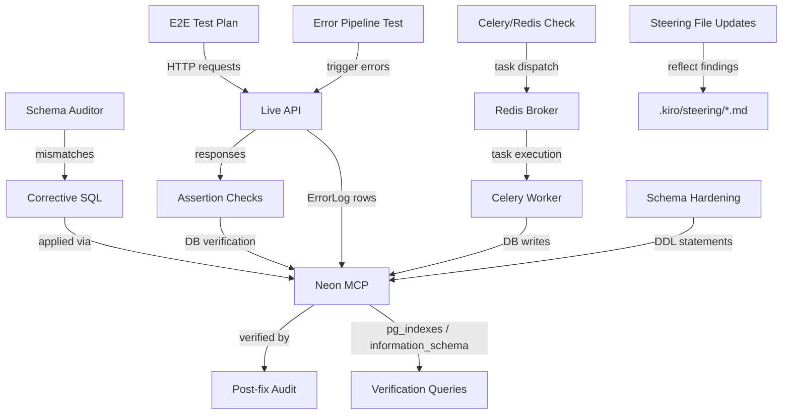
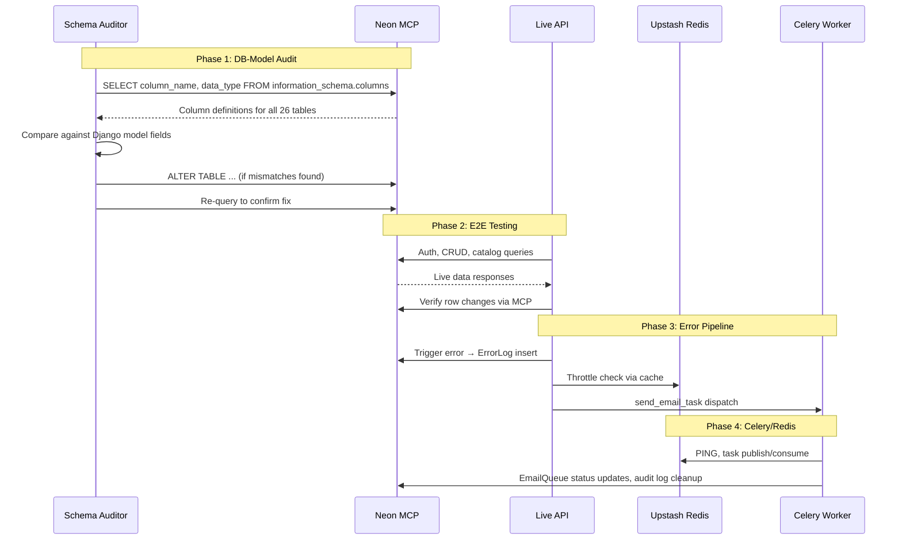

# Design Document: Go-Live Readiness

## Overview

This design covers the systematic verification and hardening of the MIHAS admissions platform before go-live. The platform runs Django 5 + DRF on three Koyeb services (web/worker/beat), React 18 + Vite on Vercel, Neon Postgres (project: wild-bar-37055823), Upstash Redis, Cloudflare R2, and Resend email. All Django models use `managed = False`, meaning the Neon schema is the source of truth and any mismatches cause runtime errors.

The work is ordered by blast radius:

1. **DB-model audit** — highest risk; a single missing column crashes production queries
2. **E2E live testing** — validates the full request path through real infrastructure
3. **Error pipeline verification** — ensures failures are captured and alerted
4. **Steering file updates** — keeps developer context accurate
5. **Celery/Redis verification** — confirms background processing and caching
6. **Schema hardening** — indexes, constraints, and FK enforcement for long-term integrity

### Key Design Decisions

| Decision | Rationale |
|----------|-----------|
| Use Neon MCP for live SQL introspection | Direct `information_schema` queries are the only reliable way to compare against `managed=False` models |
| Audit all 26 tables systematically | Previous fixes (DeviceSession, LoginAttempt, etc.) were reactive; a full sweep prevents surprises |
| Audit directly via Neon MCP, not a Python script | Table-by-table introspection during execution is faster and catches issues immediately; the regression script is built afterward as a CI safety net |
| Generate corrective SQL, not Django migrations | `managed=False` means Django migrations are no-ops; SQL must be applied via Neon MCP |
| Test E2E against live Neon, not a test DB | The goal is production readiness, not unit-test coverage |
| Use `CREATE INDEX CONCURRENTLY` for all indexes | Avoids table locks on a live database |
| Property-test the schema auditor itself | The auditor is the safety net; it must be correct |

## Architecture

The go-live readiness work is organized into six verification domains, each with a clear input, process, and output:



### Execution Flow



## Components and Interfaces

### 1. Schema Auditor (Direct Neon MCP Approach)

The schema audit is performed directly via Neon MCP during task execution — querying `information_schema.columns` table-by-table and comparing against the Django model source code. This is faster and more reliable than building a Python script first, because:

- We already know the pattern from debugging today (query schema, compare, fix)
- The Neon MCP gives us live, authoritative column definitions
- Fixes can be applied immediately via `ALTER TABLE` in the same session
- A Python regression script (`backend/scripts/verify_schema_live.py`) is built afterward as a CI safety net

**Execution approach:**
1. For each of the 26 tables, query `information_schema.columns` via Neon MCP
2. Read the corresponding Django model file
3. Compare field-by-field: name, type, nullability
4. Fix mismatches immediately: either update the Django model or `ALTER TABLE` the DB
5. Re-query to confirm the fix
6. After all tables are clean, build the regression script

**Interface (for the regression script, built after the manual audit):**
```python
def audit_table(table_name: str, model_class: type) -> AuditResult:
    """Compare every field on model_class against information_schema columns.
    
    Returns:
        AuditResult with:
        - missing_in_db: list of model fields not in DB
        - missing_in_model: list of DB columns not in model
        - type_mismatches: list of (field, model_type, db_type) tuples
        - corrective_sql: list of ALTER TABLE statements
    """
```

**Mapping table (Django field → Postgres type):**

| Django Field | Expected Postgres Type(s) |
|-------------|--------------------------|
| `UUIDField` | `uuid` |
| `CharField(max_length=N)` | `character varying(N)` or `character varying` |
| `TextField` | `text` |
| `EmailField` | `character varying(254)` or `character varying` |
| `BooleanField` | `boolean` |
| `IntegerField` | `integer` |
| `DecimalField(max_digits, decimal_places)` | `numeric(max_digits, decimal_places)` or `numeric` |
| `DateField` | `date` |
| `DateTimeField` | `timestamp with time zone` |
| `JSONField` | `jsonb` |
| `URLField` | `character varying(200)`, `character varying(500)`, or `text` — accept any of these as valid since Neon schema may use `text` for URL columns |
| `ForeignKey` | `uuid` (the `_id` column) |

**Note on URLField:** Django's `URLField` defaults to `max_length=200` but several URL columns in the Neon schema use `text` instead. The auditor must accept both `character varying(N)` and `text` as valid Postgres types for `URLField` to avoid false positives.

### 2. E2E Test Runner

A structured test plan executed against the live API at `api.mihas.edu.zm`. Not automated test code — this is a manual verification checklist executed via HTTP client (curl/httpie) with Neon MCP verification.

**Endpoint groups (in priority order):**

| Group | Endpoints | Verification Method |
|-------|-----------|-------------------|
| Health | `/health/live/`, `/health/ready/` | HTTP 200, JSON body contains `db: ok`, `redis: ok` |
| Auth | `/api/v1/auth/login/`, `/api/v1/auth/refresh/`, `/api/v1/auth/logout/` | Cookie set, CSRF token returned, session row in `device_sessions` |
| Catalog (read) | `/api/v1/catalog/programs/`, `/api/v1/catalog/intakes/`, `/api/v1/catalog/subjects/` | Response data matches Neon MCP `SELECT COUNT(*)` |
| Applications | `/api/v1/applications/` | Student sees own apps, admin sees all |
| Admin | `/api/v1/admin/users/` | Admin-only access, user listing matches `profiles` table |
| State changes | POST/PUT on applications, documents | Neon MCP confirms row insert/update |
| Error reporting | POST `/api/v1/errors/report/` | `error_logs` row created with `source='frontend'` |

### 3. Error Pipeline Verifier

Tests the complete chain: exception → `envelope_exception_handler` → `ErrorLog.objects.create()` → throttled alert email → `EmailQueue` row → `send_email_task`.

**Components under test:**
- `backend/apps/common/exceptions.py` — `envelope_exception_handler`, `_log_error_and_alert`
- `backend/apps/common/error_views.py` — `ErrorReportView`
- `backend/apps/common/tasks.py` — `send_email_task`
- `backend/apps/common/models.py` — `ErrorLog`, `EmailQueue`

### 4. Celery/Redis Verifier

Validates the three Celery task paths:
- `send_email_task` — email delivery with retry/backoff
- `check_uptime_task` — periodic health check with state transitions
- `cleanup_audit_logs_task` — batch deletion by retention category

**Redis verification points:**
- TLS connection via `rediss://` URL
- Rate limit counters (hit a rate-limited endpoint, confirm 429)
- CSRF token storage (login, confirm token_hash in `csrf_tokens`)
- Celery broker (dispatch task, confirm it executes)
- Cache operations (`cache.get`, `cache.set`, `cache.add`)

### 5. Schema Hardening Engine

Generates and applies DDL statements via Neon MCP:

**Index creation pattern:**
```sql
CREATE INDEX CONCURRENTLY IF NOT EXISTS idx_{table}_{column}
ON {table} ({column});
```

**NOT NULL constraint pattern:**
```sql
-- Step 1: Backfill NULLs
UPDATE {table} SET {column} = {default} WHERE {column} IS NULL;
-- Step 2: Add constraint
ALTER TABLE {table} ALTER COLUMN {column} SET NOT NULL;
```

**FK constraint pattern:**
```sql
-- Step 1: Find orphans
SELECT COUNT(*) FROM {child_table} c
LEFT JOIN {parent_table} p ON c.{fk_column} = p.id
WHERE p.id IS NULL AND c.{fk_column} IS NOT NULL;
-- Step 2: Clean orphans (if any)
DELETE FROM {child_table} WHERE {fk_column} NOT IN (SELECT id FROM {parent_table}) AND {fk_column} IS NOT NULL;
-- Step 3: Add constraint
ALTER TABLE {child_table}
ADD CONSTRAINT fk_{child_table}_{fk_column}
FOREIGN KEY ({fk_column}) REFERENCES {parent_table}(id);
```

### 6. Steering File Updater

Updates three files:
- `.kiro/steering/tech.md` — error monitoring, Celery Beat tasks, uptime monitoring
- `.kiro/steering/product.md` — error alerting defaults, error pipeline description
- `.kiro/steering/structure.md` — new files added during remediation (error_urls, error_views, health endpoints)

## Data Models

All models already exist with `managed = False`. The audit focuses on verifying field-to-column alignment. Here is the complete model-to-table mapping:

### accounts app (6 tables)

| Model | Table | Fields |
|-------|-------|--------|
| `Profile` | `profiles` | id, email, password_hash, first_name, last_name, phone, nationality, role, is_active, created_at, updated_at |
| `DeviceSession` | `device_sessions` | id, user_id, device_id, device_info, session_token, ip_address, user_agent, last_activity, is_active, expires_at, created_at, updated_at |
| `LoginAttempt` | `login_attempts` | id, email_hash, ip_hash, success, attempted_at |
| `PasswordResetToken` | `password_reset_tokens` | id, user_id, token_hash, expires_at, used_at, created_at |
| `CSRFToken` | `csrf_tokens` | id, user_id, token_hash, expires_at, created_at |
| `UserPermissionOverride` | `user_permission_overrides` | id, user_id, permissions |

### applications app (4 tables)

| Model | Table | Key Fields |
|-------|-------|------------|
| `Application` | `applications` | id, user_id, application_number, status, full_name, email, program, intake, institution, + 30 more fields |
| `ApplicationStatusHistory` | `application_status_history` | id, application_id, status, old_status, new_status, changed_by, notes, changes, ip_address, user_agent, created_at |
| `ApplicationDraft` | `application_drafts` | id, application_id, user_id, draft_data, draft_name, step_completed, is_active, last_accessed_at, created_at, updated_at |
| `ApplicationInterview` | `application_interviews` | id, application_id, scheduled_at, mode, location, status, notes, created_by, updated_by, created_at, updated_at |

### catalog app (6 tables)

| Model | Table | Fields |
|-------|-------|--------|
| `Institution` | `institutions` | id, name, code, full_name, type, accreditation_status, is_active, created_at |
| `Program` | `programs` | id, name, code, institution_id, description, duration_months, application_fee, tuition_fee, requirements, regulatory_body, accreditation_status, is_active, created_at, updated_at |
| `Intake` | `intakes` | id, name, year, application_deadline, max_capacity, is_active, created_at |
| `ProgramIntake` | `program_intakes` | id, program_id, intake_id, max_capacity, current_enrollment |
| `Subject` | `subjects` | id, name, code, category, is_core |
| `CourseRequirement` | `course_requirements` | id, program_id, subject_id, minimum_grade |

### documents app (3 tables)

| Model | Table | Fields |
|-------|-------|--------|
| `ApplicationDocument` | `application_documents` | id, application_id, document_type, document_name, file_url, file_size, mime_type, verification_status, verified_by, verified_at, verification_notes, system_generated, uploaded_at, extracted_text, created_at, updated_at |
| `ApplicationGrade` | `application_grades` | id, application_id, subject_id, grade, created_at |
| `Payment` | `payments` | id, application_id, user_id, amount, currency, payment_method, transaction_reference, status, verified_by, verified_at, receipt_number, receipt_url, metadata, notes, created_at, updated_at |

### common app (7 tables)

| Model | Table | Fields |
|-------|-------|--------|
| `AuditLog` | `audit_logs` | id, actor_id, action, entity_type, entity_id, changes, ip_address, user_agent, retention_category, created_at |
| `IdempotencyKey` | `idempotency_keys` | key, endpoint, response_json, created_at |
| `Setting` | `settings` | id, key, value, category, description, is_public, updated_at |
| `Notification` | `notifications` | id, user_id, title, message, type, is_read, idempotency_key, created_at |
| `UserNotificationPreference` | `user_notification_preferences` | id, user_id, email_enabled, push_enabled, quiet_hours |
| `EmailQueue` | `email_queue` | id, recipient_email, subject, body, status, retry_count, error_message, created_at |
| `ErrorLog` | `error_logs` | id, source, level, message, stack_trace, context, request_path, user_id, ip_hash, created_at |
| `MigrationHistory` | `migration_history` | id, migration_name, applied_at |

### Schema Audit SQL Template

For each table, the auditor runs:
```sql
SELECT column_name, data_type, character_maximum_length, 
       is_nullable, column_default, udt_name
FROM information_schema.columns
WHERE table_schema = 'public' AND table_name = '{table_name}'
ORDER BY ordinal_position;
```

And compares against the Django model's `_meta.get_fields()` output, using the Django-to-Postgres type mapping defined above.


## Correctness Properties

*A property is a characteristic or behavior that should hold true across all valid executions of a system — essentially, a formal statement about what the system should do. Properties serve as the bridge between human-readable specifications and machine-verifiable correctness guarantees.*

### Property 1: Schema auditor detects all field discrepancies

*For any* Django model with a set of field definitions and *any* corresponding Postgres table with a set of column definitions, the schema auditor should:
- Flag every model field that has no matching DB column as "missing in DB"
- Flag every DB column that has no matching model field as "extra in DB"
- Flag every field/column pair where the Django field type does not map to the Postgres column type as a "type mismatch"
- Return no false positives (correctly matched pairs should not appear in any mismatch list)

**Validates: Requirements 2.1, 2.2, 2.3, 2.4, 2.5, 2.7, 2.8**

### Property 2: Schema auditor generates valid corrective SQL

*For any* Django model field definition that is identified as missing from the database, the schema auditor should generate an `ALTER TABLE ADD COLUMN` SQL statement where:
- The table name matches the model's `db_table`
- The column name matches the field's `db_column` or `attname`
- The Postgres type is the correct mapping for the Django field type
- The `NULL`/`NOT NULL` constraint matches the field's `null` attribute

**Validates: Requirements 2.6**

### Property 3: ErrorLog creation includes all required fields

*For any* error event (backend exception or frontend error report) with an associated request context, the created `ErrorLog` record should contain:
- `source` set to either `'backend'` or `'frontend'` matching the error origin
- `level` set to a valid level string
- `message` containing a non-empty substring of the original error message (truncated to 2000 chars)
- `request_path` matching the request's path when available
- `user_id` matching the authenticated user's ID when available
- `ip_hash` as a 64-character SHA-256 hex digest when an IP is available

**Validates: Requirements 1.8, 5.1, 5.4, 5.6**

### Property 4: Error alert throttling suppresses duplicates

*For any* error message string, the first call to the alert dispatch logic should create an `EmailQueue` record and dispatch `send_email_task`. *For any* subsequent call with the same message within 15 minutes, no additional `EmailQueue` record should be created. After the 15-minute TTL expires, the next call should again create an `EmailQueue` record.

**Validates: Requirements 5.2, 5.3**

### Property 5: Frontend error report validation rejects malformed payloads

*For any* POST payload to `/api/v1/errors/report/` that is missing the required `message` field (including payloads with `message` set to `None`, empty string, or absent entirely), the endpoint should return HTTP 400 with `code: "VALIDATION_ERROR"` and no `ErrorLog` record should be created in the database.

**Validates: Requirements 5.5**

### Property 6: Email task status lifecycle

*For any* `EmailQueue` record in `pending` status:
- If `send_email_task` succeeds, the record's status should be `'sent'`
- If `send_email_task` fails at retry attempt N (where N < max_retries), the record's status should be `'retrying'`, `retry_count` should be N+1, and the retry delay should be `60 * 2^N` seconds
- If `send_email_task` fails at the final retry (N = max_retries), the record's status should be `'failed'`

**Validates: Requirements 3.2, 3.3**

### Property 7: Uptime task state transition correctness

*For any* pair of (previous_status, current_status) where each is either `'ok'` or `'down'`:
- If previous=`'ok'` and current=`'down'`: exactly one alert email should be dispatched
- If previous=`'down'` and current=`'ok'`: exactly one recovery email should be dispatched
- If previous=current (no transition): no email should be dispatched

**Validates: Requirements 3.6**

### Property 8: Audit log cleanup respects retention periods

*For any* set of `AuditLog` records with varying `created_at` timestamps and `retention_category` values, after `cleanup_audit_logs_task` runs:
- No remaining record with `retention_category='standard'` should have `created_at` older than 90 days
- No remaining record with `retention_category='security'` should have `created_at` older than 365 days
- All records within their retention period should remain untouched

**Validates: Requirements 3.7**

### Property 9: Health endpoint reflects dependency state

*For any* combination of database connectivity (reachable/unreachable) and Redis connectivity (reachable/unreachable), the `/health/ready/` endpoint should:
- Return HTTP 200 with `{"status": "ok", "db": "ok", "redis": "ok"}` when both are reachable
- Return HTTP 503 with the failing component marked as `"error"` when either is unreachable

**Validates: Requirements 4.5, 4.6**

### Property 10: Rate limiting enforcement

*For any* rate-limited endpoint scope with limit L requests per window W, and *for any* sequence of N requests from the same IP within window W:
- The first L requests should receive normal responses (not 429)
- Requests L+1 through N should receive HTTP 429 with a `Retry-After` header
- The `Retry-After` value should equal the window duration in seconds

**Validates: Requirements 4.2**

## Error Handling

### Schema Audit Errors

| Error | Handling |
|-------|----------|
| Neon MCP connection failure | Abort audit, report connection error, do not generate corrective SQL |
| `information_schema` query returns empty for a known table | Flag as "table missing in DB" — critical error requiring manual investigation |
| Django model import failure | Skip model, log error, continue with remaining models |
| Type mapping not found for a Django field type | Flag as "unknown type mapping", include raw field type in report |

### E2E Test Errors

| Error | Handling |
|-------|----------|
| Auth endpoint returns non-200 | Log full response, check if credentials are valid, check CORS/cookie config |
| Catalog endpoint returns empty data | Cross-check with Neon MCP `SELECT COUNT(*)` — if DB has rows, investigate serializer |
| State-changing request fails | Check CSRF token flow, check request body format, verify model-DB alignment first |

### Error Pipeline Errors

| Error | Handling |
|-------|----------|
| `ErrorLog.objects.create()` fails (DB error) | Log to Python logger as fallback — error logging must never break the response |
| Redis unavailable for throttle check | Fail-open: dispatch alert anyway (already implemented in `_log_error_and_alert`) |
| `send_email_task` permanently fails | Record status as `'failed'` in `EmailQueue`, log error, do not retry further |

### Celery/Redis Errors

| Error | Handling |
|-------|----------|
| Redis TLS handshake failure | Check `REDIS_URL` scheme (`rediss://`), verify Upstash TLS cert |
| Task dispatch fails (broker unreachable) | Celery raises `OperationalError` — caught by Django, logged to ErrorLog |
| `check_uptime_task` cannot read/write Redis state | Log error, treat as new incident (default previous_status to `'ok'`) |

### Schema Hardening Errors

| Error | Handling |
|-------|----------|
| `CREATE INDEX CONCURRENTLY` fails | Retry once; if still fails, drop the partial index and retry |
| NOT NULL constraint fails (NULLs still exist) | Re-run backfill query, verify with `SELECT COUNT(*) WHERE column IS NULL` |
| FK constraint fails (orphans exist) | Re-run orphan cleanup, verify with orphan count query, then retry constraint |

## Testing Strategy

### Dual Testing Approach

This feature requires both unit tests and property-based tests:

- **Unit tests** (`backend/tests/unit/`): Verify specific examples, edge cases, integration points, and live environment behavior
- **Property tests** (`backend/tests/property/`): Verify universal properties across randomized inputs using Hypothesis

### Property-Based Testing Configuration

- **Library**: [Hypothesis](https://hypothesis.readthedocs.io/) (already in use in `backend/tests/property/`)
- **Minimum iterations**: 100 per property test (via `@settings(max_examples=100)`)
- **Tag format**: Each test includes a docstring comment: `Feature: go-live-readiness, Property {N}: {title}`
- **Each correctness property maps to exactly one Hypothesis test function**

### Test Plan by Property

| Property | Test File | What It Tests |
|----------|-----------|---------------|
| P1: Schema auditor field comparison | `backend/tests/property/test_schema_auditor.py` | Generate random model field sets and DB column sets, verify auditor correctly classifies matches/mismatches/extras |
| P2: Schema auditor SQL generation | `backend/tests/property/test_schema_auditor.py` | Generate random missing field definitions, verify generated ALTER TABLE SQL has correct syntax and type mapping |
| P3: ErrorLog required fields | `backend/tests/property/test_error_monitoring.py` | Generate random error messages, request paths, user IDs, IPs — verify ErrorLog contains all fields |
| P4: Alert throttling | `backend/tests/property/test_error_monitoring.py` | Generate random error messages, call dispatch twice within TTL — verify only one EmailQueue record |
| P5: Frontend error validation | `backend/tests/property/test_error_monitoring.py` | Generate random payloads missing `message` field — verify 400 response and no ErrorLog |
| P6: Email task lifecycle | `backend/tests/property/test_email_dispatch.py` | Generate random EmailQueue records, simulate success/failure — verify status transitions |
| P7: Uptime state transitions | `backend/tests/property/test_uptime_task.py` | Generate all (prev, current) state pairs — verify correct email dispatch behavior |
| P8: Audit log cleanup | `backend/tests/property/test_audit_cleanup.py` | Generate random audit logs with various dates/categories — verify retention enforcement |
| P9: Health endpoint states | `backend/tests/property/test_health_endpoint.py` | Mock DB/Redis as reachable/unreachable — verify correct status code and body |
| P10: Rate limiting | `backend/tests/property/test_rate_limiting.py` | Generate random request counts and rate limits — verify 429 enforcement |

### Unit Test Coverage

| Area | Test File | What It Tests |
|------|-----------|---------------|
| Schema audit examples | `backend/tests/unit/test_schema_auditor.py` | Known mismatch cases from previous fixes (DeviceSession, LoginAttempt, etc.) |
| E2E smoke tests | Manual verification via HTTP client + Neon MCP | Auth flow, catalog reads, application CRUD, health endpoints |
| Celery Beat config | `backend/tests/unit/test_celery_config.py` | Verify `CELERY_BEAT_SCHEDULE` contains expected tasks with correct intervals |
| Steering file accuracy | Manual review | Verify steering files reflect current platform state |
| Schema hardening verification | Manual via Neon MCP | Verify indexes exist via `pg_indexes`, constraints via `information_schema` |

### Existing Test Coverage (Already Implemented)

Several property and unit tests already exist that cover parts of this feature:

- `backend/tests/property/test_error_monitoring.py` — error pipeline properties
- `backend/tests/property/test_email_dispatch.py` — email task properties
- `backend/tests/property/test_uptime_task.py` — uptime task properties
- `backend/tests/property/test_audit_cleanup.py` — audit cleanup properties
- `backend/tests/unit/test_error_monitoring.py` — error pipeline unit tests
- `backend/tests/unit/test_health.py` — health endpoint unit tests

New tests needed:
- `backend/tests/property/test_schema_auditor.py` — schema auditor properties (P1, P2)
- `backend/tests/property/test_health_endpoint.py` — health endpoint state matrix (P9)
- `backend/tests/property/test_rate_limiting.py` — rate limiting enforcement (P10)
- `backend/tests/unit/test_schema_auditor.py` — known mismatch regression tests
