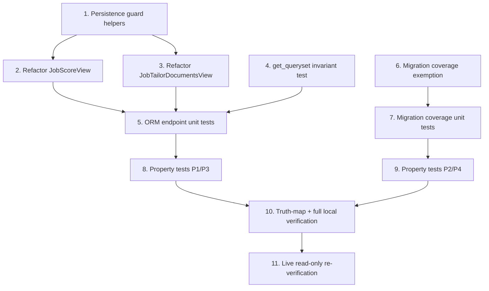

# Implementation Plan

## Overview

Code-only bugfix that removes the two drift defects found in the live Neon
alignment audit. No schema migration, no feature flag, rollback = code revert.
Tasks are test-first where practical and map to the design's correctness
properties (P1–P4) and the bugfix.md EARS clauses. The two defects are
independent (jobs ORM handlers vs. the drift-checker exemption), so their tracks
run in parallel and converge at verification.

## Task Dependency Graph



```json
{
  "waves": [
    { "wave": 1, "tasks": ["1", "4", "6"] },
    { "wave": 2, "tasks": ["2", "3", "7"] },
    { "wave": 3, "tasks": ["5"] },
    { "wave": 4, "tasks": ["8", "9"] },
    { "wave": 5, "tasks": ["10"] },
    { "wave": 6, "tasks": ["11"] }
  ]
}
```

## Tasks

- [ ] 1. Add jobs-ops persistence guard helpers
  - Create `backend/apps/jobs/_persistence.py` with `resolve_job_posting(job_id)` and `persist_match_score_safe(*, job_posting, candidate, defaults)`.
  - `resolve_job_posting` runs `JobPosting.objects.select_related("company", "source").get(id=job_id)` inside a `try/except` catching `django.db.ProgrammingError`, `django.db.OperationalError`, and `JobPosting.DoesNotExist`; returns the instance or `None`. Logs at `debug` only — no PII, no secrets.
  - `persist_match_score_safe` runs `JobMatchScore.objects.update_or_create(...)` inside the same `try/except`; returns `True` on write, `False` when the table is missing; never raises.
  - _Requirements: 2.1, 2.2_

- [ ] 2. Refactor `JobScoreView.post` to degrade gracefully
  - In `backend/apps/jobs/views.py`, replace the `JobPosting.objects...get()` + `DoesNotExist` 404 with `job = resolve_job_posting(job_id)`.
  - Build `job_data` from the ORM instance when `job is not None`, else from `sample_job_detail(str(job_id))` (already imported from `apps.common.jobs_ops_seed`). Map seed keys (`title`, `company`, `location`) into `job_data`; default `description`/`requirements` to `""`.
  - Keep `score_job_match(...)` and the AI-result handling unchanged. On AI success, call `persist_match_score_safe(job_posting=job, candidate=request.user, defaults={...})` **only when `job is not None`**; skip persistence silently otherwise. Still return the `{"success": True, "data": {"job_id": ..., "score": result}}` response.
  - Preserve the existing "AI unavailable → 202 pending" `self.build_response(...)` branch.
  - _Requirements: 2.1, 2.2_

- [ ] 3. Refactor `JobTailorDocumentsView.post` to degrade gracefully
  - Replace the `JobPosting.objects...get()` + 404 with `resolve_job_posting(job_id)` + `sample_job_detail` fallback for `job_data`.
  - Preserve the existing `resume_text` required → 400 branch and the AI-unavailable → 202 pending branch. No persistence write here.
  - _Requirements: 2.3_

- [ ] 4. Add the `get_queryset` no-evaluation invariant regression test
  - In `backend/tests/unit/test_jobs_ops_endpoints.py` (or a new `test_jobs_ops_drift.py`), assert `GET /api/v1/jobs/`, `/api/v1/jobs/{id}/`, `/api/v1/job-applications/`, and `/api/v1/job-applications/{id}/` return HTTP 200 seed envelopes without raising — proving the GET handlers never evaluate the lazy `JobApplication` querysets.
  - Do NOT modify `JobApplicationListCreateView.get_queryset` / `JobApplicationDetailView.get_queryset` signatures or bodies (keeps `test_query_optimization.py` green).
  - _Requirements: 2.4, 3.1_

- [ ] 5. Unit tests for ORM endpoint graceful degradation
  - Add `backend/tests/unit/test_jobs_orm_degradation.py`:
    - `test_resolve_job_posting_fallback`: returns `None` on `ProgrammingError`/`DoesNotExist` (mock the manager).
    - `test_persist_match_score_safe_missing_table`: returns `False`, does not raise, when `update_or_create` raises `ProgrammingError`.
    - `test_jobs_score_endpoint_no_table`: with `resolve_job_posting` → `None` (or forced `ProgrammingError`) and AI mocked, the score endpoint returns 200 (AI result) or 202 (pending) — never 500.
    - `test_jobs_tailor_endpoint_no_table`: returns 200/202/400 — never 500 — with missing table.
    - `test_jobs_score_persists_when_table_present`: with a real `JobPosting` instance and AI success, `persist_match_score_safe` is invoked (forward-compat).
  - _Requirements: 2.1, 2.2, 2.3_

- [ ] 6. Add the migration-history coverage exemption set
  - In `backend/apps/common/management/commands/check_schema_drift.py`, add module-level `_COVERAGE_EXEMPT_SCRIPTS: frozenset[str]` near `_EXCLUDED_MIGRATION_SUBDIRS`, containing exactly `00_full_schema.sql` and `legacy_columns_drop_2026_08_15.sql`, each with an inline classifying comment.
  - In `_find_stale_unrecorded_migrations`, skip exempt filenames (`if path.name in _COVERAGE_EXEMPT_SCRIPTS: continue`) — exact-match only, before the `recorded`/timestamp checks.
  - Update the helper docstring: exempt scripts stay enumerated in the `migration-history=<k>` count but are excluded from the gap list only. Do not apply or record either script.
  - _Requirements: 2.5, 2.6, 2.7, 3.8_

- [ ] 7. Unit tests for migration-history coverage exemption
  - Extend the schema-drift test module under `backend/tests/unit/`:
    - `test_migration_coverage_exempts_known_scripts`: with both exempt files present and absent from `migration_history`, `_find_stale_unrecorded_migrations` returns no rows for them; assert neither is applied/recorded.
    - `test_migration_coverage_still_flags_real_stale`: a synthetic genuinely-stale, non-exempt, unrecorded top-level `*.sql` (old mtime/commit) IS returned as a gap → preserves real-drift detection.
  - _Requirements: 2.5, 2.6, 2.7, 3.7_

- [ ] 8. Property tests for ORM fix-checking and preservation (P1, P3)
  - Add `backend/tests/property/test_jobs_orm_drift_properties.py` (hypothesis):
    - **P1**: for arbitrary `job_id` UUIDs and AI-result shapes (incl. `None`), the score/tailor handlers never raise an unhandled `ProgrammingError` and the HTTP status ∈ `{200, 202, 400, 404}`.
    - **P3**: seed-backed reads, scaffold action endpoints, and the `{"success": true, "data": ...}` envelope shape are unchanged from the pre-fix contract.
  - _Requirements: 2.1, 2.2, 2.3, 2.4, 3.1, 3.2_

- [ ] 9. Property tests for migration exemption and preservation (P2, P4)
  - Add property coverage (same or sibling module):
    - **P2**: for each script in the exempt set, it is never in `stale_unrecorded` findings AND is not applied to the DB.
    - **P4**: for arbitrary non-exempt filenames, a stale unrecorded one is still flagged and a recorded one stays clean (the exemption does not weaken detection).
  - _Requirements: 2.5, 2.6, 2.7, 3.6, 3.7_

- [ ] 10. Register exemption in canonical truth map and run full local verification
  - Add a row to the "Database Schema" section of `docs/canonical-truth-map.md`: migration-history coverage exemptions → `check_schema_drift.py:_COVERAGE_EXEMPT_SCRIPTS` (drift guard = the test from task 7).
  - Run backend suites: `cd backend && python3 -m pytest tests/unit/test_jobs* tests/unit/test_query_optimization.py tests/unit/test_schema_drift* tests/property/test_jobs_orm_drift_properties.py tests/property/test_schema_drift_strict.py`.
  - Re-run the frontend canonical drift guards (`apps/admissions`) to confirm no regression: application status, payment mapping, payment error codes, error codes, roles, sanitizer, submission gates.
  - _Requirements: 3.3, 3.4, 3.5_

- [ ] 11. Live read-only re-verification against Neon
  - Run `check_schema_drift --strict --check-fk-indexes --check-migration-history-coverage` against the live Neon DB (`DATABASE_URL` pointed at project `wild-bar-37055823`).
  - Confirm: no `STALE_UNRECORDED_MIGRATION` / `UNTRACKED_MIGRATION_SCRIPT` lines for the two exempt scripts; FK index check clean; admissions models zero missing-column drift.
  - Confirm the `--strict` "Missing tables (28)" jobs-ops warning remains (expected/acceptable) and that the run no longer fails on the migration-history check.
  - _Requirements: 2.7, 3.4, 3.5, 3.8_

## Notes

- **No schema migration ships.** The fix is Python code plus a checker exemption; this is a deliberate design property (the 28 jobs-ops tables stay intentionally absent as `managed=False` scaffold).
- **Do not apply `legacy_columns_drop_2026_08_15.sql`** — it stays unapplied (Day-90 destructive drop).
- **Preserve guards:** `test_query_optimization.py` (lazy `get_queryset` `select_related`) and the 32 frontend↔backend canonical drift guards must stay green.
- Task 11 is read-only against production data (information_schema / pg_* SELECTs only); it makes no writes.
- Rollback: revert the commit (delete `_persistence.py`, restore the two view handlers, remove `_COVERAGE_EXEMPT_SCRIPTS`, revert the truth-map row).
