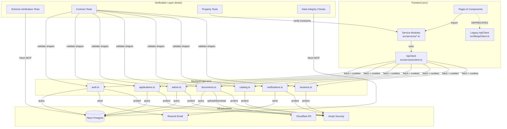
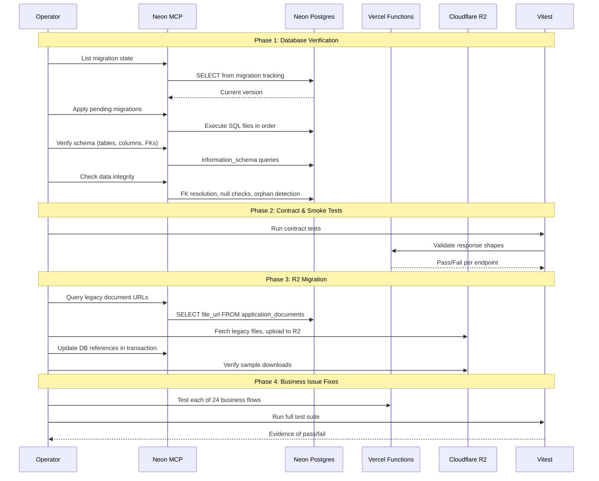
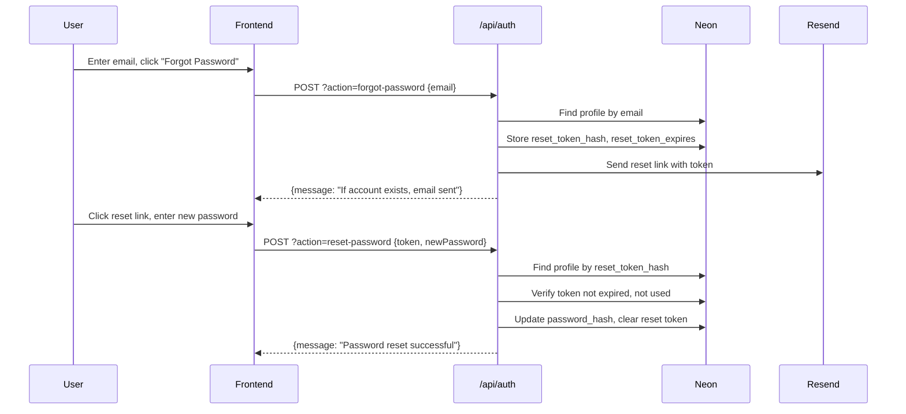

# Design Document: MCP Verification & Recovery

## Overview

This design covers a comprehensive verification-first approach to validating and hardening the MIHAS Application System after its migration from Supabase to Neon Postgres, custom JWT auth, Vercel serverless functions, and Cloudflare R2 storage. Rather than assuming prior fixes are complete, every component is verified against the live runtime and fixed in-place when discrepancies are found.

The work is organized into six tracks:

1. **Database Verification & Migration** — Discover migration state, apply pending migrations, verify schema and data integrity, ensure indexes
2. **Business Issue Verification** — Systematically verify all 24 identified business issues against live endpoints and UI flows
3. **Document & R2 Migration** — Audit document code paths, inventory legacy URLs, run backfill migration, verify downloads
4. **Loophole Closure** — Align frontend/backend contracts, eliminate stubs, fix pagination, deduplicate notifications
5. **End-to-End Smoke Tests** — Automated contract checks and smoke tests for critical user flows
6. **Scalability Planning** — Concrete recommendations for caching, indexing, connection pooling, and observability

### Key Design Decisions

- **Neon MCP for all database operations** — All schema verification, data integrity checks, and migration application use the Neon MCP tool, never Supabase
- **Verification scripts as Vitest tests** — Schema and data integrity checks are implemented as test files so they can be re-run at any time via `bun run test`
- **Idempotent R2 migration** — The document backfill job uses checksums and transaction-wrapped updates so it can be safely re-run
- **No new API endpoints** — Fixes target existing consolidated endpoints (`api-src/*.ts`) by adding missing `case` branches or fixing existing ones
- **Evidence-based completion** — Each fix is validated by a contract test, property test, or manual verification query

## Architecture

The verification and recovery effort touches all layers of the system but does not change the fundamental architecture. The diagram below shows the existing architecture with annotations for where verification and fixes occur.



### Verification Execution Flow



## Components and Interfaces

### 1. Migration State Discovery Module

A script that queries Neon for the current migration state and compares it against local migration files.

```typescript
// scripts/verify-migrations.ts
interface MigrationState {
  appliedMigrations: string[];       // Migration files already applied
  localMigrations: string[];         // Migration files in migrations/ directory
  pendingMigrations: string[];       // Local files not yet applied
  schemaVersion: string | null;      // Current schema version if tracked
}

async function discoverMigrationState(): Promise<MigrationState> {
  // 1. Check if migration_history table exists
  // 2. If yes, query for applied migrations
  // 3. List local .sql files in migrations/
  // 4. Compute difference
}
```

The migration runner at `migrations/apply-migrations.ts` already handles ordered execution with abort-on-failure. The discovery module wraps it with state comparison.

### 2. Schema Verification Test Suite

A Vitest test file that validates all Core_Entity tables exist with expected columns and constraints.

```typescript
// tests/integration/schemaVerification.test.ts
interface TableSchema {
  tableName: string;
  requiredColumns: Array<{
    name: string;
    dataType: string;
    nullable: boolean;
  }>;
  foreignKeys?: Array<{
    column: string;
    referencesTable: string;
    referencesColumn: string;
  }>;
  requiredIndexes?: string[];
}

const CORE_ENTITIES: TableSchema[] = [
  {
    tableName: 'profiles',
    requiredColumns: [
      { name: 'id', dataType: 'uuid', nullable: false },
      { name: 'email', dataType: 'text', nullable: false },
      { name: 'role', dataType: 'text', nullable: false },
      { name: 'password_hash', dataType: 'text', nullable: true },
      { name: 'first_name', dataType: 'text', nullable: true },
      { name: 'last_name', dataType: 'text', nullable: true },
    ],
  },
  {
    tableName: 'applications',
    requiredColumns: [
      { name: 'id', dataType: 'uuid', nullable: false },
      { name: 'user_id', dataType: 'uuid', nullable: false },
      { name: 'status', dataType: 'text', nullable: false },
      { name: 'application_number', dataType: 'text', nullable: true },
    ],
    foreignKeys: [
      { column: 'program_id', referencesTable: 'programs', referencesColumn: 'id' },
      { column: 'intake_id', referencesTable: 'intakes', referencesColumn: 'id' },
    ],
  },
  // ... other core entities
];
```

### 3. Data Integrity Check Module

Queries that detect FK violations, orphaned records, and invalid status values.

```typescript
// scripts/data-integrity-check.ts
interface IntegrityViolation {
  table: string;
  rowId: string;
  violationType: 'broken_fk' | 'null_status' | 'invalid_status' | 'orphaned' | 'missing_email';
  details: string;
}

async function checkDataIntegrity(): Promise<IntegrityViolation[]> {
  const violations: IntegrityViolation[] = [];
  
  // 1. Check applications.program_id references valid programs
  // 2. Check applications.intake_id references valid intakes
  // 3. Check applications.institution_id references valid institutions
  // 4. Detect null/invalid status values
  // 5. Find orphaned application_documents
  // 6. Find profiles with missing email
  
  return violations;
}
```

### 4. Index Verification Module

Checks that performance-critical indexes exist and creates them if missing.

```typescript
// scripts/verify-indexes.ts
interface RequiredIndex {
  table: string;
  columns: string[];
  indexName: string;
}

const REQUIRED_INDEXES: RequiredIndex[] = [
  { table: 'applications', columns: ['status'], indexName: 'idx_applications_status' },
  { table: 'applications', columns: ['created_at'], indexName: 'idx_applications_created_at' },
  { table: 'applications', columns: ['user_id'], indexName: 'idx_applications_user_id' },
  { table: 'profiles', columns: ['email'], indexName: 'idx_profiles_email' },
  { table: 'profiles', columns: ['role'], indexName: 'idx_profiles_role' },
  { table: 'notifications', columns: ['user_id'], indexName: 'idx_notifications_user_id' },
  { table: 'notifications', columns: ['created_at'], indexName: 'idx_notifications_created_at' },
];
```

### 5. R2 Document Migration Job

An idempotent migration script that inventories legacy URLs, fetches originals, uploads to R2, and updates DB references.

```typescript
// scripts/migrate-documents-to-r2.ts
interface MigrationRecord {
  documentId: string;
  oldUrl: string;
  newR2Path: string;
  newR2Url: string;
  checksum: string;
  status: 'pending' | 'migrated' | 'failed' | 'skipped';
  error?: string;
}

interface MigrationResult {
  total: number;
  migrated: number;
  skipped: number;
  failed: number;
  records: MigrationRecord[];
}

async function migrateDocumentsToR2(): Promise<MigrationResult> {
  // 1. Query application_documents for legacy URLs (supabase.co or non-R2 paths)
  // 2. For each legacy document:
  //    a. Fetch original file
  //    b. Compute checksum
  //    c. Upload to R2 with deterministic key
  //    d. Verify uploaded checksum matches
  //    e. Update DB reference in transaction
  //    f. Log outcome
  // 3. Return summary
}
```

The migration stores rollback metadata in a `document_migration_log` table (or JSON file) containing the old URL for each migrated document.

### 6. Password Reset Flow

The auth endpoint at `api-src/auth.ts` needs `forgot-password` and `reset-password` actions. The flow:



The reset token is a random 32-byte hex string, stored as a SHA-256 hash in the `profiles` table. Columns needed: `reset_token_hash TEXT`, `reset_token_expires TIMESTAMPTZ`, `reset_token_used BOOLEAN DEFAULT false`.

### 7. Notification Deduplication

Notifications use an idempotency key composed of `event_type + entity_id + entity_type`. Before creating a notification, the system checks for an existing notification with the same key within a configurable time window (default: 1 hour).

```typescript
// In api-src/notifications.ts
async function createNotificationWithDedup(
  userId: string,
  eventType: string,
  entityId: string,
  entityType: string,
  message: string,
  channel: 'email' | 'in_app'
): Promise<{ created: boolean; notificationId?: string }> {
  const idempotencyKey = `${eventType}:${entityType}:${entityId}`;
  
  // Check for existing notification with same key in last hour
  const existing = await query(
    `SELECT id FROM notifications 
     WHERE user_id = $1 AND idempotency_key = $2 
     AND created_at > NOW() - INTERVAL '1 hour'
     LIMIT 1`,
    [userId, idempotencyKey]
  );
  
  if (existing.rows.length > 0) {
    return { created: false };
  }
  
  // Create notification with idempotency key
  const result = await query(
    `INSERT INTO notifications (id, user_id, type, message, idempotency_key, channel, created_at)
     VALUES (gen_random_uuid(), $1, $2, $3, $4, $5, NOW())
     RETURNING id`,
    [userId, eventType, message, idempotencyKey, channel]
  );
  
  return { created: true, notificationId: result.rows[0].id };
}
```

### 8. Display Name Normalization

The `deriveFullName` function already exists in `api-src/auth.ts`. The design ensures it's used consistently across all session/profile payloads:

```
Precedence: profile.full_name → first_name + last_name → email local-part → "Student"
```

This function must be called:
- On login (session payload)
- On token refresh (updated session)
- On profile fetch (GET /api/auth?action=session)

### 9. Admin Applications Pagination Fix

The pagination contract between frontend and backend:

```typescript
// Backend response shape (from api-src/applications.ts)
interface PaginatedApplicationsResponse {
  applications: ApplicationRecord[];
  totalCount: number;
  page: number;
  pageSize: number;
}

// Frontend must compute:
// hasMore = (page * pageSize) < totalCount
// nextPage = page + 1
```

The fix ensures `totalCount` comes from a `COUNT(*)` query (not array length), and the frontend "load more" logic appends without duplicates by checking `application.id`.

### 10. Endpoint/Contract Alignment Audit

A systematic check that every `action` parameter used in `src/services/*.ts` has a matching `case` in the corresponding `api-src/*.ts` file.

```typescript
// tests/integration/contractAlignment.test.ts
interface EndpointContract {
  service: string;           // Frontend service file
  endpoint: string;          // e.g., '/api/admin'
  action: string;            // e.g., 'users'
  method: string;            // GET, POST, etc.
  backendFile: string;       // e.g., 'api-src/admin.ts'
  hasMatchingCase: boolean;  // Whether backend has this case
}
```

## Data Models

### Core Entity Schemas (Expected in Neon)

```sql
-- profiles (auth + user data)
CREATE TABLE profiles (
  id UUID PRIMARY KEY DEFAULT gen_random_uuid(),
  email TEXT NOT NULL UNIQUE,
  password_hash TEXT,
  refresh_token_hash TEXT,
  role TEXT NOT NULL DEFAULT 'student',
  first_name TEXT,
  last_name TEXT,
  full_name TEXT,
  phone TEXT,
  is_active BOOLEAN DEFAULT true,
  failed_login_attempts INTEGER DEFAULT 0,
  locked_until TIMESTAMPTZ,
  password_changed_at TIMESTAMPTZ,
  reset_token_hash TEXT,
  reset_token_expires TIMESTAMPTZ,
  reset_token_used BOOLEAN DEFAULT false,
  created_at TIMESTAMPTZ DEFAULT NOW(),
  updated_at TIMESTAMPTZ DEFAULT NOW()
);

-- applications
CREATE TABLE applications (
  id UUID PRIMARY KEY DEFAULT gen_random_uuid(),
  user_id UUID NOT NULL REFERENCES profiles(id),
  application_number TEXT UNIQUE,
  status TEXT NOT NULL DEFAULT 'draft',
  program_id UUID REFERENCES programs(id),
  intake_id UUID REFERENCES intakes(id),
  institution_id UUID REFERENCES institutions(id),
  payment_status TEXT DEFAULT 'pending',
  created_at TIMESTAMPTZ DEFAULT NOW(),
  updated_at TIMESTAMPTZ DEFAULT NOW()
);

-- application_documents
CREATE TABLE application_documents (
  id UUID PRIMARY KEY DEFAULT gen_random_uuid(),
  application_id UUID NOT NULL REFERENCES applications(id),
  document_type TEXT NOT NULL,
  document_name TEXT,
  file_url TEXT,
  mime_type TEXT,
  system_generated BOOLEAN DEFAULT false,
  verification_status TEXT DEFAULT 'pending',
  uploaded_at TIMESTAMPTZ DEFAULT NOW(),
  created_at TIMESTAMPTZ DEFAULT NOW(),
  updated_at TIMESTAMPTZ DEFAULT NOW()
);

-- notifications
CREATE TABLE notifications (
  id UUID PRIMARY KEY DEFAULT gen_random_uuid(),
  user_id UUID NOT NULL REFERENCES profiles(id),
  type TEXT NOT NULL,
  message TEXT NOT NULL,
  read BOOLEAN DEFAULT false,
  idempotency_key TEXT,
  channel TEXT DEFAULT 'in_app',
  created_at TIMESTAMPTZ DEFAULT NOW()
);

-- user_notification_preferences
CREATE TABLE user_notification_preferences (
  id UUID PRIMARY KEY DEFAULT gen_random_uuid(),
  user_id UUID NOT NULL REFERENCES profiles(id) UNIQUE,
  email_enabled BOOLEAN DEFAULT true,
  push_enabled BOOLEAN DEFAULT false,
  sms_enabled BOOLEAN DEFAULT false,
  created_at TIMESTAMPTZ DEFAULT NOW(),
  updated_at TIMESTAMPTZ DEFAULT NOW()
);

-- programs
CREATE TABLE programs (
  id UUID PRIMARY KEY DEFAULT gen_random_uuid(),
  name TEXT NOT NULL,
  institution_id UUID REFERENCES institutions(id),
  is_active BOOLEAN DEFAULT true,
  created_at TIMESTAMPTZ DEFAULT NOW(),
  updated_at TIMESTAMPTZ DEFAULT NOW()
);

-- intakes
CREATE TABLE intakes (
  id UUID PRIMARY KEY DEFAULT gen_random_uuid(),
  name TEXT NOT NULL,
  is_active BOOLEAN DEFAULT true,
  application_deadline TIMESTAMPTZ,
  created_at TIMESTAMPTZ DEFAULT NOW(),
  updated_at TIMESTAMPTZ DEFAULT NOW()
);

-- institutions
CREATE TABLE institutions (
  id UUID PRIMARY KEY DEFAULT gen_random_uuid(),
  name TEXT NOT NULL,
  created_at TIMESTAMPTZ DEFAULT NOW(),
  updated_at TIMESTAMPTZ DEFAULT NOW()
);

-- audit_logs
CREATE TABLE audit_logs (
  id UUID PRIMARY KEY DEFAULT gen_random_uuid(),
  actor_id UUID,
  action TEXT NOT NULL,
  entity_type TEXT NOT NULL,
  entity_id TEXT,
  changes JSONB,
  ip_address TEXT,
  user_agent TEXT,
  created_at TIMESTAMPTZ DEFAULT NOW()
);

-- document_migration_log (new - for R2 migration rollback)
CREATE TABLE document_migration_log (
  id UUID PRIMARY KEY DEFAULT gen_random_uuid(),
  document_id UUID NOT NULL,
  old_url TEXT NOT NULL,
  new_r2_path TEXT NOT NULL,
  new_r2_url TEXT NOT NULL,
  checksum TEXT,
  status TEXT NOT NULL DEFAULT 'pending',
  error TEXT,
  migrated_at TIMESTAMPTZ DEFAULT NOW()
);
```

### Required Indexes

```sql
-- Performance-critical indexes
CREATE INDEX IF NOT EXISTS idx_applications_status ON applications(status);
CREATE INDEX IF NOT EXISTS idx_applications_created_at ON applications(created_at);
CREATE INDEX IF NOT EXISTS idx_applications_user_id ON applications(user_id);
CREATE INDEX IF NOT EXISTS idx_profiles_email ON profiles(email);
CREATE INDEX IF NOT EXISTS idx_profiles_role ON profiles(role);
CREATE INDEX IF NOT EXISTS idx_notifications_user_id ON notifications(user_id);
CREATE INDEX IF NOT EXISTS idx_notifications_created_at ON notifications(created_at);
CREATE INDEX IF NOT EXISTS idx_notifications_idempotency ON notifications(idempotency_key);
CREATE INDEX IF NOT EXISTS idx_audit_logs_created_at ON audit_logs(created_at);
CREATE INDEX IF NOT EXISTS idx_audit_logs_entity_type ON audit_logs(entity_type);
CREATE INDEX IF NOT EXISTS idx_application_documents_app_id ON application_documents(application_id);
```


## Correctness Properties

*A property is a characteristic or behavior that should hold true across all valid executions of a system — essentially, a formal statement about what the system should do. Properties serve as the bridge between human-readable specifications and machine-verifiable correctness guarantees.*

The following properties were derived from the acceptance criteria prework analysis. After consolidation to remove redundancy, each property provides unique validation value.

### Property 1: Pending migration set computation and ordering

*For any* set of applied migration names and any set of local migration file names, the computed pending set should equal the set difference (local minus applied), and the pending migrations should be sorted in ascending numerical order.

**Validates: Requirements 1.3, 1.4**

### Property 2: Schema column validation for core entities

*For any* core entity table definition specifying required columns with data types, the schema verification function should report a column as present only if it exists in the database with the correct data type, and should report it as missing otherwise.

**Validates: Requirements 2.2**

### Property 3: Referential integrity across core tables

*For any* row in `applications` with a non-null `program_id`, `intake_id`, or `institution_id`, the referenced row must exist in the corresponding table. *For any* row in `application_documents`, its `application_id` must reference an existing `applications` row. *For any* row in `profiles`, the `email` field must be non-null and non-empty.

**Validates: Requirements 3.1, 3.3, 3.4, 15.4**

### Property 4: Application status values are valid

*For any* row in `applications`, the `status` field should be one of the defined valid status values (draft, submitted, under_review, approved, rejected, withdrawn, waitlisted).

**Validates: Requirements 3.2**

### Property 5: Index creation SQL generation

*For any* required index definition (table, columns, index name), the generated `CREATE INDEX IF NOT EXISTS` statement should contain the correct table name, column names, and index name.

**Validates: Requirements 4.4**

### Property 6: Public tracker returns only safe fields

*For any* valid application number, the tracking endpoint response should contain only the fields: application_number, status, program_name, and submission_date. The response should not contain user_id, email, phone, or any other PII fields.

**Validates: Requirements 5.2, 5.3**

### Property 7: Reset token lifecycle (one-time use and expiry)

*For any* valid reset token, using it once to reset a password should succeed, and using the same token a second time should fail. *For any* reset token whose expiry timestamp is in the past, the reset attempt should be rejected.

**Validates: Requirements 6.4, 6.5**

### Property 8: Display name precedence

*For any* combination of `full_name`, `first_name`, `last_name`, and `email` values (including nulls and empty strings), the `deriveFullName` function should return: `full_name` if non-empty, else `first_name + last_name` if either is non-empty, else the email local-part if email is non-empty, else "Student".

**Validates: Requirements 7.1**

### Property 9: Source file UTF-8 validity

*For any* TypeScript/TSX source file in the application wizard directory, all string literals should consist of valid UTF-8 characters with no mojibake patterns (sequences of Â, Ã, â, etc. that indicate encoding corruption).

**Validates: Requirements 8.1, 8.2**

### Property 10: R2 migration correctness with rollback metadata

*For any* legacy document URL, the migration job should produce a valid R2 path, and the uploaded file's checksum should match the original. *For any* migrated document, a rollback record should exist containing the original URL.

**Validates: Requirements 9.3, 9.6**

### Property 11: R2 migration idempotence

*For any* document that has already been migrated to R2, running the migration job again should not create a duplicate file, should not change the DB reference, and should report the document as "skipped".

**Validates: Requirements 9.4**

### Property 12: Draft reconciliation picks the most recent version

*For any* pair of local draft and server draft with different `updated_at` timestamps, the reconciliation function should return the draft with the more recent timestamp.

**Validates: Requirements 10.2**

### Property 13: Notification deduplication via idempotency key

*For any* notification event with a given `event_type`, `entity_id`, and `entity_type`, the idempotency key should be deterministic. Creating two notifications with the same idempotency key within the deduplication window should result in only one notification being stored.

**Validates: Requirements 13.1, 13.2**

### Property 14: Notification policy enforcement

*For any* operational event type (application_status_change, payment_verified, interview_scheduled), email notification should always be created regardless of user preferences. *For any* non-mandatory channel preference set to opt-out, the system should respect the opt-out.

**Validates: Requirements 13.3, 13.4**

### Property 15: Role promotion restriction

*For any* role update request where the target role is `admin` or `super_admin`, the request should succeed only if the requesting user has `super_admin` role. Requests from `admin`, `reviewer`, or `student` roles should be rejected with 403.

**Validates: Requirements 14.4**

### Property 16: Programs include institution name in response

*For any* program with a non-null `institution_id`, the catalog endpoint response should include the institution `name` field. No program should show "institution unknown" when the institution exists.

**Validates: Requirements 15.1**

### Property 17: Intake deadline validity

*For any* intake record, the `application_deadline` field should be a valid ISO 8601 date string that can be parsed without error.

**Validates: Requirements 15.2**

### Property 18: Pagination correctness

*For any* total count of applications N and page size P, the first page should return min(P, N) applications with `totalCount` equal to N. `hasMore` should be true if and only if `page * pageSize < totalCount`. Consecutive pages should have no overlapping application IDs.

**Validates: Requirements 16.1, 16.2, 16.3, 16.4**

### Property 19: No re-render on identical poll data

*For any* polling hook receiving identical data on consecutive polls, the `onDataChange` callback should not be triggered, and the component should not re-render.

**Validates: Requirements 17.3**

### Property 20: Frontend-backend action parameter alignment

*For any* action parameter string used in a frontend service module's API call, there should exist a corresponding `case` in the backend action router switch statement for that endpoint.

**Validates: Requirements 18.1**

### Property 21: Auth object shape consistency

*For any* login or session fetch, the returned user object should contain exactly the fields: `id`, `email`, `role`, `firstName`, `lastName`, `full_name`. *For any* two different code paths that return user/profile data, the object shape should be identical.

**Validates: Requirements 20.1, 20.2**

### Property 22: Audit trail completeness for state changes

*For any* application status change, user CRUD operation, or payment verification/rejection, an audit log entry should be created with non-null `action`, `entity_type`, and `created_at` fields.

**Validates: Requirements 21.1, 21.2, 21.3**

### Property 23: No PII in audit log entries

*For any* audit log entry, the `changes` JSONB field should not contain email addresses, phone numbers, names, or password hashes. The sanitization should match the patterns in `lib/errorHandler.ts`.

**Validates: Requirements 21.4**

## Error Handling

### Database Operations

| Scenario | Handling |
|----------|----------|
| Migration SQL fails | Abort migration sequence, log SQL error with statement context, report failure |
| Schema verification finds missing table | Report as error, do not attempt auto-creation (manual migration required) |
| Data integrity violation found | Log violation details, continue checking remaining rows, produce summary report |
| Index creation fails | Log error, continue with remaining indexes, report partial success |
| Connection timeout | Retry once with exponential backoff, then fail with `TIMEOUT_ERROR` |

### R2 Migration Operations

| Scenario | Handling |
|----------|----------|
| Legacy file fetch fails (404) | Mark as `failed` in migration log, continue with next document |
| Legacy file fetch fails (network) | Retry up to 3 times with backoff, then mark as `failed` |
| R2 upload fails | Mark as `failed`, do not update DB reference, log error |
| Checksum mismatch after upload | Delete uploaded R2 file, mark as `failed`, log mismatch details |
| DB update fails after R2 upload | R2 file remains (orphaned but harmless), mark as `failed`, log for manual cleanup |
| Document already migrated (idempotent check) | Skip, mark as `skipped`, no error |

### API Endpoint Fixes

| Scenario | Handling |
|----------|----------|
| Missing action case in router | Return 400 with `Invalid action` message (existing behavior) |
| Auth token expired during verification | Auto-refresh via `/api/auth?action=refresh`, retry original request |
| Rate limit exceeded on tracker | Return 429 with `Too many requests` message via Arcjet |
| Password reset with invalid token | Return 400 with generic message (never reveal token validity details) |
| Notification dedup collision | Skip creation, return success with `created: false` |

### Frontend Error Handling

| Scenario | Handling |
|----------|----------|
| API returns 401 | Trigger token refresh, retry; if refresh fails, redirect to login |
| API returns 403 | Display "Access Denied", do not retry |
| API returns 500 | Display user-friendly error with retry button |
| Polling receives error | Log warning, continue polling at next interval, do not crash |
| SSE connection drops | Auto-reconnect via EventSource, fall back to polling after 3 failures |

## Testing Strategy

### Dual Testing Approach

This spec uses both unit tests and property-based tests:

- **Unit tests**: Verify specific examples, edge cases, integration points, and error conditions
- **Property tests**: Verify universal properties across randomly generated inputs using fast-check

### Test Organization

| Test Type | Directory | Framework |
|-----------|-----------|-----------|
| Schema verification | `tests/integration/` | Vitest (requires DB connection) |
| Data integrity | `tests/integration/` | Vitest (requires DB connection) |
| Contract tests | `tests/unit/contracts/` | Vitest + Zod |
| Property tests | `tests/property/` | Vitest + fast-check |
| Unit tests | `tests/unit/` | Vitest |

### Property-Based Testing Configuration

- Library: **fast-check** (already installed)
- Minimum iterations: **100** per property test
- Each property test must reference its design document property with a tag comment:
  ```
  // Feature: mcp-verification-recovery, Property N: [property title]
  ```

### Test Coverage Map

| Property | Test File | Type |
|----------|-----------|------|
| Property 1: Migration set computation | `tests/property/migrationSetComputation.property.test.ts` | Property |
| Property 3: Referential integrity | `tests/integration/dataIntegrity.test.ts` | Integration (DB) |
| Property 4: Valid status values | `tests/integration/dataIntegrity.test.ts` | Integration (DB) |
| Property 5: Index SQL generation | `tests/property/indexSqlGeneration.property.test.ts` | Property |
| Property 6: Public tracker safe fields | `tests/property/trackerSafeFields.property.test.ts` | Property |
| Property 7: Reset token lifecycle | `tests/property/resetTokenLifecycle.property.test.ts` | Property |
| Property 8: Display name precedence | `tests/property/displayNamePrecedence.property.test.ts` | Property |
| Property 9: UTF-8 validity | `tests/unit/wizardTextIntegrity.test.ts` | Unit (file scan) |
| Property 10: R2 migration correctness | `tests/property/r2MigrationCorrectness.property.test.ts` | Property |
| Property 11: R2 migration idempotence | `tests/property/r2MigrationIdempotence.property.test.ts` | Property |
| Property 12: Draft reconciliation | `tests/property/draftReconciliation.property.test.ts` | Property |
| Property 13: Notification deduplication | `tests/property/notificationDedup.property.test.ts` | Property |
| Property 14: Notification policy | `tests/property/notificationPolicy.property.test.ts` | Property |
| Property 15: Role promotion restriction | `tests/property/rolePromotion.property.test.ts` | Property |
| Property 16: Programs include institution | `tests/unit/contracts/catalogContracts.test.ts` | Unit + Zod |
| Property 17: Intake deadline validity | `tests/unit/contracts/catalogContracts.test.ts` | Unit + Zod |
| Property 18: Pagination correctness | `tests/property/paginationCorrectness.property.test.ts` | Property |
| Property 19: No re-render on identical data | `tests/property/pollingStability.property.test.ts` | Property |
| Property 20: Action parameter alignment | `tests/unit/contracts/actionAlignment.test.ts` | Unit (static) |
| Property 21: Auth object shape | `tests/property/authObjectShape.property.test.ts` | Property |
| Property 22: Audit trail completeness | `tests/property/auditCompleteness.property.test.ts` | Property |
| Property 23: No PII in audit logs | `tests/property/auditPiiSanitization.property.test.ts` | Property |

### Testing Notes

- Integration tests (schema verification, data integrity) require a live Neon connection and should be run separately from unit/property tests
- Property tests use fast-check generators to create random inputs (user profiles, application records, notification events, etc.)
- Contract tests validate response shapes using Zod schemas without requiring a live backend
- The action alignment test statically parses frontend service files and backend router files to detect mismatches
- All tests are runnable via `bun run test` using Vitest
