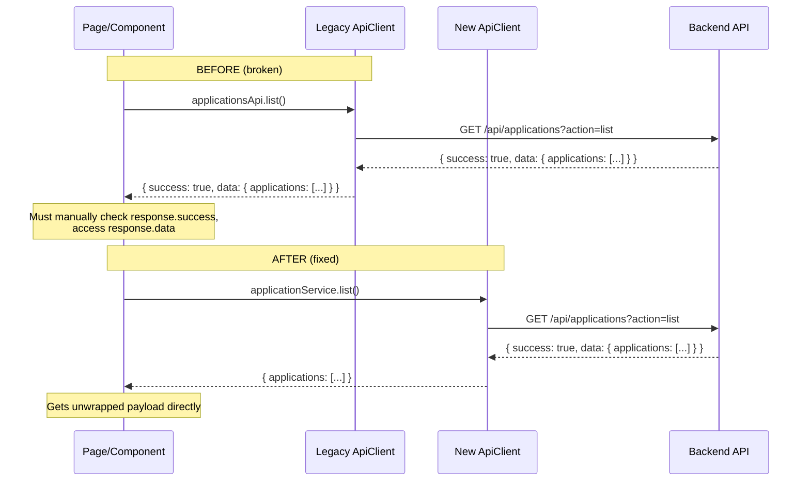

# Design Document: Migration Recovery & Hardening

## Overview

This design addresses the remaining migration debt and engineering hardening needed to bring the MIHAS Application System to production-grade reliability. The system has been migrated from Supabase to Neon Postgres with custom JWT auth on Vercel, but several frontend components still use the legacy API client, cache logic references Supabase, and no contract tests exist to prevent response-shape regressions.

The work is organized into four tracks:
1. **API Client Consolidation** — Migrate all components from the legacy client to the new unwrapping client
2. **Migration Debt Cleanup** — Remove Supabase remnants, fix reload strategy, tune caching
3. **Contract Testing** — Add Zod-based contract tests for all key endpoints
4. **Security Hardening** — Session lifecycle tests and admin authorization matrix

### Key Design Decisions

- **Deprecate, don't delete** the legacy client — wrap its exports around the new client to avoid breaking any undiscovered consumers
- **Zod schemas as single source of truth** — shared between contract tests and (optionally) runtime validation
- **No new API endpoints** — all fixes are frontend-side; the backend is already correct
- **Vitest + fast-check** — consistent with existing test infrastructure

## Architecture

The changes are entirely within the frontend layer and test infrastructure. No backend modifications are needed.

```mermaid
graph TD
    subgraph "Frontend (src/)"
        A[Pages & Components] -->|import| B[Service Modules<br/>src/services/*.ts]
        B -->|uses| C[New ApiClient<br/>src/services/client.ts]
        A -.->|DEPRECATED| D[Legacy ApiClient<br/>src/lib/apiClient.ts]
        D -.->|re-exports via| C
    end

    subgraph "Backend (api-src/)"
        E[Vercel Functions]
        E -->|sendSuccess envelope| F[{ success: true, data: T }]
    end

    C -->|fetch + unwrap| F
    
    subgraph "Tests (tests/)"
        G[Contract Tests] -->|validate shape| F
        H[Property Tests] -->|verify invariants| B
        I[Unit Tests] -->|verify logic| A
    end
```

### Migration Flow for Each Component



## Components and Interfaces

### 1. Legacy Client Deprecation Layer (`src/lib/apiClient.ts`)

The legacy client will be refactored to become a thin wrapper around the new client. All existing exports (`applicationsApi`, `authApi`, `catalogApi`, `adminApi`, `notificationsApi`, `documentsApi`) will be preserved but reimplemented to delegate to the new client while maintaining the `{ success, data, error }` envelope shape for backward compatibility during the transition.

```typescript
// src/lib/apiClient.ts — after migration
// @deprecated Use src/services/client.ts or service modules directly

import { apiClient } from '@/services/client'
import { applicationService } from '@/services/applications'

/** @deprecated Use applicationService from src/services/applications.ts */
export const applicationsApi = {
  async list(filters?: { mine?: boolean; status?: string }): Promise<ApiResponse<any>> {
    try {
      const result = await applicationService.list({
        mine: filters?.mine,
        status: filters?.status,
      })
      return { success: true, data: result }
    } catch (error) {
      return { success: false, error: (error as Error).message }
    }
  },
  // ... other methods similarly wrapped
}
```

### 2. Component Migration Map

Each component migration follows the same pattern: replace legacy client import with the appropriate service module, remove manual envelope unwrapping.

| File | Current Import | Target Import | Key Change |
|------|---------------|---------------|------------|
| `Payment.tsx` | `applicationsApi` from `@/lib/apiClient` | `applicationService` from `@/services/applications` | Remove `response.success`/`response.data` checks |
| `Interview.tsx` | `applicationsApi` from `@/lib/apiClient` | `interviewsService` from `@/services/interviews` | Use dedicated interview service |
| `Dashboard.tsx` | `applicationsApi` from `@/lib/apiClient` | `applicationService` from `@/services/applications` | Remove envelope unwrapping |
| `SignUpPage.tsx` | `authApi` from `@/lib/apiClient` | `apiClient` from `@/services/client` | Direct auth calls |
| `NotificationPreferences.tsx` | `notificationsApi` from `@/lib/apiClient` | `apiClient` from `@/services/client` | Remove envelope checks |
| `EligibilityDashboard.tsx` | `adminApi`, `catalogApi` from `@/lib/apiClient` | Service modules | Remove envelope checks |
| `ApplicationVersions.tsx` | `applicationsApi` from `@/lib/apiClient` | `applicationService` from `@/services/applications` | Remove envelope checks |
| `UserImport.tsx` | `authApi` from `@/lib/apiClient` | `apiClient` from `@/services/client` | Remove envelope checks |
| `TestNotifications.tsx` | `adminApi`, `applicationsApi` from `@/lib/apiClient` | Service modules | Remove envelope checks |
| `ReportsGenerator.tsx` | `applicationsApi`, `adminApi` from `@/lib/apiClient` | Service modules | Remove envelope checks |
| `AnalyticsDashboard.tsx` | `applicationsApi` from `@/lib/apiClient` | `applicationService` from `@/services/applications` | Remove envelope checks |

### 3. PWA Config Cleanup (`src/lib/pwaConfig.ts`)

Remove the `supabase.co` hostname check from `getCacheStrategy`:

```typescript
// BEFORE
if (urlObj.pathname.startsWith('/api/') || urlObj.hostname.includes('supabase.co')) {
  return 'api'
}

// AFTER
if (urlObj.pathname.startsWith('/api/')) {
  return 'api'
}
```

### 4. Reload Control Hardening

The existing `reloadControl.ts` already implements a per-build, per-reason, per-fingerprint guard using `sessionStorage`. The design is sound. The hardening focuses on:

- Verifying the guard logic works correctly via property tests
- Ensuring error boundary "Retry" buttons use `performReload` with `mode: 'user'` (bypassing auto-guard)
- Documenting the reload sites for future maintainers

### 5. React Query Cache Tuning

Define centralized cache configuration constants:

```typescript
// src/lib/queryCacheConfig.ts
export const QUERY_CACHE_CONFIG = {
  /** Dashboard stats, application lists — moderate freshness */
  critical: {
    staleTime: 30_000,        // 30 seconds
    gcTime: 5 * 60_000,       // 5 minutes
    refetchOnWindowFocus: true,
    retry: 2,
  },
  /** Catalog data (programs, intakes, subjects) — rarely changes */
  static: {
    staleTime: 5 * 60_000,    // 5 minutes
    gcTime: 30 * 60_000,      // 30 minutes
    refetchOnWindowFocus: false,
    retry: 1,
  },
  /** Polling queries — controlled interval */
  polling: {
    staleTime: 30_000,        // 30 seconds
    refetchInterval: 60_000,  // 1 minute minimum
    refetchOnWindowFocus: false,
  },
} as const
```

### 6. Contract Test Infrastructure

Contract tests use Zod schemas to validate API response shapes. They run against mock data shaped like real API responses, not against a live server.

```typescript
// tests/contracts/schemas/applications.schema.ts
import { z } from 'zod'

export const ApplicationListResponseSchema = z.object({
  applications: z.array(z.object({
    id: z.string(),
    application_number: z.string(),
    status: z.string(),
    program: z.string().nullable(),
    payment_status: z.string().nullable(),
    created_at: z.string(),
  })),
  totalCount: z.number(),
  page: z.number(),
  pageSize: z.number(),
})

export const AdminAuditLogResponseSchema = z.object({
  entries: z.array(z.object({
    id: z.string(),
    action: z.string(),
    entity_type: z.string(),
    entity_id: z.string(),
    created_at: z.string(),
  })),
  page: z.number(),
  pageSize: z.number(),
  totalPages: z.number(),
  totalCount: z.number(),
})
```

### 7. Session Lifecycle & Auth Matrix Tests

Tests verify the JWT auth flow end-to-end using mocked HTTP handlers:

- Cookie issuance on login
- Token refresh rotation
- Role enforcement on admin endpoints
- Expiration handling

## Data Models

### API Response Shapes (Zod Schemas)

These schemas serve as the contract between backend and frontend:

```typescript
// Shared response schemas

// Applications list (paginated)
interface ApplicationsListResponse {
  applications: Array<{
    id: string
    application_number: string
    status: string
    program: string | null
    payment_status: string | null
    created_at: string
    updated_at: string
  }>
  totalCount: number
  page: number
  pageSize: number
}

// Admin dashboard stats
interface AdminStatsResponse {
  totalApplications: number
  pendingApplications: number
  approvedApplications: number
  rejectedApplications: number
  statusBreakdown: Record<string, number>
  programBreakdown: Record<string, number>
  generatedAt: string
}

// Admin audit log (paginated)
interface AuditLogResponse {
  entries: Array<{
    id: string
    action: string
    entity_type: string
    entity_id: string
    created_at: string
    actor_id: string | null
    ip_address: string | null
  }>
  page: number
  pageSize: number
  totalPages: number
  totalCount: number
}

// Admin appeals (paginated)
interface AppealsResponse {
  appeals: Array<{
    id: string
    application_id: string
    status: string
    appeal_type: string
    created_at: string
  }>
  totalCount: number
  page: number
  pageSize: number
}

// Catalog responses
interface CatalogProgramsResponse {
  programs: Array<{
    id: string
    name: string
    is_active: boolean
  }>
}

interface CatalogIntakesResponse {
  intakes: Array<{
    id: string
    name: string
    is_active: boolean
    application_deadline: string
  }>
}

// Auth session
interface AuthSessionResponse {
  user: {
    id: string
    email: string
    role: string
    firstName: string
    lastName: string
  } | null
}

// Notification preferences
interface NotificationPreferencesResponse {
  user_id: string
  email_enabled: boolean
  push_enabled: boolean
}
```

### React Query Cache Keys

Standardized cache key structure:

| Query | Key | Config Profile |
|-------|-----|---------------|
| Student applications | `['applications', userId]` | `critical` |
| Admin applications | `['applications']` | `critical` |
| Admin stats | `['admin-dashboard-polling']` | `polling` |
| Admin dashboard | `['admin-dashboard']` | `critical` |
| Programs catalog | `['programs']` | `static` |
| Intakes catalog | `['intakes']` | `static` |
| Subjects catalog | `['subjects']` | `static` |
| Notifications | `['notifications', userId]` | `critical` |
| Audit logs | `['admin-audit-logs', filters]` | `critical` |


## Correctness Properties

*A property is a characteristic or behavior that should hold true across all valid executions of a system — essentially, a formal statement about what the system should do. Properties serve as the bridge between human-readable specifications and machine-verifiable correctness guarantees.*

The following properties were derived from the acceptance criteria prework analysis. Each property is universally quantified and references the requirement it validates.

### Property 1: Paginated response extraction preserves all applications

*For any* paginated API response containing an `applications` array of length N, the Payment page extraction logic should produce exactly N application objects, each preserving the original `id`, `status`, `payment_status`, and `program` fields.

**Validates: Requirements 1.2**

### Property 2: Payment status filtering is a correct partition

*For any* list of applications, filtering by "pending" (payment_status is null or `pending_review`) and filtering by "completed" (payment_status is `verified` or `rejected`) should produce two disjoint sets whose union equals the original list.

**Validates: Requirements 1.5**

### Property 3: getCacheStrategy URL classification is correct and Supabase-free

*For any* URL, `getCacheStrategy` should return `'api'` if and only if the URL pathname starts with `/api/`, return `'images'` if the pathname matches an image extension, return `'fonts'` if the pathname matches a font extension, and return `'static'` otherwise — with no branching on `supabase.co` or any external hostname.

**Validates: Requirements 3.1, 3.2**

### Property 4: Reload guard allows at most one auto-reload per error fingerprint

*For any* build key, reload reason, and error fingerprint, calling `consumeAutoReloadGuard` the first time should return `true`, and all subsequent calls with the same parameters within the same session should return `false`.

**Validates: Requirements 4.1, 4.2**

### Property 5: Interview service routes all requests through /applications

*For any* interview operation (schedule or list), the constructed request URL should have a pathname starting with `/applications` and include the appropriate `action` query parameter (`schedule-interview` or `interviews`).

**Validates: Requirements 5.1, 5.2, 5.3**

### Property 6: Admin endpoint responses conform to their Zod schemas

*For any* valid response from `/admin?action=audit-log`, parsing it with `AuditLogResponseSchema` should succeed. *For any* valid response from `/admin?action=appeals`, parsing it with `AppealsResponseSchema` should succeed. Both schemas require pagination fields (`page`, `pageSize`, `totalCount`/`totalPages`).

**Validates: Requirements 6.1, 6.2**

### Property 7: Contract schema validation accepts valid responses and rejects invalid ones

*For any* Zod response schema and any JSON object, if the object contains all required fields with correct types, `schema.safeParse` should succeed. If any required field is missing or has the wrong type, `schema.safeParse` should fail.

**Validates: Requirements 7.2, 7.3**

### Property 8: Metrics calculations are consistent with input data

*For any* set of application records, the `applicationMetrics.totalApplications` should equal the input array length, `approvalRate` should equal `(approvedApplications / completedApplications) * 100` (or 0 if no completed applications), and `completionRate` should equal `(completedApplications / totalApplications) * 100` (or 0 if no applications).

**Validates: Requirements 8.2**

### Property 9: Dashboard preloader returns valid defaults on transient errors

*For any* transient network error during dashboard preloading, the returned object should contain all expected fields with zero/empty default values and should not throw an exception.

**Validates: Requirements 8.3**

### Property 10: No polling query has refetchInterval below 30 seconds

*For any* React Query configuration object used in the application, if `refetchInterval` is defined, its value should be greater than or equal to 30000 milliseconds.

**Validates: Requirements 9.4**

### Property 11: Login issues both access and refresh tokens as HTTP-only cookies

*For any* valid login request (correct email and password), the response should set at least two HTTP-only cookies: one for the access token and one for the refresh token.

**Validates: Requirements 10.1**

### Property 12: Refresh token rotation produces a new token on every use

*For any* valid refresh request, the newly issued refresh token should differ from the one that was submitted, ensuring replay attack prevention.

**Validates: Requirements 10.3**

### Property 13: Admin actions enforce role-based access control

*For any* admin API action and *for any* request from a user with `student` or `reviewer` role, the API should return HTTP 403 with an appropriate error code.

**Validates: Requirements 11.1, 11.2, 11.3**

### Property 14: All PWA precache and fallback paths reference existing assets

*For any* path listed in `PWA_CONFIG.precache` or `PWA_CONFIG.fallbacks`, the corresponding file should exist in the `public/` directory (after stripping the leading `/`).

**Validates: Requirements 12.1, 12.2, 12.3**

## Error Handling

### Frontend Error Handling Strategy

| Scenario | Handling |
|----------|----------|
| API returns error response | New ApiClient throws enhanced error via `ApiErrorHandler`; components catch and display user-friendly message |
| Network timeout | ApiClient throws with `TIMEOUT` code; error boundaries show retry option |
| 401 Unauthorized | ApiClient detects and triggers token refresh; if refresh fails, redirect to login |
| 403 Forbidden | Display "Access Denied" message; do not retry |
| Transient network error in preloader | Return empty defaults, log warning, do not throw |
| Chunk load failure (post-deploy) | Reload guard allows one auto-reload; subsequent failures show error boundary |
| Missing static asset (offline) | PWA serves fallback `/images/placeholder.svg` |

### Error Boundary Hierarchy

```
App
├── AdminErrorBoundary (admin routes)
│   └── Catches admin-specific errors, shows retry button
├── StudentErrorBoundary (student routes)
│   └── Catches student-specific errors, shows retry button
└── EnhancedErrorHandling (global fallback)
    └── Catches unhandled errors, shows refresh option
```

All error boundary "Retry" buttons should call `performReload({ reason: 'manual_hard_reload', mode: 'user', ... })` to bypass the auto-reload guard.

## Testing Strategy

### Dual Testing Approach

This spec uses both unit tests and property-based tests:

- **Unit tests**: Verify specific examples, edge cases, integration points, and error conditions
- **Property tests**: Verify universal properties across randomly generated inputs using fast-check

### Test Organization

| Test Type | Directory | Framework |
|-----------|-----------|-----------|
| Contract tests | `tests/unit/contracts/` | Vitest + Zod |
| Property tests | `tests/property/` | Vitest + fast-check |
| Unit tests | `tests/unit/` | Vitest |

### Property-Based Testing Configuration

- Library: **fast-check** (already installed in the project)
- Minimum iterations: **100** per property test
- Each property test must reference its design document property with a tag comment:
  ```
  // Feature: migration-recovery-hardening, Property N: [property title]
  ```

### Test Coverage Map

| Property | Test File | Type |
|----------|-----------|------|
| Property 1: Paginated response extraction | `tests/property/paymentPageExtraction.property.test.ts` | Property |
| Property 2: Payment status filtering | `tests/property/paymentStatusFiltering.property.test.ts` | Property |
| Property 3: getCacheStrategy classification | `tests/property/cacheStrategyClassification.property.test.ts` | Property |
| Property 4: Reload guard idempotence | `tests/property/reloadGuard.property.test.ts` | Property |
| Property 5: Interview service routing | `tests/property/interviewRouting.property.test.ts` | Property |
| Property 6: Admin schema validation | `tests/unit/contracts/adminContracts.test.ts` | Unit + Zod |
| Property 7: Schema accept/reject | `tests/property/schemaValidation.property.test.ts` | Property |
| Property 8: Metrics consistency | `tests/property/metricsConsistency.property.test.ts` | Property |
| Property 9: Preloader error defaults | `tests/property/preloaderDefaults.property.test.ts` | Property |
| Property 10: Polling interval minimum | `tests/unit/queryCacheConfig.test.ts` | Unit |
| Property 11: Login cookie issuance | `tests/property/authCookies.property.test.ts` | Property |
| Property 12: Refresh token rotation | `tests/property/tokenRotation.property.test.ts` | Property |
| Property 13: Admin RBAC enforcement | `tests/property/adminRbac.property.test.ts` | Property |
| Property 14: Asset path validation | `tests/unit/assetValidation.test.ts` | Unit |
