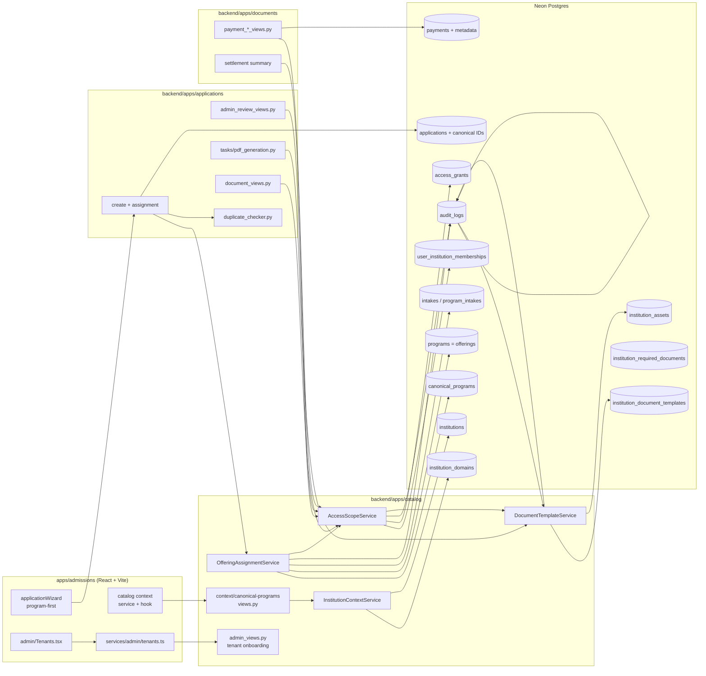

# Design Document

## Overview

This design converts the single-tenant MIHAS/KATC admissions system into the **Beanola multi-school admissions platform** around two non-negotiable invariants:

1. **Canonical-ID truth.** `canonical_programs.id`, `programs.id` (offering), `institutions.id`, and `intakes.id` are the only sources of truth for routing, scoping, payment tagging, and document generation. The legacy string columns (`applications.institution/program/intake`) are immutable display snapshots, never drivers of new logic.
2. **Cross-tenant isolation.** No non-super-admin actor can read, infer, export, or act on another school's data through any surface — lists, counts, empty states, search, exports, document URLs, payment receipts, settlement summaries, analytics, timing, or error messages.

The design is **additive and backward-compatible**. It preserves every `/api/v1/...` route, the `{"success": true, "data": ...}` envelope, cookie auth + CSRF, admissions auto-save, the Lenco mobile-money-first UX, and all existing production records. The multi-tenant foundation already exists in the repo (models, services, endpoints, wizard); this design's job is to **prove it under real Postgres, harden every tenant boundary, complete the UI/UX and operational surfaces, and lock the invariants behind tests** — not to rebuild from scratch.

The work is sequenced as a **six-phase, verification-gated rollout** so that correctness is established (assignment + scope under real DB) before UI polish and operational tooling.

### What already exists (verify before extending)

Per `docs/multi-tenant-beanola-handover.md` and `docs/multi-tenant-beanola-progress.md`, the following are implemented and passing local checks: the additive migration `backend/scripts/2026_06_08_01_multi_tenant_beanola_admissions.sql`; tenant models in `backend/apps/catalog/models.py`; `OfferingAssignmentService`, `InstitutionContextService`, `AccessScopeService`, `DocumentTemplateService` in `backend/apps/catalog/services.py`; catalog endpoints (`/api/v1/catalog/context/`, `/api/v1/catalog/canonical-programs/`); tenant admin APIs under `/api/v1/admin/`; tenant-aware official PDF generation; tenant payment metadata + scoped settlement; and the program-first wizard. **The codebase is the source of truth — confirm each claim with `rg`, file reads, tests, and DB introspection before acting.**

## Architecture

### Component Diagram



### Separation of Concerns

- **Views** handle HTTP parsing, auth, CSRF, throttling, envelope shaping, and **invoke `AccessScopeService` to bound every queryset** for non-super-admins. Views never trust client-supplied institution/program/offering IDs for *authorization* — they re-derive scope from `request.user`.
- **`OfferingAssignmentService`** is the sole authority for program→offering→institution assignment. It is pure with respect to inputs (canonical program, intake, residency, optional white-label institution) and returns a deterministic `AssignmentResult` or raises `OfferingAssignmentError`.
- **`InstitutionContextService`** is the sole authority for resolving Shared vs White-Label context from the request host.
- **`AccessScopeService`** is the sole authority for computing `ScopeFilters`. Every scoped queryset funnels through it; no view re-implements scope logic inline.
- **`DocumentTemplateService` + `tasks/pdf_generation.py`** own official document rendering. Frontend PDFs are preview-only.
- **`DuplicateChecker`** keys on canonical program + intake when canonical IDs are present, with a legacy string fallback.

### Canonical-Only Standard (enforced)

| Concept | Source of truth | Display snapshot (read-only) |
|---------|-----------------|------------------------------|
| Canonical program | `canonical_programs.id` | `applications.program` |
| School offering | `programs.id` (`program_offering_id`) linked via `canonical_program_id` | — |
| Institution | `institutions.id` | `applications.institution` |
| Intake | `intakes.id` | `applications.intake` |
| Application uniqueness | `(student identity, canonical program, intake)` | — |
| Payment reporting | `payments.metadata` settlement snapshot | — |
| Official document provenance | `verification_notes.official_document` (template+asset versions) | — |

A grep-style drift test will assert no new runtime logic matches on `applications.institution/program/intake` strings outside migration/backfill and the labelled legacy-fallback branch.

## Data Models

### New / changed tables (from `0001_multi_tenant_beanola_admissions.sql`)

- **`canonical_programs`** (new): `id, name, code (unique), description, duration_months, regulatory_body, is_active, metadata, timestamps`.
- **`programs`** (offerings, extended): `+ canonical_program_id, assignment_priority (default 100), offering_status (default 'active'), assignment_rules jsonb`. Keeps `institution_id`.
- **`program_intakes`** (extended): `+ is_active (default true), assignment_priority, residency_rules jsonb`.
- **`applications`** (extended, nullable): `+ institution_id, program_id (canonical), program_offering_id, intake_id`. Legacy strings retained.
- **`institution_assets`** (new): versioned `logo/signature/seal` — R2/S3 key, MIME, checksum, version, metadata.
- **`institution_document_templates`** (new): versioned safe-section/token templates.
- **`institution_required_documents`** (new): requirement config per institution/offering/canonical/default.
- **`institution_domains`** (new): white-label hostnames.
- **`user_institution_memberships`** (new): staff→institution scope, partial-unique on active `(user_id, institution_id)`.
- **`access_grants`** (new): explicit grants at institution/offering/application scope, time-boundable.
- **`institutions`** (extended): `+ slug, brand_name, primary_color, secondary_color, support_email, admissions_email`.

All `programs`/`institutions`/`applications` models are `managed = False` — schema changes ship as SQL scripts under `backend/scripts/`, not Django migrations.

### Indexes / invariants (already in the migration)

- `idx_applications_tenant_ids (institution_id, program_id, program_offering_id, intake_id)`
- `idx_user_institution_memberships_user (user_id, is_active)`
- `idx_access_grants_user_scope (user_id, scope_type, is_active)`
- `idx_institution_templates_lookup (institution_id, document_type, is_active, version)`
- `uq_active_membership_user_institution` partial unique on active `(user_id, institution_id)`
- `NOT VALID` foreign keys for tenant tables (validated post-backfill).

## Components and Interfaces

### OfferingAssignmentService

```
assign(program_id, intake_id, country=None, nationality=None, institution_id=None) -> AssignmentResult
# raises OfferingAssignmentError(code="NO_ELIGIBLE_OFFERING")
```

Algorithm (formalised from current code):

1. Load active `CanonicalProgram(program_id)` and active `Intake(intake_id)`.
2. Candidate query: active offerings (`is_active AND offering_status='active'`) for that canonical program linked to the intake via `program_intakes`, where `program_intakes.is_active` is true or legacy-null.
3. If `institution_id` (white-label) supplied → restrict to that institution.
4. For each candidate: fetch its `ProgramIntake`; skip if missing; apply offering `assignment_rules` and program-intake `residency_rules` against `country`/`nationality`; skip blocked; skip capacity-exhausted (unless waitlist path).
5. Sort by `program_intake.assignment_priority`, then `offering.assignment_priority` (lower wins), then deterministic tie-break on offering `code`/`id`.
6. Return first → `AssignmentResult(canonical_program, intake, offering, institution, required_documents)`.
7. On empty → raise `OfferingAssignmentError`.
8. Emit `assignment.decided` / `assignment.failed` audit event.

**Submission revalidation:** `submit_application` calls `assign(...)` again with the locked snapshot residency inputs; if the previously assigned offering is no longer eligible or capacity filled, it returns a recoverable error (`OFFERING_NO_LONGER_AVAILABLE` / capacity → waitlist path), never a silent success.

### InstitutionContextService

```
resolve(host: str) -> InstitutionContext   # white-label or shared Beanola
```

- Normalise host: lowercase, strip port.
- Match active `institution_domains.hostname` → active institution → white-label context (brand + offering filter).
- No match / inactive domain / inactive institution → shared Beanola context (or explicit unavailable).
- Duplicate active hostname → fail safe to shared + emit `domain.collision` audit; never silently pick a school.
- Cached with explicit invalidation on domain changes.

### AccessScopeService

```
scope_for(user) -> ScopeFilters(is_global: bool, institution_ids: set, offering_ids: set, application_ids: set)
filter_applications(qs, user) / filter_payments(qs, user) / filter_documents(qs, user)
```

- Super-admin → `ScopeFilters(is_global=True, ...)`.
- Else: union active memberships → `institution_ids`; active non-expired grants → institution/offering/application scope.
- No scope → empty filters → scoped surfaces return empty "no school access" results (not global zeros).
- Out-of-scope record lookup → respond identically to not-found (status, shape, message) to prevent existence inference.
- **Production rule:** the existing test-settings-only legacy-admin compatibility path is *not* extended; production scope is membership/grant-driven only. A test asserts the compatibility branch is unreachable under production settings.

### DocumentTemplateService + pdf_generation

```
resolve_template(institution, document_type) -> Template (version) | safe default
resolve_assets(institution) -> active latest logo/signature/seal
render_official(application, document_type) -> (pdf, provenance snapshot)
```

- Token rendering uses an allowlist + `html.escape`; unknown/injected tokens are rejected or safely ignored.
- Missing template → safe default body.
- Provenance (template id+version, asset ids) snapshotted into `verification_notes.official_document`.
- Already-generated documents are never silently regenerated.
- SVG assets: render safely or treat as unsupported with clear copy — never execute untrusted SVG.

### DuplicateChecker

- Canonical path: uniqueness on `(student identity, canonical program, intake)`; terminal statuses don't block; different NRC/passport identity may proceed.
- Legacy path (null canonical IDs): preserve previous string-keyword filter shape.
- Runs at draft-create and at submit.

## Error Handling

Stable codes (extend `backend/apps/common/error_codes.py` and mirror where a frontend mirror exists):

| Code | HTTP | Meaning |
|------|------|---------|
| `NO_ELIGIBLE_OFFERING` | 409 | No active offering for canonical program + intake + residency |
| `OFFERING_NO_LONGER_AVAILABLE` | 409 | Previously assigned offering ineligible at submit |
| `OFFERING_CAPACITY_FULL` | 409 | Capacity filled before submit (waitlist path) |
| `WHITE_LABEL_UNAVAILABLE` | 404 | Domain/institution inactive or unresolved |
| `DOMAIN_COLLISION` | 409 | Duplicate active hostname (operator-facing) |
| `OUT_OF_SCOPE` → masked as not-found | 404 | School staff requested out-of-scope record (indistinguishable from missing) |
| `SLUG_CODE_COLLISION` | 400 | Institution slug/code/domain collision on create/update |
| `ASSET_INVALID` | 400 | MIME/magic-byte/size validation failure on asset upload |
| `TEMPLATE_TOKEN_REJECTED` | 400 | Disallowed token in document template |

All payment endpoints retain their existing payment-hardening stable codes unchanged. Every endpoint keeps the `{"success": boolean, "data": ..., "error": ...}` envelope.

**Graceful degradation:** assignment failures, white-label unavailability, document render failures, and provider issues degrade to recoverable states, never dead-ends (per platform hard constraints).

## Correctness Properties

These are the invariants the implementation must hold. Each maps to a property-based or scoped-access test (hypothesis / fast-check) listed in the Testing Strategy below.

### Property 1: Canonical-ID truth
Routing, scoping, payment tagging, and document generation read canonical IDs only; legacy strings never drive new logic.

**Validates: Requirements 1.1, 1.2, 1.3, 1.5**

### Property 2: Assignment determinism
Same `(canonical program, intake, residency, white-label)` inputs always yield the same single offering; ties are deterministic.

**Validates: Requirements 2.1, 2.5**

### Property 3: Eligibility correctness
Residency/country/nationality blocks, archived offerings, and capacity exhaustion are excluded from new assignment; archived offerings stay readable.

**Validates: Requirements 2.1, 2.3, 2.4, 2.6**

### Property 4: Submission revalidation
Assignment + capacity are re-checked at submit; never a silent success on a stale draft assignment.

**Validates: Requirements 2.7**

### Property 5: Cross-tenant isolation
A non-super-admin's result set never intersects another school's rows on any surface; out-of-scope lookups are indistinguishable from not-found.

**Validates: Requirements 4.2, 4.3, 4.4, 4.5, 4.6**

### Property 6: Grant scope fidelity
Application/offering grants never widen to institution scope; expired grants drop at the boundary.

**Validates: Requirements 4.7, 4.8**

### Property 7: Host resolution safety
White-label match is case/port-insensitive; inactive domain/institution and hostname collisions fail safe without leaking school data.

**Validates: Requirements 3.1, 3.2, 3.3, 3.4, 3.5**

### Property 8: Duplicate canonicality
Uniqueness keys on `(student identity, canonical program, intake)`; terminal statuses don't block; legacy null-ID rows preserve the string shape.

**Validates: Requirements 8.1, 8.2, 8.3, 8.4, 8.5**

### Property 9: Document provenance and safety
Official documents snapshot template+asset versions, escape/allowlist tokens, fall back safely on missing templates, and never silently regenerate.

**Validates: Requirements 6.2, 6.4, 6.5, 6.6**

### Property 10: Settlement durability
Every initiation path writes the Beanola collector + tenant snapshot; reporting derives from the snapshot and survives renames; missing metadata buckets as "Unassigned".

**Validates: Requirements 7.1, 7.2, 7.3, 7.4, 7.5, 7.6**

### Property 11: Migration safety
The migration is additive and idempotent; legacy null-ID applications remain readable; new applications write all four canonical IDs.

**Validates: Requirements 1.4, 9.1, 9.5**

### Property 12: UI checkpoint
Payment is unreachable before the assigned-school checkpoint; no-scope staff see "No school access assigned", never global zeros.

**Validates: Requirements 10.1, 10.3, 11.6**

## Testing Strategy

### Property-to-test map (property-based, hypothesis / fast-check)

| # | Property | Where |
|---|----------|-------|
| P1 | Assignment determinism — same inputs → same offering | `backend/tests/property/test_assignment_properties.py` |
| P2 | Priority ordering — program-intake priority dominates offering priority; ties deterministic | same |
| P3 | Residency/country/nationality block excludes candidate | same |
| P4 | Archived offering readable but never newly assigned | same |
| P5 | Capacity exhaustion excludes (or routes to waitlist) | same |
| P6 | Scope isolation — staff queryset ∩ other-school rows = ∅ | `backend/tests/property/test_access_scope_properties.py` |
| P7 | Grant expiry removes scope at boundary | same |
| P8 | Application/offering/institution grant scope does not widen | same |
| P9 | Out-of-scope lookup indistinguishable from not-found | `backend/tests/unit/test_cross_tenant_isolation.py` |
| P10 | Host resolution: case/port-insensitive; inactive → safe fallback | `backend/tests/unit/test_institution_context.py` |
| P11 | Duplicate uniqueness keyed on canonical program + intake | `backend/tests/unit/test_duplicate_canonical.py` |
| P12 | Canonical IDs written on every new application; legacy rows readable | `backend/tests/unit/test_application_canonical_ids.py` |
| P13 | Token allowlist + injection escaping; missing-template fallback | `backend/tests/unit/test_official_documents.py` |
| P14 | Asset MIME/magic-byte validation per allowed type | same |
| P15 | Settlement metadata present on every initiation path; "Unassigned" bucket safe | `backend/tests/unit/test_payment_settlement_tenant.py` |
| P16 | Migration idempotency + backfill correctness | `backend/tests/unit/test_tenant_migration.py` |
| P17 | UI: program-first → assigned-school checkpoint before payment | `apps/admissions/tests/property/programFirstWizard.property.test.ts` |
| P18 | UI: white-label host filters offerings + brands from runtime context | `apps/admissions/tests/unit/whiteLabelContext.test.tsx` |
| P19 | UI: no-scope staff → "No school access assigned" (never global zeros) | `apps/admissions/tests/unit/noScopeEmptyState.test.tsx` |

Each backend property test runs ≥100 examples with `--hypothesis-seed=0`; each frontend property test uses `fc.assert(prop, { numRuns: 100, seed: 0 })`.

### Verification gates (per the steering tech.md)

- Backend: `cd backend && python3 -m pytest`, `python3 manage.py check`, `python3 manage.py spectacular --file /tmp/schema.yaml`.
- Admissions: `cd apps/admissions && bun run type-check && bun run test && bun run lint`, then `bun run build`.
- `git diff --check`.

### SQL validation (staging Neon branch)

Run the post-migration validation SQL from the handover (canonical program counts; offerings without canonical link; applications missing each canonical ID; duplicate hostnames; duplicate slugs; duplicate active memberships) and inspect every returned row before validating `NOT VALID` FKs.

## Migration Strategy

1. Confirm Migration_History_Prerequisite (`2026_05_22_migration_history_extend.sql`) applied; `apply_sql_migrations --dry-run` is blocked until then.
2. Backup → dry-run → apply on a Neon branch (staging) first.
3. Run `0001_multi_tenant_beanola_admissions.sql` (additive, idempotent).
4. Audit backfill: produce a manual exception report for legacy applications that cannot be linked by ID.
5. Validate `NOT VALID` FKs only after backfill issues resolved.
6. Verify: legacy null-ID applications readable; new applications write all four canonical IDs; pre-migration official documents unchanged.
7. Rollback note: additive tables/columns are safe to leave in place; no destructive revert needed.

## Design Decisions

- **D1 — Canonical IDs over strings.** Strings drift on rename; IDs don't. Legacy strings stay as display snapshots only.
- **D2 — Scope at the service layer, not per-view.** One `AccessScopeService` prevents per-view scope drift and makes isolation testable in one place.
- **D3 — Out-of-scope == not-found.** Distinct 403s leak existence; masking as 404 closes the inference channel.
- **D4 — Backend-canonical official documents.** Frontend PDFs drift from the design system and cannot be trusted as official records.
- **D5 — Settlement from metadata snapshot.** Reporting must survive renames/archival; recompute-from-current-names is unsafe.
- **D6 — Additive, idempotent, feature-safe migration.** Managed=False tables mean SQL scripts + preflight + rollback, never Django migrations or destructive rewrites.
- **D7 — Correctness before polish.** Phases 1–3 prove DB + assignment + scope; UI/UX and ops tooling (Phases 4–6) build only on a proven base.
