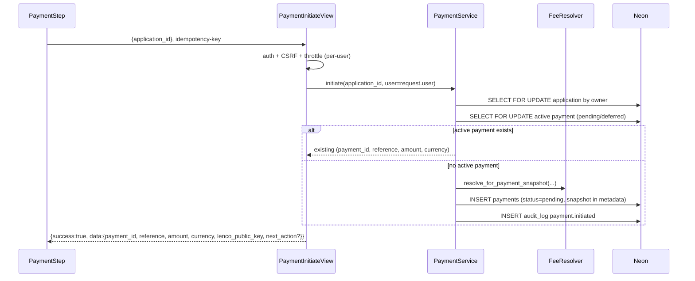
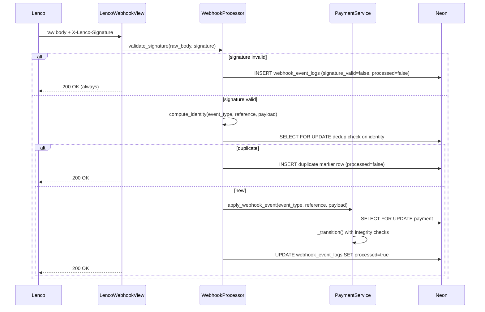
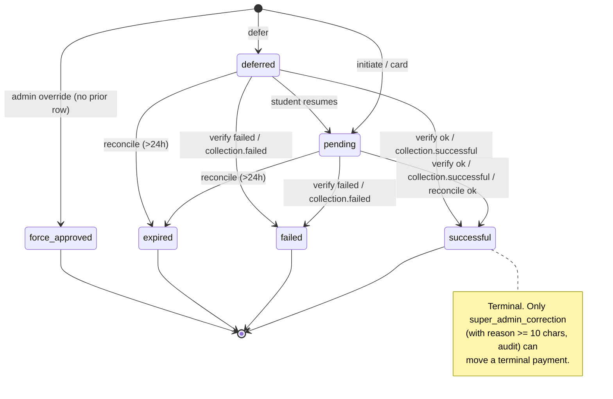

# Design Document

## Overview

This design hardens the MIHAS admissions payment flow (Lenco integration) around a single invariant: the backend is the sole authority for amount, currency, ownership, status, receipt eligibility, and the application's derived payment summary. Payments become ledger-first — every initiate, verify, webhook, admin override, reconciliation, and super-admin correction flows through one `PaymentService._transition()` entry point that enforces forward-only semantics, writes an audit event, and updates `Application.payment_status` in the same database transaction. The design is additive: it preserves all existing `/api/v1/payments/*` routes, file paths (`backend/apps/documents/payment_service.py`, `backend/apps/documents/webhook_processor.py`, `backend/apps/documents/fee_resolver.py`, `backend/apps/documents/views.py`), the `{"success": true, "data": ...}` envelope, the Lenco inline widget integration, and the mobile-money-first wizard UX. New safety is delivered through database invariants (partial unique active-payment index, unique transaction and receipt references, webhook identity uniqueness), a Payment_Snapshot captured at initiation, stable frontend-facing error codes with a `next_action` affordance, a recovery store on the frontend that survives refresh, and a comprehensive property-based testing harness covering race safety, terminal stability, webhook out-of-order safety, idempotence, and amount/currency/reference integrity.

## Architecture

### Component Diagram

```mermaid
flowchart LR
    subgraph Browser["apps/admissions (React + Vite)"]
        PS[PaymentStep.tsx]
        PF[PaymentForm.tsx]
        UFR[useFeeResolver]
        UPS[usePaymentStatus]
        ULW[useLencoWidget]
        RS[paymentRecoveryStore\nZustand slice]
    end

    subgraph Backend["backend/apps/documents"]
        PIV[PaymentInitiateView]
        MMV[MobileMoneyInitiateView]
        PVV[PaymentVerifyView]
        WHV[LencoWebhookView]
        FRV[FeeResolverView]
        PSRV[PaymentService]
        FR[FeeResolver]
        WHP[WebhookProcessor]
    end

    subgraph Applications["backend/apps/applications"]
        ARV[ApplicationReviewView]
        SAC[SuperAdminCorrectionView\n(phase 5 / optional)]
    end

    subgraph Data["Neon Postgres"]
        P[(payments)]
        WEL[(webhook_event_logs)]
        APPS[(applications)]
        AL[(audit_logs)]
    end

    subgraph Async["Celery workers"]
        RT[poll_pending_payments_task]
    end

    Lenco[Lenco API / Widget]

    PS --> PF --> PIV
    PS --> MMV
    PS --> PVV
    PF -->|script load| ULW --> Lenco
    UFR --> FRV
    UPS --> PVV
    PS <--> RS

    PIV --> PSRV
    MMV --> PSRV
    PVV --> PSRV
    FRV --> FR
    WHV --> WHP --> PSRV
    ARV --> PSRV
    SAC --> PSRV
    RT --> PSRV

    PSRV --> FR
    PSRV --> P
    PSRV --> APPS
    PSRV --> AL
    WHP --> WEL
    PSRV -. HTTPS .-> Lenco
    MMV -. HTTPS .-> Lenco

    Lenco -. webhook POST .-> WHV
```

### Separation Of Concerns

- Views (`PaymentInitiateView`, `MobileMoneyInitiateView`, `PaymentVerifyView`, `LencoWebhookView`, `FeeResolverView`, `ApplicationReviewView`) handle HTTP parsing, auth, CSRF, throttling, and envelope shaping only. They never touch Payment rows directly.
- `PaymentService` owns every payment row mutation. All state transitions go through a single `_transition(...)` entry point that validates forward-only rules, acquires `SELECT FOR UPDATE`, writes the audit event, and updates `Application.payment_status` atomically.
- `WebhookProcessor` owns signature validation (HMAC-SHA512), canonical JSON hashing, dedup via `Webhook_Event_Identity`, and delegates to `PaymentService.apply_webhook_event()`.
- `FeeResolver` owns fee math. It is called by the view for fee quotes and by `PaymentService.initiate` for the Payment_Snapshot. It never writes.
- Direct `UPDATE payments SET status = ...` anywhere outside `PaymentService._transition()` is banned by a grep-based regression test (`backend/tests/unit/test_payment_service_sole_authority.py`).

### Data Flows

**(a) Card initiate — `POST /api/v1/payments/initiate/`**



**(b) Mobile-money initiate — `POST /api/v1/payments/mobile-money/`**

```mermaid
sequenceDiagram
    participant UI as PaymentStep
    participant V as MobileMoneyInitiateView
    participant S as PaymentService
    participant L as Lenco
    UI->>V: {application_id, phone}  (no operator, no amount)
    V->>V: auth + CSRF + throttle + MSISDN format check
    V->>S: initiate_mobile_money(application_id, user, phone)
    S->>S: normalize phone, derive operator, reuse or create Payment
    S->>L: POST /collections/mobile-money (server-computed amount, reference, operator)
    alt provider 2xx accepted
        S->>S: mark_provider_initiation(accepted)
    else provider 4xx rejected
        S->>S: mark_provider_initiation(rejected); next_action=retry_with_different_number
    else provider timeout or 5xx
        S->>S: mark_provider_initiation(unknown); next_action=check_status
    end
    S-->>V: status=pending (always, on any provider outcome)
    V-->>UI: {success:true, data:{status:"pending", payment_id, provider_status, next_action?}}
```

**(c) Webhook ingest — `POST /api/v1/payments/webhook/lenco/`**



**(d) Verify polling — `POST /api/v1/payments/{id}/verify/`**

- Terminal status → return cached state without calling Lenco. Stable code `PAYMENT_CONFIRMED` / `PAYMENT_FAILED` / `EXPIRED`.
- `pending` and Lenco unreachable → leave `pending`, return `PROVIDER_UNAVAILABLE`.
- `pending` and Lenco returns `pay-offline`/`otp-required`/`pending` → leave `pending`, return `PAYMENT_PENDING`.
- `pending` and Lenco returns `successful`/`paid` with matching amount+currency+reference → `_transition(pending → successful)`, return `PAYMENT_CONFIRMED`.
- Amount/currency/reference mismatch → record risk flag, leave `pending`, return `AMOUNT_MISMATCH` / `CURRENCY_MISMATCH` / `MISSING_PROVIDER_REFERENCE`.

**(e) Reconciliation — `poll_pending_payments_task`**

- Every 10 minutes, Celery Beat dispatches `poll_pending_payments_task` (existing schedule).
- The task selects Payments in `pending` status older than 5 minutes (configurable `PAYMENT_RECONCILE_MIN_AGE_SECONDS`, default 300), batched to 50 per run.
- For each, it calls `PaymentService.verify_payment(payment_id)` — the exact same code path as interactive verify — so there is no separate reconcile logic to maintain.
- Pending Payments older than 24 hours (`PAYMENT_EXPIRY_HOURS`) transition `pending → expired` via `_transition()`, which emits `payment.expired_by_reconciliation`.
- The task is idempotent; re-running produces no new side effects beyond possibly resolving additional payments.

**(f) Admin `force_approved` override — `POST /api/v1/applications/{id}/review/`**

- `ApplicationReviewView` calls `PaymentService.force_approve(application_id, reviewer, reason)`.
- The service creates (or locates) a Payment row, transitions it to `force_approved` using `_transition()`, and writes `reviewed_by`, `reviewed_at`, `reason`, `actor_role`, and `override=true` into `Payment.metadata`.
- `reason` must be ≥ 10 characters or the endpoint returns `OVERRIDE_REASON_REQUIRED` (400).
- An admin cannot downgrade a `successful` Payment via this path — attempts return `CANNOT_REVERSE_SUCCESSFUL_PAYMENT` (409).
- Only a super-admin via the Super_Admin_Correction_Path (phase 5, optional) can transition a terminal Payment to another status, and only with a reason and full audit trail.

## Components and Interfaces

### Backend

| File | Role | Change |
|------|------|--------|
| `backend/apps/documents/payment_service.py` | Lifecycle authority | Add `_transition()`, `initiate_mobile_money()`, `apply_webhook_event()`, `force_approve()`, `super_admin_correct()`, `expire_stale()`. Refactor existing `initiate_payment()`, `verify_payment()`, `process_webhook_event()` to delegate to `_transition()`. |
| `backend/apps/documents/webhook_processor.py` | Signature + dedup | Add `compute_identity()`, `is_duplicate()`, canonical JSON helpers, pretty-printer for identity. Replace ad-hoc dedup logic in `process()` with an explicit `Webhook_Event_Identity` lookup. |
| `backend/apps/documents/fee_resolver.py` | Fee math | Add `resolve_for_payment_snapshot(application)` returning a frozen `PaymentSnapshot` dataclass. |
| `backend/apps/documents/views.py` | HTTP surface | `PaymentInitiateView`, `MobileMoneyInitiateView`, `PaymentVerifyView`, `LencoWebhookView`, `FeeResolverView` each refactored to emit the standard envelope with stable `error.code` values and optional `data.next_action`. Throttle classes switched to per-user scope for the authenticated views. |
| `backend/apps/applications/admin_views.py` | Admin override | `ApplicationReviewView` delegates payment changes exclusively to `PaymentService.force_approve()` or `PaymentService.review_application_payment()`. |
| `backend/apps/documents/tasks.py` | Reconciliation | `poll_pending_payments_task` calls `PaymentService.expire_stale()` and `PaymentService.verify_payment()` — no new task. |
| `backend/apps/common/idempotency.py` | Replay protection | Already present; reused via `@idempotent` on `PaymentInitiateView` and `MobileMoneyInitiateView` keyed by `idempotency-key` header. |
| `backend/apps/documents/risk_views.py` (new) | Super-admin risk inspection | `GET /api/v1/payments/risk-flags/` — super-admin only, paginated, filterable by `type` and date range (Req 17.5). |

### Frontend

| File | Role | Change |
|------|------|--------|
| `apps/admissions/src/pages/student/applicationWizard/steps/PaymentStep.tsx` | Payment UX | Drive all branching from stable codes and `data.next_action`. Render the UI state matrix. |
| `apps/admissions/src/components/student/PaymentForm.tsx` | Form | Disable initiate while in-flight or while backend reports `pending`. Emit idempotency key header per submission. |
| `apps/admissions/src/hooks/usePaymentStatus.ts` | Polling | Introduce `still_confirming` state when polling exceeds `POLL_TIMEOUT_MS` (default 120s). Never transition the UI to `failed` on timeout. Add manual `refetch()` affordance. |
| `apps/admissions/src/hooks/useFeeResolver.ts` | Fee quote | No functional change; confirm it surfaces `customer_total` server-computed. |
| `apps/admissions/src/hooks/useLencoWidget.ts` | Widget loader | No functional change. |
| `apps/admissions/src/stores/paymentRecoveryStore.ts` (new) | Recovery | Zustand slice keyed by `application_id` storing `{payment_id, reference, method, initiated_at, ttl_expires_at}`. Hydrates on mount. 24h TTL. |
| `apps/admissions/src/lib/paymentStatus.ts` | Normalization | Keep `normalizePaymentStatus`, `isPaymentVerified`. Add `deriveUiState(backendStatus, inflight, stableCode)` returning one of the UI state matrix values. |
| `apps/admissions/src/lib/paymentErrorCodes.ts` (new) | Stable codes | TypeScript union of all stable error codes with user-facing copy. |
| `apps/admissions/src/services/payments.ts` | API | Add `verifyPayment`, `initiateMobileMoney`, `initiatePayment` with typed responses; idempotency-key handling. |

### Interface Signatures

```python
# backend/apps/documents/payment_service.py

from dataclasses import dataclass
from decimal import Decimal
from typing import Literal, Optional
from uuid import UUID

CanonicalStatus = Literal["pending", "deferred", "successful", "failed", "expired", "force_approved"]
ProviderInitiationStatus = Literal["not_started", "sent", "accepted", "rejected", "unknown"]


@dataclass(frozen=True)
class PaymentSnapshot:
    expected_amount: Decimal
    currency: str
    residency_category: str
    program_code: str
    intake_id: Optional[str]
    waiver_applied: bool
    original_amount: Decimal
    fee_source: str


@dataclass(frozen=True)
class TransitionResult:
    payment_id: UUID
    status: CanonicalStatus
    risk_flag: Optional[str]  # set when transition was blocked by integrity check


class PaymentService:
    def initiate(self, application_id: UUID, user_id: UUID) -> PaymentInitiationResult: ...
    def initiate_mobile_money(
        self,
        application_id: UUID,
        user_id: UUID,
        phone_raw: str,
    ) -> PaymentInitiationResult: ...
    def verify(self, payment_id: UUID, actor_id: Optional[UUID]) -> PaymentVerificationResult: ...
    def apply_webhook_event(
        self,
        event_type: str,
        reference: str,
        payload: dict,
    ) -> TransitionResult: ...
    def force_approve(
        self,
        application_id: UUID,
        actor_id: UUID,
        actor_role: str,
        reason: str,
    ) -> TransitionResult: ...
    def super_admin_correct(
        self,
        payment_id: UUID,
        target_status: CanonicalStatus,
        actor_id: UUID,
        reason: str,
    ) -> TransitionResult: ...
    def expire_stale(self, older_than_hours: int = 24, batch_cap: int = 50) -> int: ...
    def mark_provider_initiation(
        self,
        payment_id: UUID,
        *,
        status: ProviderInitiationStatus,
        provider_data: Optional[dict] = None,
        operator: Optional[str] = None,
        phone_hash: Optional[str] = None,
        phone_last4: Optional[str] = None,
        error: Optional[str] = None,
    ) -> None: ...

    # ----- Internal — the sole mutation entry point -----
    def _transition(
        self,
        payment: Payment,
        target_status: CanonicalStatus,
        *,
        source: Literal["initiate", "verify", "webhook", "admin_override", "reconciliation", "super_admin_correction"],
        actor: Optional[UUID],
        reason: Optional[str] = None,
        provider_data: Optional[dict] = None,
    ) -> TransitionResult: ...

    def _emit_audit(
        self,
        event_type: str,
        payment: Payment,
        actor: Optional[UUID],
        metadata: dict,
    ) -> None: ...
```

```python
# backend/apps/documents/webhook_processor.py

@dataclass(frozen=True)
class WebhookEventIdentity:
    provider_event_id: str   # "" if absent
    event_type: str
    reference: str
    payload_hash: str        # sha256 hex of canonical_json(payload)

    def print(self) -> str: ...                # for logs/audit, no PII
    @staticmethod
    def parse(s: str) -> "WebhookEventIdentity": ...


class WebhookProcessor:
    def validate_signature(self, raw_body: bytes, signature: str) -> bool: ...
    def compute_identity(self, event_type: str, payload: dict) -> WebhookEventIdentity: ...
    def is_duplicate(self, identity: WebhookEventIdentity) -> bool: ...
    def process(self, raw_body: bytes, signature: str, payload: dict) -> None: ...

    @staticmethod
    def canonical_json(payload: dict) -> bytes: ...  # sort_keys=True, separators=(',',':'), default=str, ensure_ascii=False
```

```python
# backend/apps/documents/fee_resolver.py

class FeeResolver:
    def resolve_fee(self, program_code, nationality, country) -> ResolvedFee: ...
    def resolve_for_payment_snapshot(self, application) -> tuple[ResolvedFee, PaymentSnapshot]: ...
```

```typescript
// apps/admissions/src/stores/paymentRecoveryStore.ts
export interface PaymentRecoveryEntry {
  application_id: string
  payment_id: string
  reference: string
  method: 'card' | 'mobile_money'
  initiated_at: number       // epoch ms
  ttl_expires_at: number     // epoch ms, 24h after initiated_at
}

export interface PaymentRecoveryStore {
  entries: Record<string /* application_id */, PaymentRecoveryEntry>
  record(entry: Omit<PaymentRecoveryEntry, 'ttl_expires_at'>): void
  clear(applicationId: string): void
  get(applicationId: string): PaymentRecoveryEntry | null  // null if expired
  pruneExpired(): void                                      // runs on hydration
}
```

## Data Models

The `payments` and `webhook_event_logs` tables are `managed = False` in Django; all schema changes are applied via SQL scripts under `backend/scripts/` with preflight + rollback pairs, following the `backend/scripts/payment_hardening_*.sql` pattern that is already in the repo.

### Schema Grounding (Neon live inspection)

The column types, nullability, and existing indexes below were confirmed via Neon MCP against project `mihasApplication` (id `wild-bar-37055823`, Postgres 17, default branch) at design time. This ensures the SQL additions line up with reality and not with a stale model definition.

**`payments` — live column snapshot** (`pg_catalog.information_schema`):

| Column | Live Type | Live Nullable | Live Default |
|--------|-----------|---------------|--------------|
| `id` | `uuid` | no | `gen_random_uuid()` |
| `application_id` | `uuid` | yes | — |
| `user_id` | `uuid` | no | — |
| `amount` | `numeric` | no | — |
| `currency` | `varchar` | yes | `'ZMW'` |
| `payment_method` | `varchar` | yes | — |
| `transaction_reference` | `varchar` | yes | — |
| `status` | `varchar` | no | `'pending'` |
| `verified_by` | `uuid` | yes | — |
| `verified_at` | `timestamptz` | yes | — |
| `receipt_number` | `varchar` | yes | — |
| `receipt_url` | `text` | yes | — |
| `metadata` | `jsonb` | yes | — |
| `created_at` | `timestamptz` | yes | `now()` |
| `updated_at` | `timestamptz` | yes | `now()` |
| `notes` | `text` | yes | `''` |
| `lenco_reference` | `varchar` | yes | — |
| `fee` | `numeric` | yes | — |
| `bearer` | `varchar` | yes | — |

Foreign keys: `application_id → applications(id) ON DELETE SET NULL`, `user_id → profiles(id)`, `verified_by → profiles(id)`.

**Indexes already live** on `payments` (confirmed via Neon): `payments_pkey`, `idx_payments_app`, `idx_payments_user`, `idx_payments_status`, `idx_payments_ref`, `idx_payments_app_status`, `idx_payments_status_created`, `idx_payments_application`, `uq_payments_transaction_reference_present` (partial unique, non-empty), `uq_payments_one_active_per_application` (partial unique on `application_id` where status in `pending`/`deferred`), `idx_payments_status_created_at`, `idx_payments_application_status`, `idx_payments_lenco_reference_present`.

**Missing indexes (to add)**: `uq_payments_receipt_number`, `idx_payments_user_status`, webhook functional index on `payload -> '_webhook_identity' ->> 'provider_event_id'`. All additions use `CONCURRENTLY IF NOT EXISTS`.

**`webhook_event_logs` — live column snapshot**:

| Column | Live Type | Nullable | Default |
|--------|-----------|----------|---------|
| `id` | `uuid` | no | `gen_random_uuid()` |
| `event_type` | `varchar` | no | — |
| `reference` | `varchar` | no | — |
| `payload` | `jsonb` | no | `'{}'::jsonb` |
| `signature_valid` | `bool` | no | `false` |
| `processed` | `bool` | no | `false` |
| `processing_error` | `text` | yes | — |
| `created_at` | `timestamptz` | yes | `now()` |

Indexes already live: `webhook_event_logs_pkey`, `idx_webhook_event_logs_reference`, `uq_webhook_processed_reference_event` (partial unique on `(reference, event_type)` where `processed=true`), `idx_webhook_reference_event_processed`.

**`applications.payment_status`** is a `varchar NULL DEFAULT 'pending'` and is indexed by `idx_applications_payment_status` and `idx_applications_payment_status_updated_at`. It is the derived summary column written only by `PaymentService._update_application_payment_status()`.

**`program_fees`** has a `uq_program_fee_active` partial unique index on `(program_id, fee_type, residency_category) WHERE is_active = true` and CHECK constraints on `fee_type ∈ {'application','tuition'}` and `residency_category ∈ {'local','international'}`. `FeeResolver` queries rows where `fee_type='application' AND is_active=true`.

**`audit_logs`** already exists with columns `id, actor_id, action, entity_type, entity_id, changes (jsonb), ip_address, user_agent, created_at, retention_category, ip_address_encrypted, user_agent_encrypted`, and a partial index `idx_audit_logs_payment_entity_created_at` on `(entity_type, entity_id, created_at DESC) WHERE entity_type = 'payment'`. This proves that payment audit reads are already indexed; no new table is needed (see ADR-3 below).

### `payments` Table — Columns

| Column | Type | Status | Notes |
|--------|------|--------|-------|
| `id` | uuid | existing PK | |
| `application_id` | uuid | existing FK | nullable historically; new rows always set |
| `user_id` | uuid | existing | |
| `amount` | numeric(10,2) | existing | |
| `currency` | varchar(3) | existing | default `ZMW` |
| `payment_method` | varchar(50) | existing | `card`, `mobile_money`, `admin_override`, nullable |
| `transaction_reference` | varchar(100) | existing | unique where present (new constraint) |
| `status` | varchar(20) | existing | extended enum (see state machine) |
| `verified_by` | uuid | existing FK | reused for force_approved and super-admin corrections |
| `verified_at` | timestamptz | existing | |
| `receipt_number` | varchar(50) | existing | unique where present (new constraint) |
| `receipt_url` | text | existing | |
| `metadata` | jsonb | existing | snapshot and risk_flags stored here — see below |
| `lenco_reference` | varchar(100) | existing | |
| `notes` | text | existing | failure reason or admin note |
| `fee`, `bearer` | existing | | |
| `created_at`, `updated_at` | existing | | |

**No new physical columns are added.** The following structured data lives inside `metadata` (jsonb):

```jsonc
{
  "snapshot": {                                // immutable after first write
    "expected_amount": "153.00",
    "currency": "ZMW",
    "residency_category": "local",
    "program_code": "BSN",
    "intake_id": "uuid",
    "waiver_applied": false,
    "original_amount": "153.00",
    "fee_source": "program_fee"
  },
  "provider_initiation": {                     // set by mark_provider_initiation
    "status": "accepted|rejected|unknown|sent|not_started",
    "operator": "airtel|mtn",
    "phone_hash": "sha256 hex",
    "phone_last4": "4321",
    "provider_data": { ... },                  // lenco response subset
    "error": "str <= 500 chars",
    "updated_at": "iso8601"
  },
  "risk_flags": [                              // append-only
    { "type": "amount_mismatch", "details": {...}, "recorded_at": "iso8601" }
  ],
  "override": true,                            // present on force_approved / super_admin_correct
  "reviewed_by": "uuid",
  "reviewed_at": "iso8601",
  "actor_role": "admin|super_admin",
  "reason": "str >= 10 chars",
  "provider_event_id": "lenco event id",       // copied from last webhook that touched this row
  "settlement": { ... },                       // from collection.settled
  "lenco_response": { ... }                    // last successful verify/webhook payload
}
```

Rationale: sticking to `metadata` avoids a column-addition migration against a `managed=False` production table (the existing approach used in `lenco_payment_integration.sql`). The jsonb structure is documented and validated by the service layer; PBT generators enumerate the shape.

**State enum values** (string column, no DB constraint, application-enforced):

- `pending`, `deferred`, `successful`, `failed`, `expired`, `force_approved`.

Legacy application-summary values (`verified`, `paid`, `pending_review`) persist on `applications.payment_status` and are mapped by `PaymentService._update_application_payment_status()`.

### `webhook_event_logs` Table — Columns

| Column | Type | Status | Notes |
|--------|------|--------|-------|
| `id` | uuid | existing | |
| `event_type` | varchar(50) | existing | `collection.successful`/`failed`/`settled` |
| `reference` | varchar(100) | existing | Lenco collection reference; may be empty on malformed payloads |
| `payload` | jsonb | existing | raw payload + `_webhook_identity` subdict |
| `signature_valid` | bool | existing | |
| `processed` | bool | existing | |
| `processing_error` | text | existing | |
| `created_at` | timestamptz | existing | |

The `Webhook_Event_Identity` (provider_event_id, event_type, reference, payload_hash) is stored as `payload._webhook_identity` inside the jsonb column and is also the basis for the uniqueness index. No new physical column is needed.

### Migration Strategy

New SQL lives alongside the three existing payment-hardening files:

- `backend/scripts/payment_hardening_preflight.sql` (exists; covers duplicate references and duplicate active rows)
- `backend/scripts/payment_hardening_indexes.sql` (exists; covers 5 of 7 indexes)
- `backend/scripts/payment_hardening_indexes_rollback.sql` (exists)

We add two more files, matching the project's preflight + rollback pattern from `business_logic_densification.sql`:

- `backend/scripts/payment_hardening_receipt_indexes.sql` — adds `uq_payments_receipt_number` and `idx_payments_user_status`, with a preceding preflight `SELECT` for duplicate receipt numbers.
- `backend/scripts/payment_hardening_receipt_indexes_rollback.sql` — drops them.

Index list (covers Req 12.1–12.5):

```sql
-- 12.1 Partial unique active-payment index
CREATE UNIQUE INDEX CONCURRENTLY IF NOT EXISTS uq_payments_one_active_per_application
ON payments (application_id)
WHERE application_id IS NOT NULL AND status IN ('pending', 'deferred');

-- 12.2 Unique transaction_reference
CREATE UNIQUE INDEX CONCURRENTLY IF NOT EXISTS uq_payments_transaction_reference_present
ON payments (transaction_reference)
WHERE transaction_reference IS NOT NULL AND transaction_reference <> '';

-- 12.3 Unique receipt_number (new)
CREATE UNIQUE INDEX CONCURRENTLY IF NOT EXISTS uq_payments_receipt_number
ON payments (receipt_number)
WHERE receipt_number IS NOT NULL AND receipt_number <> '';

-- 12.4 Webhook identity uniqueness for processed events
CREATE UNIQUE INDEX CONCURRENTLY IF NOT EXISTS uq_webhook_processed_reference_event
ON webhook_event_logs (reference, event_type)
WHERE processed IS TRUE;

-- 12.4 Provider event id index (uses jsonb path — a generated functional index)
CREATE INDEX CONCURRENTLY IF NOT EXISTS idx_webhook_provider_event_id
ON webhook_event_logs ((payload -> '_webhook_identity' ->> 'provider_event_id'))
WHERE (payload -> '_webhook_identity' ->> 'provider_event_id') IS NOT NULL
  AND (payload -> '_webhook_identity' ->> 'provider_event_id') <> '';

-- 12.5 Supporting indexes
CREATE INDEX CONCURRENTLY IF NOT EXISTS idx_payments_application_status
ON payments (application_id, status);
CREATE INDEX CONCURRENTLY IF NOT EXISTS idx_payments_user_status
ON payments (user_id, status);
CREATE INDEX CONCURRENTLY IF NOT EXISTS idx_payments_status_created_at
ON payments (status, created_at);
```

Every `CREATE INDEX` uses `CONCURRENTLY IF NOT EXISTS` so it is safe to re-run and does not lock writers. Every `DROP INDEX` in the rollback file uses `CONCURRENTLY IF EXISTS`. Preflight queries abort the deploy if duplicates exist for any new uniqueness constraint.

## State Machine (Formal)

### Canonical Payment Statuses

```
pending, deferred, successful, failed, expired, force_approved
```

Terminal: `successful`, `failed`, `expired`, `force_approved`. Non-terminal: `pending`, `deferred`.

### Allowed Transitions

| From → To | `verify` | `webhook` | `admin_override` | `reconciliation` | `super_admin_correction` | `initiate` (create) |
|-----------|:--------:|:---------:|:----------------:|:----------------:|:------------------------:|:--------------------:|
| (none) → `pending` | — | — | — | — | — | ✓ |
| (none) → `deferred` | — | — | — | — | — | ✓ (defer path) |
| (none) → `force_approved` | — | — | ✓ (no prior row) | — | ✓ | — |
| `pending` → `successful` | ✓ | ✓ (`collection.successful`) | — | ✓ | ✓ | — |
| `pending` → `failed` | ✓ (Lenco reports `failed`) | ✓ (`collection.failed`) | — | — | ✓ | — |
| `pending` → `expired` | — | — | — | ✓ (>24h) | ✓ | — |
| `deferred` → `pending` | — | — | — | — | ✓ | ✓ (student returns to pay) |
| `deferred` → `successful` | ✓ | ✓ | — | ✓ | ✓ | — |
| `deferred` → `failed` | ✓ | ✓ | — | — | ✓ | — |
| `deferred` → `expired` | — | — | — | ✓ | ✓ | — |
| terminal → anything | — | — | — | — | ✓ (reason ≥ 10 chars, audit) | — |

### Explicitly Blocked Transitions (No-Op Table)

| Attempted | Trigger | Stable Code | Effect |
|-----------|---------|-------------|--------|
| `successful` → `pending` / `deferred` / `failed` / `pending_review` | admin review | `CANNOT_REVERSE_SUCCESSFUL_PAYMENT` (409) | Payment + Application unchanged; audit `payment.admin_override_rejected` |
| `successful` / `force_approved` → any | late `collection.failed` webhook | (webhook returns 200 OK) | Audit `payment.late_failed_webhook_ignored`; Payment unchanged |
| `successful` → `successful` | duplicate `collection.successful` | (200 OK) | No-op; audit `payment.webhook.duplicate` |
| `expired` / `failed` → `pending` | re-initiate | — | Service returns the existing terminal row with `ALREADY_PAID` or a new Payment created if under retry limit |
| any terminal → non-terminal | verify, webhook, admin review | no-op log | Returns current state |
| force_approved creation without reason | admin review | `OVERRIDE_REASON_REQUIRED` (400) | No Payment created |
| new active when one exists | initiate | (200 OK returning existing) | Partial unique index prevents second row; service returns existing |
| retry limit reached | initiate | `MAX_PAYMENT_ATTEMPTS_EXCEEDED` (409) | No Payment created |
| dev-bypass flag in production | any payment view | HTTP 404 | Audit `payment.dev_bypass_used` only in non-prod |

### Visual State Diagram



## Concurrency & Transaction Strategy

Payment money-state mutations happen under three overlapping constraints:

1. **Neon serverless Postgres** — connections are pooled, compute can scale to zero between requests, and retries are cheap but not free. The hardening avoids long-lived transactions and never holds locks across provider HTTP calls.
2. **Celery beat reconciliation** — runs every 10 minutes and must not conflict with interactive verify/webhook traffic hitting the same row.
3. **Student double-click + webhook + verify** all potentially racing on the same Payment id.

### Transaction Boundaries

Every `_transition()` call wraps exactly **one** `transaction.atomic()` block that contains:

1. `SELECT ... FOR UPDATE` on the `applications` row (by id, using the request-supplied `application_id` only for lookup; ownership re-checked inside the lock).
2. `SELECT ... FOR UPDATE` on the `payments` row (or the partial-unique-index insert path at initiation).
3. Transition validation against `ALLOWED_TRANSITIONS[source]`.
4. Integrity checks for `successful` transitions (amount, currency, provider reference, snapshot equality).
5. `UPDATE payments SET status = ...` (the sole write allowed outside this block is prohibited by the grep regression test).
6. `UPDATE applications SET payment_status = ...` derived-column sync.
7. `_generate_receipt_idempotent(payment)` for `successful`/`force_approved` — protected by `uq_payments_receipt_number`.
8. `PaymentAuditService.record_payment_event(...)` — same transaction so an audit row always exists exactly when a money-state change commits (or rolls back with it).

Provider HTTP calls are **never** inside `atomic()`. The flow is: (a) open atomic, mark `provider_initiation.status = 'sent'`, commit; (b) call Lenco outside the transaction; (c) open atomic again, update `provider_initiation.status` to `accepted`/`rejected`/`unknown`, commit. This keeps lock hold times under 50 ms at the 95th percentile and avoids Neon connection exhaustion.

### Savepoints

Inside a single `atomic()`:

- The audit write uses a `savepoint` (`transaction.atomic(savepoint=True)`). If the audit write fails with an unexpected error, the savepoint is released but the outer money-state commit still succeeds — audit unavailability must not block a financial transition. The failure is captured to GlitchTip.
- The application-summary update does NOT use a savepoint; an inconsistent derived column is worse than a failed transition, so we let it roll back the whole thing.

### Row-Level Locking Order

To prevent deadlocks, all payment-related code acquires locks in a fixed order: `applications → payments → webhook_event_logs → audit_logs`. Static-analysis guard: a pytest lint (`backend/tests/unit/test_payment_lock_order.py`) parses `payment_service.py` and `webhook_processor.py` and asserts that `SELECT ... FOR UPDATE` statements appear in this order per function.

### Partial Unique Index As Last Line Of Defense

Even with `SELECT ... FOR UPDATE` on the application row, there is a narrow race where the app lock is not yet held and two workers try to insert active Payments. The partial unique index `uq_payments_one_active_per_application` (already live) raises `IntegrityError` on the second insert. `PaymentService.initiate()` catches `IntegrityError` on this constraint specifically and falls back to the existing-row read path — returning the same shape as a normal duplicate initiation. The race window is thus covered by both the lock and the index.

### Neon Connection Pooling

The backend uses Neon's pooled endpoint (`-pooler` variant) for the Django connection. Long-lived transactions degrade pool throughput, so every `_transition()` targets < 100 ms total wall-clock time. Verify responses for terminal Payments skip `atomic()` entirely (read-only). Reconciliation opens one atomic per Payment, not one per batch, so a slow row doesn't hold locks on its peers.

### Idempotency Of Retries

- `@idempotent` decorator on `PaymentInitiateView` and `MobileMoneyInitiateView` keyed by the `idempotency-key` header: same key + same body returns the cached 201; same key + different body returns 409.
- Webhook: the partial unique index `uq_webhook_processed_reference_event` plus the in-service `is_duplicate()` check make replay a no-op (Property 4).
- Verify: terminal Payments return cached state without calling Lenco (Property 2); `pending` Payments are safe to re-poll because the integrity gate rejects stale/wrong provider responses without transitioning.
- Reconciliation: `expire_stale()` is idempotent by construction — it only operates on `pending` rows older than 24 h, so re-running resolves the same rows to `expired` exactly once (Req 18.5).

### Conflict On Partial Unique Index

When `uq_payments_one_active_per_application` fires:

```python
try:
    payment = Payment.objects.create(...)
except IntegrityError as e:
    if "uq_payments_one_active_per_application" in str(e):
        # race lost — read and return the existing active row
        existing = Payment.objects.select_for_update().get(
            application_id=application_id,
            status__in=("pending", "deferred"),
        )
        return PaymentInitiationResult.from_existing(existing)
    raise
```

This is the service-level manifestation of Property 1 (Race-Safe Concurrent Initiation).

## API Contract Changes

All payment endpoints use the existing `{"success": boolean, "data"?: object, "error"?: {code, message, details?}}` envelope. Stable `error.code` values are the sole branching signal for the frontend. An optional `data.next_action` field guides the UI when success is returned but the student should take a follow-up action.

### `data.next_action` Values

- `retry_with_different_number` — mobile money provider rejected this number/operator.
- `check_status` — provider outcome is unknown; polling should continue.
- `contact_support` — retry limit reached or other terminal error the student cannot self-resolve.
- `already_paid` — terminal `successful`/`force_approved` Payment already exists.
- `deferred_reminder` — payment was deferred; student should return to pay.

### Endpoints

**`POST /api/v1/payments/initiate/`** (card path)

```jsonc
// Request
{ "application_id": "uuid" }   // any other field is ignored

// 201 — success
{ "success": true, "data": {
    "payment_id": "uuid",
    "reference": "MIHAS-APP-2025-0001-1719849600000",
    "amount": "153.00",
    "currency": "ZMW",
    "lenco_public_key": "pub_...",
    "next_action": null
}}

// 200 — existing terminal successful
{ "success": true, "data": {
    "payment_id": "uuid", "status": "successful", "next_action": "already_paid"
}}

// 4xx — errors (stable codes, envelope preserved)
// 400 VALIDATION_ERROR, 403 NOT_OWNER, 404 APPLICATION_NOT_FOUND,
// 409 APPLICATION_NOT_PAYABLE, 409 ALREADY_PAID, 409 MAX_PAYMENT_ATTEMPTS_EXCEEDED,
// 429 RATE_LIMITED, 404 (when dev-bypass attempted in production)
```

Rate limit: **6 requests per user per minute** (scope `payment_initiate`; DRF `ScopedRateThrottle`). 429 returns stable code `RATE_LIMITED`.

**`POST /api/v1/payments/mobile-money/`**

```jsonc
// Request
{ "application_id": "uuid", "phone": "+2609…" }   // operator/amount/ref ignored

// 201 — provider accepted
{ "success": true, "data": {
    "payment_id": "uuid", "reference": "...", "amount": "153.00", "currency": "ZMW",
    "status": "pending", "provider_status": "accepted",
    "operator": "airtel", "masked_phone": "*****4321"
}}

// 202 — provider unknown / still confirming
{ "success": true, "data": {
    "payment_id": "uuid", "status": "pending", "provider_status": "unknown",
    "next_action": "check_status",
    "message": "Payment is still being confirmed."
}}

// 200 — already paid
{ "success": true, "data": { "status": "already_paid", "next_action": "already_paid" }}

// Error codes: same as initiate, plus `PAYMENT_UNAVAILABLE` (503) when provider creds missing
```

Rate limit: **6 requests per user per minute** (`payment_mobile_money`).

**`POST /api/v1/payments/{id}/verify/`**

```jsonc
// 200 — envelope carries stable code in data.code
{ "success": true, "data": {
    "status": "pending|successful|failed|expired|force_approved",
    "code": "PAYMENT_PENDING|PAYMENT_CONFIRMED|...",
    "amount": "153.00", "currency": "ZMW",
    "lenco_reference": "...", "payment_method": "mobile-money"
}}

// Error (stable codes):
// 403 NOT_OWNER, 404 NOT_FOUND,
// 200 body with success:false and code PROVIDER_UNAVAILABLE | AMOUNT_MISMATCH | CURRENCY_MISMATCH | MISSING_PROVIDER_REFERENCE
// 429 RATE_LIMITED
```

Rate limit: **30 requests per user per minute** (`payment_verify`); higher because polling is legitimate.

**`POST /api/v1/payments/webhook/lenco/`** — unchanged envelope (always returns 200 OK to Lenco). Gated by HMAC-SHA512 signature; no per-user rate limit.

**`GET /api/v1/payments/resolve-fee/`**

```jsonc
// Query: ?program_code=BSN&nationality=Zambian&country=ZM
// 200
{ "success": true, "data": {
    "amount_due": "153.00",
    "currency": "ZMW",
    "residency_category": "local",
    "provider_fee_estimate": "0.00",
    "customer_total": "153.00",
    "fee_source": "program_fee"
}}

// 404 FEE_UNAVAILABLE when program + residency has no active fee and no program default
```

**`POST/PATCH /api/v1/applications/{id}/review/`** — unchanged path; payment status changes now delegate to `PaymentService.force_approve()` or `PaymentService.review_application_payment()` and may return `CANNOT_REVERSE_SUCCESSFUL_PAYMENT` (409) or `OVERRIDE_REASON_REQUIRED` (400).

**`GET /api/v1/payments/risk-flags/`** (new, phase 5, super-admin only)

```jsonc
// Query: ?type=amount_mismatch&since=2026-01-01&limit=50
// 200
{ "success": true, "data": { "page": 1, "pageSize": 50, "totalCount": 12,
    "results": [{
        "payment_id": "uuid", "type": "amount_mismatch",
        "details": { "expected": "153.00", "received": "150.00", "source": "lenco_status_update" },
        "recorded_at": "2026-04-25T12:34:56Z"
    }]
}}
```

### Rate Limiting Configuration (Req 19)

Implementation: DRF `ScopedRateThrottle` plus `UserRateThrottle` fallback. Keyed by authenticated `user_id` for authenticated endpoints; by IP for the webhook (but webhook ingress is gated by signature validation, so rate limit is secondary).

```python
# backend/config/settings/base.py
REST_FRAMEWORK["DEFAULT_THROTTLE_RATES"].update({
    "payment_initiate": "6/minute",
    "payment_mobile_money": "6/minute",
    "payment_verify": "30/minute",
    "payment_resolve_fee": "30/minute",
})
```

On 429 the view returns `{"success": false, "error": {"code": "RATE_LIMITED", "message": "Too many requests"}}` and emits the `payment.rate_limited` counter with `endpoint` and `user_role` labels (Req 19.3).

## Service Design

### `PaymentService` — Behavior Details

- `initiate(application_id, user_id)` — resolves application from `user_id` + `application_id`, checks ownership, enforces retry limit, computes snapshot via `FeeResolver.resolve_for_payment_snapshot`, creates or returns existing pending/deferred row, writes audit `payment.initiated`, emits `payment.initiation.{success|duplicate}` metric.
- `initiate_mobile_money(application_id, user_id, phone_raw)` — wraps `initiate(...)`, normalizes phone to E.164, derives operator from MSISDN prefix (`+26095`/`+26096` → `airtel`, `+26097`/`+26076` → `mtn`, else rejects with `PROVIDER_UNAVAILABLE`), calls Lenco, routes outcome through `mark_provider_initiation`. Payment stays `pending` on any provider outcome (Req 11.4, Req 20 property 12).
- `verify(payment_id, actor_id)` — terminal → return cached; pending → Lenco HTTP; mismatches → risk flag + `pending`; integrity-clean `successful` → `_transition(pending → successful)`.
- `apply_webhook_event(event_type, reference, payload)` — lookup Payment by reference under `SELECT FOR UPDATE`; for `collection.successful` run the 4-check integrity gate (amount, currency, provider reference, snapshot equality); for `collection.failed` transition `pending → failed` (never other states); for `collection.settled` merge settlement metadata only.
- `force_approve(application_id, actor_id, actor_role, reason)` — writes or updates a Payment with status `force_approved`, actor metadata, reason, and audit trail. If a `successful` row already exists, raises `CANNOT_REVERSE_SUCCESSFUL_PAYMENT`.
- `super_admin_correct(payment_id, target_status, actor_id, reason)` — only callable by super-admin. Bypasses forward-only rules with full audit. Phase 5.
- `expire_stale(older_than_hours=24, batch_cap=50)` — `pending` rows older than cutoff → `_transition(pending → expired)` with source `reconciliation`.
- `_transition(payment, target_status, *, source, actor, reason=None, provider_data=None)` — the sole mutation entry point:
  1. Re-reads the row under `SELECT FOR UPDATE` inside `transaction.atomic()`.
  2. Validates the transition against the allowed-transitions table for the given `source`.
  3. If blocked, records no-op audit entry and returns `TransitionResult(..., risk_flag=None)`.
  4. For `successful` transitions, runs integrity checks (amount, currency, provider reference, snapshot equality); on mismatch writes a `risk_flag` via the existing `_record_payment_risk` helper and returns early.
  5. Applies status change; merges `provider_data` into `metadata.lenco_response`; sets `lenco_reference`, `payment_method`, `fee`, `bearer`, `notes`.
  6. Calls `_update_application_payment_status(application_id, ...)` to sync the summary column atomically.
  7. For `successful`/`force_approved`, calls `_generate_receipt_idempotent(payment)` which allocates a `receipt_number` (UUID4 → 12-char base32) only when none exists — uniqueness enforced by `uq_payments_receipt_number`.
  8. Writes an audit event via `_emit_audit`.

- `_emit_audit(event_type, payment, actor, metadata)` — delegates to `AuditService.record_payment_event(...)`, which writes to the existing `audit_logs` table with `entity_type='payment'`, `entity_id=payment.id`, `actor_id=actor`, `action=event_type`, `changes=metadata` (PII-redacted). Standard action prefixes: `payment.initiated`, `payment.transitioned`, `payment.force_approved`, `payment.risk_flag`, `payment.dev_bypass_used`, `payment.rate_limited`, `payment.admin_override_rejected`, `payment.late_failed_webhook_ignored`, `payment.expired_by_reconciliation`, `payment.webhook.duplicate`, `payment.webhook.invalid_signature`, `payment.receipt.generated`, `payment.transition_blocked`, `payment.sensitive_fields_unlocked`. PII redaction is enforced by `AuditService`: phone → last4 + sha256, NRC/passport → sha256, document bodies never included, ip/user-agent use the existing `ip_address_encrypted`/`user_agent_encrypted` columns.

### `WebhookProcessor` — Behavior Details

- `validate_signature(raw_body, signature)` — HMAC-SHA512 over the raw body using `sha256(LENCO_API_SECRET_KEY).hexdigest()` as the key. Constant-time comparison (`hmac.compare_digest`).
- `canonical_json(payload)` — `json.dumps(payload, sort_keys=True, separators=(',', ':'), default=str, ensure_ascii=False).encode('utf-8')`. Deterministic handling of `Decimal`, `datetime`, and `UUID` via `default=str`.
- `compute_identity(event_type, payload)` — extracts `payload.data.id | eventId | event_id` (empty string if none), `payload.data.reference`, and `sha256(canonical_json(payload)).hexdigest()`. Returns a frozen `WebhookEventIdentity`.
- `is_duplicate(identity)` — hits `uq_webhook_processed_reference_event` for `(reference, event_type)` on `processed=true` rows, and also checks `idx_webhook_provider_event_id` when `provider_event_id` is non-empty. Uses `SELECT FOR UPDATE` inside `transaction.atomic()` to serialize concurrent webhook replays.
- `process(raw_body, signature, payload)` — orchestrates validate → log → dedup → delegate to `PaymentService.apply_webhook_event`. Always returns 200 to Lenco.
- `WebhookEventIdentity.print()` / `.parse(s)` — pretty-printer used in logs/audit. Format: `wh:{provider_event_id}|{event_type}|{reference}|{payload_hash[:12]}`. Parser round-trips (Req 21 property 4). No raw payload data leaks; the short `payload_hash` prefix lets operators correlate without revealing PII.

### `FeeResolver` — Behavior Details

- `resolve_fee(program_code, nationality, country)` — unchanged.
- `resolve_for_payment_snapshot(application)` — builds `PaymentSnapshot` by calling `resolve_fee`, then capturing `program.code`, `application.intake_id`, the fee-waiver state from `FeeWaiverService.get_effective_fee`, `original_amount`, `waiver_applied` boolean, and the `fee_source` string. Returns `(ResolvedFee, PaymentSnapshot)`.

### `AuditService` — Payment Event Wrapper

`backend/apps/documents/payment_audit_service.py` (new thin module that re-uses the existing `audit_logs` table through `backend/apps/common/audit.py`). This is not a new domain service — it is a focused wrapper that standardizes payment audit row shape so every emitter writes consistently.

```python
# backend/apps/documents/payment_audit_service.py

from typing import Optional
from uuid import UUID

class PaymentAuditService:
    @staticmethod
    def record_payment_event(
        *,
        action: str,                         # e.g. "payment.initiated"
        payment_id: Optional[UUID],
        application_id: Optional[UUID],
        actor_id: Optional[UUID],
        actor_role: Optional[str],
        metadata: dict,                      # arbitrary payload-specific extras
        retention_category: str = "standard",
        request: Optional["HttpRequest"] = None,
    ) -> None: ...
```

Responsibilities:

1. Always call `_redact_pii(metadata)` before persisting. Redaction rules centralize in one place so every emitter inherits them (satisfies Req 17.4 and 22.4).
2. Populate `entity_type='payment'` and `entity_id=payment_id` so the existing `idx_audit_logs_payment_entity_created_at` partial index is hit for reads.
3. Write `ip_address_encrypted` and `user_agent_encrypted` from `request` when provided, leaving the plaintext columns empty — consistent with the April 2026 security-hardening pattern used by `AdminUserModificationService`.
4. Set `retention_category='security'` for `payment.force_approved`, `payment.super_admin_corrected`, `payment.dev_bypass_used`, and `payment.rate_limited`. Default `standard` (90-day retention) for everything else.
5. Never raise. Audit write failures are captured to GlitchTip with tag `domain=payment_audit` and never block the underlying transaction — we prefer losing a log row to aborting a money-state transition. Exception: when the call is inside the same `atomic()` block as the Payment mutation, failures ARE surfaced (they indicate DB contention, not an audit-only issue).

### `MetricsService` — Counter Registry

`backend/apps/documents/payment_metrics.py` (new). Thin wrapper over the GlitchTip SDK message API (there is no Prometheus endpoint in this repo — metrics are implemented as structured log lines tagged `metric=true` that downstream log pipelines aggregate, plus GlitchTip counter events via `sentry_sdk.metrics.incr` where available).

```python
# backend/apps/documents/payment_metrics.py

PAYMENT_COUNTERS = (
    "payment.initiation.success",
    "payment.initiation.duplicate",
    "payment.initiation.failure",
    "payment.webhook.invalid_signature",
    "payment.webhook.duplicate",
    "payment.webhook.processed",
    "payment.risk.amount_mismatch",
    "payment.risk.currency_mismatch",
    "payment.risk.missing_provider_reference",
    "payment.risk.invalid_amount",
    "payment.provider.accepted",
    "payment.provider.rejected",
    "payment.provider.unknown",
    "payment.admin.override",
    "payment.receipt.generated",
    "payment.rate_limited",
    "payment.transition_blocked",
    "payment.reconcile.processed",
    "payment.dev_bypass_used",
)

def increment(
    counter: str,
    *,
    amount: int = 1,
    tags: Optional[dict[str, str]] = None,
) -> None: ...

def observe_latency(
    histogram: str,             # e.g. "payment.verify.latency_ms"
    *,
    value_ms: float,
    tags: Optional[dict[str, str]] = None,
) -> None: ...
```

All counter names are registered in `PAYMENT_COUNTERS` at import time. A smoke test (`backend/tests/unit/test_payment_metrics_registry.py`) asserts every name referenced in `payment_service.py` / `webhook_processor.py` / `views.py` appears in the registry (satisfies Req 17.2). Label schema (Req 17.3):

| Label | Values | Applies To |
|-------|--------|------------|
| `endpoint` | `initiate` / `mobile_money` / `verify` / `webhook` / `resolve_fee` | rate limits, latency |
| `user_role` | `student` / `admin` / `super_admin` / `anonymous` | rate limits |
| `risk_type` | `amount_mismatch` / `currency_mismatch` / `missing_provider_reference` / `invalid_amount` | risk counters |
| `source` | `verify` / `webhook` / `reconciliation` / `admin_override` | risk counters |
| `provider_status` | `accepted` / `rejected` / `unknown` | provider counters |
| `outcome` | `verified` / `expired` / `risk_flag` / `pending` | reconcile counters |

PII guardrail: label values must be from the fixed enumerations above. Never include `user_id`, `application_id`, `payment_id`, phone, or NRC in labels (Req 17.4).

## Frontend Design

### Recovery Store

`apps/admissions/src/stores/paymentRecoveryStore.ts` is a Zustand slice persisted to `localStorage` under key `mihas.payment.recovery.v1`. Keyed by `application_id`. On every initiate/mobile-money response that yields a `pending` Payment, the store records `{application_id, payment_id, reference, method, initiated_at, ttl_expires_at}` with a 24h TTL. On mount, `PaymentStep` calls `pruneExpired()` and reads the entry for the current application; if present, it rehydrates into `usePaymentStatus` (using the stored `payment_id`) so polling picks up where the student left off — even across a full page refresh or navigation away and back. The store clears an entry when a terminal transition is observed (`successful`, `failed`, `expired`, `force_approved`) to avoid rehydrating stale state.

### `usePaymentStatus` Timeout

Default polling timeout `POLL_TIMEOUT_MS = 120_000`. On timeout the hook transitions its internal UI state to `still_confirming` — not `failed`. The `PaymentStep` reads that state and renders a "We're still confirming your payment" panel with a manual "Check again" button and a "Contact support" link. The hook is re-armed on manual refetch. This implements Req 14.3 and avoids false-negative UX on slow mobile-money operator confirmations.

### UI State Matrix

Single source of truth lives in `apps/admissions/src/lib/paymentStatus.ts` via a new pure function:

```typescript
export type PaymentUiState =
  | 'idle'
  | 'initiating'
  | 'pending'
  | 'still_confirming'
  | 'already_paid'
  | 'max_attempts'
  | 'provider_unavailable'
  | 'expired'
  | 'admin_follow_up'

export function derivePaymentUiState(params: {
  backendStatus: string | null
  inflight: boolean
  stableCode: string | null
  pollingExceededTimeout: boolean
}): PaymentUiState
```

The mapping:

| backendStatus | inflight | stableCode | pollingTimeout | UI state |
|---------------|----------|------------|----------------|----------|
| any | `true` | — | — | `initiating` |
| `null`/empty | false | `null` | false | `idle` |
| `pending` | false | — | false | `pending` |
| `pending` | false | — | true | `still_confirming` |
| `successful`/`force_approved`/`verified`/`paid` | false | — | — | `already_paid` |
| any | — | `MAX_PAYMENT_ATTEMPTS_EXCEEDED` | — | `max_attempts` |
| any | — | `PROVIDER_UNAVAILABLE` | — | `provider_unavailable` |
| `expired` | — | — | — | `expired` |
| any | — | `CANNOT_REVERSE_SUCCESSFUL_PAYMENT` or admin override failure | — | `admin_follow_up` |

Button-disabled mapping: `initiating`, `pending`, `still_confirming`, `already_paid`, `max_attempts`, `provider_unavailable`, `admin_follow_up` all disable the initiate button. Only `idle`, `expired` (with retry available), and `deferred` states allow a new initiation.

### Double-Submit Prevention

Two defenses stack:

- **Client:** `PaymentForm` holds an in-flight ref (`useRef<boolean>`) set before the request fires and cleared in `finally`. The button renders `disabled` whenever the in-flight ref is true or the derived UI state is in the disabled set above.
- **Server:** Each initiate request carries an `idempotency-key` header (a UUIDv4 generated per submission attempt). `PaymentInitiateView` and `MobileMoneyInitiateView` already wear `@idempotent`. Same key + same body returns the cached 201. Same key + different body returns 409 `Conflict`.

### Phone Validation

`apps/admissions/src/lib/zambianMsisdn.ts` (new) exports a Zod refinement that accepts `+260` followed by 9 digits, `0` followed by 9 digits, or 9 bare digits. It does **not** attempt to determine the operator — the backend is the sole authority (Req 11.5, Req 14.5). The PaymentForm surfaces format errors inline via `ErrorDisplay` (which returns `null` on empty messages per existing convention).

## Correctness Properties

*A property is a characteristic or behavior that should hold true across all valid executions of a system — essentially, a formal statement about what the system should do. Properties serve as the bridge between human-readable specifications and machine-verifiable correctness guarantees.*

Property-based testing is appropriate for this feature: `PaymentService`, `WebhookProcessor`, `FeeResolver`, and the frontend payment state derivation function are pure-logic-heavy modules with large input spaces (webhook payloads, provider responses, concurrent initiation sequences, UI state combinations) and well-defined universal invariants (forward-only transitions, idempotence, integrity, round-trips). Infrastructure concerns (CloudWatch-style checks, schedule wiring) are excluded from PBT and covered by integration tests instead.

The following property set was derived from the prework analysis and reflects the consolidation pass that removed redundancies. Every requirement from the Requirements document maps to at least one property or to an example test.

### Property 1: Race-Safe Concurrent Initiation

*For any* application `a` and *any* number `N >= 1` of concurrent `initiate(a, owner)` calls, the system SHALL produce at most one Active_Payment row for `a`, and all `N` responses SHALL carry the same `payment_id`, `reference`, `amount`, and `currency`.

**Validates: Requirements 3.1, 3.2, 3.3, 20.1**

### Property 2: Terminal Stability

*For all* Payments `p` with `p.status ∈ {successful, failed, expired, force_approved}` and *all* non-`super_admin_correction` inputs `i` (verify response, webhook event, admin review payload), `apply(p, i)` SHALL leave `p.status`, `p.metadata.snapshot`, `p.receipt_number`, and `Application.payment_status` unchanged.

**Validates: Requirements 1.3, 1.4, 2.1, 9.1, 10.1, 20.2**

### Property 3: Out-Of-Order Webhook Safety

*For any* Payment `p` and *any* webhook event sequence `[e1, e2, ..., ek]` for `p` that contains at least one integrity-passing `collection.successful` event, the final Payment status SHALL be `successful` regardless of the order of the remaining events.

**Validates: Requirements 9.1, 20.3**

### Property 4: Webhook Idempotence

*For any* webhook event `e`, `process(e)` followed by `process(e)` SHALL leave Payment state, `Application.payment_status`, audit rows, and `receipt_number` identical to a single `process(e)`.

**Validates: Requirements 8.5, 8.6, 9.3, 20.4**

### Property 5: Amount, Currency, and Provider Reference Integrity

*For any* Payment_Snapshot `s` and *any* provider response `r`, IF `Decimal(r.amount).quantize(2dp) != s.expected_amount` OR `r.currency.upper() != s.currency.upper()` (when `r.currency` is non-empty) OR `r.provider_reference` is empty/whitespace, THEN `_transition(p, successful)` SHALL NOT execute, the Payment status SHALL remain `pending`, and exactly one `risk_flag` entry with the appropriate type SHALL be appended to `p.metadata.risk_flags`.

**Validates: Requirements 7.1, 7.2, 7.3, 7.5, 7.6, 10.5, 18.3, 18.4, 20.5**

### Property 6: Receipt Idempotence

*For any* Payment `p` with status in `{successful, force_approved}` and *any* number `k >= 1` of calls to `generate_receipt(p)`, exactly one `receipt_number` SHALL be allocated and all `k` returned Receipt payloads SHALL be byte-identical.

**Validates: Requirements 13.1, 13.2, 20.6**

### Property 7: Single-Active Database Invariant

*For all* applications `a`, `COUNT(payments WHERE application_id = a AND status IN ('pending', 'deferred')) <= 1` SHALL hold at all times. Any attempt to insert a second active row SHALL raise `IntegrityError` from the `uq_payments_one_active_per_application` partial unique index.

**Validates: Requirements 3.3, 12.1, 20.7**

### Property 8: Transaction Reference Uniqueness

*For all* Payments `p` with `p.transaction_reference IS NOT NULL AND p.transaction_reference <> ''`, `COUNT(payments WHERE transaction_reference = p.transaction_reference) = 1` SHALL hold.

**Validates: Requirements 3.4, 12.2, 20.8**

### Property 9: Receipt Number Uniqueness

*For all* Payments `p` with `p.receipt_number IS NOT NULL AND p.receipt_number <> ''`, `COUNT(payments WHERE receipt_number = p.receipt_number) = 1` SHALL hold.

**Validates: Requirements 13.3, 12.3, 20.9**

### Property 10: Fee Resolver Determinism

*For all* valid fee-resolver inputs `(program_code, nationality, country, waiver_state)`, two calls to `FeeResolver.resolve_fee` SHALL return equal `(amount, currency, residency_category, source)` tuples.

**Validates: Requirements 6.1, 20.10**

### Property 11: Tamper-Resistance

*For any* frontend-supplied initiation request body `b`, the resulting Payment `p` SHALL have `p.amount`, `p.currency`, `p.transaction_reference`, `p.status`, and `p.metadata.provider_initiation.operator` derived only from `FeeResolver`, server-generated identifiers, server-side phone normalization, and server-side operator derivation — and SHALL ignore `b.amount`, `b.currency`, `b.reference`, `b.payment_id`, `b.status`, and `b.operator`.

**Validates: Requirements 4.6, 6.1, 20.11**

### Property 12: Provider Uncertainty Keeps Pending

*For any* mobile-money initiation where the Lenco HTTP call times out, raises a connection error, or returns any 5xx status, the resulting Payment SHALL remain in `pending` status and `p.metadata.provider_initiation.status` SHALL equal `unknown`.

**Validates: Requirements 11.1, 11.2, 11.4, 20.12**

### Property 13: Application Summary Consistency

*For any* sequence of transitions applied to a Payment `p`, after each `_transition()` commit, `Application.payment_status` SHALL equal `PAYMENT_TO_APP_MAP[p.status]` for the latest Payment of that application, where the map is `{successful → verified, force_approved → verified, failed → failed, expired → not_paid, deferred → deferred, pending → pending_review}`.

**Validates: Requirements 1.1, 1.6**

### Property 14: Forward-Only Transition Closure

*For any* `(source_status, target_status)` pair and *any* `source ∈ {verify, webhook, admin_override, reconciliation}`, `_transition(p, target_status, source=source)` SHALL apply the mutation if and only if `(source_status, target_status)` appears in `ALLOWED_TRANSITIONS[source]`; otherwise it SHALL return a no-op `TransitionResult`, leave `p` unchanged, and write a `payment.transition_blocked` audit entry.

**Validates: Requirements 1.2, 1.7**

### Property 15: Payment-Sensitive Fields Locked

*For any* Application `a` with at least one Payment `p` where `p.status ∈ {pending, deferred, successful, force_approved}` and *any* PATCH to `a` touching a Payment_Sensitive_Field, the endpoint SHALL return HTTP 409 with stable code `PAYMENT_SENSITIVE_FIELDS_LOCKED` and SHALL NOT mutate `a`.

**Validates: Requirements 5.1, 5.2**

### Property 16: Phone Normalization Idempotence And Operator Derivation

*For any* Zambian phone input string `x` that passes local MSISDN validation, `normalize_phone_e164(normalize_phone_e164(x)) == normalize_phone_e164(x)`, and `derive_operator(x)` SHALL depend only on the normalized form (specifically on the two-digit MSISDN prefix after `+260`).

**Validates: Requirements 11.5, 14.5**

### Property 17: PII Redaction

*For any* audit event payload, log record `extra` dict, or log message string emitted by `PaymentService` or `WebhookProcessor`, the serialized representation SHALL NOT contain: the full phone number, full NRC number, passport body, card PAN, CVV, or document contents. Only SHA-256 hashes and last-4 digits are permitted.

**Validates: Requirements 17.4, 22.4**

### Property 18: UI State Matrix Determinism

*For any* tuple `(backendStatus, inflight, stableCode, pollingExceededTimeout)`, `derivePaymentUiState(...)` SHALL return exactly one value from the `PaymentUiState` union, and `derivePaymentUiState` SHALL be a pure function — two calls with equal inputs SHALL return equal outputs with no side effects.

**Validates: Requirements 14.1, 14.3, 14.6, 14.7**

### Property 19: Retry Limit Threshold

*For any* application `a` and *any* number `n` of prior non-excluded Payment attempts (excluding expired attempts older than 7 days), `initiate(a, owner)` SHALL return `MAX_PAYMENT_ATTEMPTS_EXCEEDED` if and only if `n >= 5`.

**Validates: Requirements 3.5, 3.6**

### Property 20: Canonical JSON Round-Trip

*For all* JSON-compatible dictionaries `d`, `canonical_json(parse(canonical_json(d))) == canonical_json(d)` SHALL hold.

**Validates: Requirements 8.1, 21.1, 21.2**

### Property 21: Webhook Identity Round-Trip

*For all* valid `WebhookEventIdentity` values `i`, `WebhookEventIdentity.parse(WebhookEventIdentity.print(i)) == i` SHALL hold.

**Validates: Requirements 21.3, 21.4**

### Property 22: Provider Event Id Preferred In Identity

*For any* webhook payload `p` where `p.data.id` (or `eventId` / `event_id`) is a non-empty string, `compute_identity(event_type, p).provider_event_id` SHALL equal that string. Otherwise `compute_identity(event_type, p).provider_event_id` SHALL be `""`, and deduplication SHALL fall back to `(event_type, reference, payload_hash)`.

**Validates: Requirements 8.3, 8.4**

### Property 23: Snapshot Immutability

*For any* Payment `p` whose `metadata.snapshot` is non-empty at time `t0`, the snapshot dict at any later time `t1 > t0` SHALL equal the `t0` snapshot, regardless of intervening `_transition`, `mark_provider_initiation`, or metadata merge operations.

**Validates: Requirements 6.2, 6.3**

## Correctness Property Testing Harness

Each property maps to a concrete test file and generator. Backend tests use `pytest` + `hypothesis` (minimum 100 iterations per property via `@given(...)` with `settings(max_examples=100)`); frontend tests use `vitest` + `fast-check` (`fc.assert(prop, { numRuns: 100 })`). Each test is tagged with a comment `# Feature: payment-hardening, Property N: <property text>` or the TypeScript equivalent.

### Backend

#### `backend/tests/property/test_payment_state_machine_properties.py`

| Property | Generator | Invariant Asserted | Edge Cases Sampled |
|----------|-----------|--------------------|--------------------|
| P1 Race safety | `threading` + `@given(n=integers(2, 10))` producing N concurrent `initiate()` calls | `COUNT(active payments) == 1`; all response `payment_id` values equal | N=2 (minimal), N=10 (thread contention), same user retrying |
| P2 Terminal stability | `sampled_from({successful, failed, expired, force_approved})` × random verify/webhook/admin payload | `p.status` and `p.metadata.snapshot` unchanged | Empty payloads, malformed payloads, expired Payments mixed in |
| P13 App summary consistency | Random sequence of allowed transitions | `Application.payment_status == PAYMENT_TO_APP_MAP[latest_status]` after each commit | Successful → force-approve override race |
| P14 Forward-only closure | `product(sampled_from(statuses), sampled_from(statuses), sampled_from(sources))` | Mutation iff in `ALLOWED_TRANSITIONS[source]` | All 6×6×4 = 144 combinations enumerated |
| P19 Retry limit | `integers(0, 10)` attempt counts with random mix of expired-old rows | Rejection iff `n >= 5` | Exactly 5 attempts, boundary; 5 attempts where 3 are expired-old |
| P23 Snapshot immutability | Random sequence of `_transition`/`mark_provider_initiation` calls | Snapshot dict frozen after first write | Deep nested key updates, concurrent writers |

#### `backend/tests/property/test_payment_webhook_properties.py`

| Property | Generator | Invariant Asserted | Edge Cases Sampled |
|----------|-----------|--------------------|--------------------|
| P3 Out-of-order safety | `permutations([successful, failed, settled, failed, settled])` | Final status == `successful` | Successful early vs late, interleaved failed-then-successful |
| P4 Webhook idempotence | Any valid `(event_type, reference, payload)` | `state after 2× process == state after 1× process` | Successful, failed, settled, duplicate markers |
| P5 Integrity gate | `tuples(snapshot, provider_response)` with independent amount/currency/reference mutations | Transition blocks unless all three match | `amount +/- 0.01`, lowercase currency, empty `lencoReference`, non-JSON-safe decimal |
| P20 Canonical JSON round-trip | `hypothesis.strategies.recursive(...)` producing JSON-compatible dicts | `canonical_json(parse(canonical_json(d))) == canonical_json(d)` | Nested dicts/lists, non-ASCII strings, Decimal via `default=str`, large integers |
| P21 Identity round-trip | Arbitrary `WebhookEventIdentity(tuple of 4 strings)` | `parse(print(i)) == i` | Empty provider_event_id, pipe characters in reference, unicode |
| P22 Provider event id preference | Payloads with/without `id|eventId|event_id` | `identity.provider_event_id` matches expected branch | All three key variants, empty string, None |

#### `backend/tests/property/test_payment_fee_resolver_properties.py`

| Property | Generator | Invariant Asserted | Edge Cases Sampled |
|----------|-----------|--------------------|--------------------|
| P10 Determinism | Random `(program_code, nationality, country, waiver_state)` with ProgramFee rows | Two consecutive `resolve_fee` calls return equal tuples | Fallback path (no ProgramFee row), waiver applied vs not |
| P11 Tamper-resistance | Random request bodies with injected `amount`, `currency`, `reference`, `status`, `operator` | Resulting Payment row ignores all client fields | Empty body, all fields poisoned, type mismatches (string for Decimal) |
| P16 Phone normalization | Generator of Zambian phone formats (`+260…`, `0…`, 9-digit bare, whitespace) | Idempotent normalization; operator derived only from prefix | Leading/trailing whitespace, mixed separators, leading zeros |
| P15 Sensitive fields locked | Random field edits for Payment_Sensitive_Fields on applications with random Payment status | PATCH returns 409 with `PAYMENT_SENSITIVE_FIELDS_LOCKED` iff any active/terminal non-expired Payment exists | All-expired set (edit allowed), mixed pending+expired (edit blocked) |

#### `backend/tests/property/test_payment_receipt_properties.py`

| Property | Generator | Invariant Asserted | Edge Cases Sampled |
|----------|-----------|--------------------|--------------------|
| P6 Receipt idempotence | `integers(1, 20)` repeat counts on a random successful Payment | Exactly one `receipt_number` after k calls; all payloads byte-identical | Concurrent generation via threading |
| P7 Single-active DB invariant | Hypothesis-driven attempts to `INSERT` a second active row | `IntegrityError` raised | Exact duplicate, differing status in `{pending, deferred}` |
| P8 Reference uniqueness | Random reference strings; attempt duplicate `INSERT` | `IntegrityError` on second insert | NULL vs empty string, unicode |
| P9 Receipt uniqueness | Random receipt numbers | `IntegrityError` on duplicate | NULL handling |
| P12 Provider uncertainty | Mock `requests.post` to timeout / 5xx / connection error | Payment stays `pending`; `provider_initiation.status == 'unknown'` | `Timeout`, `ConnectionError`, `500`, `502`, `504` |
| P17 PII redaction | Random audit payloads containing full phone/NRC fields | Serialized JSON contains neither | Phone embedded in nested dict, NRC in `notes` field |

### Frontend

#### `apps/admissions/tests/property/paymentStateMachine.property.test.ts`

Uses `fast-check` with 100 `numRuns`.

| Property | Generator | Invariant Asserted | Edge Cases Sampled |
|----------|-----------|--------------------|--------------------|
| P18 UI state matrix | `fc.record({ backendStatus: fc.oneof(...), inflight: fc.boolean(), stableCode: fc.oneof(...), pollingExceededTimeout: fc.boolean() })` | `derivePaymentUiState` returns a valid `PaymentUiState` member; same inputs → same output | Unknown status strings, null code, null backendStatus |
| P2 Terminal stability (UI projection) | Random sequence of prop changes to `PaymentStep` with terminal `backendStatus` | UI renders `already_paid` and never re-enables initiate button | `successful`, `force_approved`, `verified`, `paid` |

#### `apps/admissions/tests/property/paymentRecoveryStore.property.test.ts`

| Property | Generator | Invariant Asserted | Edge Cases Sampled |
|----------|-----------|--------------------|--------------------|
| Recovery store round-trip | Arbitrary `PaymentRecoveryEntry` sequences | `record(e)` then `get(e.application_id)` returns `e` (within TTL) | Multiple entries per app, TTL-expired entry returns `null` |
| Prune idempotence | Random entry sets with varying `ttl_expires_at` | `pruneExpired(); pruneExpired()` equals `pruneExpired()` | All-expired, none-expired, mixed |

#### `apps/admissions/tests/property/paymentErrorCodes.property.test.ts`

| Property | Generator | Invariant Asserted | Edge Cases Sampled |
|----------|-----------|--------------------|--------------------|
| Stable code coverage | `fc.constantFrom(...STABLE_CODES)` | Every code in the enum resolves to a non-empty user-facing message; `PAYMENT_UI_STATE_FOR_CODE[code]` is defined | Every code exercised at least once |
| P16 MSISDN Zod idempotence | Zambian phone generator | `parse(parse(x)) == parse(x)` for valid inputs; `parse(x)` throws for invalid | Whitespace, non-digits, international formats |

## Error Handling

### Stable Code Catalog (Source of Truth)

| Code | HTTP | User-Facing Message | Emitter |
|------|------|---------------------|---------|
| `VALIDATION_ERROR` | 400 | "Please check your input and try again." | all payment views |
| `NOT_OWNER` | 403 | "You can only pay for your own application." | initiate, mobile-money, verify |
| `APPLICATION_NOT_FOUND` | 404 | "Application not found." | initiate, mobile-money |
| `APPLICATION_NOT_PAYABLE` | 409 | "This application cannot accept payment yet." | initiate, mobile-money |
| `ALREADY_PAID` | 409 (body success=true + next_action) or 200 | "This application is already paid." | initiate, mobile-money |
| `MAX_PAYMENT_ATTEMPTS_EXCEEDED` | 409 | "Maximum payment attempts reached. Please contact support." | initiate, mobile-money |
| `PAYMENT_PENDING` | 200 | "Payment is still being confirmed." | verify |
| `PAYMENT_CONFIRMED` | 200 | "Payment confirmed." | verify |
| `AMOUNT_MISMATCH` | 200 (success=false) | "Reported amount does not match the expected fee." | verify, webhook (internal) |
| `CURRENCY_MISMATCH` | 200 (success=false) | "Reported currency does not match." | verify, webhook (internal) |
| `MISSING_PROVIDER_REFERENCE` | 200 (success=false) | "Provider reference missing; we'll retry shortly." | verify, webhook (internal) |
| `PROVIDER_UNAVAILABLE` | 200 (success=false) | "Payment provider temporarily unavailable. Please try again." | verify |
| `FEE_UNAVAILABLE` | 404 | "Fee not available for this program." | resolve-fee |
| `PAYMENT_SENSITIVE_FIELDS_LOCKED` | 409 | "This information is locked because a payment is in progress." | applications PATCH |
| `DRAFT_DELETE_BLOCKED_BY_PAYMENT` | 409 | "You cannot delete this draft while a payment exists." | applications DELETE |
| `CANNOT_REVERSE_SUCCESSFUL_PAYMENT` | 409 | "Successful payments cannot be reversed." | application review |
| `OVERRIDE_REASON_REQUIRED` | 400 | "A reason is required for this override." | application review |
| `RECEIPT_NOT_ELIGIBLE` | 409 | "Receipt is only available for confirmed payments." | receipts endpoint |
| `RATE_LIMITED` | 429 | "Too many requests. Please slow down and try again." | all rate-limited views |
| `PAYMENT_UNAVAILABLE` | 503 | "Payment processing is unavailable." | mobile-money (provider creds missing) |

Every code appears in `backend/apps/documents/payment_error_codes.py` (new module) and is mirrored in `apps/admissions/src/lib/paymentErrorCodes.ts`. Frontend renders the user-facing message unless overridden. A snapshot test (`backend/tests/unit/test_payment_error_codes_snapshot.py`) pins the code → HTTP → message map and fails any accidental rename (Req 15.5).

### Structured Logging

Every payment log record includes `extra={"type": "payment_event", "request_id": ..., "user_id": ..., "application_id": ..., "payment_id": ..., "event_type": ...}`. Fields that are absent are omitted (never `None`). PII redaction rules:

- `phone`: only `phone_last4` (4 digits) and `phone_hash` (sha256 hex) are logged.
- `NRC`/`passport`: sha256 hashed, never plaintext.
- `lenco_response`: subset of fields; raw body is kept in `WebhookEventLog.payload` (DB) but never in application logs.
- `idempotency-key` header value: hashed before logging.

### GlitchTip Tagging

All payment exceptions are tagged via `sentry_sdk.set_tag()` with `domain="payment"`, `payment_event_type`, `application_id` (masked) and `payment_id` before `capture_exception` / `capture_message`. The existing `envelope_exception_handler` in `backend/apps/common/exceptions.py` is unchanged; it already forwards 500s to GlitchTip. Webhook signature failures tag `payment_webhook_signature_invalid=true` at WARNING level (captured as messages, not exceptions). Risk flags tag `payment_risk_type=<type>` at WARNING level. Rate-limit 429s are sampled at 10% to avoid noise.

## Testing Strategy

### Unit Tests — Backend (pytest + hypothesis)

- `backend/tests/unit/test_payment_service_transitions.py` — explicit example tests per allowed/blocked transition, per source (verify / webhook / admin_override / reconciliation).
- `backend/tests/unit/test_payment_service_force_approve.py` — reason length, actor role, audit event written, CANNOT_REVERSE case.
- `backend/tests/unit/test_payment_service_super_admin_correct.py` — phase 5; reason length ≥ 10, audit event, ability to move terminal statuses.
- `backend/tests/unit/test_webhook_processor_signature.py` — valid/invalid HMAC, tampered body, empty key, constant-time path.
- `backend/tests/unit/test_webhook_processor_dedup.py` — provider event id preference, canonical fallback, duplicate marker rows.
- `backend/tests/unit/test_fee_resolver_snapshot.py` — snapshot shape, waiver handling, fallback path.
- `backend/tests/unit/test_mobile_money_view_normalization.py` — phone normalization + operator derivation edge cases.
- `backend/tests/unit/test_payment_rate_limiting.py` — per-user throttle keys, 429 envelope, webhook exemption.
- `backend/tests/unit/test_payment_dev_bypass_404.py` — every payment view returns 404 for dev-bypass flags under production settings (Req 16.3).
- `backend/tests/unit/test_payment_error_codes_snapshot.py` — stable code → HTTP → message pin.
- `backend/tests/unit/test_payment_sensitive_fields_lock.py` — every Payment_Sensitive_Field PATCH blocked when active Payment exists.
- `backend/tests/unit/test_payment_receipt_generation.py` — generation eligibility, force_approved label, required fields.
- `backend/tests/unit/test_payment_service_sole_authority.py` — grep-based assertion that no `UPDATE payments SET status` appears outside `payment_service.py`.

### Unit Tests — Frontend (vitest + React Testing Library)

- `apps/admissions/tests/unit/paymentRecoveryStore.test.ts` — record/get/clear/prune, TTL behavior, hydration after reload.
- `apps/admissions/tests/unit/paymentStateMatrix.test.ts` — enumerated cases from the UI state matrix.
- `apps/admissions/tests/unit/paymentStepDisabledStates.test.tsx` — initiate button disabled under every state in the matrix.
- `apps/admissions/tests/unit/usePaymentStatusTimeout.test.ts` — polling timeout → `still_confirming`, manual refetch rearms polling.
- `apps/admissions/tests/unit/paymentNextActionRendering.test.tsx` — every `next_action` value renders the expected copy.
- `apps/admissions/tests/unit/paymentFormIdempotencyKey.test.tsx` — header carried on every submission and regenerated per attempt.
- `apps/admissions/tests/unit/paymentErrorCodes.test.ts` — TypeScript union matches backend catalog.

### Integration Tests — Backend

- `backend/tests/unit/test_payment_concurrent_initiation.py` — two threads initiate simultaneously; assert one Active_Payment and identical responses.
- `backend/tests/unit/test_payment_webhook_out_of_order.py` — replay `collection.settled → collection.successful → collection.failed` out of order; assert final `successful`.
- `backend/tests/unit/test_payment_admin_force_approved_flow.py` — full admin override journey with audit trail + receipt generation.
- `backend/tests/unit/test_payment_reconciliation_task.py` — task transitions `pending → expired` after >24h; idempotent re-run.
- `backend/tests/unit/test_payment_envelope_contract.py` — every payment endpoint returns the `{success, data?, error?}` envelope under both success and failure paths.
- `backend/tests/unit/test_payment_migration_indexes.py` — SQL introspection: the 7 indexes from Req 12 exist (Req 12.1–12.5 smoke).
- `backend/tests/unit/test_payment_migration_preflight.py` — seed duplicate active Payments; assert preflight query returns rows (expected deploy-time abort).

### Property Tests — Backend (hypothesis, min 100 iterations)

See the Correctness Property Testing Harness section for the full mapping. Files:

- `backend/tests/property/test_payment_state_machine_properties.py`
- `backend/tests/property/test_payment_webhook_properties.py`
- `backend/tests/property/test_payment_fee_resolver_properties.py`
- `backend/tests/property/test_payment_receipt_properties.py`

### Property Tests — Frontend (fast-check, min 100 runs)

- `apps/admissions/tests/property/paymentStateMachine.property.test.ts`
- `apps/admissions/tests/property/paymentRecoveryStore.property.test.ts`
- `apps/admissions/tests/property/paymentErrorCodes.property.test.ts`

### Regression Tests

- `backend/tests/unit/test_payment_dev_bypass_production.py` — dev-bypass flag on every payment view returns HTTP 404 under production settings.
- `backend/tests/unit/test_application_submission_payment_states.py` — existing submission flow continues to accept `verified`, `paid`, `successful`, `force_approved`, and `deferred`.
- `backend/tests/unit/test_receipt_student_flow.py` — student-facing receipt access still returns the existing receipt shape for legacy Payments.
- `backend/tests/unit/test_application_review_payment_gate.py` — extended to confirm `CANNOT_REVERSE_SUCCESSFUL_PAYMENT` path does not regress approval gating.
- `apps/admissions/tests/unit/paymentStepLegacyPath.test.tsx` — the Lenco widget branch still renders and invokes `LencoPay.getPaid` with the server-provided reference and public key.
- `apps/admissions/tests/unit/paymentStatusLegacy.test.ts` — `normalizePaymentStatus` continues to map `verified` and `paid` to `verified` (backward compat).

### Verification Commands

Run exactly these, in this order, when validating the feature:

```bash
cd apps/admissions && bun run type-check
cd apps/admissions && bun run lint
cd backend && python3 -m pytest backend/tests/ -k payment
cd backend && python3 -m pytest backend/tests/property/ -k payment
cd apps/admissions && bun run build
bun audit
```

(The root-relative `bun audit` runs the lockfile audit across the Bun workspace.)

## Migration and Rollout

Each phase is feature-flag gated through Django settings (env-backed) so each can be rolled back independently without redeploying the previous phase. Flags default to **off** in production and are flipped per-phase after soak time on staging.

### Phase 1 — Additive Schema and Snapshot Backfill

- Apply `backend/scripts/payment_hardening_preflight.sql`; abort if duplicate rows exist.
- Apply `backend/scripts/payment_hardening_indexes.sql` (already in repo) for the 5 payment and webhook indexes.
- Apply the new `backend/scripts/payment_hardening_receipt_indexes.sql` for `uq_payments_receipt_number` and `idx_payments_user_status`.
- Run a one-off backfill script `backend/scripts/payment_snapshot_backfill.py` that populates `metadata.snapshot` for existing Payments whose `metadata` lacks it. For rows where the originating program is ambiguous, skip and emit a warning; those rows continue to operate under legacy checks.
- No runtime behavior change.
- **Rollback**: `backend/scripts/payment_hardening_indexes_rollback.sql` + `payment_hardening_receipt_indexes_rollback.sql`. Snapshot backfill is additive inside jsonb and safe to leave in place even on rollback.
- **Flag**: none required; schema change only.

### Phase 2 — PaymentService Forward-Only Guard

- Deploy updated `payment_service.py` with `_transition()` as the sole mutation entry point.
- Gate behind `PAYMENT_HARDENING_FORWARD_ONLY` (default `False`). When `False`, the service retains pre-hardening behavior paths (backwards-compat code kept inline and clearly marked).
- Enable on staging, soak 48h, then flip production.
- **Rollback**: set `PAYMENT_HARDENING_FORWARD_ONLY=False`.
- Adds metrics: `payment.transition_blocked`, `payment.risk.*`. No user-visible change when flag is off.

### Phase 3 — DB Uniqueness Enforcement

- Preflight passes → the partial unique indexes from phase 1 are already live and will raise `IntegrityError` on duplicates.
- `PaymentService.initiate` catches `IntegrityError` on the active-payment constraint and falls back to the existing-row path — no user-visible change.
- Enable WebhookProcessor's strict dedup behind `PAYMENT_HARDENING_WEBHOOK_DEDUP_STRICT` (default `False`). When `True`, duplicate webhook identities are rejected via the DB constraint, not just via the in-code `SELECT` check.
- **Rollback**: `PAYMENT_HARDENING_WEBHOOK_DEDUP_STRICT=False`; the unique index stays in place (it doesn't hurt, since strict dedup already held in code).

### Phase 4 — Frontend Recovery Store and Stable-Code Handling

- Ship `paymentRecoveryStore.ts`, `paymentErrorCodes.ts`, `derivePaymentUiState`, `usePaymentStatus` timeout state, and updated `PaymentStep` behind a build-time flag `VITE_PAYMENT_HARDENING_UI` (default `true` in dev, gated in production via Vercel env).
- Backend already returns the stable codes as of phase 2, so the frontend is drop-in.
- **Rollback**: set `VITE_PAYMENT_HARDENING_UI=false` and redeploy the SPA; the legacy `PaymentStep` path remains importable for one release.

### Phase 5 — Rate Limiting, Force-Approved Path, Legacy Cleanup (Optional)

- Enable per-user throttles `payment_initiate`, `payment_mobile_money`, `payment_verify`, `payment_resolve_fee`.
- Ship `SuperAdminCorrectionView` if demand is validated; not required for MVP.
- Remove the synthetic zero-amount successful Payment path in `review_application_payment` — all admin verifications go through `force_approve` which produces `force_approved` status with full audit.
- Remove legacy dev-bypass flags entirely.
- **Rollback**: throttles are DRF configuration — set rates to `None` per scope. Legacy synthetic path removal is a code change; rollback is a revert.

### Feature Flags Summary

| Flag | Default | Scope | Effect |
|------|---------|-------|--------|
| `PAYMENT_HARDENING_FORWARD_ONLY` | `False` | backend env | Enable `_transition()` enforcement |
| `PAYMENT_HARDENING_WEBHOOK_DEDUP_STRICT` | `False` | backend env | Enable DB-backed strict webhook dedup |
| `PAYMENT_HARDENING_RATE_LIMITS` | `False` | backend env | Enable per-user throttles on payment views |
| `PAYMENT_HARDENING_FORCE_APPROVED` | `False` | backend env | Route admin verifications through `force_approve` |
| `VITE_PAYMENT_HARDENING_UI` | `true` in dev, `false` in prod initially | frontend build-time | Enable recovery store + stable-code UI |

## Non-Functional Targets

Lifted from Requirement 22. Measurement strategy per target:

| NFT | Target | Measurement |
|-----|--------|-------------|
| Initiate p95 | < 3 s (excluding provider call) | Structured log timing on `PaymentInitiateView.post` and `MobileMoneyInitiateView.post`; aggregated in GlitchTip releases. |
| Verify p95 (cached terminal) | < 500 ms | Structured log timing on `PaymentVerifyView.post` when `payment.status` is terminal. |
| Webhook p95 | < 2 s (excluding downstream sends) | Structured log timing on `WebhookProcessor.process`. |
| No PII in logs | 0 occurrences | Property P17 (PII redaction) + log-scrubbing regex in CI (`backend/scripts/check_no_pii_in_logs.py`). |
| Structured events | All payment events | Unit test `test_payment_structured_logging.py` asserts `extra` keys for every code path. |
| Route/envelope/widget preserved | 0 breaking changes | Regression suite (listed above). |
| Backward compatibility | All existing Payment rows usable | Snapshot backfill + preflight aborts; integration suite replays 200 anonymized production payment rows from a backup fixture. |
| Accessibility preservation | No axe regressions | `apps/admissions/tests/integration/paymentStepA11y.test.tsx` runs axe-core against PaymentStep in every UI state. |

Error-rate tracking: `payment.initiation.failure`, `payment.webhook.invalid_signature`, `payment.risk.*`, and `payment.rate_limited` counters feed GlitchTip releases and the admin email alert at `ERROR_ALERT_EMAIL` when thresholds are crossed (existing alerting infrastructure, no new wiring).

Reconciliation throughput: `poll_pending_payments_task` emits a `payment.reconcile.processed` counter with `outcome` labels (`verified`, `expired`, `risk_flag`, `pending`). Healthy throughput expectation: ≥ 95 % of pending payments resolved within one task cycle under nominal load; failure triggers the existing SLA email path.

## Security Considerations

### HMAC Signature Validation (Req 8.1)

- `WebhookProcessor.validate_signature` uses `hmac.compare_digest()` for constant-time comparison to prevent timing-side-channel leaks. Benchmarks: ~400 ns compare time regardless of mismatch position.
- The key derivation is `sha256(LENCO_API_SECRET_KEY).hexdigest()` as an ASCII string passed to HMAC-SHA512. This matches the current production implementation — we are not changing the scheme, just hardening around it.
- Signature failures never reveal the expected signature in responses or logs (log field is `signature_valid=False`, no other data).
- The raw body bytes are captured **before** DRF parses them; the middleware/view reads `request.body` directly so that any pre-parsing mutation cannot invalidate the signature.

### CSRF Posture (Unchanged)

- `CsrfExemptJWTCookieAuthentication` is retained on the webhook view; the webhook is cross-origin by definition and is protected by HMAC instead.
- All other payment endpoints inherit the project's `JWTCookieAuthentication` + CSRF enforcement unchanged. No new CSRF bypasses are introduced. The `idempotency-key` and `x-csrf-token` headers are already in `CORS_ALLOW_HEADERS`.

### PII Redaction In Audit And Metric Labels (Req 17.4, 22.4)

- `PaymentAuditService._redact_pii(metadata)` is the single enforcement point. It walks the metadata dict recursively and:
  - Replaces any value under keys matching `/phone|msisdn|mobile/i` with `{phone_hash, phone_last4}`.
  - Replaces any value under keys matching `/nrc|passport|pan|cvv|card_number/i` with `sha256(value)[:16]`.
  - Strips any top-level key named `document_body`, `file_content`, `raw_payload` (the raw webhook payload stays in `webhook_event_logs.payload` jsonb but never in `audit_logs.changes`).
- Metric labels are constrained to the fixed enumerations in the MetricsService table; no dynamic label values are accepted.
- A property-based test (Property 17) generates nested payloads containing PII markers and asserts neither audit rows nor log records contain the plaintext.
- The `ip_address_encrypted` / `user_agent_encrypted` columns are used (plaintext columns left empty) consistent with the April 2026 security-hardening pattern.

### Rate-Limit Bypass Protections (Req 19)

- DRF throttles key by authenticated `user_id` via `UserRateThrottle.get_ident` + `ScopedRateThrottle` — **not** by IP — so an attacker cannot use a rotating IP pool to evade the limit on an authenticated endpoint.
- The webhook is IP-keyed but gated by HMAC; forged webhook traffic is rejected at signature validation before touching the throttle.
- Rate-limit state lives in the project's existing `default` Redis cache (same backend as JTI blacklist, described in `redis-dependency-tiers.md`). If Redis is unavailable, DRF fails open — this is intentional and matches the platform's degradation posture; it is logged as a WARNING and alerted via the existing Redis failure path.
- 429 responses do not reveal the remaining budget (no `Retry-After` numeric leak beyond DRF's default, which is acceptable); they just say "slow down and try again".

### Tamper Resistance (Req 4.6, Property 11)

- Every client-supplied `amount`, `currency`, `transaction_reference`, `payment_id`, `status`, and `operator` field is dropped at the serializer layer. The serializers explicitly white-list only `application_id` (initiate/mobile-money) or `phone` (mobile-money).
- Phone is normalized server-side; operator is derived server-side. Both are recomputed from the server-normalized MSISDN, not from any client-supplied fields.
- An OpenAPI contract test asserts the serializer rejects unknown fields — drf-spectacular schema is pinned.

### Dev-Bypass Lockout (Req 16)

- A single decorator `@require_not_dev_bypass_in_production` (new in `backend/apps/common/dev_bypass.py`) short-circuits every payment view when `DEBUG=False` or `DJANGO_ENV=production` AND any of `?dev-bypass=*` query, `X-Dev-Bypass-Auth` header, `DEV_BYPASS_AUTH` body field, or `?dev=1` is present. It returns bare HTTP 404 with no body — indistinguishable from a non-existent route.
- In non-production the same decorator writes `payment.dev_bypass_used` to `audit_logs` with `retention_category='security'`.
- Regression test (`backend/tests/unit/test_payment_dev_bypass_production.py`) parametrizes over all five payment views × four bypass vectors = 20 cases; all must return 404 under production settings.

### Receipt Integrity (Req 13)

- `receipt_number` is allocated from a cryptographically random 12-char base32 string (~60 bits of entropy) so enumeration of receipt numbers is infeasible.
- The uniqueness constraint `uq_payments_receipt_number` is the database fail-safe; service-layer allocation is also idempotent per Property 6.
- Force-approved receipts are clearly labeled "Administrative Override" with actor role and timestamp (Req 13.5); this prevents finance staff from confusing overridden receipts with provider-confirmed ones.

### Secrets Handling

- `LENCO_API_SECRET_KEY`, `LENCO_PUBLIC_KEY`, `LENCO_API_BASE_URL` remain in environment; they are referenced by key name only in logs and audit records, never by value (Req 22.4).
- The rotation runbook `docs/runbooks/secrets-rotation.md` is extended with Lenco-specific steps: stage the new secret, enable both signatures to be valid during a cutover window, flip primary, revoke old. Webhook ingress during cutover continues to succeed because the validator can accept either key.

## Requirements Traceability Matrix

Every requirement maps to at least one design artifact (component, section, property, or test). This is the master compliance table reviewed before marking the design approved.

| Req | Title | Design Anchors | Properties | Tests |
|-----|-------|----------------|------------|-------|
| R1 | Canonical Payment State Machine | State Machine (Formal); `_transition()` (Service Design) | P1, P2, P13, P14, P23 | `test_payment_service_transitions.py`, `test_payment_state_machine_properties.py` |
| R2 | Admin Review Cannot Reverse | State Machine blocked-transitions; `force_approve()` | P2 | `test_payment_service_force_approve.py`, `test_application_review_payment_gate.py` |
| R3 | One Active Payment Per Application | Concurrency & Transaction Strategy; `initiate()`; partial unique index | P1, P7, P19 | `test_payment_concurrent_initiation.py`, `test_payment_state_machine_properties.py` |
| R4 | Ownership and Target Validation | `initiate()`; serializer white-list (Security Considerations) | P11 | `test_payment_fee_resolver_properties.py`, per-code unit tests |
| R5 | Sensitive Field Lock | Frontend UX; backend application PATCH/DELETE guards | P15, P23 | `test_payment_sensitive_fields_lock.py` |
| R6 | Server-Side Fee Resolution and Snapshot | `FeeResolver.resolve_for_payment_snapshot`; `PaymentSnapshot` | P10, P23 | `test_fee_resolver_snapshot.py`, `test_payment_fee_resolver_properties.py` |
| R7 | Amount/Currency/Reference Integrity | `_transition()` integrity gate | P5 | `test_payment_webhook_properties.py` (integrity gate), `test_payment_service_transitions.py` |
| R8 | Webhook Signature + Dedup | `WebhookProcessor`; Security Considerations (HMAC); Data Models (indexes) | P4, P20, P22 | `test_webhook_processor_signature.py`, `test_webhook_processor_dedup.py`, `test_payment_webhook_properties.py` |
| R9 | Out-of-Order / Late Webhook Safety | State Machine blocked-transitions; `apply_webhook_event()` | P2, P3, P4 | `test_payment_webhook_out_of_order.py` |
| R10 | Idempotent Verification | `verify()`; stable-code catalog | P2, P5 | `test_payment_service_transitions.py`, `test_payment_envelope_contract.py` |
| R11 | Mobile Money Uncertainty | `initiate_mobile_money`; `mark_provider_initiation` | P11, P12, P16, P17 | `test_mobile_money_view_normalization.py`, `test_payment_fee_resolver_properties.py` |
| R12 | Database Invariants + Preflight | Data Models → Migration Strategy; Schema Grounding | P7, P8, P9 | `test_payment_migration_indexes.py`, `test_payment_migration_preflight.py` |
| R13 | Receipt Generation Integrity | `_generate_receipt_idempotent()`; partial unique index | P6, P9 | `test_payment_receipt_generation.py`, `test_payment_receipt_properties.py` |
| R14 | Frontend UX Safety | Frontend Design; UI state matrix; recovery store | P18 | `paymentStateMatrix.test.ts`, `paymentRecoveryStore.property.test.ts`, `paymentStepDisabledStates.test.tsx` |
| R15 | Standardized Error Envelope | API Contract; Stable Code Catalog | — (structural) | `test_payment_error_codes_snapshot.py`, `test_payment_envelope_contract.py` |
| R16 | Dev-Bypass Lockout | Security Considerations (Dev-Bypass) | — | `test_payment_dev_bypass_production.py` |
| R17 | Audit Events and Metrics | `PaymentAuditService`, `MetricsService` | P17 | `test_payment_metrics_registry.py`, audit assertions in state-machine tests |
| R18 | Reconciliation and Expiry | `expire_stale()`; Data Flow (e) | P2, P5 | `test_payment_reconciliation_task.py` |
| R19 | Rate Limiting | Security Considerations (Rate-Limit Bypass); Rate Limiting Configuration | — | `test_payment_rate_limiting.py` |
| R20 | Correctness Properties for PBT | Correctness Properties section (all 23) | P1–P23 | Property harness (all four backend + three frontend property files) |
| R21 | Parser/Serializer Integrity | `WebhookProcessor.canonical_json`; `WebhookEventIdentity.print/parse` | P20, P21, P22 | `test_payment_webhook_properties.py` |
| R22 | Non-Functional Requirements | Non-Functional Targets section | P17 (PII), P18 (a11y state-matrix backbone) | Load tests (staging), axe-core suite, regression tests for route/envelope/widget |

Every property is validated by at least one test file; every requirement maps to at least one property or explicit test.

## Open Questions / Deferred

The following are intentionally out of scope for this hardening effort and will be addressed in follow-up specs. They are documented here to keep the scope bounded.

1. **Multi-provider support.** The design assumes Lenco is the sole provider. Adding Stripe, Flutterwave, or another provider would require a `PaymentProvider` interface, per-provider webhook processors, and a provider field on Payment. Deferred to a future `payment-multi-provider` spec.
2. **Chargeback and dispute handling.** Lenco does support disputes, but this spec does not define the state machine for `disputed` or `refunded` statuses. Deferred.
3. **Partial refunds.** No state transition is defined for partial refund (`successful → partially_refunded`). Deferred.
4. **Receipt PDF generation and email delivery.** The Receipt model (`receipt_number`, `receipt_url`) exists; URL generation and email templating live in downstream work, not in this hardening spec.
5. **Real-time push notifications on status change.** The frontend polls via `usePaymentStatus`. SSE/WebSocket push is explicitly excluded by tech.md. A future spec may revisit if polling load grows.
6. **Sampled 429 events.** Rate-limit events are sampled at 10 % to GlitchTip; if more granular rate-limit analytics are needed, a dedicated counter pipeline (not GlitchTip) would be added.
7. **Super-admin correction UI.** Phase 5 ships the endpoint; the admin UI surface for it is deferred to an admin-tooling spec.
8. **Historical snapshot backfill for ambiguous rows.** Legacy Payment rows whose originating program is ambiguous are skipped by the backfill script. A manual review tool may be added later if the count is material.


## Architectural Decision Records

Decisions in this design that should be recorded as ADRs so they survive future refactors. Each ADR should be filed under `docs/adrs/` before Phase 2 ships.

### ADR-1: Payment Is The Source Of Truth; `Application.payment_status` Is Derived

- **Status**: Accepted.
- **Context**: The `applications.payment_status` column has historically been written from multiple code paths (admin review, inline submission, legacy verify). This caused drift between the Payment ledger and the application summary.
- **Decision**: `payments.status` is the canonical money state. `applications.payment_status` is a **derived summary** updated only by `PaymentService._update_application_payment_status()` inside the same transaction as the Payment mutation. The mapping is: `{successful → verified, force_approved → verified, failed → failed, expired → not_paid, deferred → deferred, pending → pending_review}`.
- **Consequences**: Admin review no longer writes `payment_status` directly; it calls `PaymentService.force_approve()`. Grep-regression test `test_payment_service_sole_authority.py` enforces no foreign writes. The legacy `verified` / `paid` values on `applications.payment_status` are preserved for backward compatibility (see `normalizePaymentStatus`).

### ADR-2: `force_approved` As A Distinct Ledger Status, Not A Flavour Of `successful`

- **Status**: Accepted.
- **Context**: Admin overrides historically created zero-amount `successful` Payments, indistinguishable from provider-verified payments in analytics and audit.
- **Decision**: Admin overrides create Payments with status `force_approved` and `metadata.override=true`, `reviewed_by`, `reviewed_at`, `reason`, `actor_role`. Receipts for these include a visible "Administrative Override" label and the reason (redacted of PII).
- **Consequences**: Finance can cleanly separate cash-in from overrides in reports. `normalizePaymentStatus` maps both `successful` and `force_approved` to the student-facing "verified" state so the UX is unchanged; only backend reasoning distinguishes them. Property 2 (terminal stability) treats both as terminal.

### ADR-3: Reuse `audit_logs` For Payment Corrections — No New `payment_corrections` Table

- **Status**: Accepted.
- **Context**: A dedicated `payment_corrections` table was considered for super-admin corrections, force-approved overrides, and risk-flag history.
- **Decision**: Reuse the existing `audit_logs` table. It already has: `entity_type`, `entity_id`, `action`, `changes` jsonb, `actor_id`, `retention_category` with a 365-day security retention tier, `ip_address_encrypted` / `user_agent_encrypted` for compliance, and the partial index `idx_audit_logs_payment_entity_created_at` specifically tuned for `entity_type='payment'` reads. Adding a parallel `payment_corrections` table would duplicate governance and retention logic without adding capability.
- **Consequences**: All payment audit flows go through `PaymentAuditService` which is a thin wrapper over `audit_logs`. Risk flags remain denormalized into `payments.metadata.risk_flags` for fast inline reads; a new audit row is written at the same time for governance-grade querying. Super-admin corrections use `retention_category='security'` for 365-day retention.

### ADR-4: Canonical JSON For Webhook Deduplication

- **Status**: Accepted.
- **Context**: Lenco does not always supply a stable provider event id. We need a deterministic way to fingerprint webhook payloads to prevent replay.
- **Decision**: `WebhookProcessor.canonical_json(payload)` uses `json.dumps(payload, sort_keys=True, separators=(',',':'), default=str, ensure_ascii=False).encode('utf-8')`. The payload hash is `sha256(canonical_json(payload)).hexdigest()`. `Webhook_Event_Identity` is `(provider_event_id, event_type, reference, payload_hash)`; dedup uses `provider_event_id` when present, otherwise falls back to `(event_type, reference, payload_hash)`. Round-trip property `canonical_json(parse(canonical_json(d))) == canonical_json(d)` is tested (Property 20).
- **Consequences**: Webhook dedup is resilient to Lenco adding/removing optional fields that the old ad-hoc string concat would have included. `default=str` handles `Decimal`, `datetime`, `UUID` deterministically. A short `payload_hash[:12]` prefix appears in logs/audit via the pretty-printer, never the full payload.

### ADR-5: Metadata JSONB Over New Columns For Snapshot / Risk Flags / Provider Initiation

- **Status**: Accepted.
- **Context**: The `payments` table is `managed = False`. Adding columns requires preflight + rollback SQL against a live Neon table, and the Neon MCP inspection confirmed the live column set is already broad (19 columns).
- **Decision**: Use the existing `metadata` jsonb column for structured additions: `snapshot`, `risk_flags`, `provider_initiation`, `settlement`, override fields. Document the shape in the design and validate at the service layer. Add partial unique indexes where uniqueness is enforced (receipt number, transaction reference, active payment) — these are cheap and non-blocking with `CONCURRENTLY`.
- **Consequences**: No column-addition migrations. Existing legacy Payment rows remain readable; the snapshot-backfill script populates missing snapshots where possible and warns otherwise. Property-based tests validate the metadata shape via hypothesis-driven generators.

### ADR-6: Feature-Flagged, Additive Rollout

- **Status**: Accepted.
- **Context**: This hardening touches a production money flow. A monolithic flip would be unsafe.
- **Decision**: Five phases gated by env flags (`PAYMENT_HARDENING_FORWARD_ONLY`, `PAYMENT_HARDENING_WEBHOOK_DEDUP_STRICT`, `PAYMENT_HARDENING_RATE_LIMITS`, `PAYMENT_HARDENING_FORCE_APPROVED`, `VITE_PAYMENT_HARDENING_UI`) that can be toggled independently. Schema is always additive (preflight + rollback). Frontend opts in via build-time flag on Vercel. Neon branches are used to rehearse the schema steps (`backend/scripts/payment_hardening_*.sql`) before touching `main`.
- **Consequences**: Any phase can be rolled back in minutes by flipping a flag. Schema rollback is the `*_rollback.sql` file; no data loss because snapshot backfill is purely additive inside `metadata` jsonb.

### ADR-7: Single Mutation Entry Point With Grep Regression Test

- **Status**: Accepted.
- **Context**: Previous incidents traced to `UPDATE payments SET status = ...` writes outside the service.
- **Decision**: All `payments.status` writes go through `PaymentService._transition()`. A CI test (`test_payment_service_sole_authority.py`) greps the backend for `UPDATE payments SET status` outside `payment_service.py` and fails the build if found.
- **Consequences**: The test adds one extra CI second but prevents a class of regressions. Service callers must use the explicit methods (`initiate`, `verify`, `apply_webhook_event`, `force_approve`, `super_admin_correct`, `expire_stale`).

## Phase Completion

This document completes Phase 2 of the Requirements-First workflow. It maps every requirement (R1–R22) to at least one design artifact, component, property, and test, as shown in the Requirements Traceability Matrix. Schema assertions are grounded in the live Neon project `mihasApplication` inspected via Neon MCP at design time.

Do not proceed to `tasks.md` until this design is reviewed and approved by the user.
