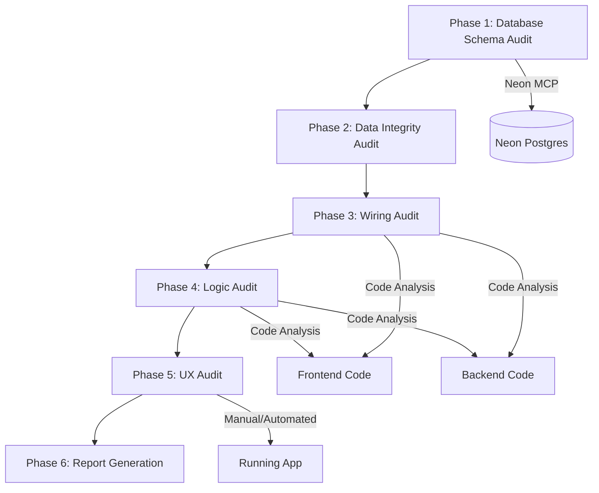
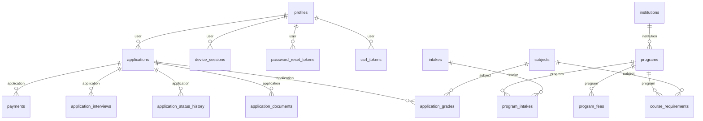

# Design — Pre-Launch Audit

## Overview

This design describes a systematic, multi-phase audit of the MIHAS platform before production launch. The audit is not a traditional feature implementation — it is an inspection process that produces a structured report of issues categorized by severity. The "components" described here (Schema_Validator, Flow_Verifier, Logic_Analyzer, UX_Evaluator) are audit procedures, not runtime services. Each procedure follows a defined inspection protocol, uses specific tools (Neon MCP for live schema, grep/AST analysis for code, manual trace for UX), and outputs findings into a unified audit report.

The audit covers 14 requirement areas across 4 domains:
- **Database layer**: Schema integrity (Req 1) and data referential consistency (Req 2)
- **Wiring layer**: Frontend→Backend→DB tracing (Req 3), wizard flow (Req 4), jobs-ops readiness (Req 13)
- **Logic layer**: Auth/security (Req 5), payment (Req 6), business logic (Req 7), dead code (Req 8), error handling (Req 9), performance (Req 12)
- **UX layer**: Student flows (Req 10), admin flows (Req 11)
- **Report**: Structured output (Req 14)

Cross-reference: The `go-live-polish` spec addressed 15 specific bugs. This audit verifies those fixes held and identifies any remaining or new issues.

## Architecture

The audit follows a layered inspection architecture where each layer builds on findings from the layer below:



**Phase ordering rationale**: Schema issues can cause wiring failures, wiring failures can mask logic bugs, and logic bugs can manifest as UX problems. Auditing bottom-up ensures we don't chase symptoms of lower-layer issues.

### Tooling

| Tool | Purpose | Used In |
|------|---------|---------|
| Neon MCP | Query live database schema (`information_schema`, `pg_catalog`) | Phase 1, 2 |
| grep/ripgrep | Search codebase for patterns, imports, dead code markers | Phase 3, 4, 8 |
| AST analysis (readCode) | Trace function signatures, class hierarchies, imports | Phase 3, 4 |
| Django `manage.py check` | Validate Django system checks | Phase 1 |
| `bun run build:admissions` | Verify frontend builds without errors | Phase 3 |
| `bun run type-check:jobs-ops` | Verify jobs-ops type safety | Phase 13 |
| `pytest` | Run existing test suites to verify no regressions | Phase 4 |
| Manual trace / Stagehand | UX flow verification | Phase 5 |


## Components and Interfaces

### Schema_Validator (Phase 1 & 2)

**Purpose**: Compare Django ORM model definitions against live Neon Postgres schema and verify data referential integrity.

**Inspection Protocol**:

1. **Table existence check**: For each Django model with `managed = False`, query `information_schema.tables` via Neon MCP to confirm the table exists.

2. **Column comparison**: For each model field, query `information_schema.columns` for the corresponding table and compare:
   - Column name (Django `db_column` or field name)
   - Data type mapping (e.g., `CharField` → `character varying` or `text`, `UUIDField` → `uuid`, `IntegerField` → `integer` or `bigint`)
   - Nullability (`null=True` → `is_nullable = 'YES'`)
   - Default values where specified

3. **Constraint verification**: Query `information_schema.table_constraints` and `information_schema.key_column_usage` to verify:
   - Foreign key constraints match Django `ForeignKey` fields
   - Unique constraints match `unique=True` and `unique_together`
   - Primary key constraints match model PKs

4. **Unmapped table detection**: Query all tables in the `public` schema and diff against Django model `db_table` values to find orphaned tables.

5. **Enrollment sync check**: Run SQL to compare `program_intakes.current_enrollment` against `COUNT(*)` of submitted applications per program+intake.

6. **Type mismatch severity classification**:
   - **Breaking**: Type incompatibility that would cause runtime errors (e.g., `integer` column mapped to `UUIDField`)
   - **Cosmetic**: Compatible but imprecise mapping (e.g., `CharField(max_length=255)` mapped to `text`)

**Django models to inspect** (all `managed = False`):

| App | Models | Tables |
|-----|--------|--------|
| `accounts` | `Profile`, `DeviceSession`, `LoginAttempt`, `PasswordResetToken`, `CSRFToken`, `UserPermissionOverride` | `profiles`, `device_sessions`, `login_attempts`, `password_reset_tokens`, `csrf_tokens`, `user_permission_overrides` |
| `applications` | `Application`, `ApplicationStatusHistory`, `ApplicationDraft`, `ApplicationInterview` | `applications`, `application_status_history`, `application_drafts`, `application_interviews` |
| `catalog` | `Institution`, `Program`, `Intake`, `ProgramIntake`, `Subject`, `CourseRequirement` | `institutions`, `programs`, `intakes`, `program_intakes`, `subjects`, `course_requirements` |
| `documents` | `ApplicationDocument`, `ApplicationGrade`, `Payment`, `ProgramFee`, `WebhookEventLog` | `application_documents`, `application_grades`, `payments`, `program_fees`, `webhook_event_logs` |
| `common` | `AuditLog`, `Notification`, `ErrorLog`, `EmailQueue` | `audit_logs`, `notifications`, `error_logs`, `email_queue` |

**Data integrity queries** (Phase 2):

```sql
-- Orphaned applications (user doesn't exist)
SELECT a.id FROM applications a LEFT JOIN profiles p ON a.user = p.id WHERE p.id IS NULL;

-- Payment amount vs program_fees mismatch
SELECT p.id, p.amount, pf.amount AS expected
FROM payments p
JOIN applications a ON p.application_id = a.id
JOIN program_fees pf ON a.program = pf.program_id::text AND pf.fee_type = 'application'
WHERE p.amount != pf.amount;

-- Payment status consistency
SELECT a.id, a.payment_status
FROM applications a
WHERE a.payment_status IN ('verified', 'paid', 'force_approved')
AND NOT EXISTS (SELECT 1 FROM payments p WHERE p.application_id = a.id AND p.status = 'successful');

-- Status history chain validation
SELECT ash.application_id, ash.old_status, ash.new_status
FROM application_status_history ash
WHERE (ash.old_status, ash.new_status) NOT IN (
  ('draft', 'submitted'), ('submitted', 'under_review'),
  ('submitted', 'approved'), ('submitted', 'rejected'),
  ('under_review', 'approved'), ('under_review', 'rejected'), ('under_review', 'waitlisted'),
  ('waitlisted', 'approved'), ('waitlisted', 'rejected')
);

-- Program fees coverage
SELECT p.code FROM programs p
WHERE p.is_active = true
AND NOT EXISTS (SELECT 1 FROM program_fees pf WHERE pf.program_id = p.id AND pf.residency_category = 'local' AND pf.fee_type = 'application')
OR NOT EXISTS (SELECT 1 FROM program_fees pf WHERE pf.program_id = p.id AND pf.residency_category = 'international' AND pf.fee_type = 'application');
```

### Flow_Verifier (Phase 3)

**Purpose**: Trace every frontend API call to a registered backend endpoint and verify the endpoint is fully implemented.

**Inspection Protocol**:

1. **Frontend service module scan**: For each service file in `apps/admissions/src/services/` and `apps/admissions/src/services/admin/`, extract all API call patterns (URLs passed to `apiClient.request`, `apiClient.get`, `apiClient.post`, etc.).

2. **URL pattern matching**: Compare extracted URLs against `backend/config/urls.py` and all included app `urls.py` files. Flag any frontend URL that doesn't match a registered pattern.

3. **View implementation check**: For each matched URL pattern, verify the view class has real method handlers (`get`, `post`, `put`, `patch`, `delete`) — not empty stubs or `pass` bodies.

4. **Serializer field validation**: For each serializer used in a view, verify every field maps to a model field or is an annotated/computed field with a `get_<field>` method or `SerializerMethodField`.

5. **Pagination envelope check**: For list endpoints, verify the view uses `StandardPagination` from `backend/apps/common/pagination.py` and returns the `{page, pageSize, totalCount, results}` envelope.

6. **Jobs-ops wiring**: Repeat steps 1-2 for `apps/jobs-ops/src/services/api/` modules.

7. **Admin auth check**: For endpoints in `apps/admissions/src/services/admin/`, verify the backend view uses `IsAdminOrSuperAdmin` permission class.

**Frontend service modules to trace**:

| Module | Expected Backend Routes |
|--------|------------------------|
| `applications.ts` | `/api/v1/applications/` (CRUD, submit, details, interviews) |
| `auth.ts` | `/api/v1/auth/` (login, register, verify, profile, password reset) |
| `catalog.ts` | `/api/v1/catalog/` (programs, intakes, subjects) |
| `documents.ts` | `/api/v1/documents/` (upload, list, signed URL) |
| `interviews.ts` | `/api/v1/applications/interviews/` |
| `notifications.ts` | `/api/v1/notifications/` |
| `sessionService.ts` | `/api/v1/sessions/`, `/api/v1/auth/session/` |
| `admin/dashboard.ts` | `/api/v1/admin/dashboard/`, `/api/v1/admin/audit-trail/` |
| `admin/audit.ts` | `/api/v1/admin/audit-trail/` |
| `admin/users.ts` | `/api/v1/admin/users/` |

### Logic_Analyzer (Phase 4)

**Purpose**: Verify business logic consistency, security posture, payment integrity, error handling, and performance patterns.

**Sub-procedures**:

**4a. Auth & Security** (Req 5):
- Read `JWTAuthenticationMiddleware` and verify token extraction from HTTP-only cookies, expiry check, signature validation
- Read `CSRFEnforcementMiddleware` and verify exempt paths match unauthenticated endpoints (webhook, error report, health)
- Read `SecurityHeadersMiddleware` and verify all 6 required headers are set
- Read `PasswordResetToken` consumption logic and verify `used_at` is set
- Read `RateLimitMiddleware` and verify rate configs for login, register, password reset, error report
- Read `DeviceSession` creation/invalidation in login/logout views

**4b. Payment** (Req 6):
- Trace `PaymentService.initiate_payment()` → `payments` record creation → Lenco reference generation
- Trace `PaymentService.verify_payment()` → Lenco API call → forward-only status transitions
- Trace `WebhookProcessor` → HMAC-SHA512 validation → `webhook_event_logs` → delegation
- Trace `poll_pending_payments_task` → stale payment identification → Lenco verification
- Trace admin override path in `ApplicationReviewView` → `force_approved` status
- Trace `FeeResolver` → `program_fees` lookup → local/international coverage

**4c. Business Logic Consistency** (Req 7):
- Compare `ALLOWED_TRANSITIONS` in `services.py` against frontend `applicationStateMachine.ts`
- Compare `DuplicateChecker.NON_TERMINAL_STATUSES` against frontend `duplicateApplicationCheck.ts`
- Compare `IntakeEnforcer` logic against any frontend intake validation
- Verify `EligibilityEngine` is advisory-only (doesn't raise blocking errors in submit path)
- Compare `normalizePaymentStatus()` / `isPaymentVerified()` against backend payment status values
- Compare `gradeValidation.ts` ECZ scale against `CourseRequirement.minimum_grade`

**4d. Dead Code** (Req 8):
- Scan for unused imports/exports in frontend via `grep` for exported symbols not imported elsewhere
- Scan for backend views/serializers not referenced in any `urls.py`
- Scan for `TODO`, `FIXME`, `HACK`, `XXX` comments
- Scan for placeholder content ("Coming Soon", stub components)
- Identify seed-data-only endpoints (jobs-ops views returning `jobs_ops_seed.py` data)
- Verify `ApplicationDraft` model is documented as deprecated and not used in critical paths

**4e. Error Handling** (Req 9):
- Verify `envelope_exception_handler` catches DRF exceptions and creates `ErrorLog` records
- Verify `errorReporter.ts` captures `window.onerror` and `unhandledrejection`
- Scan frontend API calls for missing error handling (no `.catch()` or try/catch)
- Verify SSE client has rapid-failure detection (go-live-polish Fix 15)
- Verify Celery tasks have retry configuration

**4f. Performance** (Req 12):
- Scan for N+1 patterns: queryset access in loops without `select_related`/`prefetch_related`
- Verify frontend lazy-loading of heavy dependencies (PDF libs, chart libs)
- Check high-traffic endpoint querysets for index usage
- Verify `keep_alive_ping_task` is configured in Celery Beat
- Scan for synchronous blocking calls in ASGI path

### UX_Evaluator (Phase 5)

**Purpose**: Verify user experience quality across student and admin flows.

**Inspection Protocol**:

For each flow, the evaluator traces the component tree, verifies data binding to backend responses, and checks for loading states, error states, empty states, and mobile responsiveness.

**Student flows** (Req 10):
1. Dashboard: `Dashboard.tsx` → profile completion calculation → application status display → pending actions
2. Wizard: Each step component → form validation → auto-save → back-navigation data preservation
3. Payment: `PaymentStep.tsx` → fee display → Lenco widget → status polling → success/failure
4. Status tracking: `ApplicationStatus.tsx` → status timeline → admin feedback display
5. Interviews: `Interview.tsx` → scheduled interviews → empty state handling
6. Notifications: `NotificationSettings.tsx` → preference management → persistence

**Admin flows** (Req 11):
1. Dashboard: Admin dashboard → statistics accuracy → activity feed (go-live-polish Fix 12)
2. Review: Application review → full details → documents → grades → payment → decision submission
3. Applications list: Filtering → search → pagination
4. Intake management: `Intakes.tsx` → capacity display → enrollment counts
5. Program fees: `ProgramFees.tsx` → fee editing → residency categories
6. Audit trail: `AuditTrail.tsx` → human-readable entries (go-live-polish Fix 12)
7. Capacity warning: Approval near capacity → warning display (go-live-polish Fix 6)


## Data Models

The audit does not introduce new runtime data models. Instead, it produces a structured audit report as a markdown document. The report schema is:

### Audit Report Structure

```
audit-report.md
├── Summary
│   ├── Issue counts by severity (blocker, critical, warning, info)
│   └── Issue counts by domain
├── Domain Sections (one per audit area)
│   ├── Schema Integrity
│   ├── Data Integrity
│   ├── End-to-End Wiring
│   ├── Application Wizard
│   ├── Authentication & Security
│   ├── Payment Flow
│   ├── Business Logic
│   ├── Dead Code
│   ├── Error Handling
│   ├── Student UX
│   ├── Admin UX
│   ├── Performance
│   └── Jobs-Ops Readiness
├── Go-Live-Polish Regression Check
│   └── Status of each fix from go-live-polish spec
└── Launch Readiness Verdict
```

### Issue Record Format

Each issue in the report follows this structure:

| Field | Type | Description |
|-------|------|-------------|
| `id` | string | `{domain}-{number}` (e.g., `SCHEMA-001`) |
| `severity` | enum | `blocker`, `critical`, `warning`, `info` |
| `domain` | string | Audit domain name |
| `description` | string | What the problem is |
| `affected` | string[] | File paths or table names |
| `expected` | string | What correct behavior looks like |
| `recommendation` | string | Suggested fix |
| `go_live_polish_ref` | string? | Reference to go-live-polish fix if applicable |

### Severity Classification

| Severity | Criteria | Example |
|----------|----------|---------|
| `blocker` | Prevents core flow from working; data loss risk; security vulnerability | Missing FK constraint causing orphaned payments; auth bypass |
| `critical` | Degrades experience significantly; incorrect business logic | Wrong fee returned for international students; broken status transitions |
| `warning` | Non-blocking but should fix soon | Dead code in production bundle; missing loading states |
| `info` | Improvement opportunity | Cosmetic type mismatch; unused index |

### Database Tables Inspected

All tables with Django models (`managed = False`):



### Go-Live-Polish Cross-Reference

The audit must verify the status of all 15 fixes from the `go-live-polish` spec:

| Fix | Description | Verification Method |
|-----|-------------|---------------------|
| 1 | `test_admin_override.py` uses `TransactionTestCase` | Run test suite |
| 2 | International program fees seeded | Query `program_fees` via Neon MCP |
| 3 | Notification on approval/rejection | Code trace of `ApplicationReviewView.post()` |
| 4 | `ApplicationDraft` deprecated | Verify docstring and no active usage |
| 5 | Keep-alive ping task | Verify in `CELERY_BEAT_SCHEDULE` |
| 6 | Intake capacity in review response | Code trace of review endpoint response |
| 7 | `program_intakes.current_enrollment` sync | Code trace of `IntakeEnforcer.sync_enrollment()` |
| 8 | Lazy-load vendor-pdf | Verify dynamic imports in admissions bundle |
| 9 | CSRF token cleanup task | Verify in `CELERY_BEAT_SCHEDULE` |
| 10 | Slip upload for non-draft apps | Code trace of `DocumentUploadView.post()` |
| 11 | `approved` removed from `NON_TERMINAL_STATUSES` | Code trace of `duplicate_checker.py` |
| 12 | Human-readable activity feed | Code trace of `normalizeRecentActivity()` |
| 13 | `first_name`/`last_name` in `ProfileReadSerializer` | Code trace of serializer fields |
| 14 | 404 handling in draft deletion | Code trace of `applicationService.delete()` |
| 15 | SSE rapid-failure detection | Code trace of `sseClient.ts` |


## Correctness Properties

*A property is a characteristic or behavior that should hold true across all valid executions of a system — essentially, a formal statement about what the system should do. Properties serve as the bridge between human-readable specifications and machine-verifiable correctness guarantees.*

Since this is an audit spec, the correctness properties below define what "correct" looks like for the platform being audited. These properties are the formal criteria the audit checks against. Many are verifiable via automated property-based tests against the existing codebase; others are verified by SQL queries against the live database.

### Property 1: Schema field correspondence

*For any* Django model with `managed = False` and *for any* field on that model, the corresponding Neon Postgres table column should exist with a compatible data type, matching nullability, and matching constraint declarations (unique, foreign key, primary key).

**Validates: Requirements 1.1, 1.2, 1.3, 1.4**

### Property 2: Enrollment count accuracy

*For any* program+intake combination in `program_intakes`, the `current_enrollment` value should equal the count of `applications` with `status` in `('submitted', 'under_review', 'approved', 'waitlisted')` for that program and intake.

**Validates: Requirements 1.6**

### Property 3: Type mismatch severity is deterministic

*For any* pair of (Django field type, Postgres column type), the severity classification function should return a consistent result: `breaking` if the types are incompatible at runtime, `cosmetic` if they are compatible but imprecise, or `match` if they are equivalent.

**Validates: Requirements 1.7**

### Property 4: Referential integrity across child tables

*For any* record in a child table (`applications`, `application_documents`, `application_grades`, `payments`, `application_status_history`, `application_interviews`), the parent foreign key should reference an existing row in the parent table.

**Validates: Requirements 2.1, 2.2**

### Property 5: Payment amount matches program fee

*For any* payment record linked to an application, the payment `amount` should equal the `program_fees.amount` for the application's program code and the student's residency category (`local` or `international`) with `fee_type = 'application'`.

**Validates: Requirements 2.3**

### Property 6: Payment status implies payment record

*For any* application where `payment_status` is `verified`, `paid`, or `force_approved`, there should exist at least one `payments` record with `status = 'successful'` for that application.

**Validates: Requirements 2.4**

### Property 7: Status history chain validity

*For any* application, the sequence of `(old_status, new_status)` pairs in `application_status_history` (ordered by `created_at`) should contain only transitions present in `ALLOWED_TRANSITIONS`: `draft→submitted`, `submitted→{under_review, approved, rejected}`, `under_review→{approved, rejected, waitlisted}`, `waitlisted→{approved, rejected}`.

**Validates: Requirements 2.5**

### Property 8: Program fee coverage

*For any* active program (where `is_active = true`), the `program_fees` table should contain at least one row with `residency_category = 'local'` and `fee_type = 'application'`, and at least one row with `residency_category = 'international'` and `fee_type = 'application'`.

**Validates: Requirements 2.6**

### Property 9: Frontend API calls map to backend endpoints

*For any* API URL extracted from frontend service modules (`apps/admissions/src/services/` and `apps/jobs-ops/src/services/api/`), there should exist a matching URL pattern in the backend URL configuration (`backend/config/urls.py` and included app URL files).

**Validates: Requirements 3.1, 3.5, 13.2**

### Property 10: Backend views have real implementations

*For any* URL pattern registered in the backend, the corresponding view class should have at least one HTTP method handler (`get`, `post`, `put`, `patch`, `delete`) with a non-trivial implementation (not just `pass` or an empty body).

**Validates: Requirements 3.2**

### Property 11: Serializer fields map to model fields

*For any* serializer used in a backend view, every field declared in `Meta.fields` should either correspond to a model field on the serializer's `Meta.model`, be a `SerializerMethodField`, or be an annotated queryset column.

**Validates: Requirements 3.3**

### Property 12: Paginated endpoints use standard envelope

*For any* backend list view that returns paginated data, the view should use `StandardPagination` and the response should conform to the `{page, pageSize, totalCount, results}` envelope structure.

**Validates: Requirements 3.4**

### Property 13: Admin endpoints require admin authentication

*For any* backend endpoint called by admin service modules (`apps/admissions/src/services/admin/`), the view's `permission_classes` should include `IsAdminOrSuperAdmin` or equivalent admin-level permission.

**Validates: Requirements 3.7, 13.4**

### Property 14: FeeResolver returns correct fees

*For any* active program and *for any* residency category (`local` or `international`), `FeeResolver.resolve()` should return the fee amount matching the `program_fees` row for that program, residency, and `fee_type = 'application'`. If no fee row exists, it should raise an error.

**Validates: Requirements 4.3, 6.6**

### Property 15: Payment status transitions are forward-only

*For any* payment record, `PaymentService.verify_payment()` should only allow forward transitions: `pending→successful` or `pending→failed`. Transitions from `successful` or `failed` to any other status should be rejected.

**Validates: Requirements 4.4, 6.2**

### Property 16: Submission gates are enforced

*For any* application submission attempt via `POST /api/v1/applications/{id}/submit/`, the endpoint should reject the submission if any of these conditions are not met: payment completed, identity document uploaded, intake deadline not passed, intake capacity not exceeded, no duplicate submitted application.

**Validates: Requirements 4.5**

### Property 17: JWT middleware validates tokens correctly

*For any* HTTP request with a JWT token in the cookie, `JWTAuthenticationMiddleware` should: accept the request if the token has a valid signature and is not expired, reject with 401 if the token is expired, and reject with 401 if the token signature is invalid.

**Validates: Requirements 5.1**

### Property 18: CSRF enforcement on state-changing requests

*For any* authenticated endpoint receiving a state-changing request (POST, PUT, PATCH, DELETE), `CSRFEnforcementMiddleware` should require a valid CSRF token. *For any* unauthenticated endpoint (webhook, error report, health check), CSRF should be exempt.

**Validates: Requirements 5.2**

### Property 19: Security headers present on all responses

*For any* HTTP response from the backend, `SecurityHeadersMiddleware` should set all of: `X-Content-Type-Options`, `X-Frame-Options`, `X-XSS-Protection`, `Referrer-Policy`, `Strict-Transport-Security`, and `Content-Security-Policy`.

**Validates: Requirements 5.3**

### Property 20: Password reset tokens are single-use

*For any* password reset token, consuming it should set `used_at` to a non-null timestamp. Attempting to consume the same token again should fail. Attempting to consume an expired token should fail.

**Validates: Requirements 5.4**

### Property 21: Rate limiting enforced on sensitive endpoints

*For any* rate-limited endpoint (login, registration, password reset, error reporting), sending requests exceeding the configured rate should result in a 429 response.

**Validates: Requirements 5.5**

### Property 22: Device session lifecycle

*For any* successful login, a `DeviceSession` record should be created with `is_active = True`. *For any* logout, the corresponding `DeviceSession` should have `is_active` set to `False`.

**Validates: Requirements 5.6**

### Property 23: Payment initiation creates pending record

*For any* call to `PaymentService.initiate_payment()` with valid parameters, a `payments` record should be created with `status = 'pending'`, a non-null `lenco_reference`, and the correct `amount` and `currency`.

**Validates: Requirements 6.1**

### Property 24: Webhook signature validation

*For any* incoming webhook payload, `WebhookProcessor` should compute the HMAC-SHA512 signature and compare it against the provided signature header. Valid signatures should result in processing; invalid signatures should result in logging the event with `signature_valid = False` and returning a 400 response.

**Validates: Requirements 6.3**

### Property 25: Stale payment polling window

*For any* payment with `status = 'pending'`, `poll_pending_payments_task` should select it for verification if and only if `created_at` is older than 5 minutes and younger than 24 hours.

**Validates: Requirements 6.4**

### Property 26: Admin payment override recording

*For any* admin payment override via the review endpoint, the `applications.payment_status` should be set to `force_approved` and the admin's identity should be recorded on the application.

**Validates: Requirements 6.5**

### Property 27: Duplicate checker distinguishes create-time and submit-time

*For any* user, program, and intake combination, `DuplicateChecker.check_at_create()` should block if a non-terminal application exists (using `NON_TERMINAL_STATUSES` which excludes `approved`), and `DuplicateChecker.check_at_submit()` should block if a submitted application exists (using `SUBMITTED_STATUSES`).

**Validates: Requirements 7.2**

### Property 28: Intake enforcer checks and syncs correctly

*For any* intake, `IntakeEnforcer.check_submission()` should reject if the deadline has passed, the intake is not yet open, or capacity is exceeded. *For any* successful enrollment sync, both `intakes.current_enrollment` and `program_intakes.current_enrollment` should be updated.

**Validates: Requirements 7.3**

### Property 29: Payment status normalization handles all backend values

*For any* backend payment status value (`pending`, `successful`, `failed`, `verified`, `paid`, `force_approved`, `null`), the frontend `normalizePaymentStatus()` should return a valid display status, and `isPaymentVerified()` should return `true` for `verified`, `paid`, `successful`, and `force_approved`.

**Validates: Requirements 7.5**

### Property 30: Grade validation consistency

*For any* grade value, the frontend `gradeValidation.ts` ECZ validation (1-9 scale, lower is better) should agree with the backend `CourseRequirement.minimum_grade` comparison on whether the grade meets the requirement.

**Validates: Requirements 7.6**

### Property 31: Exception handler creates ErrorLog

*For any* unhandled DRF exception, `envelope_exception_handler` should create an `ErrorLog` record with the exception details and return a structured error response.

**Validates: Requirements 9.1**

### Property 32: Frontend API calls have error handling

*For any* frontend API call (via `apiClient`), there should be error handling that addresses at minimum 401/403 (auth failure), 404 (not found), and 500 (server error) responses with user-facing feedback.

**Validates: Requirements 9.3**

### Property 33: Celery tasks have retry configuration

*For any* Celery task that performs network I/O or database operations, the task should be configured with `autoretry_for` or explicit retry logic for transient failures.

**Validates: Requirements 9.5**

### Property 34: No N+1 query patterns in views

*For any* backend view that accesses related objects (via ForeignKey or reverse relations), the queryset should use `select_related()` or `prefetch_related()` to avoid N+1 query patterns.

**Validates: Requirements 12.1**

### Property 35: High-traffic queries use indexes

*For any* database query on high-traffic endpoints (application list, dashboard, catalog), the query should use indexed columns for filtering and ordering, and pagination should limit result set size.

**Validates: Requirements 12.3, 12.5**

### Property 36: No synchronous blocking in ASGI path

*For any* view in the ASGI request path, there should be no synchronous blocking operations (e.g., `requests.get()`, `time.sleep()`, synchronous file I/O) that could degrade throughput under concurrent load.

**Validates: Requirements 12.7**

### Property 37: Audit report structure completeness

*For any* issue in the audit report, the issue record should contain all required fields: `id`, `severity` (one of `blocker`, `critical`, `warning`, `info`), `domain`, `description`, `affected`, `expected`, and `recommendation`. Issues should be grouped by domain.

**Validates: Requirements 14.1, 14.2, 14.3**

### Property 38: Go-live-polish regression detection

*For any* issue found during the audit that corresponds to a fix in the `go-live-polish` spec (Fixes 1-15), the issue should be flagged with a `go_live_polish_ref` indicating which fix has regressed.

**Validates: Requirements 14.5**


## Error Handling

Since this is an audit spec (not a runtime feature), error handling refers to how the audit process itself handles failures:

### Audit Process Errors

| Error Scenario | Handling |
|----------------|----------|
| Neon MCP connection failure | Log the failure, skip database-layer checks, mark Schema Integrity and Data Integrity domains as `SKIPPED` in the report |
| Django model import failure | Log the specific model, continue with remaining models, flag as `blocker` in report |
| Frontend build failure | Capture build output, flag as `blocker`, continue with code-level analysis |
| Backend test failure | Capture test output, flag failures by severity (existing test regression = `blocker`, new test failure = `critical`) |
| File not found during code trace | Log the missing file, flag as `warning` (possible dead reference), continue |
| Timeout during Neon MCP query | Retry once with increased timeout, then skip and mark as `SKIPPED` |

### Severity Escalation Rules

- Any issue that was fixed in `go-live-polish` but has regressed is automatically escalated to `blocker`
- Any security-related finding (auth bypass, missing CSRF, missing headers) is minimum `critical`
- Any data integrity issue affecting the `applications` or `payments` tables is minimum `critical`
- Dead code and cosmetic issues default to `warning` or `info`

## Testing Strategy

### Dual Testing Approach

The audit uses both unit tests and property-based tests to verify platform correctness:

- **Unit tests**: Verify specific examples, edge cases, and integration points (e.g., "the admin dashboard endpoint returns the expected fields", "the SSE client has rapid-failure detection")
- **Property tests**: Verify universal properties across generated inputs (e.g., "for any Django model field, the DB column type is compatible", "for any payment, forward-only transitions are enforced")

### Property-Based Testing Configuration

- **Library**: `hypothesis` (Python, backend) and `fast-check` (TypeScript, frontend)
- **Minimum iterations**: 100 per property test
- **Tag format**: `Feature: pre-launch-audit, Property {number}: {property_text}`
- Each correctness property from the design is implemented by a single property-based test
- Property tests should be placed in:
  - `backend/tests/property/` for backend properties
  - `apps/admissions/tests/` for frontend properties

### Test Categories

**Database layer properties** (Properties 1-8): Verified via SQL queries against Neon MCP. These are not traditional property-based tests but rather data integrity assertions run against the live database. Each query either returns an empty result set (pass) or returns violating rows (fail with specific examples).

**Wiring properties** (Properties 9-13): Verified via static code analysis. Extract API URLs from frontend code, extract URL patterns from backend code, and verify the mapping. Can be implemented as property tests that generate from the set of all frontend API calls and check each against the backend URL registry.

**Logic properties** (Properties 14-36): Mix of property-based tests (e.g., FeeResolver, payment transitions, JWT validation, duplicate checker) and unit tests (e.g., specific middleware behavior, specific error handling paths). The property tests generate random valid inputs and verify the property holds.

**Report properties** (Properties 37-38): Verified by checking the structure of the generated audit report. Can be implemented as property tests that generate random issue records and verify they conform to the required schema.

### Existing Test Suites

The audit should first run all existing test suites to establish a baseline:

- `cd backend && python3 -m pytest tests/unit/ -q` (168 existing tests)
- `cd backend && python3 -m pytest tests/property/ -q` (existing property tests)
- `bun run build:admissions` (frontend build verification)
- `bun run type-check:jobs-ops` (jobs-ops type safety)
- `bun run lint:admissions` and `bun run lint:jobs-ops` (linting)

Any failures in existing tests are flagged as `blocker` issues in the audit report.

### Go-Live-Polish Regression Tests

Each of the 15 go-live-polish fixes should have a targeted verification:

| Fix | Verification |
|-----|-------------|
| 1-9 | Run existing backend tests that cover these fixes |
| 10 | Unit test: upload `application_slip` for non-draft application returns 200 |
| 11 | Property test: `approved` not in `NON_TERMINAL_STATUSES` |
| 12 | Unit test: `normalizeRecentActivity()` returns human-readable messages |
| 13 | Unit test: `ProfileReadSerializer` includes `first_name` and `last_name` |
| 14 | Unit test: `applicationService.delete()` treats 404 as success |
| 15 | Unit test: SSE client has rapid-failure counter and polling fallback |
