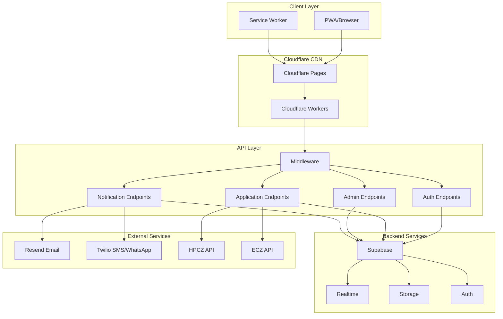
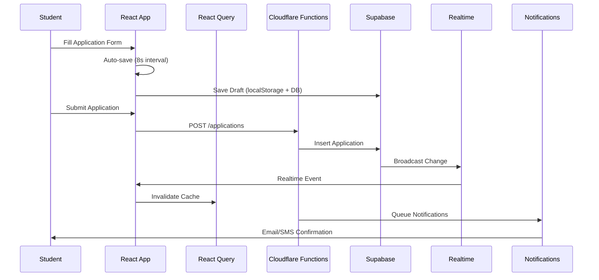
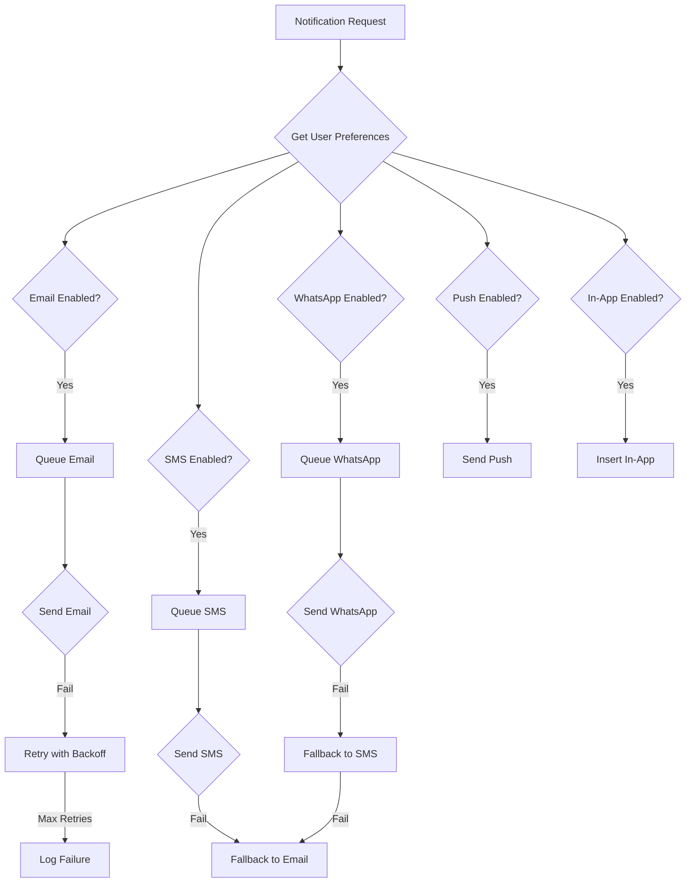
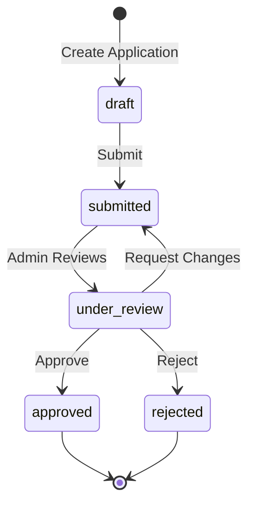
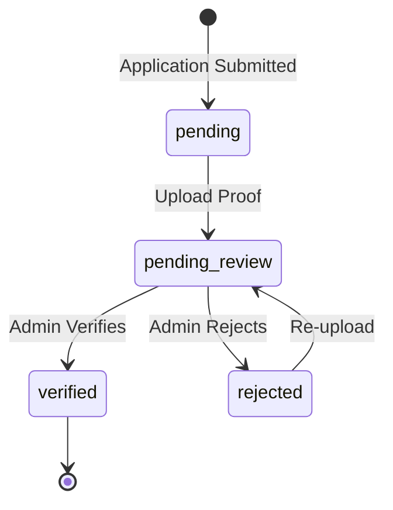
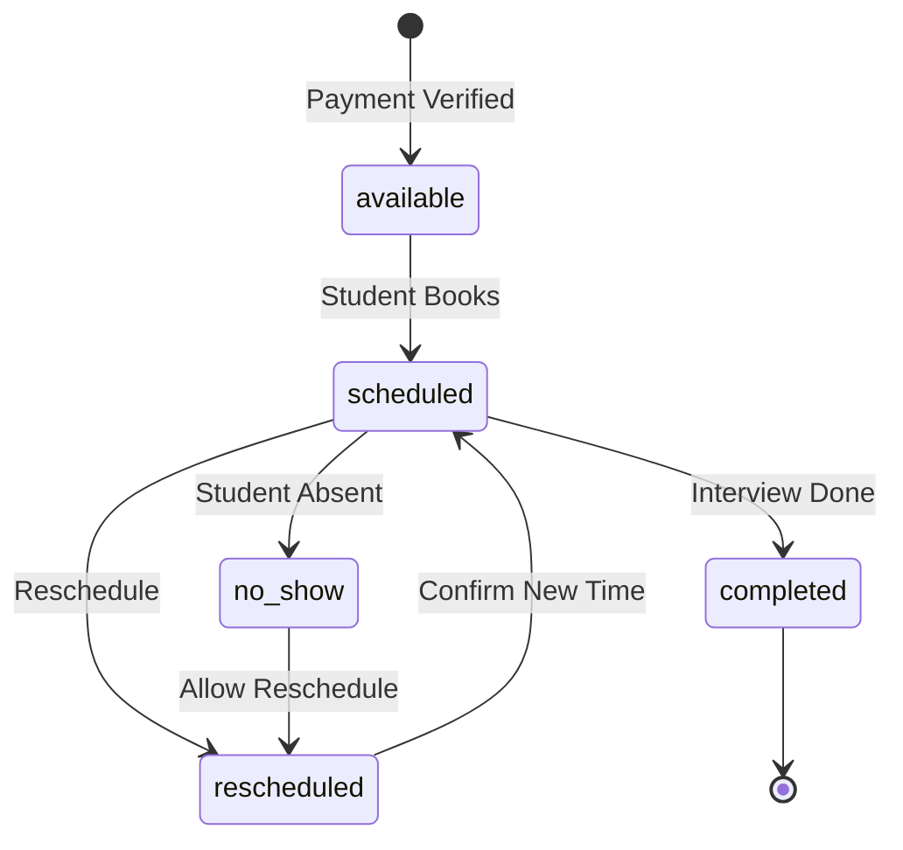

# Design Document: Production Readiness Audit

## Overview

This design document outlines the comprehensive audit and remediation plan for the MIHAS Application System to ensure production readiness. The audit covers database security, API endpoints, user flows, performance, and system resilience.

The implementation follows a systematic approach:
1. Database schema audit and RLS policy verification
2. API endpoint security hardening
3. User flow completion verification
4. Performance optimization
5. Error handling and resilience improvements
6. Real-time functionality verification

## Architecture

### System Architecture Overview



### Data Flow for Application Submission



## Components and Interfaces

### 1. Database Security Layer

**Tables Requiring RLS Audit:**

| Table | Owner Column | Admin Access | Service Role |
|-------|--------------|--------------|--------------|
| profiles | id (auth.uid()) | Read all | Full |
| applications | user_id | Full | Full |
| application_documents | via applications.user_id | Full | Full |
| payments | via applications.user_id | Full | Full |
| in_app_notifications | user_id | Insert | Full |
| device_sessions | user_id | None | Full |
| audit_trail | N/A | Read only | Insert only |
| email_queue | N/A | None | Full |
| notification_preferences | user_id | Read | Full |

**RLS Policy Pattern:**

```sql
-- Student self-access pattern
CREATE POLICY "Users can access own data"
ON table_name FOR ALL
USING (auth.uid() = user_id);

-- Admin access pattern
CREATE POLICY "Admins can access all data"
ON table_name FOR ALL
USING (
  EXISTS (
    SELECT 1 FROM profiles 
    WHERE profiles.id = auth.uid() 
    AND profiles.role IN ('admin', 'super_admin')
  )
);

-- Cascading ownership pattern (for documents)
CREATE POLICY "Users can access own documents"
ON application_documents FOR ALL
USING (
  EXISTS (
    SELECT 1 FROM applications 
    WHERE applications.id = application_documents.application_id 
    AND applications.user_id = auth.uid()
  )
);
```

### 2. API Security Layer

**Middleware Security Headers:**

```javascript
const securityHeaders = {
  'Content-Security-Policy': "default-src 'self'; script-src 'self' 'unsafe-inline'; style-src 'self' 'unsafe-inline'; img-src 'self' data: https:; connect-src 'self' https://*.supabase.co wss://*.supabase.co",
  'Strict-Transport-Security': 'max-age=31536000; includeSubDomains',
  'X-Content-Type-Options': 'nosniff',
  'X-Frame-Options': 'DENY',
  'X-XSS-Protection': '1; mode=block',
  'Referrer-Policy': 'strict-origin-when-cross-origin',
  'Cross-Origin-Opener-Policy': 'same-origin'
};
```

**Authentication Middleware Pattern:**

```javascript
async function validateAuth(request, env) {
  const authHeader = request.headers.get('Authorization');
  if (!authHeader?.startsWith('Bearer ')) {
    return { error: 'Missing or invalid authorization header', status: 401 };
  }
  
  const token = authHeader.substring(7);
  const { data: { user }, error } = await supabase.auth.getUser(token);
  
  if (error || !user) {
    return { error: 'Invalid or expired token', status: 401 };
  }
  
  return { user };
}
```

### 3. Notification System

**Multi-Channel Dispatch Flow:**



### 4. Real-time Subscription Manager

**Subscription Configuration:**

```typescript
interface RealtimeConfig {
  tables: {
    applications: {
      events: ['INSERT', 'UPDATE'],
      filter: 'user_id=eq.{userId}' // For students
    },
    payments: {
      events: ['INSERT', 'UPDATE'],
      filter: 'application_id=in.({applicationIds})'
    },
    in_app_notifications: {
      events: ['INSERT'],
      filter: 'user_id=eq.{userId}'
    }
  },
  fallbackPollingInterval: 30000, // 30 seconds
  debounceInterval: 500, // 500ms between cache invalidations
  reconnectBackoff: {
    initial: 1000,
    max: 30000,
    multiplier: 2
  }
}
```

### 5. Error Boundary System

**Error Recovery Pattern:**

```typescript
interface ErrorBoundaryConfig {
  fallbackComponent: React.ComponentType<{ error: Error; retry: () => void }>;
  onError: (error: Error, errorInfo: React.ErrorInfo) => void;
  retryable: boolean;
  maxRetries: number;
}

// Error types and handling
const errorHandlers = {
  'React Error #130': {
    cause: 'Undefined component during render',
    recovery: 'Return null from component, clear cache, re-render'
  },
  'Network Error': {
    cause: 'Connection failure',
    recovery: 'Queue operation, retry with backoff'
  },
  'Auth Error': {
    cause: 'Session expired or invalid',
    recovery: 'Redirect to login with return URL'
  }
};
```

## Data Models

### Application State Machine



### Payment State Machine



### Interview State Machine



## Correctness Properties

*A property is a characteristic or behavior that should hold true across all valid executions of a system—essentially, a formal statement about what the system should do. Properties serve as the bridge between human-readable specifications and machine-verifiable correctness guarantees.*

### Property 1: Draft Round-Trip Consistency
*For any* valid application draft data, saving to localStorage/database and then restoring SHALL produce data equivalent to the original, including all form fields, selected grades, and current step.
**Validates: Requirements 1.3, 1.4**

### Property 2: Application Reference Uniqueness
*For any* set of submitted applications, all reference numbers and tracking codes SHALL be unique with no duplicates.
**Validates: Requirements 1.5**

### Property 3: Payment Gate Enforcement
*For any* application with payment_status not equal to 'verified', attempting to schedule an interview SHALL be rejected.
**Validates: Requirements 1.8, 7.1**

### Property 4: Dashboard Count Accuracy
*For any* set of applications in the database, the admin dashboard counts for each status (draft, submitted, under_review, approved, rejected) SHALL exactly match the actual database counts.
**Validates: Requirements 2.1, 2.6**

### Property 5: Audit Trail Completeness
*For any* application status change, payment status change, or admin action, an audit trail entry SHALL be created containing timestamp, user_id, action, previous_value, and new_value.
**Validates: Requirements 2.3, 10.1, 10.2, 10.3**

### Property 6: RLS Policy Enforcement
*For any* authenticated user, database queries SHALL only return rows where the user has access according to RLS policies - students see only their own data, admins see all data, and service_role has full access.
**Validates: Requirements 3.1, 3.2, 3.3, 3.5, 3.6, 3.7, 3.8, 3.9**

### Property 7: Audit Trail Immutability
*For any* audit trail entry, UPDATE and DELETE operations SHALL fail, ensuring the audit log is append-only.
**Validates: Requirements 10.5**

### Property 8: API Security Headers Presence
*For any* API response, the required security headers (CSP, HSTS, X-Content-Type-Options, X-Frame-Options) SHALL be present with correct values.
**Validates: Requirements 4.2, 4.3**

### Property 9: Authentication Enforcement
*For any* protected API endpoint, requests without valid authentication tokens SHALL receive 401 Unauthorized responses.
**Validates: Requirements 4.1, 4.8**

### Property 10: Error Response Consistency
*For any* API error, the response SHALL follow the format `{ success: false, error: string }` without exposing stack traces or internal details.
**Validates: Requirements 4.4, 11.4**

### Property 11: Notification Preference Respect
*For any* notification dispatch, the system SHALL only send via channels where the user has enabled notifications and outside quiet hours.
**Validates: Requirements 5.5**

### Property 12: Notification Retry Logic
*For any* failed email notification, the system SHALL retry with exponential backoff (delays of 1s, 2s, 4s) up to 3 attempts before marking as failed.
**Validates: Requirements 5.3, 11.2**

### Property 13: Interview Slot Uniqueness
*For any* interview slot, only one student SHALL be able to book it - concurrent booking attempts SHALL result in exactly one success.
**Validates: Requirements 7.4**

### Property 14: Offline Queue Sync
*For any* operations queued while offline, when connection is restored, all queued operations SHALL be synced to the server in order.
**Validates: Requirements 8.3, 8.5**

### Property 15: Realtime Event Propagation
*For any* database change on subscribed tables, the corresponding React Query cache SHALL be invalidated within 2 seconds, triggering a UI update.
**Validates: Requirements 12.2, 12.3, 12.8, 12.9**

### Property 16: Realtime Fallback Activation
*For any* WebSocket connection failure, the system SHALL activate polling fallback within 5 seconds and continue attempting reconnection with exponential backoff.
**Validates: Requirements 12.4, 12.6**

### Property 17: PII Exclusion from Logs
*For any* log entry (error logs, audit trails, analytics), the content SHALL NOT contain PII patterns (email addresses, phone numbers, national IDs, names in certain contexts).
**Validates: Requirements 4.9, 10.6**

### Property 18: Session Expiry Handling
*For any* expired session, the system SHALL redirect to login page with the current URL preserved as return parameter.
**Validates: Requirements 11.6**

### Property 19: External API Graceful Degradation
*For any* failure of external APIs (HPCZ, ECZ, GNC/NMCZ), the system SHALL continue operation with advisory-only eligibility status and not block the user flow.
**Validates: Requirements 11.3**

### Property 20: Debounce Timing Compliance
*For any* search input or realtime event, the debounce delay SHALL be at least 300ms for search and 500ms for cache invalidation.
**Validates: Requirements 9.5, 12.7**

## Error Handling

### Error Categories and Recovery

| Error Type | Detection | Recovery Strategy |
|------------|-----------|-------------------|
| Network Timeout | Request exceeds 30s | Retry with backoff, max 3 attempts |
| Auth Expired | 401 response | Redirect to login with return URL |
| RLS Violation | 403 response | Log error, show permission denied message |
| Validation Error | 400 response | Display field-level errors |
| Server Error | 500 response | Log error, show generic message, offer retry |
| Component Crash | Error boundary | Show fallback UI, offer retry |
| Realtime Disconnect | Channel error | Activate polling, attempt reconnect |

### Error Logging Pattern

```typescript
interface ErrorLog {
  timestamp: string;
  error_type: string;
  message: string;
  stack_trace?: string; // Only in development
  context: {
    endpoint?: string;
    user_role?: string; // Not user_id to avoid PII
    action?: string;
    request_id: string;
  };
  // Never include: email, phone, name, national_id, address
}
```

## Testing Strategy

### Unit Tests
- Test RLS policy SQL syntax and logic
- Test validation schemas (Zod)
- Test error message formatting
- Test debounce timing
- Test state machine transitions

### Property-Based Tests
Using Vitest with fast-check for property-based testing:

1. **Draft Round-Trip Test** - Generate random form data, save, restore, compare
2. **Reference Uniqueness Test** - Generate many applications, verify no duplicate references
3. **RLS Policy Test** - Generate user contexts, verify access restrictions
4. **Audit Immutability Test** - Attempt updates/deletes on audit entries
5. **Security Headers Test** - Verify all required headers present
6. **Error Response Test** - Generate errors, verify consistent format
7. **Notification Preference Test** - Generate preferences, verify dispatch respects them
8. **Retry Backoff Test** - Verify exponential backoff timing
9. **Debounce Timing Test** - Verify minimum delays are enforced

### Integration Tests
- Test complete application submission flow
- Test payment verification workflow
- Test interview scheduling with slot conflicts
- Test realtime updates across browser tabs
- Test offline queue sync on reconnection

### Configuration
- Minimum 100 iterations per property test
- Tag format: **Feature: production-readiness-audit, Property {number}: {property_text}**
- Use Vitest for unit and property tests
- Use Playwright for integration tests

