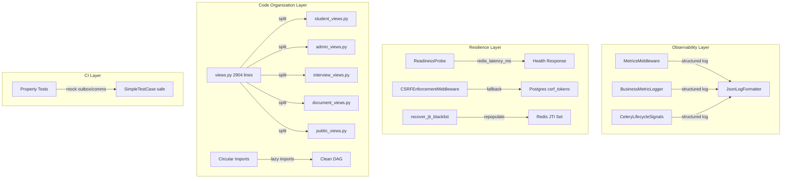

# Design Document: Production Readiness Hardening

## Overview

This design addresses 12 requirements to raise the MIHAS platform's production readiness score from 79 to 90+. The changes span six areas: CI reliability (fixing 43 failing property tests), observability (request + business + task metrics via structured logging), Redis resilience (readiness probe enhancement, JTI recovery, CSRF degradation), code organization (splitting the 2,904-line views module, breaking 6 circular import cycles), task scheduling visibility (Celery lifecycle signals, missed-task detection), and operational documentation (scaling playbook, Beat HA considerations).

All changes target the existing Django 5 + DRF backend on Python 3.12+, deployed via Uvicorn on Koyeb with Neon Postgres and Upstash Redis. No new paid services are introduced.

## Architecture

The hardening work is organized into four architectural layers:



### Middleware Stack After Changes

The `MetricsMiddleware` is inserted after `RequestIDMiddleware` (position 5.5) so `request_id` is available:

```
SecurityHeaders → Security → WhiteNoise → CORS → RequestID → MetricsMiddleware → RateLimit → Common → CSRF → Audit → ReadOnly
```

## Components and Interfaces

### 1. Property Test Fixes (Requirement 1)

**Problem:** 43 property tests extend `SimpleTestCase` but hit DB paths through `outbox.py` (`_record_outbox_event` → `OutboxEvent.objects.create`) and `CommunicationService` (`CommunicationTemplate.objects.filter`, `create_notification`, `queue_email`).

**Approach:** Add targeted `unittest.mock.patch` decorators to the affected test classes. The mocks intercept:
- `apps.common.outbox._record_outbox_event` → returns `None`
- `apps.common.outbox.create_notification` → returns a `MagicMock`
- `apps.common.outbox.queue_email` → returns a `MagicMock`
- `apps.common.communication_service.CommunicationService.send` → no-op
- `apps.common.communication_service.CommunicationService.render_template` → returns `("subject", "body")`

For tests that genuinely need DB access for correctness, upgrade from `SimpleTestCase` to `TransactionTestCase` with `@pytest.mark.django_db`.

**No production code changes.** Only test files are modified.

### 2. MetricsMiddleware (Requirement 2)

**Module:** `backend/apps/common/middleware.py` — new class `MetricsMiddleware`

```python
class MetricsMiddleware:
    SKIP_PATHS = {"/health/live/", "/health/ready/", "/health/redis/"}

    def __init__(self, get_response):
        self.get_response = get_response

    def __call__(self, request):
        if request.path in self.SKIP_PATHS:
            return self.get_response(request)
        start = time.monotonic()
        response = self.get_response(request)
        duration_ms = round((time.monotonic() - start) * 1000, 1)
        logger.info(
            "request_metric",
            extra={
                "type": "request_metric",
                "method": request.method,
                "path": request.path,
                "status_code": response.status_code,
                "duration_ms": duration_ms,
                "request_id": getattr(request, "request_id", None),
            },
        )
        return response
```

**JsonLogFormatter update:** Merge `extra` dict fields into the JSON payload so `type`, `method`, `path`, `status_code`, `duration_ms` appear as top-level keys in the log line.

**Settings change:** Insert `"apps.common.middleware.MetricsMiddleware"` after `RequestIDMiddleware` in `MIDDLEWARE`.

### 3. Business Metrics Logging (Requirement 3)

**Approach:** Add structured log emissions at existing code points — no new modules.

- **Payment completed:** In `PaymentService.verify_payment()` (or the webhook success path in `payment_service.py`), after status transitions to `successful`:
  ```python
  logger.info("business_metric", extra={"type": "business_metric", "metric": "payment_completed", "amount": str(payment.amount), "currency": payment.currency, "request_id": ...})
  ```

- **Application submitted:** In `submit_application()` in `services.py`, after successful transition:
  ```python
  logger.info("business_metric", extra={"type": "business_metric", "metric": "application_submitted", "application_id": str(app.id), "program": app.program})
  ```

- **Celery task metrics:** Handled by the lifecycle signal handler (Requirement 9), which emits `type: "task_metric"` on completion.

### 4. Enhanced Readiness Probe (Requirement 4)

**Module:** `backend/apps/common/health.py` — modify `ReadinessView`

```python
def _check_redis_with_latency(self):
    """Ping Redis and return (status_str, latency_ms)."""
    import time
    start = time.monotonic()
    try:
        from django.core.cache import cache
        cache.set("_health_ping", "1", 10)
        ok = cache.get("_health_ping") == "1"
        latency = round((time.monotonic() - start) * 1000, 1)
        if ok:
            return "ok", latency
        return "degraded", latency
    except Exception:
        latency = round((time.monotonic() - start) * 1000, 1)
        return "degraded", latency
```

Response body changes:
- Add `redis_latency_ms` field
- Redis failure returns `"degraded"` with HTTP 200 (not 503)
- HTTP 503 only when DB check fails

The 2-second timeout is enforced by the Redis client's `socket_timeout=2` already configured in the cache backend.

### 5. JTI Blacklist Recovery Command (Requirement 5)

**Module:** `backend/apps/accounts/management/commands/recover_jti_blacklist.py`

**Algorithm:**
1. Query `device_sessions` for all active sessions (`is_active=True`, `expires_at > now`)
2. For each session, the `session_token` field contains the refresh token hash — but since we store JTIs in Redis (not full tokens), we need a different approach
3. Since JTIs are generated as UUIDs embedded in JWT payloads and we don't store raw JWTs in the DB, the recovery command takes a conservative approach: it force-expires all active refresh tokens by setting `expires_at = now` on active `device_sessions`, effectively requiring all users to re-authenticate
4. Log count of sessions invalidated and expired sessions skipped
5. If Redis is unreachable, exit with code 1 and descriptive error

**Runbook:** `docs/runbooks/redis-recovery.md` documenting when to run (after Redis flush/failover), the command invocation, expected output, and impact (all users must re-login).

### 6. CSRF Graceful Degradation (Requirement 6)

**Current state:** `CSRFEnforcementMiddleware` validates CSRF tokens against the `csrf_tokens` Postgres table only. It does not use Redis at all.

**Design decision:** Since CSRF validation is already Postgres-only, Requirement 6 is already satisfied by the current implementation. The middleware will continue to work during Redis outages because it never depends on Redis.

**Enhancement:** Add a structured warning log when Redis is detected as unavailable (checked via a lightweight cache ping) so operators have visibility, even though CSRF itself is unaffected:

```python
# At the top of __call__, if Redis health is degraded, log once per minute
if self._should_log_redis_warning():
    logger.warning("redis_degraded", extra={
        "type": "csrf_redis_warning",
        "message": "Redis unavailable — CSRF validation using Postgres only",
        "request_id": getattr(request, "request_id", None),
    })
```

Use a module-level timestamp to rate-limit the warning to once per 60 seconds.

### 7. Split Applications Views Module (Requirement 7)

**Target:** `backend/apps/applications/views.py` (2,904 lines, 30 view classes)

**Split plan based on domain analysis of the existing view classes:**

| New File | View Classes | Approximate Lines |
|----------|-------------|-------------------|
| `student_views.py` | `ApplicationCreateView`, `ApplicationDraftView`, `ApplicationSubmitView`, `ApplicationTrackView`, `ApplicationWithdrawView`, `ConfirmEnrollmentView`, `AmendmentCreateView`, `WaitlistPositionView`, `ConditionListView` | ~600 |
| `admin_views.py` | `ApplicationListView`, `ApplicationReviewView`, `ApplicationBulkStatusView`, `ApplicationGradeView`, `ApplicationExportView`, `AssignReviewerView`, `AutoAssignView`, `FeeWaiverView`, `AmendmentReviewView` | ~900 |
| `interview_views.py` | `InterviewListView`, `InterviewScheduleView`, `InterviewUpdateView` | ~300 |
| `document_views.py` | `DocumentUploadView`, `DocumentListView`, `DocumentIntelligenceView` | ~250 |
| `public_views.py` | `ApplicationTrackingPublicView`, `ProgramListView` | ~150 |

**Re-export module** (`views.py` reduced to <100 lines):
```python
"""Backward-compatible re-exports for URL routing."""
from apps.applications.student_views import *  # noqa: F401,F403
from apps.applications.admin_views import *  # noqa: F401,F403
from apps.applications.interview_views import *  # noqa: F401,F403
from apps.applications.document_views import *  # noqa: F401,F403
from apps.applications.public_views import *  # noqa: F401,F403
```

Shared helpers like `_with_payment_summary` move to a private `_view_helpers.py` module imported by the split files.

### 8. Break Circular Import Dependencies (Requirement 8)

**6 cycles identified via AST analysis:**

| Cycle | Root Cause | Fix Strategy |
|-------|-----------|--------------|
| `applications` ↔ `documents` | `views.py` imports `Payment`, `ApplicationDocument` models directly | Already resolved by Django's lazy model loading; verify with `manage.py check` |
| `applications` ↔ `accounts` | `views.py` imports `Profile` for reviewer assignment | Move to lazy import inside method body |
| `common` ↔ `accounts` | `tasks.py` imports `Profile`, `CSRFToken` at module level | Move to lazy import inside task function body (already partially done) |
| `common` ↔ `catalog` | `communication_service.py` references catalog models | Move to lazy import inside method body |
| `common` ↔ `integrations` | Shared utility imports | Move to lazy import inside function body |
| `documents` ↔ `accounts` | `payment_service.py` references account models | Move to lazy import inside method body |

**Pattern:** Convert top-level `from apps.X.models import Y` to function-local imports where the import creates a cycle. This is already the pattern used in `outbox.py` and `tasks.py`.

**CI governance script:** `backend/scripts/check_circular_imports.py` — uses AST to build an import graph between `apps.*` packages and exits non-zero if cycles are found. Added as a CI step.

### 9. Celery Task Lifecycle Signals (Requirement 9)

**Module:** `backend/apps/common/celery_signals.py`

Register handlers for `task_prerun`, `task_postrun`, and `task_failure` Celery signals:

```python
from celery.signals import task_prerun, task_postrun, task_failure
import time, logging, threading

logger = logging.getLogger(__name__)
_task_start_times = {}  # thread-safe via GIL for single-threaded prefork workers

@task_prerun.connect
def on_task_prerun(sender=None, task_id=None, task=None, **kwargs):
    _task_start_times[task_id] = time.monotonic()
    logger.info("task_lifecycle", extra={
        "type": "task_lifecycle", "event": "task_started",
        "task_name": task.name, "task_id": task_id,
    })

@task_postrun.connect
def on_task_postrun(sender=None, task_id=None, task=None, **kwargs):
    start = _task_start_times.pop(task_id, None)
    duration_ms = round((time.monotonic() - start) * 1000, 1) if start else None
    logger.info("task_lifecycle", extra={
        "type": "task_lifecycle", "event": "task_completed",
        "task_name": task.name, "task_id": task_id, "duration_ms": duration_ms,
    })

@task_failure.connect
def on_task_failure(sender=None, task_id=None, exception=None, **kwargs):
    start = _task_start_times.pop(task_id, None)
    duration_ms = round((time.monotonic() - start) * 1000, 1) if start else None
    logger.error("task_lifecycle", extra={
        "type": "task_lifecycle", "event": "task_failed",
        "task_name": sender.name if sender else "unknown",
        "task_id": task_id, "duration_ms": duration_ms,
        "error": f"{type(exception).__name__}: {exception}" if exception else "unknown",
    })
```

**Registration:** Import `celery_signals` in `backend/config/celery.py`'s `ready()` method or at module level.

### 10. Missed Task Detection Command (Requirement 10)

**Module:** `backend/apps/common/management/commands/check_missed_tasks.py`

**Algorithm:**
1. Read `CELERY_BEAT_SCHEDULE` from Django settings
2. For each task, compute expected interval in seconds (from `schedule` field — handle both numeric intervals and `crontab` objects)
3. Query Redis for last execution timestamp (stored by the Celery lifecycle signal handler in a `task_last_run:{task_name}` key, updated on `task_postrun`)
4. If `now - last_run > 2 * expected_interval`, log warning with `type: "missed_task"`
5. If no recorded timestamp exists, report as missed
6. Exit 0 if all tasks are within window; exit 1 if any missed

**Lifecycle signal update:** The `on_task_postrun` handler also writes `cache.set(f"task_last_run:{task.name}", time.time(), timeout=None)` so the detection command has data to check.

### 11. Scaling Playbook (Requirement 11)

**File:** `docs/runbooks/scaling-playbook.md`

Sections:
1. **Backend (Koyeb):** Current 1-instance Uvicorn with 2-3 workers. Steps to add instances via Koyeb dashboard. Session affinity not required (stateless JWT auth).
2. **Celery Workers:** Current single worker. Recommended concurrency (2-4 for I/O-bound tasks). Redis connection limits for Upstash free tier (max 100 concurrent connections).
3. **Neon Postgres:** Current 0.25 CU tier. Connection pool sizing (`CONN_MAX_AGE=300` rationale). Steps to upgrade CU tier. Monitor via Neon dashboard.
4. **Vercel Frontends:** Automatic scaling, no manual intervention. Edge network handles CDN.
5. **Redis (Upstash):** Free tier limits (10K commands/day, 256MB). Upgrade path to Pro tier.

### 12. Celery Beat HA Documentation (Requirement 12)

**Included in scaling playbook** as a dedicated section:
- Current SPOF risk: single Beat instance, 16 tasks
- Migration path to `celery-redbeat`: pip install, settings change, Redis key prefix
- Trade-offs: added Redis dependency for scheduler state, Upstash free-tier command budget impact, operational complexity vs. resilience gain
- Recommendation: acceptable risk at current scale; migrate when adding >1 Celery worker instance

## Data Models

### New Models

No new database tables are introduced. All changes use existing tables or in-memory/Redis state.

### Modified Interfaces

**Health endpoint response (Requirement 4):**
```json
{
  "status": "ok",
  "db": "ok",
  "redis": "ok",
  "redis_latency_ms": 12.3
}
```

**Structured log schema for metrics (Requirements 2, 3, 9):**
```json
{
  "time": "2025-01-15T10:30:00+00:00",
  "level": "INFO",
  "logger": "apps.common.middleware",
  "message": "request_metric",
  "type": "request_metric",
  "method": "GET",
  "path": "/api/v1/applications/",
  "status_code": 200,
  "duration_ms": 45.2,
  "request_id": "abc-123"
}
```

**Task lifecycle log schema:**
```json
{
  "time": "2025-01-15T10:30:00+00:00",
  "level": "INFO",
  "logger": "apps.common.celery_signals",
  "message": "task_lifecycle",
  "type": "task_lifecycle",
  "event": "task_completed",
  "task_name": "apps.common.tasks.keep_alive_task",
  "task_id": "abc-123",
  "duration_ms": 120.5
}
```

**Redis keys added:**
| Key Pattern | Purpose | TTL |
|-------------|---------|-----|
| `task_last_run:{task_name}` | Last execution timestamp for missed-task detection | None (persistent) |


## Correctness Properties

*A property is a characteristic or behavior that should hold true across all valid executions of a system — essentially, a formal statement about what the system should do. Properties serve as the bridge between human-readable specifications and machine-verifiable correctness guarantees.*

### Property 1: SimpleTestCase DB Isolation

*For any* property test class that extends `SimpleTestCase`, all calls to `outbox.create_notification`, `outbox.queue_email`, `outbox._record_outbox_event`, and `CommunicationService.send` SHALL be mocked, ensuring no Django ORM operations are attempted during test execution.

**Validates: Requirements 1.2, 1.3, 1.4**

### Property 2: MetricsMiddleware Emits Complete Structured Logs

*For any* HTTP request to a non-health-check path, the `MetricsMiddleware` SHALL emit a structured log line containing all of: `type` (equal to `"request_metric"`), `method`, `path`, `status_code`, `duration_ms`, and `request_id`.

**Validates: Requirements 2.1, 2.5**

### Property 3: MetricsMiddleware Skips Health Paths

*For any* HTTP request whose path is one of `/health/live/`, `/health/ready/`, or `/health/redis/`, the `MetricsMiddleware` SHALL NOT emit a metric log line.

**Validates: Requirements 2.3**

### Property 4: MetricsMiddleware Duration Is Positive

*For any* HTTP request that completes through the `MetricsMiddleware`, the `duration_ms` field in the emitted log SHALL be a non-negative number (≥ 0).

**Validates: Requirements 2.2**

### Property 5: Payment Completion Business Metric

*For any* payment that transitions to `successful` status, the system SHALL emit a structured log with `type` equal to `"business_metric"`, `metric` equal to `"payment_completed"`, and a non-empty `amount` field.

**Validates: Requirements 3.1**

### Property 6: Application Submission Business Metric

*For any* application that transitions from `draft` to `submitted`, the system SHALL emit a structured log with `type` equal to `"business_metric"` and `metric` equal to `"application_submitted"`.

**Validates: Requirements 3.2**

### Property 7: Readiness Probe Redis Status and Latency

*For any* readiness probe request, the response body SHALL contain a `redis` field (either `"ok"` or `"degraded"`) and a `redis_latency_ms` field that is a non-negative number. When Redis responds successfully, `redis` SHALL be `"ok"`. When Redis fails or times out, `redis` SHALL be `"degraded"` and the HTTP status SHALL be 200.

**Validates: Requirements 4.1, 4.2, 4.3**

### Property 8: Readiness Probe 503 Only On DB Failure

*For any* combination of database status (ok/fail) and Redis status (ok/fail), the readiness probe SHALL return HTTP 503 if and only if the database check fails. Redis failure alone SHALL NOT cause 503.

**Validates: Requirements 4.4**

### Property 9: JTI Recovery Command Logs Counts

*For any* execution of the `recover_jti_blacklist` command with a set of active and expired sessions, the command output SHALL include the count of sessions invalidated and the count of expired sessions skipped.

**Validates: Requirements 5.2**

### Property 10: CSRF Validation Works During Redis Downtime

*For any* state-changing request with a valid CSRF token in the `csrf_tokens` Postgres table, the `CSRFEnforcementMiddleware` SHALL successfully validate the token regardless of Redis availability.

**Validates: Requirements 6.1**

### Property 11: CSRF Logs Warning During Redis Downtime

*For any* state-changing request processed while Redis is unavailable, the `CSRFEnforcementMiddleware` SHALL emit a warning-level structured log indicating Postgres-only CSRF validation.

**Validates: Requirements 6.3**

### Property 12: View Re-exports Preserve All Class Names

*For any* view class that existed in the original `applications/views.py` module, that class SHALL be importable from `apps.applications.views` after the split, preserving the same class name and interface.

**Validates: Requirements 7.2, 7.4**

### Property 13: Celery Lifecycle Signals Emit Correct Logs

*For any* Celery task execution, the signal handlers SHALL emit structured logs with `type` equal to `"task_lifecycle"` at each phase: `"task_started"` on prerun (with `task_name`), `"task_completed"` on postrun (with `task_name` and `duration_ms`), and `"task_failed"` on failure (with `task_name`, `duration_ms`, and `error`).

**Validates: Requirements 9.1, 9.2, 9.3**

### Property 14: Missed Task Detection Within 2x Interval

*For any* task in `CELERY_BEAT_SCHEDULE` whose last execution timestamp is older than 2x its configured interval, the `check_missed_tasks` command SHALL log a warning with `type` equal to `"missed_task"` and include `task_name`, `expected_interval_seconds`, and `last_run_at`.

**Validates: Requirements 10.2**

## Error Handling

### MetricsMiddleware
- If `time.monotonic()` raises (extremely unlikely), catch and skip metric emission. Never block the response.
- If logging fails, swallow the exception. Metrics are best-effort.

### Readiness Probe
- Redis timeout (>2s): report `"degraded"`, return HTTP 200. Do not let Redis failures cascade to 503.
- DB failure: return 503 with `"status": "unhealthy"`.

### JTI Recovery Command
- Redis unreachable: exit with code 1 and print descriptive error to stderr.
- Empty session table: exit with code 0 and log "0 sessions processed".

### CSRF Middleware
- Redis check failure: log warning (rate-limited to 1/minute), continue with Postgres-only validation.
- Postgres failure: return 403 (existing behavior — CSRF cannot be validated).

### Celery Lifecycle Signals
- If logging fails in signal handler, swallow exception. Signal handlers must never interfere with task execution.
- If `_task_start_times` dict lookup fails (task_id not found), set `duration_ms` to `None`.

### Circular Import Detection Script
- If AST parsing fails for a file, log warning and skip that file. Do not fail the entire CI check for a single unparseable file.

### Missed Task Detection
- If Redis is unavailable (can't read `task_last_run` keys), report all tasks as missed and exit with code 1.
- If `CELERY_BEAT_SCHEDULE` is empty, exit with code 0.

## Testing Strategy

### Property-Based Testing

All correctness properties (1–14) will be implemented as Hypothesis property tests in `backend/tests/property/`. Each test will:
- Run a minimum of 100 iterations (via `@settings(max_examples=100)`)
- Reference its design property in a comment tag: `# Feature: production-readiness-hardening, Property N: <title>`
- Use `SimpleTestCase` with appropriate mocks (no DB access needed for most properties)

**Library:** Hypothesis (already installed and used extensively in the project)

**Test file organization:**
- `backend/tests/property/test_production_readiness_metrics.py` — Properties 2, 3, 4, 5, 6
- `backend/tests/property/test_production_readiness_health.py` — Properties 7, 8
- `backend/tests/property/test_production_readiness_csrf.py` — Properties 10, 11
- `backend/tests/property/test_production_readiness_views.py` — Property 12
- `backend/tests/property/test_production_readiness_celery.py` — Properties 13, 14
- `backend/tests/property/test_production_readiness_test_isolation.py` — Property 1
- `backend/tests/property/test_production_readiness_jti.py` — Property 9

### Unit Testing

Unit tests complement property tests for specific examples and edge cases:

- **Requirement 1:** Verify the specific 43 previously-failing tests now pass (integration test via CI)
- **Requirement 4:** Test exact response shape for each (db_ok, redis_ok) combination
- **Requirement 5:** Test recovery command with 0 sessions, with mixed active/expired, and with Redis down
- **Requirement 7:** Test that `views.py` re-export file is under 100 lines
- **Requirement 8:** Test each of the 6 specific circular import cycles is resolved
- **Requirement 10:** Test with never-executed task (no timestamp), with all tasks on time, with mixed results

### CI Integration

- The circular import detection script runs as a new CI step after `Django checks`
- All property tests run in the existing `python -m pytest tests/unit/ tests/property/ -x -q --tb=short` step
- No new CI services required (Postgres and Redis already available)
