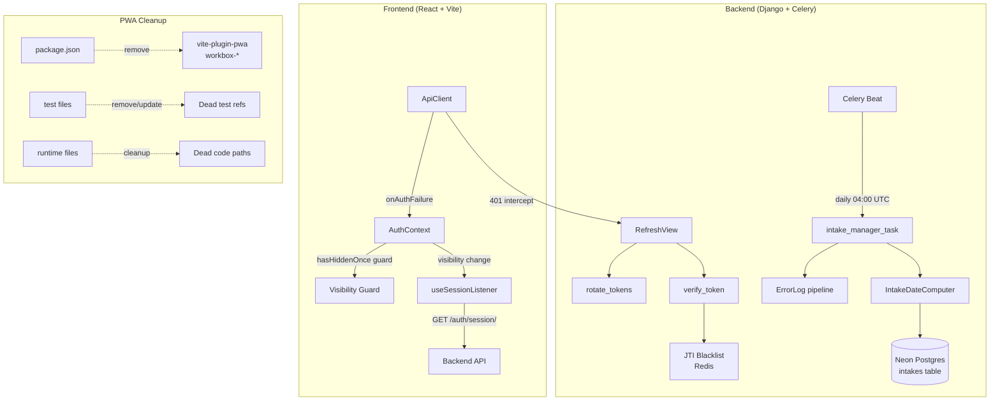
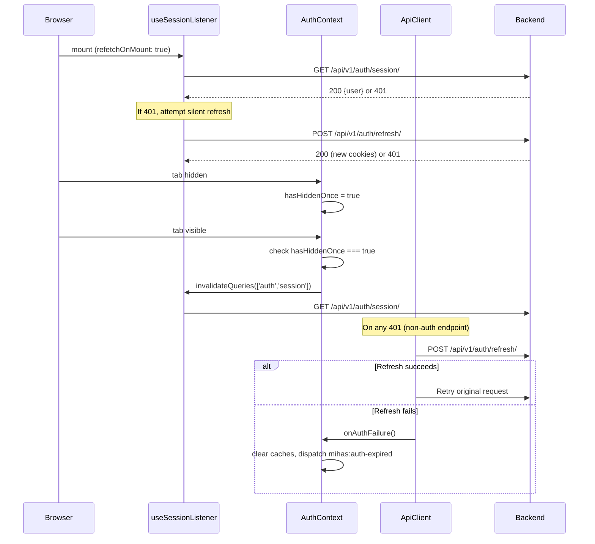

# Design Document: Production Stability Hardening

## Overview

This design covers three areas of production stability work for the MIHAS admissions platform:

1. **Intake Date Automation** (Requirements 1–3): A Celery periodic task (`Intake_Manager`) that auto-computes intake date windows and creates future intake records following the January/July pattern, ensuring at least 2 open intakes are always available.

2. **PWA Removal Cleanup** (Requirements 4–6): Complete removal of `vite-plugin-pwa`, all `workbox-*` packages, dead test files, and runtime artifacts. The PWA was already removed from the Vite config in a prior commit; this spec covers the remaining dependency, test, and dead-code cleanup.

3. **Session & Auth Stability** (Requirements 7–10): Verification and hardening of session deduplication (`refetchOnMount: true`, `hasHiddenOnce` guard), token refresh reliability, visibility-change revalidation, and the auth failure cascade.

### Design Decisions

| Decision | Rationale |
|----------|-----------|
| Celery task over management command as primary | Celery Beat already runs on a dedicated Koyeb worker; adding a daily task is zero-infra cost. Management command is kept as a secondary invocation path for manual runs. |
| 11-month lead time for `application_start_date` | Matches the existing pattern where January intakes open the preceding February, giving applicants a full cycle to prepare. |
| Retain SW unregistration in `main.tsx` for 90 days | Users with stale service worker registrations need the cleanup code to run at least once. 90-day window covers the long tail of returning users. |
| `pushNotificationManager.ts` marked as dead code, not deleted | The file has no active callers but removing it is a separate cleanup concern. Marking it with a `@deprecated` JSDoc and a TODO is sufficient. |
| No hard redirect on auth failure | Route guards and event listeners handle navigation. Hard redirects would lose unsaved form state in the wizard. |

## Architecture



### Component Interaction: Session Lifecycle



## Components and Interfaces

### 1. IntakeDateComputer (new pure function module)

**Location:** `backend/apps/catalog/intake_date_computer.py`

```python
@dataclass(frozen=True)
class ComputedIntakeDates:
    name: str                      # e.g. "January 2027"
    year: int                      # e.g. 2027
    start_date: date               # 1st of intake month
    application_start_date: date   # 11 months before start_date
    application_deadline: date     # 2 months after start_date

def compute_intake_dates(intake_month: int, intake_year: int) -> ComputedIntakeDates:
    """Pure function. intake_month must be 1 (January) or 7 (July)."""

def get_next_intake_month_year(after: date) -> tuple[int, int]:
    """Return the next (month, year) in the Jan/Jul pattern after the given date."""

def ensure_minimum_open_intakes(today: date, existing_intakes: list[Intake], min_open: int = 2) -> list[ComputedIntakeDates]:
    """Return list of intakes that need to be created to maintain min_open open intakes."""
```

**Design rationale:** Pure functions with no DB access make the date logic independently testable with property-based tests. The Celery task orchestrates DB reads/writes around these pure computations.

### 2. intake_manager_task (Celery task)

**Location:** `backend/apps/catalog/tasks.py`

```python
@shared_task(bind=True, max_retries=2, default_retry_delay=300)
def intake_manager_task(self):
    """Daily task: ensure >= 2 open intakes exist. Idempotent."""
```

**Registration in `CELERY_BEAT_SCHEDULE`:**
```python
"manage-intakes": {
    "task": "apps.catalog.tasks.intake_manager_task",
    "schedule": crontab(hour=4, minute=0),
}
```

**Also callable as management command:**
```python
# backend/apps/catalog/management/commands/manage_intakes.py
class Command(BaseCommand):
    def handle(self, *args, **options):
        intake_manager_task.apply()
```

### 3. PWA Cleanup Targets

| File | Action |
|------|--------|
| `apps/admissions/package.json` | Remove `vite-plugin-pwa` from dependencies, remove all `workbox-*` from devDependencies, remove `generate:pwa-assets` script |
| `apps/admissions/src/vite-env.d.ts` | Remove `/// <reference types="vite-plugin-pwa/client" />` |
| `apps/admissions/tsconfig.build.json` | Remove `"vite-plugin-pwa/client"` from `types` array |
| `tests/unit/serviceWorkerCache.test.ts` | Delete file |
| `tests/property/swAuthEndpointsNeverCached.property.test.ts` | Delete file |
| `tests/property/postMigrationQaBugs.property.test.ts` | Remove SW-related test cases, keep non-SW cases |
| `tests/unit/appGlobalLazyLoading.test.ts` | Remove assertions referencing `ServiceWorkerUpdatePrompt` / `OfflineIndicator` |
| `src/services/pushNotificationManager.ts` | Add `@deprecated` JSDoc, mark as dead code |
| `src/lib/cacheMonitor.ts` | Already deleted (confirmed ENOENT) |
| `src/main.tsx` SW block | Retain for 90-day rollover period |
| `src/lib/lazyImportRecovery.ts` | Retain SW unregistration logic |
| `src/lib/hardReload.ts` | Retain SW unregistration logic |

### 4. Session & Auth Components (existing, verified/hardened)

| Component | File | Key Config |
|-----------|------|------------|
| `useSessionListener` | `src/hooks/auth/useSessionListener.ts` | `refetchOnMount: true`, `refetchOnWindowFocus: false` |
| `useAuthCheck` | Same file | `refetchOnMount: false` (subscribes only) |
| `AuthContext` visibility handler | `src/contexts/AuthContext.tsx` | `hasHiddenOnce` guard, `pageshow` persisted handler |
| `ApiClient` 401 intercept | `src/services/client.ts` | Single refresh attempt via `attemptRefresh()`, promise-lock dedup |
| `onAuthFailure` callback | `AuthContext.tsx` `useEffect` | Clears cache, CSRF, secure storage; dispatches `mihas:auth-expired` |
| `RefreshView` | `backend/apps/accounts/views.py` | Extracts refresh cookie, calls `rotate_tokens`, sets new cookies |
| `verify_token` | `backend/apps/accounts/tokens.py` | JTI blacklist check for refresh tokens, fail-closed on Redis error |

## Data Models

### Intake Model (existing, `managed = False`)

```python
class Intake(models.Model):
    id = models.UUIDField(primary_key=True, default=uuid.uuid4)
    name = models.CharField(max_length=255)           # "January 2027"
    year = models.IntegerField(null=True)              # 2027
    start_date = models.DateField(null=True)           # 2027-01-01
    end_date = models.DateField(null=True)
    application_start_date = models.DateField(null=True)  # 2026-02-01
    application_deadline = models.DateField(null=True)    # 2027-03-01
    max_capacity = models.IntegerField(null=True)
    current_enrollment = models.IntegerField(null=True, default=0)
    is_active = models.BooleanField(null=True, default=True)
    created_at = models.DateTimeField(null=True)
    updated_at = models.DateTimeField(null=True)

    class Meta:
        managed = False
        db_table = 'intakes'
```

### Intake Date Pattern

| Intake | `start_date` | `application_start_date` | `application_deadline` |
|--------|-------------|-------------------------|----------------------|
| January 2027 | 2027-01-01 | 2026-02-01 (11 months before) | 2027-03-01 (2 months after) |
| July 2027 | 2027-07-01 | 2026-08-01 (11 months before) | 2027-09-01 (2 months after) |
| January 2028 | 2028-01-01 | 2027-02-01 (11 months before) | 2028-03-01 (2 months after) |

### Session Query Cache Shape (React Query)

```typescript
// Query key: ['auth', 'session']
type SessionQueryData = {
  user?: User
  pendingValidation?: true  // Set during bfcache restoration
} | null
```

### JTI Blacklist (Redis)

- Key format: `jti:{uuid}`
- TTL: 604800 seconds (7 days, matching refresh token lifetime)
- Fail-open on write (log error, don't crash)
- Fail-closed on read (treat as blacklisted if Redis unreachable)


## Correctness Properties

*A property is a characteristic or behavior that should hold true across all valid executions of a system — essentially, a formal statement about what the system should do. Properties serve as the bridge between human-readable specifications and machine-verifiable correctness guarantees.*

### Property 1: Intake date computation invariants

*For any* valid intake month (January or July) and any year in the range [2024, 2100], the `compute_intake_dates` function SHALL produce dates where:
- `application_start_date` is exactly 11 months before `start_date`
- `application_deadline` is exactly 2 months after `start_date`
- `application_start_date < start_date < application_deadline`
- `name` equals `"{MonthName} {year}"` and `year` equals the start_date year

**Validates: Requirements 1.1, 1.2, 1.3, 1.4, 2.3**

### Property 2: Always 2 open intakes

*For any* date and any set of existing active intakes (including empty), after running `ensure_minimum_open_intakes(today, existing, min_open=2)`, the combined set of existing + newly created intakes SHALL contain at least 2 intakes where `application_start_date <= today <= application_deadline`. Running the function a second time with the updated set SHALL produce zero additional intakes (idempotency).

**Validates: Requirements 2.1, 2.2, 2.4, 2.5, 3.3**

### Property 3: No PWA artifacts in build output

*For any* file in the production build output directory (`dist/`), the filename SHALL not match `sw.js`, `service-worker.js`, `workbox-*.js`, or `manifest.webmanifest`. Additionally, no JavaScript file in the build output SHALL contain the string `workbox` or `serviceWorker.register`.

**Validates: Requirements 4.3, 4.4**

### Property 4: Exactly 1 session call on page load

*For any* initial page load (component mount), the `useSessionListener` hook SHALL trigger exactly one `GET /api/v1/auth/session/` fetch. The `useAuthCheck` hook, when mounted concurrently, SHALL not trigger any additional fetches (it subscribes to the same cache entry with `refetchOnMount: false`).

**Validates: Requirements 7.1, 7.2, 7.4**

### Property 5: Token refresh succeeds with valid refresh token

*For any* valid, non-expired, non-blacklisted refresh token, calling `rotate_tokens(token)` SHALL return a new (access_token, refresh_token) pair where both are valid JWT strings, the old token's JTI is now blacklisted, and the new tokens have fresh expiration times. The new access token SHALL contain the same `user_id` and `role` as the original.

**Validates: Requirements 8.1, 8.6**

### Property 6: Visibility guard prevents initial-load revalidation

*For any* sequence of `visibilitychange` events, the `AuthContext` handler SHALL only call `queryClient.invalidateQueries(['auth', 'session'])` when transitioning from `hidden` to `visible` AND the `hasHiddenOnce` flag is `true`. The flag SHALL only be set to `true` when `document.visibilityState` transitions to `hidden`. On initial page load (before any `hidden` transition), a `visible` event SHALL not trigger revalidation.

**Validates: Requirements 7.3, 7.5, 9.1, 9.2, 9.4**

### Property 7: API client single-refresh-then-cascade on 401

*For any* non-auth API endpoint that returns HTTP 401, the `ApiClient` SHALL attempt exactly one token refresh via `POST /api/v1/auth/refresh/`. If the refresh succeeds, the original request SHALL be retried once with the new credentials. If the refresh fails (or the retry also returns 401), the `onAuthFailure` callback SHALL be invoked exactly once.

**Validates: Requirements 8.7, 8.8**

### Property 8: Auth failure cascade clears all state

*For any* invocation of the `onAuthFailure` callback, the handler SHALL: (1) set the `['auth', 'session']` query data to `null`, (2) call `queryClient.clear()`, (3) call `clearCsrfToken()`, (4) call `secureStorage.clearSession()`, (5) dispatch a `mihas:auth-expired` CustomEvent with `from` and `signInPath` in the detail, and (6) store the current URL in `sessionStorage` under `mihas:post-auth-redirect`. No `window.location` assignment SHALL occur.

**Validates: Requirements 10.1, 10.2, 10.3, 10.4**

## Error Handling

### Intake Manager Errors

| Error | Handling |
|-------|----------|
| Database connection failure during intake query | Celery task retries up to 2 times with 5-minute delay. On final failure, logs to `ErrorLog` and dispatches alert email. |
| Duplicate intake (same name + year) | Skip creation, log warning. No error raised — this is expected idempotent behavior. |
| Invalid date computation (should not happen with valid month input) | `ValueError` raised by `compute_intake_dates` if month is not 1 or 7. Caught by task, logged as error. |

### Token Refresh Errors

| Error | Handling |
|-------|----------|
| Missing refresh cookie | Return 401 with `INVALID_TOKEN` code |
| Expired refresh token | `jwt.ExpiredSignatureError` → Return 401 with `TOKEN_EXPIRED` |
| Blacklisted JTI | `ValueError("Token has been revoked")` → Return 401 with `TOKEN_EXPIRED` |
| Redis unreachable on JTI read | `is_jti_blacklisted` returns `True` (fail-closed) → 401 |
| Redis unreachable on JTI write | `blacklist_jti` logs error, does not raise (fail-open) — old token may remain usable |

### Frontend Auth Errors

| Error | Handling |
|-------|----------|
| Session check returns 401 (unauthenticated visitor) | `useSessionListener` returns `null` silently. No error displayed on public pages. |
| Refresh attempt fails after 401 | `ApiClient` invokes `onAuthFailure` → cache clear, `mihas:auth-expired` event, redirect via route guards |
| Second 401 after successful refresh + retry | Same as refresh failure — `onAuthFailure` invoked |
| `secureStorage.clearSession()` throws | Caught with empty catch — best-effort cleanup |

## Testing Strategy

### Backend Tests

**Property-based tests** (Hypothesis, minimum 100 iterations each):

| Test | Property | Library |
|------|----------|---------|
| `test_intake_date_computation_properties.py` | P1: Intake date computation invariants | hypothesis |
| `test_intake_open_count_properties.py` | P2: Always 2 open intakes | hypothesis |
| `test_token_refresh_properties.py` | P5: Token refresh round-trip | hypothesis |

**Unit tests** (pytest):

| Test | Coverage |
|------|----------|
| `test_intake_manager_task.py` | Task registration in CELERY_BEAT_SCHEDULE, management command invocation, error logging on failure |
| `test_intake_date_edge_cases.py` | Leap year handling, year boundary (Dec→Jan), existing intakes with null dates |

### Frontend Tests

**Property-based tests** (fast-check via Vitest, minimum 100 iterations each):

| Test | Property | Library |
|------|----------|---------|
| `pwaArtifactAbsence.property.test.ts` | P3: No PWA artifacts in build output | fast-check |
| `sessionDeduplication.property.test.ts` | P4: Exactly 1 session call on page load | fast-check |
| `visibilityGuard.property.test.ts` | P6: Visibility guard prevents initial-load revalidation | fast-check |
| `apiClient401Cascade.property.test.ts` | P7: API client single-refresh-then-cascade | fast-check |
| `authFailureCascade.property.test.ts` | P8: Auth failure cascade clears all state | fast-check |

**Unit tests** (Vitest):

| Test | Coverage |
|------|----------|
| `pwaPackageRemoval.test.ts` | Verify package.json has no PWA deps, vite-env.d.ts has no PWA reference, tsconfig.build.json has no PWA type |
| `pwaTestCleanup.test.ts` | Verify deleted test files don't exist, updated test files don't reference SW modules |
| `pushNotificationDeprecated.test.ts` | Verify `@deprecated` annotation on pushNotificationManager.ts |
| `mainSwBlock.test.ts` | Verify main.tsx still contains SW unregistration block |
| `authPageshowRevalidation.test.tsx` | Verify bfcache restoration sets pendingValidation and invalidates session (Req 9.3) |
| `refreshEndpointEdgeCases.test.ts` | Missing cookie → 401, expired token → 401, blacklisted JTI → 401 (Req 8.2, 8.3, 8.4) |

### Test Configuration

- Backend property tests: `@settings(max_examples=100)` via Hypothesis
- Frontend property tests: `fc.assert(fc.property(...), { numRuns: 100 })` via fast-check
- Each property test file includes a comment tag: `// Feature: production-stability-hardening, Property {N}: {title}`
- Backend property tests include docstring tag: `"""Feature: production-stability-hardening, Property {N}: {title}"""`
