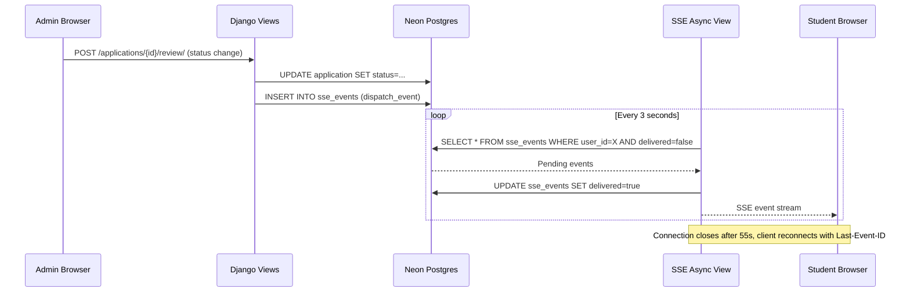
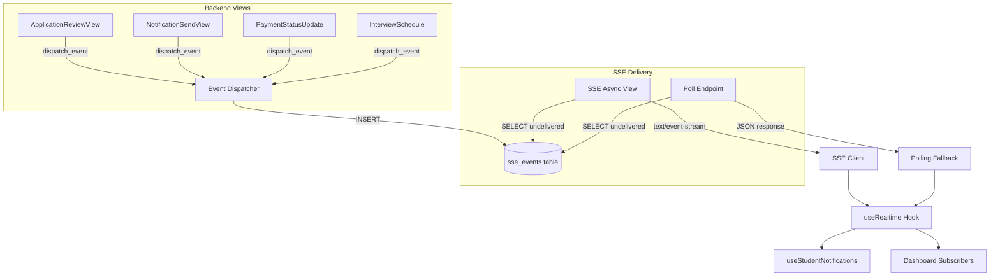
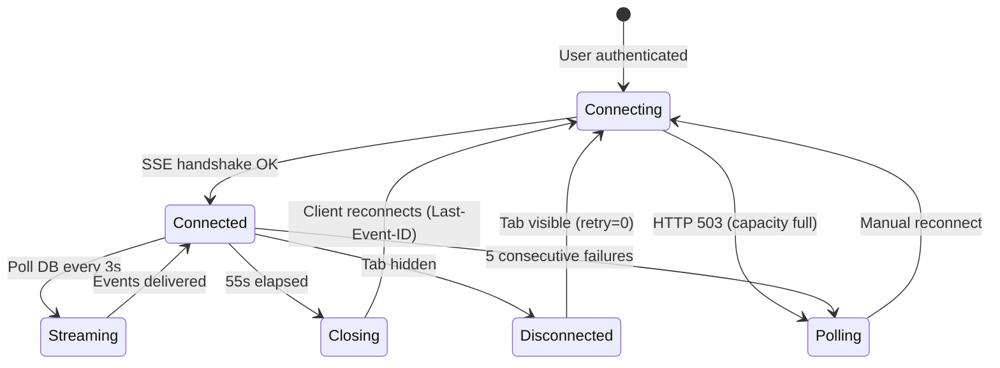

# Design Document: Realtime SSE System

## Overview

This design replaces the existing stub SSE implementation (`backend/apps/common/sse.py`) with a production-grade, database-backed Server-Sent Events system. The current stub reads only from the `notifications` table, uses a synchronous DRF `APIView` (blocking worker threads), has no event dispatch layer, no delivery tracking, no connection capacity management, and no cleanup strategy.

The new system introduces:

1. A dedicated `sse_events` Postgres table that decouples SSE delivery from the `notifications` table
2. An async ASGI streaming view that bypasses DRF to avoid blocking workers
3. Manual JWT authentication inside the async view (DRF auth classes don't apply to raw ASGI views)
4. An explicit `dispatch_event()` function called from views when domain state changes
5. A polling fallback endpoint with delivery tracking
6. Connection capacity limits (50 concurrent) with 55-second lifecycle
7. Celery Beat cleanup of delivered/stale events
8. Frontend re-enablement of the existing disabled SSE client and realtime hook

Key constraint: zero Redis usage for event delivery. All event storage, querying, and delivery tracking goes through Postgres via the indexed `sse_events` table. Redis is only used by the existing rate limiter and Celery broker — the SSE system adds no new Redis operations.

## Architecture





### Connection Lifecycle



## Components and Interfaces

### Backend Components

#### 1. SSE Event Model (`backend/apps/common/models.py`)

New `SSEEvent` model mapped to the `sse_events` table (`managed = False` — table created via SQL migration script, consistent with existing `ErrorLog`, `AuditLog` patterns).

#### 2. SSE Async Stream View (`backend/apps/common/sse.py` — rewrite)

Replaces the existing stub. Key differences from current implementation:

| Aspect | Current Stub | New Implementation |
|--------|-------------|-------------------|
| View type | DRF `APIView` (sync) | Raw async ASGI function |
| Auth | DRF `IsAuthenticated` permission | Manual JWT extraction from `access_token` cookie |
| Data source | `notifications` table | `sse_events` table |
| Delivery tracking | None | Marks events `delivered=true` |
| Keepalive | 8s interval | 15s interval |
| Lifecycle | 30s | 55s |
| Polling interval | 8s (same as keepalive) | 3s internal DB poll |
| Capacity | Unlimited | 50 concurrent connections |
| Last-Event-ID | Not supported | Supported for resume |
| Rate limiting | Subject to middleware | Exempt |

The async view is a standalone async function (not a class-based view) registered directly in `event_urls.py`. It:
- Extracts the JWT from the `access_token` cookie using the same `SIMPLE_JWT` signing key and algorithm as `JWTAuthenticationMiddleware`
- Returns 401 JSON if unauthenticated
- Returns 503 with `Retry-After: 5` if at capacity
- Yields `text/event-stream` via `StreamingHttpResponse` with an async generator
- Queries `sse_events` every 3 seconds for undelivered events scoped to the connected user, using `sync_to_async` wrappers around Django ORM calls (each runs in Uvicorn's default thread pool — with 50 concurrent connections polling every 3s, that's ~17 thread pool tasks/second, well within capacity)
- Marks delivered events immediately after yielding — this is **at-least-once delivery** (if the connection drops between yield and UPDATE, the event stays undelivered and gets re-delivered on reconnect; the frontend Zustand store deduplicates by `event_id`)
- Sends keepalive pings every 15 seconds
- Closes after 55 seconds
- **Known limitation:** Mid-stream auth revocation is not detected. If a user logs out from another tab, the SSE stream continues until the 55-second lifecycle ends. The next reconnect will fail auth. This is acceptable given the short lifecycle.

#### 3. Poll Endpoint (`backend/apps/common/sse.py`)

Rewrite of `SSEPollView` to read from `sse_events` instead of `notifications`. Remains a DRF `APIView` (short-lived request, no streaming). Returns max 50 events, marks them delivered, supports `lastEventId` query parameter.

#### 4. Event Dispatcher (`backend/apps/common/event_dispatcher.py` — new)

A single function `dispatch_event(user_id, event_type, payload)` that:
- Creates an `SSEEvent` row in Postgres
- Enforces the 100-undelivered-event cap per user — but only checks the cap when the INSERT would exceed it (uses a conditional `DELETE ... WHERE id IN (SELECT id ... ORDER BY created_at ASC LIMIT excess)` approach to avoid a COUNT query on every call)
- Is callable from views, serializers, and Celery tasks
- Does not touch Redis
- Does NOT validate payload field contents at runtime — payload conventions are enforced by property tests on the callers, not by the dispatcher itself. This keeps `dispatch_event` fast and simple.

#### 5. Connection Counter (in-process `threading.Lock` + counter)

A simple module-level atomic counter in `sse.py` tracking active SSE connections for the current Koyeb worker. No Redis needed — single instance deployment.

#### 6. Celery Beat Cleanup Task (`backend/apps/common/tasks.py`)

New periodic task `cleanup_sse_events_task` scheduled at 04:00 UTC daily. Deletes delivered events older than 7 days and undelivered events older than 7 days, in batches of 1000.

#### 7. Rate Limiter Exemption (`backend/apps/common/middleware.py`)

Add `/api/v1/events/stream/` to `RateLimitMiddleware.SCOPE_LIMITS` as the first entry with a skip sentinel, so SSE connections don't increment Redis counters.

### Frontend Components

#### 8. SSE Client (`apps/admissions/src/lib/sseClient.ts`)

Already implemented and robust. No changes needed — the client already supports:
- `withCredentials: true` for cross-origin cookies
- Exponential backoff (1s → 30s cap)
- Battery-friendly visibility change handling
- Max retry limit (5) with error callback
- Named event subscriptions

#### 9. Realtime Hook (`apps/admissions/src/hooks/useRealtime.ts`)

Re-enable by changing defaults:
- `enabled: false` → `enabled: true`
- `pollingEnabled: false` → `pollingEnabled: true`
- `maxReconnectAttempts: 3` → `maxReconnectAttempts: 5`

Update polling fallback to use progressive interval backoff starting at 30s, increasing by 1.5x, capped at 120s (already partially implemented in the hook).

#### 10. Notification Hook Integration (`apps/admissions/src/hooks/useStudentNotifications.ts`)

Wire SSE `notification` events into the existing shared notification state:
- When SSE is connected, reduce polling to 60s consistency fallback
- When SSE is disconnected, poll at default 30s
- Deduplicate by notification `id` (already handled by the shared state's `find` check in `markAsRead`)
- Use existing `normalizeNotificationPayload` to convert SSE payloads

### Interface Contracts

#### SSE Event Stream Format

```
id: <event_uuid>
event: notification
data: {"event_id":"...","entity_id":"...","version":1,"event_type":"notification","payload":{...},"created_at":"..."}

id: <event_uuid>
event: application_update
data: {"event_id":"...","entity_id":"<app_id>","version":2,"event_type":"application_update","payload":{"application_id":"...","status":"approved","updated_at":"..."},"created_at":"..."}

event: ping
data: {"type":"keepalive","server_time":"..."}
```

#### Poll Endpoint Response

```json
{
  "success": true,
  "data": {
    "events": [
      {
        "event_id": "uuid",
        "entity_id": "uuid",
        "version": 1,
        "event_type": "notification",
        "payload": {...},
        "created_at": "2024-01-01T00:00:00Z"
      }
    ]
  }
}
```

#### dispatch_event Signature

```python
def dispatch_event(
    user_id: str | uuid.UUID,
    event_type: str,
    payload: dict,
    entity_id: str | uuid.UUID | None = None,
) -> SSEEvent:
    """Create an SSE event row in Postgres.
    
    Args:
        user_id: Target user's Profile ID
        event_type: One of 'notification', 'application_update', 
                    'payment_update', 'interview_scheduled', 'dashboard_refresh'
        payload: JSON-serializable dict with event-specific data.
                 Payload field conventions are documented in the design
                 and enforced by property tests — not validated at runtime.
        entity_id: Optional entity ID for frontend deduplication
    
    Returns:
        The created SSEEvent instance
    
    Raises:
        ValueError: If event_type is not in the allowed set
    
    Implementation notes:
        - Uses sync_to_async when called from async contexts
        - Per-user cap (100 undelivered) is enforced via conditional eviction
        - Does not touch Redis
    """
```


## Data Models

### SSEEvent Table (`sse_events`)

```sql
CREATE TABLE IF NOT EXISTS sse_events (
    id UUID PRIMARY KEY DEFAULT gen_random_uuid(),
    user_id UUID NOT NULL REFERENCES profiles(id) ON DELETE CASCADE,
    event_type VARCHAR(50) NOT NULL,
    payload JSONB NOT NULL DEFAULT '{}',
    entity_id UUID,
    delivered BOOLEAN NOT NULL DEFAULT FALSE,
    delivered_at TIMESTAMPTZ,
    created_at TIMESTAMPTZ NOT NULL DEFAULT NOW()
);

-- Composite index for the SSE polling query:
-- SELECT ... WHERE user_id = X AND delivered = false ORDER BY created_at ASC
CREATE INDEX idx_sse_events_user_undelivered 
    ON sse_events (user_id, delivered, created_at)
    WHERE delivered = false;

-- Index for cleanup task (delivered events): DELETE WHERE delivered = true AND delivered_at < cutoff
CREATE INDEX idx_sse_events_cleanup_delivered 
    ON sse_events (delivered, delivered_at)
    WHERE delivered = true;

-- Index for cleanup task (undelivered stale events): DELETE WHERE delivered = false AND created_at < cutoff
CREATE INDEX idx_sse_events_cleanup_undelivered
    ON sse_events (delivered, created_at)
    WHERE delivered = false;
```

**Django Model** (`managed = False`, consistent with `AuditLog`, `ErrorLog`):

```python
class SSEEvent(models.Model):
    id = models.UUIDField(primary_key=True, default=uuid.uuid4, editable=False)
    user = models.ForeignKey('accounts.Profile', on_delete=models.CASCADE)
    event_type = models.CharField(max_length=50)
    payload = models.JSONField(default=dict)
    entity_id = models.UUIDField(null=True, blank=True)
    delivered = models.BooleanField(default=False)
    delivered_at = models.DateTimeField(null=True, blank=True)
    created_at = models.DateTimeField(auto_now_add=True)

    class Meta:
        managed = False
        db_table = 'sse_events'
        indexes = []  # Indexes managed via SQL script
```

**Note on `version` field:** The `version` field was removed from the table. The frontend `RealtimeEventEnvelope` expects a `version` field, so the SSE stream and poll endpoint will hardcode `"version": 1` in the output. Ordering is handled by `created_at`. If entity-level version ordering is needed in the future, it can be added as a computed field based on event count per `entity_id`.

**Allowed `event_type` values:**
- `notification` — new notification created
- `application_update` — application status changed
- `payment_update` — payment status changed
- `interview_scheduled` — interview scheduled or rescheduled
- `dashboard_refresh` — generic dashboard invalidation signal

**Event payload conventions:**

| event_type | Required payload fields |
|-----------|----------------------|
| `notification` | `notification_id`, `title`, `message`, `type` |
| `application_update` | `application_id`, `status`, `updated_at` |
| `payment_update` | `payment_id`, `status`, `updated_at` |
| `interview_scheduled` | `interview_id`, `scheduled_at`, `mode` |
| `dashboard_refresh` | `reason` |

**Per-user cap:** Maximum 100 undelivered events per user. When `dispatch_event` detects the cap is reached, it marks the oldest undelivered events as delivered (eviction) before inserting the new event. This prevents unbounded row accumulation for inactive users.

### Existing Models Referenced

- `Notification` (`notifications` table) — the event dispatcher creates an `SSEEvent` when a `Notification` is created, but the two tables are independent
- `Profile` (`profiles` table) — `user_id` FK target
- `Application` (`applications` table) — source of `application_update` events
- `Payment` (`payments` table) — source of `payment_update` events
- `ApplicationInterview` (`application_interviews` table) — source of `interview_scheduled` events

### Frontend State Model

The existing `RealtimeEventEnvelope` interface in `realtimeStore.ts` already matches the SSE event shape:

```typescript
interface RealtimeEventEnvelope {
  event_id: string    // maps to SSEEvent.id
  entity_id: string   // maps to SSEEvent.entity_id
  version: number     // hardcoded to 1 in SSE/poll output (no DB column)
  created_at: string  // maps to SSEEvent.created_at
  event_type: string  // maps to SSEEvent.event_type
  payload: Record<string, unknown>  // maps to SSEEvent.payload
}
```

The Zustand store deduplicates by `event_id` and enforces version ordering per `entity_id`, which means the SSE and polling paths can safely deliver overlapping events without duplicates reaching subscribers.


## Correctness Properties

*A property is a characteristic or behavior that should hold true across all valid executions of a system — essentially, a formal statement about what the system should do. Properties serve as the bridge between human-readable specifications and machine-verifiable correctness guarantees.*

### Property 1: SSE event delivery completeness

*For any* set of undelivered `SSEEvent` rows targeting a specific user, when the SSE async stream queries the database, all undelivered events should appear in the yielded output as named SSE events with their `id` as the SSE `id` field.

**Validates: Requirements 1.3**

### Property 2: Last-Event-ID filtering for SSE stream

*For any* set of `SSEEvent` rows and any valid `Last-Event-ID` value corresponding to an existing event's UUID, the SSE stream should yield only events whose `created_at` is strictly after the referenced event's `created_at`.

**Validates: Requirements 1.5**

### Property 3: Unauthenticated SSE returns 401

*For any* request to `GET /api/v1/events/stream/` that does not contain a valid JWT in the `access_token` cookie (missing cookie, expired token, invalid signature, wrong token_type), the endpoint should return HTTP 401 with a JSON error envelope.

**Validates: Requirements 1.6**

### Property 4: Poll returns undelivered events for authenticated user

*For any* authenticated user with undelivered `SSEEvent` rows, `GET /api/v1/events/poll/` should return a JSON envelope containing exactly those undelivered events, and no events belonging to other users.

**Validates: Requirements 2.1**

### Property 5: lastEventId filtering for poll endpoint

*For any* set of `SSEEvent` rows and any valid `lastEventId` query parameter, the poll endpoint should return only events created after the referenced event, excluding the referenced event itself.

**Validates: Requirements 2.2**

### Property 6: Delivery marking after retrieval

*For any* event returned by either the SSE stream or the poll endpoint, that event's `delivered` field should be `true` and `delivered_at` should be set to a non-null timestamp after the retrieval completes.

**Validates: Requirements 2.3, 3.3**

### Property 7: Poll returns at most 50 events ordered ascending

*For any* number of undelivered events for a user (including more than 50), the poll endpoint should return at most 50 events, and those events should be ordered by `created_at` ascending.

**Validates: Requirements 2.4**

### Property 8: SSEEvent persistence round-trip

*For any* valid combination of `user_id`, `event_type` (from the allowed set), `payload` (JSON-serializable dict), and `entity_id`, creating an `SSEEvent` via `dispatch_event` and then querying it back should produce an equivalent record with all fields preserved.

**Validates: Requirements 3.1**

### Property 9: Event type validation

*For any* `event_type` string, `dispatch_event` should succeed if and only if the string is one of `notification`, `application_update`, `payment_update`, `interview_scheduled`, `dashboard_refresh`. All other strings should raise `ValueError`.

**Validates: Requirements 3.4**

### Property 10: Cleanup removes events older than 7 days

*For any* set of `SSEEvent` rows with varying `created_at` timestamps and `delivered` states, the cleanup task should delete all rows where `created_at` is older than 7 days — regardless of whether they are delivered or undelivered — and should not delete any rows newer than 7 days.

**Validates: Requirements 3.5, 3.6**

### Property 11: Per-user undelivered event cap

*For any* user, after any number of `dispatch_event` calls without delivery, the count of undelivered `SSEEvent` rows for that user should never exceed 100. When the 101st event is dispatched, the oldest undelivered event should be evicted (marked delivered) before the new event is inserted.

**Validates: Requirements 3.7**

### Property 12: dispatch_event creates SSEEvent for valid domain actions

*For any* valid `user_id`, `event_type` from the allowed set, and well-formed `payload` dict, `dispatch_event` should create exactly one new `SSEEvent` row in the database with matching `user_id`, `event_type`, `payload`, `delivered=false`, and a non-null `created_at`.

**Validates: Requirements 4.1, 4.2, 4.3, 4.4**

### Property 13: Event payload contains required fields

*For any* dispatched event of type `application_update`, the payload should contain `application_id`, `status`, and `updated_at`. For type `notification`, the payload should contain `notification_id`, `title`, `message`, and `type`. For type `payment_update`, the payload should contain `payment_id`, `status`, and `updated_at`. For type `interview_scheduled`, the payload should contain `interview_id`, `scheduled_at`, and `mode`. **Note:** This is enforced by property tests on the calling views, not by runtime validation in `dispatch_event` itself.

**Validates: Requirements 4.5, 8.3**

### Property 14: Exponential backoff formula

*For any* retry attempt number `n` (0-indexed), `calculateBackoff(n, 1000, 30000)` should equal `min(1000 * 2^n, 30000)`.

**Validates: Requirements 9.1**

### Property 15: Progressive polling backoff formula

*For any* number of consecutive idle polls `n` (0-indexed), the polling interval should equal `min(30000 * 1.5^n, 120000)`.

**Validates: Requirements 6.4, 9.4**

### Property 16: Notification SSE event prepend and unread count

*For any* existing notification list and any new `notification` SSE event, after ingestion the notification list length should increase by one, the new notification should be at the front of the list, and the unread count should increase by one (assuming the new notification is unread).

**Validates: Requirements 7.1**

### Property 17: normalizeNotificationPayload preserves data

*For any* SSE notification payload containing `id`, `title`, `message`/`content`, `type`, `is_read`/`read`, and `created_at`, `normalizeNotificationPayload` should produce a `StudentNotification` object where all fields are correctly mapped and no data is lost.

**Validates: Requirements 7.2**

### Property 18: Notification deduplication by id

*For any* sequence of notification events where some share the same `id`, after processing all events, the notification list should contain at most one entry per unique `id`.

**Validates: Requirements 7.5**

### Property 19: Subscriber dispatch for application_update events

*For any* set of registered `application_update` subscribers and any `application_update` SSE event, every registered subscriber callback should be invoked exactly once with the event data.

**Validates: Requirements 8.1**

### Property 20: Connection capacity limit

*For any* number of concurrent SSE connection attempts exceeding 50, the excess connections should receive HTTP 503 with a `Retry-After: 5` header, while the first 50 connections should proceed normally.

**Validates: Requirements 11.1**


## Error Handling

### Backend Errors

| Error Condition | Handling Strategy |
|----------------|-------------------|
| JWT missing/invalid/expired in SSE view | Return HTTP 401 JSON `{"success": false, "error": "Authentication required", "code": "AUTHENTICATION_REQUIRED"}`. Do not start streaming. |
| SSE capacity (50) exceeded | Return HTTP 503 JSON with `Retry-After: 5` header. Client falls back to polling. |
| Database query failure during SSE stream | Log error, yield a comment line (`:`), continue to next poll cycle. Do not crash the stream. |
| Database query failure during poll | Return HTTP 500 with standard error envelope. |
| Invalid `event_type` in `dispatch_event` | Raise `ValueError` immediately. Caller is responsible for handling. |
| `dispatch_event` database write failure | Let the exception propagate. The calling view's transaction will roll back if inside `transaction.atomic()`. Log the error. |
| `Last-Event-ID` references non-existent event | Treat as if no `Last-Event-ID` was sent — stream all undelivered events. |
| `lastEventId` query param references non-existent event | Same as above — return all undelivered events. |
| Cleanup task encounters locked rows | Skip locked rows using `select_for_update(skip_locked=True)` or batch delete with `LIMIT`. Log and continue. |
| SSE client receives non-JSON event data | `parseEventData` in `sseClient.ts` already falls back to returning raw string. No change needed. |
| SSE connection drops mid-stream | Client's `onerror` handler triggers exponential backoff reconnection. After 5 failures, falls back to polling. |
| Browser tab hidden during SSE | Client disconnects (battery-friendly). Reconnects with retry=0 when tab becomes visible. |

### Frontend Error Recovery

| Scenario | Recovery |
|----------|----------|
| SSE 401 | Do not retry SSE. Trigger token refresh via existing `RefreshView`. If refresh succeeds, reconnect. If refresh fails, redirect to login. |
| SSE 503 | Fall back to polling immediately. Retry SSE after `Retry-After` period. |
| SSE network error | Exponential backoff: 1s, 2s, 4s, 8s, 16s, 30s (cap). After 5 failures, switch to polling. |
| Poll endpoint error | Log error, retry on next polling interval. Do not crash the UI. |
| Duplicate events from SSE + polling overlap | Zustand store deduplicates by `event_id` and enforces version ordering per `entity_id`. |

### Graceful Degradation Hierarchy

1. SSE connected → real-time delivery (~3s latency)
2. SSE reconnecting → exponential backoff, events queue in DB
3. SSE failed → polling at 30s → 45s → 67s → 101s → 120s (cap)
4. Poll failed → retry on next interval, UI shows stale data with "offline" indicator

## Testing Strategy

### Property-Based Testing

Library: **Hypothesis** (Python backend), **fast-check** (TypeScript frontend)

Each property test must run a minimum of 100 iterations and be tagged with a comment referencing the design property.

Tag format: `Feature: realtime-sse-system, Property {number}: {property_text}`

#### Backend Property Tests (`backend/tests/property/`)

| Test File | Properties Covered | Description |
|-----------|-------------------|-------------|
| `test_event_dispatcher.py` | P8, P9, P11, P12, P13 | Tests `dispatch_event` round-trip, type validation, per-user cap, payload requirements |
| `test_sse_delivery.py` | P1, P2, P6, P7 | Tests event delivery completeness, Last-Event-ID filtering, delivery marking, poll ordering/cap |
| `test_sse_auth.py` | P3 | Tests JWT extraction and validation in the async view |
| `test_event_cleanup.py` | P10 | Tests cleanup task removes events older than 7 days regardless of delivery state |
| `test_poll_endpoint.py` | P4, P5 | Tests poll returns correct events for authenticated user, lastEventId filtering |

#### Frontend Property Tests (`apps/admissions/tests/`)

| Test File | Properties Covered | Description |
|-----------|-------------------|-------------|
| `unit/sse-backoff.test.ts` | P14, P15 | Tests `calculateBackoff` formula and progressive polling interval |
| `unit/notification-ingestion.test.ts` | P16, P17, P18 | Tests notification prepend, normalization round-trip, deduplication |
| `unit/realtime-dispatch.test.ts` | P19 | Tests subscriber dispatch for event types |

### Unit / Example Tests

| Test | What It Validates | Type |
|------|-------------------|------|
| SSE response headers | `Cache-Control: no-cache`, `X-Accel-Buffering: no`, `Content-Type: text/event-stream` (Req 1.1) | Example |
| SSE keepalive timing | Stream contains ping events (Req 1.2) | Integration |
| SSE 55s lifecycle | Connection closes after ~55s (Req 1.4) | Integration |
| Rate limiter exemption | `/api/v1/events/stream/` skips rate limiting, `/api/v1/events/poll/` does not (Req 5.1, 5.2) | Example |
| Hook defaults | `useRealtime` initializes with `enabled: true`, `pollingEnabled: true` (Req 6.1, 6.2) | Example |
| SSE client credentials | `withCredentials: true` in EventSource config (Req 6.3) | Example |
| Visibility change | Disconnect on hidden, reconnect on visible with retry=0 (Req 6.5, 6.6) | Example |
| Polling interval adaptation | 60s when SSE connected, 30s when disconnected (Req 7.3, 7.4) | Example |
| Max retry fallback | After 5 SSE failures, switches to polling (Req 9.2) | Example |
| Retry reset on recovery | Retry counter resets to 0 after successful connection (Req 9.3) | Example |
| React Query invalidation | `application_update` event triggers cache invalidation (Req 8.2) | Example |
| Connection capacity 503 | 51st connection gets 503 with Retry-After header (Req 11.1) | Example |
| Celery Beat schedule | `cleanup_sse_events_task` is in `CELERY_BEAT_SCHEDULE` at 04:00 UTC (Req 3.5) | Example |

### Test Configuration

- Backend: `pytest` + `hypothesis` with `@settings(max_examples=100)`
- Frontend: `vitest` + `fast-check` with `fc.assert(property, { numRuns: 100 })`
- Integration tests that require a running database use Django's `TestCase` with the test database
- Frontend tests mock the `apiClient` and `EventSource` — no real network calls

