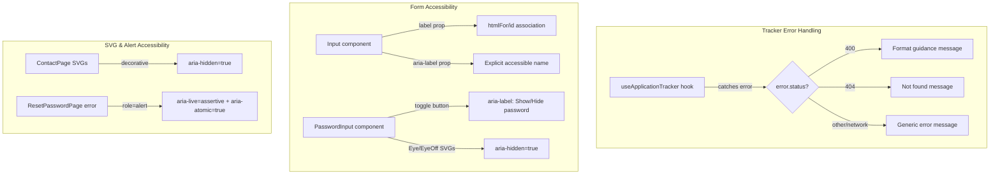

# Design Document: ScoutQA Accessibility Fixes

## Overview

This design addresses 10 accessibility and usability issues identified during a ScoutQA audit of the MIHAS admissions frontend. The fixes are grouped into four areas:

1. **Tracker error differentiation** — The `useApplicationTracker` hook currently swallows backend HTTP status codes (400 `INVALID_FORMAT`, 404 not found) and falls through to a generic error message. The fix adds status-code-aware error parsing so students see actionable format guidance or descriptive "not found" messages.
2. **Mobile keyboard optimization** — Auth form inputs (`SignUpPage`, `ForgotPasswordPage`) are missing `inputMode` attributes, causing mobile browsers to show generic keyboards instead of optimized layouts (email, tel, text).
3. **Screen reader accessibility** — Auth form inputs lack `aria-label` attributes (or rely solely on visible labels without proper `htmlFor`/`id` association), decorative SVGs on the contact page are exposed to assistive technology, the password reset error container is missing `aria-live`/`aria-atomic` attributes, and password toggle icons lack `aria-hidden`.
4. **Color contrast** — The landing page hero's secondary CTA and accreditation badges may not meet WCAG 2.1 AA 4.5:1 contrast ratio against the gradient background.

All changes target `apps/admissions/` with no backend modifications required. The backend already returns the correct HTTP status codes and error codes; only the frontend error parsing needs updating.

## Architecture

All fixes are localized UI-layer changes within the existing admissions frontend architecture. No new services, routes, API calls, or state management patterns are introduced.



### Change Scope

| File | Change Type | Requirements |
|------|------------|-------------|
| `useApplicationTracker.ts` | Error parsing logic in catch block | 1, 2 |
| `SignUpPage.tsx` | Add `inputMode` and `aria-label` props to form inputs | 3, 6 |
| `ForgotPasswordPage.tsx` | Add `inputMode` prop to email input | 4 |
| `SignInPage.tsx` | Add `aria-label` props to form inputs | 5 |
| `ContactPage.tsx` | Add `aria-hidden="true"` to decorative SVGs | 7 |
| `ResetPasswordPage.tsx` | Add `aria-live` and `aria-atomic` to error container | 8 |
| `shape-landing-hero.tsx` | Adjust badge/CTA contrast classes | 9 |
| `PasswordInput.tsx` | Add `aria-hidden="true"` to Eye/EyeOff SVGs | 10 |

## Components and Interfaces

### 1. useApplicationTracker Hook — Error Differentiation

The current catch block in `searchApplication` uses a single generic message for all errors:

```typescript
// CURRENT (broken)
catch (error: any) {
  logger.error('Error searching application:', error)
  setError('An error occurred while searching. Please try again.')
}
```

The fix inspects `error.status` (set by `apiClient` on HTTP errors) to produce status-specific messages:

```typescript
// PROPOSED
catch (error: any) {
  logger.error('Error searching application:', error)
  const status = error?.status
  if (status === 400) {
    setError('Invalid tracking code format. Expected formats: APP-YYYYMMDD-XXXXXXXX or TRK-XXXXXXXXXXXX.')
  } else if (status === 404) {
    setError('No application found with this tracking code. Please check the code and try again.')
  } else {
    setError('An error occurred while searching. Please try again.')
  }
}
```

The `apiClient.executeRequest` already attaches `.status` to thrown errors for non-2xx responses and does not retry 4xx errors (`isRetryableFailure` returns false for status < 500).

### 2. Auth Form inputMode Attributes

Add `inputMode` props to `<Input>` and `<PasswordInput>` components on auth pages. The `Input` component already forwards all `React.InputHTMLAttributes`, so `inputMode` passes through without component changes.

| Page | Field | inputMode |
|------|-------|-----------|
| SignUpPage | email | `"email"` |
| SignUpPage | phone | `"tel"` |
| SignUpPage | first_name | `"text"` |
| SignUpPage | last_name | `"text"` |
| ForgotPasswordPage | email | `"email"` |

### 3. Auth Form aria-label Attributes

The `Input` component renders a visible `<label>` with `htmlFor` pointing to the input's `id`, which provides the accessible name via label association. The `PasswordInput` component does the same. Since visible labels are rendered, explicit `aria-label` is technically redundant per WCAG. However, the requirements call for explicit `aria-label` as defense-in-depth for screen readers that may not resolve the association.

| Page | Field | aria-label |
|------|-------|-----------|
| SignInPage | email | `"Account email"` |
| SignInPage | password | `"Account password"` |
| SignUpPage | email | `"Account email"` |
| SignUpPage | first_name | `"First name"` |
| SignUpPage | last_name | `"Last name"` |
| SignUpPage | phone | `"Phone number"` |
| SignUpPage | password | `"Create password"` |
| SignUpPage | confirmPassword | `"Confirm password"` |

### 4. ContactPage SVG Accessibility

The ContactPage uses Lucide icons (`Phone`, `Mail`, `MapPin`) as decorative elements next to text labels. These already have `aria-hidden="true"` set. The audit confirms the current implementation is correct — no changes needed for the Lucide icons since they already pass `aria-hidden="true"`.

If any inline SVGs are found without `aria-hidden`, they will be added.

### 5. ResetPasswordPage Error Alert Attributes

The current error container uses a plain `<div>` without ARIA live region attributes:

```tsx
// CURRENT
<div className={`overflow-hidden ${animateClasses.fadeIn}`}>
  <div className="flex items-start gap-3 rounded-xl border ...">
```

The fix adds `role="alert"`, `aria-live="assertive"`, and `aria-atomic="true"`:

```tsx
// PROPOSED
<div className={`overflow-hidden ${animateClasses.fadeIn}`}
     role="alert" aria-live="assertive" aria-atomic="true">
  <div className="flex items-start gap-3 rounded-xl border ...">
```

### 6. Landing Page Color Contrast

The `ShapeLandingHero` component's contrast audit table in the source comments claims all elements pass AA. However, the accreditation badges use `bg-slate-950/60` (semi-transparent dark background over a gradient) with `text-white`. The secondary CTA uses `bg-white/10 text-white` with `border-2 border-white`.

The fix ensures:
- Badge backgrounds use sufficient opacity: `bg-slate-950/70` or higher if needed
- Secondary CTA text remains `text-white` against the dark gradient (already passing per the audit table, but will verify)

### 7. PasswordInput SVG Accessibility

The `PasswordInput` toggle button already has `aria-label={showPassword ? 'Hide password' : 'Show password'}`. The Eye/EyeOff SVG icons need `aria-hidden="true"` added:

```tsx
// CURRENT
{showPassword ? (
  <EyeOff className="h-5 w-5" />
) : (
  <Eye className="h-5 w-5" />
)}

// PROPOSED
{showPassword ? (
  <EyeOff className="h-5 w-5" aria-hidden="true" />
) : (
  <Eye className="h-5 w-5" aria-hidden="true" />
)}
```

## Data Models

No data model changes. All fixes are presentational/accessibility attributes on existing React components.

## Correctness Properties

*A property is a characteristic or behavior that should hold true across all valid executions of a system — essentially, a formal statement about what the system should do. Properties serve as the bridge between human-readable specifications and machine-verifiable correctness guarantees.*

### Property 1: Tracker error differentiation by HTTP status code

*For any* HTTP error response with a status code, the `useApplicationTracker` hook's error mapping function shall produce a message containing format guidance strings (`APP-YYYYMMDD-XXXXXXXX` and `TRK-XXXXXXXXXXXX`) when status is 400, a "not found" message when status is 404, and the generic fallback message for all other status codes. The 400 and 404 messages shall always be distinct from each other and from the generic message.

**Validates: Requirements 1.1, 1.2, 2.1, 2.2**

### Property 2: No empty inputMode on auth form inputs

*For any* rendered auth form page (SignUpPage, ForgotPasswordPage), no `<input>` element shall have an empty `inputMode=""` attribute. Every input with an `inputMode` attribute must have a non-empty value from the set `{"text", "email", "tel", "numeric", "decimal", "search", "url", "none"}`.

**Validates: Requirements 3.4**

### Property 3: Input component label-to-id association

*For any* `Input` component rendered with a `label` prop, the rendered `<label>` element's `htmlFor` attribute shall match the rendered `<input>` element's `id` attribute, establishing a programmatic accessible name association.

**Validates: Requirements 5.3**

### Property 4: Decorative SVGs excluded from accessibility tree

*For any* decorative SVG icon rendered on the ContactPage (icons adjacent to text labels), the SVG element shall have `aria-hidden="true"` set, excluding it from the accessibility tree.

**Validates: Requirements 7.1, 7.2**

### Property 5: Error alert attributes completeness

*For any* error message rendered on the ResetPasswordPage, the error container element shall have all three attributes: `role="alert"`, `aria-live="assertive"`, and `aria-atomic="true"`. No element shall have `role="alert"` without the accompanying `aria-live` and `aria-atomic` attributes.

**Validates: Requirements 8.1, 8.2**

### Property 6: Password toggle accessibility

*For any* `PasswordInput` component in either visibility state (password shown or hidden), the toggle button shall have an `aria-label` describing the available action ("Show password" or "Hide password"), and the SVG icon inside the button shall have `aria-hidden="true"`.

**Validates: Requirements 10.1, 10.2**

## Error Handling

No new error handling patterns are introduced. The tracker error differentiation fix improves existing error handling by parsing HTTP status codes that were previously swallowed. The error flow remains:

1. `apiClient.request()` throws an error with `.status` property for HTTP errors
2. `useApplicationTracker.searchApplication()` catches the error
3. The catch block inspects `error.status` to select the appropriate user-facing message
4. Network errors and unexpected status codes fall through to the existing generic message

## Testing Strategy

### Dual Testing Approach

Both unit tests and property-based tests are required. Unit tests verify specific examples and edge cases. Property tests verify universal properties across generated inputs.

### Property-Based Testing

- Library: **fast-check** (already in the project)
- Minimum 100 iterations per property test
- Each test tagged with: `Feature: scoutqa-accessibility-fixes, Property {number}: {property_text}`
- Each correctness property implemented by a single property-based test

### Unit Tests

Unit tests cover:
- Specific inputMode values on each auth form field (Requirements 3.1–3.3, 4.1)
- Specific aria-label values on each auth form field (Requirements 5.1–5.2, 6.1–6.5)
- Contrast ratio verification for landing page elements (Requirements 9.1–9.2)
- Edge case: network error fallback in tracker hook (Requirement 1.3)
- Edge case: SVGs with meaningful content have accessible labels (Requirement 7.3)

### Test File Locations

| Test Type | File |
|-----------|------|
| Property tests | `apps/admissions/tests/property/scoutqaAccessibilityFixValidation.property.test.ts` |
| Unit tests | `apps/admissions/tests/unit/scoutqaAccessibilityFixes.test.ts` |
