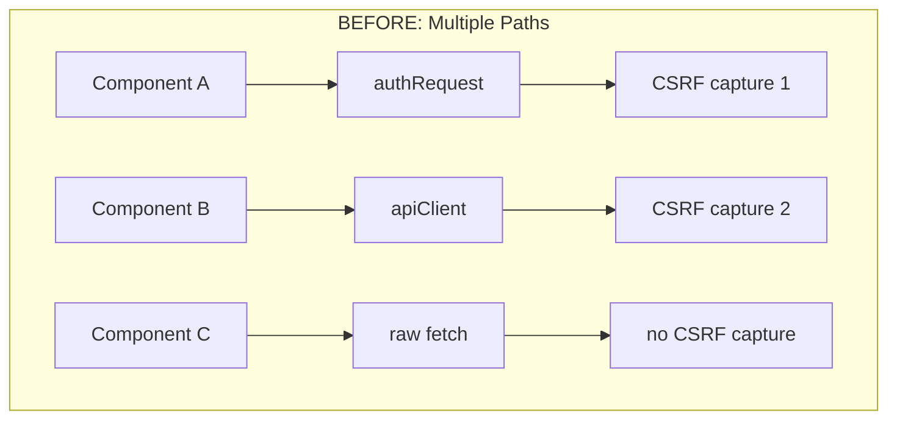
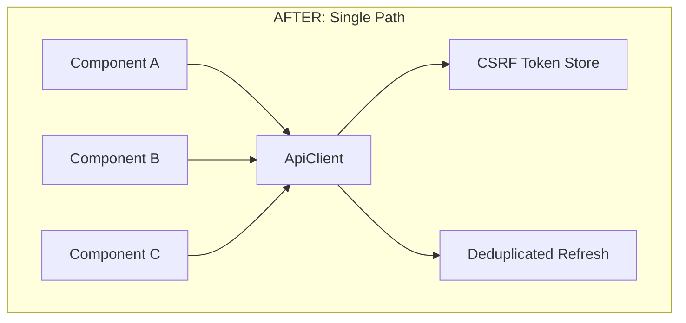
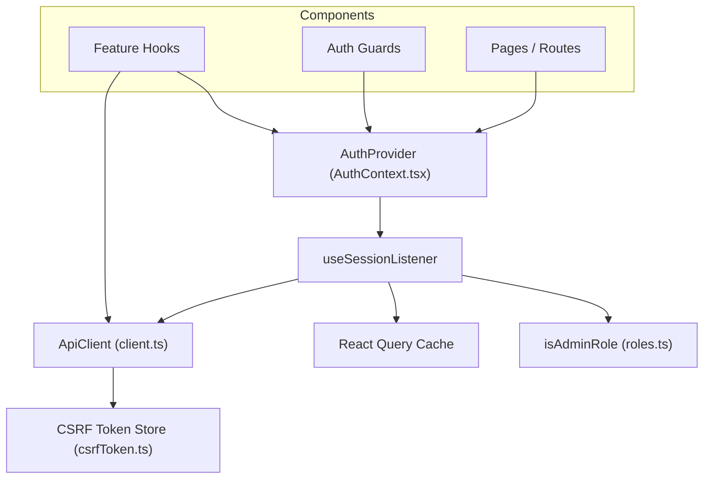
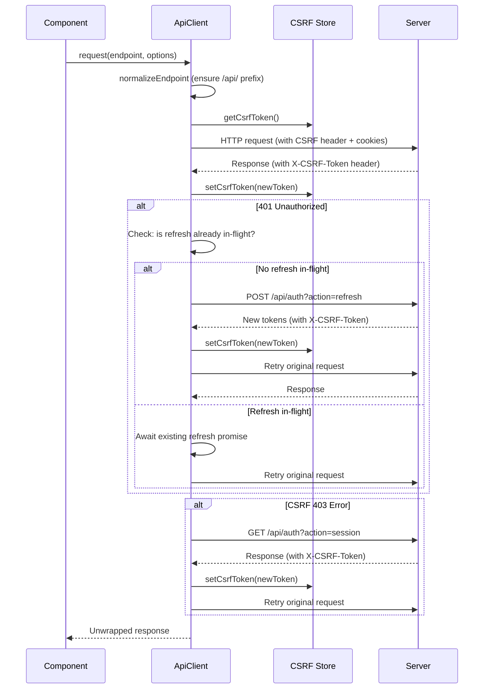
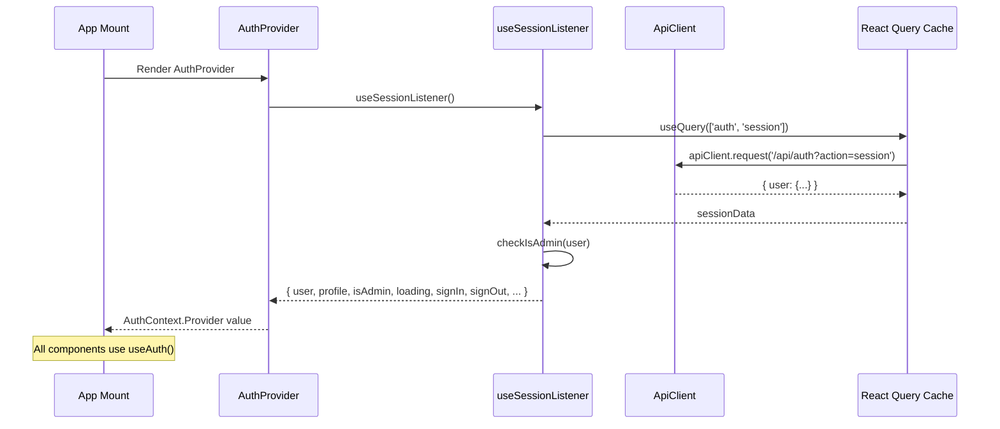

# Design Document: Single Source of Truth Consolidation

## Overview

This design describes a systemic refactor of the MIHAS admissions platform to eliminate all duplicated and competing implementations for core concerns: HTTP request handling, authentication state, session management, CSRF token lifecycle, token refresh, logout, and admin role determination.

The root cause of the production bug (PATCH requests returning 403 Forbidden after page refresh) is that CSRF tokens are captured by `authController.ts` during the initial session check (via `useSessionListener`), but the `ApiClient` in `client.ts` — which handles the actual PATCH request — never sees that token because it goes through a completely separate code path. On page refresh, the in-memory CSRF token store is cleared, the session check runs through `authRequest` (which captures the new CSRF token), but subsequent data mutations go through `apiClient` (which may or may not have captured its own token depending on timing).

The consolidation strategy is:

1. Make `ApiClient` (`src/services/client.ts`) the sole HTTP client — absorb the 401-refresh-retry logic from `authController.ts`
2. Make `useSessionListener` (via `AuthContext`) the sole auth state source — delete all competing session check paths
3. Centralize CSRF capture exclusively in `ApiClient` — eliminate all other capture points
4. Delete all orphaned modules after migration

This is a pure refactor. No new features, no API changes, no database changes. The external behavior of the application remains identical.

### Design Rationale

The consolidation follows a "funnel" pattern: all HTTP traffic flows through one client, all auth state flows through one hook, all CSRF tokens flow through one store. This eliminates the class of bugs where two code paths disagree about the current state.





## Architecture

### Component Dependency Graph (Post-Consolidation)



### Request Flow (Post-Consolidation)



### Auth State Flow (Post-Consolidation)



## Components and Interfaces

### 1. ApiClient (Enhanced) — `src/services/client.ts`

The existing `ApiClient` class is enhanced with:

- **401 refresh-retry**: On 401 response for non-refresh requests, attempt a single deduplicated token refresh, then retry the original request. On refresh failure, clear auth state and redirect.
- **CSRF 403 retry**: On 403 with CSRF-related error code, re-fetch CSRF token from session endpoint, then retry once.
- **Endpoint normalization**: Already exists — ensure `/api/` prefix is prepended for known resources.

```typescript
interface ApiClient {
  // Existing public API — no changes
  request<T>(endpoint: string, options?: ApiRequestOptions): Promise<T | null>;

  // New internal methods
  private attemptRefresh(): Promise<boolean>;
  private handleCsrf403(endpoint: string, method: string, options: ApiRequestOptions): Promise<Response>;
}
```

The refresh deduplication logic currently in `authController.ts` (`deduplicatedRefresh`) moves into `ApiClient` as a private method with the same promise-lock pattern:

```typescript
// Inside ApiClient class
private refreshPromise: Promise<boolean> | null = null;

private async attemptRefresh(): Promise<boolean> {
  if (this.refreshPromise) return this.refreshPromise;
  this.refreshPromise = this.performRefresh();
  try {
    return await this.refreshPromise;
  } finally {
    this.refreshPromise = null;
  }
}
```

**Cleanup callback**: The ApiClient needs a way to trigger auth state cleanup on unrecoverable 401. This is configured via a one-time setup function:

```typescript
let onAuthFailure: (() => void) | null = null;

export function configureApiClientAuthFailure(callback: () => void): void {
  onAuthFailure = callback;
}
```

This replaces `configureAuthController` and is called from `AuthProvider` on mount.

### 2. useSessionListener (Unchanged Core, Updated Dependencies) — `src/hooks/auth/useSessionListener.ts`

The hook's core logic remains the same. Changes:

- Replace `authRequest` calls with `apiClient.request` calls
- Remove import of `authRequest` and `logoutWithTwoPhaseClear` from `authController.ts`
- Inline the logout cleanup (clear CSRF, clear caches, POST logout, clear secure storage) directly since `logoutWithTwoPhaseClear` is being removed
- Remove hardcoded email check from `checkIsAdmin`

```typescript
// Updated checkIsAdmin — no hardcoded email
export function checkIsAdmin(user: User | null): boolean {
  if (!user) return false;
  const role = (user.role || user.user_metadata?.role || user.app_metadata?.role) as string | undefined;
  return isAdminRole(role);
}
```

### 3. AuthContext (Unchanged) — `src/contexts/AuthContext.tsx`

The thin wrapper remains. The only change is replacing `configureAuthController` with `configureApiClientAuthFailure` in the `useEffect`.

### 4. CSRF Token Store (Unchanged) — `src/lib/csrfToken.ts`

No changes. Remains the single in-memory store. All capture goes through `ApiClient`.

### 5. useProfileQuery (Updated) — `src/hooks/auth/useProfileQuery.ts`

- Replace `authRequest` calls with `apiClient.request` calls
- Keep the `updateProfile` mutation
- The read query uses the same cache key `['user-profile', userId]` as `useSessionListener`, so it reads from cache rather than making independent fetches

### 6. offlineSync (Updated) — `src/services/offlineSync.ts`

- Remove `refreshCsrfToken` function
- Remove `getCurrentUser` function
- Replace with reads from React Query cache or CSRF Token Store

## Data Models

No database schema changes. This refactor is entirely frontend.

### State Stores (Post-Consolidation)

| Store | Location | Purpose | Scope |
|-------|----------|---------|-------|
| React Query `['auth', 'session']` | In-memory | Current user identity + auth status | Global, managed by `useSessionListener` |
| React Query `['user-profile', userId]` | In-memory | User profile data | Global, managed by `useSessionListener` + `useProfileQuery` |
| CSRF Token Store | `src/lib/csrfToken.ts` (module variable) | Current CSRF token | Global, managed exclusively by `ApiClient` |
| Auth Store (Zustand) | `src/stores/authStore.ts` | Retry/backoff/error state only | Global, UI state only |

### Deleted Modules

| Module | Reason |
|--------|--------|
| `src/services/authController.ts` | `authRequest`, `logoutWithTwoPhaseClear`, `requestRefresh`, `deduplicatedRefresh` absorbed into `ApiClient` and `useSessionListener`. `configureAuthController` replaced by `configureApiClientAuthFailure`. |
| `src/lib/api/authApi.ts` | All functions (`login`, `logout`, `getSession`, `fetchUserRole`, `refreshSession`, `register`, `requestPasswordReset`, `resetPassword`, `verifyEmail`) are duplicates of `useSessionListener` operations or direct `apiClient` calls. |
| `src/lib/session.ts` | `SessionManagerImpl` duplicates `ApiClient` refresh + `useSessionListener` session check. |
| `src/lib/authPersistence.ts` | Interval-based refresh superseded by `ApiClient` 401-triggered refresh. |
| `src/lib/authRefresh.ts` | `refreshAuthSession`/`ensureValidSession` duplicate other refresh paths. |
| `src/lib/sessionUtils.ts` | `checkSession` and `makeAuthenticatedRequest` are unused or duplicated. |
| `src/hooks/auth/useTokenRefresh.ts` | Interval-based refresh superseded by `ApiClient` 401-triggered refresh. |
| `src/hooks/auth/useRoleQuery.ts` | Separate API call for role superseded by JWT-embedded role via `useAuth().isAdmin`. |
| `src/hooks/queries/useAuthMutations.ts` | `useSignOut` and `useRefreshSession` superseded. `useUpdateUser` relocated. |

### Migration Map for `authController.ts` Callers

| Current caller | Current function | Migration target |
|----------------|-----------------|------------------|
| `useSessionListener` queryFn | `authRequest('/api/auth?action=session')` | `apiClient.request('/api/auth?action=session')` |
| `useSessionListener` signIn | `authRequest('/api/auth?action=login', ...)` | `apiClient.request('/api/auth?action=login', ...)` |
| `useSessionListener` signUp | `authRequest('/api/auth?action=register', ...)` | `apiClient.request('/api/auth?action=register', ...)` |
| `useSessionListener` signOut | `logoutWithTwoPhaseClear()` | Inline: clear CSRF → clear caches → POST logout → clear secure storage |
| `useSessionListener` requestPasswordReset | `authRequest('/api/auth?action=forgot-password', ...)` | `apiClient.request(...)` |
| `useSessionListener` updatePassword | `authRequest('/api/auth?action=reset-password', ...)` | `apiClient.request(...)` |
| `useProfileQuery` queryFn | `authRequest('/api/auth?action=profile')` | `apiClient.request('/api/auth?action=profile')` |
| `useProfileQuery` updateProfile | `authRequest('/api/auth?action=profile', { method: 'PATCH' })` | `apiClient.request(...)` |
| `AuthProvider` useEffect | `configureAuthController(...)` | `configureApiClientAuthFailure(...)` |


## Correctness Properties

*A property is a characteristic or behavior that should hold true across all valid executions of a system — essentially, a formal statement about what the system should do. Properties serve as the bridge between human-readable specifications and machine-verifiable correctness guarantees.*

The following properties were derived from the prework analysis of all 10 requirements and their acceptance criteria. After reflection, redundant properties were consolidated (e.g., all "no imports from deleted modules" criteria across Requirements 1–7 collapse into a single codebase-scan property).

### Property 1: No imports from deleted modules

*For any* source file in `src/`, the file shall not contain import statements referencing any of the deleted module paths: `src/lib/api/authApi`, `src/lib/session`, `src/lib/authRefresh`, `src/lib/authPersistence`, `src/hooks/auth/useTokenRefresh`, `src/lib/sessionUtils`, `src/hooks/queries/useAuthMutations`, `src/hooks/auth/useRoleQuery`.

**Validates: Requirements 1.5, 1.6, 2.2, 2.3, 2.4, 2.5, 2.6, 2.7, 2.8, 3.2, 3.3, 3.4, 3.6, 4.3, 4.4, 4.5, 5.3, 5.4, 7.1, 7.2, 7.3, 7.4, 7.5, 7.6, 7.7, 10.1**

### Property 2: No raw fetch to auth endpoints

*For any* source file in `src/`, the file shall not contain raw `fetch()` calls where the URL argument includes `/api/auth` or `/auth?action=`. All HTTP requests to auth endpoints must go through the `ApiClient`.

**Validates: Requirements 1.1, 1.7, 2.10, 10.2**

### Property 3: All endpoint strings use /api/ prefix

*For any* source file in `src/` that contains a string literal referencing an auth, admin, applications, catalog, documents, or notifications endpoint, the string shall include the `/api/` prefix (e.g., `/api/auth?action=session`, not `/auth?action=session`).

**Validates: Requirements 8.1, 8.2, 8.3, 10.4**

### Property 4: CSRF token captured from every response

*For any* HTTP response received by the `ApiClient` that contains an `X-CSRF-Token` header, the `ApiClient` shall call `setCsrfToken` with the header value, updating the CSRF Token Store.

**Validates: Requirements 1.4, 3.7, 6.2, 6.4**

### Property 5: CSRF token attached to all state-changing requests

*For any* request made by the `ApiClient` with method POST, PUT, PATCH, or DELETE, when the CSRF Token Store contains a non-null token, the request shall include an `X-CSRF-Token` header with that token value.

**Validates: Requirements 6.5**

### Property 6: Only ApiClient writes to CSRF Token Store

*For any* source file in `src/` other than `src/lib/csrfToken.ts` and `src/services/client.ts`, the file shall not call `setCsrfToken()`. The logout cleanup in `useSessionListener` may call `clearCsrfToken()` but not `setCsrfToken()`.

**Validates: Requirements 6.4**

### Property 7: Refresh deduplication

*For any* number N ≥ 2 of concurrent requests that all receive 401 responses simultaneously, the `ApiClient` shall issue exactly one refresh request to `/api/auth?action=refresh`. All N requests shall await the same refresh promise and retry after it resolves.

**Validates: Requirements 3.8, 10.5**

### Property 8: Admin status determined solely by role

*For any* user object, `checkIsAdmin(user)` shall return `true` if and only if `isAdminRole(user.role || user.user_metadata?.role || user.app_metadata?.role)` returns `true`. The function shall not reference any email address, user ID, or other non-role field.

**Validates: Requirements 5.1, 5.5, 10.3**

## Error Handling

### ApiClient 401 Handling (Enhanced)

Current behavior: The `ApiClient` throws a 401 error which callers must handle individually. The `authController.ts` has its own 401 → refresh → retry logic.

Post-consolidation behavior:

1. **First 401**: `ApiClient.executeRequest` catches the 401, calls `attemptRefresh()` (deduplicated), and retries the original request once.
2. **Retry succeeds**: Return the response normally. The caller never sees the 401.
3. **Refresh fails**: Call `onAuthFailure()` callback (configured by `AuthProvider`) which clears React Query cache, clears CSRF token, clears secure storage, and redirects to sign-in. Then throw an `AuthenticationError` so the caller can handle UI cleanup if needed.
4. **Second 401 after retry**: Same as refresh failure — invoke `onAuthFailure()` and throw.

Requests to the refresh endpoint itself (`/api/auth?action=refresh`) and login/register endpoints are excluded from 401-retry to prevent infinite loops.

### CSRF 403 Handling (New)

1. **403 with CSRF error code**: `ApiClient.executeRequest` detects a 403 response where the error body contains a CSRF-related code (e.g., `CSRF_INVALID`, `CSRF_MISSING`).
2. **Re-fetch CSRF**: Make a GET request to `/api/auth?action=session` to obtain a fresh CSRF token from the response header.
3. **Retry once**: Retry the original state-changing request with the new CSRF token.
4. **Second failure**: Throw the 403 error to the caller.

### Network Errors

No changes. The existing exponential backoff retry in `ApiClient.request` handles network errors (retries up to `MAX_RETRIES` with delays from `RETRY_DELAYS`). The `isRetryableFailure` function already correctly identifies network errors and 5xx responses as retryable.

### Error Propagation

| Error Type | ApiClient Behavior | Caller Sees |
|------------|-------------------|-------------|
| 401 (first) | Refresh + retry | Nothing (transparent) |
| 401 (refresh failed) | `onAuthFailure()` + throw | `AuthenticationError` |
| 403 (CSRF) | Re-fetch CSRF + retry | Nothing (transparent) |
| 403 (non-CSRF) | Throw | Enhanced error |
| 4xx (other) | Throw | Enhanced error |
| 5xx | Retry with backoff | Enhanced error after exhaustion |
| Network error | Retry with backoff | Error after exhaustion |
| Timeout | Retry with backoff | `TimeoutError` after exhaustion |

## Testing Strategy

### Property-Based Testing

Property-based tests use **fast-check** (already in the project) with Vitest. Each property test runs a minimum of **100 iterations** (`numRuns: 100`).

Tests go in `tests/property/` following existing conventions.

#### Property Test Files

**`tests/property/singleSourceOfTruth.property.test.ts`** — Codebase invariant properties (Properties 1, 2, 3, 6)

These are static analysis properties that scan source files. They generate random subsets of source files and verify invariants hold across all of them.

- **Feature: single-source-of-truth-consolidation, Property 1: No imports from deleted modules** — Scan all `.ts`/`.tsx` files in `src/`, verify none import from deleted module paths.
- **Feature: single-source-of-truth-consolidation, Property 2: No raw fetch to auth endpoints** — Scan all `.ts`/`.tsx` files in `src/`, verify none contain `fetch(` with `/api/auth` or `/auth?action=` in the argument.
- **Feature: single-source-of-truth-consolidation, Property 3: All endpoint strings use /api/ prefix** — Scan all `.ts`/`.tsx` files in `src/`, verify all endpoint string literals for known resources include `/api/`.
- **Feature: single-source-of-truth-consolidation, Property 6: Only ApiClient writes to CSRF Token Store** — Scan all `.ts`/`.tsx` files in `src/`, verify only `csrfToken.ts` and `client.ts` call `setCsrfToken`.

**`tests/property/apiClientCsrf.property.test.ts`** — ApiClient CSRF properties (Properties 4, 5)

- **Feature: single-source-of-truth-consolidation, Property 4: CSRF token captured from every response** — Generate random CSRF token strings, mock fetch to return them in `X-CSRF-Token` header, verify `getCsrfToken()` returns the generated token after each request.
- **Feature: single-source-of-truth-consolidation, Property 5: CSRF token attached to all state-changing requests** — Generate random CSRF tokens and random HTTP methods from {POST, PUT, PATCH, DELETE}, set the token in the store, make a request, verify the `X-CSRF-Token` header is present with the correct value.

**`tests/property/refreshDeduplication.property.test.ts`** — Refresh deduplication (Property 7)

- **Feature: single-source-of-truth-consolidation, Property 7: Refresh deduplication** — Generate random counts N (2–20) of concurrent requests, mock fetch to return 401 then 200 on refresh, fire all N requests concurrently, verify exactly 1 refresh call was made.

**`tests/property/adminRoleCheck.property.test.ts`** — Admin role determination (Property 8)

- **Feature: single-source-of-truth-consolidation, Property 8: Admin status determined solely by role** — Generate random user objects with random role values (including admin roles, non-admin roles, undefined, null), verify `checkIsAdmin(user)` matches `isAdminRole(role)` for every generated user.

### Unit Tests

Unit tests go in `tests/unit/` and cover specific examples and edge cases.

**`tests/unit/apiClient401Retry.test.ts`**:
- 401 → refresh succeeds → retry succeeds (happy path)
- 401 → refresh fails → `onAuthFailure` called, error thrown
- 401 on refresh endpoint itself → no recursive refresh attempt
- 401 on login endpoint → no refresh attempt

**`tests/unit/apiClientCsrf403Retry.test.ts`**:
- 403 CSRF error → re-fetch CSRF → retry succeeds
- 403 CSRF error → re-fetch fails → error thrown
- 403 non-CSRF error → no retry, error thrown

**`tests/unit/checkIsAdminNoEmail.test.ts`**:
- `checkIsAdmin` source code does not contain email string literals
- `checkIsAdmin({ role: 'admin' })` returns true
- `checkIsAdmin({ role: 'student' })` returns false
- `checkIsAdmin({ email: 'cosmas@beanola.com', role: 'student' })` returns false (email should not grant admin)

**`tests/unit/signOutCleanup.test.ts`**:
- `signOut` clears CSRF token store
- `signOut` clears React Query cache
- `signOut` POSTs to logout endpoint
- `signOut` clears secure storage

**Update existing tests**:
- `tests/unit/auth-context-thin-wrapper.test.ts` — Add assertions that deleted modules don't exist, update references from `useOptimizedAuthState` to also cover `authApi.ts`, `session.ts`, etc.
- `tests/unit/authStateUnification.test.ts` — Update to reflect the consolidated architecture.

### Test Configuration

```typescript
// vitest.config.ts — no changes needed, existing config supports both unit and property tests
// Property tests use: import { fc } from 'fast-check'
// Minimum iterations: fc.assert(fc.property(...), { numRuns: 100 })
```

### Test Execution

```bash
# Run all tests
bun run test

# Run only consolidation property tests
bun run test tests/property/singleSourceOfTruth.property.test.ts
bun run test tests/property/apiClientCsrf.property.test.ts
bun run test tests/property/refreshDeduplication.property.test.ts
bun run test tests/property/adminRoleCheck.property.test.ts

# Run only consolidation unit tests
bun run test tests/unit/apiClient401Retry.test.ts
bun run test tests/unit/apiClientCsrf403Retry.test.ts
bun run test tests/unit/checkIsAdminNoEmail.test.ts
bun run test tests/unit/signOutCleanup.test.ts
```
