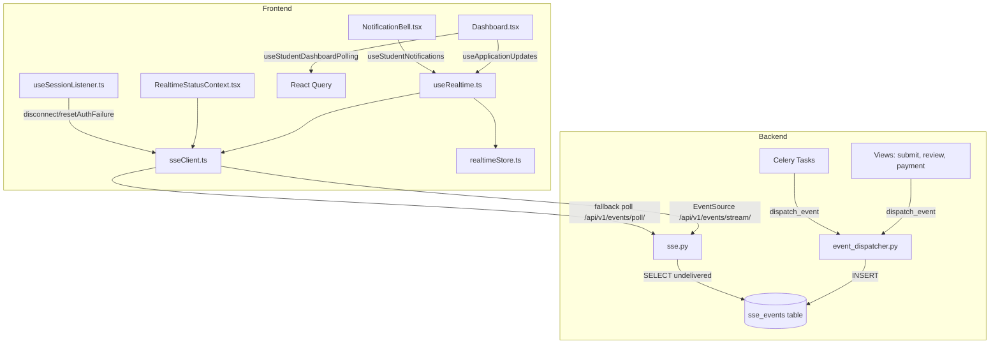
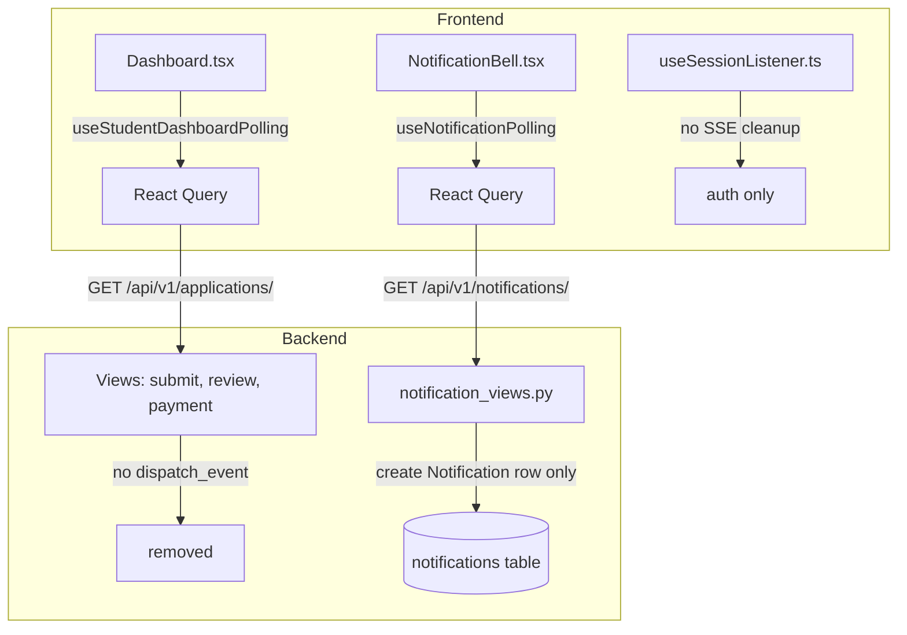

# Design Document: SSE Removal & Simplification

## Overview

This design covers the complete removal of the Server-Sent Events (SSE) infrastructure from the MIHAS platform and its replacement with simple React Query polling. The SSE system spans ~2,150 lines across backend and frontend, includes a dedicated Postgres table, two Celery Beat tasks, and a complex frontend client — all to deliver realtime updates that only two of five dispatched event types actually consume. The system causes 503 errors on Koyeb and floods the browser console with retry attempts.

The replacement strategy is minimal: the Dashboard already has `useStudentDashboardPolling` with fingerprint-based deduplication, and the notification bell just needs a new React Query polling hook. Everything else is pure deletion.

### Scope

- **Delete**: ~2,150 lines of SSE code (backend + frontend), 1 database table, 3 Celery Beat entries, 6+ test files
- **Modify**: Dashboard.tsx (remove SSE hooks), useSessionListener.ts (remove SSE cleanup), notification_views.py (remove dispatch_event calls), application views (remove dispatch_event calls), steering files
- **Create**: 1 new hook (`useNotificationPolling`), 1 SQL drop script, updated tests for the notification polling hook

### Design Rationale

| Decision | Rationale |
|----------|-----------|
| Delete SSE entirely rather than fix it | SSE causes 503s on Koyeb's infrastructure, adds complexity for minimal value, and only 2 of 5 event types are consumed |
| Keep existing `useStudentDashboardPolling` as-is | Already implements fingerprint deduplication, visibility-aware pausing, and `refetchOnWindowFocus` — no changes needed |
| Use React Query for notification polling | Consistent with the existing polling hook pattern, provides built-in `refetchInterval`, `refetchOnWindowFocus`, and error handling |
| Drop `sse_events` table via SQL script | The table was created via SQL script (`managed = False`), so it should be dropped the same way |
| Remove `notification_tasks.py` entirely | Both tasks (`send_deadline_reminders`, `send_stale_draft_reminders`) exist solely to call `dispatch_event` — they have no other side effects |

## Architecture

### Before (Current State)



### After (Target State)



### Deletion Inventory

#### Backend Files to Delete

| File | Lines | Purpose |
|------|-------|---------|
| `backend/apps/common/sse.py` | ~350 | SSE stream view, poll view, formatting helpers |
| `backend/apps/common/event_dispatcher.py` | ~100 | `dispatch_event()` function, event type validation |
| `backend/apps/common/event_urls.py` | ~10 | URL patterns for `/api/v1/events/` |
| `backend/apps/applications/notification_tasks.py` | ~80 | `send_deadline_reminders`, `send_stale_draft_reminders` |

#### Frontend Files to Delete

| File | Lines | Purpose |
|------|-------|---------|
| `apps/admissions/src/lib/sseClient.ts` | ~650 | SSE client with reconnection, backoff, auth failure detection |
| `apps/admissions/src/hooks/useRealtime.ts` | ~650 | SSE React hook, event subscription, polling fallback |
| `apps/admissions/src/contexts/RealtimeStatusContext.tsx` | ~170 | SSE connection status context provider |
| `apps/admissions/src/stores/realtimeStore.ts` | ~50 | Zustand store for SSE event deduplication |

#### Backend Test Files to Delete

| File | Purpose |
|------|---------|
| `backend/tests/property/test_event_dispatcher.py` | Property tests for `dispatch_event` round-trip, type validation, eviction cap |
| `backend/tests/property/test_sse_delivery.py` | Property tests for SSE event delivery completeness, ordering, Last-Event-ID |
| `backend/tests/property/test_event_cleanup.py` | Property tests for `cleanup_sse_events_task` |

#### Frontend Test Files to Delete

| File | Purpose |
|------|---------|
| `apps/admissions/tests/property/sseAuthFailureStopsReconnect.property.test.ts` | SSE auth failure property test |
| `apps/admissions/tests/property/sseAuthFailureDispatchesEvent.property.test.ts` | SSE auth failure event dispatch test |
| `apps/admissions/tests/property/sseAuthFailureResetRoundTrip.property.test.ts` | SSE auth failure reset round-trip test |
| `apps/admissions/tests/property/sseMaxRetriesCap.property.test.ts` | SSE max retries cap test |
| `apps/admissions/tests/property/sseNoProbeAfterAuthFailed.property.test.ts` | SSE no-probe-after-auth-failed test |
| `apps/admissions/tests/property/sseBackoff.property.test.ts` | SSE backoff formula test |
| `apps/admissions/tests/unit/sse-backoff.test.ts` | SSE backoff unit test |
| `apps/admissions/tests/unit/realtimeStatusContext.test.tsx` | RealtimeStatusContext unit test |
| `apps/admissions/tests/unit/realtime-dispatch.test.ts` | Realtime dispatch unit test |
| `apps/admissions/tests/unit/sseNoProbeAfterAuthFailed.test.ts` | SSE no-probe unit test |

## Components and Interfaces

### New Component: `useNotificationPolling` Hook

Location: `apps/admissions/src/hooks/useNotificationPolling.ts`

This is the only new code in the entire spec. It replaces the SSE-based notification delivery in `useStudentNotifications` with a simple React Query polling hook.

```typescript
interface UseNotificationPollingOptions {
  enabled?: boolean
  pollingInterval?: number  // default: 60_000 (60 seconds)
}

interface UseNotificationPollingReturn {
  notifications: StudentNotification[]
  unreadCount: number
  isLoading: boolean
  error: Error | null
  markRead: (id: string) => Promise<void>
  markAllRead: () => Promise<void>
  deleteNotification: (id: string) => Promise<void>
  refresh: () => void
}
```

Key behaviors:
- Polls `GET /api/v1/notifications/` at 60-second intervals via React Query `refetchInterval`
- Uses `refetchOnWindowFocus: true` for immediate refresh on tab focus
- Pauses polling when tab is hidden for more than 5 minutes (same pattern as `useStudentDashboardPolling`)
- Computes `unreadCount` from the notification list client-side
- Exposes `markRead`, `markAllRead`, `deleteNotification` that call existing notification service endpoints and invalidate the query cache
- Uses query key `['student-notifications', userId]`

### Modified Component: `Dashboard.tsx`

Changes:
- Remove `import { useApplicationUpdates } from '@/hooks/useRealtime'`
- Remove `import { getDefaultSSEClient } from '@/lib/sseClient'`
- Remove the `useApplicationUpdates(...)` subscription block
- Remove the `isSSEAuthFailed` memo that calls `getDefaultSSEClient().isAuthFailed()`
- Keep `useStudentDashboardPolling` exactly as-is — it already handles all data freshness

### Modified Component: `useSessionListener.ts`

Changes:
- Remove `import { getDefaultSSEClient } from '@/lib/sseClient'`
- Remove the `try { const sseClient = getDefaultSSEClient(); sseClient.disconnect(); sseClient.resetAuthFailure() } catch {}` block from `signOut`
- All other signOut behavior (CSRF clear, query nulling, cache clear, secure storage, redirect keys, auth event, broadcast, navigation) remains unchanged

### Modified Component: `AuthenticatedRouteShell.tsx`

Changes:
- Remove `import { RealtimeStatusProvider } from '@/contexts/RealtimeStatusContext'`
- Remove the `<RealtimeStatusProvider>` wrapper from the component tree

### Modified Component: `NotificationBell.tsx`

Changes:
- Replace `import { useStudentNotifications } from '@/hooks/useStudentNotifications'` with `import { useNotificationPolling } from '@/hooks/useNotificationPolling'`
- Wire up the new hook's return values (same shape, so minimal UI changes)

### Modified Component: `NotificationSettings.tsx`

Changes:
- Replace `useStudentNotifications` import with `useNotificationPolling`
- Remove any SSE connection status display (polling status can be derived from React Query state)

### Modified Backend: `views.py` (applications)

Changes:
- Remove `from apps.common.event_dispatcher import dispatch_event`
- Remove all 4 `dispatch_event(...)` calls in `SubmitApplicationView`, `ReviewApplicationView`, and payment-related views
- The views continue to create `Notification` model rows via the notification service — only the SSE event dispatch is removed

### Modified Backend: `notification_views.py`

Changes:
- Remove `from apps.common.event_dispatcher import dispatch_event`
- Remove the `dispatch_event(...)` call in `NotificationSendView.post()`
- The view continues to create `Notification` rows in the database — the `GET /api/v1/notifications/` endpoint is unaffected

### Modified Backend: `models.py` (common)

Changes:
- Remove the `SSEEvent` model class

### Modified Backend: `config/urls.py`

Changes:
- Remove `path("api/v1/events/", include("apps.common.event_urls"))`

### Modified Backend: `config/settings/base.py`

Changes:
- Remove `"cleanup-sse-events"` entry from `CELERY_BEAT_SCHEDULE`
- Remove `"send-deadline-reminders"` entry from `CELERY_BEAT_SCHEDULE`
- Remove `"send-stale-draft-reminders"` entry from `CELERY_BEAT_SCHEDULE`

### Modified Backend: `tasks.py` (common)

Changes:
- Remove `cleanup_sse_events_task` function

### Modified Frontend Tests: `auditProductionBugCondition.property.test.ts`

Changes:
- Remove or rewrite "Bug 3 — SSE state resets on logout" test block. Since SSE is being removed, the bug condition no longer applies. The test should be removed entirely — the signOut flow will be validated by checking that it no longer references SSE.

### Modified Frontend Tests: `auditProductionPreservation.property.test.ts`

Changes:
- Remove the SSE reconnection preservation tests that read `sseClient.ts` source code (the file won't exist)

### New SQL Script: `backend/scripts/drop_sse_events_table.sql`

```sql
-- Drop the sse_events table (created via SQL script, not Django migrations)
-- Execute via Neon MCP or database console
DROP TABLE IF EXISTS sse_events;
```

## Data Models

### Removed: `SSEEvent` Model

The `SSEEvent` model in `backend/apps/common/models.py` and its backing `sse_events` Postgres table are removed entirely. The model has `managed = False`, so Django migrations are not involved — the table is dropped via SQL script.

### Unchanged: `Notification` Model

The existing `Notification` model (used by `GET /api/v1/notifications/`) remains unchanged. It continues to store notification rows created by admin actions. The only change is that notifications are no longer also dispatched as SSE events — they are only stored in the `notifications` table and fetched via polling.

### Unchanged: Dashboard Polling Data

The `useStudentDashboardPolling` hook continues to fetch from `GET /api/v1/applications/` with the same `StudentDashboardData` shape. No data model changes.

### New: Notification Polling Query Cache

The `useNotificationPolling` hook uses React Query with key `['student-notifications', userId]`. The cached data shape matches the existing `GET /api/v1/notifications/` response envelope:

```typescript
{
  success: true,
  data: StudentNotification[]  // existing type from @/types/notifications
}
```


## Correctness Properties

*A property is a characteristic or behavior that should hold true across all valid executions of a system — essentially, a formal statement about what the system should do. Properties serve as the bridge between human-readable specifications and machine-verifiable correctness guarantees.*

### Property 1: Celery Beat schedule preserves non-SSE entries

*For any* Celery Beat schedule entry that is not SSE-related (`check_uptime_task`, `cleanup_audit_logs_task`, `poll_pending_payments_task`, `intake_manager_task`, `keep_alive_task`, `keep_alive_ping_task`, `cleanup_csrf_tokens_task`), the entry should still be present in `CELERY_BEAT_SCHEDULE` after the SSE entries are removed, with its task path and schedule unchanged.

**Validates: Requirements 2.3**

### Property 2: Dashboard fingerprint deduplication prevents redundant updates

*For any* two consecutive polling responses from `GET /api/v1/applications/`, if the application IDs, statuses, and payment statuses are identical (same fingerprint), then the `onDataChange` callback should not fire. If any field differs (different fingerprint), the callback should fire exactly once.

**Validates: Requirements 5.2**

### Property 3: Notification unread count matches unread notifications

*For any* list of `StudentNotification` objects returned by `GET /api/v1/notifications/`, the `unreadCount` computed by `useNotificationPolling` should equal the number of notifications where `is_read` is `false`.

**Validates: Requirements 6.2**

### Property 4: Notification polling pauses when tab is hidden beyond threshold

*For any* duration `d` in milliseconds that the browser tab has been hidden, if `d >= 300000` (5 minutes), then the `refetchInterval` function should return `false` (polling paused). If `d < 300000`, the `refetchInterval` should return a positive number (polling continues at doubled interval).

**Validates: Requirements 6.5**

### Property 5: SignOut flow preserves all non-SSE cleanup steps

*For any* execution of the `signOut` callback, the function should perform all of the following steps: clear the CSRF token, null out the session query data, null out the profile query data, call `queryClient.clear()`, clear secure storage, remove redirect keys, dispatch the `authSignedOut` event, broadcast logout, and navigate to the sign-in route. None of these steps should be removed when SSE cleanup is deleted.

**Validates: Requirements 7.2**

## Error Handling

### Backend

- **Removed dispatch_event calls**: Views that previously called `dispatch_event()` after creating notifications or updating application status will simply skip that call. The notification/status change itself is unaffected — only the SSE event dispatch is removed.
- **Missing SSE endpoints**: After removing the `/api/v1/events/` URL pattern, any request to `/api/v1/events/stream/` or `/api/v1/events/poll/` will return Django's standard 404 response. No custom error handling needed.
- **SQL drop script**: Uses `DROP TABLE IF EXISTS` to be idempotent — safe to run multiple times.

### Frontend

- **Notification polling errors**: `useNotificationPolling` relies on React Query's built-in error handling. Failed polls are retried automatically by React Query's default retry logic (3 retries with exponential backoff). The hook exposes an `error` field for UI display.
- **Network failures during polling**: React Query handles network errors gracefully — polling continues at the configured interval, and stale data remains displayed until a successful fetch.
- **Tab visibility transitions**: When a tab becomes visible after being hidden, React Query's `refetchOnWindowFocus` triggers an immediate refetch, ensuring fresh data regardless of how long the tab was hidden.

## Testing Strategy

### Dual Testing Approach

This spec uses both unit tests and property-based tests:

- **Unit tests**: Verify specific examples like "SSE files no longer exist", "signOut no longer imports sseClient", "Celery Beat schedule has exactly N entries"
- **Property tests**: Verify universal properties across generated inputs using fast-check (frontend) and hypothesis (backend)

### Property-Based Testing Configuration

- **Frontend**: fast-check (already in use in the project)
- **Backend**: hypothesis (already in use in the project)
- Each property test runs a minimum of 100 iterations
- Each property test is tagged with a comment referencing the design property
- Tag format: `Feature: sse-removal-simplification, Property {number}: {property_text}`
- Each correctness property is implemented by a single property-based test

### Test Plan

#### Property Tests (New)

| Property | Library | Location | Description |
|----------|---------|----------|-------------|
| Property 1 | hypothesis | `backend/tests/property/` | Generate random subsets of Celery Beat entries, verify non-SSE entries are preserved |
| Property 2 | fast-check | `apps/admissions/tests/property/` | Generate random application lists, verify fingerprint deduplication logic |
| Property 3 | fast-check | `apps/admissions/tests/property/` | Generate random notification lists with varying `is_read` states, verify unread count |
| Property 4 | fast-check | `apps/admissions/tests/property/` | Generate random hidden durations, verify polling pause/continue behavior |
| Property 5 | fast-check | `apps/admissions/tests/property/` | Read signOut source, verify all required cleanup steps are present |

#### Unit Tests (New/Modified)

| Test | Location | Description |
|------|----------|-------------|
| Notification polling hook defaults | `apps/admissions/tests/unit/` | Verify 60s default interval, refetchOnWindowFocus enabled |
| SSE files removed | `apps/admissions/tests/unit/` | Verify deleted files no longer exist on disk |
| SignOut has no SSE imports | `apps/admissions/tests/unit/` | Verify useSessionListener.ts does not import sseClient |
| Dashboard has no SSE imports | `apps/admissions/tests/unit/` | Verify Dashboard.tsx does not import useRealtime or sseClient |

#### Tests to Delete

All SSE-specific test files listed in the Architecture section's deletion inventory are removed. The `auditProductionBugCondition.property.test.ts` Bug 3 (SSE logout) test block is removed. The `auditProductionPreservation.property.test.ts` SSE reconnection tests are removed.

#### Tests to Update

- `backend/tests/unit/test_review_notifications.py` — remove `dispatch_event` patches
- `backend/tests/unit/test_application_student_flow_views.py` — remove `dispatch_event` patches
- `apps/admissions/tests/unit/page-verification/student-dashboard.test.tsx` — remove SSE-related mocks
- `apps/admissions/tests/property/auditProductionBugCondition.property.test.ts` — remove Bug 3 block
- `apps/admissions/tests/property/auditProductionPreservation.property.test.ts` — remove SSE reconnection tests
