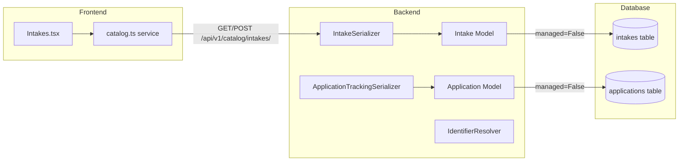

# Design Document: System Alignment Audit

## Overview

This design addresses targeted misalignments between the Django backend, Neon Postgres database, and React frontend in the MIHAS admissions platform. The audit found that the backend models and serializers are largely correct, but the frontend catalog service and Intakes admin page use invented field names (`total_capacity`, `available_spots`) that don't match the API. Additionally, the `ApplicationTrackingSerializer` is missing the `institution` field, and the `Application` model has `max_length` values too short for real-world text-FK data.

The changes are minimal and surgical — no database migrations, no new tables, no backend model restructuring. The Intake model and IntakeSerializer are already correct. The work is concentrated in:

1. Adding `institution` to `ApplicationTrackingSerializer`
2. Fixing frontend `Intake` interface and normalizer to use `max_capacity` instead of `total_capacity`
3. Removing `available_spots` as an API field — compute it client-side
4. Widening `Application` model `max_length` for `program`, `intake`, `institution` fields
5. Updating tests to match corrected field names

## Architecture

The system follows a three-tier architecture with unmanaged Django models:



All changes flow through existing layers. No new endpoints, models, or services are introduced.

### Change Impact Map

| Layer | File | Change |
|-------|------|--------|
| Backend serializer | `backend/apps/applications/serializers.py` | Add `institution` to `ApplicationTrackingSerializer.fields` |
| Backend model | `backend/apps/applications/models.py` | Widen `program` to 255, `intake` to 100, `institution` to 255 `max_length` |
| Frontend service | `apps/admissions/src/services/catalog.ts` | Replace `total_capacity`/`available_spots` with `max_capacity`, compute available spots |
| Frontend page | `apps/admissions/src/pages/admin/Intakes.tsx` | Replace `total_capacity`/`available_spots` with `max_capacity`, compute available spots inline |
| Tests | Various | Update field name references |

## Components and Interfaces

### 1. ApplicationTrackingSerializer (Backend Fix)

Current state — missing `institution`:
```python
fields = [
    "application_number", "public_tracking_code", "status",
    "payment_status", "program", "intake", "created_at", "submitted_at",
]
```

Target state — add `institution`:
```python
fields = [
    "application_number", "public_tracking_code", "status",
    "payment_status", "program", "intake", "institution",
    "created_at", "submitted_at",
]
```

The serializer is a read-only `ModelSerializer` on `Application`. The `institution` field is a `CharField` on the model, so it passes through as-is — no resolution or transformation needed. This matches Requirement 1.

### 2. Application Model max_length Fix (Backend Fix)

Current state:
```python
program = models.CharField(max_length=50)
intake = models.CharField(max_length=50)
institution = models.CharField(max_length=50)
```

Target state:
```python
program = models.CharField(max_length=255)
intake = models.CharField(max_length=100)
institution = models.CharField(max_length=255)
```

Since `managed = False`, this only affects Django-side validation (serializer `max_length` defaults). The DB columns are `varchar NOT NULL` with no length constraint in Postgres. Real data already contains values longer than 50 chars (e.g. "Diploma in Clinical Medicine" = 27 chars, "Kalulushi Training Centre" = 25 chars). The wider limits prevent serializer validation rejections on legitimate data.

### 3. Frontend Intake Interface (Frontend Fix)

Current `Intake` interface in `catalog.ts`:
```typescript
export interface Intake {
  id: string
  name: string
  year: number
  start_date: string
  end_date: string
  application_deadline: string
  total_capacity: number      // ← wrong name
  available_spots?: number    // ← computed, not from API
  is_active?: boolean
}
```

Target interface:
```typescript
export interface Intake {
  id: string
  name: string
  year: number
  start_date: string
  end_date: string
  application_deadline: string
  max_capacity: number         // ← matches API
  current_enrollment?: number  // ← from API
  is_active?: boolean
}
```

The `normalizeIntake` function currently maps `max_capacity → total_capacity` and computes `available_spots`. After the fix, it will pass `max_capacity` through directly and include `current_enrollment`. Available spots are computed at render time as `max_capacity - (current_enrollment ?? 0)`.

### 4. Frontend IntakeFormData (Frontend Fix)

Current `IntakeFormData`:
```typescript
type IntakeFormData = {
  total_capacity: number
  available_spots?: number
}
```

Target:
```typescript
type IntakeFormData = {
  max_capacity: number
}
```

The `buildIntakePayload` function currently does `max_capacity: data.total_capacity`. After the fix, it will do `max_capacity: data.max_capacity` — a direct pass-through.

### 5. Intakes.tsx Page (Frontend Fix)

The Zod schema, form interface, form fields, table columns, and mutation calls all reference `total_capacity` and `available_spots`. These will be updated to use `max_capacity` and compute available spots inline as `max_capacity - (current_enrollment ?? 0)`.

## Data Models

### Intake (No DB Change)

The database `intakes` table schema is already correct:

| Column | Type | Notes |
|--------|------|-------|
| `max_capacity` | integer | Exists in DB and model |
| `current_enrollment` | integer | Exists in DB and model |
| `semester` | varchar | Exists in DB and model |
| `application_start_date` | date | Exists in DB and model |

No columns named `total_capacity` or `available_spots` exist in the database. The Django `Intake` model and `IntakeSerializer` are already correct.

### Application (Model-Only Change)

| Field | Current max_length | Target max_length | Reason |
|-------|-------------------|-------------------|--------|
| `program` | 50 | 255 | Full program names like "Diploma in Clinical Medicine" |
| `intake` | 50 | 100 | Intake names like "July 2026 Intake" |
| `institution` | 50 | 255 | Full institution names like "Kalulushi Training Centre" |

The DB columns are `varchar NOT NULL` — Postgres does not enforce a length limit on `varchar` without an explicit constraint, so this is purely a Django validation change. No migration needed.

### ApplicationTrackingSerializer Response Shape

Current:
```json
{
  "application_number": "APP-20260416-ABCD1234",
  "public_tracking_code": "TRK-ABCDEF123456",
  "status": "submitted",
  "payment_status": "verified",
  "program": "Diploma in Clinical Medicine",
  "intake": "July 2026 Intake",
  "created_at": "2026-04-16T10:00:00Z",
  "submitted_at": "2026-04-16T12:00:00Z"
}
```

After fix — adds `institution`:
```json
{
  "application_number": "APP-20260416-ABCD1234",
  "public_tracking_code": "TRK-ABCDEF123456",
  "status": "submitted",
  "payment_status": "verified",
  "program": "Diploma in Clinical Medicine",
  "intake": "July 2026 Intake",
  "institution": "Kalulushi Training Centre",
  "created_at": "2026-04-16T10:00:00Z",
  "submitted_at": "2026-04-16T12:00:00Z"
}
```


## Correctness Properties

*A property is a characteristic or behavior that should hold true across all valid executions of a system — essentially, a formal statement about what the system should do. Properties serve as the bridge between human-readable specifications and machine-verifiable correctness guarantees.*

### Property 1: Institution field pass-through identity

*For any* string value stored in an Application's `institution` field (whether a code like "KATC" or a full name like "Kalulushi Training Centre"), serializing the application through `ApplicationTrackingSerializer` should return that exact string unchanged in the `institution` key of the output.

**Validates: Requirements 1.2, 1.3**

### Property 2: Tracking serializer exposes only non-sensitive fields

*For any* Application instance, the set of field names returned by `ApplicationTrackingSerializer` should be a subset of `{application_number, public_tracking_code, status, payment_status, program, intake, institution, created_at, submitted_at}` and should NOT contain any of `{email, phone, nrc_number, passport_number, date_of_birth, sex, address_line_1, address_line_2, postal_code, next_of_kin_name, next_of_kin_phone, user_id, admin_feedback, eligibility_notes}`.

**Validates: Requirements 1.1, 1.4**

### Property 3: normalizeIntake preserves max_capacity without renaming

*For any* valid raw intake object with a numeric `max_capacity` field, calling `normalizeIntake` should produce an output object that has a `max_capacity` property equal to the input value, and should NOT have a `total_capacity` property.

**Validates: Requirements 3.4, 9.4, 9.5**

### Property 4: buildIntakePayload maps max_capacity directly

*For any* intake form data with a numeric `max_capacity` field, calling `buildIntakePayload` should produce a payload object where `max_capacity` equals the input `max_capacity` value, and the payload should NOT contain a `total_capacity` key.

**Validates: Requirements 3.2, 3.5, 9.6**

### Property 5: Available spots computation is correct

*For any* non-negative integers `max_capacity` and `current_enrollment`, the available spots should equal `max(max_capacity - current_enrollment, 0)`. This computation should never produce a negative number.

**Validates: Requirements 3.3**

### Property 6: Capacity validation rejects non-positive values

*For any* integer value ≤ 0, the intake capacity validation schema should reject it. *For any* positive integer, the schema should accept it as a valid capacity.

**Validates: Requirements 3.6**

### Property 7: Tracking code pattern accepts all documented formats

*For any* string matching one of the documented formats (APP-YYYYMMDD-XXXXXXXX, MIHAS+9digits, KATC+9digits, TRK-12alphanum, TRK+5-6alphanum), the `TRACKING_CODE_PATTERN` regex should match. *For any* random string not matching these formats, the regex should not match.

**Validates: Requirements 6.4**

## Error Handling

### Backend

- `ApplicationTrackingSerializer` is read-only. If `institution` is `None` or empty on a legacy record, the serializer returns `null` or `""` — no error raised.
- The `Application` model `max_length` widening only affects Django-side validation. If a value exceeds the new limit, the serializer returns a standard DRF validation error. The DB has no length constraint to violate.
- The `ApplicationTrackView` already handles `DoesNotExist` with a 404 response. Adding `institution` to the serializer does not change error paths.

### Frontend

- `normalizeIntake` already handles missing/null fields with `toNumber(record.max_capacity, 0)` fallback. After the fix, if `max_capacity` is missing from the API response, it defaults to 0.
- `current_enrollment` defaults to 0 when missing, so available spots computation is safe: `max_capacity - 0 = max_capacity`.
- The Zod schema validates `max_capacity` as a positive integer. Invalid form input is caught before the API call.

## Testing Strategy

### Dual Testing Approach

Both unit tests and property-based tests are used:

- **Unit tests**: Verify specific examples (e.g., serializer field lists, model field attributes, static code checks for dead field references)
- **Property tests**: Verify universal properties across generated inputs (e.g., normalizeIntake behavior, buildIntakePayload output, tracking code pattern matching)

### Property-Based Testing Configuration

- **Backend**: `hypothesis` (already in use) — minimum 100 examples per property
- **Frontend**: `fast-check` (already in use) — minimum 100 iterations per property
- Each property test must reference its design document property with a tag comment:
  - Format: `Feature: system-alignment-audit, Property {number}: {property_text}`

### Test Plan

| Property | Layer | Library | Test Location |
|----------|-------|---------|---------------|
| Property 1: Institution pass-through | Backend | hypothesis | `backend/tests/property/` |
| Property 2: Safe fields only | Backend | hypothesis | `backend/tests/property/` |
| Property 3: normalizeIntake preserves max_capacity | Frontend | fast-check | `apps/admissions/tests/property/` |
| Property 4: buildIntakePayload maps max_capacity | Frontend | fast-check | `apps/admissions/tests/property/` |
| Property 5: Available spots computation | Frontend | fast-check | `apps/admissions/tests/property/` |
| Property 6: Capacity validation | Frontend | fast-check | `apps/admissions/tests/property/` |
| Property 7: Tracking code pattern | Backend | hypothesis | `backend/tests/property/` |

### Unit Test Coverage

| Check | Layer | Test Location |
|-------|-------|---------------|
| Intake model has max_capacity, semester, application_start_date fields; no total_capacity/available_spots | Backend | `backend/tests/unit/` |
| Application model max_length values (program≥255, intake≥100, institution≥255) | Backend | `backend/tests/unit/` |
| ApplicationTrackingSerializer.Meta.fields includes institution | Backend | `backend/tests/unit/` |
| ApplicationSerializer and ApplicationListSerializer include institution | Backend | `backend/tests/unit/` |
| Application model docstring documents legacy unmapped columns | Backend | `backend/tests/unit/` |
| Frontend Intake interface uses max_capacity, not total_capacity | Frontend | `apps/admissions/tests/unit/` |
| No references to total_capacity or available_spots as API field names in active code | Frontend | `apps/admissions/tests/unit/` |
