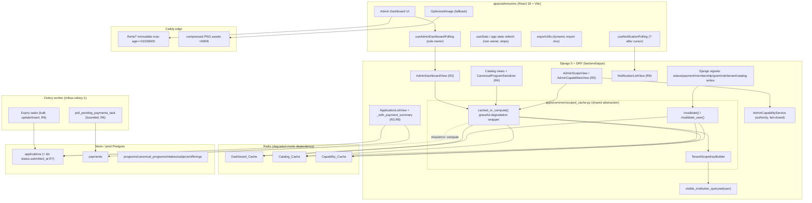
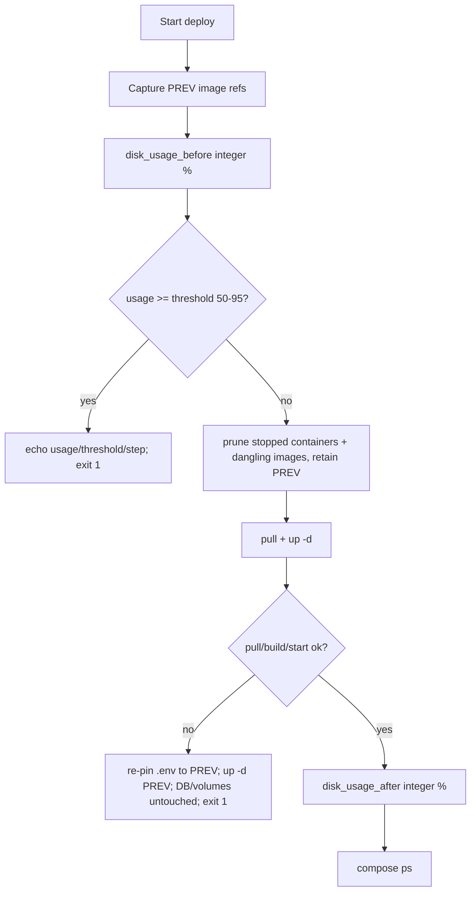

# Design Document

## Overview

This feature hardens the MIHAS/Beanola platform for production operation on the
self-hosted EC2 Docker Compose stack (Neon authoring DB, Celery + Redis, Caddy
edge) by removing six concrete performance and reliability pressure points
**without changing any observable business behavior**. It is a performance- and
reliability-only change set: every endpoint keeps its `{"success": true,
"data": ...}` envelope, its field names/types/nesting, its authorization
decisions, and its tenant-isolation guarantees.

The work spans backend (Django 5 + DRF), frontend (`apps/admissions`), CI/CD
(`.github/workflows/deploy.yml`), infrastructure (Caddy, an additive SQL index
script under `backend/scripts/`), and operational runbooks. It maps to the 13
approved requirements:

| Req | Area | Surface |
|-----|------|---------|
| R1 | Deploy-time operational risk controls | `.github/workflows/deploy.yml`, runbook |
| R2 | Admin dashboard aggregate caching + single conditional-count query | `AdminDashboardView`, `Dashboard_Cache` |
| R3 | Application list payment summary (kill 7 correlated subqueries) | `_with_payment_summary`, `ApplicationPaymentSummaryMixin` |
| R4 | Catalog data caching + offerings prefetch fix | catalog views/serializers, `Catalog_Cache` |
| R5 | Tenant/admin scope + capability caching | `AdminScopeView`/`AdminCapabilitiesView`, `Capability_Cache` |
| R6 | Celery payment poll + expiry task efficiency | `poll_pending_payments_task`, expiry tasks |
| R7 | Composite index on `applications(status, submitted_at)` | `backend/scripts/` SQL |
| R8 | List serializer grade summary memoization | `ApplicationListSerializer` |
| R9 | Notification cursor pagination | `NotificationListView` |
| R10 | Frontend static asset + bundle optimization | `apps/admissions/public/*`, Caddy, export utils |
| R11 | Admin dashboard polling consolidation | `useAdminDashboardPolling`/`useStats` |
| R12 | Verification gates | CI + local gates |
| R13 | Behavior/contract/tenant-isolation preservation (cross-cutting) | all changed surfaces |

### Design Goals

1. **Zero business-behavior change.** Identical inputs produce identical
   response envelopes, computed field values, authorization decisions, and
   persisted state before and after this feature (R13.1, R13.2). Every caching
   path is observably equivalent to recomputation.
2. **Tenant-scope-correct caching.** No cache introduced here may serve one
   tenant's data to another. Every cache key embeds the resolved tenant scope
   (or user id), and a key mismatch is treated as a miss that recomputes
   (R2.2, R2.7, R4.5, R5, R13.3, R13.4).
3. **Graceful degradation.** Caching is a Redis-tier-degraded dependency
   (per `docs/redis-dependency-tiers.md`). Every cache read/write failure or
   backend outage falls back to direct computation and never surfaces a cache
   error to the caller (R2.8, R4.7).
4. **Fail-closed authority.** Caching never weakens authorization. A
   `CapabilityResolutionError` must neither store nor serve a cache entry and
   must remove any existing entry (R5.3, R13.3).
5. **Additive and reversible.** Schema changes are additive SQL under
   `backend/scripts/` (`managed=False` convention); every backend cache and the
   frontend bundle changes ship behind feature flags defaulting **off**, so the
   pre-feature code path remains in effect until each flag is flipped, and
   rollback is a flag flip + redeploy with no schema revert (R7, Rollout plan).
6. **Mobile-first preserved.** Frontend changes preserve 320px usability,
   ≥44×44px touch targets, no horizontal overflow, and the canonical truth map
   (R13.7).

### Key Design Decisions

- **One shared cache abstraction** (`apps/common/scoped_cache.py`) rather than
  three bespoke caches. It provides a tenant-scope-aware key builder and a
  graceful-degradation wrapper that computes-on-miss and computes-on-cache-error.
  Dashboard, catalog, and capability caches are thin callers of this layer. This
  mirrors the existing `apps/common/ai_cache.py` pattern (flag-gated, Django
  cache backend, never poison cache on soft failure, never raise on cache
  error) so the codebase stays consistent.
- **Payment summary**: replace the 7 correlated `Subquery` annotations with a
  single prefetch of the latest payment per application via `Prefetch` backed by
  a window-function (`ROW_NUMBER() OVER (PARTITION BY application_id ORDER BY
  ...)`) queryset, computing the summary in the serializer. Justification in
  the Components section.
- **Invalidation over long TTLs**: dashboard (30–60s) and capability (60s)
  caches are short-lived *and* explicitly invalidated by signals so staleness is
  bounded well under the requirement windows (5s dashboard, 1s capability).
- **Index** ships as `CREATE INDEX CONCURRENTLY IF NOT EXISTS` outside any
  transaction block, re-runnable, and explicitly does **not** index
  `institution_ref_id` (already covered by `institution_id`).

## Architecture

### Component Diagram



### The Shared Cache Abstraction Layer

A single module `backend/apps/common/scoped_cache.py` provides the foundation
for all three caches. It has two responsibilities:

**1. Tenant-scope-aware key builder (`TenantScopeKeyBuilder`)**

Builds deterministic, collision-free cache keys that embed the resolved tenant
scope so two distinct scopes can never share an entry (R2.2, R4.5, R13.3). The
scope dimensions are derived from `visible_institution_queryset(user)` and the
`AdminCapabilityService` result — never from raw role strings.

```python
def build_scope_signature(user) -> str:
    """Stable signature of the caller's resolved tenant scope.

    Composed of: user id, role, is_super_admin, all_access, the sorted tuple
    of in-scope institution ids (from visible_institution_queryset), and the
    selected/applied institution filter. SHA-256 hashed to bound key length.
    Two callers share a signature IFF all four scope attributes match (R2.2).
    """
```

Key shape per cache (see Data Models for the full schema):
`spc:<namespace>:<version>:<scope_signature>[:<sub_key>]`. The embedded
`scope_signature` is the cross-tenant guard: on read, the wrapper recomputes the
expected signature for the requesting user and only serves an entry whose key
matches exactly; any mismatch is treated as absent and recomputed (R2.7,
R13.4).

**2. Graceful-degradation wrapper (`cached_or_compute`)**

```python
def cached_or_compute(namespace, scope_signature, compute, *, ttl,
                      sub_key=None, enabled=True):
    """Return cached value for the scoped key, else compute + store.

    - enabled=False (flag off): call compute() every time, never touch cache
      (pre-feature behaviour).
    - cache.get raises / backend down: log, treat as miss, compute directly,
      return the computed value WITHOUT surfacing a cache error (R2.8, R4.7).
    - miss: compute(), store with ttl; cache.set failure is swallowed.
    - compute() result is returned regardless of whether the store succeeds.
    """
```

This is the computes-on-miss / computes-on-cache-error contract. It guarantees
the cached path is observably identical to the recompute path (R13.1, R13.2),
and that Redis degradation never breaks a request (consistent with
`docs/redis-dependency-tiers.md`).

**3. Invalidation helpers**

- `invalidate(namespace, scope_signature, sub_key=None)` — delete a scoped
  entry (catalog/dashboard).
- `invalidate_user(namespace, user_id)` — delete a user-scoped entry
  (capabilities).
- Because the Django cache API has no pattern-delete, dashboard/catalog entries
  carry a small per-scope **version token** (an integer stored at
  `spc:ver:<namespace>:<scope_signature>`); invalidation bumps the token, which
  changes the computed key for that scope so subsequent reads miss and recompute.
  This gives O(1) scope-wide invalidation without key enumeration and keeps the
  bound well under the 5s/1s windows (R2.4, R4.3, R5.4–5.6).

### Plug-in Points

- **Dashboard (R2)**: `AdminDashboardView.get` wraps its aggregate computation
  in `cached_or_compute(namespace="dash", scope_signature=..., ttl=45)`. The
  aggregate computation itself is refactored to a single conditional-count
  query (see Components).
- **Catalog (R4)**: catalog read views wrap their serialized payload in
  `cached_or_compute(namespace="cat", ...)`. The scope signature uses the
  host-resolved tenant scope; an unresolved scope forces the neutral Beanola
  context and bypasses tenant-scoped reuse (R4.6).
- **Capability/scope (R5)**: `AdminScopeView`/`AdminCapabilitiesView` wrap the
  shared `_build_capability_payload(user)` in
  `cached_or_compute(namespace="cap", scope_signature=user-id, ttl=60)`, with a
  fail-closed guard that never caches a `CapabilityResolutionError`.

## Components and Interfaces

### R1 — Deploy Workflow Hardening (`.github/workflows/deploy.yml`)

The current `deploy` job pulls images, runs `docker compose ... up -d`, then a
bare `docker image prune -f` with no disk gate and no rollback. The hardened
`deploy` job adds the following ordered steps inside the `appleboy/ssh-action`
script (all run on the Production_Host over SSH, `set -euo pipefail`):

1. **Capture previous image (rollback anchor)** — before changing `.env`, read
   the currently-running backend/frontend image refs into
   `PREV_BACKEND`/`PREV_FRONTEND` (from `docker compose ... config` or the
   existing `.env`). Retain them for rollback (R1.1, R1.5).
2. **Pre-deploy disk usage capture + threshold gate** — compute integer disk
   usage percent of the Docker data root:
   `USAGE=$(df --output=pcent / | tail -1 | tr -dc '0-9')`. Echo
   `disk_usage_before=${USAGE}%` to the run log (R1.3). Read
   `THRESHOLD=${DISK_THRESHOLD:-85}` and clamp to the inclusive range 50–95.
   If `USAGE >= THRESHOLD`, `echo` an error naming the measured usage, the
   threshold, and the step name, then `exit 1` (non-zero) **before** pull/build
   (R1.4).
3. **Prune retaining previous image** — prune stopped containers
   (`docker container prune -f`, R1.2) and dangling images, but **retain the
   immediately previous image** by not pruning tagged `PREV_*` refs (use
   `docker image prune -f` for dangling only — never `-a`, which would remove
   the rollback target) (R1.1).
4. **Pull / start with rollback trap** — wrap pull + `up -d` in a shell function;
   on any failure (pull, build, or container start), re-pin `.env` to
   `PREV_BACKEND`/`PREV_FRONTEND` and `docker compose ... up -d` the previous
   images, leaving the `postgres` volume and DB untouched (no `down -v`, no
   volume ops) (R1.5). Then `exit 1` naming the failed step (R1.6).
5. **Post-deploy disk usage capture** — recompute and echo
   `disk_usage_after=${USAGE}%` (R1.3).

A reusable input `DISK_THRESHOLD` (workflow `env`/`vars`, default 85) makes the
threshold configurable within 50–95.

**Backup/restore drill runbook (R1.7)**: extend
`docs/runbooks/database-backup-restore.md` with a documented drill that (a) takes
a backup via `deploy/backup-db.sh`, (b) restores into a scratch
container/database, and (c) **verifies row counts match** by comparing
`SELECT count(*)` per critical table (`applications`, `payments`,
`notifications`, `user_institution_memberships`) between source and restored DB,
failing the drill on any mismatch.



### R2 — Admin Dashboard Aggregate Caching + Single Conditional-Count Query

Two changes to `AdminDashboardView.get` (`backend/apps/accounts/admin_user_views.py`):

**(a) Single conditional-count query.** The current view issues 12+ separate
`.count()`/`values_list().annotate(Count)` calls (status counts, today_created,
today_submitted, today/week/month activity, total/active users, pending
payments/documents, upcoming interviews). The status + time-bucketed application
aggregates are collapsed into **one** aggregate query over the already-scoped
`app_queryset` using conditional aggregation:

```python
from django.db.models import Count, Q
agg = app_queryset.aggregate(
    total=Count("id"),
    pending=Count("id", filter=Q(status="submitted") | Q(status="under_review")),
    approved=Count("id", filter=Q(status="approved")),
    # ...one Count(filter=) per status bucket...
    today=Count("id", filter=Q(activity_at__gte=today_start)),
    week=Count("id", filter=Q(activity_at__gte=week_start)),
    month=Count("id", filter=Q(activity_at__gte=month_start)),
)
```

`activity_at` is the existing `Coalesce("submitted_at","updated_at","created_at")`
annotation. This yields the **identical** values currently produced field by
field (R13.2). The non-application aggregates that target other tables
(users, payments, documents, interviews) remain but the application-count block
collapses from many queries to one, bringing the dashboard's count/aggregate
query total to **≤3** (R2.5, R2.6).

**(b) Aggregate caching.** The full aggregate payload is wrapped in
`cached_or_compute(namespace="dash", scope_signature=build_scope_signature(user),
ttl=45)` (TTL within 30–60s, R2.3). On hit within TTL, zero count/aggregate
queries run (R2.1). The `scope_signature` embeds user scope + institution filter
+ role + selected tenant; a key mismatch recomputes scoped to the requester and
never serves cross-tenant values (R2.2, R2.7, R13.3, R13.4). Backend-down →
direct DB computation, no error surfaced (R2.8).

**(c) Invalidation within 5s.** `post_save`/`post_delete` signals on
`Application` (status change), `Payment`, `UserInstitutionMembership`,
`AccessGrant`, and `Institution` call `invalidate("dash", scope_signature)` for
the affected scope by bumping the per-scope version token, committed via
`transaction.on_commit` so the bump lands right after the change commits (R2.4).

### R3 — Application List Payment Summary Optimization

**Current state**: `_with_payment_summary` (`backend/apps/applications/_view_helpers.py`)
annotates **7 correlated `Subquery` expressions** (`payment_summary_method`,
`_amount`, `_currency`, `_reference`, `_receipt_number`, `_paid_amount`,
`_paid_at`), each a correlated subquery on `payments` per application row.

**Chosen approach — prefetch latest payment per application via a window-function
`Prefetch`.** Justification:

- A single `Prefetch("payment_set", queryset=latest_per_app_qs)` runs **one**
  extra query for the whole page regardless of page size (query count does not
  grow with rows, R3.4), versus 7 correlated subqueries that the planner must
  evaluate per row.
- The serializer already has a prefetch-aware path (`_get_payment_summary` reads
  `obj._prefetched_objects_cache["payment_set"]`) and computes the summary in
  Python, so this reuses tested logic and preserves **identical** field values,
  including the verified-state equivalence set (`verified`, `paid`, `successful`,
  `force_approved` all treated as the same verified value via
  `RECEIPT_ELIGIBLE_STATUSES`) and `deferred` kept distinct (R3.3), plus
  `.distinct()`-safe behavior.
- A window-function queryset (`ROW_NUMBER() OVER (PARTITION BY application_id
  ORDER BY -updated_at, -created_at)` filtered to rank 1, plus a parallel rank
  for the latest *successful* payment) bounds the prefetch to the latest +
  latest-successful rows per application, so the Python summary derivation reads
  at most two rows per application.

The alternative (a single LATERAL/window annotate that keeps the 7 values on the
row) was rejected: it re-introduces seven scalar `Subquery` projections that the
ORM still emits as correlated subqueries on some plans, and it duplicates logic
that already lives, tested, in the serializer.

**Implementation**: `_with_payment_summary` is rewritten to attach the
window-bounded `Prefetch` instead of the 7 `Subquery` annotations and to **stop
emitting** `payment_summary_*` annotations. `_get_payment_summary` already
prefers the prefetched `payment_set`; with the annotations gone it computes the
summary from the prefetched rows (the no-payment branch returns the existing
no-payment summary, R3.5). Result: zero of the 7 correlated subqueries (R3.1),
constant query count per page (R3.4), identical output (R3.3, R3.6).

### R4 — Catalog Caching + Offerings Prefetch Fix

**(a) Offerings prefetch fix.** `CanonicalProgramSerializer.get_available_offerings`
(`backend/apps/catalog/serializers.py`) currently issues a per-object `Program`
query. The view that lists canonical programs will build a single
`Prefetch("program_set", queryset=Program.objects.select_related("institution")
.filter(is_active=True, offering_status="active"))` (optionally narrowed by the
resolved institution), and `get_available_offerings` resolves offerings from the
prefetched set (filtering by `intake`/`institution` in Python) rather than a
per-object query (R4.4). Output ordering (`assignment_priority`, `name`) and the
neutral-vs-tenant grouping are preserved.

**(b) Catalog caching.** Catalog read responses (programs, canonical programs,
intakes, subjects, assignment-safe responses) are wrapped in
`cached_or_compute(namespace="cat", scope_signature=..., ttl=450)` (TTL within
300–600s, R4.2). The scope signature embeds the resolved tenant scope id so a
cached response is reused only within the same tenant scope (R4.5). If the tenant
scope cannot be resolved, the request does not serve any tenant-scoped entry and
computes under the neutral Beanola context (R4.6). Cache read/write failure →
compute from catalog, no error surfaced (R4.7).

**(c) Invalidation before write returns.** Admin writes to programs, intakes,
subjects, offerings, fees, or institution assignments call
`invalidate("cat", affected_scope)` synchronously within the same request
(before the response returns), bumping the per-scope version token so the next
read recomputes (R4.3).

### R5 — Tenant/Admin Scope + Capability Caching

`_build_capability_payload(user)` (`backend/apps/accounts/admin_user_views.py`)
is the single source of truth for both `GET /api/v1/admin/scope/` and
`GET /api/v1/admin/capabilities/`. Both views wrap it:

```python
def _resolve_capability_payload(user):
    enabled = getattr(settings, "PERF_CACHE_CAPABILITIES", False)
    def compute():
        return _build_capability_payload(user)   # raises CapabilityResolutionError
    try:
        return cached_or_compute("cap", str(user.pk), compute, ttl=60, enabled=enabled)
    except CapabilityResolutionError:
        invalidate_user("cap", user.pk)   # R5.3: never store/serve; drop existing
        raise
```

- Per-user entry, TTL 60s; hit within 60s serves from cache (R5.1, R5.2).
- `CapabilityResolutionError` is caught so the wrapper never stores it, any
  existing entry is removed, and the view returns the existing fail-closed
  authorization error exposing zero capabilities and no tenant data (R5.3).
- Invalidation signals (`transaction.on_commit`, bound to ≤1s) on:
  - `Profile.role` change → `invalidate_user("cap", user_id)` (R5.4)
  - `UserInstitutionMembership`/`AccessGrant` create/update/delete →
    invalidate the affected user (R5.5)
  - `Institution.is_active` change → invalidate all users scoped to that tenant
    (resolved via active memberships) (R5.6)
- The stale-super-admin test (R5.7) asserts that after a demotion, the next
  scope/capabilities requests re-resolve and return zero `platform.*`
  capabilities, never a pre-change entry.

### R6 — Celery Payment Poll + Expiry Task Efficiency

`poll_pending_payments_task` (`backend/apps/documents/tasks.py`):

- **Bounded external work**: process verification with a per-run batch size of
  **≤10** payments (reduced from 50) OR a bounded `ThreadPoolExecutor(max_workers
  ≤5)` over the external Lenco calls (R6.1). The batch-of-10 approach is the
  default (simpler, no shared-DB-connection concerns in threads); the bounded
  pool is the documented alternative.
- **Per-call timeout + retries**: each external HTTPS verification applies a
  timeout ≤10s and ≤2 retries (R6.2). Implemented at the verification call
  boundary (the `requests`/Lenco client call), not the task level.
- **Skip on exhaustion, forward-only preserved**: when a call exhausts its
  timeout/retries, the payment is skipped **without a status transition** (honors
  `PaymentService._transition()` forward-only rules), the failure is recorded
  (metric + log), and the run continues with the remaining payments (R6.3).
- **Run bound**: the single run completes within 90s wall-clock (R6.5); the
  batch-of-10 × (≤10s + ≤2 retries) budget plus a task-level soft cap enforces
  this. The existing `soft_time_limit`/`time_limit` are tightened accordingly.

Expiry tasks (draft/payment/condition/enrollment expiry):

- **Bulk persistence**: transition stale records with a single `bulk_update`
  and create related notifications with a single `bulk_create`, processing **≤50**
  records per run where safe to batch (R6.4). Where a per-row lock
  (`select_for_update`) is required for correctness (e.g. payment expiry racing a
  webhook), batching applies to the notification insert and the safe-to-batch
  status writes.

### R7 — Composite Index Migration

A new additive SQL script `backend/scripts/perf_idx_applications_status_submitted_at.sql`
(applied by `apply_sql_migrations`, `managed=False` convention):

```sql
-- Additive, re-runnable, runs OUTSIDE a transaction block.
CREATE INDEX CONCURRENTLY IF NOT EXISTS idx_applications_status_submitted_at
    ON applications (status, submitted_at);
```

- Key order `status` first, `submitted_at` second (R7.1).
- `CONCURRENTLY` + `IF NOT EXISTS` makes it re-runnable and non-duplicating; it
  must run outside a transaction block (the script is written so
  `apply_sql_migrations` executes it in autocommit) (R7.2, R7.4). If concurrent
  creation is interrupted and leaves an `INVALID` index, re-running drops/re-creates
  safely; existing query behavior is unchanged in the interim (R7.4).
- Verification: `EXPLAIN (ANALYZE, BUFFERS)` on the review-SLA, dashboard
  status+time, and admin filter queries shows an index/index-only scan on the
  new index instead of a sequential scan (R7.3).
- **Explicitly not** adding an index on `applications.institution_ref_id` —
  `institution_ref` maps to `institution_id`, already covered (R7.5).

### R8 — List Serializer Grade Summary Memoization

`ApplicationListSerializer` (`backend/apps/applications/serializers.py`) computes
`grades_summary`, `total_subjects`, and `points` via separate
`SerializerMethodField`s that each call `build_grades_summary` /
`get_application_grades` / `calculate_points_from_grades`. These are memoized
per serializer instance keyed by application id (mirroring the existing
`_payment_summary_cache` pattern):

```python
def _grade_summary(self, obj):
    cache = getattr(self, "_grade_summary_cache", None) or {}
    self._grade_summary_cache = cache
    key = getattr(obj, "id", id(obj))
    if key not in cache:
        grades = get_application_grades(obj)  # prefetch-first
        cache[key] = {
            "summary": build_grades_summary_from(grades),
            "total": len(grades),
            "points": calculate_points_from(grades),
        }
    return cache[key]
```

- Computed at most once per application per serializer instance, reused across
  every dependent field (R8.1).
- `get_application_grades` reads prefetched grade records when available (no
  extra query); only when prefetch is absent does it issue at most one grade
  query per application (R8.2, R8.3).
- Output equals the existing single-application computation under ECZ grading
  semantics (R8.4); query count stays constant as the page grows (R8.5).

### R9 — Notification Cursor Pagination

`NotificationListView.get` (`backend/apps/common/notification_views.py`) gains a
cursor mode while preserving the page-number mode:

- **Cursor mode** (`?after=<id>` present): notifications are ordered by
  descending `(created_at, id)`; the `after` id resolves the anchor row's
  `(created_at, id)` and the query returns rows strictly less than that composite
  key, capped at `min(pageSize default 20, max 100)`. **No `count()` is executed**
  — `totalCount` is omitted/null in cursor responses (R9.1, R9.3). The
  `notifications` table uses a UUIDv4 PK (non-monotonic), so the composite
  `(created_at, id)` ordering is the canonical cursor key and the existing
  `-created_at` ordering is preserved; the `after` parameter remains the opaque
  last-seen notification id (matching the existing `?after=<id>` convention).
  Response uses the `{"success": true, "data": ...}` envelope (R9.1).
- **Page-number mode** (no `after`): unchanged — accepts `page`/`pageSize`,
  returns the existing `{page, pageSize, totalCount, results}` shape for backward
  compatibility (R9.2).
- **Invalid `after`** (bad id format) → 400 validation error indicating the
  `after` id is invalid, returning no notifications (R9.4).
- **Valid-but-unknown `after`** (well-formed id matching no row) → empty
  `results` collection in the envelope, no error (R9.5).

### R10 — Frontend Static Asset + Bundle Optimization

- **PNG compression** (R10.1): public PNG logos/signatures over 60KB are
  recompressed below 60KB preserving rendered dimensions and visible content
  (lossless/near-lossless via `oxipng`/`pngquant` at build/asset-prep time; the
  committed asset is the optimized file).
- **PDF-only asset relocation** (R10.2): assets used only by `@react-pdf`
  generation (e.g. `public/fonts/pdf/*`, scanned signature) and not fetched by
  the UI are moved out of the public web-fetch path (bundled/imported instead of
  served from `public/`), so they are not publicly fetchable.
- **Caddy `/fonts/*`** (R10.3): the Caddy site config serves `/fonts/*` with
  `Cache-Control: public, max-age=31536000, immutable`.
- **Dynamic xlsx import** (R10.4): `@/lib/exportUtils` loads the spreadsheet
  writer via `await import('xlsx')` **inside** the export action, excluding it
  from the initial bundle.
- **Memoized Set membership** (R10.5): selection checks use a `useMemo`-built
  `Set<string>` of selected ids; `set.has(id)` returns the same result as the
  prior `array.includes(id)` over the identical collection.
- **Fixed virtualization threshold** (R10.6): the admin card virtualization
  threshold is a single fixed integer in 30–50 (chosen: **40**).
- **OptimizedImage fallback** (R10.7): asset load failure renders the existing
  `OptimizedImage` fallback preserving layout.
- **Observable-output preservation** (R10.8): rendered content, export file
  contents, selection results, and virtualization output are identical
  pre/post.

### R11 — Admin Dashboard Polling Consolidation

- **Single owner** (R11.1): `useAdminDashboardPolling` is designated the sole
  owner of admin dashboard metric refetching (it already implements fingerprint
  dedup, visibility-aware backoff, and error backoff). `useStats` /
  app-stats-refetch are refactored to **consume** the shared
  `['admin-dashboard-polling']` query cache (via `useQuery` with the same key and
  a `select`, like the existing `useAdminPendingCount`) instead of issuing their
  own refetch.
- On mount, overlapping admin statistics are refetched exclusively through the
  owner (R11.2); non-owners issue no refetch for the overlapping metrics (R11.4).
- Polling interval stays **no less frequent** than the pre-consolidation
  interval (30s), with React Query fingerprint dedup suppressing redundant
  network refetch on unchanged fingerprints (R11.3).
- On owner refetch failure, the last successful stats are retained, an error
  indication is surfaced, and the next refetch is scheduled at the configured
  interval without crashing (R11.5 — already implemented via
  `consecutiveErrorsRef` backoff + retained `query.data`).
- On unmount, all owner polling stops (R11.6 — React Query unsubscribes the
  query on unmount).

## Data Models

No persisted business data models change. The only schema change is the additive
index (R7). The new "models" are cache key schemas and in-memory shapes.

### Cache Key Schemas

All keys share the prefix `spc:` (scoped-perf-cache) and embed a `scope_signature`.

**Dashboard_Cache (R2)**

```
Value key:   spc:dash:v<token>:<scope_signature>
Version key: spc:ver:dash:<scope_signature>   -> integer (bumped on invalidation)
scope_signature = sha256(user_id | role | is_super_admin | all_access
                         | sorted(in_scope_institution_ids) | institution_filter)[:32]
TTL: 45s (range 30-60)
Value: { total, pending, approved, conditionally_approved, enrolled, accepted,
         rejected, today, week, month, ... } (the dashboard aggregate payload)
```

**Catalog_Cache (R4)**

```
Value key:   spc:cat:v<token>:<scope_signature>:<resource>:<query_fingerprint>
Version key: spc:ver:cat:<scope_signature>
scope_signature = resolved tenant scope id, or "beanola-neutral" when scope is
                  unresolved (R4.6 — never a tenant-scoped entry)
resource ∈ { programs, canonical_programs, intakes, subjects, assignments }
query_fingerprint = sha256 of the normalized query params (intake, institution, ...)
TTL: 450s (range 300-600)
Value: the serialized catalog response payload (envelope data)
```

**Capability_Cache (R5)**

```
Value key: spc:cap:<user_id>
scope_signature here is simply the user id (per-user cache)
TTL: 60s (exact)
Value: the _build_capability_payload(user) dict
       { role, is_super_admin, all_access, capabilities[], institutions[...] }
Never stored when _build_capability_payload raises CapabilityResolutionError.
```

### Window-Function Latest-Payment Prefetch (R3)

```
latest_payment_per_app = Payment.objects
    .annotate(rn=Window(ROW_NUMBER(),
                         partition_by=[F("application_id")],
                         order_by=[F("updated_at").desc(), F("created_at").desc()]))
    # filtered to rn == 1 via an outer wrapper / subquery
Prefetch("payment_set", queryset=<latest + latest-successful bounded qs>,
         to_attr=None)  # populates obj._prefetched_objects_cache["payment_set"]
```

### Feature Flags (settings, default off)

```
PERF_CACHE_DASHBOARD     (R2)  default False
PERF_CACHE_CATALOG       (R4)  default False
PERF_CACHE_CAPABILITIES  (R5)  default False
VITE_PERF_FRONTEND       (R10/R11 build-time, frontend) default off
DISK_THRESHOLD           (R1, workflow var) default 85, clamp 50-95
```

## Correctness Properties

*A property is a characteristic or behavior that should hold true across all
valid executions of a system — essentially, a formal statement about what the
system should do. Properties serve as the bridge between human-readable
specifications and machine-verifiable correctness guarantees.*

These properties are derived from the prework analysis above and consolidated to
remove redundancy (tenant-isolation, graceful degradation, idempotent
invalidation, and output-equivalence each appeared across several criteria and
are unified here). Each is universally quantified and intended for
property-based testing.

### Property 1: Scope-key collision invariant

*For any* two caller scope tuples `(user_scope, institution_filter, role,
selected_tenant)`, the `TenantScopeKeyBuilder` produces equal scope signatures
**if and only if** all four attributes are equal; any differing attribute
produces a different signature.

**Validates: Requirements 2.2, 4.5**

### Property 2: No cross-tenant cache serve

*For any* two distinct resolved tenant scopes A and B, a value stored in any
cache (Dashboard_Cache, Catalog_Cache, Capability_Cache) under scope A is never
served to a request resolved to scope B; the read under B is treated as a miss,
recomputes scoped to B's `visible_institution_queryset`, and discloses no
identifier, name, count, or attribute from A's entry.

**Validates: Requirements 2.7, 4.5, 13.3, 13.4**

### Property 3: Cache failure degrades to computation

*For any* request input, when the cache backend is unavailable or a cache
read/write raises, `cached_or_compute` returns the freshly computed value and
completes without surfacing a cache error to the caller.

**Validates: Requirements 2.8, 4.7**

### Property 4: Invalidation is idempotent and forces recompute

*For any* scope (or user) and *any* number of invalidation calls (one or more),
the next read for that scope is a miss that recomputes, and applying invalidation
N times has the same effect as applying it once.

**Validates: Requirements 2.4, 4.3, 5.4, 5.5, 5.6**

### Property 5: Index migration is idempotent

*For any* number of applications of the index migration script (1..N runs), the
composite index on `applications(status, submitted_at)` exists exactly once and
no run fails, leaving query behavior unchanged when the index already exists.

**Validates: Requirements 7.2, 7.4**

### Property 6: Output equivalence pre/post feature

*For any* input to an endpoint changed by this feature, with identical persisted
state, the post-feature response has the same envelope (`{"success": true,
"data": ...}`), the same field names, value types, nesting depth, and pagination
structure, and the same computed field values, authorization decisions, and
resulting persisted state as the pre-feature response.

**Validates: Requirements 13.1, 13.2, 13.6, 9.2, 10.8**

### Property 7: Payment summary equivalence

*For any* application with an arbitrary set of payment rows (including none, one,
many, paid, pending, failed, deferred), the prefetch/window-derived
Payment_Summary equals the pre-feature summary — treating verified states
(`verified`, `paid`, `successful`, `force_approved`) as the same verified value
and `deferred` as distinct — and an application with no payment row yields the
no-payment summary without failing the page.

**Validates: Requirements 3.3, 3.5**

### Property 8: Conditional-count aggregate equivalence

*For any* set of applications, the single conditional-count aggregate
(`Count(filter=...)`) produces status totals and time-bucketed counts equal to
the pre-feature per-status and per-bucket count queries.

**Validates: Requirements 2.5**

### Property 9: Grade summary equivalence and single computation

*For any* application and its grade set, the memoized Grade_Summary value equals
the pre-feature single-application computation under Zambian ECZ semantics, and
the underlying grade computation executes at most once per application per
serializer instance regardless of how many dependent fields consume it.

**Validates: Requirements 8.1, 8.4**

### Property 10: Constant query count under scaling

*For any* page of N items (N from 0 to page size), the application-list payment
query count, the canonical-program offerings query count, and the grade-related
query count each remain constant as N grows (do not grow per row), and the
payment-list count is strictly lower than the pre-feature count for any page with
two or more applications.

**Validates: Requirements 3.4, 4.4, 8.2, 8.5**

### Property 11: Notification cursor pagination correctness

*For any* set of notifications and *any* `after` anchor id, the cursor response
returns exactly the notifications strictly less than the anchor's `(created_at,
id)` key in descending order, capped at `min(pageSize, 100)` with a default of
20, using the success envelope and issuing no full-count query; a well-formed
`after` matching no row returns an empty result set without error.

**Validates: Requirements 9.1, 9.5**

### Property 12: Deploy disk threshold gate

*For any* measured disk usage U in 0..100 and *any* configured threshold T
clamped to 50..95, the deploy gate halts with a non-zero exit **if and only if**
U ≥ T, and when it halts the emitted message contains U, T, and the failed step
name; U is always recorded as an integer percentage in 0..100.

**Validates: Requirements 1.3, 1.4**

### Property 13: Celery skip-on-exhaustion preserves forward-only status

*For any* mix of pending payments where an arbitrary subset's external
verification calls exhaust their timeout/retries, every exhausted payment retains
its prior status (no transition, forward-only preserved) and every
non-exhausted payment in the run is still processed.

**Validates: Requirements 6.3**

### Property 14: Selection-membership equivalence

*For any* collection of selected identifiers and *any* candidate id, the memoized
`Set.has(id)` lookup returns the same boolean as an `Array.includes(id)` scan
over the identical collection.

**Validates: Requirements 10.5, 10.8**

### Property 15: Fingerprint dedup suppresses redundant updates

*For any* two consecutive admin-stat payloads, when their fingerprints are equal
the polling owner produces no redundant change notification or network refetch
effect, and when fingerprints differ it produces exactly one update.

**Validates: Requirements 11.3**

### Property 16: Fail-closed on capability resolution error

*For any* user, when resolving scope/capabilities raises a
`CapabilityResolutionError`, no Capability_Cache entry is stored, any existing
entry for that user is removed, and the response exposes zero capabilities and no
tenant data.

**Validates: Requirements 5.3**

### Property 17: Authentication and CSRF preservation

*For any* state-changing request to an endpoint changed by this feature, a valid
CSRF token is accepted and a missing or invalid token is rejected with no state
change, and `request.user` continues to be set by the DRF authentication layer.

**Validates: Requirements 13.5**

## Error Handling

### Cache layer (graceful degradation)

The `cached_or_compute` wrapper is the single point that contains cache errors,
modeled on the existing `apps/common/ai_cache.py`:

- **Flag off**: bypass the cache entirely, call `compute()` (pre-feature path).
- **`cache.get` raises / Redis down**: log at WARNING, treat as a miss, call
  `compute()`, return the computed value. No exception propagates (R2.8, R4.7,
  Property 3). This matches the platform's Redis-degraded-mode policy
  (`docs/redis-dependency-tiers.md`): caching is fail-open.
- **`cache.set` raises**: log at WARNING, return the computed value anyway; the
  store failure is invisible to the caller.
- **`compute()` raises a domain error** (e.g. `CapabilityResolutionError`): never
  cached; propagated so the view's fail-closed handler runs (R5.3, Property 16).
- **Soft/negative results**: a `None`/empty computed value is not cached
  (avoids poisoning), consistent with `ai_cache`.

### Authority resolution (fail-closed)

`CapabilityResolutionError` and any unresolved scope deny the action, expose zero
capabilities, return no tenant data, and remove any existing cached entry for the
user. Caching never converts a fail-closed outcome into a served value
(R5.3, R13.3).

### Deploy workflow (fail-fast + rollback)

- Disk gate failure → non-zero exit before any image change, message names
  usage/threshold/step (R1.4, R1.6).
- Pull/build/start failure → restore the previous image refs and `up -d` them,
  leaving the `postgres` volume and DB untouched, then non-zero exit naming the
  step (R1.5, R1.6). No destructive volume/`down -v` operations are ever issued.

### Index migration (safe re-run)

`CREATE INDEX CONCURRENTLY IF NOT EXISTS` outside a transaction; an interrupted
build that leaves an `INVALID` index is recoverable by re-running (drop-if-invalid
then create), and existing query behavior is unchanged until the index is valid
(R7.2, R7.4).

### Celery tasks

External verification failures (timeout/retry exhaustion) are caught per payment:
the payment is skipped without transition, the failure is recorded (metric +
log), and the run continues (R6.3). Existing per-payment `try/except` with
`payment_metrics.increment(..., outcome="failure")` is retained.

### Notification cursor

Invalid `after` format → 400 validation error (no notifications, R9.4);
well-formed but unknown `after` → empty `results` in the envelope, no error
(R9.5).

### Frontend

- Static asset load failure → existing `OptimizedImage` fallback, layout
  preserved (R10.7).
- Polling owner refetch failure → retain last-good stats, surface an error
  indication, schedule next refetch at the configured interval, no crash
  (R11.5), via the existing `consecutiveErrorsRef` backoff and retained
  `query.data`.

## Testing Strategy

### Dual approach

- **Property-based tests** validate the 17 universal properties above.
- **Unit/example tests** cover specific scenarios, edge cases, and the
  TTL/threshold config bounds.
- **Integration tests** cover infrastructure behavior that does not vary with
  input (deploy rollback, EXPLAIN plans, run-time bounds, backup/restore drill).

### Property-based testing

Backend uses **hypothesis** (already in the stack, `backend/tests/property/`);
frontend uses **fast-check** (`apps/admissions/tests/property/`). Each property
test runs a minimum of **100 iterations** and is tagged referencing its design
property:

`# Feature: system-performance-hardening, Property {n}: {property_text}`

| Property | Library | Location |
|----------|---------|----------|
| P1 scope-key collision | hypothesis | `backend/tests/property/test_perf_scoped_cache_keys.py` |
| P2 no cross-tenant serve | hypothesis | `backend/tests/property/test_perf_cache_tenant_isolation.py` |
| P3 cache failure degrades | hypothesis | `backend/tests/property/test_perf_cache_degradation.py` |
| P4 idempotent invalidation | hypothesis | `backend/tests/property/test_perf_cache_invalidation.py` |
| P5 migration idempotence | hypothesis | `backend/tests/property/test_perf_index_migration.py` |
| P6 output equivalence | hypothesis | `backend/tests/property/test_perf_output_equivalence.py` |
| P7 payment summary equivalence | hypothesis | `backend/tests/property/test_perf_payment_summary.py` |
| P8 conditional-count equivalence | hypothesis | `backend/tests/property/test_perf_dashboard_counts.py` |
| P9 grade summary equiv + once | hypothesis | `backend/tests/property/test_perf_grade_summary.py` |
| P10 constant query count | hypothesis | `backend/tests/property/test_perf_query_counts.py` |
| P11 cursor pagination | hypothesis | `backend/tests/property/test_perf_notification_cursor.py` |
| P12 disk threshold gate | hypothesis | `backend/tests/property/test_perf_deploy_gate.py` |
| P13 Celery skip-on-exhaustion | hypothesis | `backend/tests/property/test_perf_payment_poll.py` |
| P14 selection-membership | fast-check | `apps/admissions/tests/property/perfSelectionMembership.property.test.ts` |
| P15 fingerprint dedup | fast-check | `apps/admissions/tests/property/perfPollingFingerprint.property.test.ts` |
| P16 fail-closed resolution | hypothesis | `backend/tests/property/test_perf_capability_failclosed.py` |
| P17 CSRF/auth preservation | hypothesis | `backend/tests/property/test_perf_csrf_preservation.py` |

The pre-feature baseline for the output-equivalence properties (P6–P9) is
captured as golden snapshots / a reference implementation computed from the
current code path, so the property asserts new-vs-old equality.

### Query-count tests (R2.6, R3.4, R8.5, R4.4)

Using `django.test.utils.CaptureQueriesContext` / `assertNumQueries`:
- Dashboard load issues ≤3 count/aggregate queries.
- Application list query count is constant across page sizes and contains none
  of the 7 payment correlated subqueries (assert on captured SQL).
- Canonical-program list issues no per-object offering query.
- Grade-related query count is constant as the page grows.

### Cache invalidation tests (R2.4, R4.3, R5.4–5.6)

For each cache: store an entry, commit the triggering change (status/payment/
membership/grant/role/tenant/catalog write), assert the next read recomputes;
assert idempotent repeat invalidation; assert the stale-super-admin scenario
(R5.7) returns zero `platform.*` after demotion.

### Migration dry-run (R12.1)

`cd backend && python3 manage.py apply_sql_migrations --dry-run` must succeed;
an integration test runs the script twice on a Postgres test DB and asserts a
single valid index (Property 5) and an EXPLAIN index scan (R7.3).

### Integration / smoke tests

- Deploy rollback + disk gate: a dry-run harness over the workflow script asserts
  rollback re-pins the previous image and never touches volumes (R1.5), and the
  gate exits non-zero at/above threshold (R1.4).
- Backup/restore drill: execute against a scratch restore, assert per-table row
  counts match (R1.7).
- Celery run-time bound: timed run with mocked Lenco latency asserts ≤90s (R6.5)
  and per-call timeout ≤10s / ≤2 retries (R6.2), batch ≤10 / pool ≤5 (R6.1).
- Caddy `/fonts/*` header and PNG-size/threshold smoke checks (R10.1, R10.3,
  R10.6, R7.5, R7.1).

### Frontend suite + type-check (R12.2)

`bun run test:admissions` and the admissions type-check must complete with zero
failures. Frontend coverage adds: selection-membership property, polling
fingerprint property, dynamic-xlsx import test (R10.4), virtualization-threshold
test (R10.6), OptimizedImage fallback test (R10.7), polling-owner mount/unmount/
failure tests (R11.2, R11.4, R11.5, R11.6).

### Verification gates (R12)

- **Backend gate passes** only when query-count tests, full `pytest`, migration
  dry-run, and cache invalidation tests all report zero failures/errors
  (R12.1). Any failure or indeterminate result fails the gate and identifies the
  failing check (R12.3, R12.4).
- **Frontend gate passes** only when `bun run test:admissions` and the
  type-check both report zero failures (R12.2).

### Regression / divergence + cross-cutting (R13)

A divergence harness compares pre-feature and post-feature output for every
changed endpoint (R13.6, Property 6). Tenant-isolation property (P2) covers
R13.3/R13.4; CSRF/auth property (P17) covers R13.5. Mobile-first/canonical-truth
checks (R13.7) run as the existing viewport/touch-target/no-overflow assertions
plus the canonical-truth-map drift guard (no new domain enums are introduced by
this feature).

## Rollout / Feature-Flag Plan

Every backend cache and the frontend bundle changes ship behind feature flags
defaulting **off**, mirroring the platform's established convention
(`PAYMENT_HARDENING_*`, `AI_HARDENING_*`: env var → bool, default `False`, in
`backend/config/settings/base.py`). The pre-feature code path remains in effect
until a flag is flipped, and rollback is a flag flip + redeploy — no schema
revert (the index is additive and harmless if unused).

| Flag | Req | Scope | Default | Gates |
|------|-----|-------|---------|-------|
| `PERF_CACHE_DASHBOARD` | R2 | Backend | `False` | `Dashboard_Cache` read/store/invalidate. Off → single-conditional-count query path runs uncached (the count-collapse in R2.5 ships unconditionally as it is behavior-equivalent). |
| `PERF_CACHE_CATALOG` | R4 | Backend | `False` | `Catalog_Cache` read/store/invalidate. Off → offerings-prefetch fix still applies (behavior-equivalent), no caching. |
| `PERF_CACHE_CAPABILITIES` | R5 | Backend | `False` | `Capability_Cache` per-user read/store/invalidate + fail-closed guard. Off → resolve every request (pre-feature). |
| `VITE_PERF_FRONTEND` | R10, R11 | Frontend (Vite build-time) | off | Dynamic-xlsx import, memoized Set selection, virtualization threshold, polling consolidation. Off → existing behavior. |
| `DISK_THRESHOLD` | R1 | Workflow var | `85` (clamp 50–95) | Deploy disk gate threshold. |

Notes:
- **Always-on (behavior-equivalent, no flag)**: the single conditional-count
  query (R2.5), the payment-summary prefetch rewrite (R3), the offerings prefetch
  fix (R4.4), grade memoization (R8), notification cursor mode (R9, additive —
  page-number path unchanged), the index (R7), Celery bounding (R6), and the
  deploy hardening (R1). These are pure performance refactors proven equivalent
  by the output-equivalence properties (P6–P10) and ship without a runtime flag;
  their risk is contained by the verification gates (R12).
- **Flag-gated (introduces a cache/serving path)**: only the three caches and
  the frontend bundle changes, because they introduce a new serve-from-
  cache path whose tenant-isolation and degradation behavior we want to enable
  incrementally.

### Recommended enable order

1. Ship all always-on refactors + index behind a green verification gate.
2. Enable `PERF_CACHE_CAPABILITIES` (smallest blast radius, per-user, 60s TTL,
   strong invalidation + fail-closed test).
3. Enable `PERF_CACHE_DASHBOARD` (short TTL, scoped, invalidated).
4. Enable `PERF_CACHE_CATALOG` (longest TTL; verify neutral-context and
   write-invalidation first).
5. Enable `VITE_PERF_FRONTEND` on the next frontend build.

Rollback at any step: set the flag to `False` and redeploy; the index and
additive cursor mode remain in place harmlessly.

