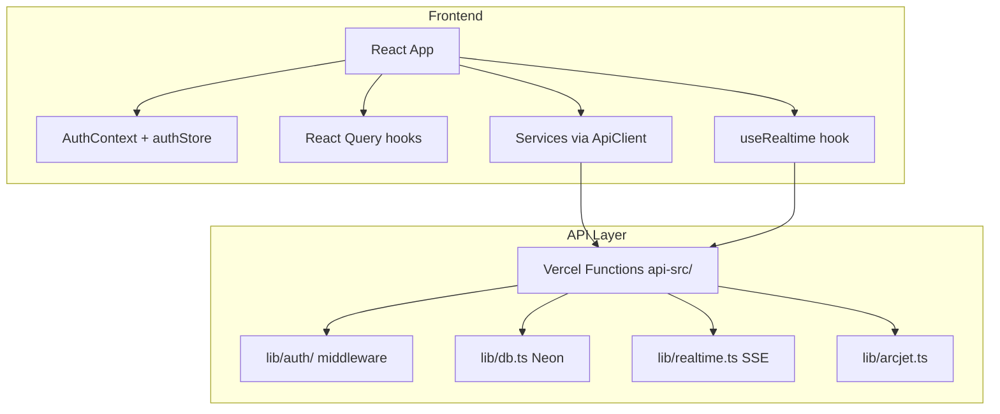

# Design Document: System Unification & Migration Completion

## Overview

This design covers the complete elimination of legacy artifacts from the MIHAS codebase. The work is primarily deletions, renames, and targeted rewrites of modules that still contain direct Supabase client calls. No new architectural patterns are introduced — the goal is to make the codebase match the architecture that already exists in the migrated modules.

The changes fall into six categories:
1. **Dead code deletion** — Files with zero importers that contain legacy code
2. **Module migration** — Files with active importers that still use Supabase client calls
3. **Rename/refactor** — Files with Supabase-derived names that mislead developers
4. **Environment cleanup** — Removal of legacy credentials and config
5. **Dependency removal** — Removing wrangler and Cloudflare packages
6. **Documentation update** — Bringing docs in line with current architecture

## Architecture

The current architecture is already correct. This spec does not change it:



All changes in this spec move code toward this existing architecture by removing paths that bypass it (direct Supabase calls, legacy auth tokens, etc.).

## Components and Interfaces

### Component 1: Dead Code Deletion

Files to delete outright (zero active importers confirmed by grep):

| File | Reason | Importers |
|------|--------|-----------|
| `lib/auth/legacy.ts` | Supabase JWT verification, never imported | 0 |
| `api-src/_auth.ts.legacy` | Full Supabase auth handler, legacy backup | 0 |
| `src/components/supabase-ui/index.ts` | Empty stub directory | 0 verified |
| `src/lib/authSecurity.ts` | Direct Supabase calls to profiles/user_roles/auth_audit_log | 0 |
| `src/lib/enhancedSession.ts` | Imports multiDeviceSession (deprecated) | 0 |
| `src/lib/migration/MigrationTracker.ts` | Deprecated, @ts-nocheck, Supabase stub | 0 |
| `src/lib/sessionManager.ts` | "Let Supabase handle" comment, no-op class | Check importers |
| `test_report.md` | Stale test results referencing Supabase | N/A |
| `test_results.xml` | Stale test results | N/A |
| `test_results_latest.xml` | Stale test results | N/A |

### Component 2: Module Migration — notificationService.ts

**Current state**: `src/lib/notificationService.ts` has 3 active importers (`src/utils/testNotifications.ts`, `src/pages/auth/SignUpPage.tsx`, `src/components/admin/TestNotifications.tsx`). Contains `supabase.rpc()` and `supabase.from('in_app_notifications')` calls.

**Migration approach**: Replace Supabase calls with API client calls to `/api/notifications?action=send` and `/api/notifications?action=list`. The backend already has deduplication via `createNotificationWithDedup`. The frontend service should delegate to the backend for all notification creation.

**Interface** (unchanged public API):
```typescript
class NotificationService {
  async sendNotification(userId: string, title: string, message: string, type: string): Promise<boolean>
  // Internal: calls /api/notifications?action=send with entity context
}
```

### Component 3: Module Migration — multiDeviceSession.ts

**Current state**: `src/lib/multiDeviceSession.ts` has 1 importer (`src/lib/enhancedSession.ts`), which itself has 0 importers. Both are dead code chains.

**Decision**: Delete both `src/lib/multiDeviceSession.ts` and `src/lib/enhancedSession.ts`. The sessions API (`/api/sessions`) already handles device session management.

### Component 4: Module Migration — offlineManager.ts

**Current state**: `src/lib/offlineManager.ts` has 2 importers (`src/hooks/useOffline.ts`, `src/components/pwa/OfflineIndicator.tsx`). However, the importers reference `src/services/offlineManager` (a different file), not `src/lib/offlineManager.ts`.

**Decision**: Verify the import paths. If `src/lib/offlineManager.ts` has zero actual importers, delete it. The `src/services/offlineManager.ts` (if it exists) is the active module.

### Component 5: Module Migration — applicationFlowAnalyzer.ts

**Current state**: Has 1 active importer (`src/components/admin/ApplicationFlowAnalyzer.tsx`). Contains hardcoded `supabase.*` location strings in static data structures.

**Migration approach**: Replace string literals only — change `'supabase.user_profiles'` to `'database.profiles'`, `'Supabase Auth'` to `'Custom JWT Auth'`, `'Supabase Storage'` to `'R2 Storage'`, etc. No logic changes needed.

### Component 6: File Rename — useSupabaseQuery.ts

**Current state**: `src/hooks/queries/useSupabaseQuery.ts` is imported by 6+ files. Contains no Supabase code — just cache config and auth query hooks. Named for historical reasons.

**Migration approach**: Rename to `src/hooks/queries/useQueryConfig.ts`. Update all import sites:
- `src/hooks/queries/index.ts`
- `src/hooks/queries/useApplicationQueries.ts`
- `src/hooks/queries/useAnalyticsQueries.ts`
- `src/hooks/queries/useStorageQueries.ts`
- `src/hooks/queries/useNotificationQueries.ts`
- `src/hooks/auth/useOptimizedAuthState.ts`
- `src/services/dashboardPreloader.ts`

### Component 7: Type Rename — SupabaseEligibilityAssessmentRow

**Current state**: `src/types/eligibility.ts` exports `SupabaseEligibilityAssessmentRow` and `EligibilityAssessmentWithProgram extends SupabaseEligibilityAssessmentRow`.

**Migration approach**: Rename to `EligibilityAssessmentRow`. Update all references.

### Component 8: Environment Cleanup

Files to modify:

| File | Action |
|------|--------|
| `.env.example` | Remove all `SUPABASE_*`, `VITE_SUPABASE_*` vars. Update header. |
| `.env.development` | Remove all Supabase vars. |
| `.env.vercel` | Remove all Supabase vars. Update comments. |
| `.env.hardened` | Remove Supabase section. Update DB header to "Neon Postgres". |
| `.env.local` | Remove 4 Supabase variables. |
| `.gitignore` | Remove `.wrangler/` and `.mf/` entries. |

### Component 9: Dependency Removal

Remove `wrangler` from `package.json` devDependencies. Run `bun install` to regenerate lockfile. This removes `wrangler`, `workerd`, `@cloudflare/workerd-*`, `@cloudflare/kv-asset-handler`, `@cloudflare/unenv-preset`, and all transitive Cloudflare dependencies.

### Component 10: Documentation Update

Docs to update or delete:

| File | Action |
|------|--------|
| `docs/TROUBLESHOOTING.md` | Replace Sentry references with "check Vercel logs" |
| `docs/guides/LAUNCH_INSTRUCTIONS.md` | Rewrite: remove Sentry/Cloudflare, add Vercel deployment |
| `docs/guides/TECH_ALTERNATIVES.md` | Remove Sentry recommendations |
| `docs/guides/TECH_STACK.md` | Remove "Ready for Sentry integration" |
| `docs/API_REFERENCE.md` | Replace Supabase client examples with fetch examples |
| `docs/CACHE_MONITORING.md` | Update useSupabaseQuery reference |
| `docs/API_MIGRATION_PLAN.md` | Mark as historical or delete |
| `docs/API_MIGRATION_FINAL_REPORT.md` | Mark as historical or delete |
| `docs/ADMIN_PAGES_DIAGNOSIS.md` | Delete (references Supabase direct queries) |
| `docs/ADMIN_PAGES_FIX_SUMMARY.md` | Delete (references Supabase RLS) |
| `docs/ADMIN_PAGES_COMPLETE_FIX.md` | Delete (references Supabase/Cloudflare) |
| `docs/analysis/ADMIN_PAGES_ROOT_CAUSE_ANALYSIS.md` | Delete (Supabase-specific analysis) |
| `docs/analysis/ADMIN_ERROR_ROOT_CAUSE.md` | Delete (references supabaseClient.js) |
| `docs/analysis/ADMINISTRATOR_OPERATIONS_GUIDE.md` | Update Supabase Dashboard reference |
| `docs/AI_FEATURES_IMPLEMENTATION.md` | Delete (Cloudflare AI removed) |
| `docs/APPLICATION_WIZARD_ENHANCEMENTS.md` | Update "Cloud Sync" section |
| `docs/cloudflare-edge-function-performance.md` | Delete (Cloudflare-specific) |
| `docs/cloudflare-deployment-guide.md` | Delete (Cloudflare-specific) |

### Component 11: SSE Wiring

**Current state**: The `useRealtime` hook is fully implemented but disabled (`enabled: false`, `pollingEnabled: false`). The comment explains: "Vercel Hobby has 10s function timeout, SSE requires persistent connections."

**Design decision**: Since SSE cannot work on Vercel Hobby plan, enable polling-only mode. The backend `lib/realtime.ts` already has `getEventsForPolling()`. The frontend `useRealtime` already has polling fallback logic.

**Migration approach**:
1. Change `useRealtime` defaults: `enabled: false` (keep SSE off), `pollingEnabled: true`
2. Add a polling endpoint to `api-src/sessions.ts` that calls `getEventsForPolling()`
3. Wire `useRealtime` into the student dashboard and admin dashboard components
4. Use `useStudentDashboardPolling` and `useAdminDashboardPolling` as the integration points

## Data Models

No database schema changes. All changes are frontend/API code and configuration. The existing 86 database tables remain unchanged.

The only data model change is the type rename:
```typescript
// Before
export interface SupabaseEligibilityAssessmentRow extends EligibilityAssessment { ... }
export interface EligibilityAssessmentWithProgram extends SupabaseEligibilityAssessmentRow { ... }

// After
export interface EligibilityAssessmentRow extends EligibilityAssessment { ... }
export interface EligibilityAssessmentWithProgram extends EligibilityAssessmentRow { ... }
```


## Correctness Properties

*A property is a characteristic or behavior that should hold true across all valid executions of a system — essentially, a formal statement about what the system should do. Properties serve as the bridge between human-readable specifications and machine-verifiable correctness guarantees.*

### Property 1: No Supabase references in source code

*For any* TypeScript or TSX file in `src/` or `api-src/`, scanning the file content (excluding `node_modules` and `.kiro/`) for the pattern `supabase` (case-insensitive) in non-comment code lines SHALL return zero matches. Comments that say "Replaces Supabase" or "Migrated from Supabase" are acceptable historical notes, but active code references (`await supabase.`, `import.*supabase`, `from.*supabase` as code) are not.

**Validates: Requirements 1.1, 1.2, 1.3, 1.4, 1.5, 2.2, 2.3, 3.2, 4.2, 9.1, 9.3**

### Property 2: No Supabase variables in environment files

*For any* file matching `.env*` in the project root, scanning for lines that set a variable starting with `SUPABASE_` or `VITE_SUPABASE_` (i.e., lines matching `^(SUPABASE_|VITE_SUPABASE_)`) SHALL return zero matches. Commented-out lines (starting with `#`) that mention these as removed are acceptable.

**Validates: Requirements 5.1, 5.2, 5.3, 5.4, 5.5**

### Property 3: File rename consistency

*For any* import statement across all TypeScript/TSX files in `src/`, no import path SHALL contain the string `useSupabaseQuery`. Additionally, the file `src/hooks/queries/useSupabaseQuery.ts` SHALL not exist, and `src/hooks/queries/useQueryConfig.ts` SHALL exist.

**Validates: Requirements 4.1, 4.3**

### Property 4: SSE-to-polling fallback

*For any* configuration of the `useRealtime` hook where SSE is disabled (`enabled: false`) and polling is enabled (`pollingEnabled: true`), the hook SHALL set `isPolling` to `true` and `status` to `'polling'` after initialization, and SHALL not attempt to create an EventSource connection.

**Validates: Requirement 8.3**

### Property 5: Visibility-based polling pause and resume

*For any* active polling session in the `useRealtime` hook, when the document visibility changes to `'hidden'`, the hook SHALL stop the polling interval. When visibility changes back to `'visible'`, the hook SHALL restart polling and fetch any missed events. The net effect of hide-then-show SHALL be equivalent to the original polling state (round-trip property).

**Validates: Requirements 8.4, 8.5**

## Error Handling

Since this spec is primarily about code deletion and migration, error handling is minimal:

1. **File deletion safety**: Before deleting any file, verify it has zero active importers by grepping the codebase. If an unexpected importer is found, migrate the import instead of deleting.

2. **Notification service migration**: The migrated `notificationService.ts` must handle API failures gracefully — if `/api/notifications?action=send` fails, log the error and return `false` (matching existing behavior). Never throw to callers.

3. **Polling fallback**: If the polling endpoint returns a non-200 status, the `useRealtime` hook already logs the error and continues polling at the next interval. No change needed.

4. **Environment variable removal**: After removing Supabase variables from `.env` files, verify the application still starts correctly. The only required env vars are `DATABASE_URL`, `JWT_SECRET`, `JWT_REFRESH_SECRET`, and `ARCJET_KEY`.

## Testing Strategy

### Property-Based Tests (fast-check)

Each correctness property maps to a property-based test. Tests should run minimum 100 iterations.

- **Property 1 test**: Generate random file paths from `src/` and `api-src/`, read each file, parse out non-comment lines, and assert no `supabase` pattern matches in code. Tag: `Feature: system-unification-migration, Property 1: No Supabase references in source code`

- **Property 2 test**: Generate random `.env*` file paths, read each, parse non-comment lines, and assert no `SUPABASE_` or `VITE_SUPABASE_` variable assignments. Tag: `Feature: system-unification-migration, Property 2: No Supabase variables in environment files`

- **Property 3 test**: Generate random TypeScript file paths from `src/`, read each, extract import statements, and assert none reference `useSupabaseQuery`. Also verify file existence/non-existence. Tag: `Feature: system-unification-migration, Property 3: File rename consistency`

- **Property 4 test**: Create `useRealtime` hook instances with various configurations where `enabled: false` and `pollingEnabled: true`, and assert the hook enters polling mode without creating EventSource. Tag: `Feature: system-unification-migration, Property 4: SSE-to-polling fallback`

- **Property 5 test**: For any active polling session, simulate visibility change to hidden then back to visible, and assert polling state is restored. Tag: `Feature: system-unification-migration, Property 5: Visibility-based polling pause and resume`

### Unit Tests (Vitest)

Unit tests cover specific examples and edge cases:

- **Deleted files**: Assert specific files do not exist (`lib/auth/legacy.ts`, `api-src/_auth.ts.legacy`, `src/components/supabase-ui/`, etc.)
- **Wrangler removed**: Assert `package.json` does not contain `wrangler` in devDependencies
- **Notification service**: Test that `NotificationService.sendNotification()` calls the API endpoint (mock fetch, verify URL and body)
- **Duplicate notification handling**: Test that when API returns `{ duplicate: true }`, the service returns `false`
- **Type rename**: Assert `SupabaseEligibilityAssessmentRow` does not appear in any file

### Existing Tests

Run the existing test suites to verify no regressions:
- `tests/property/supabase-complete-removal/` — should still pass
- `tests/property/supabase-auth-removal.property.test.ts` — should still pass
- `tests/property/supabase-exit-migration.property.test.ts` — should still pass
- All unit tests in `tests/unit/` — should still pass
