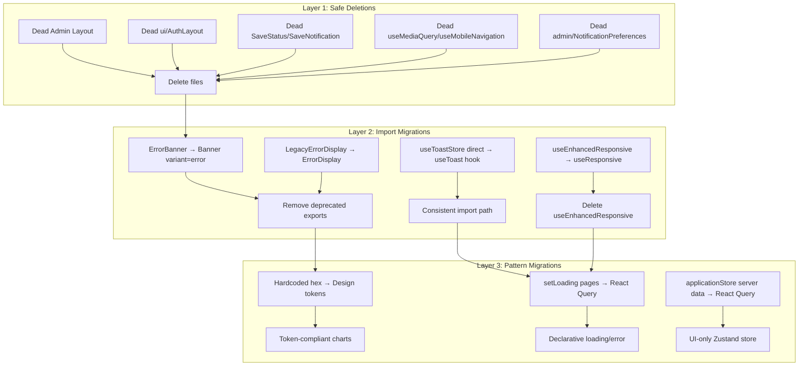

# Design: UI Consistency Consolidation

## Overview

This feature consolidates the MIHAS application's UI layer by eliminating duplicate components, dead code, inconsistent import patterns, and manual state management anti-patterns. The codebase has accumulated multiple implementations for error display, loading states, responsive detection, toast notifications, and authentication layouts. Additionally, server state is duplicated in Zustand stores instead of being managed by React Query.

The consolidation is a pure refactoring effort — no new user-facing features are added. The goals are:

1. **Single canonical component** for each UI concern (errors, loading, layout, toasts)
2. **Dead code removal** for components with zero external imports
3. **Design token compliance** replacing hardcoded hex colors
4. **React Query migration** for pages using manual `setLoading(true)` patterns
5. **Zustand store cleanup** removing duplicated server state from `applicationStore`

All changes are backward-compatible at the API/data layer. Only the frontend component layer is affected.

## Architecture

The consolidation follows a layered migration strategy:



### Migration Order Rationale

- **Layer 1** (safe deletions) has zero risk — these files have no importers
- **Layer 2** (import migrations) requires updating existing import statements and swapping component usage
- **Layer 3** (pattern migrations) involves behavioral changes and needs the most testing

Each layer can be completed and verified independently before proceeding to the next.

## Components and Interfaces

### Error Display (Canonical)

After consolidation, only two components handle errors:

| Component | Location | Use Case |
|-----------|----------|----------|
| `ErrorDisplay` | `@/components/ui/ErrorDisplay` | Inline and section-level errors |
| `Banner` | `@/components/ui/Banner` | Dismissible error banners (and info/warning/offline/pwa) |

```typescript
// ErrorDisplay — already exists, no changes needed to the component itself
interface ErrorDisplayProps {
  title?: string
  message: string
  onRetry?: () => void
  variant?: 'inline' | 'section'
  className?: string
}

// Banner — already exists, no changes needed
interface BannerProps {
  variant: 'info' | 'warning' | 'error' | 'offline' | 'pwa'
  children: React.ReactNode
  dismissible?: boolean
  onDismiss?: () => void
  className?: string
}
```

**Migration mapping:**
- `ErrorBanner` (SignInPage, SignUpPage, student/Dashboard) → `Banner variant="error"` with `dismissible` + `onDismiss`
- `LegacyErrorDisplay` (student/ApplicationStatus) → `ErrorDisplay variant="section"` with `onRetry`
- `InlineError` → `ErrorDisplay variant="inline"`
- `ErrorPage` → `ErrorDisplay variant="section"` wrapped in a page container

### Loading Components (Canonical)

| Component | Location | Use Case |
|-----------|----------|----------|
| `UnifiedLoader` | `@/components/ui/UnifiedLoader` | Page, inline, and overlay loading |
| `UnifiedSpinner` | `@/components/ui/UnifiedLoader` | Standalone spinner for buttons |

No interface changes needed. Non-canonical loaders (`LoadingSpinner`, `LoadingFallback`, etc.) that already delegate to `UnifiedLoader` internally can have their wrapper files deleted once all direct imports are migrated.

### Responsive Hook (Canonical)

After consolidation, two hooks remain:

| Hook | Location | Use Case |
|------|----------|----------|
| `useIsMobile` | `@/hooks/use-mobile` | Simple boolean mobile detection |
| `useResponsive` | `@/hooks/useResponsive` | Full breakpoint object (isMobile, isTablet, isDesktop, isLarge, isXLarge) |

**Deleted hooks:**
- `useMediaQuery` — zero imports, delete
- `useMobileNavigation` — zero imports, delete
- `useEnhancedResponsive` — migrate 2 consumers to `useResponsive`, then delete

### Toast Import Convention

Single import path: `@/hooks/useToast`

```typescript
// Canonical import — all files should use this
import { useToastStore } from '@/hooks/useToast'
// or the convenience object:
import { toast } from '@/hooks/useToast'
```

The `@/components/ui/Toast` module remains the implementation, but consumers import through the hook re-export.

### Application Store (Refactored)

**Before:**
```typescript
interface ApplicationState {
  applications: Application[]      // ← server data (remove)
  programs: Program[]              // ← server data (remove)
  intakes: Intake[]                // ← server data (remove)
  currentApplication: Application | null  // ← server data (remove)
  loading: boolean                 // ← derived from React Query (remove)
  error: string | null             // ← derived from React Query (remove)
  // ... setters for all above
}
```

**After:**
```typescript
interface ApplicationUIState {
  currentApplicationId: string | null
  wizardStep: number
  setCurrentApplicationId: (id: string | null) => void
  setWizardStep: (step: number) => void
}
```

Server data moves to new React Query hooks:

```typescript
// src/hooks/queries/useApplicationDataQueries.ts
export function useApplications(userId: string) {
  return useQuery({
    queryKey: ['applications', userId],
    queryFn: () => applicationService.list(userId),
    ...CACHE_CONFIG.applications,
  })
}

export function useApplication(id: string) {
  return useQuery({
    queryKey: ['application', id],
    queryFn: () => applicationService.getById(id),
    ...CACHE_CONFIG.applications,
    enabled: !!id,
  })
}

export function usePrograms() {
  return useQuery({
    queryKey: ['programs'],
    queryFn: () => catalogService.getPrograms(),
    ...CACHE_CONFIG.static,
  })
}

export function useIntakes() {
  return useQuery({
    queryKey: ['intakes'],
    queryFn: () => catalogService.getIntakes(),
    ...CACHE_CONFIG.static,
  })
}
```

### Design Token Color Map

For `EligibilityDashboard.tsx` recharts integration:

| Hardcoded | Token Name | Token Value | Usage |
|-----------|-----------|-------------|-------|
| `#10B981` | `success` | `#047857` | Eligible count |
| `#F59E0B` | `warning` | `#b45309` | Conditional count |
| `#EF4444` | `destructive` | `#cc2424` | Not eligible count |
| `#3B82F6` | `primary` | `#2563eb` | Bar chart fill |
| `#8884d8` | `chart.purple` | `#7c3aed` | Pie chart default fill (new token) |

A `chart` token group will be added to `tailwind.config.js` for chart-specific colors that don't map to existing semantic tokens. Recharts accepts hex strings directly, so we'll define a `CHART_COLORS` constant that reads from the same source of truth as Tailwind tokens.

```typescript
// src/lib/chartColors.ts
export const CHART_COLORS = {
  success: '#047857',
  warning: '#b45309',
  destructive: '#cc2424',
  primary: '#2563eb',
  purple: '#7c3aed',
} as const
```

## Data Models

No database schema changes. This is a frontend-only refactoring.

The only data model change is the `ApplicationUIState` Zustand interface replacing the current `ApplicationState`, as described in Components and Interfaces above. All server data types (`Application`, `Program`, `Intake`) remain unchanged — they're just fetched via React Query instead of stored in Zustand.

### React Query Key Structure

| Query Key | Data | Cache Profile |
|-----------|------|---------------|
| `['applications', userId]` | User's application list | `CACHE_CONFIG.applications` |
| `['application', id]` | Single application detail | `CACHE_CONFIG.applications` |
| `['programs']` | All programs | `CACHE_CONFIG.static` |
| `['intakes']` | All intakes | `CACHE_CONFIG.static` |


## Correctness Properties

*A property is a characteristic or behavior that should hold true across all valid executions of a system — essentially, a formal statement about what the system should do. Properties serve as the bridge between human-readable specifications and machine-verifiable correctness guarantees.*

### Property 1: Dead files are removed

*For any* file path in the dead-code deletion set (`AdminLayout.tsx`, `AdminSidebar.tsx`, `AdminHeader.tsx`, `AdminMobileNav.tsx`, `ui/AuthLayout.tsx`, `SaveStatus.tsx`, `SaveNotification.tsx`, `useMediaQuery.ts`, `useMobileNavigation.ts`, `useEnhancedResponsive.ts`, `admin/NotificationPreferences.tsx`), that file should not exist in the source tree after consolidation.

**Validates: Requirements 3.1, 4.1, 5.3, 5.4, 7.1, 11.1**

### Property 2: No deprecated error component exports

*For any* symbol name in the deprecated set (`ErrorBanner`, `LegacyErrorDisplay`, `InlineError`, `ErrorPage`), the canonical `ErrorDisplay.tsx` module should not export that symbol after consolidation.

**Validates: Requirements 1.4**

### Property 3: Toast imports use canonical path

*For any* `.tsx` or `.ts` file under `src/` that imports `useToastStore`, the import source path should be `@/hooks/useToast` and never `@/components/ui/Toast`.

**Validates: Requirements 6.1, 6.2**

### Property 4: No hardcoded hex colors in migrated chart files

*For any* hex color string literal (matching `#[0-9a-fA-F]{6}`) found in `EligibilityDashboard.tsx` after migration, that hex value should be a member of the approved `CHART_COLORS` constant (which maps to design tokens).

**Validates: Requirements 8.1, 8.2, 8.3**

### Property 5: Migrated pages do not use manual loading state

*For any* page file in the migration target set (SignInPage, SignUpPage, ForgotPasswordPage, ResetPasswordPage, admin/Intakes, admin/EligibilityManagement, admin/AuditTrail, admin/Programs, admin/Settings, student/NotificationSettings, student/Payment, student/ApplicationDetail, student/Settings, student/ApplicationStatus), the source code should not contain a `setLoading(true)` call for server data fetching.

**Validates: Requirements 9.1, 9.4**

### Property 6: Application store contains only UI state

*For any* field name in the `applicationStore` Zustand interface, that field should be a UI-concern identifier (e.g., `currentApplicationId`, `wizardStep`, or their setters) and not a server-data array or object (e.g., `applications`, `programs`, `intakes`, `loading`, `error`).

**Validates: Requirements 10.1, 10.2**

## Error Handling

### Migration Error Scenarios

| Scenario | Handling |
|----------|----------|
| Deprecated component still imported after migration | TypeScript compiler will catch missing exports — build fails, preventing deployment |
| React Query fetch failure | `useQuery` returns `error` object; consuming components render `ErrorDisplay` with retry via `refetch()` |
| Stale cache after migration | `CACHE_CONFIG` profiles define appropriate `staleTime` and `gcTime` per data type |
| Chart color token missing | `CHART_COLORS` constant provides compile-time safety; TypeScript `as const` prevents typos |
| Zustand store consumer accesses removed field | TypeScript compiler catches the type error at build time |

### Graceful Degradation

- React Query's `isLoading` / `isError` / `data` pattern provides built-in loading and error states
- `ErrorDisplay` with `onRetry` prop wired to React Query's `refetch()` gives users a recovery path
- `UnifiedLoader` with `variant="page"` provides consistent loading UX during data fetches
- If a React Query fetch fails, the previous cached data remains available via `keepPreviousData` behavior

## Testing Strategy

### Dual Testing Approach

This feature requires both unit tests and property-based tests:

- **Unit tests**: Verify specific migration outcomes (file deletions, export removals, specific color replacements)
- **Property tests**: Verify universal invariants across the codebase (no deprecated imports, no hardcoded colors, store shape)

### Property-Based Testing

**Library**: `fast-check` (already in project dependencies)

**Configuration**: Each property test runs with `numRuns: 100` minimum (production) or `numRuns: 10` for CI.

**Tag format**: Each test includes a comment referencing its design property:
```typescript
// Feature: ui-consistency-consolidation, Property 1: Dead files are removed
```

**Property test implementations:**

| Property | Test Strategy | Generator |
|----------|--------------|-----------|
| P1: Dead files removed | Generate file paths from the deletion set, assert `fs.existsSync` returns false | `fc.constantFrom(...deadFilePaths)` |
| P2: No deprecated exports | Generate symbol names from deprecated set, assert dynamic import doesn't resolve them | `fc.constantFrom('ErrorBanner', 'LegacyErrorDisplay', 'InlineError', 'ErrorPage')` |
| P3: Toast canonical path | Scan all .tsx files, for any file containing `useToastStore`, assert import path matches `@/hooks/useToast` | `fc.constantFrom(...tsxFilesWithToastImport)` |
| P4: No hardcoded hex | Extract all hex literals from EligibilityDashboard, assert each is in CHART_COLORS | `fc.constantFrom(...extractedHexValues)` |
| P5: No manual loading | For each migrated page, scan source for `setLoading(true)`, assert zero matches | `fc.constantFrom(...migratedPagePaths)` |
| P6: Store UI-only | Parse applicationStore interface fields, assert each is in the allowed UI field set | `fc.constantFrom(...storeFieldNames)` |

### Unit Tests

Unit tests cover specific examples and edge cases:

- `ErrorDisplay` renders correctly with `variant="inline"` and `variant="section"`
- `Banner` renders with `variant="error"` and handles dismiss callback
- `UnifiedLoader` renders all three variants with correct ARIA attributes
- `useIsMobile` returns correct boolean at various viewport widths
- `useResponsive` returns correct breakpoint object
- `CHART_COLORS` values match Tailwind design token values
- React Query hooks return expected shape (`data`, `isLoading`, `error`)
- Refactored `applicationStore` has only `currentApplicationId` and `wizardStep` fields
- UI barrel export (`src/components/ui/index.ts`) does not export `AuthLayout`

### Test File Locations

| Test Type | Location |
|-----------|----------|
| Property tests | `tests/property/ui-consolidation.test.ts` |
| Unit tests (components) | `tests/ui/error-display.test.tsx`, `tests/ui/unified-loader.test.tsx` |
| Unit tests (hooks) | `tests/unit/hooks/responsive-hooks.test.ts` |
| Unit tests (store) | `tests/unit/stores/application-store.test.ts` |
