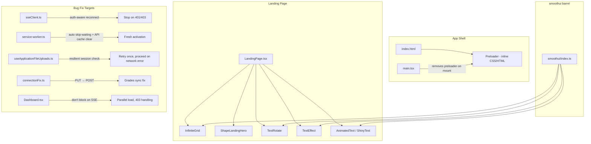
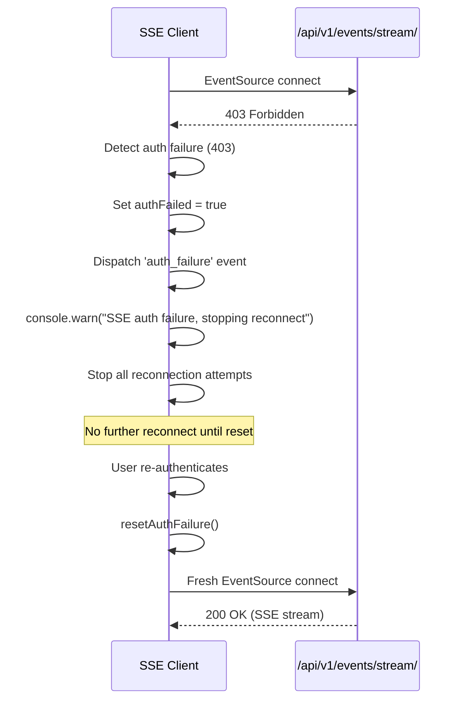
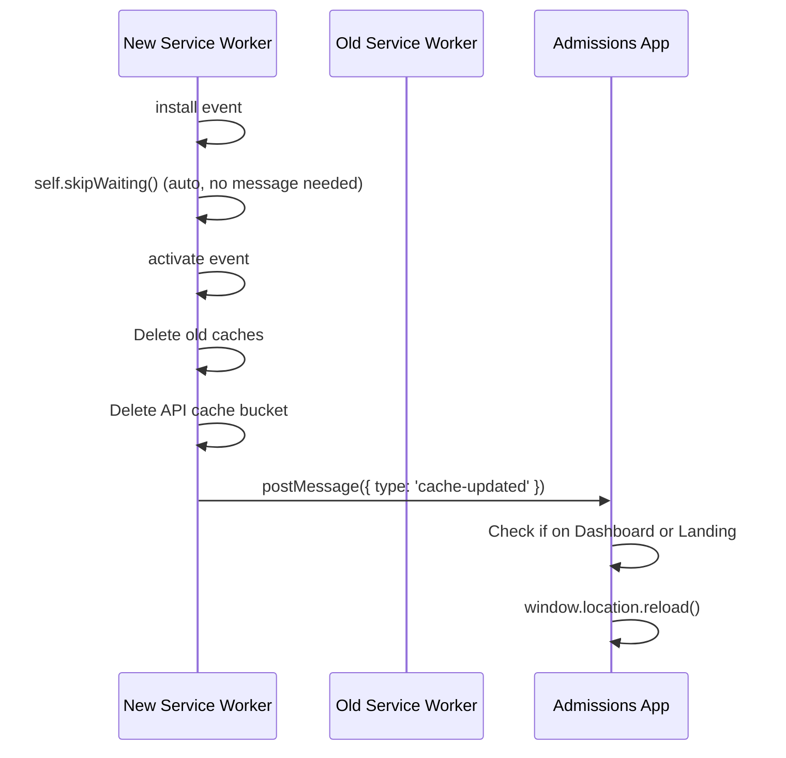

# Design Document: UI Overhaul and Critical Fixes

## Overview

This design covers two parallel workstreams for the MIHAS admissions platform:

1. **UI Overhaul** — Six new visual components (InfiniteGrid, Preloader, AnimatedText/ShinyText, ShapeLandingHero, TextRotate, TextEffect) that modernize the landing page experience while preserving SEO, accessibility, and mobile performance.

2. **Critical Bug Fixes** — Five production fixes targeting SSE reconnect storms on 403, slow dashboard loading, misleading session-expired errors during file upload, a 405 on grades sync, and stale service worker cache.

All new UI components are implemented as local React components in `apps/admissions/src/components/smoothui/`, inspired by 21st.dev design patterns but not installed as npm packages. Bug fixes touch `sseClient.ts`, `service-worker.ts`, `useApplicationFileUploads.ts`, `connectionFix.ts`, and `Dashboard.tsx`.

### CTO Review Notes

- **No framer-motion**: All animations use pure CSS transitions/keyframes. Do NOT add framer-motion or the `motion` npm package.
- **SSE infinite loop root cause**: The visibility change handler resets `retryCount = 0` when the page becomes visible, even after `maxRetries` was exhausted. This creates infinite 5-retry bursts. Fix: add a `retriesExhausted` flag that prevents visibility-triggered reconnects.
- **Service worker needs `clients.claim()`**: In addition to `skipWaiting()`, the activate handler must call `clients.claim()` so the new SW takes control of existing tabs immediately.
- **QUIC protocol errors**: The `ERR_QUIC_PROTOCOL_ERROR` on SSE is a Koyeb HTTP/3 issue. The SSE client should treat these as network errors, not auth failures.

## Architecture

### Component Architecture



### Fix Architecture — SSE Auth-Aware Reconnect



### Fix Architecture — Service Worker Activation



## Components and Interfaces

### New UI Components

All new components live in `apps/admissions/src/components/smoothui/` and are exported through the existing barrel file `smoothui/index.ts`.

#### 1. InfiniteGrid (`infinite-grid.tsx`)

```typescript
interface InfiniteGridProps {
  /** Grid cell size in pixels (default: 40) */
  cellSize?: number;
  /** Grid line color (default: uses Tailwind border token) */
  lineColor?: string;
  /** Grid line opacity (default: 0.15) */
  lineOpacity?: number;
  /** Animation speed multiplier (default: 1) */
  speed?: number;
  /** Additional className */
  className?: string;
}
```

- Pure CSS/SVG implementation — no canvas or WebGL
- Uses `@media (prefers-reduced-motion: reduce)` to disable animation
- Renders as a positioned background layer (`position: absolute; inset: 0; z-index: 0`)
- CSS `@keyframes` for subtle diagonal scroll animation on the SVG pattern

#### 2. Preloader (inline in `index.html`)

Not a React component. Rendered as inline HTML/CSS in `index.html` inside `<div id="root">` so it appears before any JS executes.

```html
<div id="preloader" class="preloader">
  <div class="preloader-dots">
    <span></span><span></span><span></span>
  </div>
  <p id="preloader-slow" class="preloader-slow" hidden>
    Taking longer than expected. <a href="/">Refresh</a>
  </p>
</div>
```

- `main.tsx` removes `#preloader` after React mounts (with a 500ms fade-out via CSS transition)
- A `<script>` tag in `index.html` sets a 10-second timeout to show the slow-load message
- `prefers-reduced-motion` media query replaces animated dots with a static "Loading..." text

#### 3. AnimatedText / ShinyText (`shiny-text.tsx`)

```typescript
interface ShinyTextProps {
  /** Text content to render */
  text: string;
  /** HTML tag to render (default: 'span') */
  as?: 'span' | 'p' | 'h1' | 'h2' | 'h3';
  /** Additional className */
  className?: string;
  /** Whether to animate on viewport entry (default: true) */
  animateOnEntry?: boolean;
}
```

- CSS gradient shimmer animation using `background-clip: text` and `@keyframes`
- Uses `IntersectionObserver` to trigger once on viewport entry, then stays static
- Respects `prefers-reduced-motion` — renders plain styled text

#### 4. ShapeLandingHero (`shape-landing-hero.tsx`)

```typescript
interface ShapeLandingHeroProps {
  /** Headline text */
  headline: string;
  /** Subheadline / description */
  description: string;
  /** Rotating phrases for TextRotate */
  rotatingPhrases: string[];
  /** Primary CTA */
  primaryCta: { label: string; href: string; icon?: React.ReactNode };
  /** Secondary CTA */
  secondaryCta: { label: string; href: string; icon?: React.ReactNode };
  /** Campus image src */
  imageSrc: string;
  /** Campus image alt */
  imageAlt: string;
}
```

- Replaces the current `HeroSection` in `LandingPage.tsx`
- Preserves existing CTA buttons, routing, and SEO structured data
- Integrates `InfiniteGrid` as background, `TextRotate` for rotating phrases, `ShinyText` for brand name
- Responsive grid layout: stacked on mobile, side-by-side on desktop
- Preserves the `<h1>` heading hierarchy and existing `aria-label` patterns

#### 5. TextRotate (`text-rotate.tsx`)

```typescript
interface TextRotateProps {
  /** Array of phrases to cycle through */
  phrases: string[];
  /** Interval between rotations in ms (default: 3000) */
  interval?: number;
  /** Animation duration in ms (default: 500) */
  duration?: number;
  /** Additional className */
  className?: string;
}
```

- Uses CSS `transform: rotateX()` transitions to flip between phrases
- `aria-live="polite"` region announces the current phrase to screen readers
- `prefers-reduced-motion` — shows first phrase only (static) or comma-separated list
- Keyboard accessible — no interactive elements, purely decorative text cycling

#### 6. TextEffect (`text-effect.tsx`)

```typescript
interface TextEffectProps {
  /** Text content */
  children: React.ReactNode;
  /** Animation type (default: 'fadeUp') */
  effect?: 'fadeUp' | 'fadeIn' | 'slideLeft' | 'blur';
  /** Delay before animation starts in ms (default: 0) */
  delay?: number;
  /** Additional className */
  className?: string;
}
```

- Uses `IntersectionObserver` with `triggerOnce: true` to animate on first viewport entry
- Text is visible in the DOM before animation starts (no `display: none` or `visibility: hidden`)
- Uses CSS `opacity` and `transform` transitions — no layout shifts
- `prefers-reduced-motion` — renders immediately without animation

### Bug Fix Interfaces

#### SSE Client Changes (`sseClient.ts`)

New internal state:
```typescript
let authFailed = false;  // Set to true on 401/403, prevents reconnect
let retriesExhausted = false;  // Set to true when maxRetries reached, prevents visibility-triggered reconnect
```

New public method on `SSEClient` interface:
```typescript
interface SSEClient {
  // ... existing methods ...
  /** Reset auth-failure state to allow fresh connection after re-auth */
  resetAuthFailure(): void;
}
```

Key behavior changes:
1. **Auth failure detection via fetch probe**: The `EventSource.onerror` handler cannot directly read HTTP status codes (browser limitation). Before scheduling a reconnect, the client sends a lightweight `HEAD` request to the SSE endpoint. If the probe returns 401 or 403, the client sets `authFailed = true` and stops reconnecting.
2. **Visibility handler fix**: The `handleVisibilityChange` function must check `retriesExhausted` and `authFailed` before resetting `retryCount` and reconnecting. When either flag is true, the visibility handler is a no-op.
3. **Max retries exhaustion**: When `retryCount >= maxRetries`, set `retriesExhausted = true` in addition to the existing behavior. The `resetRetryCount()` method must also reset `retriesExhausted = false`.

#### Service Worker Changes (`service-worker.ts`)

- Add `self.skipWaiting()` call in the `install` event listener (auto skip-waiting)
- In the `activate` handler, add `clients.claim()` so the new SW takes control of existing tabs immediately
- In the `activate` handler, add explicit deletion of the API cache bucket (`API_CACHE`)
- After activation, post `cache-updated` message to all clients (already exists, but now clients auto-reload)

#### File Upload Session Check Changes (`useApplicationFileUploads.ts`)

Modified `startUpload` function around line 155:
```typescript
// Before: single session check, throws on any failure
// After: retry once on 401/403, proceed on network error
async function verifySessionWithRetry(): Promise<boolean> {
  try {
    const result = await apiClient.request<{ user?: unknown }>('/auth/session/');
    return !!result?.user;
  } catch (error) {
    if (isAuthError(error)) {
      // Retry once after 1 second
      await delay(1000);
      try {
        const retryResult = await apiClient.request<{ user?: unknown }>('/auth/session/');
        return !!retryResult?.user;
      } catch (retryError) {
        if (isAuthError(retryError)) {
          throw new Error('Your session has expired. Please sign in again to continue uploading.');
        }
        // Network error on retry — proceed with upload
        return true;
      }
    }
    // Network error (not auth) — proceed with upload
    return true;
  }
}
```

#### Grades Sync Fix (`connectionFix.ts`)

Single-line change in `syncGradesWithRecovery`:
```typescript
// Before: method: 'PUT'
// After:  method: 'POST'
```

No backend changes needed — `ApplicationGradesView.post()` already handles both single and batch grade upserts with `update_or_create` semantics.

## Data Models

No new database models or schema changes are required. All changes are frontend-only except for the grades sync fix, which simply changes the HTTP method from PUT to POST to match the existing backend `ApplicationGradesView` which only supports GET and POST.

### Existing Models Referenced

| Model | Location | Relevance |
|-------|----------|-----------|
| `ApplicationGrade` | `backend/apps/documents/models.py` | Grades sync target — `update_or_create` by `(application_id, subject_id)` |
| `Application` | `backend/apps/applications/models.py` | Dashboard data source |

### State Management

| Store | Type | Change |
|-------|------|--------|
| SSE Client internal state | Module-level closure | Add `authFailed` boolean |
| Service Worker cache | Workbox cache buckets | Clear `API_CACHE` on activation |
| Preloader state | DOM element | Removed from DOM on React mount |


## Correctness Properties

*A property is a characteristic or behavior that should hold true across all valid executions of a system — essentially, a formal statement about what the system should do. Properties serve as the bridge between human-readable specifications and machine-verifiable correctness guarantees.*

### Property 1: SSE auth failure stops reconnect

*For any* SSE client instance with any `maxRetries` configuration, when the SSE endpoint returns a 401 or 403 status code, the client should set `authFailed = true`, cancel any pending reconnect timeout, and never schedule another reconnect attempt until `resetAuthFailure()` is called.

**Validates: Requirements 7.1**

### Property 2: SSE auth failure dispatches event to all handlers

*For any* SSE client with N subscribed `auth_failure` handlers (where N ≥ 0), when an auth failure (401 or 403) is detected, exactly N handler invocations should occur, each receiving an object containing the HTTP status code.

**Validates: Requirements 7.2**

### Property 3: SSE auth failure reset round-trip

*For any* SSE client that has entered the auth-failed state, calling `resetAuthFailure()` should set `authFailed = false` and allow a subsequent `connect()` call to proceed (i.e., create a new EventSource). This is a round-trip property: `authFail → resetAuthFailure → connect` should restore the client to a connectable state.

**Validates: Requirements 7.4**

### Property 4: SSE maxRetries cap

*For any* SSE client configured with `maxRetries = N` (where N ≥ 0), the client should make at most N reconnection attempts after the initial connection failure, and then stop. The total number of `connect()` invocations triggered by the reconnect scheduler should never exceed N.

**Validates: Requirements 7.6**

### Property 4b: SSE visibility handler respects exhausted retries

*For any* SSE client that has exhausted its `maxRetries` (i.e., `retriesExhausted = true`), a page visibility change from hidden to visible should NOT trigger a reconnection attempt. The `retryCount` should remain unchanged and no new `connect()` call should be made.

**Validates: Requirements 7.7**

### Property 5: Dashboard partial failure resilience

*For any* combination of the three dashboard data sources (applications, intakes, interviews) where exactly K sources (1 ≤ K ≤ 2) fail with a 403 status and the remaining (3 − K) sources succeed, the dashboard should render the successful data sources and display inline error messages only for the failed sources. The count of rendered error messages should equal K, and the count of rendered data sections should equal (3 − K).

**Validates: Requirements 8.3**

### Property 6: File upload retries once on auth error

*For any* file upload attempt where the session verification call to `/auth/session/` returns a 401 or 403 status, the hook should make exactly one retry attempt after a delay. If the retry also returns 401 or 403, the hook should throw an error with the message containing "session has expired". The total number of session verification calls should be exactly 2 (initial + one retry).

**Validates: Requirements 9.1**

### Property 7: File upload proceeds on network error

*For any* file upload attempt where the session verification call to `/auth/session/` fails with a network error (timeout, DNS failure, connection refused — any non-HTTP-status error), the hook should proceed with the upload without throwing a session-expired error. The upload function should be called regardless of the network error on the session check.

**Validates: Requirements 9.3, 9.4**

### Property 8: Grades sync POST round-trip

*For any* valid set of grades (list of `{ subject_id: UUID, grade: integer }` pairs with unique subject IDs), POSTing the grades to `/api/v1/applications/{id}/grades/` and then GETting `/api/v1/applications/{id}/grades/` should return a set of grades where each `(subject_id, grade)` pair from the POST payload has a matching entry in the GET response. Additionally, POSTing the same payload twice should not create duplicate entries — the GET response should contain exactly one entry per unique `subject_id`.

**Validates: Requirements 10.2, 10.5**

### Property 9: Auth endpoints are never cached by service worker

*For any* request URL matching the pattern `/api/v1/auth/*`, the service worker routing should use the `NetworkOnly` strategy, meaning no response for these URLs should ever be stored in any cache bucket. After any number of requests to auth endpoints, querying all service worker caches for URLs matching `/api/v1/auth/` should return zero cached entries.

**Validates: Requirements 11.5**

## Error Handling

### SSE Client

| Error Condition | Handling |
|----------------|----------|
| 401/403 from SSE endpoint | Set `authFailed = true`, dispatch `auth_failure` event, log single `console.warn`, stop all reconnects |
| Network error during SSE | Schedule reconnect with exponential backoff (existing behavior) |
| Max retries exceeded | Log single summary message, dispatch `error` event with `max_retries_exceeded` type, stop reconnects |
| EventSource constructor throws | Log error, schedule reconnect (existing behavior) |

### File Upload Session Check

| Error Condition | Handling |
|----------------|----------|
| 401/403 on first session check | Wait 1 second, retry once |
| 401/403 on retry | Throw error: "Your session has expired. Please sign in again to continue uploading." with sign-in link |
| Network error on session check | Proceed with upload (rely on upload endpoint's own auth) |
| Network error on retry | Proceed with upload |
| Session check succeeds | Proceed immediately |

### Grades Sync

| Error Condition | Handling |
|----------------|----------|
| 405 Method Not Allowed | Eliminated by switching from PUT to POST |
| Network error | Existing `ConnectionManager` retry logic with exponential backoff (up to 3 retries) |
| 400 Validation Error | Surface error message to user via existing error handling |
| 403 Forbidden | Surface auth error, do not retry |

### Service Worker

| Error Condition | Handling |
|----------------|----------|
| Activation timeout (>30s) | App proceeds without SW support, logs warning |
| Cache deletion failure | Log warning, continue activation |
| API cache clear failure | Log warning, continue — stale data is preferable to broken activation |
| `postMessage` failure | Silently ignore — clients may have navigated away |

### Dashboard Loading

| Error Condition | Handling |
|----------------|----------|
| Single data source returns 403 | Show inline error for that source, render remaining sources |
| All data sources return 403 | Redirect to sign-in page within 2 seconds |
| SSE in auth-failed state | Skip SSE connection, load data via REST only |
| Network error on data fetch | Show inline error with retry button (existing behavior) |

### Preloader

| Error Condition | Handling |
|----------------|----------|
| React fails to mount within 10s | Show "Taking longer than expected" message with refresh link |
| React mounts successfully | Fade out preloader over 500ms, remove from DOM |
| JavaScript completely fails | Preloader remains visible (acceptable degradation) |

## Testing Strategy

### Dual Testing Approach

This feature requires both unit tests and property-based tests:

- **Unit tests** verify specific examples, edge cases, UI rendering, and integration points
- **Property tests** verify universal properties across randomized inputs for the bug fix logic

### Property-Based Testing Configuration

- **Library**: `fast-check` (already in the project's test dependencies)
- **Runner**: Vitest
- **Minimum iterations**: 100 per property test
- **Tag format**: Each property test must include a comment: `// Feature: ui-overhaul-and-critical-fixes, Property {N}: {title}`
- **Each correctness property must be implemented by a single property-based test**

### Frontend Unit Tests (`apps/admissions/tests/`)

| Test | What It Verifies | Requirements |
|------|-----------------|--------------|
| InfiniteGrid renders without errors | Component mounts, produces SVG/CSS output | 1.1 |
| InfiniteGrid respects reduced motion | No animation classes when `prefers-reduced-motion` matches | 1.4 |
| Preloader removal on mount | Preloader element removed from DOM after React mount | 2.2 |
| Preloader slow-load message | After 10s timeout, slow message becomes visible | 2.4 |
| ShinyText renders with shimmer | Component renders text with gradient animation class | 3.1 |
| ShinyText reduced motion | Plain text without animation class | 3.3 |
| ShapeLandingHero preserves CTAs | Hero renders both CTA links with correct hrefs | 4.2 |
| ShapeLandingHero has h1 | Hero contains exactly one h1 element | 4.5 |
| TextRotate cycles phrases | Component shows different phrases over time | 5.1, 5.2 |
| TextRotate aria-live | Component has `aria-live="polite"` attribute | 5.4 |
| TextRotate reduced motion | Shows static text when reduced motion enabled | 5.3 |
| TextEffect triggers once | Animation class applied once on intersection | 6.2 |
| TextEffect text visible before animation | Text content in DOM without visibility:hidden | 6.4 |
| SSE single warn on auth failure | Only one `console.warn` call on auth failure | 7.3 |
| SSE debug log after first retry | `console.debug` used for retry 2+ | 7.5 |
| Dashboard loading state on mount | Skeleton/loader renders within 200ms | 8.1 |
| Dashboard skips SSE when auth-failed | Data loads without SSE connection | 8.2 |
| Dashboard redirects on session 403 | Navigates to sign-in within 2s | 8.5 |
| File upload specific error message | "session has expired" message on double auth failure | 9.2 |
| File upload no delay on success | Upload proceeds immediately after successful session check | 9.5 |
| Grades sync uses POST | `connectionManager.makeRequest` called with `method: 'POST'` | 10.1 |
| Grades batch returns 200 | Batch POST returns 200 with grade list | 10.3 |
| Grades single returns 201/200 | Single POST returns 201 for new, 200 for update | 10.4 |
| SW auto skip-waiting | `self.skipWaiting()` called in install handler | 11.1 |
| SW clears API cache on activate | API cache bucket deleted during activation | 11.3 |
| SW cache-updated triggers reload | App reloads on cache-updated message when on dashboard | 11.4 |
| SW activation timeout fallback | App proceeds after 30s without SW | 11.6 |

### Frontend Property Tests (`apps/admissions/tests/`)

| Property Test | Correctness Property | Requirements |
|--------------|---------------------|--------------|
| `sseAuthFailureStopsReconnect.property.test.ts` | Property 1: SSE auth failure stops reconnect | 7.1 |
| `sseAuthFailureDispatchesEvent.property.test.ts` | Property 2: SSE auth failure dispatches event | 7.2 |
| `sseAuthFailureResetRoundTrip.property.test.ts` | Property 3: SSE auth failure reset round-trip | 7.4 |
| `sseMaxRetriesCap.property.test.ts` | Property 4: SSE maxRetries cap | 7.6 |
| `dashboardPartialFailure.property.test.ts` | Property 5: Dashboard partial failure resilience | 8.3 |
| `fileUploadRetryOnAuthError.property.test.ts` | Property 6: File upload retries once on auth error | 9.1 |
| `fileUploadProceedOnNetworkError.property.test.ts` | Property 7: File upload proceeds on network error | 9.3, 9.4 |

### Backend Property Tests (`backend/tests/property/`)

| Property Test | Correctness Property | Requirements |
|--------------|---------------------|--------------|
| `test_grades_sync_roundtrip.py` | Property 8: Grades sync POST round-trip | 10.2, 10.5 |

### Service Worker Property Tests (`apps/admissions/tests/`)

| Property Test | Correctness Property | Requirements |
|--------------|---------------------|--------------|
| `swAuthEndpointsNeverCached.property.test.ts` | Property 9: Auth endpoints never cached | 11.5 |

### Test Execution

- Frontend: `cd apps/admissions && bun run test` (Vitest with fast-check)
- Backend: `cd backend && python3 -m pytest tests/property/test_grades_sync_roundtrip.py` (pytest with Hypothesis)
