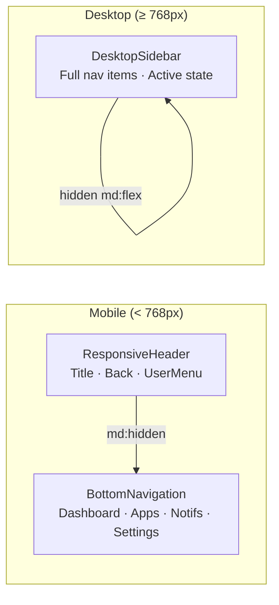

# Design Document: UI/UX Performance Overhaul

## Overview

This design covers a comprehensive frontend-only overhaul of the MIHAS Application System — a live production admissions portal serving students in Zambia on predominantly mobile devices with unreliable connectivity. The overhaul consolidates ~100+ UI components in `src/components/ui/` into a disciplined, token-driven design system; standardizes layout, navigation, loading/empty/error states; improves form ergonomics and accessibility; and optimizes bundle size and Core Web Vitals to meet Lighthouse > 90, FCP < 1.5s, LCP < 2.5s, CLS < 0.1, INP < 200ms.

The work is purely frontend: React 18 + TypeScript, Tailwind CSS, Radix UI, React Hook Form + Zod, Zustand + React Query, Vite + Bun. No backend API, database, auth, or security changes are in scope.

### Key Design Decisions

1. **CSS-only animations** — All micro-interactions use CSS transitions/keyframes. No framer-motion or JS animation libraries. This keeps INP low and respects `prefers-reduced-motion` natively.
2. **Radix UI as the primitive layer** — Dialog, Select, DropdownMenu, Tooltip, Tabs, and Accordion all use Radix primitives for built-in focus trapping, keyboard navigation, and ARIA compliance.
3. **Consolidation over creation** — The existing codebase has 11+ loading variants, 6+ error variants, 4+ select variants, and 4+ file upload variants. We consolidate to canonical components rather than adding new ones.
4. **Token-first styling** — Every color, spacing, radius, shadow, and transition value comes from `tailwind.config.js` tokens. Zero hardcoded hex values in component code.
5. **Route-level skeleton fallbacks** — Each lazy-loaded route gets a layout-matched skeleton `Suspense` fallback instead of a generic spinner.

## Architecture

### System Architecture Diagram

```mermaid
graph TB
    subgraph "Design Token Layer"
        TW[tailwind.config.js<br/>Colors · Spacing · Typography<br/>Radii · Shadows · Transitions]
    end

    subgraph "UI Primitive Layer (src/components/ui/)"
        direction LR
        BTN[Button]
        INP[Input / Textarea]
        SEL[Select ← Radix]
        CHK[Checkbox / Radio / Switch]
        CRD[Card]
        TBL[Table]
        DLG[Dialog ← Radix]
        TST[Toast]
        ALR[Alert]
        BNR[Banner]
        SKL[Skeleton]
        EMP[EmptyState]
        ERR[ErrorDisplay]
        FUP[FileUpload]
        LDR[UnifiedLoader]
        PWD[PasswordInput]
        PGN[Pagination]
        BDG[Badge]
        TIP[Tooltip ← Radix]
    end

    subgraph "Layout Layer"
        PS[PageShell<br/>Header · Content · Footer]
        AL[AuthLayout]
        BN[BottomNavigation]
        DS[DesktopSidebar]
        RH[ResponsiveHeader]
    end

    subgraph "Page Layer (src/pages/)"
        AUTH[Auth Pages]
        STU[Student Pages]
        ADM[Admin Pages]
        PUB[Public Pages]
    end

    subgraph "Performance Layer"
        RL[React.lazy + Suspense<br/>Route-level code splitting]
        PF[Prefetch on hover/focus]
        LEB[LazyLoadErrorBoundary]
        MEM[React.memo / useMemo / useCallback]
        RQ[React Query granular selectors]
    end

    TW --> BTN & INP & SEL & CHK & CRD & TBL & DLG & TST & ALR & BNR & SKL & EMP & ERR & FUP & LDR
    BTN & INP & SEL & CRD & TBL & DLG & TST & ALR & SKL & EMP & ERR & FUP & LDR --> PS & AL
    PS --> STU & ADM
    AL --> AUTH
    PS --> PUB
    RL --> AUTH & STU & ADM & PUB
    LEB --> RL
    MEM --> STU & ADM
    RQ --> STU & ADM
```



### Component Consolidation Map

| Current Variants | Canonical Replacement | Location |
|---|---|---|
| LoadingSpinner, EnhancedLoadingSpinner, LoadingState, LoadingFallback, LoadingOverlay, InlineLoader, UnifiedLoader, Spinner, PageLoadingFallback, AuthLoadingOverlay, FancyPreloader | `UnifiedLoader` (page, inline, skeleton, overlay variants) | `src/components/ui/UnifiedLoader.tsx` |
| ErrorDisplay, ErrorBoundary, SimpleErrorBoundary, EnhancedErrorHandling, FormError, FormFeedback | `ErrorDisplay` (inline) + `ErrorBoundary` (section/page) | `src/components/ui/ErrorDisplay.tsx`, `ErrorBoundary.tsx` |
| select, standalone-select, form-select, dropdown-menu | `Select` (Radix-based, single canonical) | `src/components/ui/Select.tsx` |
| FileUpload, EnhancedFileUpload, SimpleFileUpload, animated-file-upload | `FileUpload` (single canonical with drag-drop, progress, error) | `src/components/ui/FileUpload.tsx` |
| SaveNotification, SaveStatus, SaveStatusIndicator, AutoSaveIndicator | `AutoSaveIndicator` (single canonical) | `src/components/ui/AutoSaveIndicator.tsx` |
| SkipLink, SkipLinks | `SkipLinks` (single canonical) | `src/components/ui/SkipLinks.tsx` |


## Components and Interfaces

### 1. Design Token System (`tailwind.config.js`)

The existing `tailwind.config.js` already defines a comprehensive semantic color palette, typography scale with mobile variants, custom spacing, and animations. The overhaul extends it with missing tokens:

```typescript
// Additions to tailwind.config.js theme.extend
{
  borderRadius: {
    none: '0',
    sm: '0.25rem',    // 4px
    md: '0.375rem',   // 6px — default for inputs
    lg: '0.5rem',     // 8px — default for cards
    xl: '0.75rem',    // 12px
    '2xl': '1rem',    // 16px
    full: '9999px',
  },
  boxShadow: {
    sm: '0 1px 2px 0 rgb(0 0 0 / 0.05)',
    md: '0 4px 6px -1px rgb(0 0 0 / 0.1)',
    lg: '0 10px 15px -3px rgb(0 0 0 / 0.1)',
    xl: '0 20px 25px -5px rgb(0 0 0 / 0.1)',
  },
  transitionDuration: {
    fast: '150ms',
    normal: '200ms',
    slow: '300ms',
  },
}
```

**Design rationale**: Tailwind already provides default `borderRadius` and `boxShadow` scales, but we make them explicit in the config so they appear in a single reference location (Req 1.6). The `transitionDuration` tokens (`fast`, `normal`, `slow`) are new and enforce consistent animation timing across all components (Req 1.5).

### 2. PageShell Component

```typescript
// src/components/ui/PageShell.tsx
interface PageShellProps {
  title: string
  subtitle?: string
  actions?: React.ReactNode
  children: React.ReactNode
  maxWidth?: 'md' | 'lg' | 'xl' | '2xl' | '4xl' | '7xl' | 'full'
  className?: string
}
```

The PageShell wraps all authenticated pages with:
- A `<header>` area containing title (`<h1>`), optional subtitle, and optional action buttons
- A `<main>` content area with responsive padding: `px-4` (mobile) → `px-6 md:` → `px-8 lg:`
- A max-width container centered on desktop (`mx-auto`)
- Bottom padding accounting for `BottomNavigation` height on mobile (`pb-20 md:pb-0`)

**Responsive behavior**:
- Below 768px: full-width, actions stack vertically below title
- 768px+: centered max-width container, actions inline with title

This replaces the existing `PageLayout` + `PageContent` + `PageSection` pattern with a single composable shell.

### 3. Canonical Select Component

```typescript
// src/components/ui/Select.tsx (Radix-based replacement)
interface SelectProps {
  value?: string
  onValueChange?: (value: string) => void
  placeholder?: string
  options: Array<{ value: string; label: string; disabled?: boolean }>
  disabled?: boolean
  error?: boolean
  className?: string
  name?: string
  'aria-label'?: string
  'aria-describedby'?: string
}
```

Built on `@radix-ui/react-select` for keyboard navigation (arrow keys, Enter, Escape, type-ahead), focus trapping, and ARIA compliance. Styled with design tokens: `border-border`, `focus:ring-ring`, `rounded-md`, option padding `py-3 px-4`, open animation `animate-scale-in duration-fast`.

Consolidates: `select.tsx`, `standalone-select.tsx`, `form-select.tsx`. The `dropdown-menu.tsx` (Radix DropdownMenu) remains separate since it serves a different purpose (action menus vs. form selection).

### 4. Canonical FileUpload Component

```typescript
// src/components/ui/FileUpload.tsx (consolidated)
interface FileUploadProps {
  accept?: string
  maxSize?: number // bytes
  multiple?: boolean
  value?: File | File[] | null
  onChange?: (files: File | File[] | null) => void
  onError?: (error: string) => void
  disabled?: boolean
  uploading?: boolean
  progress?: number // 0-100
  error?: string
  preview?: { url: string; type: 'image' | 'pdf' | 'other' }
  className?: string
}
```

Single component handling: drag-and-drop zone, file selection, client-side type/size validation, upload progress bar, error state with retry (retains selected file), success state with thumbnail/icon preview, and remove/replace action. Uses `react-dropzone` internally.

### 5. Route-Level Skeleton Fallbacks

Each lazy-loaded route gets a dedicated skeleton fallback that mirrors its layout:

```typescript
// src/components/ui/skeletons/DashboardSkeleton.tsx
// src/components/ui/skeletons/WizardSkeleton.tsx
// src/components/ui/skeletons/AdminTableSkeleton.tsx
// src/components/ui/skeletons/AuthSkeleton.tsx
// src/components/ui/skeletons/DetailSkeleton.tsx
```

These use the existing `Skeleton`, `SkeletonCard`, `SkeletonTable`, and `SkeletonText` primitives composed into page-specific layouts. Each skeleton respects `prefers-reduced-motion` by disabling the shimmer animation.

### 6. Toast Positioning Fix

The existing `ToastContainer` positions toasts at `bottom-4 right-4`. The overhaul moves them to:
- Desktop: `top-4 right-4` (top-right, stacking downward with `gap-2`)
- Mobile: `top-4 left-4 right-4` (top-center, full-width minus padding)
- Mobile: ensure toasts don't overlap `BottomNavigation` (already satisfied by top positioning)

Slide-in animation: `translateY(-100%) → translateY(0)` with `opacity 0→1`, duration `200ms`. Auto-dismiss fade-out: `150ms`.

### 7. Banner Component

```typescript
// src/components/ui/Banner.tsx
interface BannerProps {
  variant: 'info' | 'warning' | 'error' | 'offline' | 'pwa'
  children: React.ReactNode
  dismissible?: boolean
  onDismiss?: () => void
  className?: string
}
```

Full-width, fixed to top of viewport (`fixed top-0 left-0 right-0 z-50`), below any existing banners. Consolidates `OfflineBanner`, `InsecureStorageBanner`, and `InstallBanner` into a single pattern with consistent styling. Uses `role="alert"` for error/warning, `role="status"` for info/pwa.

### 8. Navigation Architecture



- `BottomNavigation`: visible `md:hidden`, 4 primary destinations, active state with `text-primary bg-primary/10`, badge support, safe-area padding
- `DesktopSidebar`: visible `hidden md:flex`, full navigation tree, collapsible, active state matching design tokens
- `ResponsiveHeader`: mobile-only header with page title, contextual back button, and user menu avatar
- Navigation transitions: when a route chunk hasn't loaded within 100ms, a `NProgress`-style top progress bar appears (CSS-only, using `width` transition on a fixed `h-0.5 bg-primary` bar)

### 9. Prefetch Strategy

```typescript
// src/hooks/usePrefetch.ts
function usePrefetch(importFn: () => Promise<unknown>): {
  onMouseEnter: () => void
  onFocus: () => void
}
```

On hover or focus of navigation links, the hook calls the dynamic `import()` for the target route chunk. This warms the browser module cache so navigation feels instant. Applied to `BottomNavigation` items, `DesktopSidebar` links, and wizard step navigation.

### 10. Scroll Position Preservation

```typescript
// src/hooks/useScrollRestoration.ts
function useScrollRestoration(key: string): void
```

Stores `window.scrollY` in a `Map<string, number>` keyed by route path when navigating away. Restores on return. Integrated into the router wrapper so `BottomNavigation` tab switches preserve scroll position (Req 4.6).


## Data Models

This overhaul is frontend-only. No new database tables or API endpoints are introduced. The relevant data models are the in-memory state structures used by components:

### Design Token Types

```typescript
// src/types/design-tokens.ts
interface SemanticColor {
  DEFAULT: string
  foreground: string
}

interface DesignTokens {
  colors: {
    primary: SemanticColor
    secondary: SemanticColor
    destructive: SemanticColor
    success: SemanticColor
    warning: SemanticColor
    info: SemanticColor
    muted: SemanticColor
    accent: SemanticColor
    background: string
    foreground: string
    border: string
    input: string
    ring: string
    skeleton: { DEFAULT: string; highlight: string }
    card: SemanticColor
    popover: SemanticColor
    admin: Record<string, string>
    link: { DEFAULT: string; hover: string; visited: string }
    error: SemanticColor
  }
  borderRadius: Record<'none' | 'sm' | 'md' | 'lg' | 'xl' | '2xl' | 'full', string>
  boxShadow: Record<'sm' | 'md' | 'lg' | 'xl', string>
  transitionDuration: Record<'fast' | 'normal' | 'slow', string>
  fontSize: Record<string, [string, { lineHeight: string }]>
}
```

### Toast State (Zustand — existing, unchanged)

```typescript
interface Toast {
  id: string
  type: 'success' | 'error' | 'info' | 'warning'
  title: string
  message?: string
  action?: { label: string; onClick: () => void }
  duration: number
}

interface ToastStore {
  toasts: Toast[]
  addToast: (options: AddToastOptions | ToastType, message?: string) => void
  removeToast: (id: string) => void
  success: (title: string, message?: string) => void
  error: (title: string, message?: string) => void
  errorWithRetry: (title: string, onRetry: () => void, message?: string) => void
  warning: (title: string, message?: string) => void
  info: (title: string, message?: string) => void
}
```

### AutoSave State

```typescript
interface AutoSaveState {
  status: 'idle' | 'saving' | 'saved' | 'error'
  lastSavedAt: number | null
  error: string | null
}
```

### Scroll Restoration State

```typescript
// In-memory Map, not persisted
type ScrollPositionMap = Map<string, number>
```

### FileUpload State

```typescript
interface FileUploadState {
  file: File | null
  uploading: boolean
  progress: number        // 0-100
  error: string | null
  preview: { url: string; type: 'image' | 'pdf' | 'other' } | null
}
```

### Route Skeleton Registry

```typescript
// src/components/ui/skeletons/index.ts
type SkeletonRegistry = Record<string, React.ComponentType>
// Maps route path patterns to their skeleton fallback components
```


### 11. EmptyState Component

```typescript
// src/components/ui/EmptyState.tsx
interface EmptyStateProps {
  icon?: React.ReactNode
  heading: string
  description?: string
  action?: {
    label: string
    onClick: () => void
    variant?: 'primary' | 'outline'
  }
  className?: string
}
```

Renders a centered vertical stack: optional icon (48×48, `text-muted-foreground`), heading (`text-lg font-semibold`), optional description (`text-sm text-muted-foreground`), and optional CTA button. Used on all list/dashboard views when zero items are present (Req 8.3). Spacing: `gap-3` between elements, `py-12` vertical padding. All colors from design tokens.

### 12. AuthLayout Component

```typescript
// src/components/ui/AuthLayout.tsx
interface AuthLayoutProps {
  children: React.ReactNode
  className?: string
}
```

Wraps all auth pages (sign-in, sign-up, forgot-password, reset-password) with:
- Full-viewport centered layout (`min-h-screen flex items-center justify-center`)
- Background: `bg-background`
- MIHAS logo + institution name above the form card
- Form card: `max-w-md w-full mx-4` on mobile, `rounded-lg shadow-lg bg-card p-6 md:p-8`
- Mobile: full-width card with `px-4` outer padding, inputs at `min-h-[48px]`
- Desktop: centered card with max-width constraint

Replaces ad-hoc auth page layouts with a single consistent wrapper (Req 5.1).

### 13. BottomNavigation Component

```typescript
// src/components/ui/BottomNavigation.tsx
interface BottomNavItem {
  label: string
  icon: React.ReactNode
  href: string
  badge?: number
}

interface BottomNavigationProps {
  items: BottomNavItem[]
  activeHref: string
  className?: string
}
```

Fixed to bottom of viewport (`fixed bottom-0 left-0 right-0 z-40`), visible only below 768px (`md:hidden`). Renders 4 navigation items in a horizontal row with equal width. Active item: `text-primary` with `bg-primary/10` pill behind icon. Inactive: `text-muted-foreground`. Badge: absolute-positioned `bg-destructive text-destructive-foreground` circle on the icon. Safe-area padding: `pb-[env(safe-area-inset-bottom)]` for notched devices. Height: `h-16` (64px). All items have `min-h-[44px]` touch targets (Req 4.1–4.2).

### 14. ResponsiveHeader Component

```typescript
// src/components/ui/ResponsiveHeader.tsx
interface ResponsiveHeaderProps {
  title: string
  showBack?: boolean
  onBack?: () => void
  actions?: React.ReactNode
  className?: string
}
```

Mobile-only header (`md:hidden`), fixed to top (`fixed top-0 left-0 right-0 z-40`). Contains: optional back button (left, `min-w-[44px] min-h-[44px]`), page title (center, `text-lg font-semibold truncate`), user menu avatar (right, 36px circle). Height: `h-14` (56px). Background: `bg-background/95 backdrop-blur-sm border-b border-border`. Content area below must account for this height with `pt-14` (Req 4.5).

### 15. UnifiedLoader Component

```typescript
// src/components/ui/UnifiedLoader.tsx
interface UnifiedLoaderProps {
  variant: 'page' | 'inline' | 'overlay'
  size?: 'sm' | 'md' | 'lg'
  label?: string // accessible label, defaults to "Loading"
  className?: string
}
```

Consolidates 11+ loading variants into 3 modes (Req 2.1):
- `page`: centered in viewport, spinner + optional label, used as route-level fallback
- `inline`: small spinner inline with text, used inside buttons or table cells
- `overlay`: semi-transparent backdrop over parent container, used during form submission

All variants use CSS-only spinner animation (`animate-spin`). Respects `prefers-reduced-motion` by switching to a static icon with `aria-live="polite"` text. Always includes `role="status"` and `aria-label`.

### 16. ErrorDisplay + ErrorBoundary Components

```typescript
// src/components/ui/ErrorDisplay.tsx
interface ErrorDisplayProps {
  title?: string
  message: string
  onRetry?: () => void
  variant?: 'inline' | 'section'
  className?: string
}

// src/components/ui/ErrorBoundary.tsx
interface ErrorBoundaryProps {
  children: React.ReactNode
  fallback?: React.ReactNode
  onReset?: () => void
  level?: 'page' | 'section'
}
```

Two canonical error components (Req 2.2, 8.4–8.5):
- `ErrorDisplay`: renders error icon (`text-destructive`), title, user-friendly message, and optional retry button. `inline` variant for within-form errors, `section` variant for card-sized error blocks.
- `ErrorBoundary`: React error boundary wrapping sections or pages. On catch, renders `ErrorDisplay` with a "Try Again" button that calls `onReset` and clears the error state. `page` level shows full-viewport error; `section` level shows inline within the layout.

### 17. AutoSaveIndicator Component

```typescript
// src/components/ui/AutoSaveIndicator.tsx
interface AutoSaveIndicatorProps {
  status: 'idle' | 'saving' | 'saved' | 'error'
  lastSavedAt?: number | null
  className?: string
}
```

Displays auto-save status (Req 6.3):
- `idle`: hidden (no visual indicator)
- `saving`: subtle pulse dot + "Saving..." text (`text-muted-foreground text-sm`)
- `saved`: checkmark icon + "Saved" text, fades out after 3 seconds via CSS opacity transition
- `error`: warning icon + "Save failed" text (`text-destructive text-sm`)

Uses `aria-live="polite"` region so screen readers announce status changes. Positioned by the parent (wizard header or card top-right).

### 18. Micro-Interaction CSS Patterns

All animations defined as Tailwind utilities via `tailwind.config.js` keyframes and `animation` extensions:

```css
/* Hover states */
.btn-hover { @apply transition-colors duration-fast; }
.card-hover { @apply transition-shadow duration-fast hover:shadow-md; }
.link-hover { @apply transition-colors duration-[100ms]; }

/* Focus states — keyboard only */
.focus-ring { @apply focus-visible:ring-2 focus-visible:ring-ring focus-visible:ring-offset-2 focus-visible:outline-none; }

/* Press/active states */
.press-scale { @apply active:scale-[0.98] transition-transform duration-[100ms]; }

/* Modal/dialog animation */
@keyframes dialog-in {
  from { opacity: 0; transform: scale(0.95); }
  to { opacity: 1; transform: scale(1); }
}
@keyframes backdrop-in {
  from { opacity: 0; }
  to { opacity: 1; }
}

/* Toast slide-in */
@keyframes toast-in {
  from { opacity: 0; transform: translateY(-100%); }
  to { opacity: 1; transform: translateY(0); }
}
@keyframes toast-out {
  from { opacity: 1; transform: translateY(0); }
  to { opacity: 0; transform: translateY(-100%); }
}

/* Skeleton shimmer */
@keyframes shimmer {
  0% { background-position: -200% 0; }
  100% { background-position: 200% 0; }
}

/* Reduced motion override */
@media (prefers-reduced-motion: reduce) {
  *, *::before, *::after {
    animation-duration: 0.01ms !important;
    animation-iteration-count: 1 !important;
    transition-duration: 0.01ms !important;
  }
}
```

Tailwind config additions:
```typescript
// tailwind.config.js theme.extend.animation
{
  'dialog-in': 'dialog-in 200ms ease-out',
  'backdrop-in': 'backdrop-in 150ms ease-out',
  'toast-in': 'toast-in 200ms ease-out',
  'toast-out': 'toast-out 150ms ease-in',
  'shimmer': 'shimmer 1.5s ease-in-out infinite',
}
```

All durations ≤ 300ms (Req 12.7). All animations disabled under `prefers-reduced-motion` (Req 12.6).

### 19. Performance Optimization Patterns

**React.memo strategy** (Req 11.1–11.2):
```typescript
// Wrap list item components
const ApplicationRow = React.memo(function ApplicationRow(props: ApplicationRowProps) {
  // ...
}, (prev, next) => prev.id === next.id && prev.status === next.status && prev.updatedAt === next.updatedAt)

// useMemo for derived data
const filteredApps = useMemo(
  () => applications.filter(a => a.status === filter).sort(sortFn),
  [applications, filter, sortFn]
)

// useCallback for handlers passed to memoized children
const handleRowClick = useCallback((id: string) => navigate(`/applications/${id}`), [navigate])
```

**React Query granular selectors** (Req 11.3):
```typescript
// Select only the data slice needed
const { data: count } = useQuery({
  queryKey: ['applications'],
  queryFn: fetchApplications,
  select: (data) => data.length, // component only re-renders when count changes
})
```

**Debounce/throttle** (Req 11.6):
```typescript
// Search input debounce (300ms)
const debouncedSearch = useMemo(
  () => debounce((term: string) => setSearchTerm(term), 300),
  []
)

// Scroll handler throttle
const throttledScroll = useMemo(
  () => throttle(() => { /* measure */ }, 100),
  []
)
```

### 20. Accessibility Patterns

**Skip links** (Req 16.6):
```typescript
// src/components/ui/SkipLinks.tsx
interface SkipLinksProps {
  links?: Array<{ href: string; label: string }>
}
// Default: [{ href: '#main-content', label: 'Skip to main content' }]
// Rendered as first focusable element, visually hidden until focused:
// sr-only focus:not-sr-only focus:absolute focus:top-2 focus:left-2 focus:z-50
// focus:bg-background focus:text-foreground focus:px-4 focus:py-2 focus:rounded-md
```

**Focus management** (Req 16.3):
- All modals/dialogs use Radix primitives which handle focus trapping natively
- On modal close, focus returns to the trigger element (Radix default behavior)
- Wizard step transitions move focus to the first input of the new step via `useEffect` + `ref.focus()`

**ARIA live regions** (Req 17.4):
```typescript
// Toast container
<div aria-live="polite" aria-atomic="true" className="sr-only">
  {latestToast?.message}
</div>

// Auto-save indicator
<div aria-live="polite" role="status">
  {status === 'saving' && 'Saving...'}
  {status === 'saved' && 'All changes saved'}
  {status === 'error' && 'Save failed'}
</div>

// Form validation errors
<p id={`${fieldName}-error`} aria-live="assertive" role="alert" className="text-destructive text-sm mt-1">
  {error.message}
</p>
```

**Semantic HTML** (Req 17.1–17.2):
- Every page wrapped in `<main id="main-content">` inside PageShell
- Navigation in `<nav aria-label="...">` elements
- Page header in `<header>`, footer in `<footer>`
- Exactly one `<h1>` per page (set by PageShell `title` prop)
- Heading hierarchy enforced: h1 (page title) → h2 (section) → h3 (subsection)

### 21. Responsive Breakpoint Strategy

| Breakpoint | Width | Layout Behavior |
|---|---|---|
| Base (small phone) | 320px–374px | Single column, full-width cards, stacked form fields, BottomNavigation visible, ResponsiveHeader visible, no sidebar, `px-4` padding |
| sm (standard phone) | 375px–767px | Same as base with slightly more breathing room, `px-4` padding |
| md (tablet) | 768px–1023px | DesktopSidebar appears (collapsed), BottomNavigation hidden, ResponsiveHeader hidden, 2-column form layouts, `px-6` padding, modals as centered cards |
| lg (laptop) | 1024px–1279px | DesktopSidebar expanded, `max-w-4xl` content container, `px-8` padding |
| xl (desktop) | 1280px–1535px | `max-w-5xl` content container, 3-column admin dashboard grid |
| 2xl (wide desktop) | 1536px+ | `max-w-7xl` content container, wider table columns |

Key responsive rules:
- Forms: single column below 768px, 2-column at `md:` for name pairs (first/last), address fields
- Buttons: `w-full` below 768px, `w-auto` at `md:`
- Modals: full-screen (`inset-0`) below 768px, centered card (`max-w-lg mx-auto`) at `md:`
- Tables: card layout or horizontal scroll below 768px, full table at `md:`
- Navigation: BottomNavigation + ResponsiveHeader below 768px, DesktopSidebar at `md:`

### 22. Admin Table → Mobile Card Transformation

```typescript
// src/components/ui/ResponsiveTable.tsx
interface ResponsiveTableProps<T> {
  columns: Array<{
    key: keyof T
    header: string
    render?: (value: T[keyof T], row: T) => React.ReactNode
    priority: 'always' | 'desktop' // 'always' shown in card, 'desktop' only in table
  }>
  data: T[]
  onRowClick?: (row: T) => void
  emptyState?: React.ReactNode
  loading?: boolean
  className?: string
}
```

Renders as a standard `<table>` at `md:` and above. Below 768px, transforms to a stacked card layout where each row becomes a Card with:
- Primary column (first `priority: 'always'` column) as card heading
- Remaining `priority: 'always'` columns as label-value pairs
- `priority: 'desktop'` columns hidden on mobile
- Row click handler applied to the entire card with `cursor-pointer` and hover state
- Consistent `gap-3` between cards

Used for admin application tables, user tables, audit trail, and payment history (Req 7.3, 15.2).


## Correctness Properties

*A property is a characteristic or behavior that should hold true across all valid executions of a system — essentially, a formal statement about what the system should do. Properties serve as the bridge between human-readable specifications and machine-verifiable correctness guarantees.*

### Property 1: Design Token Consistency — No Hardcoded Colors

*For any* rendered UI component (Button, Card, Input, Select, Toast, Alert, Banner, Skeleton, EmptyState, ErrorDisplay, AutoSaveIndicator, BottomNavigation, ResponsiveHeader, PageShell), the component's className string should contain only Tailwind token-based color classes (e.g., `text-primary`, `bg-muted`, `border-border`) and never contain raw hex values (`#xxx`), raw `rgb()`, or raw `hsl()` values.

**Validates: Requirements 1.1, 8.6, 15.3, 15.4**

### Property 2: Animation Duration Cap

*For any* animation or transition duration token defined in the design system (tailwind.config.js `transitionDuration` and `animation` entries), the numeric duration value in milliseconds should be less than or equal to 300ms.

**Validates: Requirements 12.7**

### Property 3: Reduced Motion Compliance

*For any* component that applies a CSS animation or transition class, when `prefers-reduced-motion: reduce` is active, the effective animation-duration and transition-duration should be effectively zero (≤ 1ms), ensuring no visible motion for users who prefer reduced motion.

**Validates: Requirements 8.2, 12.6**

### Property 4: Interactive Element Focus Indicators

*For any* interactive element (Button, link, Input, Select, Checkbox, Radio, Tab, MenuItem) rendered by a canonical UI primitive, the element's className should include `focus-visible:ring-2` and `focus-visible:ring-ring` classes, ensuring a visible keyboard focus indicator that does not appear on mouse click.

**Validates: Requirements 12.2, 16.2**

### Property 5: Interactive Element Micro-Interactions

*For any* Button component rendered with any variant, the element's className should include a transition class (`transition-colors`) for hover and an active scale class (`active:scale-[0.98]`) for press feedback. *For any* Card component with an onClick handler, the className should include `transition-shadow` and `hover:shadow-md`.

**Validates: Requirements 12.1, 12.3**

### Property 6: Form Field Accessibility Invariants

*For any* form field (text input, select, textarea, checkbox, radio) rendered with a label, the label element should be associated via `htmlFor`/`id` pairing or wrapping, and should precede the input in DOM order. *For any* required field, `aria-required="true"` should be present. *For any* field with a validation error, `aria-invalid="true"` should be present and an error message element linked via `aria-describedby` should exist below the input with `text-destructive` styling.

**Validates: Requirements 5.4, 9.3, 9.4, 17.3**

### Property 7: Form Input Touch Target Minimum

*For any* form input (text, select, textarea) rendered by a canonical UI primitive, the computed minimum height should be at least 44px. *For any* checkbox or radio button, the touch target area (including padding/margin) should be at least 44×44px.

**Validates: Requirements 6.4, 9.2**

### Property 8: Form Input Token Consistency

*For any* form input rendered by a canonical UI primitive, the element should use design token classes for border (`border-input`), focus ring (`ring-ring`), border radius (`rounded-md`), placeholder color (`placeholder:text-muted-foreground`), and error state (`border-destructive`), with no hardcoded style values.

**Validates: Requirements 9.1**

### Property 9: BottomNavigation Active State

*For any* set of navigation items and any active href that matches one of the items, the BottomNavigation component should render exactly one item with the active styling classes (`text-primary`) and all other items with inactive styling (`text-muted-foreground`). The component should always render with `md:hidden` class for responsive visibility.

**Validates: Requirements 4.1, 4.2**

### Property 10: ResponsiveHeader Title Rendering

*For any* non-empty title string, the ResponsiveHeader component should render the title text within the header. When `showBack` is true, a back button with `aria-label` should be present. The component should render with `md:hidden` class.

**Validates: Requirements 4.5**

### Property 11: Scroll Position Round Trip

*For any* route key and any scroll position (non-negative integer), storing the scroll position via the scroll restoration hook and then retrieving it for the same key should return the original scroll position value.

**Validates: Requirements 4.6**

### Property 12: PageShell Structural Invariants

*For any* valid PageShell props (title, optional subtitle, optional actions, children), the rendered output should contain exactly one `<h1>` element with the title text, a `<main>` element wrapping the children, and responsive padding classes (`px-4` base, `md:px-6`, `lg:px-8`). Bottom padding for mobile BottomNavigation (`pb-20 md:pb-0`) should be present.

**Validates: Requirements 3.1, 3.5, 17.2**

### Property 13: Wizard Progress Indicator Correctness

*For any* total step count (1–10) and current step index (0 to total-1), the wizard progress indicator should render exactly `total` step indicators, with steps before the current index marked as completed (checkmark), the current step marked as active, and steps after marked as remaining.

**Validates: Requirements 6.1**

### Property 14: AutoSaveIndicator State Rendering

*For any* auto-save status value (`idle`, `saving`, `saved`, `error`), the AutoSaveIndicator should: render nothing visible when `idle`; render "Saving" text when `saving`; render "Saved" text with checkmark when `saved`; render error text with `text-destructive` when `error`. An `aria-live="polite"` region should always be present.

**Validates: Requirements 6.3, 17.4**

### Property 15: EmptyState Rendering Completeness

*For any* EmptyState with a heading string, optional description, and optional action, the component should always render the heading. When description is provided, it should be rendered. When action is provided, a button with the action label should be rendered. The component should use design token colors exclusively.

**Validates: Requirements 8.3**

### Property 16: ErrorDisplay Retry Invariant

*For any* error message string and an optional onRetry callback, the ErrorDisplay component should render the message text. When onRetry is provided, a "Try Again" button should be present. When onRetry is not provided, no retry button should be rendered.

**Validates: Requirements 8.4**

### Property 17: FileUpload State Machine Rendering

*For any* file (with name, size, type) and upload state (idle, uploading with progress 0–100, error with message, success with preview), the FileUpload component should: show a dropzone when idle; show file name, size, progress bar, and cancel button when uploading; show error message and retry button (with file retained) when error; show preview/icon, file name, and remove button when success. Client-side validation should reject files exceeding maxSize or not matching accept types before upload starts.

**Validates: Requirements 14.1, 14.2, 14.3, 14.4**

### Property 18: Notification Variant ARIA Roles

*For any* notification component (Toast, Alert, Banner) with severity `error` or `warning`, the rendered element should have `role="alert"`. *For any* notification with severity `success` or `info`, the rendered element should have `role="status"`.

**Validates: Requirements 19.5**

### Property 19: Notification Variant Color Consistency

*For any* severity variant (`success`, `error`, `warning`, `info`) applied to Toast, Alert, or Banner components, the rendered element should use the corresponding design token color class (e.g., `text-success`, `bg-destructive`, `text-warning`, `text-info`) and never use hardcoded color values.

**Validates: Requirements 19.1, 19.3, 19.4**

### Property 20: Table Accessibility Invariants

*For any* data table rendered with column definitions, every `<th>` element should have `scope="col"` attribute. The table should have either a `<caption>` element or an `aria-label` attribute describing its content.

**Validates: Requirements 7.5, 17.6**

### Property 21: Semantic HTML Heading Hierarchy

*For any* page rendered within PageShell, the page should contain exactly one `<h1>` element. All heading elements (`h1` through `h6`) should follow a logical hierarchy where no level is skipped (e.g., `h1` → `h3` without `h2` is invalid).

**Validates: Requirements 17.2**

### Property 22: Icon-Only Button Accessibility

*For any* button element that contains only an icon (SVG or icon component) with no visible text content, the button should have an `aria-label` attribute with a non-empty descriptive string.

**Validates: Requirements 17.5**

### Property 23: Skip Link Presence

*For any* page rendered with the app shell, the first focusable element in the DOM should be a skip link (`<a>`) targeting `#main-content` that is visually hidden until focused.

**Validates: Requirements 16.6**

### Property 24: Escape Key Dismissal

*For any* open overlay (modal, dialog, dropdown, toast), pressing the Escape key should close the overlay and return focus to the element that triggered it.

**Validates: Requirements 16.4**

### Property 25: Modal Focus Trapping

*For any* open modal or dialog containing focusable elements, Tab key navigation should cycle only through focusable elements within the modal, never escaping to elements behind the overlay.

**Validates: Requirements 16.3**

### Property 26: Responsive Table Transformation

*For any* dataset rendered in a ResponsiveTable, at viewport widths below 768px the component should render card elements (not `<table>`), and at viewport widths 768px and above it should render a `<table>` element with proper `<thead>`, `<tbody>`, and `<th>` structure.

**Validates: Requirements 7.3, 15.2**

### Property 27: No Horizontal Overflow at Any Breakpoint

*For any* page rendered at viewport widths 320px, 375px, 768px, 1024px, 1280px, and 1536px, the document body's scrollWidth should not exceed the viewport width, ensuring no horizontal scrollbar appears.

**Validates: Requirements 18.1**

### Property 28: Modal Responsive Sizing

*For any* modal dialog, at viewport widths below 768px the modal should render as full-screen (using `inset-0` or equivalent), and at viewport widths 768px and above it should render as a centered card with a max-width constraint.

**Validates: Requirements 18.5**

### Property 29: Debounce Prevents Rapid Firing

*For any* sequence of N rapid input events (where N > 1) fired within 300ms, the debounced search handler should fire at most once after the 300ms delay following the last event.

**Validates: Requirements 11.6**

### Property 30: Prefetch Triggers on Hover/Focus

*For any* navigation link using the usePrefetch hook, triggering the onMouseEnter or onFocus handler should invoke the dynamic import function exactly once (subsequent triggers should not re-import if already cached).

**Validates: Requirements 10.5**


## Error Handling

This overhaul is frontend-only. Error handling focuses on graceful UI degradation, not backend error logic.

### Component-Level Errors

| Error Scenario | Handling Strategy | Component |
|---|---|---|
| Lazy-loaded route chunk fails to load (network error) | `LazyLoadErrorBoundary` catches the error, renders `ErrorDisplay` with "Reload" button that retries the dynamic `import()` | `ErrorBoundary` (page level) |
| React component throws during render | `ErrorBoundary` (section level) catches, renders inline `ErrorDisplay` with "Try Again" that resets the boundary state | `ErrorBoundary` (section level) |
| React Query fetch fails (API error, timeout, network) | `ErrorDisplay` rendered via React Query's `isError` state, with "Try Again" button calling `refetch()` | `ErrorDisplay` (inline/section) |
| File upload fails (network error mid-upload) | `FileUpload` retains the selected file, shows error message with retry button. User does not need to re-select the file | `FileUpload` |
| File validation fails (wrong type, too large) | `FileUpload` shows inline error below the dropzone before any upload attempt. File is not sent to server | `FileUpload` |
| Auto-save fails | `AutoSaveIndicator` shows `error` state with "Save failed" text. Next auto-save cycle retries automatically. No blocking modal | `AutoSaveIndicator` |
| Toast rendering fails | Toast container has its own error boundary that silently catches and removes the problematic toast | `ToastContainer` |
| Image fails to load | `` `onError` handler replaces with a placeholder icon or hides the element. No broken image icons shown | Per-component |
| Font fails to load | `font-display: swap` ensures text remains visible with system font fallback. No invisible text | CSS/HTML |
| Offline state detected | `Banner` with `variant="offline"` appears at top of viewport. Existing cached data remains accessible via React Query cache and service worker | `Banner` |

### Error Message Guidelines

- Never show raw error strings, stack traces, or technical details to users
- Use human-readable messages: "Something went wrong. Please try again." for unknown errors
- Use specific messages where possible: "File must be smaller than 5MB", "Could not load this page — check your connection"
- All error messages use the `text-destructive` design token color
- Error messages announced to screen readers via `role="alert"` or `aria-live="assertive"`

### Error Recovery Patterns

1. **Retry with backoff**: React Query's built-in retry (3 attempts with exponential backoff) handles transient API failures
2. **Retry button**: All `ErrorDisplay` instances with `onRetry` show a "Try Again" button for user-initiated retry
3. **Graceful degradation**: If a non-critical section fails (e.g., notification count badge), the rest of the page continues to function
4. **Preserved state**: File uploads retain selected files on error. Form data preserved via auto-save. Scroll positions preserved across navigation errors

## Testing Strategy

### Dual Testing Approach

This overhaul uses both unit tests and property-based tests for comprehensive coverage:

- **Unit tests** (Vitest + Testing Library): Verify specific examples, edge cases, integration points, and accessibility attributes for each canonical component
- **Property-based tests** (fast-check + Vitest): Verify universal properties across randomly generated inputs — ensuring correctness holds for all valid configurations, not just hand-picked examples

Both are complementary: unit tests catch concrete bugs with specific scenarios, property tests verify general correctness across the input space.

### Property-Based Testing Configuration

- **Library**: `fast-check` (already in project dependencies)
- **Framework**: Vitest
- **Location**: `tests/property/ui-ux-performance-overhaul/`
- **Minimum iterations**: 100 per property test (configured via `numRuns: 100`)
- **Tag format**: Each test includes a comment referencing its design property:
  ```typescript
  // Feature: ui-ux-performance-overhaul, Property 1: Design Token Consistency — No Hardcoded Colors
  ```
- **Each correctness property is implemented by a single property-based test**

### Property Test → Design Property Mapping

| Test File | Properties Covered |
|---|---|
| `tokenConsistency.property.test.ts` | Property 1 (no hardcoded colors), Property 8 (form input tokens) |
| `animationDuration.property.test.ts` | Property 2 (duration cap), Property 3 (reduced motion) |
| `interactiveElements.property.test.ts` | Property 4 (focus indicators), Property 5 (micro-interactions) |
| `formAccessibility.property.test.ts` | Property 6 (form field ARIA), Property 7 (touch targets) |
| `navigation.property.test.ts` | Property 9 (BottomNav active), Property 10 (ResponsiveHeader), Property 11 (scroll round trip) |
| `pageShell.property.test.ts` | Property 12 (PageShell structure), Property 21 (heading hierarchy) |
| `wizardProgress.property.test.ts` | Property 13 (progress indicator), Property 14 (auto-save indicator) |
| `stateComponents.property.test.ts` | Property 15 (EmptyState), Property 16 (ErrorDisplay retry) |
| `fileUpload.property.test.ts` | Property 17 (FileUpload state machine) |
| `notifications.property.test.ts` | Property 18 (ARIA roles), Property 19 (variant colors) |
| `tableAccessibility.property.test.ts` | Property 20 (table a11y), Property 26 (responsive transformation) |
| `semanticHtml.property.test.ts` | Property 22 (icon button a11y), Property 23 (skip link) |
| `overlayBehavior.property.test.ts` | Property 24 (Escape dismissal), Property 25 (focus trapping) |
| `responsive.property.test.ts` | Property 27 (no horizontal overflow), Property 28 (modal sizing) |
| `performancePatterns.property.test.ts` | Property 29 (debounce), Property 30 (prefetch) |

### Unit Test Coverage

| Test File | Components/Features Covered |
|---|---|
| `tests/ui/Button.test.tsx` | Button variants, sizes, disabled state, loading state, press feedback |
| `tests/ui/Select.test.tsx` | Select rendering, keyboard navigation, option selection, error state |
| `tests/ui/FileUpload.test.tsx` | Drag-drop, file validation, progress, error, success states |
| `tests/ui/EmptyState.test.tsx` | Rendering with/without description, with/without action |
| `tests/ui/ErrorDisplay.test.tsx` | Inline/section variants, retry button presence |
| `tests/ui/ErrorBoundary.test.tsx` | Error catching, reset behavior, fallback rendering |
| `tests/ui/AutoSaveIndicator.test.tsx` | All 4 status states, aria-live region |
| `tests/ui/Toast.test.tsx` | All severity variants, auto-dismiss, animation classes |
| `tests/ui/Banner.test.tsx` | All variants, dismiss behavior, ARIA roles |
| `tests/ui/UnifiedLoader.test.tsx` | Page/inline/overlay variants, accessible label |
| `tests/ui/PageShell.test.tsx` | Title rendering, responsive padding, h1 presence |
| `tests/ui/AuthLayout.test.tsx` | Logo presence, centered layout, responsive card |
| `tests/ui/BottomNavigation.test.tsx` | Active state, badge rendering, responsive visibility |
| `tests/ui/ResponsiveHeader.test.tsx` | Title, back button, responsive visibility |
| `tests/ui/ResponsiveTable.test.tsx` | Table mode, card mode, column priority |
| `tests/ui/SkipLinks.test.tsx` | First focusable, target href, visible on focus |
| `tests/ui/ConfirmDialog.test.tsx` | Focus trap, Escape dismiss, animation |

### Accessibility Testing

- **axe-core** integration via `@axe-core/react` or Vitest axe matchers for automated a11y checks
- Run on: landing page, sign-in, sign-up, student dashboard, wizard (all 4 steps), admin dashboard
- Verify: zero critical or serious violations
- Existing E2E accessibility spec (`tests/e2e/accessibility.spec.ts`) extended with new canonical components

### Responsive Testing

- Vitest tests with viewport simulation at 320px, 375px, 768px for key layout assertions
- Playwright E2E tests verify no horizontal overflow at all breakpoints on critical pages
- Visual regression via Playwright screenshots (optional, not blocking CI)

### Performance Testing

- Lighthouse CI integrated into build pipeline, failing if performance score drops below 85
- Bundle size assertions in Vitest: verify main entry chunk < 200KB gzipped
- React Query render count assertions for memoization verification
