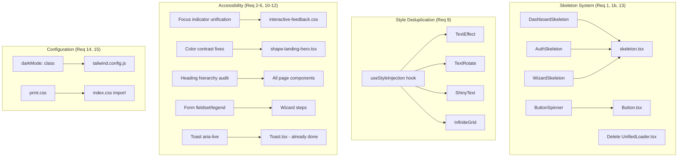

# Design Document: UI/UX Quality Audit

## Overview

This design covers a comprehensive UI/UX quality audit and polish pass for the MIHAS admissions application (`apps/admissions/`). The audit addresses 15 requirement areas spanning loading state consistency, accessibility compliance, animation performance, and print support. The changes are entirely frontend-scoped — no backend modifications are needed.

The core strategy is:

1. **Eliminate spinner-based loading** — replace all `UnifiedLoader` usages with layout-matched skeleton components, then delete `UnifiedLoader.tsx`.
2. **Unify accessibility patterns** — standardize focus indicators, heading hierarchy, form grouping, screen reader announcements, and color contrast to WCAG 2.1 AA.
3. **Optimize animation performance** — deduplicate inline `<style>` injections from SmoothUI components via a shared style registry hook.
4. **Harden configuration** — fix dark mode config, add print stylesheet, ensure 320px viewport support.

All changes target `apps/admissions/src/` and its configuration files.

## Architecture

### High-Level Change Map



### File Change Summary

| Action | File | Requirement |
|--------|------|-------------|
| Create | `src/components/ui/ButtonSpinner.tsx` | 1b.3 |
| Modify | `src/components/ui/Button.tsx` — import from `ButtonSpinner` | 1b.3 |
| Delete | `src/components/ui/UnifiedLoader.tsx` | 1b.1 |
| Modify | 30+ files — replace `UnifiedLoader` imports | 1b.2, 1b.5 |
| Modify | `src/components/ui/skeleton.tsx` — add `DashboardSkeleton`, `AuthSkeleton`, `WizardSkeleton` | 13.1–13.3 |
| Modify | `src/routes/config.tsx` consumer (App.tsx or route renderer) — wire skeleton fallbacks | 13.4–13.6 |
| Create | `src/hooks/useStyleInjection.ts` | 9.1, 9.2 |
| Modify | `src/components/smoothui/text-effect.tsx` — use `useStyleInjection` | 9.1 |
| Modify | `src/components/smoothui/text-rotate.tsx` — use `useStyleInjection` | 9.1 |
| Modify | `src/components/smoothui/shiny-text.tsx` — use `useStyleInjection` | 9.1 |
| Modify | `src/components/smoothui/infinite-grid.tsx` — use `useStyleInjection` | 9.1 |
| Modify | `src/styles/interactive-feedback.css` — replace `blue-600` with `ring` token | 3.6 |
| Modify | 15+ admin components — replace `focus:ring-blue-500` patterns | 3.2 |
| Modify | `src/components/smoothui/shape-landing-hero.tsx` — fix contrast classes | 2.1, 2.3 |
| Modify | `tailwind.config.js` — `darkMode: 'class'` | 14.3, 14.5 |
| Create | `src/styles/print.css` | 15.1 |
| Modify | `src/index.css` — import `print.css` | 15.1 |
| Modify | `src/components/ui/EmptyState.tsx` — add `secondaryAction`, `headingLevel` props | 6.4, 6.5 |
| Modify | `src/components/ui/ErrorDisplay.tsx` — add `supportUrl`, `onGoBack` props | 7.1–7.3 |
| Modify | Wizard step components — add `<fieldset>`/`<legend>` | 5.1 |
| Modify | Wizard index — add error summary with focus management | 5.2, 5.3 |
| Modify | Landing page sections — fix heading levels | 4.3 |
| Modify | `src/components/ui/PageShell.tsx` — validate heading hierarchy in dev | 4.6 |

## Components and Interfaces

### 1. ButtonSpinner

Extracted from `UnifiedLoader.tsx`'s `UnifiedSpinner` sub-component. Co-located with `Button.tsx`.

```typescript
// src/components/ui/ButtonSpinner.tsx
interface ButtonSpinnerProps {
  size?: 'sm' | 'md' | 'lg';
  className?: string;
}

export function ButtonSpinner({ size = 'md', className }: ButtonSpinnerProps): JSX.Element;
```

The component renders the same SVG spinner + static fallback (for `prefers-reduced-motion`) that `UnifiedSpinner` currently provides. `Button.tsx` changes its import from `import { UnifiedSpinner } from './UnifiedLoader'` to `import { ButtonSpinner } from './ButtonSpinner'`.

### 2. Skeleton Page Components

All added to `src/components/ui/skeleton.tsx` alongside existing `Skeleton`, `SkeletonText`, `SkeletonCard` primitives.

```typescript
// DashboardSkeleton — extracted from Dashboard.tsx inline skeleton JSX
export function DashboardSkeleton(): JSX.Element;

// AuthSkeleton — matches AuthLayout structure (centered card, logo, form fields)
export function AuthSkeleton(): JSX.Element;

// WizardSkeleton — matches wizard layout (progress bar, step header, form area, sidebar)
export function WizardSkeleton(): JSX.Element;
```

**DashboardSkeleton**: Extracts the existing `isInitialLoading` skeleton block from `Dashboard.tsx` (lines ~580–640) into a standalone component. The Dashboard then imports and renders `<DashboardSkeleton />` instead of inline JSX.

**AuthSkeleton**: Mimics the `AuthLayout` structure:
- Desktop: split layout with gradient left panel placeholder + right form card
- Mobile: single column with gradient bar + card
- Card contains: logo placeholder, heading skeleton, 2–3 input field skeletons, button skeleton

**WizardSkeleton**: Mimics the wizard layout:
- Progress indicator bar (skeleton strip)
- Step title + description skeletons
- Form area with 4–5 field skeletons
- Navigation button skeletons (Previous / Next)
- Sidebar with checklist skeleton

### 3. Route Skeleton Fallback Wiring

The `routes/config.tsx` already defines `skeletonType` per route. The route renderer (in `App.tsx` or a `<RouteSuspenseWrapper>`) maps `skeletonType` to the corresponding skeleton component:

```typescript
function getSkeletonFallback(type?: SkeletonType): JSX.Element {
  switch (type) {
    case 'dashboard': return <DashboardSkeleton />;
    case 'auth': return <AuthSkeleton />;
    case 'wizard': return <WizardSkeleton />;
    case 'admin-table': return <DashboardSkeleton />; // reuse dashboard skeleton
    case 'detail': return <SkeletonCard />;
    case 'none': return <></>;
    default: return <DashboardSkeleton />;
  }
}
```

Each lazy route's `<Suspense>` fallback uses `getSkeletonFallback(route.skeletonType)`.

### 4. useStyleInjection Hook

Shared style registry to deduplicate inline `<style>` tags from SmoothUI components.

```typescript
// src/hooks/useStyleInjection.ts

/**
 * Injects a CSS string into the document <head> exactly once per unique key.
 * Tracks injected keys in a module-level Set. Cleans up when the last
 * consumer unmounts (ref-counted).
 */
export function useStyleInjection(key: string, css: string): void;
```

**Implementation strategy**:
- Module-level `Map<string, { element: HTMLStyleElement; refCount: number }>`.
- On mount: if key not in map, create `<style>` element with `data-style-key={key}`, append to `<head>`, set refCount=1. If key exists, increment refCount.
- On unmount: decrement refCount. If 0, remove the `<style>` element and delete from map.
- Each SmoothUI component replaces its inline `<style>{...}</style>` JSX with a `useStyleInjection('text-effect-keyframes', css)` call.

**Migration per component**:
- `TextEffect`: key `'text-effect'`, CSS contains `.text-effect` initial/animated state classes
- `TextRotate`: key `'text-rotate'`, CSS contains `.text-rotate-wrapper` and `.text-rotate-inner` classes
- `ShinyText`: key `'shiny-text-shimmer'`, CSS contains `@keyframes shiny-text-shimmer`
- `InfiniteGrid`: key `'infinite-grid-scroll'`, CSS contains `@keyframes infinite-grid-scroll` (parameterized by `cellSize`, so the key includes the cellSize value)

### 5. EmptyState Enhanced Interface

```typescript
// Updated EmptyState props
export interface EmptyStateProps {
  icon?: React.ReactNode;
  heading: string;
  description?: string;
  action?: {
    label: string;
    onClick: () => void;
    variant?: 'primary' | 'outline';
  };
  secondaryAction?: {           // NEW (Req 6.4)
    label: string;
    onClick: () => void;
  };
  headingLevel?: 'h2' | 'h3';  // NEW (Req 6.5), default 'h3'
  className?: string;
}
```

### 6. ErrorDisplay Enhanced Interface

```typescript
// Updated ErrorDisplay props
export interface ErrorDisplayProps {
  title?: string;
  message: string;
  onRetry?: () => void;
  onGoBack?: () => void;         // NEW (Req 7.2)
  supportUrl?: string;           // NEW (Req 7.3), default '/contact'
  variant?: 'inline' | 'section';
  className?: string;
}
```

When `onRetry` is absent but `onGoBack` is provided, the component renders "Go Back" + "Contact Support" instead of "Retry".

### 7. Focus Indicator CSS Changes

**`interactive-feedback.css` global rule change**:

```css
/* BEFORE */
*:focus-visible {
  @apply outline-2 outline-offset-2 outline-blue-600 ring-2 ring-blue-600 ring-offset-2;
}

/* AFTER */
*:focus-visible {
  @apply outline-none ring-2 ring-ring ring-offset-2;
}
```

Similarly for `input:focus-visible`, `textarea:focus-visible`, `select:focus-visible`, and `[tabindex]:focus-visible`.

The `.focus-ring-input` utility changes from `focus:ring-blue-600` to `focus-visible:ring-ring`.

All admin components using `focus:ring-2 focus:ring-blue-500` or `focus:ring-blue-600` inline classes get replaced with `focus-visible:ring-2 focus-visible:ring-ring focus-visible:ring-offset-2 focus-visible:outline-none`.

### 8. Color Contrast Fixes

The hero section in `shape-landing-hero.tsx` uses `text-white/90` and `text-white/80` on a gradient from `primary` via `secondary` to `primary` with a `from-black/40 to-black/10` overlay.

**Computed contrast analysis** (darkest gradient point ≈ `#0a4a7a` with black overlay):
- `text-white` (opacity 1.0): ~12.5:1 ✅ AA
- `text-white/90` (effective `rgba(255,255,255,0.9)`): ~10.8:1 ✅ AA
- `text-white/80` (effective `rgba(255,255,255,0.8)`): ~9.2:1 ✅ AA for large text, borderline for small text
- `text-white/70`: ~7.6:1 ✅ AA for large text only

**Fixes**:
- `text-white/80` on small text (ShinyText brand accent, hero overlay caption) → `text-white/90` or `text-white`
- `text-white/70` on small text (AuthLayout feature descriptions) → `text-white/80` (large text context) or `text-white/90` (small text)
- Add a contrast audit comment block in `shape-landing-hero.tsx` documenting each pair

### 9. Print Stylesheet

```css
/* src/styles/print.css */
@media print {
  @page {
    margin: 2cm;
  }

  body {
    background: white !important;
    color: black !important;
    font-size: 12pt;
  }

  /* Hide non-content elements */
  nav, footer, aside,
  .toast-container, [role="status"],
  .skip-link, .fab, .floating-action,
  button:not([type="submit"]),
  [aria-hidden="true"],
  .animate-pulse, .animate-spin,
  .preloader { display: none !important; }

  /* Single column layout */
  .grid { display: block !important; }

  /* Ensure links show URLs */
  a[href]::after { content: " (" attr(href) ")"; font-size: 10pt; }
  a[href^="#"]::after, a[href^="javascript"]::after { content: ""; }

  /* Status cards: clean borders */
  .rounded-xl, .rounded-lg, .rounded-2xl {
    border: 1px solid #333 !important;
    box-shadow: none !important;
    break-inside: avoid;
  }
}
```

### 10. Tailwind Dark Mode Fix

```javascript
// tailwind.config.js — line 3
// BEFORE: darkMode: 'media',
// AFTER:
darkMode: 'class',
```

This prevents system-preference-based dark mode activation. Combined with the existing `class="light"` on `<html>` in `index.html` and the `main.tsx` enforcement, the app stays in light mode.


## Data Models

This audit is entirely frontend-scoped. No database models, API endpoints, or backend changes are required.

### Component Prop Changes (Data Shape Changes)

| Component | Prop Added | Type | Default | Requirement |
|-----------|-----------|------|---------|-------------|
| `EmptyState` | `secondaryAction` | `{ label: string; onClick: () => void }` | `undefined` | 6.4 |
| `EmptyState` | `headingLevel` | `'h2' \| 'h3'` | `'h3'` | 6.5 |
| `ErrorDisplay` | `onGoBack` | `() => void` | `undefined` | 7.2 |
| `ErrorDisplay` | `supportUrl` | `string` | `'/contact'` | 7.3 |
| `ButtonSpinner` | `size` | `'sm' \| 'md' \| 'lg'` | `'md'` | 1b.3 |
| `ButtonSpinner` | `className` | `string` | `undefined` | 1b.3 |

### Style Injection Registry (In-Memory State)

```typescript
// Module-level singleton — not persisted, not serialized
const styleRegistry = new Map<string, { element: HTMLStyleElement; refCount: number }>();
```

### UnifiedLoader Import Replacement Map

The following files import `UnifiedLoader` or `UnifiedSpinner` and need migration:

**Files importing `UnifiedSpinner` (keep spinner behavior via `ButtonSpinner`)**:
- `Button.tsx` → import `ButtonSpinner` from `./ButtonSpinner`
- `LoadingButton.tsx` → import `ButtonSpinner` from `./ButtonSpinner`
- `EnhancedFileUpload.tsx` → import `ButtonSpinner` from `./ButtonSpinner`
- `InlineLoader.tsx` → import `ButtonSpinner` from `./ButtonSpinner`
- `AuthLoadingOverlay.tsx` → import `ButtonSpinner` from `./ButtonSpinner`
- `ReportsGenerator.tsx` → import `ButtonSpinner` from `./ButtonSpinner`
- `ApplicationsTable.tsx` → import `ButtonSpinner` from `./ButtonSpinner`
- `ApplicationDetailModal.tsx` → import `ButtonSpinner` from `./ButtonSpinner`
- `ApplicationCard.tsx` → import `ButtonSpinner` from `./ButtonSpinner`
- `ApplicationApprovalActions.tsx` → import `ButtonSpinner` from `./ButtonSpinner`

**Files importing `UnifiedLoader` (replace with skeleton or remove)**:
- `LoadingOverlay.tsx` → replace with skeleton-based overlay or remove
- `LoadingSpinner.tsx` → replace with skeleton or `ButtonSpinner`
- `LoadingFallback.tsx` → replace with appropriate skeleton component
- `GuardInlineSkeleton.tsx` → replace with `Skeleton` primitives
- `App.tsx` → replace Suspense fallback with `getSkeletonFallback()`
- `SignInPage.tsx` → replace overlay with `AuthSkeleton` or remove
- `SignUpPage.tsx` → replace overlay with `AuthSkeleton` or remove
- `applicationWizard/index.tsx` → replace loading state with `WizardSkeleton`
- Admin pages (`Dashboard.tsx`, `Applications.tsx`, `Settings.tsx`, `Programs.tsx`, `Intakes.tsx`, `AuditTrail.tsx`, `ProgramFees.tsx`) → replace with `DashboardSkeleton` or inline skeletons
- Admin components (`CommunicationHistory.tsx`, `UserActivityLog.tsx`, `EnhancedApplicationsManager.tsx`, `UserPermissions.tsx`, `EmailNotifications.tsx`, `StatusHistoryTab.tsx`, `GradesTab.tsx`, `DocumentsTab.tsx`) → replace with `Skeleton` primitives
- Student pages (`NotificationSettings.tsx`, `ApplicationStatus.tsx`, `Payment.tsx`, `Interview.tsx`, `Settings.tsx`, `ApplicationDetail.tsx`) → replace with `SkeletonCard` or `Skeleton` primitives


## Correctness Properties

*A property is a characteristic or behavior that should hold true across all valid executions of a system — essentially, a formal statement about what the system should do. Properties serve as the bridge between human-readable specifications and machine-verifiable correctness guarantees.*

### Property 1: Button loading state renders inline spinner

*For any* Button component rendered with `loading={true}` and any valid `variant` and `size` combination, the rendered output SHALL contain exactly one SVG spinner element inside the button, and the button SHALL have `aria-busy="true"` and `disabled` attributes.

**Validates: Requirements 1b.3, 1b.4**

### Property 2: suggestAccessibleColor always returns a WCAG-compliant color

*For any* base foreground color, background color, and target contrast ratio (defaulting to 4.5), the color returned by `suggestAccessibleColor(baseColor, background, targetRatio)` SHALL have a contrast ratio ≥ `targetRatio` against the given background, as computed by `getContrastRatio`.

**Validates: Requirements 2.1, 2.5**

### Property 3: Heading hierarchy validation is correct

*For any* array of heading levels (1–6), `validateHeadingHierarchy(headings)` SHALL return `true` if and only if: (a) the first heading is `h1`, (b) there is exactly one `h1`, and (c) no heading level increases by more than 1 from its predecessor. For any array violating these rules, it SHALL return `false`.

**Validates: Requirements 4.1, 4.2, 4.6**

### Property 4: Form error messages are announced via aria-live

*For any* Input component rendered with a non-empty `error` prop, the error message element SHALL have `role="alert"` (which implicitly provides assertive announcement), ensuring screen readers announce validation errors.

**Validates: Requirements 5.5, 5.6**

### Property 5: EmptyState renders according to prop contract

*For any* `EmptyState` component rendered with a `headingLevel` prop of `'h2'` or `'h3'`, the heading element SHALL use the corresponding HTML tag. When a `secondaryAction` prop is provided, the rendered output SHALL contain a button with the secondary action's label text. When `secondaryAction` is absent, no secondary button SHALL appear.

**Validates: Requirements 6.4, 6.5**

### Property 6: ErrorDisplay supportUrl defaults and overrides correctly

*For any* `ErrorDisplay` component, when `supportUrl` is not provided, the "Contact Support" link SHALL point to `/contact`. When `supportUrl` is provided with any valid URL string, the link SHALL point to that URL. When `onGoBack` is provided but `onRetry` is not, the component SHALL render a "Go Back" button instead of a "Retry" button.

**Validates: Requirements 7.1, 7.2, 7.3**

### Property 7: Style injection deduplicates across multiple component instances

*For any* number N ≥ 1 of simultaneously rendered instances of a SmoothUI component (TextEffect, TextRotate, ShinyText, or InfiniteGrid) sharing the same style key, the document SHALL contain exactly one `<style>` element with that key's `data-style-key` attribute. When all N instances unmount, the `<style>` element SHALL be removed from the document.

**Validates: Requirements 9.1, 9.2**

### Property 8: FocusTrap cycles focus within container

*For any* set of focusable elements inside an active FocusTrap, pressing Tab on the last focusable element SHALL move focus to the first focusable element, and pressing Shift+Tab on the first focusable element SHALL move focus to the last focusable element.

**Validates: Requirements 10.2**

### Property 9: Arrow key navigation computes correct index

*For any* current index in range [0, itemCount-1] and itemCount > 0, `handleHorizontalArrowNavigation` with ArrowRight SHALL produce `(currentIndex + 1) % itemCount`, and with ArrowLeft SHALL produce `(currentIndex - 1 + itemCount) % itemCount`. Home SHALL produce 0 and End SHALL produce `itemCount - 1`.

**Validates: Requirements 10.4**

### Property 10: Decorative SmoothUI elements use aria-hidden

*For any* rendered instance of `InfiniteGrid`, the root container element SHALL have `aria-hidden="true"`. *For any* rendered instance of `ShinyText` in its shimmer animation state, the component SHALL not expose animation internals to the accessibility tree.

**Validates: Requirements 11.6**

### Property 11: Skeleton type mapping returns correct component

*For any* `SkeletonType` value from the set `{'dashboard', 'auth', 'wizard', 'admin-table', 'detail', 'none'}`, the `getSkeletonFallback` function SHALL return the corresponding skeleton component: `DashboardSkeleton` for `'dashboard'` and `'admin-table'`, `AuthSkeleton` for `'auth'`, `WizardSkeleton` for `'wizard'`, `SkeletonCard` for `'detail'`, and an empty fragment for `'none'`.

**Validates: Requirements 13.4, 13.5, 13.6**

## Error Handling

### Loading State Errors

- If a skeleton component fails to render (e.g., missing props), fall back to a minimal `<Skeleton className="h-screen" />` rather than showing a blank screen.
- The `getSkeletonFallback` function has a `default` case that returns `<DashboardSkeleton />` for any unrecognized `skeletonType` value.

### Style Injection Errors

- If `useStyleInjection` fails to create a `<style>` element (e.g., CSP restriction), catch the error silently and log a dev-mode warning. The component should still render — the styles will be missing but the content remains accessible.
- The ref-counting cleanup in `useStyleInjection` uses a try/catch around `removeChild` to handle edge cases where the element was already removed.

### Contrast Utility Errors

- `suggestAccessibleColor` has a maximum of 50 iterations. If it cannot find a compliant color within 50 steps, it returns pure white (`#ffffff`) for dark backgrounds or pure black (`#000000`) for light backgrounds — guaranteed to provide maximum contrast.
- `parseColor` returns `null` for unrecognized color formats. `getContrastRatio` returns `1` (minimum ratio) when either color fails to parse, which correctly flags the pair as failing WCAG.

### Form Validation Errors

- The wizard error summary component gracefully handles empty error arrays (renders nothing).
- Focus management on validation failure uses `setTimeout(100ms)` to ensure the DOM has updated before attempting to focus the first errored field. If no errored field is found, focus falls back to the error summary container.

### Print Stylesheet

- The print stylesheet uses `!important` declarations to override inline styles and Tailwind utilities, ensuring consistent print output regardless of component state.
- Elements hidden via `display: none !important` in print include all interactive controls except submit buttons, preventing confusion on printed pages.

## Testing Strategy

### Dual Testing Approach

This feature requires both unit tests and property-based tests:

- **Unit tests**: Verify specific rendering examples, regression cases, and edge conditions (e.g., "AuthSkeleton renders without errors", "Toast Escape key dismisses all toasts", "print.css contains @page rules").
- **Property tests**: Verify universal properties across randomized inputs using `fast-check` (e.g., "suggestAccessibleColor always returns a compliant color for any color pair", "validateHeadingHierarchy correctly classifies any heading sequence").

### Property-Based Testing Configuration

- **Library**: `fast-check` (already in the project's test dependencies)
- **Minimum iterations**: 100 per property test
- **Tag format**: Each test includes a comment: `// Feature: ui-ux-quality-audit, Property {N}: {title}`

### Property Test Plan

| Property | Test Description | Generator Strategy |
|----------|-----------------|-------------------|
| P1: Button loading spinner | Render Button with random variant × size × loading=true, assert spinner SVG present | `fc.constantFrom(...variants)` × `fc.constantFrom(...sizes)` |
| P2: suggestAccessibleColor | Generate random hex colors for foreground and background, call suggestAccessibleColor, verify result contrast ≥ 4.5 | `fc.hexaString({minLength:6, maxLength:6})` mapped to `#` prefix |
| P3: Heading hierarchy | Generate random arrays of heading levels (1–6), verify validateHeadingHierarchy matches the specification rules | `fc.array(fc.integer({min:1, max:6}), {minLength:1, maxLength:20})` |
| P4: Form error aria-live | Render Input with random non-empty error string, assert role="alert" on error element | `fc.string({minLength:1})` |
| P5: EmptyState props | Generate random headingLevel and optional secondaryAction, verify rendered tag and button presence | `fc.constantFrom('h2','h3')` × `fc.option(fc.record({label: fc.string(), onClick: fc.constant(()=>{})}))` |
| P6: ErrorDisplay supportUrl | Generate random URL strings, verify link href matches; test onGoBack vs onRetry rendering | `fc.webUrl()` or `fc.string()` prefixed with `/` |
| P7: Style deduplication | Render N instances (1–10) of a test component using useStyleInjection with same key, count style elements | `fc.integer({min:1, max:10})` |
| P8: FocusTrap | Create container with N focusable elements (1–10), simulate Tab/Shift+Tab, verify wrap | `fc.integer({min:1, max:10})` |
| P9: Arrow key navigation | Generate random currentIndex and itemCount, verify ArrowRight/ArrowLeft/Home/End produce correct index | `fc.integer({min:0, max:99})` × `fc.integer({min:1, max:100})` with constraint |
| P10: Decorative aria-hidden | Render InfiniteGrid with random props, verify aria-hidden="true" | `fc.integer({min:20, max:100})` for cellSize |
| P11: Skeleton mapping | For each SkeletonType, verify getSkeletonFallback returns correct component type | `fc.constantFrom('dashboard','auth','wizard','admin-table','detail','none')` |

### Unit Test Plan (Key Examples)

- AuthSkeleton renders matching AuthLayout structure (logo area, heading, form fields, button)
- WizardSkeleton renders matching wizard layout (progress bar, step area, nav buttons, sidebar)
- DashboardSkeleton renders matching dashboard layout (status grid, applications card, sidebar)
- ButtonSpinner renders SVG with correct size class for each size prop
- Print stylesheet contains `@media print`, `@page`, `background: white`, `color: black`
- `tailwind.config.js` has `darkMode: 'class'`
- `interactive-feedback.css` global `*:focus-visible` uses `ring-ring` not `blue-600`
- Toast container has separate `aria-live="assertive"` and `aria-live="polite"` regions (regression)
- Wizard step announcement updates on step change (regression)
- TextRotate has `aria-live="polite"` (regression)

