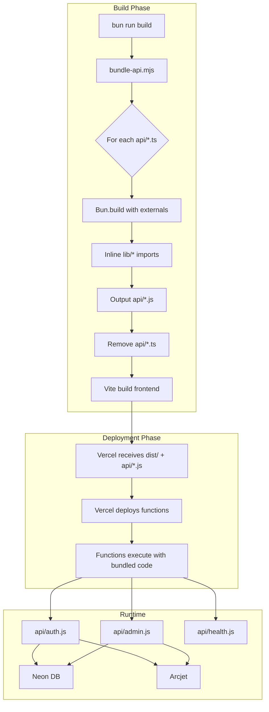
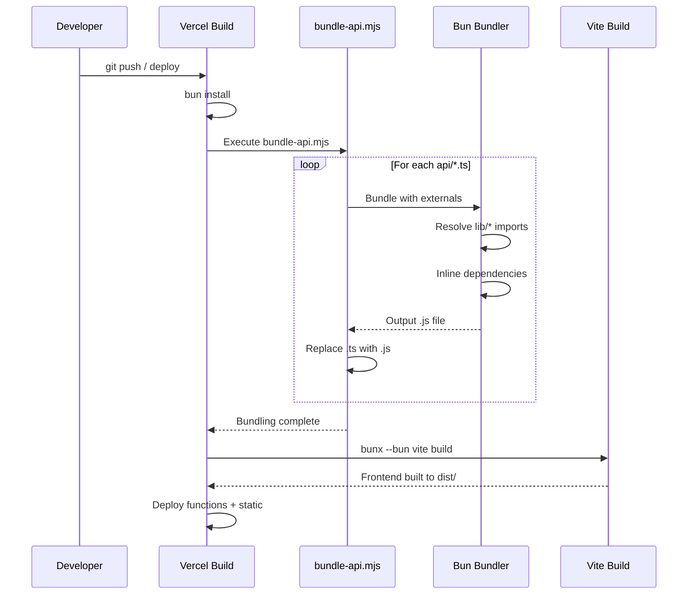

# Design Document: Vercel API Bundling Fix

## Overview

This design addresses the Vercel deployment failure where API endpoints fail with `ERR_MODULE_NOT_FOUND` errors because Vercel's Node File Trace (NFT) cannot trace imports from the `lib/` directory at runtime. The solution uses Bun's bundler to pre-bundle each API endpoint with its dependencies from `lib/`, producing self-contained JavaScript files that Vercel can deploy without runtime import resolution issues.

### Problem Analysis

The current architecture has:
- 11 API endpoint files in `api/` directory (TypeScript)
- 20+ shared utility files in `lib/` directory
- API files import from `../lib/*` which works locally but fails on Vercel

Vercel's NFT traces imports at build time but only includes files within the function's directory scope. Since `lib/` is outside `api/`, these imports are not bundled into the serverless function.

### Solution Approach

Pre-bundle each API endpoint using Bun's bundler before deployment:
1. Bundle each `api/*.ts` file into a self-contained `api/*.js` file
2. Inline all `lib/` imports into the bundle
3. Mark npm packages as external (Vercel installs these at runtime)
4. Replace source `.ts` files with bundled `.js` files for deployment

## Architecture



### Build Pipeline Flow



## Components and Interfaces

### Component 1: Bundle Script (`scripts/bundle-api.mjs`)

The core bundling script that processes API endpoints.

```typescript
interface BundleConfig {
  apiDir: string;           // Path to api/ directory
  externals: string[];      // npm packages to exclude from bundle
  target: 'node';           // Bun build target
  format: 'esm';            // Output format (ES modules)
}

interface BundleResult {
  file: string;             // Original filename
  outputPath: string;       // Path to bundled .js file
  sizeKB: number;           // Bundle size in KB
  success: boolean;         // Whether bundling succeeded
  error?: string;           // Error message if failed
}

interface BundleSummary {
  total: number;            // Total files processed
  success: number;          // Successfully bundled
  failed: number;           // Failed to bundle
  results: BundleResult[];  // Individual results
}
```

**Responsibilities:**
- Discover all `.ts` files in `api/` directory
- Filter out files starting with `_` (internal/legacy)
- Bundle each file with Bun, marking externals
- Replace `.ts` files with bundled `.js` files
- Report progress and errors

### Component 2: External Package Registry

Defines which npm packages should NOT be bundled (Vercel installs them).

```typescript
const EXTERNAL_PACKAGES: readonly string[] = [
  // Vercel runtime
  '@vercel/node',
  
  // Database
  '@neondatabase/serverless',
  
  // Security
  '@arcjet/node',
  'arcjet',
  
  // Auth
  'jose',
  'bcryptjs',
  
  // Services
  'web-push',
  'resend',
] as const;
```

**Rationale for externals:**
- `@vercel/node`: Provided by Vercel runtime, types only
- `@neondatabase/serverless`: Database driver, must be installed fresh
- `@arcjet/node`, `arcjet`: Security service with runtime requirements
- `jose`: JWT library for token signing/verification
- `bcryptjs`: Pure JavaScript bcrypt implementation for password hashing
- `web-push`: Push notification service
- `resend`: Email service SDK (for future use)

**Note:** `@supabase/supabase-js` is NOT needed - the codebase uses Neon directly via `lib/db.ts`. The `lib/supabaseClient.ts` is a compatibility layer that wraps `lib/db.ts`.

### Component 3: Vercel Configuration (`vercel.json`)

```typescript
interface VercelConfig {
  buildCommand: string;     // "bun run scripts/bundle-api.mjs && bunx --bun vite build"
  installCommand: string;   // "bun install"
  outputDirectory: string;  // "dist"
  framework: null;          // No framework detection
  functions: {
    'api/*.js': {
      maxDuration: number;  // 10 seconds
    };
  };
  rewrites: RewriteRule[];
  headers: HeaderRule[];
}

interface RewriteRule {
  source: string;           // URL pattern
  destination: string;      // Target function
}
```

### Component 4: File System Operations

```typescript
interface FileOperations {
  // List all .ts files in api/ directory
  discoverApiFiles(apiDir: string): string[];
  
  // Check if file should be processed
  shouldProcess(filename: string): boolean;
  
  // Get output path for bundled file
  getOutputPath(inputPath: string): string;
  
  // Replace source with bundle
  replaceSourceWithBundle(sourcePath: string, bundlePath: string): void;
  
  // Get file size in KB
  getFileSizeKB(path: string): number;
}
```

## Data Models

### Bundle Configuration Model

```typescript
interface BundleOptions {
  // Input file path (absolute)
  entrypoint: string;
  
  // Output file path (absolute)
  outfile: string;
  
  // Build target
  target: 'node';
  
  // Output format
  format: 'esm';
  
  // Packages to exclude from bundle
  external: string[];
  
  // Minification (disabled for debugging)
  minify: boolean;
  
  // Source maps (disabled for production)
  sourcemap: 'none' | 'external' | 'inline';
}
```

### Build Result Model

```typescript
interface BuildOutput {
  // Whether build succeeded
  success: boolean;
  
  // Output files generated
  outputs: {
    path: string;
    kind: 'entry-point' | 'chunk' | 'asset';
    size: number;
  }[];
  
  // Build logs
  logs: {
    level: 'error' | 'warning' | 'info';
    message: string;
  }[];
}
```

### API Endpoint Inventory

Current API endpoints that need bundling:

| File | Imports from lib/ | External Packages |
|------|-------------------|-------------------|
| `auth.ts` | cors, db, auth/*, arcjet, errorHandler | @vercel/node, jose, bcryptjs, @arcjet/node |
| `admin.ts` | cors, db, auth/*, arcjet, errorHandler, supabaseClient, auditLogger | @vercel/node, @arcjet/node, bcryptjs |
| `applications.ts` | cors, db, auth/*, arcjet, errorHandler | @vercel/node, @arcjet/node |
| `catalog.ts` | cors, db, queries, arcjet, errorHandler | @vercel/node, @arcjet/node |
| `documents.ts` | cors, db, auth/*, arcjet, errorHandler, supabaseClient, storage | @vercel/node, @arcjet/node |
| `health.ts` | (none - uses dynamic import) | @vercel/node, @neondatabase/serverless |
| `notifications.ts` | cors, db, auth/*, arcjet, queries, errorHandler | @vercel/node, @arcjet/node, web-push |
| `payments.ts` | cors, db, auth/*, arcjet, queries, errorHandler | @vercel/node, @arcjet/node |
| `sessions.ts` | db, queries | @vercel/node |
| `ping.ts` | (none - inline) | @vercel/node |
| `[...path].ts` | cors, errorHandler | @vercel/node |
| `dbtest.ts` | db | @vercel/node, @neondatabase/serverless |

**Key Observations:**
- All `lib/` imports will be inlined by the bundler
- `@neondatabase/serverless` is dynamically imported in `lib/db.ts`, so it must be external
- `bcryptjs` is used (not native `bcrypt`) - pure JavaScript, no native bindings
- No `@supabase/supabase-js` imports in any API files or lib/ files


## Correctness Properties

*A property is a characteristic or behavior that should hold true across all valid executions of a system—essentially, a formal statement about what the system should do. Properties serve as the bridge between human-readable specifications and machine-verifiable correctness guarantees.*

Based on the prework analysis, the following properties have been identified after eliminating redundancy:

### Property 1: One-to-One File Transformation

*For any* `.ts` file in the `api/` directory (excluding files starting with `_`), bundling SHALL produce exactly one `.js` file with the same base name, and the original `.ts` file SHALL be removed.

**Validates: Requirements 1.1, 1.4, 2.1, 2.2, 5.1, 5.2, 5.4**

This property ensures:
- `auth.ts` → `auth.js` (and `auth.ts` removed)
- `admin.ts` → `admin.js` (and `admin.ts` removed)
- `[...path].ts` → `[...path].js` (and `[...path].ts` removed)
- No extra files created that would count toward Vercel's function limit

### Property 2: Import Resolution Correctness

*For any* bundled `.js` file, all imports from `../lib/*` paths SHALL be inlined (not present as import statements), AND all imports from external packages SHALL be preserved as import statements.

**Validates: Requirements 1.2, 1.3, 3.1-3.9**

This property ensures:
- The bundled file is self-contained for `lib/` dependencies
- External packages like `@vercel/node`, `jose`, `@arcjet/node` remain as imports
- Vercel can install external packages at runtime

### Property 3: Underscore File Exclusion

*For any* file in the `api/` directory starting with `_` (underscore), the Bundle_Script SHALL NOT process, modify, or delete that file.

**Validates: Requirements 5.3**

This property ensures:
- Legacy files like `_auth.ts.legacy` are preserved
- Internal utility files are not accidentally bundled as functions

### Property 4: Build Output Logging

*For any* successfully bundled file, the Bundle_Script SHALL log a message containing the original filename and the output file size in KB.

**Validates: Requirements 4.4, 7.1-7.5**

This property ensures:
- Developers can verify bundling succeeded
- Bundle sizes are visible for optimization decisions
- Build logs provide actionable information

## Error Handling

### Bundling Errors

| Error Condition | Handling | Exit Code |
|-----------------|----------|-----------|
| No `.ts` files found | Log warning, continue to Vite build | 0 |
| Bun build fails for a file | Log error with filename, continue others | 1 (at end) |
| All files fail to bundle | Log summary, exit immediately | 1 |
| File system error (read/write) | Log error, exit | 1 |
| Function count > 12 | Log error with count, exit | 1 |

### Error Message Format

```
❌ {filename}: {error_message}
```

Example:
```
❌ auth.ts: Cannot resolve module '../lib/nonexistent'
```

### Recovery Strategy

1. **Partial Success**: If some files bundle successfully, continue with others
2. **Final Summary**: Always report total success/failure count
3. **Non-Zero Exit**: Any failure results in non-zero exit to prevent deployment

### Graceful Degradation

The script does NOT support graceful degradation—if bundling fails, deployment must be blocked. This is intentional because:
- Deploying unbundled `.ts` files will fail at runtime
- Partial deployments could leave the API in an inconsistent state
- Production users in Zambia depend on working API endpoints

## Testing Strategy

### Dual Testing Approach

Testing uses both unit tests and property-based tests:
- **Unit tests**: Verify specific examples, edge cases, and error conditions
- **Property tests**: Verify universal properties across generated inputs

### Unit Tests

| Test Case | Description | Requirements |
|-----------|-------------|--------------|
| Bundle single file | Verify one `.ts` file bundles correctly | 1.1, 1.4 |
| Bundle multiple files | Verify all files in directory are processed | 1.1, 2.1 |
| Skip underscore files | Verify `_*.ts` files are not processed | 5.3 |
| Handle special filenames | Verify `[...path].ts` bundles correctly | 5.5 |
| External packages preserved | Verify `@vercel/node` import in output | 3.1, 3.9 |
| lib/ imports inlined | Verify no `../lib/` imports in output | 1.2 |
| Error on invalid file | Verify error handling for syntax errors | 1.5 |
| Function count validation | Verify error when > 12 functions | 2.3, 2.4 |

### Property-Based Tests

Property-based tests use `fast-check` library with minimum 100 iterations per test.

#### Test 1: File Transformation Property
```typescript
// Feature: vercel-api-bundling-fix, Property 1: One-to-One File Transformation
// For any valid .ts filename, bundling produces exactly one .js file with same base name
fc.assert(
  fc.property(
    fc.string().filter(s => s.endsWith('.ts') && !s.startsWith('_')),
    (filename) => {
      const result = bundleFile(filename);
      return result.outputPath === filename.replace('.ts', '.js');
    }
  ),
  { numRuns: 100 }
);
```

#### Test 2: Import Resolution Property
```typescript
// Feature: vercel-api-bundling-fix, Property 2: Import Resolution Correctness
// For any bundled file, lib/ imports are inlined and externals are preserved
fc.assert(
  fc.property(
    fc.constantFrom(...API_FILES),
    (apiFile) => {
      const bundled = readBundledFile(apiFile);
      const hasLibImports = bundled.includes("from '../lib/") || bundled.includes("from \"../lib/");
      const hasExternalImports = EXTERNALS.some(ext => bundled.includes(`from '${ext}'`) || bundled.includes(`from "${ext}"`));
      return !hasLibImports; // lib imports should be inlined (not present)
    }
  ),
  { numRuns: 100 }
);
```

#### Test 3: Underscore Exclusion Property
```typescript
// Feature: vercel-api-bundling-fix, Property 3: Underscore File Exclusion
// For any file starting with _, it should not be processed
fc.assert(
  fc.property(
    fc.string().map(s => '_' + s + '.ts'),
    (underscoreFile) => {
      const processed = getProcessedFiles();
      return !processed.includes(underscoreFile);
    }
  ),
  { numRuns: 100 }
);
```

### Integration Tests

| Test Case | Description |
|-----------|-------------|
| Full build pipeline | Run complete build command, verify all outputs |
| Vercel deployment simulation | Verify bundled files work with Vercel runtime |
| Import resolution end-to-end | Verify bundled auth.js can import from jose |

### Test Configuration

```typescript
// vitest.config.ts additions for property tests
export default defineConfig({
  test: {
    include: ['tests/**/*.test.ts', 'tests/**/*.property.ts'],
    coverage: {
      include: ['scripts/bundle-api.mjs'],
    },
  },
});
```

### Manual Verification Checklist

Before deployment, manually verify:
- [ ] `bun run scripts/bundle-api.mjs` completes without errors
- [ ] All `api/*.js` files exist after bundling
- [ ] No `api/*.ts` files remain (except `_*` files)
- [ ] `api/*.js` files do not contain `../lib/` imports
- [ ] `api/*.js` files contain external package imports
- [ ] Vercel deployment succeeds
- [ ] `/api/health` returns 200
- [ ] `/api/auth?action=session` returns valid response
