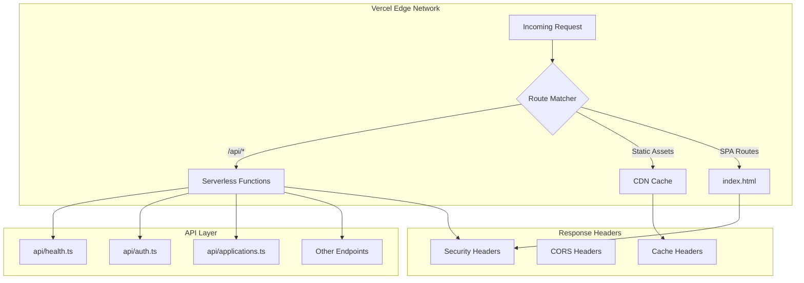

# Design Document: Vercel Production Fixes

## Overview

This design addresses critical production issues in the MIHAS Vercel deployment. The primary issue is that API routes are returning HTML (the SPA index.html) instead of JSON responses from serverless functions. This is caused by incorrect rewrite rule ordering in `vercel.json` and missing Cloudflare-to-Vercel configuration migration.

The solution involves:
1. Fixing Vercel routing configuration to prioritize API functions
2. Creating a dedicated health check endpoint
3. Adding missing security headers via Vercel configuration
4. Consolidating PWA manifest files
5. Removing Cloudflare-specific artifacts

## Architecture



### Request Flow

1. Request arrives at Vercel Edge
2. Route matcher evaluates rules in order:
   - First: Check if path matches `/api/*` → Route to serverless function
   - Second: Check if path matches static asset → Serve from CDN
   - Third: Fallback → Serve index.html for SPA routing
3. Serverless functions return JSON with appropriate headers
4. Security headers applied at edge level via `vercel.json`

### Root Cause Analysis

The current `vercel.json` has this rewrite configuration:
```json
"rewrites": [
  { "source": "/api/:path*", "destination": "/api/:path*" },
  { "source": "/(.*)", "destination": "/index.html" }
]
```

The issue is that Vercel's function detection may not be recognizing the TypeScript files in `api/` as serverless functions. This can happen when:
1. The `functions` configuration doesn't match the actual file structure
2. Build output doesn't include the API functions
3. The framework detection interferes with function routing

## Components and Interfaces

### 1. Health Check Endpoint (`api/health.ts`)

```typescript
interface HealthResponse {
  success: true;
  data: {
    status: 'ok' | 'degraded' | 'error';
    timestamp: string;
    environment: string;
    version?: string;
  };
}

// Endpoint: GET /api/health
// Returns: HealthResponse with HTTP 200
```

### 2. Vercel Configuration (`vercel.json`)

```typescript
interface VercelConfig {
  buildCommand: string;
  installCommand: string;
  framework: string;
  functions: {
    [pattern: string]: {
      maxDuration: number;
      memory?: number;
    };
  };
  rewrites: Array<{
    source: string;
    destination: string;
  }>;
  headers: Array<{
    source: string;
    headers: Array<{
      key: string;
      value: string;
    }>;
  }>;
}
```

### 3. Security Headers Configuration

| Header | Value | Purpose |
|--------|-------|---------|
| Content-Security-Policy | See below | Controls resource loading |
| Permissions-Policy | `camera=(), microphone=(), geolocation=()` | Disables sensitive APIs |
| X-Frame-Options | `DENY` | Prevents clickjacking |
| X-Content-Type-Options | `nosniff` | Prevents MIME sniffing |
| Strict-Transport-Security | `max-age=31536000; includeSubDomains; preload` | Forces HTTPS |
| Referrer-Policy | `strict-origin-when-cross-origin` | Controls referrer info |

### CSP Directive Design

```
default-src 'self';
script-src 'self' 'unsafe-inline' 'unsafe-eval';
style-src 'self' 'unsafe-inline';
font-src 'self' data:;
img-src 'self' data: https: blob:;
connect-src 'self' https://*.supabase.co wss://*.supabase.co https://api.resend.com;
frame-src 'none';
frame-ancestors 'none';
base-uri 'self';
form-action 'self';
```

### 4. API Response Interface

All API endpoints follow this consistent response format:

```typescript
// Success response
interface ApiSuccessResponse<T> {
  success: true;
  data: T;
}

// Error response
interface ApiErrorResponse {
  success: false;
  error: string;
  code?: string;
}

type ApiResponse<T> = ApiSuccessResponse<T> | ApiErrorResponse;
```

## Data Models

### Health Check Response Model

```typescript
interface HealthData {
  status: 'ok' | 'degraded' | 'error';
  timestamp: string;  // ISO 8601 format
  environment: string;  // 'production' | 'preview' | 'development'
  version?: string;  // Optional build version
  checks?: {
    database?: boolean;
    storage?: boolean;
  };
}
```

### Vercel Rewrite Rule Model

```typescript
interface RewriteRule {
  source: string;  // URL pattern with :param* syntax
  destination: string;  // Target path or URL
  has?: Array<{
    type: 'header' | 'cookie' | 'host' | 'query';
    key: string;
    value?: string;
  }>;
}
```

### Security Header Model

```typescript
interface SecurityHeader {
  key: string;
  value: string;
}

interface HeaderConfig {
  source: string;  // URL pattern
  headers: SecurityHeader[];
}
```


## Correctness Properties

*A property is a characteristic or behavior that should hold true across all valid executions of a system—essentially, a formal statement about what the system should do. Properties serve as the bridge between human-readable specifications and machine-verifiable correctness guarantees.*

Based on the prework analysis, the following properties have been identified and consolidated to eliminate redundancy:

### Property 1: API Routes Return JSON

*For any* valid API endpoint path (matching `/api/{endpoint}?action={action}`), when a request is made, the response SHALL have Content-Type `application/json` and SHALL NOT contain HTML content (no `<!DOCTYPE` or `<html>` tags).

**Validates: Requirements 1.1, 1.2, 1.3**

### Property 2: Non-Existent API Routes Return 404 JSON

*For any* request to a non-existent API path (e.g., `/api/nonexistent`), the response SHALL be a JSON object with `success: false` and HTTP status code 404, not an HTML page.

**Validates: Requirements 1.5**

### Property 3: Security Headers Present on All Responses

*For any* HTTP response from the application (both API and static content), the following headers SHALL be present:
- `X-Frame-Options: DENY`
- `X-Content-Type-Options: nosniff`
- `Strict-Transport-Security` (with max-age >= 31536000)
- `Permissions-Policy` (containing camera=(), microphone=(), geolocation=())

Additionally, *for any* HTML response, the `Content-Security-Policy` header SHALL be present.

**Validates: Requirements 3.1, 3.2, 3.5, 3.6, 3.7, 3.8**

### Property 4: API Error Responses Are Consistent and Safe

*For any* API endpoint, when an error condition occurs (invalid action, wrong HTTP method, validation failure), the response SHALL:
1. Have Content-Type `application/json`
2. Contain a JSON object with `success: false` and an `error` string
3. NOT contain stack traces, file paths, or internal implementation details
4. Return appropriate HTTP status codes (400 for bad request, 405 for method not allowed)

**Validates: Requirements 6.1, 6.3, 6.4, 6.5**

## Error Handling

### API Error Scenarios

| Scenario | HTTP Status | Response |
|----------|-------------|----------|
| Invalid action parameter | 400 | `{ success: false, error: "Invalid action", code: "VALIDATION_ERROR" }` |
| Wrong HTTP method | 405 | `{ success: false, error: "Method not allowed", code: "METHOD_NOT_ALLOWED" }` |
| Missing required fields | 400 | `{ success: false, error: "Field X is required", code: "VALIDATION_ERROR" }` |
| Authentication required | 401 | `{ success: false, error: "Authentication required", code: "AUTHENTICATION_ERROR" }` |
| Internal server error | 500 | `{ success: false, error: "An unexpected error occurred", code: "INTERNAL_ERROR" }` |

### Error Sanitization

All error messages are sanitized before being returned to prevent PII leakage:
- Email addresses replaced with `[EMAIL]`
- Phone numbers replaced with `[PHONE]`
- UUIDs replaced with `[ID]`
- JWT tokens replaced with `[TOKEN]`

This is already implemented in `api/_lib/errorHandler.ts`.

### Health Check Error Handling

The health endpoint should always return a response, even if downstream services are unavailable:

```typescript
// If database check fails, return degraded status instead of error
{
  success: true,
  data: {
    status: 'degraded',
    timestamp: '2024-01-15T10:30:00Z',
    environment: 'production',
    checks: {
      database: false
    }
  }
}
```

## Testing Strategy

### Unit Tests

Unit tests should cover:
1. Health endpoint returns correct response structure
2. Security header values are correctly formatted
3. Error response sanitization works correctly
4. Manifest JSON contains required fields

### Property-Based Tests

Property-based tests using `fast-check` should verify:

1. **API JSON Response Property**: For all valid API endpoints, responses are JSON
2. **Security Headers Property**: For all response types, required headers are present
3. **Error Response Property**: For all error conditions, responses follow the standard format

### Integration Tests

Integration tests should verify:
1. End-to-end API routing works correctly on deployed Vercel instance
2. CORS preflight requests are handled correctly
3. Static assets are served with correct caching headers

### Test Configuration

- Property-based tests: Minimum 100 iterations per property
- Test framework: Vitest with fast-check
- Tag format: **Feature: vercel-production-fixes, Property {number}: {property_text}**

### Test File Structure

```
tests/
├── unit/
│   └── api/
│       └── health.test.ts
├── property/
│   └── vercel-production-fixes/
│       ├── api-json-response.property.test.ts
│       ├── security-headers.property.test.ts
│       └── error-response.property.test.ts
└── integration/
    └── vercel-deployment.test.ts
```
