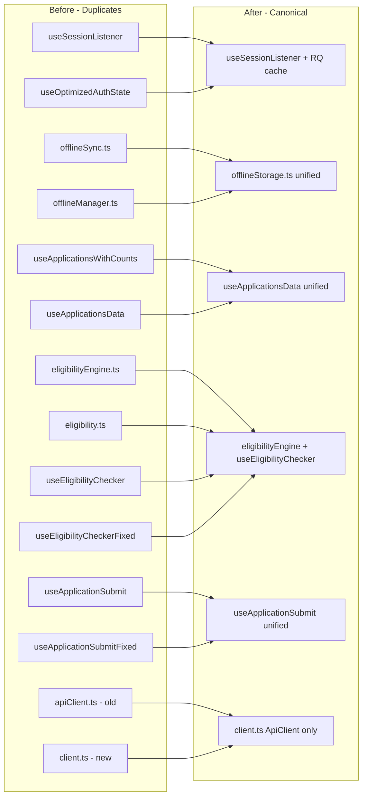

# Design Document: Website Redesign & Unification

## Overview

This design covers a three-pillar overhaul of the MIHAS admissions platform:

1. **Visual Redesign** — Rebuild the homepage, public pages, auth pages, and mobile navigation with a mobile-first, performance-conscious design using SmoothUI components and Tailwind CSS.
2. **Codebase Unification** — Eliminate duplicate hooks, services, UI primitives, and dead code that cause race conditions, bundle bloat, and maintenance confusion. Fix 54 frontend-backend API contract mismatches identified in codexaudit.md.
3. **SmoothUI Integration** — Standardize all page transitions, scroll animations, and form input animations on the existing SmoothUI library (CSS-transition-based, no framer-motion).

The work is structured so that unification tasks (removing duplicates, consolidating hooks, fixing API contracts) happen first to create a clean foundation, followed by visual redesign tasks that build on the unified codebase.

### Key Design Decisions

| Decision | Rationale |
|----------|-----------|
| No new dependencies | All animations use existing SmoothUI (CSS transitions + Intersection Observer). No framer-motion, no new animation libraries. |
| Shared layouts over page-level duplication | A `PublicLayout` wrapper provides header + footer to all public pages, eliminating per-page footer duplication. |
| Single auth hook chain | `useSessionListener` is merged with `useOptimizedAuthState` into one hook that uses React Query for caching and provides action methods (signIn, signUp, signOut). |
| API client normalizeEndpoint handles routing | The existing `ApiClient.normalizeEndpoint()` already translates path-based calls to query-parameter format. Frontend services that bypass this (using raw fetch) must be migrated. |
| Progressive enhancement | SmoothUI animations respect `prefers-reduced-motion`. All pages are fully functional without animations. |
| Mobile-first | All layouts start from mobile viewport and scale up. Touch targets are 44x44px minimum. |
| DOMPurify for sanitization | Replace string-replacement sanitizer with DOMPurify for safe HTML rendering. |

## Architecture

### Page Layout Architecture

```mermaid
graph TD
    subgraph "Public Pages"
        PL[PublicLayout]
        PL --> RH[ResponsiveHeader]
        PL --> SF[SharedFooter]
        PL --> PT[PageTransition]
        
        LP[LandingPage] --> PL
        CP[ContactPage] --> PL
        NF[NotFoundPage] --> PL
        AT[ApplicationTracker] --> PL
    end

    subgraph "Auth Pages"
        AL[AuthLayout]
        AL --> PT2[PageTransition]
        
        SI[SignInPage] --> AL
        SU[SignUpPage] --> AL
        FP[ForgotPasswordPage] --> AL
        RP[ResetPasswordPage] --> AL
    end

    subgraph "Auth System - Consolidated"
        AC[AuthContext] --> USL[useSessionListener - merged]
        USL --> RQ[React Query Cache]
        USL --> API[/api/auth]
    end

    subgraph "Authenticated App"
        AppL[AppLayout] --> Nav[Navigation System]
        Nav --> DS[DesktopSidebar]
        Nav --> MN[MobileBottomNav]
    end
```

### Consolidation Map



## Components and Interfaces

### New Shared Components

#### PublicLayout

Wraps all unauthenticated pages with consistent header and footer. Replaces per-page header/footer imports.

```typescript
// src/components/layout/PublicLayout.tsx
interface PublicLayoutProps {
  children: React.ReactNode;
  showFooter?: boolean; // default true
  className?: string;
}

export function PublicLayout({ children, showFooter = true, className }: PublicLayoutProps) {
  return (
    <PageTransition mode="fade">
      <div className={cn("min-h-screen bg-background overflow-x-hidden", className)}>
        <ResponsiveHeader />
        <main>{children}</main>
        {showFooter && <SharedFooter />}
      </div>
    </PageTransition>
  );
}
```

#### SharedFooter

Extracted from LandingPage's inline FooterSection. Single source of truth for footer content. Imports shared constants for contact info, quick links, and social links.

```typescript
// src/components/layout/SharedFooter.tsx
interface SharedFooterProps {
  className?: string;
}

// Contains: contact info, quick links, social links, copyright
// Imports data from src/lib/constants/landing.ts
export function SharedFooter({ className }: SharedFooterProps): JSX.Element;
```

#### Redesigned ResponsiveHeader

Enhanced mobile navigation with focus trap, escape-to-close, and CSS-only animations.

```typescript
// src/components/navigation/ResponsiveHeader.tsx (enhanced in-place)
// Enhancements over current:
// - Focus trap when mobile menu is open (FocusTrap component or useFocusTrap hook)
// - Escape key closes menu via useEffect keydown listener
// - CSS transition for menu open/close (max-height + opacity, already partially present)
// - Skip-to-content link rendered before nav
// - aria-current="page" on active link (currently uses className only)
// - All mobile links have min 44px touch targets (already present)
```

### Consolidated Auth Hook

The `AuthContext` currently imports actions from `useSessionListener` and state from `useOptimizedAuthState`. These will be merged into a single `useSessionListener` that uses React Query for caching:

```typescript
// src/hooks/auth/useSessionListener.ts (consolidated)
export function useSessionListener() {
  const queryClient = useQueryClient();

  // Single session query — replaces both the useState approach in old useSessionListener
  // and the separate useSessionQuery in useOptimizedAuthState
  const { data: sessionData, isLoading: sessionLoading } = useQuery({
    queryKey: ['auth', 'session'],
    queryFn: async () => {
      const result = await authRequest<{ user?: User }>('/api/auth?action=session');
      return result.success && result.data?.user ? result.data : null;
    },
    staleTime: 10 * 60 * 1000,  // 10 minutes
    gcTime: 30 * 60 * 1000,     // 30 minutes
    retry: false,
    refetchOnMount: false,
    refetchOnWindowFocus: false,
  });

  const user = sessionData?.user ?? null;

  // Profile query (moved from useOptimizedAuthState)
  const { data: profile, isLoading: profileLoading } = useQuery({
    queryKey: ['user-profile', user?.id],
    enabled: Boolean(user?.id),
    queryFn: async () => {
      const result = await authRequest<UserProfile | { user?: UserProfile }>('/api/auth?action=profile');
      if (!result.success) return null;
      return (result?.data as { user?: UserProfile })?.user ?? (result.data as UserProfile) ?? null;
    },
    staleTime: 5 * 60 * 1000,
    retry: false,
  });

  const isAdmin = checkIsAdmin(user);
  const loading = sessionLoading || (Boolean(user) && profileLoading);

  // signIn — clears cache, posts login, atomically sets query data
  const signIn = useCallback(async (email: string, password: string): Promise<SignInResult> => {
    queryClient.clear();
    const result = await authRequest<{ user?: User; profile?: UserProfile }>(
      '/api/auth?action=login',
      { method: 'POST', body: JSON.stringify({ email, password }) },
      { attemptRefreshOn401: false, redirectOnUnauthorized: false }
    );
    if (!result.success || !result.data?.user) {
      return { error: result.error || 'Login failed' };
    }
    const authUser = result.data.user;
    queryClient.setQueryData(['auth', 'session'], { user: authUser });
    if (result.data.profile) {
      queryClient.setQueryData(['user-profile', authUser.id], result.data.profile);
    }
    return { user: authUser, profile: result.data.profile };
  }, [queryClient]);

  // signOut — two-phase clear, then reset query data
  const signOut = useCallback(async () => {
    await logoutWithTwoPhaseClear();
    queryClient.setQueryData(['auth', 'session'], null);
    queryClient.removeQueries({ queryKey: ['user-profile'] });
  }, [queryClient]);

  // signUp, requestPasswordReset, updatePassword — same pattern as current useSessionListener
  // but update React Query cache instead of useState

  return { user, profile, loading, isAdmin, signIn, signUp, signOut, requestPasswordReset, updatePassword };
}
```

After consolidation, `useOptimizedAuthState.ts` is deleted. `AuthContext` becomes a thin wrapper:

```typescript
// src/contexts/AuthContext.tsx (simplified)
export function AuthProvider({ children }: { children: React.ReactNode }) {
  const queryClient = useQueryClient();
  const auth = useSessionListener(); // single hook provides everything

  useEffect(() => {
    configureAuthController({
      clearAuthState: () => queryClient.setQueryData(['auth', 'session'], null),
      clearCaches: () => queryClient.clear(),
      redirectToSignIn: (path) => window.location.assign(path),
    });
  }, [queryClient]);

  const value = useMemo(() => ({
    user: auth.user,
    profile: auth.profile,
    loading: auth.loading,
    isAdmin: auth.isAdmin,
    signIn: auth.signIn,
    signUp: auth.signUp,
    signOut: auth.signOut,
    requestPasswordReset: auth.requestPasswordReset,
    updatePassword: auth.updatePassword,
  }), [auth]);

  return <AuthContext.Provider value={value}>{children}</AuthContext.Provider>;
}
```

### UI Primitive Consolidation Map

| Current Files | Canonical File | Action |
|---|---|---|
| `skeleton.tsx` + `SkeletonLoader.tsx` | `skeleton.tsx` | Keep skeleton.tsx, remove SkeletonLoader.tsx (UnifiedLoader provides SkeletonLoader variant) |
| `PageTransition.tsx` (ui/) + `page-transition.tsx` (smoothui/) | `smoothui/page-transition.tsx` | Remove ui/PageTransition.tsx, update imports |
| `AnimatedCard.tsx`, `AnimatedPage.tsx`, `AnimatedSection.tsx` | Remove all | Replaced by SmoothUI ScrollReveal/PageTransition |
| `FloatingOrbs.tsx` | Remove | GPU-heavy blur-3xl, replaced by gradient backgrounds |
| `ParticlesBackground.tsx` + `effects/ParticleBackground.tsx` | Remove both | Replaced by gradient backgrounds |
| `Turnstile.tsx` + `TurnstileBypass.tsx` | Remove both | Cloudflare integration removed |
| `TouchButton.tsx`, `TouchOptimizedButton.tsx` | Remove both | Deprecated, use canonical Button |
| `LightweightButton.tsx`, `MobileOptimizedButton.tsx` | Remove both | Deprecated, use canonical Button |
| `LoadingSpinner.tsx`, `LoadingButton.tsx`, `LoadingOverlay.tsx` | Keep as deprecated re-exports | Already marked deprecated in barrel, consumers should migrate to UnifiedLoader |

### Dead Code Removal List

| Module | Reason for Removal |
|---|---|
| `src/lib/analytics.ts` | Stubbed, references removed Umami |
| `src/services/analyticsService.ts` | Stubbed, references removed services |
| `src/services/analytics.ts` | Stubbed, references removed services |
| `src/components/analytics/AnalyticsTracker.tsx` | Dead component |
| `src/hooks/useAnalytics.ts` | Returns no-op functions, used in 4 pages |
| `src/components/ui/FloatingOrbs.tsx` | GPU-heavy, not needed |
| `src/components/ui/FloatingElements.tsx` | Unused floating elements |
| `src/components/ui/ParticlesBackground.tsx` | Replaced by gradients |
| `src/components/effects/ParticleBackground.tsx` | Duplicate particle system |
| `src/components/ui/Turnstile.tsx` | Cloudflare removed |
| `src/components/TurnstileBypass.tsx` | Cloudflare removed |
| `src/components/ui/PageTransition.tsx` | Duplicate of smoothui version |
| `src/components/ui/AnimatedCard.tsx` | Replaced by SmoothUI |
| `src/components/ui/AnimatedPage.tsx` | Replaced by SmoothUI |
| `src/components/ui/AnimatedSection.tsx` | Replaced by SmoothUI |
| `src/hooks/useEligibilityCheckerFixed.ts` | Duplicate, merge into useEligibilityChecker |
| `src/hooks/useApplicationSubmitFixed.ts` | Duplicate, merge into useApplicationSubmit |
| `src/hooks/useApplicationsWithCounts.ts` | Duplicate, merge into useApplicationsData |
| `src/hooks/auth/useOptimizedAuthState.ts` | Merged into useSessionListener |
| `src/lib/apiClient.ts` | Replaced by src/services/client.ts |
| `src/services/offlineManager.ts` | Merged into offlineSync.ts using IndexedDB |
| `src/components/AuthDebug.tsx` | Debug component, not for production |

### Frontend-Backend API Contract Fix Strategy

The codexaudit.md identified 54 frontend calls using path-based routing (e.g., `/api/admin/users`) that don't match the backend's query-parameter routing (e.g., `/api/admin?action=users`). The `ApiClient.normalizeEndpoint()` method already handles most of these translations. The fix strategy:

1. **Services using `apiClient.request()`**: These already go through `normalizeEndpoint()` which translates paths. Verify each translation is correct.
2. **Services using raw `fetch()` or `authFetch()`**: These bypass normalization. Migrate to use `apiClient.request()`.
3. **Dead service methods**: Some frontend service methods call endpoints that genuinely don't exist (e.g., `/api/interview/schedule`). These should be removed or stubbed with TODO comments.

Key service files to fix:
- `src/services/admin/users.ts` — uses path-based `/api/admin/users` (normalizeEndpoint handles this)
- `src/services/admin/dashboard.ts` — uses `/api/admin/dashboard` (normalizeEndpoint handles this)
- `src/services/catalog.ts` — uses `/api/catalog/programs` (normalizeEndpoint handles this)
- `src/services/notifications.ts` — many path-based calls, some to non-existent endpoints
- `src/services/auth.ts` — uses `/api/auth/register`, `/api/auth/login` (normalizeEndpoint handles this)
- `src/services/pushNotificationManager.ts` — missing auth credentials on push-subscribe call

### API Client Cache Property Fix

The `cache` property collision identified in jules.md (Section 4.1):

```typescript
// Before: collision between boolean cache toggle and RequestInit.cache string
interface ApiRequestOptions extends RequestInit {
  cache?: boolean; // COLLIDES with RequestInit.cache: RequestCache
}

// After: renamed to avoid collision
interface ApiRequestOptions extends Omit<RequestInit, 'cache'> {
  useCache?: boolean;      // Custom cache toggle (already exists)
  skipCache?: boolean;     // Skip cache flag (already exists)
  cacheTTL?: number;       // Cache TTL
  cacheKey?: string;       // Custom cache key
}
```

Note: The current `ApiRequestOptions` already uses `useCache` and `skipCache` instead of `cache`. The `fetchWithCache` function uses `useLocalCache` internally. The collision is already partially resolved — we just need to ensure no callers pass `cache: true/false` as a boolean.

### Accessibility Fixes

#### Input Label Association (jules.md 3.1)

```typescript
// src/components/ui/input.tsx — fix
// Current: <label> exists but no htmlFor/id association
// Fix: use React.useId() to generate stable IDs

export const Input = React.forwardRef<HTMLInputElement, InputProps>(
  ({ label, error, helperText, className, id: propId, ...props }, ref) => {
    const generatedId = React.useId();
    const inputId = propId || generatedId;

    return (
      <div>
        {label && (
          <label htmlFor={inputId} className="block text-sm font-medium mb-1">
            {label}
          </label>
        )}
        <input
          ref={ref}
          id={inputId}
          aria-describedby={error ? `${inputId}-error` : undefined}
          aria-invalid={Boolean(error)}
          className={cn(baseStyles, className)}
          {...props}
        />
        {error && (
          <p id={`${inputId}-error`} className="text-sm text-destructive mt-1" role="alert">
            {error}
          </p>
        )}
      </div>
    );
  }
);
```

#### HTML Sanitization (jules.md 3.3)

```typescript
// src/lib/sanitizer.ts — replace string replacement with DOMPurify
import DOMPurify from 'dompurify';

export function sanitizeHtml(html: string): string {
  return DOMPurify.sanitize(html, {
    ALLOWED_TAGS: ['b', 'i', 'em', 'strong', 'p', 'br', 'ul', 'ol', 'li', 'a', 'span'],
    ALLOWED_ATTR: ['href', 'target', 'rel', 'class'],
  });
}
```

### Notification Dedup Key Standardization

```typescript
// lib/notificationPolicy.ts or api-src/notifications.ts
// Standardize to: user_id:type:entity_type:entity_id

function generateIdempotencyKey(
  userId: string,
  type: string,
  entityType: string,
  entityId: string
): string {
  return `${userId}:${type}:${entityType}:${entityId}`;
}

// Both createNotificationWithDedup and handleCreate use this function
```

### Shared Constants

```typescript
// src/lib/constants/landing.ts
export const contactInfo = {
  katcPhone: '+260 966 992 299',
  mihasPhone: '+260 961 515 151',
  email: 'info@mihas.edu.zm',
  katcEmail: 'info@katc.edu.zm',
  address: 'President Avenue, Kalulushi, 2-Shaft, Next to KMC',
};

export const quickLinks = [
  { name: 'About Us', href: '#features' },
  { name: 'Programs', href: '#programs' },
  { name: 'Track Application', href: '/track-application' },
  { name: 'Contact', href: '/contact' },
];

export const socialLinks = [
  { name: 'Facebook', href: 'https://www.facebook.com/', icon: 'Facebook' },
  { name: 'Twitter', href: 'https://x.com/', icon: 'Twitter' },
  { name: 'LinkedIn', href: 'https://www.linkedin.com/', icon: 'Linkedin' },
];
```

## Data Models

No new database tables or schema changes are required. This redesign is purely frontend with minor backend notification dedup key fixes.

### Shared Constants Data Model

The `src/lib/constants/landing.ts` file extracts data currently hardcoded in `LandingPage.tsx`:
- `contactInfo` — phone numbers, email, address
- `quickLinks` — footer navigation links
- `socialLinks` — social media links
- `stats` — animated counter data (300+ graduates, 92% placement, etc.)
- `features` — feature card data (Career-Ready Training, etc.)
- `accreditations` — accreditation logos and descriptions
- `programs` — program card data

### Input Component Accessibility Model

```typescript
interface InputProps extends React.InputHTMLAttributes<HTMLInputElement> {
  label?: string;
  error?: string;
  helperText?: string;
}
// id: auto-generated via useId() if not provided via props
// label: associated via htmlFor={id}
// error: associated via aria-describedby={id + '-error'}
// aria-invalid: set when error is truthy
```


## Correctness Properties

*A property is a characteristic or behavior that should hold true across all valid executions of a system — essentially, a formal statement about what the system should do. Properties serve as the bridge between human-readable specifications and machine-verifiable correctness guarantees.*

The following properties were derived from the acceptance criteria prework analysis. Each property is universally quantified and references the requirements it validates.

### Property 1: Authenticated user redirect matches role

*For any* authenticated user with a role (student, admin, super_admin, reviewer), when that user visits the homepage ("/"), the redirect destination should be "/admin/dashboard" for admin/super_admin roles and "/student/dashboard" for student/reviewer roles.

**Validates: Requirements 1.7**

### Property 2: Mobile menu closes on navigation link activation

*For any* navigation link in the mobile menu items array, clicking that link should result in the menu open state being set to false.

**Validates: Requirements 2.4**

### Property 3: Active navigation link has aria-current attribute

*For any* route path that matches a navigation item's href, the rendered link element for that item should have `aria-current="page"` set, and all non-matching links should not have `aria-current`.

**Validates: Requirements 2.5**

### Property 4: Contact form Zod schema validates correctly

*For any* object with valid name (2+ chars), valid email (contains @), and valid message (non-empty), the contact form Zod schema should pass validation. *For any* object missing required fields or with invalid email format, the schema should fail with appropriate error messages.

**Validates: Requirements 3.1**

### Property 5: 404 page suggestions are contextual to attempted path

*For any* URL path string, the suggestion generation function should return an array of suggested pages where each suggestion's path is a valid route, and paths containing keywords like "application", "admin", "setting" should produce suggestions relevant to those keywords.

**Validates: Requirements 3.3**

### Property 6: Signup form Zod schema rejects invalid and accepts valid inputs

*For any* object conforming to the signup schema shape (valid email, password 6+ chars, matching confirmPassword, full_name 2+ chars, phone 10+ chars, valid date_of_birth, valid sex enum, residence_town 2+ chars, nationality 2+ chars, next_of_kin fields), the schema should pass. *For any* object with passwords that don't match, or email without @, or password under 6 chars, the schema should fail with the correct error path.

**Validates: Requirements 4.1, 4.3**

### Property 7: Forgot password response is identical regardless of email existence

*For any* email string submitted to the forgot password handler, the response shape (success message, no error) should be identical whether the email exists in the database or not, to prevent email enumeration.

**Validates: Requirements 4.6**

### Property 8: Auth state management — login populates cache, logout clears it

*For any* successful login result containing a user object, the React Query cache at key ['auth', 'session'] should contain that user. After signOut is called, the cache at ['auth', 'session'] should be null and ['user-profile'] queries should be removed.

**Validates: Requirements 5.2, 5.3**

### Property 9: Eligibility engine returns well-formed result

*For any* valid application data object (with grades array, program selection, and institution), the eligibility engine should return a result object that has a `status` field (one of 'eligible', 'ineligible', 'pending'), a `score` field (number), and a `messages` field (array of strings).

**Validates: Requirements 8.2**

### Property 10: Application cache invalidation on mutation

*For any* application mutation (create, update status, submit), the React Query cache keys matching ['applications'] should be invalidated after the mutation completes.

**Validates: Requirements 9.4**

### Property 11: Offline queue preserves FIFO order and retains failed operations

*For any* sequence of queued offline operations, syncing should process them in the order they were added (FIFO). *For any* operation that fails during sync, it should remain in the queue with an incremented retry count rather than being removed.

**Validates: Requirements 10.3, 10.4**

### Property 12: SmoothUI respects prefers-reduced-motion

*For any* SmoothUI component (PageTransition, ScrollReveal, StaggerReveal, AnimatedCounter), when the `prefers-reduced-motion: reduce` media query matches, the component should render its children immediately without animation delays or transitions.

**Validates: Requirements 11.5**

### Property 13: API envelope unwrap is idempotent

*For any* API response object with shape `{ success: true, data: T }`, calling `unwrapApiResponse` should return `T`. *For any* response object without the `{ success, data }` shape, `unwrapApiResponse` should return the object unchanged. Calling `unwrapApiResponse(unwrapApiResponse(response))` should equal `unwrapApiResponse(response)` (idempotence).

**Validates: Requirements 13.3**

### Property 14: API endpoint normalization produces valid query-parameter URLs

*For any* path-based endpoint string (e.g., "/admin/users", "/catalog/programs", "/auth/login"), the `normalizeEndpoint` function should produce a URL using query-parameter routing (e.g., "/api/admin?action=users", "/api/catalog?type=programs", "/api/auth?action=login") that matches a known backend endpoint pattern.

**Validates: Requirements 14.1, 14.2, 14.3**

### Property 15: Input label htmlFor matches input id

*For any* Input component rendered with a `label` prop and optional `id` prop, the rendered `<label>` element's `htmlFor` attribute should equal the rendered `<input>` element's `id` attribute. If no `id` prop is provided, a stable auto-generated id should be used for both.

**Validates: Requirements 15.1**

### Property 16: HTML sanitization strips dangerous tags, preserves safe ones

*For any* HTML string, `sanitizeHtml(html)` should not contain `<script>`, `<iframe>`, `<object>`, `<embed>`, or `onclick`/`onerror` attributes. *For any* HTML string containing only safe tags (`<b>`, `<p>`, `<ul>`, `<li>`, `<a>`, `<strong>`, `<em>`), `sanitizeHtml(html)` should preserve those tags.

**Validates: Requirements 15.3**

### Property 17: Notification dedup key format is consistent

*For any* notification creation call (whether through createNotificationWithDedup or handleCreate), the generated idempotency key should follow the format `userId:type:entityType:entityId` with no variation between code paths.

**Validates: Requirements 17.1, 17.2, 17.3**

## Error Handling

### Auth Errors
- **Session check failure**: If `/api/auth?action=session` returns an error or network failure, the auth hook sets `user` to null and `loading` to false. The user sees the unauthenticated state.
- **Token refresh failure**: If `/api/auth?action=refresh` fails, the user is redirected to `/auth/signin` with the current path preserved in location state for post-login redirect.
- **Login failure**: Returns `{ error: string }` to the caller. The SignInPage displays the error inline. Generic "Invalid email or password" message to prevent credential enumeration.
- **Signup failure**: Returns `{ error: string }`. Specific messages for "email already registered" vs generic failures.

### API Client Errors
- **Network failure**: `ApiClient.request()` catches fetch errors and throws enhanced errors via `ApiErrorHandler`. The UI should show a toast or inline error.
- **401 Unauthorized**: Logged as warning. The auth controller attempts one refresh. If refresh fails, redirects to sign-in.
- **404 Not Found**: After API contract alignment, this should only occur for genuinely missing resources, not routing mismatches.
- **Rate limiting (429)**: Arcjet returns 403 with `SECURITY_VIOLATION` code. The UI should show "Too many requests, please try again later."

### Offline Errors
- **IndexedDB unavailable**: Falls back to in-memory queue. Operations are lost on page refresh but the app remains functional.
- **Sync failure**: Failed operations stay in queue with incremented retry count. Max 3 retries before marking as permanently failed.
- **Conflict resolution**: Last-write-wins for draft auto-save. Server state takes precedence for submitted applications.

### Eligibility Errors
- **External API failure (HPCZ/NMCZ/ECZ)**: Returns advisory result with fallback message. Never blocks application flow.
- **Missing course_requirements data**: Returns "pending" status with message indicating requirements not yet configured.

### Build Errors
- **Missing imports after dead code removal**: Each removal task includes updating all import references. Build verification (`bunx --bun vite build`) is a checkpoint task.

## Testing Strategy

### Dual Testing Approach

This spec uses both unit tests and property-based tests:

- **Unit tests**: Verify specific examples, edge cases, error conditions, and UI rendering
- **Property tests**: Verify universal properties across many generated inputs using fast-check

Both are complementary — unit tests catch concrete bugs at specific values, property tests verify general correctness across the input space.

### Property-Based Testing Configuration

- **Library**: fast-check (already installed, per project conventions)
- **Framework**: Vitest (already configured)
- **Minimum iterations**: 100 per property test
- **Test location**: `tests/property/` directory
- **Tag format**: Each test tagged with `Feature: website-redesign-unification, Property {N}: {title}`

### Unit Test Focus Areas

- Component rendering (SharedFooter, PublicLayout, ResponsiveHeader)
- Auth flow (login, logout, redirect)
- Form validation schemas (signup, contact)
- 404 page suggestion generation
- Accessibility (label association, skip links, heading hierarchy)
- Build verification after dead code removal

### Property Test Focus Areas

- Zod schema validation (Properties 4, 6)
- API envelope unwrapping idempotence (Property 13)
- API endpoint normalization (Property 14)
- HTML sanitization safety (Property 16)
- Notification dedup key consistency (Property 17)
- Offline queue ordering (Property 11)
- Input label/id association (Property 15)

### Test Execution

```bash
# Run all tests
bun run test

# Run property tests only
bun run test tests/property/

# Run with coverage
bun run test --coverage
```
