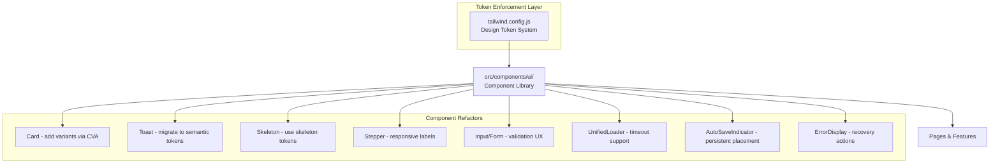

# Design Document: Website UI/UX Fix

## Overview

This design addresses the UI/UX quality issues identified in the MIHAS admissions portal audit. The approach is incremental: refactor existing components to enforce design token usage, unify loading states, fix accessibility gaps, improve mobile responsiveness, and polish form UX — all without breaking backward compatibility or removing existing functionality.

The design follows Swiss Modernism 2.0 principles: clean grid layouts, Inter typography, mathematical spacing, high contrast, and a single accent color (primary blue `#2563eb`) with a monochromatic base.

### Key Design Decisions

1. **Refactor, don't rewrite**: All changes modify existing components in `src/components/ui/`. No new component library or framework.
2. **Design tokens as the single source of truth**: The `tailwind.config.js` already has a solid token system. The fix is about enforcement — replacing hardcoded Tailwind palette classes with semantic tokens.
3. **Card variants via CVA**: Extend the existing Card component with `class-variance-authority` (already used by Button) to support `elevated`, `outlined`, and `flat` variants.
4. **Unified loading via existing UnifiedLoader**: The `UnifiedLoader` component is well-built. The fix is replacing ad-hoc spinners and inconsistent skeleton usage across pages.
5. **Mobile-first stepper**: Collapse step labels to numbers on small screens, keeping the existing Stepper API.
6. **Toast token migration**: Replace hardcoded `green-300`, `red-50`, `blue-600` etc. in Toast with semantic `success`, `error`, `info`, `warning` tokens.

## Architecture

The UI/UX fix is a cross-cutting refactor across the component library layer. No backend changes are needed.



### Affected Files

| File | Change Type | Description |
|------|-------------|-------------|
| `src/components/ui/card.tsx` | Modify | Add CVA variants (elevated, outlined, flat, interactive) |
| `src/components/ui/Toast.tsx` | Modify | Replace hardcoded palette colors with semantic tokens |
| `src/components/ui/skeleton.tsx` | Modify | Use `bg-skeleton` / `bg-skeleton-highlight` tokens |
| `src/components/ui/Stepper.tsx` | Modify | Responsive label collapse, touch targets, a11y |
| `src/components/ui/input.tsx` | Modify | Validation timing, error icon, focus management |
| `src/components/ui/UnifiedLoader.tsx` | Modify | Add timeout message with retry |
| `src/components/ui/AutoSaveIndicator.tsx` | Modify | Persistent visibility, retry button |
| `src/components/ui/ErrorBoundary.tsx` | Modify | Page-level friendly error with reload |
| `src/components/ui/ErrorDisplay.tsx` | Modify | Ensure destructive token usage |
| `src/components/ui/PageHeader.tsx` | Modify | Replace hardcoded colors with semantic tokens |
| `src/lib/utils.ts` | Modify | Replace hardcoded status colors with semantic tokens |

## Components and Interfaces

### 1. Card Component (Variant System)

The current Card has no variant support. We add CVA-based variants matching the Button pattern.

```typescript
// src/components/ui/card.tsx
import { cva, type VariantProps } from 'class-variance-authority'

const cardVariants = cva(
  'rounded-lg text-card-foreground transition-shadow', // base
  {
    variants: {
      variant: {
        outlined: 'border border-border bg-card',           // default
        elevated: 'bg-card shadow-md',                       // no border, shadow
        flat: 'bg-muted',                                    // muted bg, no border/shadow
      },
      interactive: {
        true: 'cursor-pointer hover:shadow-md focus-visible:outline-none focus-visible:ring-2 focus-visible:ring-ring focus-visible:ring-offset-2',
        false: '',
      },
    },
    defaultVariants: {
      variant: 'outlined',
      interactive: false,
    },
  }
)

interface CardProps extends React.HTMLAttributes<HTMLDivElement>,
  VariantProps<typeof cardVariants> {}
```

### 2. Toast Token Migration

Replace hardcoded Tailwind palette classes with semantic design tokens:

```typescript
// Before (hardcoded):
const typeStyles = {
  success: 'border-green-300 bg-green-50 text-green-900',
  error: 'border-red-300 bg-red-50 text-red-900',
  info: 'border-blue-300 bg-blue-50 text-blue-900',
  warning: 'border-yellow-300 bg-yellow-50 text-yellow-900',
}

// After (semantic tokens):
const typeStyles = {
  success: 'border-success/30 bg-success/5 text-foreground',
  error: 'border-destructive/30 bg-destructive/5 text-foreground',
  info: 'border-info/30 bg-info/5 text-foreground',
  warning: 'border-warning/30 bg-warning/5 text-foreground',
}

const iconStyles = {
  success: 'text-success',
  error: 'text-destructive',
  info: 'text-info',
  warning: 'text-warning',
}
```

### 3. Responsive Stepper

Collapse labels on small screens, ensure touch targets, add ARIA:

```typescript
// src/components/ui/Stepper.tsx changes:
// - Step circles: min 44x44px touch target
// - Labels: hidden below sm breakpoint, visible above
// - aria-current="step" on current step
// - role="list" on container, role="listitem" on steps
// - Connector lines use primary token
```

### 4. UnifiedLoader Timeout

Add a timeout prop that shows a retry message after N seconds:

```typescript
interface UnifiedLoaderProps extends HTMLAttributes<HTMLElement> {
  variant: 'page' | 'inline' | 'overlay'
  size?: 'sm' | 'md' | 'lg'
  label?: string
  message?: string
  timeoutMs?: number          // NEW: show timeout message after this duration
  onTimeout?: () => void      // NEW: callback when timeout retry is clicked
}
```

### 5. AutoSaveIndicator Enhancement

Add retry button for error state, ensure persistent visibility:

```typescript
interface AutoSaveIndicatorProps {
  status: 'idle' | 'saving' | 'saved' | 'error'
  lastSavedAt?: number | null
  onRetry?: () => void        // NEW: retry callback for error state
  className?: string
}
```

### 6. Status Color Token Migration

Replace hardcoded palette colors in `getStatusColor()`:

```typescript
// Before:
'pending': 'bg-yellow-200 text-yellow-900 border border-yellow-300'

// After:
'pending': 'bg-warning/20 text-foreground border border-warning/30'
```

### 7. PageHeader Token Migration

Replace hardcoded colors in PageHeader variants:

```typescript
// Before:
gradient: 'bg-gradient-to-r from-blue-600/90 to-indigo-600/85 text-white ...'

// After:
gradient: 'bg-gradient-vibrant text-primary-foreground border-card/20 shadow-2xl'
```

### 8. Heading Hierarchy Enforcement

Pages must follow h1 → h2 → h3 without skipping. The existing `HeadingHierarchy` component provides `HeadingLevelProvider` and `Heading` — these should be used consistently across all pages.

### 9. Form Validation UX

- Debounce real-time validation by 300ms
- Show error icon alongside error text
- Move focus to first invalid field on form submission
- Preserve form data on submission failure

### 10. Animation Consistency

All animations must use the three defined durations:
- `duration-fast` (150ms): hover states, press feedback
- `duration-normal` (200ms): dialogs, toasts, scale transitions
- `duration-slow` (300ms): page transitions, fade-in-up, slide animations

## Data Models

No new data models are introduced. This is a frontend-only refactor. The existing component prop interfaces are extended as described in the Components section above.

### Extended Interfaces Summary

```typescript
// Card variant type
type CardVariant = 'outlined' | 'elevated' | 'flat'

// Toast semantic type mapping (unchanged interface, changed implementation)
type ToastType = 'success' | 'error' | 'info' | 'warning'

// UnifiedLoader extended props
interface UnifiedLoaderProps {
  variant: 'page' | 'inline' | 'overlay'
  size?: 'sm' | 'md' | 'lg'
  label?: string
  message?: string
  timeoutMs?: number
  onTimeout?: () => void
}

// AutoSaveIndicator extended props
interface AutoSaveIndicatorProps {
  status: 'idle' | 'saving' | 'saved' | 'error'
  lastSavedAt?: number | null
  onRetry?: () => void
  className?: string
}

// Stepper (unchanged interface, changed rendering)
interface StepperProps {
  steps: Step[]
  currentStep: number
}
```


## Correctness Properties

*A property is a characteristic or behavior that should hold true across all valid executions of a system — essentially, a formal statement about what the system should do. Properties serve as the bridge between human-readable specifications and machine-verifiable correctness guarantees.*

### Property 1: Semantic color token enforcement

*For any* component file in `src/components/ui/`, the file SHALL NOT contain hardcoded Tailwind color palette classes (e.g., `green-300`, `red-50`, `blue-600`, `yellow-200`, `slate-900`) and SHALL only use semantic color tokens (primary, secondary, destructive, muted, accent, success, warning, info, error, foreground, background, card, border, ring, skeleton, admin, link) or opacity modifiers on those tokens.

**Validates: Requirements 1.3, 1.5, 2.2, 6.1, 10.4**

### Property 2: Design token enforcement for radius and shadow

*For any* component file in `src/components/ui/`, all border-radius classes SHALL be one of the defined tokens (rounded-none, rounded-sm, rounded-md, rounded-lg, rounded-xl, rounded-2xl, rounded-full) and all box-shadow classes SHALL be one of the defined tokens (shadow-sm, shadow-md, shadow-lg, shadow-xl) or shadow-none.

**Validates: Requirements 1.1, 1.2**

### Property 3: Toast ARIA role matches toast type

*For any* toast notification, if the toast type is `error` or `warning`, the rendered element SHALL have `role="alert"`, and if the toast type is `success` or `info`, the rendered element SHALL have `role="status"`.

**Validates: Requirements 6.3, 6.4**

### Property 4: Interactive elements meet touch target minimum

*For any* interactive element (button, link, input) in the Component_Library, the element's minimum height and minimum width SHALL be at least 44px (via min-h-touch, min-h-[44px], h-11, or equivalent).

**Validates: Requirements 3.1, 6.5**

### Property 5: Focus ring consistency on interactive elements

*For any* interactive element (button, link, input, select) in the Component_Library, the element SHALL include focus-visible ring styling (focus-visible:ring-2 focus-visible:ring-ring focus-visible:ring-offset-2 or the focus-ring utility class).

**Validates: Requirements 3.2**

### Property 6: Card variant rendering correctness

*For any* Card variant value (`elevated`, `outlined`, `flat`), the rendered Card SHALL include the correct combination of border, shadow, and background classes for that variant, and a Card with no variant SHALL render identically to `variant="outlined"`.

**Validates: Requirements 7.1, 7.2, 7.3, 7.4, 7.5**

### Property 7: AutoSaveIndicator error state includes retry

*For any* AutoSaveIndicator with `status="error"` and an `onRetry` callback, the rendered output SHALL include a clickable retry button.

**Validates: Requirements 5.2**

### Property 8: Input error display with destructive styling

*For any* Input component with a non-empty `error` prop, the rendered output SHALL include an error message element with `text-destructive` styling and `role="alert"`.

**Validates: Requirements 5.3**

### Property 9: ErrorBoundary renders recovery UI on error

*For any* Error thrown within an ErrorBoundary's children, the ErrorBoundary SHALL render an error display with a retry/reload action button.

**Validates: Requirements 10.3**

### Property 10: Animation duration token enforcement

*For any* component file in `src/components/ui/`, all CSS transition duration classes SHALL use only the defined tokens (duration-fast/150, duration-normal/200, duration-slow/300) or the animation durations defined in tailwind.config.js keyframes.

**Validates: Requirements 9.1**

### Property 11: Animation keyframes use only transform and opacity

*For any* keyframe animation defined in tailwind.config.js, the animated properties SHALL be limited to `transform`, `opacity`, and `backgroundPosition` (for shimmer).

**Validates: Requirements 9.2**

### Property 12: Reduced motion support

*For any* component that uses animations, the component SHALL include `motion-reduce:` utility classes or `prefers-reduced-motion` media query handling to disable non-essential animations.

**Validates: Requirements 9.3**

### Property 13: Bottom navigation item limit

*For any* set of navigation items passed to BottomNavigation, the rendered navigation SHALL display at most 5 items.

**Validates: Requirements 4.3**

### Property 14: UnifiedLoader as sole loading indicator

*For any* page or component file that imports a loading/spinner component, the import SHALL reference `UnifiedLoader` or `UnifiedSpinner` from `./UnifiedLoader` (or the backward-compatible `LoadingSpinner` wrapper), and SHALL NOT use ad-hoc spinner implementations.

**Validates: Requirements 2.1**

### Property 15: Heading hierarchy correctness

*For any* page rendered in the Portal, the heading elements (h1-h6) SHALL follow a sequential hierarchy without skipping levels (e.g., h1 followed by h3 without an intervening h2 is invalid).

**Validates: Requirements 3.5**

### Property 16: Network error displays retry action

*For any* ErrorDisplay component with an `onRetry` callback, the rendered output SHALL include a visible retry button.

**Validates: Requirements 10.1**

## Error Handling

### Component-Level Errors

| Scenario | Handling |
|----------|----------|
| Card variant prop invalid | Fall back to `outlined` default via CVA defaultVariants |
| Toast render failure | ErrorBoundary catches; toast is removed from store |
| Skeleton render failure | Graceful degradation — show empty space |
| UnifiedLoader timeout | Show timeout message with retry button |
| AutoSave error | Show "Save failed" with retry; do not block form interaction |
| Form validation error | Show inline error below field; move focus to first error |
| ErrorBoundary catch | Show friendly error page with reload button |

### Network Error Recovery

1. All API errors display via `ErrorDisplay` with retry action
2. Form submission errors preserve user input (never clear form)
3. Toast errors show retry button using `errorWithRetry()` method
4. Offline state shows `OfflineBanner` component (existing)

### Graceful Degradation

- If design tokens fail to load (unlikely with Tailwind), components fall back to browser defaults
- If animations are disabled (prefers-reduced-motion), all transitions are removed
- If JavaScript fails, the PWA service worker serves cached content

## Testing Strategy

### Dual Testing Approach

This feature uses both unit tests and property-based tests for comprehensive coverage:

- **Property-based tests** (fast-check): Verify universal properties across generated inputs — design token enforcement, ARIA correctness, touch target compliance, variant rendering
- **Unit tests** (Vitest): Verify specific examples, edge cases, and integration points — specific card variant rendering, toast positioning, stepper responsive behavior

### Property-Based Testing Configuration

- Library: `fast-check` (already installed)
- Framework: Vitest
- Minimum iterations: 100 per property test (use `numRuns: 100`)
- Test location: `tests/property/`
- Tag format: `// Feature: website-ui-ux-fix, Property N: {property_text}`

### Test Categories

| Category | Type | Location | Coverage |
|----------|------|----------|----------|
| Design token enforcement | Property | `tests/property/ui-ux-design-tokens.test.ts` | Properties 1, 2, 10, 11 |
| Accessibility compliance | Property | `tests/property/ui-ux-accessibility.test.ts` | Properties 3, 4, 5, 12, 13, 15 |
| Component variants | Property | `tests/property/ui-ux-card-variants.test.ts` | Property 6 |
| Error handling | Property | `tests/property/ui-ux-error-handling.test.ts` | Properties 7, 8, 9, 16 |
| Toast rendering | Unit | `tests/ui/toast.test.tsx` | Specific toast examples |
| Stepper responsive | Unit | `tests/ui/stepper.test.tsx` | Responsive label collapse |
| Loading timeout | Unit | `tests/ui/unified-loader.test.tsx` | Timeout behavior |

### Property Test Implementation Pattern

Each correctness property maps to a single property-based test:

```typescript
import { describe, it, expect } from 'vitest'
import * as fc from 'fast-check'

describe('Feature: website-ui-ux-fix', () => {
  // Feature: website-ui-ux-fix, Property 1: Semantic color token enforcement
  it('Property 1: all component files use only semantic color tokens', () => {
    fc.assert(
      fc.property(
        componentFileArbitrary, // generates component file paths
        (filePath) => {
          const content = readFileSync(filePath, 'utf-8')
          return !containsHardcodedPaletteColors(content)
        }
      ),
      { numRuns: 100 }
    )
  })
})
```
