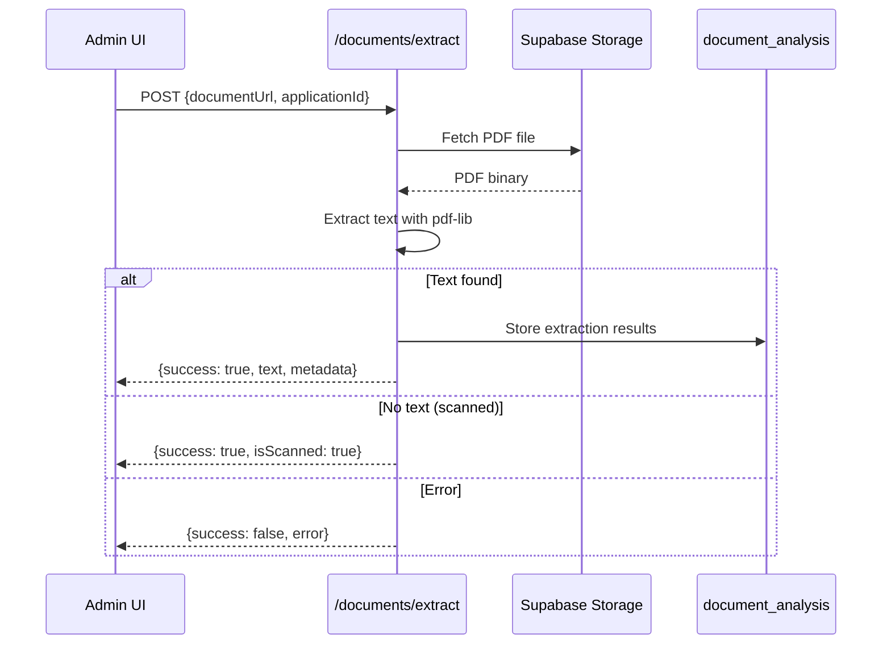

# Design Document: Admin Dashboard Fixes

## Overview

This design addresses six interconnected issues in the MIHAS admin and student dashboards. The fixes span frontend components, API endpoints, and security headers to ensure data consistency, improved UX, and compliance with web best practices.

**Key Design Decisions:**
1. Use direct database queries for accurate counts instead of cached/filtered data
2. Leverage Supabase's built-in session management for bulk termination
3. Fix sidebar CSS/layout rather than restructuring the component
4. Add security headers at the Cloudflare middleware level for consistent application

## Architecture

```mermaid
graph TB
    subgraph Frontend
        PD[PredictiveDashboard]
        AP[Applications Page]
        SM[Session Manager]
        SB[AdminSidebar]
    end
    
    subgraph API Layer
        PAE[/analytics/predictive-dashboard]
        AAD[admin_application_detailed view]
        AUTH[Supabase Auth]
    end
    
    subgraph Database
        APPS[(applications)]
        DS[(device_sessions)]
        DA[(document_analysis)]
    end
    
    subgraph Security
        MW[_middleware.js]
        HDR[_headers]
    end
    
    PD --> PAE
    PAE --> APPS
    AP --> AAD
    AAD --> APPS
    SM --> AUTH
    AUTH --> DS
    MW --> HDR
```

## Components and Interfaces

### 1. AI Dashboard Data Fix

**Component:** `src/lib/predictiveDashboardApi.ts` and `functions/analytics/comprehensive-metrics.js`

**Current Issue:** The API queries only specific statuses, missing drafts and other states.

**Solution:** Modify the query to count ALL applications regardless of status.

```typescript
// Updated query in comprehensive-metrics.js
const { count: totalApplications } = await supabaseAdminClient
  .from('applications')
  .select('*', { count: 'exact', head: true })
  // No status filter - count ALL applications
```

**Interface:**
```typescript
interface PredictiveDashboardApiMetrics {
  avgAdmissionProbability?: number
  totalApplications: number  // Now includes ALL statuses
  avgProcessingTime?: number
  efficiency?: number
  applicationTrend?: string
  peakTimes?: string[]
  bottlenecks?: string[]
  generatedAt?: string | null
}
```

### 2. Applications Page Draft Inclusion

**Component:** `src/hooks/admin/useApplicationsData.ts` and `src/hooks/admin/useApplicationFilters.ts`

**Current Issue:** The `draftFilter` defaults to 'completed' which excludes drafts.

**Solution:** Change default filter to 'all' and add visual distinction for drafts.

```typescript
// useApplicationFilters.ts - Update default
export const DEFAULT_APPLICATION_FILTERS: ApplicationFilters = {
  searchTerm: '',
  statusFilter: '',
  paymentFilter: '',
  programFilter: '',
  institutionFilter: '',
  draftFilter: 'all'  // Changed from 'completed'
}

// Filter options
export const DRAFT_FILTER_OPTIONS = [
  { value: 'all', label: 'All Applications' },
  { value: 'drafts', label: 'Drafts Only' },
  { value: 'completed', label: 'Submitted Only' }
]
```

**Draft Badge Component:**
```typescript
interface DraftBadgeProps {
  completionPercentage: number
  lastUpdated: string
}

function DraftBadge({ completionPercentage, lastUpdated }: DraftBadgeProps) {
  return (
    <div className="flex items-center gap-2">
      <span className="px-2 py-1 text-xs font-medium bg-amber-100 text-amber-800 rounded-full">
        Draft ({completionPercentage}%)
      </span>
      <span className="text-xs text-muted-foreground">
        Last updated: {formatRelativeTime(lastUpdated)}
      </span>
    </div>
  )
}
```

### 3. PDF Extraction Service

**Component:** `functions/documents/extract.js` (new) and `src/services/documentExtraction.ts`

**Solution:** Create a dedicated PDF extraction endpoint using pdf-lib for text extraction.

```typescript
// API Response Interface
interface PDFExtractionResult {
  success: boolean
  text?: string
  metadata?: {
    pageCount: number
    title?: string
    author?: string
    creationDate?: string
  }
  error?: string
  isScanned?: boolean  // True if no text found (likely scanned)
}
```

**Extraction Flow:**


### 4. Bulk Session Termination

**Component:** `src/components/student/SessionManager.tsx` (or similar)

**Solution:** Use Supabase's `signOut({ scope: 'others' })` for bulk termination.

```typescript
// Session termination service
async function terminateAllOtherSessions(): Promise<{
  success: boolean
  terminatedCount: number
  error?: string
}> {
  try {
    // Get current session count before termination
    const { data: sessions } = await supabase
      .from('device_sessions')
      .select('id')
      .eq('user_id', currentUserId)
      .eq('is_active', true)
    
    const beforeCount = sessions?.length || 0
    
    // Terminate all other sessions via Supabase Auth
    const { error } = await supabase.auth.signOut({ scope: 'others' })
    
    if (error) throw error
    
    // Mark sessions as inactive in device_sessions table
    await supabase
      .from('device_sessions')
      .update({ is_active: false, updated_at: new Date().toISOString() })
      .eq('user_id', currentUserId)
      .neq('session_token', currentSessionToken)
    
    return {
      success: true,
      terminatedCount: Math.max(beforeCount - 1, 0)
    }
  } catch (error) {
    return {
      success: false,
      terminatedCount: 0,
      error: error instanceof Error ? error.message : 'Failed to terminate sessions'
    }
  }
}
```

**UI Component:**
```typescript
function BulkSessionTermination() {
  const [isTerminating, setIsTerminating] = useState(false)
  
  const handleTerminateAll = async () => {
    setIsTerminating(true)
    const result = await terminateAllOtherSessions()
    
    if (result.success) {
      toast.success(`Terminated ${result.terminatedCount} session(s)`)
      refreshSessions()
    } else {
      toast.error(result.error || 'Failed to terminate sessions')
    }
    setIsTerminating(false)
  }
  
  return (
    <Button
      variant="destructive"
      onClick={handleTerminateAll}
      disabled={isTerminating || activeSessions.length <= 1}
    >
      {isTerminating ? 'Terminating...' : 'Terminate All Other Sessions'}
    </Button>
  )
}
```

### 5. Sidebar Collapse Fix

**Component:** `src/components/admin/AdminSidebar.tsx`

**Current Issue:** The header section has inconsistent layout when collapsed - the logo and toggle button don't align properly.

**Solution:** Restructure the header to use consistent flex layout in both states.

```typescript
// Fixed header section
<div className={cn(
  "flex items-center p-4 border-b border-border min-h-[64px]",
  collapsed ? "flex-col gap-2 justify-center" : "justify-between"
)}>
  {/* Logo - always visible */}
  <div className={cn(
    "w-8 h-8 rounded-lg bg-gradient-to-br from-primary to-secondary",
    "flex items-center justify-center shrink-0"
  )}>
    <span className="text-white font-bold text-sm">M</span>
  </div>
  
  {/* Text - only when expanded */}
  {!collapsed && (
    <motion.span
      initial={{ opacity: 0, x: -10 }}
      animate={{ opacity: 1, x: 0 }}
      exit={{ opacity: 0, x: -10 }}
      className="text-lg font-bold text-foreground truncate flex-1 ml-2"
    >
      MIHAS Admin
    </motion.span>
  )}
  
  {/* Toggle button */}
  <button
    onClick={() => setCollapsed(!collapsed)}
    aria-label={collapsed ? 'Expand sidebar' : 'Collapse sidebar'}
    className={cn(
      'p-2 rounded-lg hover:bg-accent transition-colors',
      'focus:outline-none focus:ring-2 focus:ring-primary focus:ring-offset-2'
    )}
  >
    {collapsed ? <ChevronRight /> : <ChevronLeft />}
  </button>
</div>
```

### 6. Security Headers

**Component:** `functions/_middleware.js` and `public/_headers`

**Solution:** Add comprehensive security headers at the middleware level.

```javascript
// _middleware.js additions
const securityHeaders = {
  'Content-Security-Policy': [
    "default-src 'self'",
    "script-src 'self' 'unsafe-inline' 'unsafe-eval'",
    "style-src 'self' 'unsafe-inline'",
    "img-src 'self' data: https: blob:",
    "font-src 'self' data:",
    "connect-src 'self' https://*.supabase.co wss://*.supabase.co",
    "frame-ancestors 'none'"
  ].join('; '),
  'Strict-Transport-Security': 'max-age=31536000; includeSubDomains; preload',
  'Cross-Origin-Opener-Policy': 'same-origin',
  'Cross-Origin-Embedder-Policy': 'require-corp',
  'X-Content-Type-Options': 'nosniff',
  'X-Frame-Options': 'DENY',
  'Referrer-Policy': 'strict-origin-when-cross-origin'
}
```

**index.html charset fix:**
```html
<!DOCTYPE html>
<html lang="en">
  <head>
    <meta charset="UTF-8" />
    <!-- Must be within first 1024 bytes -->
```

**Vite source maps:**
```typescript
// vite.config.production.ts
export default defineConfig({
  build: {
    sourcemap: true,  // Enable source maps
    // ...
  }
})
```

## Data Models

### Application Status Flow
```
draft → submitted → under_review → approved/rejected
```

### Device Sessions Table
```sql
device_sessions (
  id uuid PRIMARY KEY,
  user_id uuid REFERENCES auth.users,
  device_id text,
  device_info text,
  session_token text,
  last_activity timestamptz,
  is_active boolean DEFAULT true,
  created_at timestamptz,
  updated_at timestamptz
)
```

### Document Analysis Table
```sql
document_analysis (
  id uuid PRIMARY KEY,
  application_id uuid REFERENCES applications,
  document_type varchar,
  quality varchar DEFAULT 'unknown',
  completeness integer DEFAULT 0,
  ocr_confidence numeric DEFAULT 0,
  extracted_data jsonb DEFAULT '{}',
  suggestions text[] DEFAULT '{}',
  analyzed_at timestamptz DEFAULT now()
)
```


## Correctness Properties

*A property is a characteristic or behavior that should hold true across all valid executions of a system—essentially, a formal statement about what the system should do. Properties serve as the bridge between human-readable specifications and machine-verifiable correctness guarantees.*

Based on the prework analysis, the following properties have been identified and consolidated to eliminate redundancy:

### Property 1: Application Count Consistency

*For any* database state with N applications (regardless of status), the AI Dashboard's `totalApplications` value SHALL equal N, and this count SHALL match the Applications Page total when no filters are applied.

**Validates: Requirements 1.1, 1.2, 1.4, 1.5, 2.4**

### Property 2: Draft Application Inclusion

*For any* application with status='draft', when the Applications Page loads with default filters, that application SHALL appear in the results list with a visible "Draft" badge and completion percentage.

**Validates: Requirements 2.1, 2.2, 2.5**

### Property 3: PDF Extraction Response Structure

*For any* valid PDF file, the PDF_Extractor SHALL return a response containing either: (a) success=true with text and metadata, or (b) success=true with isScanned=true, or (c) success=false with an error message. The response SHALL always include the success boolean.

**Validates: Requirements 3.1, 3.2, 3.3**

### Property 4: Extraction Persistence

*For any* successful PDF extraction, a corresponding record SHALL be created in the document_analysis table with the application_id, extracted_data, and quality score.

**Validates: Requirements 3.5**

### Property 5: Session Termination Completeness

*For any* user with N active sessions (N > 1), after calling terminateAllOtherSessions(), exactly N-1 sessions SHALL be marked as inactive in device_sessions, and the current session SHALL remain active.

**Validates: Requirements 4.2, 4.4**

### Property 6: Session Termination Feedback

*For any* bulk session termination operation, the UI SHALL display either a success message with the terminated count, or an error message if the operation failed.

**Validates: Requirements 4.3, 4.5**

### Property 7: Sidebar State Consistency

*For any* sidebar state (collapsed or expanded), the header layout SHALL maintain consistent flex alignment, the logo SHALL always be visible, and the width SHALL be exactly 64px when collapsed or the expanded width when expanded.

**Validates: Requirements 5.1, 5.2, 5.4, 5.5**

### Property 8: Security Headers Presence

*For any* HTTP response from the Cloudflare middleware, the response SHALL include Content-Security-Policy, Strict-Transport-Security (with max-age >= 31536000), and Cross-Origin-Opener-Policy headers.

**Validates: Requirements 6.2, 6.3, 6.4**

### Property 9: Charset Declaration Position

*For any* build of index.html, the `<meta charset="UTF-8">` tag SHALL appear within the first 1024 bytes of the file.

**Validates: Requirements 6.1**

## Error Handling

### AI Dashboard Errors
- **Network failure:** Display cached data with "Last updated X minutes ago" indicator
- **Invalid response:** Log error, show fallback metrics with warning banner
- **Timeout:** Retry once after 5 seconds, then show error state

### PDF Extraction Errors
- **File not found:** Return `{ success: false, error: 'Document not found' }`
- **Invalid PDF:** Return `{ success: false, error: 'Invalid PDF format' }`
- **Extraction timeout:** Return `{ success: false, error: 'Extraction timed out' }`
- **Storage error:** Log error, return generic failure message

### Session Termination Errors
- **Auth error:** Display "Authentication failed. Please sign in again."
- **Partial failure:** Display "Some sessions could not be terminated. Please try again."
- **Network error:** Display "Network error. Please check your connection."

### Sidebar Errors
- **State persistence failure:** Silently fall back to expanded state
- **Animation failure:** Disable animations, use instant transitions

## Testing Strategy

### Dual Testing Approach

This feature requires both unit tests and property-based tests:

**Unit Tests:** Verify specific examples, edge cases, and error conditions
**Property Tests:** Verify universal properties across all inputs

### Property-Based Testing Configuration

- **Framework:** fast-check (TypeScript property-based testing library)
- **Minimum iterations:** 100 per property test
- **Tag format:** `Feature: admin-dashboard-fixes, Property {number}: {property_text}`

### Test Categories

#### Unit Tests
1. AI Dashboard component renders with correct count
2. Applications page shows draft badge for draft applications
3. PDF extraction returns correct structure for valid PDF
4. Session termination button disabled when only one session
5. Sidebar collapses to correct width
6. Security headers present in middleware response

#### Property Tests
1. **Property 1:** Application count consistency across components
2. **Property 2:** Draft applications always visible with default filters
3. **Property 3:** PDF extraction response always has valid structure
4. **Property 4:** Extraction results always persisted to database
5. **Property 5:** Session termination leaves exactly one active session
6. **Property 7:** Sidebar state always consistent with collapsed flag
7. **Property 8:** Security headers always present in responses
8. **Property 9:** Charset always within first 1024 bytes

#### Integration Tests
1. End-to-end application count flow (database → API → UI)
2. PDF upload and extraction workflow
3. Session management lifecycle
4. Sidebar collapse/expand animation

### Test File Locations
- Unit tests: `tests/unit/admin-dashboard-fixes/`
- Property tests: `tests/property/admin-dashboard-fixes/`
- Integration tests: `tests/integration/admin-dashboard-fixes/`
