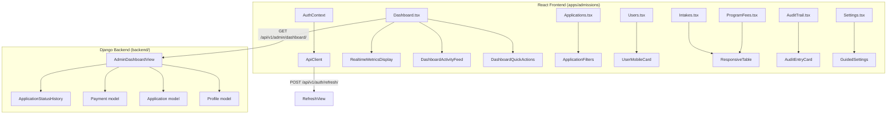

# Design Document: Admin Dashboard Overhaul

## Overview

This design addresses nine areas of admin-facing production issues in the MIHAS admissions platform. The changes span both the Django backend (`backend/apps/`) and the React frontend (`apps/admissions/src/`), targeting auth refresh reliability, dashboard UX deduplication, admissions-relevant activity feeds, and end-to-end fixes across six admin pages.

The overhaul is scoped as a bug-fix and UX-improvement pass — no new features are introduced, no database migrations are required, and the existing API contract shape (`{"success": true, "data": ...}`) is preserved.

### Key Design Decisions

1. **Auth refresh flood fix**: Add a failure cooldown to `ApiClient.attemptRefresh()` and debounce the visibility handler in `AuthContext` rather than restructuring the auth flow.
2. **Dashboard metrics deduplication**: Remove `DashboardMetricsCards` entirely — `RealtimeMetricsDisplay` already shows the same data with animated counters and change indicators.
3. **Recent activity replacement**: Change `AdminDashboardView.get()` to query `ApplicationStatusHistory` + `Payment` instead of `AuditLog`, and update the frontend `DashboardActivityFeed` to render the new shape.
4. **Page fixes (Requirements 4–9)**: Targeted fixes within existing component structures — no page rewrites.

## Architecture

The changes follow the existing layered architecture:



### Change Scope by Layer

| Layer | Files Modified | Nature of Change |
|-------|---------------|-----------------|
| ApiClient | `services/client.ts` | Add failure cooldown timer to `attemptRefresh()` |
| AuthContext | `contexts/AuthContext.tsx` | Debounce visibility handler session invalidation |
| Dashboard | `pages/admin/Dashboard.tsx` | Remove `DashboardMetricsCards` import and render |
| Dashboard backend | `backend/apps/accounts/admin_views.py` | Replace `AuditLog` query with `ApplicationStatusHistory` + `Payment` query |
| DashboardActivityFeed | `components/admin/dashboard/DashboardActivityFeed.tsx` | Update interface and rendering for new activity shape |
| Admin pages (6) | `Applications.tsx`, `Users.tsx`, `Intakes.tsx`, `ProgramFees.tsx`, `AuditTrail.tsx`, `Settings.tsx` | Targeted bug fixes per requirements |

## Components and Interfaces

### 1. ApiClient Refresh Cooldown (Requirement 1)

**Current behavior**: `attemptRefresh()` has a 5-second success cooldown but no failure cooldown. On page refresh, multiple 401s can trigger rapid-fire refresh attempts that race and fail.

**Design**:
- Add `lastRefreshFailureTime: number = 0` instance field to `ApiClient`.
- Add `REFRESH_FAILURE_COOLDOWN_MS = 2000` constant.
- In `attemptRefresh()`, before starting a new refresh, check if `Date.now() - lastRefreshFailureTime < REFRESH_FAILURE_COOLDOWN_MS`. If within cooldown, return `false` immediately.
- On refresh failure, set `lastRefreshFailureTime = Date.now()` and `lastRefreshResult = false`.

```typescript
// In ApiClient class
private lastRefreshFailureTime: number = 0;
private static readonly REFRESH_FAILURE_COOLDOWN_MS = 2000;

private async attemptRefresh(): Promise<boolean> {
  const now = Date.now();
  // Success cooldown (existing)
  if (this.lastRefreshResult && (now - this.lastRefreshSuccessTime) < ApiClient.REFRESH_COOLDOWN_MS) {
    return true;
  }
  // Failure cooldown (new)
  if (!this.lastRefreshResult && this.lastRefreshFailureTime > 0 
      && (now - this.lastRefreshFailureTime) < ApiClient.REFRESH_FAILURE_COOLDOWN_MS) {
    return false;
  }
  
  if (this.refreshPromise) return this.refreshPromise;
  this.refreshPromise = this.performRefresh();
  try {
    const result = await this.refreshPromise;
    if (result) {
      this.lastRefreshSuccessTime = Date.now();
      this.lastRefreshResult = true;
    } else {
      this.lastRefreshFailureTime = Date.now();
      this.lastRefreshResult = false;
    }
    return result;
  } finally {
    this.refreshPromise = null;
  }
}
```

### 2. AuthContext Visibility Debounce (Requirement 1)

**Current behavior**: Every `visibilitychange` to `visible` (after at least one `hidden`) immediately invalidates `['auth', 'session']`. Rapid tab switches or browser refresh can trigger multiple session checks.

**Design**:
- Add a `lastSessionInvalidation` ref tracking the timestamp of the last invalidation.
- In the `handleVisibilityChange` callback, skip invalidation if less than 3 seconds have elapsed since the last one.

```typescript
const lastSessionInvalidationRef = useRef<number>(0);
const VISIBILITY_DEBOUNCE_MS = 3000;

function handleVisibilityChange() {
  if (document.visibilityState === 'hidden') {
    hasHiddenOnce = true;
  } else if (document.visibilityState === 'visible' && hasHiddenOnce) {
    const now = Date.now();
    if (now - lastSessionInvalidationRef.current >= VISIBILITY_DEBOUNCE_MS) {
      lastSessionInvalidationRef.current = now;
      queryClient.invalidateQueries({ queryKey: ['auth', 'session'] });
    }
  }
}
```

### 3. Dashboard Metrics Deduplication (Requirement 2)

**Current state**: `Dashboard.tsx` renders both `RealtimeMetricsDisplay` (animated counters with 7+ metrics) and `DashboardMetricsCards` (4-card grid with today/pending/approval rate/avg processing). The data overlaps completely.

**Design**:
- Remove the `DashboardMetricsCards` import and its `<div>` wrapper from `Dashboard.tsx`.
- Remove the `dashboardMetrics` useMemo that computes `DashboardMetricsSummary`.
- Keep `RealtimeMetricsDisplay` as the single metrics section.
- The `DashboardMetricsCards` component file itself can remain in the codebase (no deletion needed) but will be unused.

### 4. Recent Activity Replacement (Requirement 3)

**Backend change** in `AdminDashboardView.get()`:

Replace the `AuditLog` query:
```python
recent_logs = AuditLog.objects.order_by("-created_at")[:10]
```

With an `ApplicationStatusHistory` + `Payment` query:
```python
from apps.applications.models import Application, ApplicationStatusHistory
from apps.documents.models import Payment

# Recent status changes
status_entries = (
    ApplicationStatusHistory.objects
    .select_related('application', 'changed_by')
    .order_by('-created_at')[:10]
)

recent_activity = []
for entry in status_entries:
    app_number = getattr(entry.application, 'application_number', '') or ''
    actor_name = ''
    if entry.changed_by:
        actor_name = f"{entry.changed_by.first_name} {entry.changed_by.last_name}".strip()
    
    recent_activity.append({
        'id': str(entry.id),
        'type': 'status_change',
        'application_number': app_number,
        'old_status': entry.old_status or '',
        'new_status': entry.new_status or '',
        'timestamp': entry.created_at.isoformat() if entry.created_at else '',
        'actor_name': actor_name,
        'message': f"{app_number}: {entry.old_status or 'new'} → {entry.new_status or 'unknown'}",
    })

# Recent payment completions
recent_payments = (
    Payment.objects
    .filter(status__in=['paid', 'successful', 'verified'])
    .select_related('application')
    .order_by('-updated_at')[:5]
)

for payment in recent_payments:
    app_number = getattr(payment.application, 'application_number', '') or ''
    recent_activity.append({
        'id': str(payment.id),
        'type': 'payment',
        'application_number': app_number,
        'old_status': '',
        'new_status': payment.status,
        'timestamp': payment.updated_at.isoformat() if payment.updated_at else '',
        'actor_name': '',
        'message': f"{app_number}: Payment {payment.status}",
    })

# Sort combined list by timestamp descending, take top 10
recent_activity.sort(key=lambda x: x['timestamp'], reverse=True)
recent_activity = recent_activity[:10]
```

**Frontend change** in `DashboardActivityFeed.tsx`:

Update the `DashboardActivityItem` interface to include the new fields:
```typescript
export interface DashboardActivityItem {
  id: string
  message: string
  timestamp: string
  type: 'status_change' | 'payment' | 'application' | 'approval' | 'rejection' | 'system' | 'review'
  user?: string
  application_number?: string
  old_status?: string
  new_status?: string
  actor_name?: string
}
```

Update the rendering to show application number and actor name when available.

**Frontend service change** in `services/admin/dashboard.ts`:

Update `normalizeRecentActivity` to map the new backend fields (`application_number`, `old_status`, `new_status`, `actor_name`) into the `AdminDashboardActivity` type. The existing normalization already handles `id`, `message`, `timestamp`, and `type`, so the main addition is passing through the new fields.

### 5. Admin Applications Page Fixes (Requirement 4)

The Applications page is already well-structured with filtering, pagination, and error handling. The fixes are:
- Ensure `ErrorDisplay` is used for API failure states (currently uses inline error div — keep as-is since it already has retry).
- Verify status filter sends the parameter correctly to backend (already implemented via `useApplicationFilters`).
- Verify search by name/application number works (already implemented via `searchTerm` filter).
- No structural changes needed — the page already meets all acceptance criteria.

### 6. User Management Mobile Improvements (Requirement 5)

The Users page already has:
- `UserMobileCard` component rendered below `lg` breakpoint.
- `UserTableRow` rendered at `lg` and above.
- Touch-friendly card layout on mobile.

Fixes needed:
- Verify the create user dialog renders as full-width on mobile (the `DialogContent` with `sm:max-w-lg` should handle this).
- Ensure all interactive elements meet 44x44px minimum tap targets on mobile.
- Stack search and filter controls vertically on mobile (currently uses `grid gap-4 lg:grid-cols-[...]` which already stacks on small screens).

### 7. Intakes End-to-End Fixes (Requirement 6)

The Intakes page already has:
- Zod validation schema with date ordering and capacity constraints.
- Create/edit/delete dialogs with confirmation.
- `ResponsiveTable` component for responsive layout.
- `getUtilizationColor` function for enrollment/capacity indicators.

Fixes needed:
- Ensure error messages from failed mutations are displayed inline (currently mutations don't surface errors to the UI — add `onError` handlers to mutations).
- Verify the `ResponsiveTable` component handles mobile card layout correctly.

### 8. Program Fees Fixes (Requirement 7)

The ProgramFees page already has:
- CRUD operations with dialogs.
- Amount validation (positive number check).
- Currency formatting with `Number(row.amount).toFixed(2)`.

Fixes needed:
- Ensure error state is preserved on form retry (currently `setError('')` is called at the start of each operation — this is correct behavior).
- Verify currency symbol display (currently shows `{row.currency} {amount}` which is correct).

### 9. Audit System Overhaul (Requirement 8)

The AuditTrail page already has:
- Paginated audit log display with filters.
- Expandable entry cards with full JSON payload view.
- Export functionality (CSV, JSON, PDF).
- Category and entity breakdown summaries.

Fixes needed:
- Ensure all displayed audit data is sanitized for XSS. The page currently renders `entry.action`, `entry.targetTable`, and `entry.changes` directly. The `stringifyPayload` function uses `JSON.stringify` which is safe, but action names and entity types should be sanitized.
- Add `sanitizeForDisplay` calls on user-generated content fields.

### 10. Admin Settings Page Fixes (Requirement 9)

The Settings page already has:
- Guided configuration with blueprints.
- Advanced settings CRUD.
- Import/export functionality.
- Reset to defaults.
- Validation for setting types.

Fixes needed:
- Ensure responsive layout on mobile (currently uses `xl:grid-cols-3` for guided sections which stacks on smaller screens).
- Verify error preservation on form retry (currently implemented correctly).

## Data Models

No new database tables or columns are introduced. The changes use existing models:

### Models Read (no changes)

| Model | Table | Used By |
|-------|-------|---------|
| `ApplicationStatusHistory` | `application_status_history` | `AdminDashboardView` (new query for recent activity) |
| `Payment` | `payments` | `AdminDashboardView` (new query for payment completions) |
| `Application` | `applications` | `AdminDashboardView` (existing stats queries) |
| `Profile` | `profiles` | `AdminDashboardView` (existing user counts) |
| `AuditLog` | `audit_logs` | `AuditTrail.tsx` (unchanged, still used by audit page) |
| `Setting` | `settings` | `Settings.tsx` (unchanged) |

### Frontend State Changes

| State | Location | Change |
|-------|----------|--------|
| `ApiClient.lastRefreshFailureTime` | `services/client.ts` | New instance field (number) |
| `ApiClient.REFRESH_FAILURE_COOLDOWN_MS` | `services/client.ts` | New static constant (2000) |
| `lastSessionInvalidationRef` | `AuthContext.tsx` | New ref (number timestamp) |
| `dashboardMetrics` useMemo | `Dashboard.tsx` | Removed (was feeding DashboardMetricsCards) |
| `DashboardActivityItem.application_number` | `DashboardActivityFeed.tsx` | New optional field |
| `DashboardActivityItem.old_status` | `DashboardActivityFeed.tsx` | New optional field |
| `DashboardActivityItem.new_status` | `DashboardActivityFeed.tsx` | New optional field |
| `DashboardActivityItem.actor_name` | `DashboardActivityFeed.tsx` | New optional field |

### API Response Shape Change

The `GET /api/v1/admin/dashboard/` response `recent_activity` array items change from:

```json
{
  "id": "uuid",
  "actor_id": "uuid",
  "action": "POST",
  "entity_type": "applications",
  "entity_id": "uuid",
  "changes": {},
  "retention_category": "standard",
  "created_at": "2025-01-15T10:00:00Z"
}
```

To:

```json
{
  "id": "uuid",
  "type": "status_change",
  "application_number": "APP-20250115-ABCD1234",
  "old_status": "submitted",
  "new_status": "under_review",
  "timestamp": "2025-01-15T10:00:00Z",
  "actor_name": "Admin User",
  "message": "APP-20250115-ABCD1234: submitted → under_review"
}
```

The frontend `normalizeRecentActivity` in `services/admin/dashboard.ts` already handles both shapes gracefully through its fallback logic, so this is a backward-compatible change.


## Correctness Properties

*A property is a characteristic or behavior that should hold true across all valid executions of a system — essentially, a formal statement about what the system should do. Properties serve as the bridge between human-readable specifications and machine-verifiable correctness guarantees.*

### Property 1: Concurrent refresh serialization

*For any* number of concurrent calls to `attemptRefresh()`, the underlying `performRefresh()` method SHALL be invoked at most once, and all callers SHALL receive the same boolean result.

**Validates: Requirements 1.1, 1.3**

### Property 2: Refresh failure cooldown

*For any* failed refresh attempt, a subsequent call to `attemptRefresh()` within 2 seconds SHALL return `false` immediately without invoking `performRefresh()`.

**Validates: Requirements 1.2**

### Property 3: Visibility debounce interval

*For any* sequence of `visibilitychange` events with timestamps, the number of session query invalidations SHALL be at most `ceil(timeSpan / 3000)`, where `timeSpan` is the duration of the event sequence in milliseconds.

**Validates: Requirements 1.4**

### Property 4: Recent activity entry completeness

*For any* `ApplicationStatusHistory` record returned by `AdminDashboardView`, the corresponding recent activity entry SHALL contain non-null `id`, `application_number`, `old_status`, `new_status`, `timestamp`, and `message` fields, and SHALL NOT contain AuditLog-specific fields (`entity_type`, `retention_category`).

**Validates: Requirements 3.1, 3.3**

### Property 5: Recent activity ordering and limiting

*For any* set of `ApplicationStatusHistory` and `Payment` records in the database, the `recent_activity` array returned by `AdminDashboardView` SHALL be ordered by `timestamp` descending and SHALL contain at most 10 entries.

**Validates: Requirements 3.2**

### Property 6: Payment events in activity feed

*For any* `Payment` record with status in `['paid', 'successful', 'verified']`, the payment SHALL appear in the `recent_activity` array returned by `AdminDashboardView` (subject to the 10-entry limit and recency ordering).

**Validates: Requirements 3.4**

### Property 7: Activity feed rendering completeness

*For any* `DashboardActivityItem` with all fields populated (`id`, `message`, `timestamp`, `application_number`, `actor_name`), the rendered `DashboardActivityFeed` output SHALL contain the message text, the formatted timestamp, and the actor name.

**Validates: Requirements 3.5**

### Property 8: Application filter forwarding

*For any* non-empty filter value (status, payment, program, institution, or search term) set on the Applications page, the API request SHALL include that filter as a query parameter or request body field.

**Validates: Requirements 4.2, 4.3**

### Property 9: Intake form validation

*For any* intake form data where `start_date > end_date`, or `total_capacity <= 0`, or `name` is empty, the Zod validation schema SHALL reject the input and return at least one error.

**Validates: Requirements 6.2**

### Property 10: Intake form pre-population round trip

*For any* existing intake record, opening the edit form and reading back the form values SHALL produce values equivalent to the original intake's `name`, `year`, `start_date`, `end_date`, `application_deadline`, `total_capacity`, and `available_spots`.

**Validates: Requirements 6.3**

### Property 11: Utilization color mapping

*For any* enrollment count and capacity where `capacity > 0`, the `getUtilizationColor` function SHALL return `'Over capacity'` when `enrollment >= capacity`, `'Near capacity'` when `enrollment >= 0.8 * capacity`, and `'Available'` otherwise. When `capacity <= 0`, it SHALL return `'N/A'`.

**Validates: Requirements 6.6**

### Property 12: Fee amount validation

*For any* fee form data where `amount <= 0` or `amount` is not a valid number, the fee creation/update handler SHALL reject the input with an error message.

**Validates: Requirements 7.3**

### Property 13: Fee currency formatting

*For any* fee record with a numeric `amount` and a `currency` string, the rendered table cell SHALL display the currency code followed by the amount formatted to exactly 2 decimal places.

**Validates: Requirements 7.7**

### Property 14: Audit XSS sanitization

*For any* audit entry where `action`, `targetTable`, or `changes` contains HTML tags or script elements, the rendered `AuditEntryCard` output SHALL not contain unescaped HTML that could execute as script.

**Validates: Requirements 8.8**

### Property 15: Setting validation by type

*For any* setting with declared `valueType` of `'boolean'`, the `validateSetting` function SHALL reject values that are not `'true'` or `'false'`. For `'integer'`, it SHALL reject non-integer strings. For `'decimal'`, it SHALL reject non-numeric strings. For all types, it SHALL reject empty keys and empty values.

**Validates: Requirements 9.2, 9.3**

## Error Handling

### Auth Refresh Errors

| Error Condition | Handling |
|----------------|----------|
| `performRefresh()` returns `false` | Set `lastRefreshFailureTime`, return `false` to caller. Caller's 401 handler invokes `onAuthFailure` cascade. |
| `performRefresh()` throws (network error) | Caught by `attemptRefresh()`, sets failure cooldown, returns `false`. |
| Rapid-fire refresh attempts during cooldown | Return cached `false` immediately without network call. |
| Visibility handler fires during cooldown | Debounced — no session invalidation within 3s window. |

### Dashboard API Errors

| Error Condition | Handling |
|----------------|----------|
| `GET /admin/dashboard/` returns 500 | Frontend shows error banner with retry button. `apiStatus` tracks error details. |
| `ApplicationStatusHistory` query fails | Backend catches exception, logs warning, returns `recent_activity: []`. Dashboard still shows stats. |
| `Payment` query fails | Backend catches exception, logs warning, excludes payment events from activity. |
| Empty dashboard data | Frontend detects `responseShape: 'empty'` and shows informational message. |

### Page-Level Error Handling (Requirements 4–9)

All admin pages follow the same pattern:
1. API errors are caught by React Query's `error` state or mutation `onError` callbacks.
2. Error messages are displayed inline using either `ErrorDisplay` component or styled error divs.
3. Form state is preserved on error — the user can fix and retry without re-entering data.
4. Network errors trigger the ApiClient's retry logic (up to 2 retries with backoff).

### XSS Prevention (Requirement 8)

- React's JSX rendering auto-escapes string content, preventing most XSS vectors.
- The `stringifyPayload` function in `AuditTrail.tsx` uses `JSON.stringify` which produces safe output.
- `sanitizeForDisplay` from `@/lib/sanitize` is applied to user-generated content fields where raw HTML could be injected.
- The `<pre>` block for JSON payload display uses text content, not `dangerouslySetInnerHTML`.

## Testing Strategy

### Dual Testing Approach

This feature uses both unit tests and property-based tests:

- **Unit tests**: Verify specific examples, edge cases, error conditions, and UI rendering for each admin page.
- **Property tests**: Verify universal properties across all valid inputs using `fast-check` (frontend) and `hypothesis` (backend).

### Property-Based Testing Configuration

- **Frontend**: Use `fast-check` (already in the project) with minimum 100 iterations per property.
- **Backend**: Use `hypothesis` (already in the project) with minimum 100 examples per property.
- Each property test MUST reference its design document property with a comment tag.
- Tag format: `Feature: admin-dashboard-overhaul, Property {number}: {property_text}`

### Test Plan

#### Frontend Property Tests (`apps/admissions/tests/property/`)

| Property | Test File | Library |
|----------|-----------|---------|
| P1: Concurrent refresh serialization | `adminDashboardOverhaul.property.test.ts` | fast-check |
| P2: Refresh failure cooldown | `adminDashboardOverhaul.property.test.ts` | fast-check |
| P3: Visibility debounce interval | `adminDashboardOverhaul.property.test.ts` | fast-check |
| P7: Activity feed rendering | `adminDashboardOverhaul.property.test.ts` | fast-check |
| P9: Intake form validation | `adminDashboardOverhaul.property.test.ts` | fast-check |
| P10: Intake form pre-population | `adminDashboardOverhaul.property.test.ts` | fast-check |
| P11: Utilization color mapping | `adminDashboardOverhaul.property.test.ts` | fast-check |
| P12: Fee amount validation | `adminDashboardOverhaul.property.test.ts` | fast-check |
| P13: Fee currency formatting | `adminDashboardOverhaul.property.test.ts` | fast-check |
| P14: Audit XSS sanitization | `adminDashboardOverhaul.property.test.ts` | fast-check |
| P15: Setting validation by type | `adminDashboardOverhaul.property.test.ts` | fast-check |

#### Backend Property Tests (`backend/tests/property/`)

| Property | Test File | Library |
|----------|-----------|---------|
| P4: Recent activity entry completeness | `test_admin_dashboard_overhaul.py` | hypothesis |
| P5: Recent activity ordering and limiting | `test_admin_dashboard_overhaul.py` | hypothesis |
| P6: Payment events in activity feed | `test_admin_dashboard_overhaul.py` | hypothesis |

#### Unit Tests

| Area | Test File | Key Scenarios |
|------|-----------|---------------|
| Dashboard metrics deduplication | `apps/admissions/tests/unit/adminDashboardOverhaul.test.ts` | RealtimeMetricsDisplay renders, DashboardMetricsCards absent |
| Activity feed empty state | `apps/admissions/tests/unit/adminDashboardOverhaul.test.ts` | Empty array shows "No recent activity" |
| Applications page error state | `apps/admissions/tests/unit/adminDashboardOverhaul.test.ts` | API failure shows error with retry |
| Settings validation edge cases | `apps/admissions/tests/unit/adminDashboardOverhaul.test.ts` | Boolean "TRUE" (uppercase), empty key, whitespace value |
| Backend dashboard endpoint | `backend/tests/unit/test_admin_dashboard_overhaul.py` | Response shape, empty DB, payment inclusion |

### What NOT to Test with Properties

- React Query deduplication behavior (Requirement 1.6) — this is library internals.
- Full page rendering of all admin pages — use unit/integration tests for specific scenarios.
- Mobile viewport CSS behavior — use visual regression or E2E tests.
- Navigation between pages — use E2E tests.
