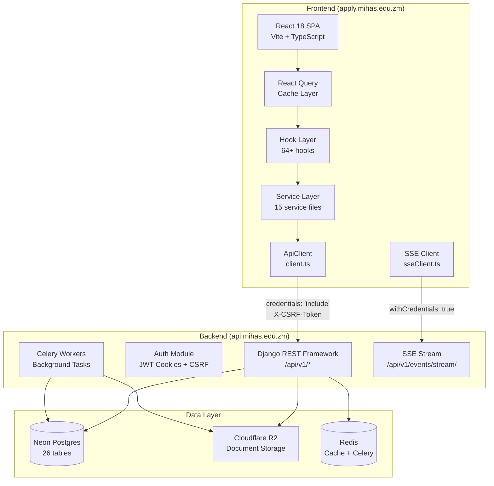
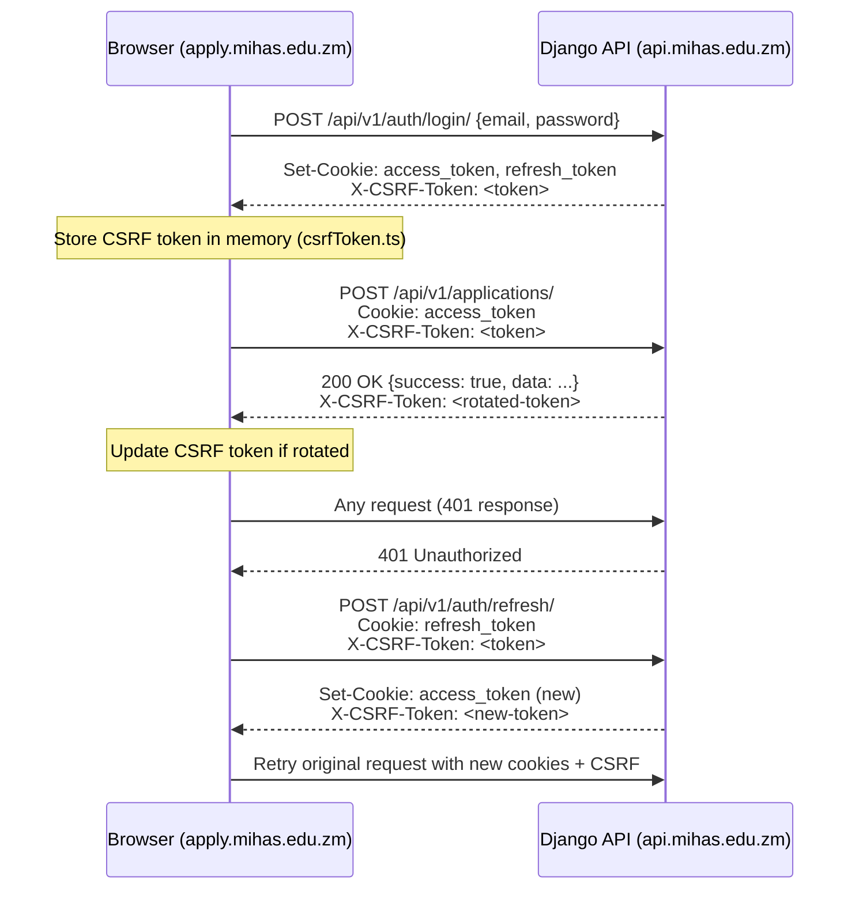
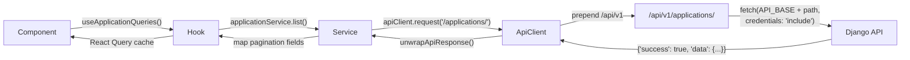

# Design Document: Admissions Frontend Overhaul

## Overview

This design covers the complete migration of the MIHAS admissions React frontend (`apps/admissions/`) from legacy Vercel Functions API conventions to the Django 5 + DRF backend at `api.mihas.edu.zm`. The migration touches every layer of the frontend API stack:

1. **API Client** (`client.ts`): Remove `normalizeEndpoint()` translation layer, send requests directly to `/api/v1/` paths
2. **Service Layer** (15 files): Rewrite all endpoint paths from `?action=` query-parameter form to Django REST paths
3. **Hook Layer** (64+ hooks): Update all hooks to use migrated service methods and correct React Query cache keys
4. **Auth Context**: Migrate to Django JWT cookies with cross-origin `credentials: 'include'`
5. **SSE/Real-time**: Migrate from `/api/sessions?action=connect` to `/api/v1/events/stream/`
6. **Raw fetch calls**: Replace all `fetch('/api/...')` in `storage.ts`, `adminApi.ts`, `connectionFix.ts` with `apiClient.request()` using Django paths
7. **Dependencies**: Remove 14 backend-only packages from `package.json`
8. **Steering files**: Update `tech.md`, `structure.md`, `product.md` to reflect current architecture

### Key Constraints

- Cross-origin: `apply.mihas.edu.zm` → `api.mihas.edu.zm` (all requests need `credentials: 'include'`)
- Auth: HTTP-only cookies with `Domain=.mihas.edu.zm`, CSRF via `X-CSRF-Token` header
- Response envelope: `{"success": true, "data": ...}` (same format, no change needed in unwrapping)
- Pagination: Django returns `{page, pageSize, totalCount, results}` — services must map `results` to domain-specific field names
- Zero downtime: migration must not break existing UI flows

## Architecture

### High-Level Architecture



### CSRF Token Flow



### Request Flow Through Layers



## Components and Interfaces

### 1. API Client (`client.ts`) — Core Changes

**Remove:**
- `normalizeEndpoint()` method and `supportedResources` set
- All legacy path patterns in `isAuthExcludedEndpoint()`, `performRefresh()`, `handleCsrf403()`

**Add/Modify:**
- `toApiV1Path()` — already exists, becomes the sole path normalization
- Update `SHORT_TIMEOUT_PATTERNS` to `['/api/v1/health/', '/api/v1/auth/session/']`
- Update `getQueryInvalidationPatterns()` to parse REST-style URL segments instead of query params

```typescript
// BEFORE (normalizeEndpoint converts REST to query-param)
apiClient.request('/applications')
// normalizeEndpoint → '/api/applications'

// AFTER (toApiV1Path prepends /api/v1)
apiClient.request('/applications/')
// toApiV1Path → '/api/v1/applications/'
```

**`request()` method flow after migration:**
1. Receive endpoint string (e.g., `/applications/` or `/auth/login/`)
2. Call `toApiV1Path()` to prepend `/api/v1` if not already present
3. Build full URL: `${API_BASE}${apiV1Path}`
4. Attach `credentials: 'include'` and CSRF token for mutations
5. Execute fetch with timeout, retry, and 401/403 intercept logic
6. Unwrap `{success, data}` envelope via `unwrapApiResponse()`

### 2. API Path Mapping Table

| Service File | Method | Legacy Path | Django REST Path |
|---|---|---|---|
| **auth.ts** | | | |
| | register | `/auth?action=register` | `/auth/register/` |
| | login | `/auth?action=login` | `/auth/login/` |
| **client.ts** | | | |
| | performRefresh | `/api/auth?action=refresh` | `/api/v1/auth/refresh/` |
| | handleCsrf403 | `/api/auth?action=session` | `/api/v1/auth/session/` |
| | isAuthExcluded | `/api/auth?action=refresh,login,register` | `/api/v1/auth/refresh/`, `/api/v1/auth/login/`, `/api/v1/auth/register/` |
| **applications.ts** | | | |
| | list / getAll | `/applications` | `/applications/` |
| | getById | `/applications?id={id}` | `/applications/{id}/` |
| | getDetails | `/applications?id={id}` (with include) | `/applications/{id}/details/` |
| | create | `/applications` POST | `/applications/` POST |
| | update | `/applications?id={id}` PUT | `/applications/{id}/` PUT |
| | delete | `/applications?id={id}` DELETE | `/applications/{id}/` DELETE |
| | updateStatus | `/applications?id={id}` PATCH action=update_status | `/applications/{id}/review/` PATCH |
| | updatePaymentStatus | `/applications?id={id}` PATCH action=update_payment_status | `/applications/{id}/review/` PATCH |
| | verifyDocument | `/applications?id={id}` PATCH action=verify_document | `/applications/{id}/review/` PATCH |
| | sendNotification | `/applications?id={id}` PATCH action=send_notification | `/applications/{id}/review/` PATCH |
| | generateAcceptanceLetter | `/applications?id={id}` PATCH action=generate_acceptance_letter | `/applications/{id}/review/` PATCH |
| | generateFinanceReceipt | `/applications?id={id}` PATCH action=generate_finance_receipt | `/applications/{id}/review/` PATCH |
| | scheduleInterview | `/applications?id={id}` PATCH action=schedule_interview | `/applications/{id}/interviews/` POST |
| | rescheduleInterview | `/applications?id={id}` PATCH action=reschedule_interview | `/applications/{id}/interviews/` PUT |
| | cancelInterview | `/applications?id={id}` PATCH action=cancel_interview | `/applications/{id}/interviews/` DELETE |
| | exportApplications | `/applications?action=export` | `/applications/export/` |
| | track | (not yet in service) | `/applications/track/` |
| | bulkStatus | (not yet in service) | `/applications/bulk-status/` |
| | draft | (not yet in service) | `/applications/draft/` POST |
| **catalog.ts** | | | |
| | getPrograms | `/catalog?type=programs` | `/catalog/programs/` |
| | getIntakes | `/catalog?type=intakes` | `/catalog/intakes/` |
| | getSubjects | `/catalog?type=subjects` | `/catalog/subjects/` |
| | getInstitutions | `/catalog?type=institutions` | `/catalog/institutions/` |
| | programService.create | `/catalog?type=programs` POST | `/catalog/programs/` POST |
| | programService.update | `/catalog?type=programs` PUT | `/catalog/programs/{id}/` PUT |
| | programService.delete | `/catalog?type=programs` DELETE | `/catalog/programs/{id}/` DELETE |
| | intakeService.create | `/catalog?type=intakes` POST | `/catalog/intakes/` POST |
| | intakeService.update | `/catalog?type=intakes` PUT | `/catalog/intakes/{id}/` PUT |
| | intakeService.delete | `/catalog?type=intakes` DELETE | `/catalog/intakes/{id}/` DELETE |
| | institutionService.create | `/catalog?type=institutions` POST | `/catalog/institutions/` POST |
| | institutionService.update | `/catalog?type=institutions` PUT | `/catalog/institutions/{id}/` PUT |
| | institutionService.delete | `/catalog?type=institutions` DELETE | `/catalog/institutions/{id}/` DELETE |
| **documents.ts** | | | |
| | upload | `/documents?action=upload` | `/documents/upload/` POST |
| | extract | `/documents?action=extract` | `/documents/{id}/extract/` POST |
| | getSignedUrl | `/documents?action=signed-url&key=...` | `/documents/{id}/signed-url/` GET (or via upload response) |
| **documentExtraction.ts** | | | |
| | extractPDFContent | `/documents?action=extract` | `/documents/{id}/extract/` POST |
| **notifications.ts** | | | |
| | send | `/notifications?action=send` | `/notifications/` POST |
| | getPreferences | `/notifications?action=preferences` GET | `/notifications/preferences/` GET |
| | updatePreferences | `/notifications?action=preferences` POST | `/notifications/preferences/` PUT |
| | list | `/notifications?action=list` | `/notifications/` GET |
| | markRead | `/notifications?action=mark-read` PUT | `/notifications/{id}/read/` PUT |
| | markAllRead | `/notifications?action=mark-all-read` PUT | `/notifications/read-all/` PUT |
| | delete | `/notifications?action=delete` DELETE | `/notifications/{id}/` DELETE |
| **sessionService.ts** | | | |
| | listActiveSessions | `/api/sessions?action=list` | `/sessions/` GET |
| | terminateSessionById | `/api/sessions?action=revoke` | `/sessions/{id}/revoke/` POST |
| | terminateAllOtherSessions | `/api/sessions?action=revoke-all` | `/sessions/revoke-all/` POST |
| **interviews.ts** | | | |
| | schedule | `/applications?action=schedule-interview` | `/applications/{id}/interviews/` POST |
| | list | `/applications?action=interviews` | `/applications/{id}/interviews/` GET |
| **admin/dashboard.ts** | | | |
| | getOverview | `/admin?action=dashboard` | `/admin/dashboard/` GET |
| **admin/users.ts** | | | |
| | list | `/api/admin?action=users` | `/admin/users/` GET |
| | create | `/api/admin?action=register` | `/admin/users/` POST |
| | update | `/api/admin?action=users` PUT | `/admin/users/{id}/` PUT |
| | remove | `/api/admin?action=users` DELETE | `/admin/users/{id}/` DELETE |
| | getPermissions | `/api/admin?action=user-permissions` | `/admin/users/{id}/` GET (permissions in response) |
| | updatePermissions | `/api/admin?action=user-permissions` PUT | `/admin/users/{id}/` PUT |
| **admin/audit.ts** | | | |
| | list | `/admin?action=audit-log` | `/admin/audit-logs/` GET |
| **adminApi.ts** (lib) | | | |
| | fetchSettings | `/api/admin?action=settings` | `/admin/settings/` GET |
| | createSetting | `/api/admin?action=settings` POST | `/admin/settings/` POST |
| | updateSetting | `/api/admin?action=settings` PUT | `/admin/settings/{id}/` PUT |
| | deleteSetting | `/api/admin?action=settings` DELETE | `/admin/settings/{id}/` DELETE |
| | importSettings | `/api/admin?action=import-settings` POST | `/admin/settings/import/` POST |
| | resetSettings | `/api/admin?action=reset-settings` POST | `/admin/settings/reset/` POST |
| | fetchEligibilityRules | `/api/admin?action=eligibility-rules` | `/admin/eligibility-rules/` GET |
| | createEligibilityRule | `/api/admin?action=eligibility-rules` POST | `/admin/eligibility-rules/` POST |
| | updateEligibilityRule | `/api/admin?action=eligibility-rules` PUT | `/admin/eligibility-rules/{id}/` PUT |
| | deleteEligibilityRule | `/api/admin?action=eligibility-rules` DELETE | `/admin/eligibility-rules/{id}/` DELETE |
| | fetchUsersWithRoles | `/api/admin?action=users` | `/admin/users/` GET |
| | updateUserRole | `/api/admin?action=update-role` PUT | `/admin/users/{id}/` PUT |
| | fetchNotifications | `/api/notifications?action=list` | `/notifications/` GET |
| | markNotificationRead | `/api/notifications?action=mark-read` PUT | `/notifications/{id}/read/` PUT |
| | markAllNotificationsRead | `/api/notifications?action=mark-all-read` PUT | `/notifications/read-all/` PUT |
| | deleteNotification | `/api/notifications?action=delete` DELETE | `/notifications/{id}/` DELETE |
| **storage.ts** (lib) | | | |
| | uploadApplicationFile | `fetch('/api/documents?action=upload')` | `apiClient.request('/documents/upload/')` |
| | uploadFile | `fetch('/api/documents?action=upload')` | `apiClient.request('/documents/upload/')` |
| | deleteFile | `fetch('/api/documents?action=delete')` | `apiClient.request('/documents/{path}/')` DELETE |
| | getFileUrl | `fetch('/api/documents?action=url')` | `apiClient.request('/documents/{path}/signed-url/')` |
| | downloadFile | `fetch('/api/documents?action=download')` | `apiClient.request('/documents/{path}/download/')` |
| | listFiles | `fetch('/api/documents?action=list')` | `apiClient.request('/documents/')` GET |
| | getFileInfo | `fetch('/api/documents?action=info')` | `apiClient.request('/documents/{path}/info/')` |
| **connectionFix.ts** (lib) | | | |
| | testConnection | `fetch('/api/health?action=ping')` | `fetch(API_BASE + '/api/v1/health/live/')` |
| | syncGradesWithRecovery | `/applications/{id}` PATCH action=sync_grades | `/applications/{id}/grades/` PUT |
| **sseClient.ts** (lib) | | | |
| | default endpoint | `/api/sessions?action=connect` | `${API_BASE}/api/v1/events/stream/` |
| **useRealtime.ts** (hook) | | | |
| | SSE_ENDPOINT | `/api/sessions?action=connect` | `${API_BASE}/api/v1/events/stream/` |
| | POLLING_ENDPOINT | `/api/sessions?action=poll` | `/events/poll/` (via apiClient) |
| **pushNotificationManager.ts** | | | |
| | sendSubscriptionToServer | `/notifications?action=push-subscribe` | `/notifications/push-subscribe/` POST |
| **offlineSync.ts** | | | |
| | syncToServer (draft) | `/applications` POST action=save_draft | `/applications/draft/` POST |
| | syncToServer (submission) | `/applications` POST | `/applications/` POST |
| | fetchServerVersion | `/applications?action=details` | `/applications/{id}/` GET |


### 3. Service Layer Changes Per File

#### `services/client.ts` — API Client Core

**Delete:** `normalizeEndpoint()` method (~60 lines), `supportedResources` set, `getResourceSegments()` (unused after migration).

**Modify `request()`:** Replace `this.normalizeEndpoint(endpoint, method)` with `toApiV1Path(endpoint)`. The existing `toApiV1Path()` function already handles prepending `/api/v1` and deduplicating slashes.

**Modify `performRefresh()`:** Change URL from `${API_BASE}/api/auth?action=refresh` to `${API_BASE}/api/v1/auth/refresh/`.

**Modify `handleCsrf403()`:** Change session URL from `${API_BASE}/api/auth?action=session` to `${API_BASE}/api/v1/auth/session/`.

**Modify `isAuthExcludedEndpoint()`:** Update patterns to match Django paths:
```typescript
private isAuthExcludedEndpoint(endpoint: string): boolean {
  const excludedPatterns = [
    '/api/v1/auth/refresh/',
    '/api/v1/auth/login/',
    '/api/v1/auth/register/',
  ];
  return excludedPatterns.some(pattern => endpoint.includes(pattern));
}
```

**Modify `getQueryInvalidationPatterns()`:** Parse URL pathname segments instead of query params:
```typescript
getQueryInvalidationPatterns(endpoint: string, method: string): string[][] {
  const upper = method.toUpperCase();
  const url = new URL(endpoint, 'http://localhost');
  const segments = url.pathname.replace(/^\/api\/v1\//, '').split('/').filter(Boolean);
  const resource = segments[0] || '';
  const id = segments[1] || '';
  const action = segments[2] || '';
  // ... rest of logic using resource/id/action from path segments
}
```

#### `services/auth.ts`

Replace all query-parameter paths with Django REST paths. Add logout and session methods:
```typescript
export const authService = {
  register: (data) => apiClient.request('/auth/register/', { method: 'POST', body: ... }),
  login: (data) => apiClient.request('/auth/login/', { method: 'POST', body: ... }),
  logout: () => apiClient.request('/auth/logout/', { method: 'POST' }),
  session: () => apiClient.request('/auth/session/', { method: 'GET' }),
  refresh: () => apiClient.request('/auth/refresh/', { method: 'POST' }),
  passwordReset: (data) => apiClient.request('/auth/password-reset/', { method: 'POST', body: ... }),
  passwordResetConfirm: (data) => apiClient.request('/auth/password-reset/confirm/', { method: 'POST', body: ... }),
}
```

#### `services/applications.ts`

Convert all `?id=` and `?action=` patterns to RESTful path segments:
- `list()`: `/applications/` with query params for pagination/filtering
- `getById(id)`: `/applications/${id}/`
- `create()`: `/applications/` POST
- `update(id)`: `/applications/${id}/` PUT
- `delete(id)`: `/applications/${id}/` DELETE
- `updateStatus(id)`: `/applications/${id}/review/` PATCH
- `scheduleInterview(id)`: `/applications/${id}/interviews/` POST
- `rescheduleInterview(id)`: `/applications/${id}/interviews/` PUT
- `cancelInterview(id)`: `/applications/${id}/interviews/` DELETE
- `exportApplications()`: `/applications/export/` GET
- Add `track()`: `/applications/track/` GET
- Add `bulkStatus()`: `/applications/bulk-status/` POST
- Add `saveDraft()`: `/applications/draft/` POST

#### `services/catalog.ts`

Replace `?type=` query params with sub-resource paths:
- `getPrograms()`: `/catalog/programs/`
- `getIntakes()`: `/catalog/intakes/`
- `getSubjects()`: `/catalog/subjects/`
- `getInstitutions()`: `/catalog/institutions/`
- CRUD operations use `/{resource}/{id}/` for detail operations

#### `services/documents.ts`

- `upload()`: `/documents/upload/` POST with FormData (switch from base64 to multipart)
- `extract(id)`: `/documents/${id}/extract/` POST
- `getSignedUrl(id)`: handled via upload response URL or dedicated endpoint

#### `services/notifications.ts`

- `send()`: `/notifications/` POST
- `list()`: `/notifications/` GET
- `getPreferences()`: `/notifications/preferences/` GET
- `updatePreferences()`: `/notifications/preferences/` PUT
- `markRead(id)`: `/notifications/${id}/read/` PUT
- `markAllRead()`: `/notifications/read-all/` PUT
- `delete(id)`: `/notifications/${id}/` DELETE

#### `services/sessionService.ts`

- `listActiveSessions()`: `/sessions/` GET
- `terminateSessionById(id)`: `/sessions/${id}/revoke/` POST
- `terminateAllOtherSessions()`: `/sessions/revoke-all/` POST

#### `services/interviews.ts`

- `schedule(data)`: `/applications/${id}/interviews/` POST
- `list(id)`: `/applications/${id}/interviews/` GET

#### `services/admin/dashboard.ts`

- `getOverview()`: `/admin/dashboard/` GET

#### `services/admin/users.ts`

- `list()`: `/admin/users/` GET
- `create()`: `/admin/users/` POST
- `update(id)`: `/admin/users/${id}/` PUT
- `remove(id)`: `/admin/users/${id}/` DELETE

#### `services/admin/audit.ts`

- `list(filters)`: `/admin/audit-logs/` GET with query params

#### `services/documentExtraction.ts`

- `extractPDFContent(id)`: `/documents/${id}/extract/` POST

#### `services/offlineSync.ts`

- Draft sync: `/applications/draft/` POST
- Form submission: `/applications/` POST
- Server version fetch: `/applications/${id}/` GET

#### `services/pushNotificationManager.ts`

- Push subscribe: `/notifications/push-subscribe/` POST

### 4. `lib/api/adminApi.ts` — Full Migration to `apiClient`

This file currently uses raw `fetch()` with `adminFetch()` wrapper. All 16+ functions must be migrated to use `apiClient.request()` with Django REST paths. The `adminFetch()` wrapper, `parseJsonResponse()`, and `HtmlResponseError` can be removed since `apiClient` already handles JSON parsing, error handling, and envelope unwrapping.

### 5. `lib/storage.ts` — Raw Fetch Migration

All 6 raw `fetch('/api/documents?action=...')` calls must be replaced with `apiClient.request()` using Django REST paths. This ensures CSRF tokens are attached and cross-origin cookies are sent.

### 6. `lib/sseClient.ts` and `hooks/useRealtime.ts` — SSE Migration

- Default SSE endpoint changes from `/api/sessions?action=connect` to `${API_BASE}/api/v1/events/stream/`
- SSE client must use full absolute URL (cross-origin EventSource)
- `withCredentials: true` already set — no change needed
- Polling fallback changes from `/api/sessions?action=poll` to `/events/poll/` via `apiClient.request()`
- Enable SSE by default (`enabled: true`) since Django supports persistent connections (no Vercel 10s timeout)

### 7. Hook Layer Migration Strategy

Hooks fall into three categories:

**Category A — Service consumers (no direct API calls):** These hooks call service methods and manage React Query cache. Migration requires updating import paths if service method signatures change, and updating React Query cache keys if they reference legacy path patterns.

Hooks: `useApplicationQueries`, `useApplicationDataQueries`, `useNotificationQueries`, `useStorageQueries`, `useApplicationActions`, `useApplicationBulkActions`, `useApplicationDocuments`, `useApplicationFilters`, `useApplicationsData`, `useApplicationStatusHistory`, `useApplicationStatusUpdate`, `useStudentDashboardPolling`, `useUserManagement`, `useEmailNotifications`, `usePushNotifications`, `useSignOutAction`, `useProfileQuery`, `useRoleVerification`, `useSessionListener`

**Category B — Direct API callers:** These hooks make raw `fetch()` or `apiClient.request()` calls with legacy paths. Migration requires changing the endpoint strings.

Hooks: `useAdminDashboardPolling`, `useRealtime` (SSE + polling endpoints)

**Category C — No API interaction:** These hooks are purely client-side (state, UI, animation). No migration needed.

Hooks: `use-mobile`, `useAsyncOperation`, `useAutoSave`, `useConfirmDialog`, `useDebounce`, `useDebouncedCallback`, `useErrorHandler`, `useEscapeKey`, `useFeedback`, `useFocusTrap`, `useImageCompression`, `useInstallPrompt`, `useIntersectionObserver`, `useKeyboardShortcut`, `useLoadingState`, `useLocalStorage`, `useManualRefresh`, `useNetworkStatus`, `useOffline`, `useOptimizedAnimation`, `useResponsive`, `useScrollDirection`, `useScrollRestoration`, `useServiceWorkerUpdate`, `useSwipe`, `useToast`, `useTouchFeedback`, `usePWA`

**`applicationQueryInvalidation.ts`:** Cache key arrays (`['applications']`, `['admin-applications']`, etc.) are already React Query key arrays, not URL paths. These do not need migration unless the key naming convention changes. The existing keys remain valid.

### 8. `lib/connectionFix.ts` — Migration

- `testConnection()`: Change from `fetch('/api/health?action=ping')` to `fetch(API_BASE + '/api/v1/health/live/')`
- `syncGradesWithRecovery()`: Change from `/applications/${id}` PATCH with `action: 'sync_grades'` to `/applications/${id}/grades/` PUT

## Data Models

### Response Envelope (unchanged)

```typescript
// Success response — Django uses same envelope
interface ApiSuccessResponse<T> {
  success: true;
  data: T;
}

// Error response
interface ApiErrorResponse {
  success: false;
  error: string;
  code?: string;
  fieldErrors?: Record<string, string[]>;
}
```

### Pagination Response Mapping

```typescript
// Django response format
interface DjangoPaginatedResponse<T> {
  page: number;
  pageSize: number;
  totalCount: number;
  results: T[];
}

// Frontend interface (applications example)
interface PaginatedApplicationsResponse {
  applications: Application[];  // mapped from 'results'
  totalCount: number;
  page: number;
  pageSize: number;
  stats?: Record<string, unknown>;
}
```

Each service method that handles paginated responses must map `results` → domain-specific field name (e.g., `applications`, `users`, `entries`).

### Auth Cookie Model

```
Set-Cookie: access_token=<jwt>; Domain=.mihas.edu.zm; Path=/; HttpOnly; Secure; SameSite=Lax
Set-Cookie: refresh_token=<jwt>; Domain=.mihas.edu.zm; Path=/api/v1/auth/refresh/; HttpOnly; Secure; SameSite=Lax
```

The frontend never reads or writes these cookies directly. They are managed by the browser and sent automatically with `credentials: 'include'`.

### CSRF Token Store

```typescript
// In-memory store (lib/csrfToken.ts) — no changes needed
let csrfToken: string | null = null;
export function setCsrfToken(token: string | null): void;
export function getCsrfToken(): string | null;
export function clearCsrfToken(): void;
```

### Environment Variables

```
# .env.example at apps/admissions/.env.example
VITE_API_BASE_URL=***REMOVED***  # Production default
# VITE_API_BASE_URL=http://localhost:8000    # Local development
```


## Correctness Properties

*A property is a characteristic or behavior that should hold true across all valid executions of a system — essentially, a formal statement about what the system should do. Properties serve as the bridge between human-readable specifications and machine-verifiable correctness guarantees.*

### Property 1: API path prefix normalization (idempotent)

*For any* endpoint string that does not start with `/api/v1/` or an absolute URL (`http://`, `https://`), `toApiV1Path(endpoint)` shall return a string starting with `/api/v1/`. *For any* endpoint string that already starts with `/api/v1/`, `toApiV1Path(endpoint)` shall return the input unchanged (idempotent). The result shall never contain consecutive slashes (`//`) except in protocol prefixes.

**Validates: Requirements 1.4**

### Property 2: Credentials inclusion on all requests

*For any* request made through `apiClient.request()`, regardless of HTTP method, endpoint, or options, the underlying `fetch()` call shall include `credentials: 'include'` in its options. This ensures HTTP-only cookies are transmitted cross-origin from `apply.mihas.edu.zm` to `api.mihas.edu.zm`.

**Validates: Requirements 1.3, 10.7**

### Property 3: CSRF token attachment on state-changing requests

*For any* request with method POST, PUT, PATCH, or DELETE made through `apiClient.request()`, if the CSRF Token Store contains a non-null token, the `X-CSRF-Token` header shall be present in the request headers with that token value. *For any* GET or HEAD request, the `X-CSRF-Token` header shall not be attached.

**Validates: Requirements 1.5**

### Property 4: CSRF token capture from responses

*For any* HTTP response received by `apiClient.request()` that contains an `X-CSRF-Token` header, the CSRF Token Store shall be updated with the new token value. *For any* response without the header, the store shall remain unchanged.

**Validates: Requirements 1.6, 10.2**

### Property 5: Auth-excluded endpoint classification

*For any* endpoint string, `isAuthExcludedEndpoint()` shall return `true` if and only if the endpoint contains one of `/api/v1/auth/refresh/`, `/api/v1/auth/login/`, or `/api/v1/auth/register/`. For all other endpoint strings, it shall return `false`. No legacy query-parameter patterns (`?action=refresh`, `?action=login`, `?action=register`) shall be matched.

**Validates: Requirements 1.7**

### Property 6: Response envelope unwrapping with non-JSON passthrough

*For any* response object of shape `{success: true, data: T}`, `unwrapApiResponse()` shall return `T`. *For any* response object that does not match the envelope shape, it shall be returned as-is. *For any* response where the Content-Type is not `application/json`, the response shall be returned without attempting envelope unwrapping. *For any* null or undefined response, null shall be returned.

**Validates: Requirements 1.12, 11.1, 11.5**

### Property 7: Error response parsing with field-level errors

*For any* non-OK HTTP response, the API client shall extract the error message from the response body. *For any* error response containing a `fieldErrors` object, the client shall format each field-error pair into a human-readable string of the form `"fieldLabel: message"` joined by semicolons. The `_root` field key shall be displayed as `"General"`.

**Validates: Requirements 11.3, 11.4**

### Property 8: REST URL construction with UUID path segments

*For any* valid UUID string and any sub-resource name from the set {`details`, `documents`, `grades`, `summary`, `review`, `interviews`, `extract`, `revoke`}, the service method constructing a URL for that resource shall produce a path matching the pattern `/{resource}/{uuid}/{sub-resource}/` where `{uuid}` is the input UUID and the path ends with a trailing slash. No query parameters (`?id=`, `?action=`) shall appear in the constructed URL.

**Validates: Requirements 3.2, 3.3, 3.5, 3.6, 3.7, 3.8, 3.9, 3.10, 3.11, 3.12, 3.13, 3.14, 5.2, 7.3, 7.4, 8.2**

### Property 9: Pagination response field mapping

*For any* Django paginated response with shape `{page, pageSize, totalCount, results: T[]}`, the service layer shall map the `results` array to the domain-specific field name (e.g., `applications`, `users`, `entries`) while preserving `page`, `pageSize`, and `totalCount` unchanged. The length of the mapped array shall equal the length of the input `results` array.

**Validates: Requirements 3.19, 11.2**

### Property 10: Query parameter construction for list endpoints

*For any* combination of filter parameters (page, pageSize, search, status, sort), the service method shall construct a query string where each non-empty parameter appears exactly once, parameter names match the Django API contract, and the base path contains no query-parameter actions (`?action=`).

**Validates: Requirements 3.1**

### Property 11: Query invalidation pattern mapping for REST URLs

*For any* Django REST-style URL and HTTP method pair, `getQueryInvalidationPatterns()` shall return React Query key arrays derived from URL path segments (not query parameters). Token refresh endpoints shall return an empty array. Auth login/logout/register endpoints shall return an empty array. Application mutation endpoints shall include `['applications']` and `['application-stats']` in the returned keys.

**Validates: Requirements 1.11**

### Property 12: 401 intercept-refresh-retry behavior

*For any* non-auth-excluded endpoint that receives a 401 response, the API client shall attempt exactly one token refresh via POST to `/api/v1/auth/refresh/`. If the refresh succeeds, the original request shall be retried exactly once with the new credentials. If the refresh fails or the retry also returns 401, the client shall invoke the `onAuthFailure` callback and throw an `AuthenticationError`. No more than one refresh shall be attempted per 401 cycle.

**Validates: Requirements 10.5**

### Property 13: API base URL resolution

*For any* value of `VITE_API_BASE_URL`, `getApiBaseUrl()` shall return that value with trailing slashes and `/api/v1` suffixes stripped. When `VITE_API_BASE_URL` is not set and the browser origin is `***REMOVED***`, the function shall return `***REMOVED***`. When neither is available, it shall default to `***REMOVED***`.

**Validates: Requirements 1.1, 18.1**

### Property 14: No imports from removed backend packages

*For any* TypeScript or TSX source file under `apps/admissions/src/`, no import statement shall reference any of the removed packages: `@arcjet/decorate`, `@arcjet/node`, `@neondatabase/serverless`, `bcryptjs`, `cors`, `express`, `jose`, `node-fetch`, `pg`, `resend`, `web-push`, `@aws-sdk/client-sqs`, `@vercel/node`.

**Validates: Requirements 14.6**

## Error Handling

### HTTP Error Classification

| Status | Behavior | Retry? |
|--------|----------|--------|
| 401 | Attempt token refresh → retry once → `AuthenticationError` if still 401 | Once (via refresh) |
| 403 + CSRF_INVALID/CSRF_MISSING | Re-fetch CSRF token from `/api/v1/auth/session/` → retry once | Once |
| 403 (other) | Surface error message to caller | No |
| 404 | Surface "not found" error | No |
| 409 | Surface conflict error (offline sync handles merge) | No (app-level) |
| 422 | Parse `fieldErrors` from Django serializer → format as user-facing messages | No |
| 429 | Surface rate limit error | Yes (via retry loop) |
| 5xx | Retry with exponential backoff (1s, 3s), max 2 retries | Yes |
| Network error / timeout | Retry with exponential backoff, max 2 retries | Yes |

### Cross-Origin Error Handling

- CORS errors manifest as `TypeError: Failed to fetch` — treated as network errors and retried
- If CORS is misconfigured on the Django backend, all requests will fail — the error handler should surface a clear "unable to connect to server" message rather than a generic network error
- SSE `EventSource` errors on cross-origin connections trigger the polling fallback

### Offline Sync Error Handling

- Offline queue processes in strict FIFO order
- On first failure, processing stops (no skip-ahead)
- 409 conflicts: fetch server version, merge (server wins for conflicts, client wins for new fields), retry
- 403 CSRF: re-fetch CSRF token, retry once
- Max 3 retries per item before marking as permanently failed
- Failed items are surfaced in UI for manual retry

### Auth Failure Cascade

1. Any request returns 401
2. `attemptRefresh()` POSTs to `/api/v1/auth/refresh/`
3. If refresh succeeds: retry original request with new cookies + CSRF
4. If refresh fails or retry returns 401:
   - Clear React Query cache (`queryClient.clear()`)
   - Clear CSRF token store
   - Clear secure storage
   - Dispatch `mihas:auth-expired` custom event
   - Throw `AuthenticationError`
5. Route guards and UI listen for `mihas:auth-expired` to redirect to sign-in

## Testing Strategy

### Testing Framework

- **Unit/Integration tests:** Vitest (already configured in `apps/admissions/`)
- **Property-based tests:** fast-check (already a dependency per tech stack)
- **E2E tests:** Playwright (for critical auth flows)

### Dual Testing Approach

**Unit tests** cover:
- Specific endpoint URL assertions (e.g., "login calls `/api/v1/auth/login/`")
- Edge cases (empty responses, malformed JSON, missing headers)
- Integration between service → client → fetch mock
- SSE endpoint constants
- Dependency removal verification (package.json assertions)
- Build/type-check/lint verification

**Property-based tests** cover:
- All 14 correctness properties defined above
- Each property test runs minimum 100 iterations
- Each test is tagged with: `Feature: admissions-frontend-overhaul, Property {N}: {title}`

### Property Test Implementation Plan

| Property | Test File | Generator Strategy |
|----------|-----------|-------------------|
| P1: Path prefix | `tests/property/apiClient.property.test.ts` | Generate random path strings (with/without `/api/v1/` prefix, with/without leading slash, with query params) |
| P2: Credentials | `tests/property/apiClient.property.test.ts` | Generate random HTTP methods and endpoints, mock fetch, assert `credentials: 'include'` |
| P3: CSRF attach | `tests/property/apiClient.property.test.ts` | Generate random mutation methods + random CSRF tokens, mock fetch, assert header presence |
| P4: CSRF capture | `tests/property/apiClient.property.test.ts` | Generate random response headers with/without X-CSRF-Token, assert store state |
| P5: Auth excluded | `tests/property/apiClient.property.test.ts` | Generate random endpoint strings including the 3 auth paths, assert boolean classification |
| P6: Envelope unwrap | `tests/property/apiClient.property.test.ts` | Generate random objects with/without `{success, data}` shape, assert unwrap behavior |
| P7: Error parsing | `tests/property/apiClient.property.test.ts` | Generate random error responses with/without fieldErrors, assert formatted output |
| P8: REST URL | `tests/property/services.property.test.ts` | Generate random UUIDs and sub-resource names, assert URL pattern |
| P9: Pagination map | `tests/property/services.property.test.ts` | Generate random arrays and pagination metadata, assert field mapping |
| P10: Query params | `tests/property/services.property.test.ts` | Generate random filter combinations, assert query string construction |
| P11: Invalidation | `tests/property/apiClient.property.test.ts` | Generate random REST URLs + methods, assert returned query keys |
| P12: 401 retry | `tests/property/apiClient.property.test.ts` | Generate random endpoints (auth-excluded and not), mock 401 responses, assert refresh + retry behavior |
| P13: Base URL | `tests/property/apiConfig.property.test.ts` | Generate random URL strings for env var, assert normalization |
| P14: No bad imports | `tests/property/dependencies.property.test.ts` | Scan source files, generate package name variants, assert no matches |

### Test Organization

```
apps/admissions/tests/
├── property/
│   ├── apiClient.property.test.ts    # P1-P7, P11-P12
│   ├── services.property.test.ts     # P8-P10
│   ├── apiConfig.property.test.ts    # P13
│   └── dependencies.property.test.ts # P14
├── unit/
│   ├── services/
│   │   ├── auth.test.ts              # Auth endpoint URLs
│   │   ├── applications.test.ts      # Application endpoint URLs
│   │   ├── catalog.test.ts           # Catalog endpoint URLs
│   │   ├── documents.test.ts         # Document endpoint URLs
│   │   ├── notifications.test.ts     # Notification endpoint URLs
│   │   ├── sessions.test.ts          # Session endpoint URLs
│   │   └── admin.test.ts             # Admin endpoint URLs
│   ├── client.test.ts                # ApiClient unit tests
│   ├── sseClient.test.ts             # SSE endpoint constants
│   └── storage.test.ts               # Storage migration tests
└── integration/
    ├── authFlow.test.ts              # Login → session → refresh → logout
    └── csrfFlow.test.ts              # CSRF token lifecycle
```

### Migration Verification Checklist (automated)

1. `grep -r "action=" apps/admissions/src/` returns zero matches (no legacy query-parameter actions)
2. `grep -r "normalizeEndpoint" apps/admissions/src/` returns zero matches
3. `grep -r "supportedResources" apps/admissions/src/` returns zero matches
4. All 15 service files use only `/api/v1/`-prefixable paths (no `/api/` prefix in service calls)
5. `bun run build` succeeds
6. `tsc --noEmit` succeeds
7. `bun run test` passes
8. `bun run lint` produces no new errors
