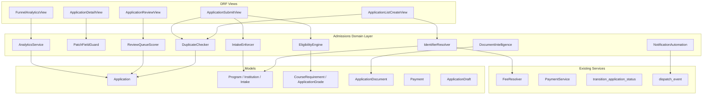

# Design Document: Admissions Logic Canonicalization

## Overview

This design resolves the 12 business logic gaps identified in the admissions audit by making every core rule canonical, backend-first, and explainable. The work is organized into four tiers:

- **P0 — Identifier Canonicalization** (Req 1–2): Fix the live FeeResolver program-code bug and normalize institution identifiers so that all downstream logic operates on consistent references.
- **P1 — Mutation Hardening** (Req 3–4): Lock the PATCH endpoint to draft-safe fields and add backend duplicate prevention so the state machine cannot be bypassed.
- **P2 — Rules & Readiness** (Req 5–8): Backend eligibility engine reading `course_requirements`, intake deadline/capacity enforcement, draft ownership consolidation, and payment vocabulary unification.
- **P3 — Intelligence & Automation** (Req 9–12): Document intelligence activation, notification automation, review queue prioritization, and live analytics.

All changes target existing tables. No new database tables are created. Where columns are needed, they are added to existing tables via SQL ALTER statements (models remain `managed=False`).

## Architecture

The design introduces a thin **Admissions Domain Layer** between the existing Django models and the DRF views. Each requirement maps to a focused service module that owns its business rules and produces `ExplainableRuleResult` responses.



### Key Design Decisions

1. **No new tables.** All state is stored in existing columns or new columns on existing tables. This avoids migration complexity with `managed=False` models.
2. **Backend-first rules.** Every blocking rule lives in the Django domain layer. The frontend becomes advisory.
3. **Explainable results.** Every rule evaluation returns a structured `ExplainableRuleResult` so the frontend can display why something passed or failed.
4. **Existing services preserved.** `FeeResolver`, `PaymentService`, `transition_application_status()`, and `dispatch_event()` are extended, not replaced.

## Components and Interfaces

### Component 1: IdentifierResolver (Req 1, 2)

Resolves program, institution, and intake identifiers from mixed name/code inputs to canonical forms.

```python
# backend/apps/applications/identifier_resolver.py

from dataclasses import dataclass
from apps.catalog.models import Institution, Intake, Program


@dataclass(frozen=True)
class ResolvedIdentifier:
    id: str          # UUID
    code: str        # e.g. "DRN"
    name: str        # e.g. "Diploma in Registered Nursing"
    source: str      # "name", "code", or "not_found"


class IdentifierResolver:
    """Resolves mixed name/code identifiers to canonical catalog records."""

    @staticmethod
    def resolve_program(value: str) -> ResolvedIdentifier:
        """Try name first, then code. Returns canonical name."""
        prog = Program.objects.filter(name=value, is_active=True).first()
        if prog:
            return ResolvedIdentifier(str(prog.id), prog.code, prog.name, "name")
        prog = Program.objects.filter(code=value, is_active=True).first()
        if prog:
            return ResolvedIdentifier(str(prog.id), prog.code, prog.name, "code")
        return ResolvedIdentifier("", "", value, "not_found")

    @staticmethod
    def resolve_institution(value: str) -> ResolvedIdentifier:
        """Try code first, then name, then full_name."""
        inst = Institution.objects.filter(code=value, is_active=True).first()
        if inst:
            return ResolvedIdentifier(str(inst.id), inst.code, inst.name, "code")
        inst = Institution.objects.filter(name=value, is_active=True).first()
        if inst:
            return ResolvedIdentifier(str(inst.id), inst.code, inst.name, "name")
        inst = Institution.objects.filter(full_name=value, is_active=True).first()
        if inst:
            return ResolvedIdentifier(str(inst.id), inst.code, inst.name, "full_name")
        return ResolvedIdentifier("", "", value, "not_found")

    @staticmethod
    def resolve_intake(value: str) -> ResolvedIdentifier:
        """Try name first, then by id string."""
        intake = Intake.objects.filter(name=value, is_active=True).first()
        if intake:
            return ResolvedIdentifier(str(intake.id), "", intake.name, "name")
        return ResolvedIdentifier("", "", value, "not_found")
```

**PaymentService fix (Req 1):** The `initiate_payment()` method is patched to resolve the program code via `IdentifierResolver.resolve_program()` before calling `FeeResolver.resolve_fee()`:

```python
# In PaymentService.initiate_payment():
from apps.applications.identifier_resolver import IdentifierResolver

application = Application.objects.get(id=application_id)
resolved = IdentifierResolver.resolve_program(application.program)
if resolved.source == "not_found":
    raise ValueError(f"Cannot resolve program '{application.program}' to a valid program code.")
fee = self._fee_resolver.resolve_fee(
    program_code=resolved.code,
    nationality=application.nationality,
    country=getattr(application, 'country', None),
)
```

**Serializer canonicalization (Req 2):** `ApplicationSerializer.validate_institution()` and `validate_program_intake_compatibility()` use `IdentifierResolver` to normalize inputs.

### Component 2: PatchFieldGuard (Req 3)

Controls which fields are writable via the PATCH endpoint based on application status and user role.

```python
# backend/apps/applications/patch_guard.py

DRAFT_SAFE_FIELDS = frozenset({
    "full_name", "nrc_number", "passport_number", "date_of_birth", "sex",
    "phone", "email", "residence_town", "nationality", "country",
    "address_line_1", "address_line_2", "postal_code",
    "next_of_kin_name", "next_of_kin_phone",
    "program", "intake", "institution", "additional_subjects",
    "result_slip_url", "extra_kyc_url",
})

LIFECYCLE_FIELDS = frozenset({
    "status", "payment_status", "eligibility_status", "eligibility_score",
    "eligibility_notes", "review_started_at", "decision_date", "reviewed_by",
    "admin_feedback", "admin_feedback_date", "admin_feedback_by",
})


def guard_patch_fields(data: dict, application_status: str, user_role: str) -> dict:
    """Filter PATCH payload to allowed fields.

    - Students: only DRAFT_SAFE_FIELDS when status == 'draft', else reject.
    - Admins: DRAFT_SAFE_FIELDS always, but never 'status' (use review endpoint).
    Returns filtered dict. Raises ValueError if student tries to edit non-draft.
    """
    if user_role in ("admin", "super_admin"):
        return {k: v for k, v in data.items() if k in DRAFT_SAFE_FIELDS}

    # Student path
    if application_status != "draft":
        raise ValueError("APPLICATION_NOT_EDITABLE")

    return {k: v for k, v in data.items() if k in DRAFT_SAFE_FIELDS}
```

### Component 3: DuplicateChecker (Req 4)

Backend duplicate prevention at both create and submit time.

```python
# backend/apps/applications/duplicate_checker.py

from dataclasses import dataclass
from typing import Optional
from apps.applications.models import Application

NON_TERMINAL_STATUSES = {"draft", "submitted", "under_review", "approved", "waitlisted"}
SUBMITTED_STATUSES = {"submitted", "under_review", "approved", "waitlisted"}


@dataclass(frozen=True)
class DuplicateCheckResult:
    has_duplicate: bool
    existing_id: Optional[str] = None
    existing_status: Optional[str] = None
    resume_url: Optional[str] = None


class DuplicateChecker:
    @staticmethod
    def check_at_create(user_id: str, program: str, intake: str) -> DuplicateCheckResult:
        """Check for non-terminal duplicates before creating a new application."""
        existing = Application.objects.filter(
            user_id=user_id, program=program, intake=intake,
            status__in=NON_TERMINAL_STATUSES,
        ).first()
        if existing:
            resume_url = f"/student/applications/{existing.id}"
            return DuplicateCheckResult(True, str(existing.id), existing.status, resume_url)
        return DuplicateCheckResult(False)

    @staticmethod
    def check_at_submit(user_id: str, program: str, intake: str, exclude_id: str) -> DuplicateCheckResult:
        """Check for submitted duplicates before submission."""
        existing = Application.objects.filter(
            user_id=user_id, program=program, intake=intake,
            status__in=SUBMITTED_STATUSES,
        ).exclude(id=exclude_id).first()
        if existing:
            return DuplicateCheckResult(True, str(existing.id), existing.status)
        return DuplicateCheckResult(False)
```


### Component 4: EligibilityEngine (Req 5)

Backend eligibility engine that reads `course_requirements` and evaluates student grades.

```python
# backend/apps/applications/eligibility_engine.py

from dataclasses import dataclass, field
from apps.catalog.models import CourseRequirement, Program
from apps.documents.models import ApplicationGrade


@dataclass(frozen=True)
class ExplainableRuleResult:
    rule_code: str
    severity: str          # "critical", "major", "minor"
    result: bool           # True = passed
    message: str
    blocking: bool
    source: str            # "course_requirements"
    recommended_action: str


@dataclass
class EligibilityResult:
    status: str            # "eligible", "not_eligible", "conditional", "under_review"
    score: int             # 0-100
    results: list[ExplainableRuleResult] = field(default_factory=list)
    missing_requirements: list[dict] = field(default_factory=list)
    recommendations: list[str] = field(default_factory=list)


class EligibilityEngine:
    """Evaluates student grades against CourseRequirement records."""

    def evaluate(self, application_id: str, program_name: str) -> EligibilityResult:
        from apps.applications.identifier_resolver import IdentifierResolver

        resolved = IdentifierResolver.resolve_program(program_name)
        if resolved.source == "not_found":
            return EligibilityResult(
                status="under_review", score=0,
                recommendations=["Program not found. Please consult the institution."],
            )

        requirements = CourseRequirement.objects.filter(
            program_id=resolved.id
        ).select_related("subject")

        if not requirements.exists():
            return EligibilityResult(
                status="under_review", score=0,
                recommendations=["No course requirements configured. Please consult the institution."],
            )

        grades = {
            str(g.subject_id): g.grade
            for g in ApplicationGrade.objects.filter(application_id=application_id)
        }

        results = []
        total_weight = 0
        weighted_score = 0

        for req in requirements:
            weight = float(req.weight or 1)
            total_weight += weight
            subject_name = req.subject.name if req.subject else "Unknown"
            student_grade = grades.get(str(req.subject_id))

            if student_grade is None:
                results.append(ExplainableRuleResult(
                    rule_code=f"REQ_{req.id}",
                    severity="critical" if req.is_mandatory else "minor",
                    result=False,
                    message=f"Missing grade for {subject_name}",
                    blocking=False,  # Advisory only
                    source="course_requirements",
                    recommended_action=f"Submit grade for {subject_name}",
                ))
                continue

            passed = student_grade <= req.minimum_grade
            if passed:
                weighted_score += weight
            results.append(ExplainableRuleResult(
                rule_code=f"REQ_{req.id}",
                severity="critical" if req.is_mandatory and not passed else "minor",
                result=passed,
                message=(
                    f"{subject_name}: Grade {student_grade} meets requirement (≤ {req.minimum_grade})"
                    if passed else
                    f"{subject_name}: Grade {student_grade} does not meet minimum grade {req.minimum_grade}"
                ),
                blocking=False,
                source="course_requirements",
                recommended_action="" if passed else f"Improve {subject_name} to grade {req.minimum_grade} or better",
            ))

        score = round((weighted_score / total_weight) * 100) if total_weight > 0 else 0
        mandatory_failed = [r for r in results if not r.result and r.severity == "critical"]
        optional_failed = [r for r in results if not r.result and r.severity == "minor"]

        if not mandatory_failed and not optional_failed:
            status = "eligible"
        elif not mandatory_failed and optional_failed:
            status = "conditional"
        else:
            status = "not_eligible"

        missing = [
            {"type": "grade", "description": r.message, "severity": r.severity, "suggestion": r.recommended_action}
            for r in results if not r.result
        ]

        return EligibilityResult(
            status=status, score=score, results=results,
            missing_requirements=missing,
            recommendations=[r.recommended_action for r in results if not r.result and r.recommended_action],
        )
```

### Component 5: IntakeEnforcer (Req 6)

Enforces intake deadlines and capacity at submission time.

```python
# backend/apps/applications/intake_enforcer.py

from dataclasses import dataclass
from datetime import date
from typing import Optional
from django.db.models import F
from apps.catalog.models import Intake, ProgramIntake


@dataclass(frozen=True)
class IntakeCheckResult:
    allowed: bool
    code: Optional[str] = None      # Error code if not allowed
    message: Optional[str] = None


class IntakeEnforcer:
    """Enforces intake deadline and capacity rules."""

    @staticmethod
    def check_submission(intake_name: str, program_name: str) -> IntakeCheckResult:
        """Check deadline and capacity for submission. Returns error if blocked."""
        from apps.applications.identifier_resolver import IdentifierResolver

        intake_resolved = IdentifierResolver.resolve_intake(intake_name)
        if intake_resolved.source == "not_found":
            return IntakeCheckResult(True)  # Skip enforcement if intake not found

        intake = Intake.objects.filter(id=intake_resolved.id).first()
        if not intake:
            return IntakeCheckResult(True)

        # Deadline check
        if intake.application_deadline and date.today() > intake.application_deadline:
            return IntakeCheckResult(
                False, "INTAKE_DEADLINE_PASSED",
                f"The application deadline ({intake.application_deadline.isoformat()}) has passed.",
            )

        # Capacity check
        if intake.max_capacity is not None and intake.current_enrollment is not None:
            if intake.current_enrollment >= intake.max_capacity:
                return IntakeCheckResult(False, "INTAKE_CAPACITY_REACHED",
                    "This intake has reached maximum capacity.")

        return IntakeCheckResult(True)

    @staticmethod
    def increment_enrollment(intake_name: str) -> None:
        """Atomically increment current_enrollment using F() expression."""
        from apps.applications.identifier_resolver import IdentifierResolver

        resolved = IdentifierResolver.resolve_intake(intake_name)
        if resolved.source != "not_found" and resolved.id:
            Intake.objects.filter(id=resolved.id).update(
                current_enrollment=F("current_enrollment") + 1
            )

    @staticmethod
    def get_warnings(intake_name: str) -> list[str]:
        """Return advisory warnings for draft creation (deadline near, capacity near)."""
        from apps.applications.identifier_resolver import IdentifierResolver

        warnings = []
        resolved = IdentifierResolver.resolve_intake(intake_name)
        if resolved.source == "not_found":
            return warnings

        intake = Intake.objects.filter(id=resolved.id).first()
        if not intake:
            return warnings

        if intake.application_deadline and date.today() > intake.application_deadline:
            warnings.append(f"Deadline ({intake.application_deadline.isoformat()}) has passed.")

        if (intake.max_capacity and intake.current_enrollment is not None
                and intake.current_enrollment >= intake.max_capacity * 0.9):
            pct = round(intake.current_enrollment / intake.max_capacity * 100)
            warnings.append(f"Intake is {pct}% full ({intake.current_enrollment}/{intake.max_capacity}).")

        return warnings
```

### Component 6: Payment Vocabulary Unification (Req 8)

Updates `PaymentService._update_application_payment_status()` to use canonical vocabulary and updates the frontend normalizer.

**Backend change:** In `payment_service.py`, change the mapping:
```python
# Current (broken):
#   'successful' → 'paid'
# New (canonical):
#   'successful' → 'verified'
#   'failed' → 'failed'

def _update_application_payment_status(self, application_id, status):
    # Map payment status to canonical application payment_status
    canonical_map = {'paid': 'verified', 'successful': 'verified', 'failed': 'failed'}
    canonical = canonical_map.get(status, status)
    Application.objects.filter(id=application_id).update(
        payment_status=canonical, updated_at=timezone.now(),
    )
```

**`submit_application()` update:** Accept `force_approved` as valid payment confirmation:
```python
has_payment = (
    application.payment_status in ("verified", "paid", "force_approved")
    or _application_has_completed_payment(application.id)
)
```

**Frontend `normalizePaymentStatus()` update:**
```typescript
export function normalizePaymentStatus(paymentStatus?: string | null): CanonicalPaymentStatus {
  switch (paymentStatus) {
    case 'pending':
    case 'pending_review':
      return 'pending_review'
    case 'verified':
    case 'paid':
    case 'successful':
    case 'force_approved':
      return 'verified'
    case 'failed':
    case 'rejected':
      return 'rejected'
    default:
      return 'not_paid'
  }
}
```

### Component 7: Draft Ownership Consolidation (Req 7)

The server-side `ApplicationDraft` becomes the single source of truth. Frontend changes:

1. **DraftManager** delegates all CRUD to the server-side draft API (`POST /api/v1/applications/drafts/`).
2. **localStorage** is used only as a resilience cache (written after successful server save).
3. **sessionStorage** is removed as a draft storage location.
4. On load: fetch server draft first → fall back to localStorage if server unreachable → prefer whichever has the more recent `updated_at`.
5. On submission: mark `ApplicationDraft.is_active = false` in `submit_application()`.

**Backend change in `submit_application()`:**
```python
# After successful submission, deactivate associated drafts
from apps.applications.models import ApplicationDraft
ApplicationDraft.objects.filter(
    user_id=changed_by, application_id=application.id
).update(is_active=False)
```

### Component 8: DocumentIntelligence (Req 9)

Parses `extracted_text` from `ApplicationDocument` records for identity consistency checks and completeness scoring.

```python
# backend/apps/applications/document_intelligence.py

import re
from dataclasses import dataclass
from difflib import SequenceMatcher


@dataclass(frozen=True)
class ConsistencyCheck:
    field: str
    extracted_value: str
    application_value: str
    match_score: float       # 0.0 - 1.0
    warning: str | None      # e.g. "name_mismatch"


@dataclass
class CompletenessResult:
    score: int               # 0-100
    document_score: int      # 0-100 (40% weight)
    consistency_score: int   # 0-100 (30% weight)
    grade_score: int         # 0-100 (30% weight)
    warnings: list[str]
    checks: list[ConsistencyCheck]


class DocumentIntelligence:
    """Extracts identity fields from document text and scores completeness."""

    REQUIRED_DOC_TYPES = {"nrc", "passport", "result_slip"}

    def compute_completeness(self, application) -> CompletenessResult:
        from apps.documents.models import ApplicationDocument, ApplicationGrade

        docs = ApplicationDocument.objects.filter(application_id=application.id)
        grades = ApplicationGrade.objects.filter(application_id=application.id)

        # Document score (40% weight)
        uploaded_types = set(docs.values_list("document_type", flat=True))
        doc_ratio = len(uploaded_types & self.REQUIRED_DOC_TYPES) / len(self.REQUIRED_DOC_TYPES)
        document_score = round(doc_ratio * 100)

        # Consistency score (30% weight)
        checks = []
        warnings = []
        for doc in docs:
            if doc.extracted_text:
                doc_checks = self._check_consistency(doc, application)
                checks.extend(doc_checks)
                for c in doc_checks:
                    if c.warning:
                        warnings.append(c.warning)

        consistency_score = 100
        if checks:
            avg_match = sum(c.match_score for c in checks) / len(checks)
            consistency_score = round(avg_match * 100)

        # Grade score (30% weight)
        grade_count = grades.count()
        grade_score = min(100, round((grade_count / 5) * 100))  # 5 subjects = 100%

        total = round(document_score * 0.4 + consistency_score * 0.3 + grade_score * 0.3)

        return CompletenessResult(
            score=total, document_score=document_score,
            consistency_score=consistency_score, grade_score=grade_score,
            warnings=warnings, checks=checks,
        )

    def _check_consistency(self, doc, application) -> list[ConsistencyCheck]:
        checks = []
        text = doc.extracted_text or ""

        # Name check
        if application.full_name:
            name_score = SequenceMatcher(None, text.lower(), application.full_name.lower()).ratio()
            warning = "name_mismatch" if name_score < 0.8 else None
            checks.append(ConsistencyCheck("full_name", text[:100], application.full_name, name_score, warning))

        # NRC check
        if application.nrc_number:
            nrc_pattern = re.escape(application.nrc_number)
            found = bool(re.search(nrc_pattern, text))
            checks.append(ConsistencyCheck(
                "nrc_number", "found" if found else "not_found",
                application.nrc_number, 1.0 if found else 0.0,
                None if found else "nrc_mismatch",
            ))

        return checks
```

### Component 9: NotificationAutomation (Req 10)

Celery periodic tasks that dispatch SSE events for deadline warnings, payment failures, and stale drafts.

```python
# backend/apps/applications/notification_tasks.py (Celery tasks)

from celery import shared_task
from django.utils import timezone
from datetime import timedelta
from apps.common.event_dispatcher import dispatch_event


@shared_task
def send_deadline_reminders():
    """Dispatch deadline warning SSE events for drafts approaching intake deadlines."""
    from apps.applications.models import Application
    from apps.catalog.models import Intake

    now = timezone.now().date()
    for days_ahead, urgency in [(7, "warning"), (1, "urgent")]:
        target_date = now + timedelta(days=days_ahead)
        intakes = Intake.objects.filter(
            application_deadline=target_date, is_active=True
        )
        for intake in intakes:
            drafts = Application.objects.filter(
                intake=intake.name, status="draft"
            ).values_list("user_id", "id")
            for user_id, app_id in drafts:
                dispatch_event(
                    user_id=user_id,
                    event_type="notification",
                    payload={
                        "type": f"deadline_{urgency}",
                        "message": f"Application deadline is {days_ahead} day(s) away ({target_date.isoformat()}).",
                        "application_id": str(app_id),
                    },
                    entity_id=app_id,
                )


@shared_task
def send_stale_draft_reminders():
    """Remind users with drafts older than 7 days with no updates."""
    from apps.applications.models import Application

    cutoff = timezone.now() - timedelta(days=7)
    stale = Application.objects.filter(
        status="draft", updated_at__lt=cutoff
    ).values_list("user_id", "id")
    for user_id, app_id in stale:
        dispatch_event(
            user_id=user_id,
            event_type="notification",
            payload={
                "type": "incomplete_draft_reminder",
                "message": "Your application draft has been inactive for over 7 days.",
                "application_id": str(app_id),
            },
            entity_id=app_id,
        )
```

### Component 10: ReviewQueueScorer (Req 11)

Computes a priority score for applications in review states.

```python
# backend/apps/applications/review_queue.py

from dataclasses import dataclass
from datetime import date
from django.utils import timezone


@dataclass(frozen=True)
class ReviewPriority:
    score: float             # 0-100
    classification: str      # "ready_for_decision", "waiting_for_student", "high_risk_review"


class ReviewQueueScorer:
    """Computes deterministic priority scores for review queue ordering."""

    def score(self, application, completeness_score: int, has_doc_warnings: bool) -> ReviewPriority:
        # Completeness (30%)
        c_score = min(completeness_score, 100) * 0.3

        # Deadline urgency (25%)
        d_score = self._deadline_urgency(application) * 0.25

        # Payment readiness (20%)
        p_score = (100 if application.payment_status in ("verified", "paid", "force_approved") else 0) * 0.2

        # Document confidence (15%)
        doc_score = (50 if has_doc_warnings else 100) * 0.15

        # Time in status (10%)
        t_score = self._time_score(application) * 0.1

        total = c_score + d_score + p_score + doc_score + t_score

        # Classification
        if completeness_score >= 90 and application.payment_status in ("verified", "paid", "force_approved"):
            classification = "ready_for_decision"
        elif has_doc_warnings:
            classification = "high_risk_review"
        else:
            classification = "waiting_for_student"

        return ReviewPriority(round(total, 1), classification)

    def _deadline_urgency(self, application) -> float:
        from apps.catalog.models import Intake
        intake = Intake.objects.filter(name=application.intake).first()
        if not intake or not intake.application_deadline:
            return 50
        days_left = (intake.application_deadline - date.today()).days
        if days_left <= 0:
            return 100
        if days_left <= 7:
            return 80
        return 50

    def _time_score(self, application) -> float:
        if not application.review_started_at:
            if application.submitted_at:
                days = (timezone.now() - application.submitted_at).days
                return min(100, days * 10)
        return 50
```

### Component 11: AnalyticsService (Req 12)

Replaces hardcoded sample data with live queries.

```python
# backend/apps/analytics/admissions_analytics.py

from django.db.models import Count, Q, Avg, F
from django.utils import timezone
from apps.applications.models import Application
from apps.documents.models import Payment


class AdmissionsAnalyticsService:
    """Computes live admissions metrics from Application and Payment data."""

    def funnel_metrics(self, filters: dict) -> dict:
        qs = Application.objects.all()
        qs = self._apply_filters(qs, filters)

        counts = qs.aggregate(
            drafts=Count("id", filter=Q(status="draft")),
            submitted=Count("id", filter=Q(status="submitted")),
            under_review=Count("id", filter=Q(status="under_review")),
            approved=Count("id", filter=Q(status="approved")),
            rejected=Count("id", filter=Q(status="rejected")),
            waitlisted=Count("id", filter=Q(status="waitlisted")),
        )

        total = sum(counts.values())
        submitted_plus = counts["submitted"] + counts["under_review"] + counts["approved"] + counts["rejected"] + counts["waitlisted"]

        return {
            **counts,
            "total": total,
            "draft_to_submission_rate": round(submitted_plus / total * 100, 1) if total else 0,
            "submission_to_approval_rate": round(counts["approved"] / submitted_plus * 100, 1) if submitted_plus else 0,
        }

    def timing_metrics(self, filters: dict) -> dict:
        qs = Application.objects.exclude(submitted_at=None)
        qs = self._apply_filters(qs, filters)
        return qs.aggregate(
            avg_draft_to_submit_days=Avg(F("submitted_at") - F("created_at")),
            avg_submit_to_review_days=Avg(F("review_started_at") - F("submitted_at")),
            avg_review_to_decision_days=Avg(F("decision_date") - F("review_started_at")),
        )

    def payment_metrics(self, filters: dict) -> dict:
        qs = Payment.objects.all()
        if filters.get("start_date"):
            qs = qs.filter(created_at__gte=filters["start_date"])
        if filters.get("end_date"):
            qs = qs.filter(created_at__lte=filters["end_date"])
        return qs.aggregate(
            initiated=Count("id"),
            successful=Count("id", filter=Q(status="successful")),
            failed=Count("id", filter=Q(status="failed")),
            pending=Count("id", filter=Q(status="pending")),
        )

    def _apply_filters(self, qs, filters):
        if filters.get("start_date"):
            qs = qs.filter(created_at__gte=filters["start_date"])
        if filters.get("end_date"):
            qs = qs.filter(created_at__lte=filters["end_date"])
        if filters.get("institution"):
            qs = qs.filter(institution__icontains=filters["institution"])
        if filters.get("program"):
            qs = qs.filter(program__icontains=filters["program"])
        return qs
```

## Data Models

No new tables are created. Changes to existing tables:

### Schema Changes (SQL ALTER statements)

None required for the core implementation. All data is stored in existing columns:

- `applications.eligibility_status` — already exists, used by EligibilityEngine
- `applications.eligibility_score` — already exists, repurposed for completeness score
- `applications.eligibility_notes` — already exists, stores JSON eligibility breakdown
- `applications.payment_status` — already exists, vocabulary unified to canonical set
- `application_documents.extracted_text` — already exists, activated by DocumentIntelligence
- `application_drafts.is_active` — already exists, set to false on submission
- `intakes.current_enrollment` — already exists, atomically incremented on submission
- `intakes.application_deadline` — already exists, enforced at submission time
- `intakes.max_capacity` — already exists, enforced at submission time

### ExplainableRuleResult Contract

All rule evaluations return this structure (serialized as JSON in API responses):

```python
{
    "rule_code": "REQ_<uuid>",
    "severity": "critical" | "major" | "minor",
    "result": True | False,
    "message": "Human-readable explanation",
    "blocking": True | False,
    "source": "course_requirements" | "intake_rules" | "duplicate_check",
    "recommended_action": "What the user should do"
}
```

### Canonical Payment Status Mapping

| Source | Value | Canonical `applications.payment_status` |
|--------|-------|----------------------------------------|
| PaymentService (successful) | `successful` | `verified` |
| PaymentService (failed) | `failed` | `failed` |
| Admin force-approve | — | `force_approved` |
| New application | — | `null` (maps to `not_paid`) |
| Lenco pending | `pending` | `pending` |


## Correctness Properties

*A property is a characteristic or behavior that should hold true across all valid executions of a system — essentially, a formal statement about what the system should do. Properties serve as the bridge between human-readable specifications and machine-verifiable correctness guarantees.*

### Property 1: Fee resolution round-trip consistency

*For any* Application with a program field that matches an active Program record by name, resolving the fee through `PaymentService.initiate_payment()` (name → code → FeeResolver) SHALL produce the same `ResolvedFee` as calling `FeeResolver.resolve_fee()` directly with the Program's `code`.

**Validates: Requirements 1.1, 1.2, 1.5**

### Property 2: Institution identifier canonicalization

*For any* institution value that is either a valid Institution `code`, `name`, or `full_name`, `IdentifierResolver.resolve_institution()` SHALL return a `ResolvedIdentifier` with `source != "not_found"` and `name` equal to the canonical `Institution.name`.

**Validates: Requirements 2.1, 2.5**

### Property 3: Program and intake identifier resolution

*For any* program value that is either a valid Program `name` or `code`, `IdentifierResolver.resolve_program()` SHALL return a `ResolvedIdentifier` with `source != "not_found"` and the correct `code` and `name`. The same holds for `IdentifierResolver.resolve_intake()` with intake names.

**Validates: Requirements 2.2, 2.3**

### Property 4: PATCH field guard strips lifecycle fields for students

*For any* PATCH payload containing a mix of draft-safe and lifecycle fields, and a student-role user with a draft application, `guard_patch_fields()` SHALL return a dict containing only keys from `DRAFT_SAFE_FIELDS` — no lifecycle field shall survive filtering.

**Validates: Requirements 3.1, 3.2**

### Property 5: PATCH rejects non-draft edits for students

*For any* Application with status not equal to `draft` and a student-role user, `guard_patch_fields()` SHALL raise a `ValueError` with code `APPLICATION_NOT_EDITABLE`.

**Validates: Requirements 3.3**

### Property 6: PATCH field guard for admins strips status but allows draft-safe fields

*For any* PATCH payload and an admin-role user, `guard_patch_fields()` SHALL return a dict containing only keys from `DRAFT_SAFE_FIELDS`, regardless of application status — `status` is never writable via PATCH.

**Validates: Requirements 3.4**

### Property 7: Duplicate prevention at create time

*For any* user, program, and intake combination where a non-terminal Application (status in `{draft, submitted, under_review, approved, waitlisted}`) already exists, `DuplicateChecker.check_at_create()` SHALL return `has_duplicate=True` with the existing application's ID and status.

**Validates: Requirements 4.1, 4.2**

### Property 8: Duplicate prevention at submit time

*For any* user, program, and intake combination where a submitted Application (status in `{submitted, under_review, approved, waitlisted}`) already exists, `DuplicateChecker.check_at_submit()` SHALL return `has_duplicate=True` for any other application by the same user for the same program and intake.

**Validates: Requirements 4.3, 4.4**

### Property 9: Eligibility status classification

*For any* set of `CourseRequirement` records and `ApplicationGrade` records, the `EligibilityEngine.evaluate()` SHALL return: `eligible` when all mandatory requirements are met, `not_eligible` when any mandatory requirement fails, and `conditional` when mandatory requirements pass but optional ones fail.

**Validates: Requirements 5.4, 5.5, 5.6**

### Property 10: Eligibility score is weighted sum

*For any* set of `CourseRequirement` records with weights and `ApplicationGrade` records, the `EligibilityEngine.evaluate()` score SHALL equal `round((sum of weights for passed requirements / total weight) * 100)`.

**Validates: Requirements 5.2, 5.3**

### Property 11: Eligibility evaluation is idempotent

*For any* application ID and program name, calling `EligibilityEngine.evaluate()` twice with the same inputs SHALL produce identical `EligibilityResult` objects (same status, score, results list, and recommendations).

**Validates: Requirements 5.8**

### Property 12: Intake deadline enforcement

*For any* intake with a non-null `application_deadline` that is in the past, `IntakeEnforcer.check_submission()` SHALL return `allowed=False` with code `INTAKE_DEADLINE_PASSED`.

**Validates: Requirements 6.1, 6.2**

### Property 13: Intake capacity enforcement

*For any* intake where `current_enrollment >= max_capacity` (and `max_capacity` is not null), `IntakeEnforcer.check_submission()` SHALL return `allowed=False` with code `INTAKE_CAPACITY_REACHED`.

**Validates: Requirements 6.3, 6.4**

### Property 14: Enrollment increment on submission

*For any* successful application submission, the associated Intake's `current_enrollment` SHALL increase by exactly 1.

**Validates: Requirements 6.5**

### Property 15: Draft conflict resolution by timestamp

*For any* two draft records (server-side and localStorage) with different `updated_at` timestamps, the frontend draft resolution logic SHALL prefer the record with the more recent `updated_at`.

**Validates: Requirements 7.5**

### Property 16: Draft deactivation on submission

*For any* Application that transitions from `draft` to `submitted`, all associated `ApplicationDraft` records SHALL have `is_active` set to `false`.

**Validates: Requirements 7.7**

### Property 17: Payment status canonical mapping

*For any* Payment that transitions to `successful`, the associated Application's `payment_status` SHALL be set to `verified`. For any Payment that transitions to `failed`, the Application's `payment_status` SHALL be set to `failed`.

**Validates: Requirements 8.2, 8.3**

### Property 18: Frontend payment status normalization

*For any* canonical payment status value in `{not_paid, pending, successful, failed, verified, rejected, force_approved, null}`, `normalizePaymentStatus()` SHALL map it to the correct display status: `verified`/`force_approved` → `verified`; `pending` → `pending_review`; `failed`/`rejected` → `rejected`; `not_paid`/`null` → `not_paid`.

**Validates: Requirements 8.5**

### Property 19: Submission accepts canonical payment confirmations

*For any* Application with `payment_status` in `{verified, paid, force_approved}`, `submit_application()` SHALL not raise `PAYMENT_REQUIRED`.

**Validates: Requirements 8.6**

### Property 20: Document consistency scoring

*For any* `ApplicationDocument` with non-empty `extracted_text` and an associated Application, `DocumentIntelligence._check_consistency()` SHALL produce a `name_mismatch` warning when the fuzzy match score between extracted text and `full_name` is below 0.8, and an `nrc_mismatch` warning when the NRC number is not found in the extracted text.

**Validates: Requirements 9.1, 9.2, 9.3, 9.4**

### Property 21: Completeness score formula

*For any* Application, the `CompletenessResult.score` SHALL equal `round(document_score * 0.4 + consistency_score * 0.3 + grade_score * 0.3)` where each component is independently computed.

**Validates: Requirements 9.5**

### Property 22: Status change event dispatch

*For any* Application that transitions to `approved` or `rejected`, the `dispatch_event()` function SHALL be called with `event_type="application_update"` and the Application owner's user ID.

**Validates: Requirements 10.3, 10.6**

### Property 23: Notification deduplication

*For any* notification type and Application, the notification automation service SHALL dispatch at most one SSE event per 24-hour period — a second dispatch within the same window SHALL be a no-op.

**Validates: Requirements 10.8**

### Property 24: Review queue priority score and classification

*For any* Application with status in `{submitted, under_review}`, the `ReviewQueueScorer.score()` SHALL produce a deterministic priority score following the weighted formula (completeness 30%, deadline urgency 25%, payment readiness 20%, document confidence 15%, time in status 10%) and classify as `ready_for_decision` when completeness ≥ 90% and payment is verified, `high_risk_review` when document warnings exist, and `waiting_for_student` otherwise.

**Validates: Requirements 11.1, 11.2, 11.3, 11.4, 11.7**

### Property 25: Review queue sort order

*For any* set of Applications sorted by `priority`, the resulting list SHALL be ordered by priority score descending — each application's score SHALL be ≥ the next application's score.

**Validates: Requirements 11.6**

### Property 26: Analytics funnel counts match data

*For any* set of Application records, the `AdmissionsAnalyticsService.funnel_metrics()` counts SHALL equal the actual count of applications in each status.

**Validates: Requirements 12.1, 12.2**

### Property 27: Analytics date range filtering

*For any* date range filter (`start_date`, `end_date`), the analytics service SHALL only count Applications with `created_at` within that range. Similarly, institution and program filters SHALL only count matching records.

**Validates: Requirements 12.6, 12.7**

## Error Handling

### Error Response Contract

All business rule violations return structured error responses:

```json
{
  "success": false,
  "error": "Human-readable message",
  "code": "MACHINE_READABLE_CODE",
  "details": { /* optional structured data */ }
}
```

### Error Codes by Component

| Component | Code | HTTP Status | Trigger |
|-----------|------|-------------|---------|
| IdentifierResolver | `INVALID_PROGRAM` | 400 | Program name/code not found |
| IdentifierResolver | `INVALID_INSTITUTION` | 400 | Institution name/code not found |
| PatchFieldGuard | `APPLICATION_NOT_EDITABLE` | 403 | Student edits non-draft application |
| DuplicateChecker | `DUPLICATE_APPLICATION` | 409 | Non-terminal duplicate at create |
| DuplicateChecker | `DUPLICATE_SUBMITTED_APPLICATION` | 409 | Submitted duplicate at submit |
| IntakeEnforcer | `INTAKE_DEADLINE_PASSED` | 400 | Submission after deadline |
| IntakeEnforcer | `INTAKE_CAPACITY_REACHED` | 400 | Submission when intake is full |
| EligibilityEngine | — | — | Never blocks (advisory only) |
| PaymentService | `PROGRAM_NOT_RESOLVED` | 400 | Program code resolution fails |

### Graceful Degradation

- **EligibilityEngine:** If `course_requirements` has no rows for a program, returns `under_review` status with a recommendation. Never blocks submission.
- **IntakeEnforcer:** If intake cannot be resolved, skips enforcement (fail-open for deadline/capacity). Logs a warning.
- **DocumentIntelligence:** If `extracted_text` is empty, skips identity checks and reduces consistency weight proportionally.
- **NotificationAutomation:** If `dispatch_event()` fails, logs the error and continues. Notifications are best-effort.
- **AnalyticsService:** If queries fail, returns cached data (5-minute cache). If no cache, returns empty metrics with an error flag.
- **ReviewQueueScorer:** If completeness score cannot be computed, uses 0 as default. Priority computation never fails.

### Transaction Boundaries

- **Payment status sync (Req 8.7):** Application `payment_status` and Payment `status` are updated within the same `transaction.atomic()` block in `PaymentService._update_payment_status()`.
- **Enrollment increment (Req 6.5):** `IntakeEnforcer.increment_enrollment()` uses `F()` expressions within the submission transaction.
- **Duplicate check at submit (Req 4.3):** Uses `SELECT FOR UPDATE` on the application row within `submit_application()`'s existing atomic block.

## Testing Strategy

### Property-Based Testing (Backend — Hypothesis)

Each correctness property maps to a single Hypothesis property test in `backend/tests/property/test_admissions_canonicalization.py`. Tests use `@given` decorators with custom strategies for generating:

- Random program names/codes from the catalog
- Random institution names/codes (including mixed forms)
- Random PATCH payloads with mixed draft-safe and lifecycle fields
- Random grade sets against course requirement configurations
- Random intake states (deadline past/future, capacity full/available)
- Random payment status values from the canonical vocabulary
- Random document extracted text with varying similarity to application fields

Configuration:
- Minimum 100 examples per property (`@settings(max_examples=100)`)
- Each test tagged with: `# Feature: admissions-logic-canonicalization, Property N: <title>`

### Property-Based Testing (Frontend — fast-check)

Frontend properties are tested in `apps/admissions/tests/property/admissions-logic-canonicalization.test.tsx`:

- Property 15 (draft conflict resolution by timestamp)
- Property 18 (payment status normalization)

Configuration:
- Minimum 100 runs per property (`fc.assert(..., { numRuns: 100 })`)
- Each test tagged with: `// Feature: admissions-logic-canonicalization, Property N: <title>`

### Unit Tests

Unit tests complement property tests for specific examples and edge cases:

**Backend (`backend/tests/unit/`):**
- IdentifierResolver: specific known program/institution lookups, not-found cases
- PatchFieldGuard: specific payloads with known fields, role/status combinations
- DuplicateChecker: specific duplicate scenarios with known application states
- EligibilityEngine: specific grade sets against known course requirements, empty requirements edge case
- IntakeEnforcer: null deadline, null capacity, exact capacity boundary
- PaymentService: program code resolution failure, fee resolution with known programs
- NotificationAutomation: deduplication within 24-hour window
- AnalyticsService: empty dataset, single application, date range boundaries

**Frontend (`apps/admissions/tests/unit/`):**
- normalizePaymentStatus: each canonical value mapped correctly
- Draft conflict resolution: server newer, local newer, equal timestamps

### Integration Points

- `PaymentService.initiate_payment()` → `IdentifierResolver.resolve_program()` → `FeeResolver.resolve_fee()`
- `ApplicationListCreateView.post()` → `DuplicateChecker.check_at_create()`
- `submit_application()` → `DuplicateChecker.check_at_submit()` → `IntakeEnforcer.check_submission()` → `IntakeEnforcer.increment_enrollment()`
- `ApplicationDetailView.patch()` → `guard_patch_fields()`
- `ApplicationReviewView.post()` → `ReviewQueueScorer.score()`
- `FunnelAnalyticsView.get()` → `AdmissionsAnalyticsService.funnel_metrics()`
