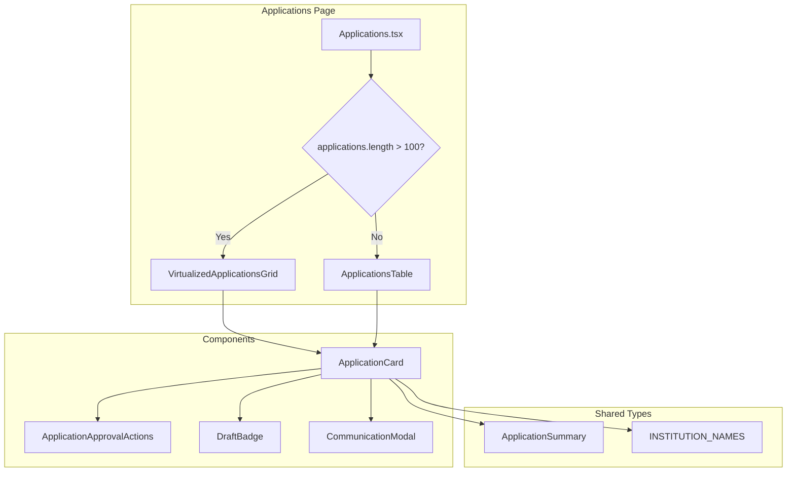

# Design Document: ApplicationCard Extraction

## Overview

This design document outlines the extraction of the ApplicationCard component from ApplicationsTable.tsx into a standalone, optimized component. The refactoring improves code organization, enables better performance through React.memo, and fixes the empty virtualized grid issue in the Applications page.

The key changes include:
1. Creating a new ApplicationCard.tsx file with the component and related types
2. Internalizing badge rendering logic to reduce prop drilling
3. Updating ApplicationsTable to use the extracted component
4. Fixing VirtualizedApplicationsGrid to properly render ApplicationCard
5. Adding responsive column support and proper typing

## Architecture



## Components and Interfaces

### ApplicationCard Component

The ApplicationCard component will be a memoized functional component that renders a single application's summary information.

```typescript
// src/components/admin/applications/ApplicationCard.tsx

interface ApplicationCardProps {
  application: ApplicationSummary
  onStatusUpdate: (id: string, status: string) => void | Promise<void>
  onPaymentStatusUpdate: (id: string, status: string) => void | Promise<void>
  onViewDetails: (id: string) => void
  updatingStatus: boolean
  updatingPayment: boolean
  isSelected?: boolean
  onSelect?: (id: string, selected: boolean) => void
}

export const ApplicationCard = React.memo<ApplicationCardProps>(({
  application,
  onStatusUpdate,
  onPaymentStatusUpdate,
  onViewDetails,
  updatingStatus,
  updatingPayment,
  isSelected = false,
  onSelect
}) => {
  // Internal badge functions
  const getStatusBadge = useCallback((status: string) => { ... }, [])
  const getPaymentBadge = useCallback((paymentStatus: string) => { ... }, [])
  
  // Component implementation
})
```

### VirtualizedApplicationsGrid Updates

The VirtualizedApplicationsGrid will be updated to:
1. Accept properly typed props
2. Support responsive column counts
3. Pass all required handlers to ApplicationCard

```typescript
// src/components/admin/applications/VirtualizedApplicationsGrid.tsx

interface VirtualizedApplicationsGridProps {
  applications: ApplicationSummary[]
  onStatusUpdate: (id: string, status: string) => void | Promise<void>
  onPaymentStatusUpdate: (id: string, status: string) => void | Promise<void>
  onViewDetails: (id: string) => void
  updatingStatusId: string | null
  updatingPaymentId: string | null
  selectedIds?: string[]
  onSelectionChange?: (ids: string[]) => void
}
```

### ApplicationsTable Updates

ApplicationsTable will be simplified to import and use the extracted ApplicationCard:

```typescript
// src/components/admin/applications/ApplicationsTable.tsx

import { ApplicationCard, ApplicationSummary, INSTITUTION_NAMES } from './ApplicationCard'

// Remove local ApplicationCard definition
// Remove local getStatusBadge and getPaymentBadge functions
// Use imported ApplicationCard in render
```

## Data Models

### ApplicationSummary Interface

```typescript
export interface ApplicationSummary {
  id: string
  application_number: string
  full_name: string
  email: string
  phone: string
  program: string
  intake: string
  institution: string
  status: string
  payment_status: string
  payment_verified_at: string | null
  payment_verified_by: string | null
  payment_verified_by_name: string | null
  payment_verified_by_email: string | null
  last_payment_audit_id: number | null
  last_payment_audit_at: string | null
  last_payment_audit_by_name: string | null
  last_payment_audit_by_email: string | null
  last_payment_audit_notes: string | null
  last_payment_reference: string | null
  application_fee: number
  paid_amount: number
  submitted_at: string
  created_at: string
  result_slip_url: string
  extra_kyc_url: string
  pop_url: string
  grades_summary: string
  total_subjects: number
  points: number
  days_since_submission: number
  // Draft-specific fields
  isDraft: boolean
  completionPercentage: number
  lastUpdated: string
}
```

### INSTITUTION_NAMES Mapping

```typescript
export const INSTITUTION_NAMES: Record<string, string> = {
  'KATC': 'Kalulushi Training Centre',
  'katc': 'Kalulushi Training Centre',
  'MIHAS': 'Mukuba Institute of Health and Allied Sciences',
  'mihas': 'Mukuba Institute of Health and Allied Sciences'
}

export const getInstitutionName = (code?: string): string => {
  if (!code) return 'Not specified'
  return INSTITUTION_NAMES[code] || code
}
```

## Correctness Properties

*A property is a characteristic or behavior that should hold true across all valid executions of a system—essentially, a formal statement about what the system should do. Properties serve as the bridge between human-readable specifications and machine-verifiable correctness guarantees.*

### Property 1: Badge Rendering Consistency

*For any* application status value (draft, submitted, under_review, approved, rejected), the getStatusBadge function SHALL render a badge with the correct color scheme and icon corresponding to that status.

**Validates: Requirements 2.4**

### Property 2: Virtualized Grid Rendering

*For any* list of applications with length greater than 100, the VirtualizedApplicationsGrid SHALL render ApplicationCard components that display all required information (full_name, application_number, status, payment_status, program, institution).

**Validates: Requirements 4.6**

### Property 3: Handler Propagation

*For any* ApplicationCard rendered within VirtualizedApplicationsGrid, calling onStatusUpdate, onPaymentStatusUpdate, or onViewDetails SHALL invoke the corresponding handler passed to the grid with the correct application ID.

**Validates: Requirements 4.4**

### Property 4: Responsive Column Layout

*For any* viewport width, the VirtualizedApplicationsGrid SHALL display the appropriate number of columns: 1 column for mobile (<768px), 2 columns for tablet (768px-1279px), 3 columns for desktop (≥1280px).

**Validates: Requirements 5.4**

## Error Handling

### Component Error Boundaries

- ApplicationCard should gracefully handle missing or malformed data
- Default values should be provided for optional fields
- Sanitization should be applied to user-generated content (grades_summary)

### Loading States

- Individual cards show loading overlay when updating status or payment
- VirtualizedApplicationsGrid maintains scroll position during updates
- Skeleton loading states for initial data fetch

### Edge Cases

- Empty applications array: Display "No applications found" message
- Missing institution code: Display "Not specified"
- Missing dates: Use created_at as fallback for submitted_at
- Zero points: Don't display points section

## Testing Strategy

### Unit Tests

Unit tests will verify specific examples and edge cases:

1. **ApplicationCard rendering**
   - Renders all required fields correctly
   - Handles missing optional fields gracefully
   - Displays correct badge colors for each status

2. **Badge functions**
   - Returns correct JSX for each status value
   - Handles unknown status values gracefully

3. **Institution name mapping**
   - Returns correct name for known codes
   - Returns code itself for unknown codes
   - Returns "Not specified" for undefined/null

### Property-Based Tests

Property-based tests will verify universal properties across all inputs using fast-check:

1. **Badge rendering property** (Property 1)
   - Generate random status values from valid set
   - Verify badge contains correct icon and color class

2. **Grid rendering property** (Property 2)
   - Generate lists of 101+ random ApplicationSummary objects
   - Verify all cards render with required information

3. **Handler propagation property** (Property 3)
   - Generate random application IDs
   - Verify handlers are called with correct IDs

4. **Responsive layout property** (Property 4)
   - Generate random viewport widths
   - Verify column count matches expected value

### Integration Tests

- Full Applications page renders correctly with >100 applications
- Status updates propagate through virtualized grid
- Selection state maintained during scroll

### Test Configuration

- Property tests: minimum 100 iterations per property
- Test framework: Vitest for unit tests, Playwright for integration
- Property testing library: fast-check
- Each property test tagged with: **Feature: application-card-extraction, Property {N}: {description}**
