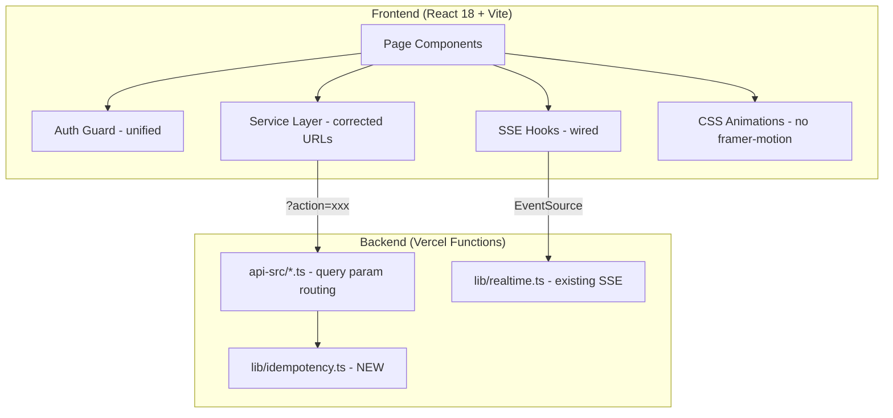

# Design Document: Audit Issue Remediation

## Overview

This design addresses the 7 priority areas identified by the forensic audit of the MIHAS Application System. The remediation is structured as a phased approach: first reduce bundle size and remove dead code (the largest impact for users on 3G), then fix API contracts, harden page quality, unify auth, add notification idempotency, and wire SSE features.

The core principle is: every change must be safe for production. Students may have in-progress applications, so backward compatibility and graceful degradation are non-negotiable.

## Architecture

The remediation does not introduce new architectural layers. It corrects existing wiring, removes dead weight, and fills gaps in the current architecture:



### Phase Execution Order

1. **Performance**: Remove framer-motion from 98 files, replace with CSS/Tailwind. Remove unused dependencies. Target: bundle < 500KB.
2. **Dead Code**: Delete legacy Supabase/Cloudflare files, unused services, commented-out blocks, unused exports.
3. **Contract Fixes**: Rewrite frontend service URLs from path-based to query-parameter routing. Remove dead frontend services that call non-existent endpoints.
4. **Page Quality**: Add auth guards, error boundaries, loading states, cleanup patterns, and responsive breakpoints to 42 critical pages.
5. **Auth Unification**: Consolidate `AuthContext` + `useAuthStore` into a single Zustand store as the source of truth.
6. **Notification Idempotency**: Create `lib/idempotency.ts` with key generation, deduplication, and retry logic for email dispatch.
7. **SSE Wiring**: Connect the 6 unwired SSE event types to frontend hooks and page components.

## Components and Interfaces

### 1. Animation Replacement Module

Replaces all `framer-motion` usage with CSS transitions and Tailwind utility classes.

**Strategy**: For each of the 98 files importing framer-motion:
- `motion.div` with `initial`/`animate` → `div` with Tailwind `animate-*` or CSS `transition` classes
- `AnimatePresence` → conditional rendering with CSS `transition` + `opacity`/`transform`
- `useReducedMotion` → CSS `@media (prefers-reduced-motion: reduce)`
- Complex orchestrated animations → CSS `@keyframes` with `animation-delay`

**Shared animation utilities** (`src/lib/animations.ts`):
```typescript
// Reusable CSS class sets for common animation patterns
export const fadeIn = 'transition-opacity duration-300 ease-out';
export const slideUp = 'transition-all duration-300 ease-out transform';
export const staggerChild = (index: number) =>
  `animation-delay: ${index * 50}ms`;
```

**Tailwind config additions** (`tailwind.config.js`):
```javascript
// Add custom animations to replace framer-motion patterns
animation: {
  'fade-in': 'fadeIn 300ms ease-out',
  'slide-up': 'slideUp 300ms ease-out',
  'scale-in': 'scaleIn 200ms ease-out',
}
```

### 2. Dead Code Removal

**Files to delete entirely** (identified as unused by audit):
- `src/services/backupRecovery.ts`
- `src/services/databaseOptimization.ts`
- `src/services/systemMonitoring.ts`
- `src/services/performanceAlerting.ts`
- `src/services/consents.ts`
- `src/services/pushSubscriptions.ts`
- `src/services/communicationService.ts`
- `src/lib/workflowAutomation.ts`
- `src/analysis/integration/SystemIntegrator.ts`
- `src/lib/supabase.ts` (legacy)
- `supabase/functions/send-email/index.ts` (legacy)
- Any file with only Supabase/Cloudflare imports

**Cleanup pattern**: For each file, verify no live imports exist before deletion. Use the build system as the final check — if it builds, the deletion is safe.

### 3. Frontend Service Layer Correction

The root cause of 70 MISSING_ENDPOINT mismatches: the frontend `apiClient.request()` constructs URLs like `/api/catalog/programs`, but the backend uses query-parameter routing (`/api/catalog?type=programs`).

**Before** (broken):
```typescript
// src/services/catalog.ts
apiClient.request('/catalog/programs')
// → GET /api/catalog/programs → 404
```

**After** (correct):
```typescript
// src/services/catalog.ts
apiClient.request('/catalog?type=programs')
// → GET /api/catalog?type=programs → 200
```

**Service files requiring URL rewrites**:
- `src/services/catalog.ts`: `/catalog/programs` → `/catalog?type=programs`
- `src/services/admin/dashboard.ts`: `/admin/dashboard` → `/admin?action=dashboard`
- `src/services/admin/users.ts`: `/admin/users` → `/admin?action=users`
- `src/services/applications.ts`: `/applications/DYNAMIC` → `/applications?action=xxx&id=DYNAMIC`
- `src/services/auth.ts`: `/auth/register` → `/auth?action=register`
- `src/services/documents.ts`: `/documents/upload` → `/documents?action=upload`
- `src/services/notifications.ts`: `/notifications/send` → `/notifications?action=send`
- `src/services/interviews.ts`: `/interview/schedule` → needs backend endpoint or removal

**Services to delete** (call endpoints that should not exist):
- `src/services/pushSubscriptions.ts` (push-subscriptions endpoint doesn't exist)
- `src/services/consents.ts` (user-consents endpoint doesn't exist)
- `src/services/systemMonitoring.ts` (monitoring endpoints don't exist)
- `src/services/databaseOptimization.ts` (monitoring endpoints don't exist)
- `src/services/performanceAlerting.ts` (monitoring endpoints don't exist)
- `src/services/backupRecovery.ts` (notifications/send from backup context)

**Auth mismatch fix**: `src/services/pushNotificationManager.ts` line 527 calls `/api/notifications?action=push-subscribe` without credentials. Fix: add `credentials: 'include'` to the fetch call.

### 4. Page Quality Hardening

**Auth guard pattern** (applied to all 38 pages missing auth checks):

```typescript
// For admin pages
import { useAuth } from '@/contexts/AuthContext';
import { Navigate } from 'react-router-dom';

export function AdminPage() {
  const { user, loading, isAdmin } = useAuth();
  
  if (loading) return <LoadingSpinner />;
  if (!user) return <Navigate to="/auth/signin" replace />;
  if (!isAdmin) return <Navigate to="/dashboard" replace />;
  
  return <>{/* page content */}</>;
}
```

**Error handling pattern** (applied to 31 pages with gaps):
```typescript
// Wrap async data fetching with try/catch and error state
const [error, setError] = useState<string | null>(null);

useEffect(() => {
  let cancelled = false;
  async function fetchData() {
    try {
      setLoading(true);
      const data = await service.getData();
      if (!cancelled) setData(data);
    } catch (err) {
      if (!cancelled) setError('Failed to load data. Please try again.');
    } finally {
      if (!cancelled) setLoading(false);
    }
  }
  fetchData();
  return () => { cancelled = true; };
}, []);
```

**Race condition fix** (applied to 24 pages): Add cleanup flags (`let cancelled = false`) in `useEffect` async callbacks to prevent state updates on unmounted components.

**Mobile responsiveness** (applied to 16 pages): Add Tailwind responsive breakpoints (`sm:`, `md:`, `lg:`) to layout containers.

### 5. Auth State Unification

Currently auth state is fragmented across:
- `AuthContext` (React Context + `useOptimizedAuthState` hook)
- `useAuthStore` (Zustand store in `src/stores/authStore.ts`)
- `useSessionListener` (hook managing sign-in/sign-out actions)

**Unification approach**: Make `useAuthStore` (Zustand) the single source of truth. `AuthContext` becomes a thin wrapper that reads from the Zustand store and provides the same interface for backward compatibility.

```typescript
// Unified flow:
// 1. Login → useSessionListener calls API → updates useAuthStore
// 2. AuthContext reads from useAuthStore (no duplicate state)
// 3. All components use useAuth() which reads from AuthContext
// 4. Token refresh handled in useAuthStore middleware
```

### 6. Idempotency Service

New file: `lib/idempotency.ts`

```typescript
interface IdempotencyConfig {
  /** TTL for idempotency keys in seconds (default: 3600 = 1 hour) */
  ttlSeconds?: number;
  /** Maximum retry attempts (default: 3) */
  maxRetries?: number;
  /** Initial retry delay in ms (default: 1000) */
  initialRetryDelay?: number;
}

interface IdempotencyService {
  /** Generate a deterministic idempotency key */
  generateKey(userId: string, eventType: string, contentHash: string): string;
  /** Check if a key has already been processed */
  isDuplicate(key: string): Promise<boolean>;
  /** Record a key as processed */
  record(key: string): Promise<void>;
  /** Execute with retry and deduplication */
  executeWithRetry<T>(
    key: string,
    fn: () => Promise<T>,
    config?: IdempotencyConfig
  ): Promise<T>;
}
```

**Storage**: Uses a Neon Postgres table `notification_idempotency_keys` with columns `(key TEXT PRIMARY KEY, created_at TIMESTAMPTZ, expires_at TIMESTAMPTZ)`. A simple `INSERT ... ON CONFLICT DO NOTHING` pattern handles deduplication.

**Client-side deduplication**: The SSE client tracks received event IDs in a `Set` (capped at 1000 entries) to skip duplicate events.

### 7. SSE Feature Wiring

The backend already emits 6 event types via `lib/realtime.ts`. The frontend `useRealtime` hook already subscribes to all event types. The gap is that no page components actually consume these events.

**Wiring plan**:
- `application_update` → `src/pages/student/ApplicationStatus.tsx`, `src/pages/student/Dashboard.tsx`
- `payment_update` → `src/pages/student/Payment.tsx`
- `document_processed` → `src/pages/student/applicationWizard/steps/SubmitStep.tsx`
- `interview_scheduled` → `src/pages/student/Interview.tsx`
- `notification` → `src/components/student/NotificationBell.tsx`

Each page will use the existing `useRealtimeEvent` hook:
```typescript
useRealtimeEvent('application_update', (data) => {
  // Invalidate React Query cache to refetch fresh data
  queryClient.invalidateQueries({ queryKey: ['application', data.applicationId] });
});
```

## Data Models

### Notification Idempotency Table

```sql
CREATE TABLE IF NOT EXISTS notification_idempotency_keys (
  key TEXT PRIMARY KEY,
  created_at TIMESTAMPTZ NOT NULL DEFAULT NOW(),
  expires_at TIMESTAMPTZ NOT NULL
);

-- Auto-cleanup expired keys
CREATE INDEX idx_idempotency_expires ON notification_idempotency_keys (expires_at);
```

### No other data model changes

All other remediation work modifies frontend code only. No database schema changes beyond the idempotency table.

