# Design Document: Audit Remediation

## Overview

This design addresses all 26 requirements from the MIHAS Full-Stack Audit Report remediation spec. The audit identified 8 critical, 28 warning, and 25 note findings across security, database, backend/API, frontend, performance, accessibility, and code quality.

The design is organized by sprint priority:
- **Sprint 1 (R1–R6):** Detailed implementation — data integrity and security vulnerabilities
- **Sprint 2 (R7–R15):** Moderate detail — validation gaps, performance, hardening
- **Sprint 3 (R16–R26):** Light design — documentation, accessibility, polish

All changes must be backward-compatible, production-safe, and preserve existing functionality for the live portal at apply.mihas.edu.zm.

## Architecture

### Affected Components

```mermaid
graph TD
    subgraph "Sprint 1 — Critical"
        DB["lib/db.ts"] -->|R1: Transaction API| NEON["@neondatabase/serverless"]
        AR["src/components/AdminRoute.tsx"] -->|R2: Remove bypass| RBAC["lib/auth/permissions.ts"]
        AUTH["api-src/auth.ts"] -->|R3: Parameterize SQL| DB
        HEALTH["api-src/health.ts"] -->|R4: Auth gate| MW["lib/auth/middleware.ts"]
        ARCJET["lib/arcjet.ts"] -->|R5: Fail-closed| ENV["process.env"]
        DB -->|R6: Delete dead code| QUERIES["lib/queries.ts"]
    end

    subgraph "Sprint 2 — High"
        DOCS["api-src/documents.ts"] -->|R7: Zod schema| VAL["lib/validation/"]
        APPS["api-src/applications.ts"] -->|R8,R11: Method + action guard| MW
        DB -->|R9: Cache connection| NEON
        MIG["migrations/"] -->|R10: Add indexes| NEON
        ARCJET -->|R12: Documents rate limit| DOCS
        ADMIN["api-src/admin.ts"] -->|R13: Column allowlist| DB
        AUTH -->|R14: Fixed SET clauses| DB
        VITE["vite.config.ts"] -->|R15: Bundle split| SW["service-worker"]
    end

    subgraph "Sprint 3 — Medium"
        STEERING["steering docs"] -->|R16: Rate limit docs| ARCJET
        AUTH -->|R17: CSRF on refresh| CSRF["lib/csrf.ts"]
        COOKIES["lib/auth/cookies.ts"] -->|R18: JSDoc fix| COOKIES
        VERCEL["vercel.json"] -->|R19: CSP + headers| VERCEL
        HEALTH -->|R20: Single query| DB
        ADMIN -->|R21: Migrate audit| DB
        VITE -->|R22: Console strip verify| VITE
        ACTX["src/contexts/AuthContext.tsx"] -->|R23: useMemo deps| ACTX
        FORMS["src/components/forms/"] -->|R24: ARIA live| FORMS
        ROUTER["src/routes/"] -->|R25: Focus mgmt| ROUTER
        HEALTH -->|R26: TS errors| HEALTH
    end
```



### Design Principles

1. **Minimal blast radius** — each fix is scoped to the smallest possible change surface
2. **No behavioral regressions** — all existing API contracts and response shapes preserved
3. **Rollback-safe** — database migrations use `IF NOT EXISTS`, code changes are independently revertable
4. **Production-first** — changes tested against the Neon serverless HTTP driver's actual behavior

## Components and Interfaces

### Sprint 1 — Detailed Implementation

#### R1: Neon Transaction API (`lib/db.ts`)

**Problem:** The current `transaction()` function issues `BEGIN`/`COMMIT`/`ROLLBACK` as separate HTTP calls via the Neon serverless driver. Each `sql.query()` call may hit a different connection, so the transaction is not actually atomic.

**Solution:** Replace the manual `BEGIN`/`COMMIT`/`ROLLBACK` pattern with Neon's `neon().transaction()` callback API, which guarantees all statements run on a single connection.

```typescript
// BEFORE (broken — each query may use different connection)
export async function transaction<T>(operations: QueryConfig[]): Promise<QueryResult<T>[]> {
  await query('BEGIN');
  for (const op of operations) { await query<T>(op.text, op.values); }
  await query('COMMIT');
}

// AFTER (correct — single connection via callback API)
import { neon } from '@neondatabase/serverless';

export async function transaction<T>(operations: QueryConfig[]): Promise<QueryResult<T>[]> {
  const sql = getNeonInstance();
  const results: QueryResult<T>[] = [];
  
  await sql.transaction(async (tx) => {
    for (const op of operations) {
      const rows = await tx(op.text, op.values || []);
      results.push({
        rows: rows as T[],
        rowCount: rows.length,
        command: extractCommand(op.text),
      });
    }
  });
  
  return results;
}
```

The `neon().transaction()` API automatically commits on success and rolls back on thrown errors. The `tx` function passed to the callback is bound to a single HTTP transaction context.

**Interface change:** None — the `transaction(operations: QueryConfig[])` signature and return type remain identical. Callers like `handleReview` in `api-src/applications.ts` and `handleResetSettings` in `api-src/admin.ts` are unaffected.

#### R2: Remove Hardcoded Admin Email Bypass (`src/components/AdminRoute.tsx`)

**Problem:** Line 88 has `if (user.email === 'cosmas@beanola.com')` which bypasses RBAC role checks entirely.

**Solution:** Delete the 3-line block (the email check and its `return` statement). The existing `isAdmin` check from `useAuth()` already handles admin access correctly via the RBAC system.

```typescript
// BEFORE
if (user.email === 'cosmas@beanola.com') {
  return <AdminErrorBoundary>{children}</AdminErrorBoundary>
}
if (!isAdmin) { return <Navigate to="/student/dashboard" replace /> }

// AFTER
if (!isAdmin) { return <Navigate to="/student/dashboard" replace /> }
```

#### R3: Parameterized SQL in Auth Handler (`api-src/auth.ts`)

**Problem:** Four SQL queries interpolate JS constants into SQL strings via template literals:
- Line ~283: `INTERVAL '${LOGIN_COOLDOWN_MINUTES} minutes'`
- Line ~758: `INTERVAL '${REGISTRATION_RATE_WINDOW_MINUTES} minutes'` (appears twice)
- Password reset queries use hardcoded `'15 minutes'` string literals (already safe, but should be consistent)

**Solution:** Replace template literal interpolation with parameterized `INTERVAL '1 minute' * $N` pattern:

```typescript
// BEFORE
`AND attempted_at > NOW() - INTERVAL '${LOGIN_COOLDOWN_MINUTES} minutes'`

// AFTER  
`AND attempted_at > NOW() - INTERVAL '1 minute' * $2`
// with params: [emailHash, LOGIN_COOLDOWN_MINUTES]
```

Apply the same pattern to all four locations. The password reset queries already use hardcoded `'15 minutes'` string literals which are safe, but should be parameterized for consistency.

#### R4: Authenticated Health Endpoint Diagnostics (`api-src/health.ts`)

**Problem:** `?action=db`, `?action=env`, and `?action=errors` expose database schema details, environment variable status, and raw audit logs without authentication.

**Solution:** Add `requireRole` check for protected actions while keeping `ping` and default health check public:

```typescript
// Public actions (no auth)
if (action === 'ping') { return sendSuccess(res, { message: 'pong', ... }); }
if (!action) { return sendSuccess(res, { status: 'ok', ... }); }

// Protected actions require admin auth
const protectedActions = ['db', 'env', 'errors'];
if (protectedActions.includes(action)) {
  try {
    await requireRole(req, ['admin', 'super_admin']);
  } catch (error) {
    if (error instanceof AuthenticationError) {
      return sendError(res, error.message, error.statusCode, error.code);
    }
    if (error instanceof AuthorizationError) {
      return sendError(res, error.message, error.statusCode, error.code);
    }
    return sendError(res, 'Authentication required', HttpStatus.UNAUTHORIZED);
  }
}
```

Import `requireRole` from `../lib/auth/middleware` and the error classes.

#### R5: Arcjet Fail-Closed in Production (`lib/arcjet.ts`)

**Problem:** When `ARCJET_KEY` is missing, `withArcjetProtection` logs a warning and passes requests through unprotected. In production, this silently disables the entire security perimeter.

**Solution:** Add a production check in the `withArcjetProtection` wrapper:

```typescript
if (!ARCJET_KEY) {
  const isProduction = process.env.NODE_ENV === 'production';
  if (isProduction) {
    console.error("[ARCJET] FATAL: ARCJET_KEY not set in production — rejecting request");
    res.status(503).json({
      success: false,
      error: "Security service unavailable",
      code: "SECURITY_SERVICE_ERROR",
    });
    return;
  }
  console.warn("[ARCJET] WARNING: Running without Arcjet protection (dev mode)");
  return handler(req, res);
}
```

#### R6: Delete Dead Code (`lib/db.ts`)

**Problem:** `lib/db.ts` contains:
1. `interpolateParams` — a dangerous manual SQL parameter interpolation function that is never called
2. `userQueries`, `sessionQueries`, `auditQueries` — duplicate query builders that shadow the canonical ones in `lib/queries.ts`

**Solution:** Delete the `interpolateParams` function (lines ~120-155) and the three query builder objects at the bottom of the file. Verify no imports reference them from `lib/db.ts` (all callers should use `lib/queries.ts`).

### Sprint 2 — Moderate Detail

#### R7: Zod Validation for Document Reference Resolution

Add a Zod schema in `lib/validation/documents.ts`:
```typescript
export const resolveReferenceSchema = z.object({
  reference: z.string().min(1, 'reference is required'),
  applicationId: z.string().uuid().optional(),
});
```
Apply `validateBody(resolveReferenceSchema, req, res)` in `handleResolveReference` before accessing `req.body`.

#### R8: HTTP Method Enforcement on Applications Handler

Add a top-level method guard at the start of the `handler` function in `api-src/applications.ts`:
```typescript
const ALLOWED_METHODS = ['GET', 'POST', 'PUT', 'PATCH', 'DELETE', 'HEAD'];
if (!ALLOWED_METHODS.includes(req.method || '')) {
  res.setHeader('Allow', ALLOWED_METHODS.join(', '));
  return sendError(res, 'Method not allowed', HttpStatus.METHOD_NOT_ALLOWED);
}
```

#### R9: Cache Neon Connection at Module Level

Replace per-query `neon(connectionString)` calls in `executeNeonQuery` with a module-level cached instance:
```typescript
let cachedSql: NeonSqlFunction | null = null;

function getNeonInstance(): NeonSqlFunction {
  if (!cachedSql) {
    const { url } = getDatabaseConfig();
    const { neon } = require('@neondatabase/serverless');
    cachedSql = neon(url) as NeonSqlFunction;
  }
  return cachedSql;
}
```

#### R10: Missing Database Indexes

Create `migrations/add_audit_remediation_indexes.sql` with:
```sql
CREATE INDEX IF NOT EXISTS idx_login_attempts_email_hash_attempted_at 
  ON login_attempts(email_hash, attempted_at);
CREATE INDEX IF NOT EXISTS idx_csrf_tokens_user_id_expires_at 
  ON csrf_tokens(user_id, expires_at);
CREATE INDEX IF NOT EXISTS idx_password_reset_tokens_user_id_created_at 
  ON password_reset_tokens(user_id, created_at);
CREATE INDEX IF NOT EXISTS idx_audit_logs_action_created_at 
  ON audit_logs(action, created_at);
CREATE INDEX IF NOT EXISTS idx_applications_public_tracking_code 
  ON applications(public_tracking_code);
CREATE INDEX IF NOT EXISTS idx_application_documents_app_id_doc_type 
  ON application_documents(application_id, document_type);
```

#### R11: Fix Action Validation Timing

In `api-src/applications.ts`, remove the `!id` condition from the action allowlist check:
```typescript
// BEFORE
if (action && !id && !VALID_ACTIONS.includes(action)) { ... }

// AFTER
if (action && !VALID_ACTIONS.includes(action)) { ... }
```

#### R12: Documents Rate Limit Type

Add `documents` to `rateLimitConfigs` in `lib/arcjet.ts`:
```typescript
documents: { window: "10m", max: 20 },
```
Update `RouteType` union and change `api-src/documents.ts` export to use `'documents'` route type.

#### R13: SQL Column Allowlist in Admin Handler

The `handleUsers` function in `api-src/admin.ts` already uses a hardcoded `safeColumns` string. Formalize this as a constant allowlist and validate any dynamic column references against it. The `whereClause` construction already uses parameterized values for data — the column names come from code logic, not user input, but should be validated against the allowlist for defense-in-depth.

#### R14: Fixed SQL SET Clauses

Replace dynamic `SET` clause construction in `handleProfile` (`api-src/auth.ts`) with a fixed COALESCE query:
```sql
UPDATE profiles SET
  full_name = COALESCE($1, full_name),
  first_name = COALESCE($2, first_name),
  last_name = COALESCE($3, last_name),
  phone = COALESCE($4, phone),
  -- ... all allowed fields
  updated_at = NOW()
WHERE id = $N
RETURNING ...
```
Pass `null` for fields not provided in the request body. This eliminates dynamic `join(', ')` construction entirely.

#### R15: Split Large Bundle Chunk

1. Verify `tesseract.js` is already in a separate `vendor-ocr` chunk (it is, per `vite.config.ts` manualChunks)
2. Reduce `maximumFileSizeToCacheInBytes` from `10 * 1024 * 1024` to `3 * 1024 * 1024` in the VitePWA config
3. Investigate the 8.2MB chunk — likely the main app bundle needs further lazy-loading of heavy page components

### Sprint 3 — Light Design

#### R16: Rate Limit Documentation Alignment
Update `.kiro/steering/tech.md` Arcjet Rate Limits table to match actual code values: auth=60/5min, admin=60/10min.

#### R17: CSRF on Refresh Token Endpoint
Add an inline comment in `api-src/auth.ts` documenting the risk acceptance: refresh uses HTTP-only cookies with SameSite=Lax, making CSRF-forced rotation low-risk since the attacker cannot read the new tokens.

#### R18: Cookie SameSite Documentation Fix
Change JSDoc in `setAuthCookies` from "SameSite=Strict" to "SameSite=Lax" (line ~97 of `lib/auth/cookies.ts`).

#### R19: CSP Font-Src and Cross-Domain Headers
Add `font-src 'self'` to the CSP header and add `X-Permitted-Cross-Domain-Policies: none` header in `vercel.json`.

#### R20: Fix N+1 Query in Health Check
Replace the per-table `COUNT(*)` loop with a single `information_schema` query:
```sql
SELECT table_name, 
       (xpath('/row/cnt/text()', xml_count))[1]::text::int AS approximate_count
FROM information_schema.tables ...
```
Or use `pg_stat_user_tables` for approximate row counts.

#### R21: Secure Migrate Action
Add audit logging to the `handleMigrate` function regardless of auth method (secret or JWT).

#### R22: Audit Console.log Statements
Verify terser config in `vite.config.ts` already strips `console.log`, `console.info`, `console.debug`. The config is already correct — `pure_funcs: ['console.log', 'console.info', 'console.debug']` plus `drop_console: true`.

#### R23: Fix AuthContext useMemo Dependencies
Destructure individual values from `auth` and list them as explicit `useMemo` dependencies:
```typescript
const { user, profile, loading, profileLoading, isAdmin, signIn, signUp, signOut, requestPasswordReset, updatePassword } = auth;
const value = useMemo(() => ({ user, profile, loading, ... }), [user, profile, loading, ...]);
```

#### R24: ARIA Live Regions for Form Validation Errors
Add `aria-live="polite"` regions to the application wizard steps and auth forms. Associate error messages with inputs via `aria-describedby`.

#### R25: Focus Management on Route Transitions
Add a `useEffect` in the router layout that moves focus to the main content heading after route changes.

#### R26: Fix Health.ts TypeScript Errors
Fix return type annotations (use `void` instead of `VercelResponse` for return types) and correct Neon driver typing (use tagged template literals instead of `.query()` method).

## Data Models

### Database Changes

#### New Migration: `migrations/add_audit_remediation_indexes.sql` (R10)

Six composite indexes on existing tables — no schema changes, no new tables.

#### Modified Module: `lib/db.ts` (R1, R6, R9)

| Change | Type | Description |
|--------|------|-------------|
| `transaction()` | Modified | Uses `neon().transaction()` callback API instead of manual BEGIN/COMMIT |
| `getNeonInstance()` | New | Module-level cached Neon connection factory |
| `interpolateParams()` | Deleted | Dead code — dangerous manual SQL interpolation |
| `userQueries` | Deleted | Duplicate of `lib/queries.ts` UserQueries |
| `sessionQueries` | Deleted | Duplicate of `lib/queries.ts` SessionQueries |
| `auditQueries` | Deleted | Duplicate of `lib/queries.ts` AuditQueries |

#### Modified Module: `lib/arcjet.ts` (R5, R12)

| Change | Type | Description |
|--------|------|-------------|
| `RouteType` | Modified | Add `'documents'` to union type |
| `rateLimitConfigs` | Modified | Add `documents: { window: "10m", max: 20 }` |
| `withArcjetProtection` | Modified | Fail-closed when `ARCJET_KEY` missing in production |

#### New Zod Schema: `lib/validation/documents.ts` (R7)

```typescript
export const resolveReferenceSchema = z.object({
  reference: z.string().min(1),
  applicationId: z.string().uuid().optional(),
});
```

## Correctness Properties

*A property is a characteristic or behavior that should hold true across all valid executions of a system — essentially, a formal statement about what the system should do. Properties serve as the bridge between human-readable specifications and machine-verifiable correctness guarantees.*

### Property 1: Transaction atomicity (all-or-nothing)

*For any* list of valid SQL operations passed to `transaction()`, if any operation in the list throws an error, then none of the operations should have observable side effects (all rolled back). If all operations succeed, then all should be committed and observable.

**Validates: Requirements 1.1, 1.2, 1.3**

### Property 2: Admin route access determined exclusively by role

*For any* user object with any email address, the `AdminRoute` component should grant access if and only if `isAdmin` is `true` — the user's email address should have zero influence on the access decision.

**Validates: Requirements 2.1, 2.2**

### Property 3: Health endpoint protected actions require admin authentication

*For any* request targeting `?action=db`, `?action=env`, or `?action=errors` without a valid admin/super_admin JWT, the health endpoint should return a 401 status code. Requests to `?action=ping` or no action should succeed without authentication.

**Validates: Requirements 4.1, 4.2, 4.3**

### Property 4: Arcjet fail-closed in production, fail-open in development

*For any* incoming request, when `NODE_ENV` equals `'production'` and `ARCJET_KEY` is not set, the Arcjet perimeter should reject the request with a 503 status. When `NODE_ENV` does not equal `'production'` and `ARCJET_KEY` is not set, the request should pass through to the handler.

**Validates: Requirements 5.1, 5.2**

### Property 5: Document reference validation rejects invalid input

*For any* request body that does not conform to the `resolveReferenceSchema` (missing `reference`, non-string `reference`, invalid UUID for `applicationId`), the `handleResolveReference` function should return a 400 error with field-level error details without processing the request.

**Validates: Requirements 7.2, 7.3**

### Property 6: Applications handler rejects disallowed HTTP methods

*For any* HTTP method not in the allowlist `['GET', 'POST', 'PUT', 'PATCH', 'DELETE', 'HEAD']`, the applications handler should return a 405 status code with an `Allow` header listing the permitted methods.

**Validates: Requirements 8.1, 8.2**

### Property 7: Action validation is independent of id parameter presence

*For any* request to the applications handler with an `action` query parameter not in the valid actions allowlist, the handler should return a 400 error regardless of whether an `id` query parameter is also present.

**Validates: Requirements 11.1, 11.2**

### Property 8: Column allowlist rejects unknown columns in admin handler

*For any* column name not present in the defined allowlist constant, the admin handler's dynamic SQL operations should reject the request with a 400 error rather than including the column in the query.

**Validates: Requirements 13.1, 13.2**

### Property 9: Fixed COALESCE queries preserve unmodified fields

*For any* profile update request that provides a subset of allowed fields, the resulting database row should have the provided fields updated to their new values and all omitted fields unchanged from their previous values.

**Validates: Requirements 14.1, 14.2**

### Property 10: ARIA live regions announce form validation errors

*For any* form validation error in the application wizard or auth forms, the error message should be present in an `aria-live="polite"` region and the corresponding input field should have an `aria-describedby` attribute referencing the error message element.

**Validates: Requirements 24.1, 24.2**

### Property 11: Focus moves to main content after route transitions

*For any* route transition in the application, after the transition completes, the document's active element should be the main content heading or a designated focus target element.

**Validates: Requirement 25.1**

### Property 12: Migration action always produces an audit log entry

*For any* successful migration request (whether authenticated via JWT or MIGRATE_SECRET), the system should create an audit log entry that includes the authentication method used and the request IP address.

**Validates: Requirements 21.1, 21.2**

### Property 13: Health endpoint database check returns equivalent information in a single query

*For any* set of required tables, the `?action=db` health check should return table names and approximate row counts using at most one database query (not N+1 sequential queries).

**Validates: Requirements 20.1, 20.2**

## Error Handling

### Sprint 1 Error Handling

| Requirement | Error Scenario | Response |
|-------------|---------------|----------|
| R1 | Transaction callback throws | Automatic rollback via Neon `transaction()` API; `DatabaseError` with `TRANSACTION_ERROR` code thrown to caller |
| R1 | Neon `transaction()` API unavailable | Fall back to existing manual BEGIN/COMMIT with logged warning (rollback plan) |
| R2 | Non-admin user accesses admin route | `<Navigate to="/student/dashboard">` redirect (existing behavior, now without bypass) |
| R3 | Parameterized interval query fails | Existing error handling in `checkLoginCooldown` fails open (doesn't block legitimate users) |
| R4 | Auth check fails on protected health action | 401 `AUTHENTICATION_REQUIRED` or 403 `INSUFFICIENT_PERMISSIONS` via `requireRole` |
| R5 | Missing ARCJET_KEY in production | 503 `SECURITY_SERVICE_ERROR` — all requests blocked |
| R5 | Missing ARCJET_KEY in development | Warning logged, requests pass through (existing dev behavior) |
| R6 | Caller imports deleted query builder from `lib/db.ts` | TypeScript compile error — caught at build time |

### Sprint 2 Error Handling

| Requirement | Error Scenario | Response |
|-------------|---------------|----------|
| R7 | Invalid `resolveReference` body | 400 with Zod field-level errors via `validateBody` |
| R8 | Disallowed HTTP method on applications | 405 with `Allow` header |
| R9 | `DATABASE_URL` not set at module load | `DatabaseError` with `CONFIG_ERROR` on first query (lazy init) |
| R10 | Index creation fails | Migration uses `IF NOT EXISTS` — idempotent, no error on re-run |
| R11 | Invalid action with id present | 400 `Invalid action` (no longer bypassed) |
| R12 | Document upload rate limit exceeded | 403 `SECURITY_VIOLATION` via Arcjet |
| R13 | Column not in allowlist | 400 `Invalid column name` |
| R14 | COALESCE query with all null optionals | No-op update (all fields retain current values), returns current row |

### Sprint 3 Error Handling

Sprint 3 changes are primarily documentation, configuration, and UI polish. Error handling follows existing patterns — no new error paths introduced.

## Testing Strategy

### Dual Testing Approach

This remediation uses both unit tests and property-based tests:

- **Unit tests**: Verify specific examples, edge cases, and code structure requirements (e.g., "no template literal interpolation in SQL strings", "hardcoded email removed")
- **Property tests**: Verify universal behavioral properties across randomized inputs (e.g., "transaction atomicity", "role-based access", "validation rejection")

### Property-Based Testing Configuration

- **Library**: `fast-check` (already in project dependencies, used in `tests/property/`)
- **Minimum iterations**: 100 per property test (override project default of `numRuns: 10` for these security-critical properties)
- **Tag format**: Each test tagged with `// Feature: audit-remediation, Property N: <property_text>`
- **Each correctness property is implemented by a single property-based test**

### Test Organization

| Test Type | Directory | Files |
|-----------|-----------|-------|
| Property tests | `tests/property/` | `audit-remediation-transactions.test.ts`, `audit-remediation-security.test.ts`, `audit-remediation-validation.test.ts`, `audit-remediation-ui.test.ts` |
| Unit tests | `tests/unit/` | `audit-remediation-code-structure.test.ts`, `audit-remediation-config.test.ts` |
| Integration tests | `tests/integration/` | `audit-remediation-health-auth.test.ts` |

### Property Test Mapping

| Property | Test File | What It Generates |
|----------|-----------|-------------------|
| P1: Transaction atomicity | `audit-remediation-transactions.test.ts` | Random lists of SQL operations with deliberate failures |
| P2: Admin route role-only access | `audit-remediation-ui.test.ts` | Random user objects with various emails and roles |
| P3: Health endpoint auth gate | `audit-remediation-security.test.ts` | Random combinations of actions and auth states |
| P4: Arcjet fail-closed/open | `audit-remediation-security.test.ts` | Random requests with mocked NODE_ENV and ARCJET_KEY |
| P5: Document reference validation | `audit-remediation-validation.test.ts` | Random invalid request bodies |
| P6: Applications method rejection | `audit-remediation-validation.test.ts` | Random HTTP methods |
| P7: Action validation independent of id | `audit-remediation-validation.test.ts` | Random id/action combinations |
| P8: Column allowlist rejection | `audit-remediation-validation.test.ts` | Random column names |
| P9: COALESCE preserves unmodified fields | `audit-remediation-transactions.test.ts` | Random subsets of profile fields |
| P10: ARIA live regions | `audit-remediation-ui.test.ts` | Random form validation error states |
| P11: Focus after route transition | `audit-remediation-ui.test.ts` | Random route paths |
| P12: Migration audit logging | `audit-remediation-security.test.ts` | Random migration requests with JWT/secret auth |
| P13: Health DB check single query | `audit-remediation-security.test.ts` | Random table sets |

### Unit Test Coverage (Examples and Edge Cases)

- R1: Verify `lib/db.ts` does not contain `BEGIN`/`COMMIT`/`ROLLBACK` query strings
- R2: Verify `AdminRoute.tsx` does not contain hardcoded email string
- R3: Verify `api-src/auth.ts` contains zero `${...}` interpolation inside SQL strings
- R6: Verify `interpolateParams`, `userQueries`, `sessionQueries`, `auditQueries` are not exported from `lib/db.ts`
- R10: Verify migration file contains all six `CREATE INDEX IF NOT EXISTS` statements
- R12: Verify `documents.ts` export uses `'documents'` route type
- R15: Verify `maximumFileSizeToCacheInBytes` is ≤ 3MB in `vite.config.ts`
- R18: Verify `cookies.ts` JSDoc says "SameSite=Lax" not "SameSite=Strict"
- R19: Verify `vercel.json` CSP includes `font-src 'self'` and headers include `X-Permitted-Cross-Domain-Policies`
- R22: Verify terser config includes `drop_console: true` and `pure_funcs` list
- R23: Verify `AuthContext.tsx` `useMemo` dependencies are individual values, not `[auth]`
- R26: Verify `health.ts` has zero TypeScript diagnostic errors

