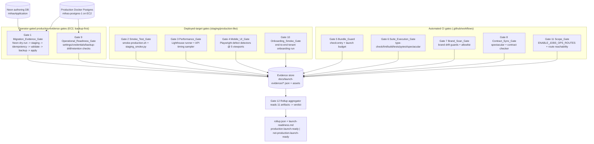

# Design Document

## Overview

This feature is a **launch-verification evidence harness**, not new product code.
It adds nothing to the student admissions journey, the tenant-admin surface, or
the payment flow. Instead it builds the machinery that *proves* the Beanola
platform is production-launch-ready against the 2026-06-16 postmortem
(`docs/beanola-production-postmortem-2026-06-16.md`): a set of **11 gates**, each
of which executes a check and emits a single reviewable **`Evidence_Artifact`**,
plus a **rollup aggregator** (Requirement 12) that reads every artifact and
declares the platform `production-launch-ready` or `not-production-launch-ready`.

The design rests on three load-bearing ideas:

1. **One evidence store.** Every gate writes its artifact under a single
   reviewable root: **`docs/launch-evidence/`**. The directory layout, the JSON
   artifact schema, and the rollup object are all defined here so a reviewer (or
   the rollup aggregator) can find, read, and trust each result without re-running
   the gate. Heavy binary outputs (Lighthouse HTML, Playwright PNGs, SQL logs)
   live beside their JSON summary; the JSON is the machine-readable contract.

2. **Reuse before invention.** Most gates wrap tooling that already exists:
   `apps/admissions` `check:entry` (entry-path guard), the brand/scope/document
   drift guards, `manage.py spectacular`, `manage.py check`, `apply_sql_migrations`,
   `deploy/backup-db.sh`, `scripts/smoke-production.sh`,
   `backend/scripts/staging_smoke.py`, and the existing CI workflows under
   `.github/workflows/`. New harness scripts are added only where there is a real
   gap: a Lighthouse runner, a Playwright mobile-UI audit harness, an API timing
   sampler, a contract-sync checker, an operational-readiness settings checker,
   and the rollup aggregator.

3. **Two execution worlds, never confused.** Per `infrastructure.md`, the database
   you author on (Neon, project `mihasApplication`) is not the database production
   runs on (the self-hosted Docker Postgres `mihas-postgres-1` on EC2). Schema
   changes are authored and proven on Neon (branch-first for anything risky), then
   applied to production as additive SQL under `backend/scripts/` via
   `apply_sql_migrations`, backup-first and operator-gated. The harness mirrors
   this: gates are classified as **automated CI gates**, **deployed-target gates**,
   or **operator-gated production-evidence gates**, and the operator-gated ones
   never run autonomously.

### What this feature is and is not

| Is | Is not |
|----|--------|
| A harness that runs checks and records evidence | A change to product behavior |
| A single evidence store + a deterministic rollup | A dashboard or web UI |
| A wrapper around existing guards/scripts where possible | A rewrite of CI or deploy |
| Operator-gated for any production write | An autonomous production-mutation tool |

The launch verdict is **conservative by construction**: a gate that is missing,
unknown, or not-yet-evaluated counts as *not passed*, and a passing gate whose
evidence file cannot be read also forces `not-production-launch-ready`. The only
way to reach `production-launch-ready` is for all 11 gates to have explicitly
passed and for every referenced artifact to be present and readable.

## Architecture

### Gate taxonomy and where each runs



### Execution-world classification

| Gate | Requirement | Class | Where it runs | Trigger |
|------|-------------|-------|---------------|---------|
| 1 Migration_Evidence_Gate | R1 | Operator-gated production-evidence | Neon (MCP) then EC2 `web`/`postgres` containers | Operator, backup-first |
| 2 Smoke_Test_Gate | R2 | Deployed-target | Against deployed frontend + backend URLs | CI post-deploy or operator |
| 3 Performance_Gate | R3 | Deployed-target | Against staging/production-like target | Operator / scheduled |
| 4 Mobile_UI_Gate | R4 | Deployed-target | Playwright against deployed/preview target | CI (preview) or operator |
| 5 Bundle_Guard | R5 | Automated CI | `apps/admissions` build artifacts | CI on every PR |
| 6 Suite_Execution_Gate | R6 | Automated CI | Monorepo CI jobs | CI on every PR |
| 7 Brand_Scan_Gate | R7 | Automated CI | Repo source scan | CI on every PR |
| 8 Contract_Sync_Gate | R8 | Automated CI | Generated OpenAPI vs frontend services | CI on every PR |
| 9 Operational_Readiness_Gate | R9 | Operator-gated production-evidence | EC2 production config + drills | Operator |
| 10 Onboarding_Smoke_Gate | R10 | Deployed-target | End-to-end against deployed tenant-admin API | Operator / scheduled |
| 11 Scope_Gate | R11 | Automated CI | Launch configuration + route table | CI on every PR |
| 12 Rollup | R12 | Aggregator | Reads the evidence store | CI or operator, last |

### Data-flow contract

Each gate is a process that: (a) takes defined inputs, (b) performs its check,
(c) writes exactly one `Evidence_Artifact` JSON (plus optional supporting assets)
under its gate directory, and (d) returns a non-zero exit code if it did not
pass. The rollup aggregator never re-runs a gate; it only reads the artifacts.
This decoupling is what lets operator-gated gates (1, 9) be produced by hand on
the EC2 box and still feed the same deterministic rollup as the automated CI
gates.

## Components and Interfaces

The harness lives under two homes: a new `scripts/launch-verification/` directory
at the repo root for cross-cutting harness scripts (rollup, contract-sync,
operational-readiness checker, API timing sampler, Lighthouse runner), and
app-local additions inside `apps/admissions` for frontend-specific gates
(bundle-guard extension, Playwright mobile-UI harness). Backend-touching checks
live under `backend/scripts/` and `backend/tests/` consistent with the
`managed = False` convention.

### Gate 1 — Migration_Evidence_Gate (R1)

| Concern | Detail |
|---------|--------|
| Reuses | Neon MCP (`prepare_database_migration`, `run_sql`, `create_branch`), `apply_sql_migrations --dry-run` and `apply_sql_migrations`, `deploy/backup-db.sh`, the read-only verification SQL in `infrastructure.md` |
| New script | `scripts/launch-verification/record-migration-evidence.py` — collects operator command output into the artifact; never executes production writes itself |
| Inputs | Migration script identifier(s) under `backend/scripts/`, Neon target (branch or default), staging connection, production `migration_history`, `backup-db.sh` completion timestamp |
| Emits | `docs/launch-evidence/01-migration/migration-evidence.json` + captured SQL/log text |
| Pass condition | Dry-run recorded with zero errors; staging apply recorded with one `migration_history` row per script; second apply records zero new changes/rows; validation SQL confirms all tenant invariants; if a production apply is recorded, a backup timestamp precedes it by ≤ 60 minutes; rollback/disable posture documented |
| Invariants validated | `canonical_programs ≥ 1`, active `institutions ≥ 1`, zero duplicate hostnames, zero duplicate slugs, active memberships ≥ 1 |

The invariant set and the validation SQL mirror the read-only checks documented
in `infrastructure.md`. The gate is **operator-gated**: the recording script runs
read-only Neon/production queries to capture evidence, but every production write
(`apply_sql_migrations`, seeding) remains a manual operator step taken
backup-first. Secrets (connection strings, passwords) are stripped before
anything is written to the artifact.

### Gate 2 — Smoke_Test_Gate (R2)

| Concern | Detail |
|---------|--------|
| Reuses | `scripts/smoke-production.sh`, `backend/scripts/staging_smoke.py`, `docs/runbooks/post-deploy-smoke-check.md` |
| New script | `scripts/launch-verification/run-smoke-gate.py` — wraps the smoke scripts, adds the two distinct admin-surface reachability checks and the unauth/no-CSRF rejection probe, normalizes results into the artifact |
| Inputs | Deployed frontend URL (`apply.beanola.com`), backend URL (`api.beanola.com`), `/admin/tenants` and `/beanola-admin-panel/` paths |
| Emits | `docs/launch-evidence/02-smoke/smoke-evidence.json` |
| Pass condition | Every smoke check records target id, observed result, pass/fail, timestamp; `/admin/tenants` and `/beanola-admin-panel/` each get a separate result and pass only on a non-error reachability response within 10 s; a state-changing request without valid cookie auth + CSRF is recorded as passed only if rejected; any failure marks the gate not passed |

The two canonical admin surfaces are treated as **distinct** targets with
separate result records — they are never collapsed into one check.

### Gate 3 — Performance_Gate (R3)

| Concern | Detail |
|---------|--------|
| New scripts | `scripts/launch-verification/run-lighthouse.mjs` (Lighthouse mobile runner, median of ≥3 runs per route) and `scripts/launch-verification/sample-api-timings.py` (p50/p95 sampler, ≥100 requests per surface) |
| Inputs | Deployed staging/production-like target; route list `/`, `/auth/signup`, `/track-application`, `/student/dashboard`, `/admin/dashboard`; API surface list (12 surfaces) with per-surface p95 targets |
| Emits | `docs/launch-evidence/03-performance/performance-evidence.json` + raw Lighthouse HTML/JSON per route + timing CSV |
| Pass condition | Public routes ≥ 90, authenticated/admin routes ≥ 80 (median of ≥3 runs); p50/p95 table covers all 12 surfaces with ≥100 samples each and records measured-vs-target; any shortfall or any unmeasured/under-sampled surface marks the gate not passed |

The API surface list is taken verbatim from the postmortem performance section:
tenant context, catalog offerings, draft save, application submit, payment init,
payment status, tenant admin list, tenant admin detail, official document queue,
official document status, official document download, settlement summary.

### Gate 4 — Mobile_UI_Gate (R4)

| Concern | Detail |
|---------|--------|
| New harness | `apps/admissions/tests/playwright/launch-mobile-ui.spec.ts` driving six deterministic defect detectors at five viewports |
| Reuses | Existing Playwright setup (`tech.md` lists Playwright as the deterministic E2E tool) |
| Inputs | Deployed/preview target, route sets (public, auth, student, admin including `/admin/tenants` and `/admin/applications`), viewports 360×800, 390×844, 768×1024, 1024×768, 1440×900 |
| Emits | `docs/launch-evidence/04-mobile-ui/mobile-ui-evidence.json` + labeled screenshots for `/admin/tenants` and `/admin/applications` at each viewport |
| Pass condition | Overall passed only if every route check passes at every viewport |

The six defect detectors are pure DOM predicates evaluated in the page context,
so they are **deterministic given a fixed DOM**:

1. **Horizontal overflow** — `document.body.scrollWidth > viewport.width + 1`.
2. **Clipped button text** — a control whose text `scrollWidth > clientWidth`.
3. **Undersized touch target** — interactive element rendered `< 44×44 px`.
4. **Icon-only control without accessible name** — interactive control with no
   non-empty name from text / `aria-label` / `aria-labelledby`.
5. **Overlapping layout regions** — two sibling card/table/form regions with
   intersecting bounding rectangles.
6. **Broken dialog** — a dialog that loses focus containment or cannot be
   dismissed by Escape or its close control.

A route that does not reach an interactive state within 30 s fails that route
check. Detectors are extracted as a pure module
(`apps/admissions/tests/playwright/detectors.ts`) so they can be unit- and
property-tested against synthetic DOM fixtures independent of a live browser.

### Gate 5 — Bundle_Guard (R5)

| Concern | Detail |
|---------|--------|
| Reuses | `apps/admissions/scripts/check-entry-chunk.ts` (`check:entry`) — already parses `dist/index.html`, measures gzipped entry+preload size, and scans forbidden markers |
| New script | `apps/admissions/scripts/launch-bundle-guard.ts` — wraps `check:entry` with the **stricter launch budget (≤ 150 KB gz)**, the expanded exclusion list (adds OCR/`tesseract`, chart/`recharts`, and admin-only page chunks to the existing `@react-pdf`/`jspdf`/`pdf-lib`/`html2canvas` set), the document-generation 772 KB-gz budget, and the public-route `vendor-sentry` absence check |
| Inputs | `apps/admissions/dist/` build output, route-to-chunk manifest from the Vite build |
| Emits | `docs/launch-evidence/05-bundle/bundle-evidence.json` |
| Pass condition | Entry path excludes all named chunks; measured entry gz ≤ 150 KB; first PDF-action transfer ≤ 772 KB gz; `vendor-sentry` absent from any public-route entry path; any violation fails CI and is recorded |

> Note: the existing `check:entry` total budget is 700 KB gz; the launch gate
> enforces the tighter 150 KB entry budget from R5.3 on top of it, so this gate
> *extends* rather than replaces the current guard.

### Gate 6 — Suite_Execution_Gate (R6)

| Concern | Detail |
|---------|--------|
| Reuses | CI jobs in `.github/workflows/ci.yml` (`admissions`, `backend`, `backend-property`), `manage.py check`, `manage.py spectacular` |
| New script | `scripts/launch-verification/collect-suite-results.py` — parses each command's exit code, test counts, and warning counts into the artifact |
| Inputs | Exit codes + machine-readable output of: admissions `type-check`, `lint` (`--max-warnings 0`), `build`, `test` (unit), property tests, Playwright smoke; backend `manage.py check`, full `pytest` (incl. tenant lifecycle / admin / student journeys), `manage.py spectacular` |
| Emits | `docs/launch-evidence/06-suite/suite-evidence.json` |
| Pass condition | Every required suite recorded with exit code 0, zero failed tests, and zero errors/warnings where zero is required (including resolution of the `CanonicalProgramSerializer.get_available_offerings` schema warning); any non-zero exit, failed test, or disallowed warning marks the gate not passed |

The zero-error spectacular assertion reuses the exact "Errors: N" stderr parsing
already present in the `ci.yml` `OpenAPI schema generation (zero errors)` step;
R6.6 adds the zero-**warning** requirement on top.

### Gate 7 — Brand_Scan_Gate (R7)

| Concern | Detail |
|---------|--------|
| Reuses | `apps/admissions/tests/unit/brandDriftGuard.test.ts`, `apps/admissions/tests/unit/documentFlowDriftGuard.test.ts`, `backend/tests/unit/test_brand_drift_guard.py`, `docs/legacy-brand-allowlist.json` |
| New script | `scripts/launch-verification/run-brand-scan.py` — runs the brand scan across guard-defined paths, validates the allowlist JSON, and checks each entry for staleness |
| Inputs | Active scanned source paths (as defined by the guards), `docs/legacy-brand-allowlist.json` |
| Emits | `docs/launch-evidence/07-brand/brand-evidence.json` |
| Pass condition | Zero hard platform-brand leaks outside the allowlist (records files scanned + leaks found); allowlist is well-formed JSON; every allowlist entry references one existing file, is classified as exactly one of {tenant seed, legacy compatibility, historical example, client-side preview fixture}, and still contains ≥ 1 allowlisted pattern; any leak, parse error, or stale entry fails the gate |

### Gate 8 — Contract_Sync_Gate (R8)

| Concern | Detail |
|---------|--------|
| Reuses | `manage.py spectacular` (generated OpenAPI), `apps/admissions/src/services/admin/tenants.ts` (frontend tenant service wrappers), the `{"success": true, "data": ...}` envelope convention |
| New script | `scripts/launch-verification/check-contract-sync.py` — diffs each frontend tenant-admin service request/response shape against its backend serializer in the generated schema, and checks error-code mapping coverage |
| Inputs | Generated OpenAPI artifact, frontend tenant-admin service shapes, the tenant-admin endpoint set under `/api/v1/admin/institutions/...` |
| Emits | `docs/launch-evidence/08-contract/contract-evidence.json` + the generated OpenAPI file |
| Pass condition | OpenAPI artifact generated in the same pipeline run; every tenant-admin tab's endpoints checked (institution CRUD, domains, offerings/rules, routing simulator, required documents, templates, document profiles, assets, staff memberships/grants, settlement, audit) with ≥ 1 endpoint each; request/response shapes match including the success envelope; every backend error code an endpoint can return is mapped on the frontend (including recoverable routing-simulator failures and out-of-scope 404s); any divergence or unmapped code fails CI and is recorded with field name + endpoint path |

### Gate 9 — Operational_Readiness_Gate (R9)

| Concern | Detail |
|---------|--------|
| Reuses | `backend/config/settings/*`, `deploy/backup-db.sh`, `database-backup-restore.md`, audit retention config (90/365 days), R2/django-storages upload validation |
| New script | `scripts/launch-verification/check-operational-readiness.py` — inspects production configuration and records **present/absent indicators only, never values** |
| Inputs | Production settings + environment (read on the EC2 box), backup/restore drill record, object-storage upload validation result, audit-retention config |
| Emits | `docs/launch-evidence/09-operational/operational-evidence.json` |
| Pass condition | `DEBUG` off; `SECRET_KEY` ≥ 50 chars and not equal to any tracked example/template value; secure cookies, trusted origins, CORS/CSRF hosts, HTTPS redirect, HSTS ≥ 31536000 s, CSP all present and non-empty; per-user rate limiting > 0 on every payment/auth/AI endpoint; email/payment/object-storage/error-monitoring credentials present (name + present/absent only); a backup/restore drill record with RTO ≤ 60 min and 0-row RPO variance on audited tables; tenant asset upload rejects disallowed content-type/shape; audit retention 90/365 with PII redaction; super-admin break-glass doc exists and is non-empty. Any failure records the setting **by name without its value** and leaves config unchanged |

This gate is the one with the strongest secret-handling guarantee: it is
structurally incapable of writing a credential value — it only ever records a
name and a boolean present/absent flag (R9.4, R9.9).

### Gate 10 — Onboarding_Smoke_Gate (R10)

| Concern | Detail |
|---------|--------|
| Reuses | Tenant-admin endpoints `/api/v1/admin/institutions/...`, `AccessScopeService`, tenant models (`Institution`, `InstitutionDomain`, `InstitutionAsset`, `InstitutionDocumentProfile`, `UserInstitutionMembership`, `AccessGrant`) |
| New script | `scripts/launch-verification/run-onboarding-smoke.py` — drives the end-to-end tenant onboarding journey against the deployed API and records per-step results |
| Inputs | Deployed tenant-admin API, a disposable test school definition |
| Emits | `docs/launch-evidence/10-onboarding/onboarding-evidence.json` |
| Pass condition | Each step (create school → assets → document profile/template → program/offering → membership/grant → routing simulator → student application → scoped-staff read → super-admin read → payment verified → official document) passes only after confirming the result is retrievable and scoped to the created school; scoped-staff out-of-scope reads return not-found; super-admin sees all schools; any step that fails, errors, or exceeds 60 s halts the run and reports failed without marking later steps passed |

### Gate 11 — Scope_Gate (R11)

| Concern | Detail |
|---------|--------|
| Reuses | `backend/config/urls.py` route table, `ENABLE_JOBS_OPS_ROUTES` flag |
| New script | `scripts/launch-verification/check-launch-scope.py` — asserts the flag and probes jobs/automation/integrations stub routes for reachability |
| Inputs | Launch configuration (`ENABLE_JOBS_OPS_ROUTES`), the set of jobs/automation/integrations stub routes under `/api/v1/`, recorded ship decisions |
| Emits | `docs/launch-evidence/11-scope/scope-evidence.json` |
| Pass condition | `ENABLE_JOBS_OPS_ROUTES` is `False`; no jobs/automation/integrations stub route without a recorded ship decision is reachable (a route is reachable if a request to its path is served rather than 404'd); any non-`False` flag value or reachable un-shipped stub route fails and blocks launch, recording the value / full route path |

### Gate 12 — Rollup aggregator (R12)

| Concern | Detail |
|---------|--------|
| New script | `scripts/launch-verification/rollup.py` — reads all 11 gate artifacts and computes the verdict |
| Inputs | The 11 `Evidence_Artifact` JSON files under `docs/launch-evidence/` |
| Emits | `docs/launch-evidence/rollup.json` + a human-readable `docs/launch-evidence/launch-readiness.md` |
| Pass condition | Verdict is `production-launch-ready` **iff** all 11 gates have an explicit `passed` status **and** every referenced artifact is present and readable; any gate that is missing, unknown, not-yet-evaluated, or whose artifact is unreadable forces `not-production-launch-ready` and is named in the output |

The aggregator is a **pure function** of the evidence store contents (plus a
filesystem readability probe), which is what makes the rollup deterministic and
property-testable.

## Data Models

All artifacts share a common envelope so the rollup can read them uniformly.

### Evidence store layout

```
docs/launch-evidence/
  01-migration/      migration-evidence.json      (+ *.sql, *.log)
  02-smoke/          smoke-evidence.json
  03-performance/    performance-evidence.json     (+ lighthouse/*.html, timings.csv)
  04-mobile-ui/      mobile-ui-evidence.json       (+ screenshots/*.png)
  05-bundle/         bundle-evidence.json
  06-suite/          suite-evidence.json
  07-brand/          brand-evidence.json
  08-contract/       contract-evidence.json        (+ openapi.yaml)
  09-operational/    operational-evidence.json
  10-onboarding/     onboarding-evidence.json
  11-scope/          scope-evidence.json
  rollup.json
  launch-readiness.md
```

### Common `Evidence_Artifact` envelope

```jsonc
{
  "gate_id": "bundle-guard",            // stable slug, one per gate
  "requirement": "R5",                  // requirement this gate satisfies
  "status": "passed",                   // "passed" | "failed" | "unknown"
  "generated_at": "2026-06-20T09:15:00Z",
  "generated_by": "ci" ,                // "ci" | "operator" | "deployed-target"
  "summary": "Entry path 94.4 KB gz; no forbidden chunks.",
  "checks": [                            // per-check rows; shape varies by gate
    {
      "id": "entry-gz-budget",
      "result": "pass",                 // "pass" | "fail" | "not-measured"
      "observed": "94.4 KB",
      "threshold": "150 KB",
      "detail": ""
    }
  ],
  "assets": ["bundle-report.txt"],      // supporting files, relative to gate dir
  "failures": []                         // populated when status != "passed"
}
```

`status` is intentionally a closed enum. The **absence** of an artifact, an
unparseable artifact, or `status: "unknown"` are all treated identically by the
rollup as *not passed*. No artifact ever stores a secret value: credential checks
record `{ "name": "LENCO_API_SECRET_KEY", "present": true }` and never a value.

### Gate-specific check payloads (representative fields)

| Gate | Notable check fields |
|------|----------------------|
| 1 Migration | `script_id`, `neon_target`, `branch_first` (bool), `migration_history_delta`, `idempotent_second_apply` (bool), `invariants` (object of counts), `backup_precedes_apply_minutes`, `rollback_posture` |
| 2 Smoke | `target`, `surface` (`tenant-admin`/`django-admin`/...), `http_status`, `latency_ms`, `rejected_when_unauthenticated` (bool) |
| 3 Performance | `route`, `lighthouse_median`, `run_scores[]`, `route_class`, `threshold`; `api_surface`, `p50_ms`, `p95_ms`, `sample_count`, `p95_target_ms` |
| 4 Mobile UI | `route`, `viewport`, `detector`, `result`, `offender`; `screenshot` |
| 5 Bundle | `entry_gz_bytes`, `entry_budget_bytes`, `forbidden_present[]`, `first_pdf_action_gz_bytes`, `pdf_budget_bytes`, `sentry_on_public_entry` (bool) |
| 6 Suite | `command`, `exit_code`, `passed`, `failed`, `skipped`, `errors`, `warnings` |
| 7 Brand | `files_scanned`, `leaks[]`, `allowlist_valid_json` (bool), `stale_entries[]`, `entry_classification` |
| 8 Contract | `endpoint`, `tab`, `field`, `divergence`, `unmapped_error_codes[]` |
| 9 Operational | `name`, `present` (bool), `check`, `result` — values never recorded |
| 10 Onboarding | `step`, `result`, `scoped_to_school` (bool), `elapsed_ms`, `halted_at` |
| 11 Scope | `enable_jobs_ops_routes`, `reachable_unshipped_routes[]` |

### Rollup status object

```jsonc
{
  "verdict": "not-production-launch-ready",   // closed enum, exactly one of two
  "generated_at": "2026-06-20T10:00:00Z",
  "gates": [
    { "gate_id": "migration-evidence", "requirement": "R1",
      "status": "passed",  "artifact": "01-migration/migration-evidence.json",
      "artifact_readable": true },
    { "gate_id": "performance",        "requirement": "R3",
      "status": "unknown", "artifact": "03-performance/performance-evidence.json",
      "artifact_readable": false }
    // ... all 11 gates ...
  ],
  "not_passed": ["performance"],              // every gate that blocks the verdict
  "missing_or_unreadable": ["performance"]    // subset that was absent/unreadable
}
```

The rollup enumerates **all 11** gates every time. A gate appears in `not_passed`
when its `status != "passed"` or its artifact is missing/unreadable; the verdict
is `production-launch-ready` only when `not_passed` is empty.

## Correctness Properties

*A property is a characteristic or behavior that should hold true across all
valid executions of a system — essentially, a formal statement about what the
system should do. Properties serve as the bridge between human-readable
specifications and machine-verifiable correctness guarantees.*

These correctness properties target the **pure-logic core** of this harness: the
rollup aggregator, the bundle predicate, the mobile-UI defect detectors (pure DOM
predicates that are deterministic given a fixed DOM), the operational-readiness
redaction and validity checks, the contract-sync comparator, the brand-allowlist
validator, the migration invariant evaluator, and the various
threshold/percentile computations. The gate *executions* themselves — running
Lighthouse, SSHing to EC2, applying SQL on Neon, driving a live browser, sampling
a live API — are integration/operator concerns and are covered by the Testing
Strategy's integration and smoke tests, not by properties.

Frontend pure-logic properties use **fast-check** (Vitest); backend pure-logic
properties use **hypothesis** (pytest). Each property test runs a minimum of 100
iterations and is tagged
**`Feature: beanola-launch-verification, Property {n}: {text}`**.

### Property 1: Rollup is launch-ready iff every gate passed and every artifact is readable

*For any* set of 11 gate records, the rollup verdict is `production-launch-ready`
if and only if all 11 gates have status `passed` **and** every referenced
artifact is present and readable; otherwise the verdict is
`not-production-launch-ready` and every blocking gate is named in `not_passed`.

**Validates: Requirements 12.1, 12.2, 12.4, 12.5**

### Property 2: Missing, unknown, or unreadable gates force not-ready (conservative default)

*For any* set of gate records in which at least one gate is missing, has status
`unknown`/not-yet-evaluated, or has an unreadable artifact, the rollup verdict is
`not-production-launch-ready` and that gate appears in `not_passed`
(and, when absent/unreadable, in `missing_or_unreadable`). The same conservative
aggregation governs each multi-check gate's own pass/fail rollup
(Smoke 2.6, Suite 6.7/6.8).

**Validates: Requirements 12.3, 2.6, 6.7, 6.8**

### Property 3: The bundle entry-path guard fails iff an excluded chunk is present

*For any* build chunk manifest, the bundle guard's exclusion check passes if and
only if no excluded marker (`@react-pdf`, `vendor-pdf`, `jspdf`, `pdf-lib`,
`html2canvas`, `tesseract`/OCR, `recharts`/charts, admin-only page chunks, and
`vendor-sentry` on a public route's entry path) appears in the entry/preload set;
when an excluded marker is present the guard fails and records the offending
chunk.

**Validates: Requirements 5.1, 5.2, 5.7, 5.8**

### Property 4: Size-threshold checks fail iff a measured size exceeds its budget

*For any* measured gzipped size, the entry-path check passes iff the size is at
most 150 KB, and the document-generation check passes iff the first-PDF-action
transfer is at most 772 KB gz; in both cases an over-budget size fails the check
and records measured-against-budget.

**Validates: Requirements 5.3, 5.4, 5.5, 5.6**

### Property 5: Mobile-UI defect detectors are deterministic and fire exactly when their defect is present

*For any* fixed DOM snapshot and viewport, each defect detector (horizontal
overflow, clipped button text, undersized touch target, icon-only control without
accessible name, overlapping layout regions, broken dialog) returns the same
result on repeated evaluation and reports a defect if and only if that defect is
present by its definition.

**Validates: Requirements 4.3, 4.4, 4.5, 4.6, 4.7, 4.8**

### Property 6: A route+viewport matrix passes overall iff every cell passes

*For any* matrix of per-route, per-viewport detector results across the five
viewports, the Mobile_UI_Gate reports overall passed if and only if no detector
reported a defect in any cell; otherwise it reports failed and records each
offending route/viewport.

**Validates: Requirements 4.10**

### Property 7: A reachability surface passes iff it responds non-error within the timeout

*For any* observed `(http_status, latency_ms)` pair for a smoke surface, the
surface check passes if and only if the status is a non-error (successful)
response and the latency is at most 10 000 ms; this holds identically for the
`/admin/tenants` and `/beanola-admin-panel/` surfaces, which are always recorded
as two distinct results.

**Validates: Requirements 2.2, 2.3, 2.4**

### Property 8: Lighthouse scoring uses the median of runs and passes against the class threshold

*For any* list of at least three Lighthouse run scores for a route, the recorded
score equals their median, and the route passes if and only if that median is at
least its route-class threshold (90 for a Public_Route, 80 for an
Authenticated/admin route); a median below threshold fails and records the
shortfall.

**Validates: Requirements 3.1, 3.2, 3.3, 3.6**

### Property 9: API timing uses correct percentiles and requires sufficient samples

*For any* vector of sampled request latencies for a surface, the recorded p50 and
p95 equal the definitional percentiles of the vector; if a surface has fewer than
100 samples or no measurement, it is marked not-measured and the gate is marked
not passed.

**Validates: Requirements 3.4, 3.7**

### Property 10: The brand scan passes iff the leak set outside the allowlist is empty

*For any* set of detected brand strings, the brand scan passes if and only if no
hard platform-brand leak exists outside `docs/legacy-brand-allowlist.json`; any
leak fails the gate and records the leaking string and file path.

**Validates: Requirements 7.1, 7.7**

### Property 11: An allowlist is valid iff every entry references one existing file with one classification and a live pattern

*For any* set of allowlist entries, validation passes if and only if every entry
references exactly one existing file, is classified as exactly one of {tenant
seed, legacy compatibility, historical example, client-side preview fixture}, and
still matches at least one allowlisted pattern in that file; an entry whose file
is missing or whose pattern no longer matches is reported as stale and fails the
gate.

**Validates: Requirements 7.4, 7.5, 7.6**

### Property 12: The contract comparator reports divergence iff a frontend shape differs from its serializer

*For any* pair of (backend serializer shape from the generated OpenAPI, frontend
tenant-admin service shape including the `{"success": true, "data": ...}`
envelope), the comparator reports no divergence if and only if the shapes match
field-for-field; otherwise it fails and records the diverging field name and
endpoint path.

**Validates: Requirements 8.2, 8.5**

### Property 13: Error-code mapping coverage holds iff every backend code is mapped on the frontend

*For any* endpoint with a set of backend-returnable error codes and a set of
frontend-mapped codes, the coverage check passes if and only if the backend set
is a subset of the mapped set; an unmapped code fails and records the code and
endpoint path.

**Validates: Requirements 8.4, 8.6**

### Property 14: Tenant-admin tab coverage holds iff every listed tab has at least one checked endpoint

*For any* mapping of the eleven tenant-admin tabs to their checked endpoints, the
coverage check passes if and only if every listed tab (institution CRUD, domains,
offerings/rules, routing simulator, required documents, templates, document
profiles, assets, staff memberships/grants, settlement, audit) has at least one
endpoint checked.

**Validates: Requirements 8.3**

### Property 15: The operational-readiness settings check passes iff every required setting satisfies its rule

*For any* production configuration vector, the operational-readiness check passes
if and only if `DEBUG` is off; `SECRET_KEY` is at least 50 characters and not
equal to any tracked example/template value; secure cookies, trusted origins,
CORS/CSRF hosts, HTTPS redirect, HSTS ≥ 31536000 s, and a CSP are all present and
non-empty; every required payment/auth/AI endpoint has a per-user rate limit
greater than zero; audit retention is 90 days standard and 365 days security; and
the backup/restore drill record has RTO ≤ 60 min with 0-row RPO variance — and it
fails (recording the failing setting **by name**) otherwise.

**Validates: Requirements 9.1, 9.2, 9.3, 9.5, 9.7**

### Property 16: Evidence artifacts never contain a secret value (redaction)

*For any* captured command output or configuration containing secret-shaped
tokens (connection strings, passwords, API keys), the emitted Evidence_Artifact —
including the failure path — contains only credential/setting **names** and
present/absent indicators, and contains none of the secret values as a substring.

**Validates: Requirements 1.9, 9.4, 9.9**

### Property 17: Migration invariant evaluation passes iff all tenant invariants hold

*For any* vector of post-apply counts, the migration validation passes if and
only if `canonical_programs ≥ 1`, active `institutions ≥ 1`, duplicate hostnames
= 0, duplicate slugs = 0, and active memberships ≥ 1; if any invariant is
violated, the gate records the specific failed invariant and marks the migration
evidence failed.

**Validates: Requirements 1.4, 1.5**

### Property 18: Idempotent re-apply produces a zero delta, and backup precedes apply within the window

*For any* recorded first/second migration apply, the idempotency check passes if
and only if the second apply produced zero additional schema changes and zero new
`migration_history` rows; and *for any* recorded `(backup_ts, apply_ts)` pair, the
backup-timing check passes if and only if the backup completed before the apply
by at most 60 minutes.

**Validates: Requirements 1.3, 1.6**

### Property 19: Onboarding smoke halts at the first failing step and marks no later step passed

*For any* sequence of onboarding step results, if the first failure (failed,
errored, or > 60 s) occurs at step `k`, the run halts at `k`, records `k` as the
failing step, and marks no step after `k` as passed.

**Validates: Requirements 10.12**

### Property 20: An un-shipped stub route passes scope only if it is unreachable

*For any* jobs/automation/integrations stub route under `/api/v1/` with no
recorded ship decision, the scope check passes if and only if the route is not
reachable (a request to it is rejected as not found rather than served); a
reachable un-shipped route fails, blocks launch, and records the full path.

**Validates: Requirements 11.3, 11.4**

## Error Handling

The harness fails safe: an error in any gate degrades that gate to *not passed*
and never produces a false `production-launch-ready` verdict.

| Failure mode | Handling |
|--------------|----------|
| A gate script crashes or times out | The gate emits no `passed` artifact (or writes `status: "unknown"`); the rollup treats it as not passed (Property 2). |
| An artifact file is absent or unparseable | The rollup records the gate in `missing_or_unreadable` and the verdict is `not-production-launch-ready` (Property 1/2). |
| A deployed-target gate cannot reach the target | The affected surfaces are recorded as not-measured/failed; the gate is not passed (Properties 7, 9). |
| Neon dry-run reports an error (R1.10) | The migration gate records the error and **withholds** any production-apply evidence until a clean dry-run is recorded. |
| A production write would be required | The gate stops and surfaces an operator instruction; it never performs the write autonomously (operator-gated, backup-first). |
| A secret-shaped value appears in captured output | The redaction layer strips it before write; Property 16 enforces no secret value reaches an artifact. |
| Allowlist JSON is malformed (R7.3) | The brand gate records the parse error and records no passing result. |
| Lighthouse/Playwright/timing tooling unavailable | The relevant surfaces are marked not-measured; the gate is not passed (no silent skip). |

All gate scripts return a non-zero exit code when they do not pass, so CI-class
gates fail the pipeline and operator-class gates fail visibly in the operator's
terminal.

## Security

The harness handles production configuration and connects to production data, so
it inherits the repo's hard rules:

- **No PII or secret logging.** Evidence artifacts redact connection strings, DB
  passwords, API keys, raw phone numbers, NRC/passport values, and document
  bodies. The operational-readiness gate records only credential *names* plus a
  present/absent boolean (Property 16). This is enforced by a shared redaction
  helper that every gate writes through.
- **No public Postgres port.** The harness reaches the production DB only via
  `docker compose exec postgres ...` on the EC2 box; it never opens or assumes a
  published `5432`. Reachability/timing samplers target only the public
  application URLs behind Caddy, never the database.
- **Neon-first, operator-gated production writes.** Schema changes are authored
  and proven on Neon (branch-first for risky changes) and applied to production
  only as additive SQL via `apply_sql_migrations`, backup-first
  (`deploy/backup-db.sh`), as a manual operator step. The migration gate's
  recording script runs read-only queries only.
- **No destructive autonomy.** The harness never runs destructive SQL or
  destructive Neon MCP tools; risky operations are surfaced as operator
  instructions and confirmed by a human.
- **Read-only by default.** Every automated CI gate and deployed-target gate is
  read-only against its target (build artifacts, generated schema, HTTP GETs,
  rendered DOM). The only writes the harness performs are to the evidence store
  under `docs/launch-evidence/`.
- **Credentials stay environment-backed.** No gate copies a value out of the
  environment into the repo; the evidence store is safe to commit and review.

## Testing Strategy

The harness uses the repo's existing dual approach: example/integration tests for
the gate executions and **property-based tests for the pure-logic core**.

### Property-based tests

- **Library:** fast-check for frontend logic (rollup if implemented in TS, bundle
  predicate, mobile-UI detectors, contract comparator), hypothesis for
  backend/Python logic (operational-readiness checks, migration invariant
  evaluator, redaction, scope predicate). The rollup aggregator is implemented in
  Python (`scripts/launch-verification/rollup.py`) and property-tested with
  hypothesis.
- **Iterations:** minimum 100 per property.
- **Tagging:** each test carries
  `Feature: beanola-launch-verification, Property {n}: {text}`.
- **Coverage:** Properties 1–20 above, one property-based test per property.
- **Locations:**
  - Backend pure-logic properties →
    `backend/tests/property/test_launch_verification_*.py`
    (rollup, operational-readiness, migration invariants, redaction, scope).
  - Frontend pure-logic properties →
    `apps/admissions/tests/property/launchVerification*.property.test.ts`
    (bundle predicate, mobile-UI detectors against synthetic DOM fixtures,
    contract-shape comparator).

### Unit and integration tests (gate self-tests)

- **Bundle_Guard:** a unit test runs `launch-bundle-guard.ts` against a fixture
  `dist/` to confirm budget and exclusion behavior, beside the existing
  `check:entry` script. Lives in `apps/admissions/tests/unit/`.
- **Mobile_UI_Gate:** the detectors are unit-tested against synthetic DOM
  fixtures; the Playwright spec itself is an integration test exercised against a
  preview build at the five viewports.
- **Smoke / Performance / Onboarding (deployed-target):** integration tests with
  1–3 representative examples against a staging/preview target; not property
  tested because behavior depends on the live deployment, not on input variation.
- **Migration / Operational_Readiness (operator-gated):** the recording scripts
  have unit tests over captured-output fixtures (invariant evaluation, redaction,
  backup-timing); the actual Neon/EC2 execution is an operator-run integration
  step documented in the runbooks below.
- **Suite_Execution_Gate:** verified by the existing CI jobs; the
  `collect-suite-results.py` parser has unit tests over sample command output.
- **Contract_Sync_Gate / Brand_Scan_Gate / Scope_Gate:** comparator/validator
  logic is property-tested; the spectacular generation, repo scan, and route
  probing are integration steps in CI.
- **Rollup:** in addition to the property tests, an integration test runs the
  aggregator over a fixture evidence store covering all-pass, one-fail,
  missing-gate, and unreadable-artifact cases.

### Verification commands

Run with the repo's standard gates (`tech.md`): `cd apps/admissions && bun run
test` for frontend properties/units, `cd backend && python3 -m pytest
tests/property/test_launch_verification_*.py tests/unit/` for backend
properties/units. Operator-gated gates are exercised by hand per the runbooks and
are never auto-run in CI.

## CI and Runbook Integration

### Automated CI gates (`.github/workflows/`)

The four automated CI gates and the CI-checkable part of the scope gate slot into
the existing workflows rather than introducing a parallel pipeline:

- **Bundle_Guard (Gate 5)** → a step in the `admissions` job in `ci.yml`, after
  `Build`, running `launch-bundle-guard.ts` (extends the existing
  `PDF chunk smoke check` / `check:entry` usage).
- **Suite_Execution_Gate (Gate 6)** → the existing `admissions`, `backend`, and
  `backend-property` jobs already produce the required results; the
  `collect-suite-results.py` step records them into the evidence store and
  asserts the zero-warning spectacular requirement on top of the existing
  zero-error step.
- **Brand_Scan_Gate (Gate 7)** → joins the existing `backend-drift-guards` /
  `frontend-drift-guards` jobs, plus the allowlist validity/staleness check.
- **Contract_Sync_Gate (Gate 8)** → a step after the `OpenAPI schema generation`
  step in the `backend` job, running `check-contract-sync.py` against the
  generated schema and `apps/admissions/src/services/admin/tenants.ts`.
- **Scope_Gate (Gate 11)** → a lightweight step asserting
  `ENABLE_JOBS_OPS_ROUTES=False` and probing un-shipped stub routes.

Each CI gate uploads its `Evidence_Artifact` (and supporting assets) as a build
artifact and writes it into `docs/launch-evidence/` so the rollup can aggregate.

### Operator-gated and deployed-target gates (runbooks)

The operator-run gates are documented as runbook procedures, reusing existing
runbooks where they already exist:

- **Migration_Evidence_Gate (Gate 1)** → extends
  `docs/runbooks/multi-tenant-beanola-rollout.md` and
  `deploy/RUNBOOK.md` §3; backup-first via `deploy/backup-db.sh`.
- **Smoke_Test_Gate (Gate 2)** → `docs/runbooks/post-deploy-smoke-check.md`
  (`scripts/smoke-production.sh`, `backend/scripts/staging_smoke.py`).
- **Performance / Mobile_UI / Onboarding (Gates 3, 4, 10)** → a new
  `docs/runbooks/launch-verification.md` describing how to run the Lighthouse
  runner, the Playwright mobile-UI harness, and the onboarding smoke against a
  staging/production-like target, and where each writes its evidence.
- **Operational_Readiness_Gate (Gate 9)** → the same new runbook plus
  `docs/runbooks/database-backup-restore.md` for the backup/restore drill.

The **rollup (Gate 12)** runs last — in CI for the automated-gate verdict, or by
the operator once all operator-gated artifacts are present — and writes
`docs/launch-evidence/rollup.json` and `launch-readiness.md`. A launch is
approved only when the rollup reads `production-launch-ready`.
