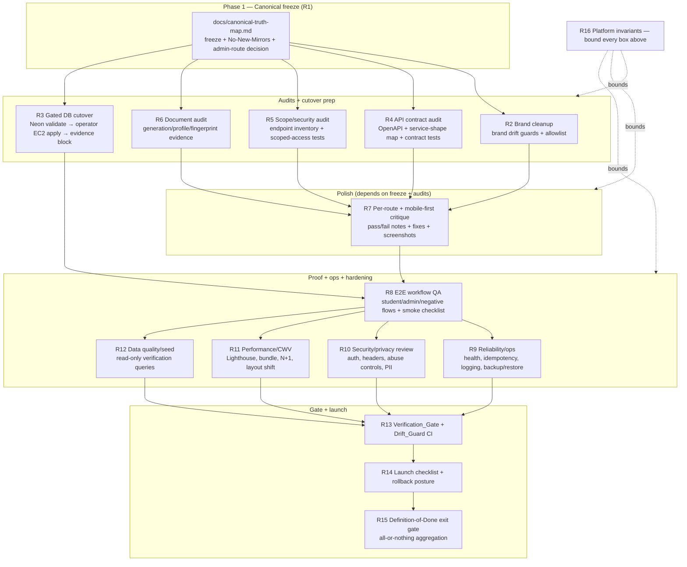

# Design Document

## Overview

This is the **production-readiness design** for the Beanola multi-school admissions
platform. It is a **verification + cutover + audit + polish + launch** design over a
**code-complete base** — it does **not** re-implement the multi-tenant feature. The
underlying behaviour (canonical-ID truth, `OfferingAssignmentService`,
`AccessScopeService`, backend official documents with the
`_compute_document_fingerprint` + current-version lifecycle, tenant document profiles,
tenant-aware communications, program-first assignment, drift guards) was delivered and
Neon-validated by the remediation spec
`.kiro/specs/multi-tenant-beanola-remediation/` (R1–R21, all tasks complete, **production
application pending**). This design **references** that spec and the **real repo files**;
it does not redesign them.

Authoritative inputs (all read and grounded):

- `docs/beanola-production-readiness-followup-plan.md` — the 15-phase follow-up plan
  (Operating Standard, Non-Negotiables, Definition of Done) this spec implements.
- `.kiro/specs/beanola-production-readiness/requirements.md` — the 16 requirements
  (R1–R16) this design satisfies.
- `.kiro/specs/multi-tenant-beanola-remediation/design.md` — the code-complete base whose
  Properties 1–25 this design continues from (this spec adds Properties 26+).
- `docs/runbooks/multi-tenant-beanola-rollout.md` — the gated 14-step Neon-first operator
  rollout that the Production_Cutover (R3) executes.
- `docs/canonical-truth-map.md` + `docs/legacy-brand-allowlist.json` — the canonical
  index and brand allowlist this spec freezes and verifies.
- `docs/multi-tenant-beanola-progress.md` — the code-complete / Neon-validated /
  production-applied tracker (production **pending**).
- `.kiro/steering/infrastructure.md` — Neon (`wild-bar-37055823`) is authoring/staging;
  production is the self-hosted Docker Postgres `mihas-postgres-1` on EC2.

### What this spec produces

Each requirement area produces a **verification artifact**, not a feature: an audit
inventory document, a Drift_Guard test, a scoped-access test, screenshot evidence, a smoke
checklist, or an evidence block. The only behavioural code changes are **gap fixes** the
audits surface (e.g. a missing scoped queryset, a per-route mobile overflow fix, a missing
rate limit) — each additive and tied to a requirement and exit criterion.

### Three invariants this spec must never break

These are inherited from the remediation base and the plan's Non-Negotiables (R16) and
bound every audit, polish, and cutover step:

1. **Canonical single source.** Exactly one authoritative source per business concept;
   every frontend mirror is generated-from, imported-from, or Drift_Guarded against it
   (`docs/canonical-truth-map.md`, R16.2). No audit or fix may introduce an unguarded
   mirror.
2. **Tenant isolation with 404 masking.** Every non-super-admin read of tenant data routes
   through `backend/apps/catalog/services.py:AccessScopeService`; an out-of-scope read
   returns the **Not_Found_Envelope** byte-identical to a genuine miss (R5.4, R16.4) so
   existence cannot be inferred.
3. **Backend-only official documents.** Official PDFs are backend-generated, backend-stored,
   fingerprinted, and versioned by
   `backend/apps/applications/tasks/pdf_generation.py`; the client `@/lib/pdf` generators
   are preview/draft only and unreachable from official-download paths (R6.2, R6.3, R16.5).

### Bounding constraint

All schema work is **additive**, authored and **validated on Neon first**, then copied to
the self-hosted production Postgres; **no production DB change is ever applied from the
development environment** (R16.8, `.kiro/steering/infrastructure.md`). The Production_Cutover
(R3) is a **gated operator step** confirmed by the user, performed on the EC2 box in a
maintenance window — never an automatic task run from here. The `apps/jobs-ops/` surface is
**out of scope** unless a requirement explicitly names it (R16.10).

## Architecture

### Production-readiness workstreams (keyed to requirements)



### Sequencing and dependencies

The plan's order is intentional and this design follows it:

1. **Freeze first (R1).** The Canonical_Truth_Map is frozen — including the admin-route
   decision — so every later audit verifies against a stable source of truth.
2. **Audits + cutover prep run against the frozen map (R2, R4, R5, R6, R3).** The brand,
   API-contract, scope-security, and document audits each produce an evidence document and
   tests; the cutover is validated on Neon and staged for the gated operator apply. These
   are largely independent and can proceed in parallel.
3. **Polish depends on the audits (R7).** Per-route and mobile-first UI critique consumes
   the API-contract and scope findings (it must know the real response shapes and the
   scoped surfaces) and produces per-route pass/fail notes, fixes, and screenshot evidence.
4. **E2E proves the assembled system on staging (R8)**, then **ops/security/perf/data
   (R9–R12)** harden it.
5. **CI gate aggregates the guards (R13)**, the **launch checklist + rollback posture
   (R14)** executes the cutover and smoke checks, and the **Definition-of-Done exit gate
   (R15)** is the final all-or-nothing aggregation.

R16 (platform invariants) is a cross-cutting constraint enforced by drift guards and
scoped tests throughout — it is not a sequential step.

## Components and Interfaces

Each component below maps to one requirement area, names the **real files/tests/docs** it
touches or adds, and states the **verification artifact** it produces. Audits produce
evidence documents + tests; the cutover produces an evidence block via the runbook; UI work
produces per-route pass/fail notes + fixes.

### Component 1 — Canonical freeze (R1)

**Touches:** `docs/canonical-truth-map.md` (already maps every concept + a Drift Guard
Inventory), `docs/legacy-brand-allowlist.json`.

**Work:** Verify/refresh the map so every domain concept (application lifecycle, payment
lifecycle, tenant identity, canonical program/offering/intake, document profile/official-doc
lifecycle, staff scopes/grants, communication templates, feature flags, public routes/SEO,
admin route, email sender, OpenAPI metadata, brand allowlist) names exactly one source of
truth (R1.1). Confirm the existing "No New Mirrors Without Guard" intent is recorded as an
explicit section (R1.2) and that every cross-layer mirror has a registered Drift_Guard or an
explicit backend-only note (R1.3). Confirm every legacy-fallback branch is named, tested,
non-executing for new canonical records, and has a documented removal condition (R1.5 —
already captured by the "Legacy-string fallback allowlist" + `test_canonical_tenant_drift_guard.py`).
Confirm no platform-level language presents MIHAS as platform identity (R1.6).

**Admin-route distinction — resolved (R1.1).** The two admin routes are **both canonical, for
different surfaces** — they are not a discrepancy:

- **`/admin/tenants`** (verified in `apps/admissions/src/routes/config.tsx`, guard `admin`) is
  the canonical **Beanola product admin UI route** for tenant onboarding and school management.
  It is the **main admin tenant surface** the Canonical_Truth_Map and the launch smoke check
  (R14.3) treat as authoritative.
- **`/beanola-admin-panel/`** (verified in `backend/config/urls.py`: `path("beanola-admin-panel/",
  admin.site.urls)`) is the canonical **Django admin operational route** — the low-level
  framework admin surface.

The Canonical_Truth_Map SHALL record **both** sources of truth with their distinct scopes (R1.1):
the product admin tenant surface (`/admin/tenants`) and the Django operational admin surface
(`/beanola-admin-panel/`). The launch smoke check (R14.3) verifies admin login at `/admin/tenants`
as the main admin tenant surface, and includes `/beanola-admin-panel/` only when checking the
low-level Django admin surface. The follow-up plan was updated to state this explicitly; no route
rename is performed.

**Artifact:** A frozen, accurate `docs/canonical-truth-map.md` recording both admin routes with
their scopes, and a passing canonical-truth/`No-New-Mirrors` verification — R1.4 fails the
Verification_Gate if a mirror exists in active runtime source without a map entry and a guard.

### Component 2 — Brand and tenant boundary cleanup (R2)

**Touches:** `docs/legacy-brand-allowlist.json` (the reviewed allowlist), the paired
`backend/tests/unit/test_brand_drift_guard.py` and
`apps/admissions/tests/unit/brandDriftGuard.test.ts`, the active PDF theme
`apps/admissions/src/lib/pdf/theme/index.ts`.

**Work:** Run the plan's `rg` brand scans over `apps/admissions/src`,
`apps/admissions/index.html`, `backend/apps`, `backend/config`; classify every hit as
platform-default (must be removed), seeded tenant data, dev/PDF-preview fixture not reachable
from official paths, historical/archived doc, or intentional test fixture (R2.2). Confirm the
Brand_Allowlist contains only single-file entries (no whole-directory entries, R2.3), each
with a removal-blocked reason. Confirm the active PDF theme returns a Beanola-generic preview
(or raises for official documents) for an unknown institution and never renders MIHAS/KATC for
an unknown school (R2.5). Confirm active docs/runbooks present Beanola as platform owner while
historical reports stay untouched (R2.6), and that Beanola logo asset paths resolve (R2.7).

**Artifact:** Passing brand drift guards (R2.1), a tightened reviewed `legacy-brand-allowlist.json`,
and a brand-scan evidence note in the progress doc.

### Component 3 — Gated production database cutover, Neon-first (R3)

**Touches:** the Migration_Runner
`backend/apps/common/management/commands/apply_sql_migrations.py`; the four additive scripts
under `backend/scripts/` (`2026_06_08_01_multi_tenant_beanola_admissions.sql`,
`2026_06_08_student_number.sql`, `2026_06_08_03_institution_document_profiles.sql`,
`2026_06_08_04_communication_templates_tenant.sql`); the runbook
`docs/runbooks/multi-tenant-beanola-rollout.md`; the prerequisite
`2026_05_22_migration_history_extend.sql`.

**Work:** This component **executes the existing 14-step runbook**; it authors no new schema.
Neon-side (steps 1–8): dry-run discovery in correct lexical order with the additive-only lint
passing (R3.2), apply + reapply for idempotency, run the validation SQL with duplicate
hostname/slug checks returning zero and `canonical_programs` non-zero (R3.3). Production-side
(steps 9–14, **gated on explicit user confirmation**, R3.4): backup + verify non-empty/restorable
(R3.5), verify the Migration_History_Prerequisite or get `MIGRATION_HISTORY_NOT_EXTENDED`
(R3.6), dry-run → apply → post-migration validation SQL, additive-only with no destructive
change through the startup sweep (R3.8), and reconcile any double-tracked migration name per the
runbook (R3.10). Confirm legacy null-canonical-ID applications, legacy string snapshots, prior
Official_Documents, and prior payments/receipts remain readable and unchanged (R3.9 — already
proven on Neon branch `br-tiny-bonus-ahz81bof`).

**Artifact:** A **production evidence block** (R3.7) recording migration names applied,
`migration_history` rows + checksums, counts (institutions / canonical programs / offerings /
intakes / applications-with-canonical-IDs / unlinked legacy rows), duplicate domain/slug checks,
scope-table counts, and document-profile counts, captured into
`docs/multi-tenant-beanola-progress.md` and the runbook's Phase-1 evidence section.

### Component 4 — Backend API contract audit (R4)

**Touches:** `python3 manage.py spectacular` output; every admissions frontend service module
under `apps/admissions/src/services/`; backend serializers/views under `backend/apps/`; adds
backend serializer-response tests, frontend service-normalization tests, and an OpenAPI drift
guard.

**Work:** Generate the OpenAPI schema (zero errors, Beanola-branded metadata, R4.1) and produce
an **API contract inventory document** mapping every frontend service method to a backend
endpoint across auth, profile, catalog/context/canonical-programs, applications, student
documents, official documents, payments, interviews, notifications, and the admin
dashboard/applications/users/audit-trail/tenant-onboarding/document-profiles/assets/templates/
access-grants surfaces (R4.2). For each endpoint verify envelope shape, error code, pagination
shape `{page, pageSize, totalCount, results}` inside `data`, auth class, scope filter,
serializer fields, frontend type, and UI consumer — no UI depends on an undocumented field
(R4.3, R4.4). Normalize errors so recoverable student-facing errors carry a stable code +
guidance and never expose raw Django/DRF errors (R4.6), and out-of-scope targets return the
Not_Found_Envelope (R4.7). Confirm rate limits exist for login/register/password-reset, public
tracker, payment initiation, document download/sign-URL, and admin bulk ops (R4.8).

**Artifact:** The API contract inventory doc; new backend serializer-response tests, frontend
service-normalization tests, and an OpenAPI drift guard (route presence + important fields,
R4.5).

### Component 5 — Tenant scoping and security audit (R5)

**Touches:** `backend/apps/catalog/services.py:AccessScopeService`; the existing
`backend/tests/unit/test_scope_drift_guard.py` and `test_unscoped_endpoint_guard.py`; the
document auth seam `backend/apps/documents/document_storage_views.py:_get_authorized_document`;
every staff/admin view that returns tenant data.

**Work:** Produce an **endpoint inventory document** classifying every admissions endpoint as
public-anonymous, student-owned, staff-scoped, or super-admin-only with **no unresolved
"unknown scope" rows** (R5.1). For every staff-scoped endpoint (application, payment, document,
dashboard aggregate, audit trail, user listing, notification/communication, tenant-onboarding
child resource) confirm the queryset filters through `AccessScopeService` (R5.2); add
scoped-access tests proving in-scope → API_Envelope (R5.3), out-of-scope → Not_Found_Envelope
(R5.4), expired Access_Grant → Not_Found_Envelope (R5.5), offering/application-scoped grants
permit only that target (R5.6), and Super_Admin sees all (R5.7). Confirm object-level checks use
canonical IDs not Legacy_String_Fields (R5.8), the scope/unscoped guards pass and no
non-super-admin path bypasses `AccessScopeService` (R5.9), and no PII leaks on out-of-scope,
anonymous, error, audit, or export surfaces, with signed-URL expiry, MIME/magic-byte validation,
SVG handling, storage-key naming, document-delete protection, and official-doc overwrite
protection enforced (R5.10).

**Artifact:** The endpoint inventory doc (no unknown-scope rows) and a scoped-access test matrix
covering R5.3–R5.7; passing scope-drift and unscoped-endpoint guards.

### Component 6 — Document system production audit (R6)

**Touches:** `backend/apps/applications/tasks/pdf_generation.py` (`_compute_document_fingerprint`,
current-version lifecycle, provenance in `verification_notes.official_document`); the renderer
package `backend/apps/applications/tasks/pdf/`; the student-safe endpoints
`backend/apps/applications/official_document_views.py`;
`backend/apps/catalog/services.py:InstitutionDocumentProfileService`; the seed command
`backend/apps/catalog/management/commands/seed_tenant_document_profiles.py`; the drift guards
`apps/admissions/tests/unit/documentFlowDriftGuard.test.ts` and
`backend/tests/unit/test_official_document_dedup_guard.py`.

**Work:** Produce a **document-type audit document** covering application slip, acceptance
letter, conditional offer, finance receipt, payment receipt (and any future
enrollment/registration doc), verifying for each: backend generation path, profile resolution,
required tenant assets, required template tokens, fingerprint inputs, versioning, storage path,
download permission, email-attachment behaviour (R6.1). Confirm downloads serve the backend
stored Official_Document, never a client render (R6.2), and that the client official-PDF actions
on the student wizard success screen, student payment page, public tracker, and admin
application-detail are removed/quarantined so `@/lib/pdf` generators are unreachable from
official paths (R6.3 — enforced by the document-flow guard). Verify the no-profile path sets
status `failed` with a descriptive error and produces no frontend-content document (R6.4); that
missing logo/signature, invalid token, invalid asset MIME, storage failure, and render failure
surface the failure state and never serve stale/client PDFs (R6.5); that repeated unchanged
generation reuses the current version by fingerprint with no duplicate records (R6.6 — dedup
guard); that MIHAS/KATC profiles are seeded from the seed command and a Beanola demo profile
exists only on staging (R6.7); that previews use sample data and are labelled (R6.8); and that
provenance includes institution, profile id+version, asset ids, and fingerprint with no document
bodies/PII/secrets in audit trails (R6.9).

**Artifact:** The document-type audit document; passing document-flow and dedup guards;
confirmation of the seed command + provenance.

### Component 7 — Per-route and mobile-first UI/UX critique and polish (R7)

**Touches:** every UI_Route in `apps/admissions/src/pages/` (enumerated in
`apps/admissions/src/routes/config.tsx`); Playwright screenshot harness; the Impeccable CLI
(`impeccable detect apps/admissions/src/`); canonical primitives (`PageShell`, `SectionCard`,
`ErrorDisplay`, `EmptyState`, `Button asChild`).

**Work:** Produce **per-route pass/fail notes** for every public, student, and admin UI_Route in
the plan's Phase-7 matrix; every fail gets an issue ID or task (R7.1). For each route at every
Mobile_Breakpoint (360, 390, 768, 1024, ≥1440) verify no horizontal overflow, no clipped
buttons, no overlapping text, no hidden required actions (R7.2); ≥44×44px touch targets at 360px
(R7.3); WCAG AA contrast with status colour always paired with icon/label and Lucide icons
(R7.4); no purple gradients / gradient text / glassmorphism / nested cards / emoji, and the full
Inter fallback chain preserved (R7.5); student forms show labels, field-level + server errors,
submit disabled/loading, clear success, and preserve auto-save + dirty-state protection on
navigation and `beforeunload` (R7.6); reduced-motion respected (R7.7); scope/school context
visible per role (R7.8); admin tables become cards/scroll containers with collapsible filters and
safe bulk actions on mobile (R7.9); dialogs are full-screen/bottom-sheet with focus trap and
working close/escape/back (R7.10); Beanola-as-platform copy with school names only from tenant
data and no hard-coded fees/health-only language on generic surfaces (R7.12). Apply fixes for
every critical failure.

**Artifact:** Per-route pass/fail notes + linked fixes, and **screenshot evidence** (Playwright)
for key routes including failure screenshots referenced from issue notes (R7.11).

### Component 8 — End-to-end workflow QA (R8)

**Touches:** staging (Neon) environment; the student/admin/negative E2E_Flow scripts (Playwright
or documented manual); the manual smoke checklist doc.

**Work:** Run the student E2E_Flow set (signup → verification → application creation →
canonical-program/intake selection → assigned institution → document upload → save-draft/resume →
pay-or-defer → submission → backend application-slip download → public tracking → communication →
interview → decision → acceptance/conditional-offer + receipt download) on staging (R8.1); run the
admin E2E_Flow set (super-admin login → institution creation → logo/signature upload → document-
profile creation → offering creation/assignment → routing simulator → add staff → scoped
Access_Grant → staff scoped-only view → review → payment verification → official-doc generation →
audit → scoped export) (R8.2). Prove the negative flows: wrong-school staff → Not_Found_Envelope
(R8.3); expired grant cannot open payment/document (R8.4); no document profile blocks official
generation with a clear error (R8.5); duplicate application blocked, full intake → recoverable
guidance (R8.6); failed payment never produces a paid receipt (R8.7); anonymous tracker leaks no
PII (R8.8).

**Artifact:** E2E pass evidence on staging and a **documented manual smoke checklist** for
production release (R8.9).

### Component 9 — Backend reliability and operations (R9)

**Touches:** `/health/live/` and `/health/ready/`; Celery Beat tasks (PDF generation, email
queue, payment reconciliation, notification dispatch, uptime); idempotency (`@idempotent`,
webhook dedup, official-doc fingerprint reuse); structured logging; GlitchTip monitoring;
`deploy/backup-db.sh` + `docs/runbooks/database-backup-restore.md`.

**Work:** Verify health endpoints report DB connectivity and Redis/Celery readiness (R9.1);
confirm the background-task surfaces are operational and monitored (R9.2); confirm idempotent
behaviour on repeated payment initiation, webhook, official-doc generation, and email retry
(R9.3); confirm structured logs include request ID, user ID where safe, institution ID, payment
reference, and document ID, with no secrets or full PII (R9.4); confirm error tracking, a
Beanola-default alert email, and failed-task/payment-webhook/PDF-render alerts, and send a test
monitoring event (R9.5); test the backup script and perform a restore drill on staging/local with
documented retention (R9.6); document the rollback posture (forward-only additive migrations,
feature-disable without data drop, feature flags) (R9.7); and confirm `manage.py check` passes in
the staging/prod env (R9.8).

**Artifact:** An operations verification note + restore-drill evidence + documented rollback
posture in the runbooks.

### Component 10 — Security and privacy review (R10)

**Touches:** auth stack (cookie flags, 30-min access / 7-day refresh + JTI, CSRF); authorization
(`AccessScopeService`, RBAC_Hierarchy); input validation (template tokens, HTML, file uploads,
query params, bulk actions); secrets/env; payment security; privacy/headers/abuse controls in
`backend/config/` and `apps/admissions/vercel.json`.

**Work:** Verify the auth stack enforces HTTP-only cookies, the 30-min/7-day token lifetimes with
JTI blacklisting, refresh rotation, logout/session cleanup, and CSRF on state-changing requests
(R10.1); authorization enforces owner/scope/super-admin/object-level checks consistent with the
RBAC_Hierarchy (R10.2); inputs are validated and token values HTML-escaped with invalid input
rejected descriptively (R10.3); no secrets in the repo, env examples current, prod env reviewed
(R10.4); payment controls enforce webhook signature, idempotency keys, reconciliation, and receipt
authorization with the Lenco mobile-money-first UX + deferral preserved (R10.5); privacy controls
minimize public-tracker data, gate exports, document audit retention, keep PII out of logs
(R10.6); responses set CSP/HSTS/X-Frame-Options/Referrer-Policy (R10.7); abuse controls enforce
rate limits, password-reset/public-tracker throttling, and upload size limits (R10.8); and no
high-severity finding is open, with any medium finding owned and given a launch decision (R10.9).

**Artifact:** A security/privacy review document with a findings register (severity + owner +
launch decision).

### Component 11 — Performance and Core Web Vitals (R11)

**Touches:** Lighthouse mobile runs; Vite bundle analysis + `apps/admissions/src/routes/config.tsx`
lazy-loading; backend query paths for application detail, dashboard, documents, payments; skeleton
dimensions.

**Work:** Measure Lighthouse mobile for public home, signup, tracker, student dashboard, admin
dashboard, plus bundle analysis and API timings (R11.1); confirm entry chunks exclude dev-preview
routes and oversized PDF/vendor chunks and that admin-heavy modules are lazy-loaded (R11.2);
confirm tenant-scoped queries avoid N+1, paginate large lists, and index slow queries (R11.3);
confirm public pages meet acceptable CWV thresholds and admin pages stay responsive at realistic
volume (R11.4); confirm stable skeleton dimensions and no dynamic text resizing keep CLS within
threshold (R11.5).

**Artifact:** A performance evidence note (Lighthouse scores, bundle report, query timings) and any
index/lazy-load fixes.

### Component 12 — Data quality and seed readiness (R12)

**Touches:** read-only verification queries against Neon (staging) and the production evidence
block; `seed_tenant_document_profiles`; institution/asset/catalog/document/staff/comms config.

**Work:** State all production data-quality/seed checks as **read-only verification queries** (no
production writes from dev). Verify per-school institution data (slug, code, brand name, legal
name, emails, phones, domains, active status) is complete and signed off (R12.1); assets (logo,
signature, seal where needed, checksums, active version) present (R12.2); flag any active offering
missing a canonical-program link, intake, or fee rule as not ready (R12.3); catalog data
(canonical programs, offerings, intakes, fees, capacity, assignment priority, eligibility rules)
present (R12.4); flag any active school missing a required document profile + assets as not ready
(R12.5); document config (required docs, profiles, template tokens, bank details, signatory)
present per school (R12.6); staff data (super-admins, institution admins, reviewers, finance
approvers, scoped grants) present (R12.7); and comms config (email/SMS templates, sender email,
support contact) Beanola-or-tenant-derived (R12.8).

**Artifact:** A per-school data-quality checklist with read-only query results and not-ready flags.

### Component 13 — Verification gate and Drift_Guard CI (R13)

**Touches:** CI configuration; the Verification_Gate command set; the full Drift_Guard inventory in
`docs/canonical-truth-map.md`.

**Work:** Ensure the Verification_Gate passes with zero errors — backend `python3 -m pytest`,
`python3 manage.py check`, `python3 manage.py spectacular`; admissions `bun run type-check`,
`bun run lint`, `bun run test`, `bun run build` (R13.1). Ensure CI includes jobs matching the
required Drift_Guard list: frontend + backend brand drift, document-flow drift, official-document
dedup, scope drift, unscoped endpoint, canonical-tenant drift, payment-status drift, error-code
drift, role mirror, application-lifecycle, and schema drift (R13.2). Ensure CI fails on any type
error, lint error, build failure, brand drift, unscoped-endpoint drift, or schema drift (R13.3),
that all intended new tests are committed with none left untracked (R13.4), that release notes link
a Smoke_Check job or manual checklist (R13.5), and that no required guard is optional (R13.6).

**Artifact:** A CI configuration reproducing the local commands + the full guard list, with the
Drift_Guard inventory cross-checked against the map.

### Component 14 — Production launch checklist and rollback posture (R14)

**Touches:** the release branch + env vars; the Verification_Gate + production build; the runbook
cutover; the immediate Smoke_Check set; `docs/multi-tenant-beanola-progress.md`.

**Work:** Pre-launch: freeze a release branch, confirm no uncommitted production code, confirm the
required env vars (`DATABASE_URL`, `SECRET_KEY`, JWT signing key, email sender creds, Lenco keys,
R2/S3 keys, CORS origins, cookie domain, frontend base URL, error-monitoring DSN) (R14.1).
Pre-deploy: run the full Verification_Gate + production build, back up the production DB, apply
migrations, run validation SQL (R14.2). Post-deploy: run the immediate Smoke_Check set (public home
Beanola branding, contact mailto Beanola, signup/login, catalog, wizard draft, assignment preview,
safe-environment payment initiation, public tracker no-PII, **admin login at `/admin/tenants`** (the
main Beanola product admin tenant surface), with the **`/beanola-admin-panel/` Django operational
admin** surface checked separately per the R1 two-surface decision, super-admin tenant onboarding,
staff scoped-data check,
official-document generation for one staged application, Beanola/tenant email render, no deployment
errors, health checks) (R14.3). Launch-time graceful-degradation posture: a failed tenant feature →
disable route/action keep data intact (R14.4); a failed payment → stop initiation keep submission
safe (R14.5); a failed official-document generation → show "generation failed" and block download
rather than serve a stale frontend PDF (R14.6). Database rollback forward-only unless a tested
rollback script exists, code rollback allowed (R14.7). After the window, confirm no critical log
errors and update the Production_Readiness_Status_Document with exact date/time + evidence (R14.8).

**Artifact:** A completed launch checklist + smoke evidence + an updated
`docs/multi-tenant-beanola-progress.md`.

### Component 15 — Definition-of-Done exit gate (R15)

**Touches:** all of the above artifacts; `.config.kiro` status marker.

**Work:** Define the Definition_of_Done as an **all-or-nothing aggregation** over the Component
1–14 exit conditions: the platform is production-ready only when the Canonical_Truth_Map is
accurate + the Brand_Allowlist is reviewed (R15.1), brand scans are clean (R15.2), all tenant
migrations are applied to staging **and** production with evidence (R15.3), every tenant-data
endpoint is scope-reviewed + scoped-tested **and** every frontend service shape matches the
serializers/OpenAPI (R15.4), every UI_Route has a mobile-first pass at every Mobile_Breakpoint +
every critical workflow has a Smoke_Check/manual script (R15.5), the Verification_Gate + production
Smoke_Check set pass (R15.6), and monitoring/backups/error-reporting/alert-email/CORS/cookies/env
vars are verified (R15.7). If **any** condition is unmet, the platform is **not** marked
production-ready (R15.8) and `.config.kiro` keeps no `"status": "completed"` until the operator
completes the rollout.

**Artifact:** The Definition-of-Done aggregation result (pass only when all conditions hold), and
the `.config.kiro` completion marker set by whoever completes the production rollout.

## Data Models

**There are NO new schema changes in this spec.** Every schema object this spec depends on was
already authored by the remediation spec as the four additive scripts under `backend/scripts/`:

| Table / change | Migration file | Authored by |
|----------------|----------------|-------------|
| Tenant schema (canonical/tenant tables, nullable canonical-ID columns, backfill, `NOT VALID` FKs) | `2026_06_08_01_multi_tenant_beanola_admissions.sql` | remediation |
| Per-`(institution_code, year)` student-number sequences + `next_student_number()` | `2026_06_08_student_number.sql` | remediation |
| `institution_document_profiles` (rich tenant document content) | `2026_06_08_03_institution_document_profiles.sql` | remediation |
| `communication_templates` `+institution_id`, `+version`, +index | `2026_06_08_04_communication_templates_tenant.sql` | remediation |

This spec only **applies** these via the gated Production_Cutover (R3) and **seeds** tenant data
via `seed_tenant_document_profiles` (R6.7). All affected models remain `managed=False`; nothing is
dropped, rewritten, or repurposed; the Legacy_String_Fields
(`applications.institution/program/intake`) stay untouched and readable (R3.9). The official-document
provenance + fingerprint live in the existing `verification_notes.official_document` JSON — no schema
change.

**Production data-quality and seed checks (R12) are stated as read-only verification queries**
(counts, completeness, not-ready flags) — they are run against Neon (staging) and reflected in the
production evidence block; **no production data is written from the development environment**
(R16.8). The deferred optional `ApplicationDocument.is_current` column documented by the remediation
design remains a later additive upgrade and is **not** introduced here.

## Correctness Properties

*A property is a characteristic or behavior that should hold true across all valid executions of a
system — essentially, a formal statement about what the system should do. Properties serve as the
bridge between human-readable specifications and machine-verifiable correctness guarantees.*

This spec is verification/cutover/audit/polish/launch over a **code-complete base**, so most of its
acceptance criteria are SMOKE checks, operator INTEGRATION steps, doc/runbook edits, or visual
screenshot checks — **not** property-based. The underlying behavioural invariants (masking,
fingerprint determinism, dedup, profile resolution, validation, template safety, communication
resolution, provenance/PII exclusion, assignment determinism, legacy readability) were already
formalized as **Properties 1–25 in the remediation design**
(`.kiro/specs/multi-tenant-beanola-remediation/design.md`) and are **referenced, not restated** here.

The numbering **continues conceptually from the remediation design** (whose last numbered property
was 25). The genuinely **new** production-readiness properties below are the **cross-surface
aggregations** the audits add over the whole platform, plus the all-or-nothing exit gate. Each maps
to the requirement(s) it validates and to a test/guard/evidence artifact (see Testing Strategy).

### Property 26: Tenant isolation holds across every audited endpoint

*For any* staff-scoped admissions endpoint in the R5 endpoint inventory and *any* non-super-admin
actor, an in-scope resource is returned via the API_Envelope; an out-of-scope resource, a resource
covered only by an **expired** Access_Grant, and a resource outside a single-offering/single-application
grant's target each return the **Not_Found_Envelope** byte-identical (HTTP status, error code,
message) to a genuine missing resource; a Super_Admin is permitted every read; and every such read is
filtered through `AccessScopeService` using canonical IDs (never Legacy_String_Fields), leaking no
PII on the out-of-scope response.

**Validates: Requirements 5.2, 5.3, 5.4, 5.5, 5.6, 5.7, 5.8, 5.9, 8.3, 8.4, 16.4** *(extends remediation Property 13 from the document surfaces to every audited endpoint)*

### Property 27: Frontend service shapes match the backend contract

*For any* admissions frontend service method, its normalized response type matches the corresponding
backend serializer fields and the generated OpenAPI schema, no UI consumer depends on a field absent
from the schema, and *for any* authenticated endpoint response the API_Envelope holds with list
responses carrying the paginated `{page, pageSize, totalCount, results}` shape inside `data`.

**Validates: Requirements 4.3, 4.4, 16.6**

### Property 28: No non-allowlisted legacy brand string in active source

*For any* file in the active runtime source scanned by the Brand_Drift_Guard (`apps/admissions/src`,
`apps/admissions/index.html`, `backend/apps`, `backend/config`) that is not listed in the
Brand_Allowlist, the file contains none of `MIHAS`, `KATC`, `Mukuba`, `Kalulushi`, `mihas.edu.zm`,
`katc.edu.zm`, or a legacy MIHAS API/app domain, so every platform default presents Beanola unless it
renders tenant-owned data.

**Validates: Requirements 2.1, 7.12, 16.1**

### Property 29: No client-only official PDF is reachable from an official-download path

*For any* student-facing or admin module on an official-download path, the module does not import the
`@/lib/pdf` barrel or invoke `generateApplicationSlip` / `generateAcceptanceLetter` /
`generatePaymentReceipt` for an official document; every official download resolves to the
backend-generated, backend-stored Official_Document.

**Validates: Requirements 6.2, 6.3, 16.5** *(document-flow guard, extended platform-wide)*

### Property 30: Every UI route is overflow-free with adequate touch targets at 360px

*For any* UI_Route enumerated in the Phase-7 route matrix, rendered at the 360px Mobile_Breakpoint,
the route produces no horizontal overflow (content width does not exceed the viewport) and every
interactive element (button, tab, icon button, input) presents a touch target of at least 44×44px.

**Validates: Requirements 7.2, 7.3** *(DOM-measured; pixel-perfect visual confirmation is screenshot evidence, not a property)*

### Property 31: Recoverable student-facing errors are stable and guidance-bearing

*For any* recoverable error surfaced to a student-facing endpoint, the response carries a stable
error code and user guidance and never exposes a raw Django or DRF error string or stack trace.

**Validates: Requirements 4.6**

### Property 32: Failed official-document generation never serves a stale or client PDF

*For any* official-document generation that fails (missing profile, missing logo/signature, invalid
token, storage failure, or render failure), the system records a `failed` status, leaves any prior
Official_Document unchanged, and blocks the download (showing a generation-failed state) rather than
serving a stale or client-rendered PDF.

**Validates: Requirements 6.5, 14.6** *(graceful-degradation posture; complements remediation Property 17)*

### Property 33: The Definition-of-Done exit gate is all-or-nothing

*For any* combination of Definition_of_Done condition outcomes, the production-ready gate evaluates to
true if and only if **every** condition (canonical map + reviewed allowlist; clean brand scans;
migrations applied to staging and production with evidence; every tenant-data endpoint scope-reviewed
and scoped-tested and every frontend service shape matching the contract; every UI_Route passed at
every Mobile_Breakpoint with a Smoke_Check per critical workflow; Verification_Gate + production
Smoke_Check passing; monitoring/backups/error-reporting/alert-email/CORS/cookies/env verified) is
true; if any single condition is unmet, the gate is false and the platform is not marked
production-ready.

**Validates: Requirements 15.1, 15.2, 15.3, 15.4, 15.5, 15.6, 15.7, 15.8**

### Properties referenced from the remediation design (not restated)

These behavioural invariants this spec verifies in production conditions are already specified as
remediation Properties 13–25 and are exercised by the same tests/guards listed there:

| Concept | Remediation property | This spec's requirement(s) |
|---------|----------------------|----------------------------|
| Document_Fingerprint determinism + input-sensitivity | Property 16 | 6.6 |
| Single current version / reuse-on-unchanged (dedup) | Property 17 | 6.6 |
| Student official-document status gating | Property 18 | 8.5 |
| Profile/template content safety (token allowlist + HTML-escape) | Property 19 | 10.3 |
| Profile resolution determinism + most-specific | Property 20 | 6.4 |
| Required-doc + access-grant validation correctness | Property 21 | (admin config) |
| Communication resolution + brand-safe context | Property 22 | 12.8 |
| Audit/provenance exclude PII/secrets/document bodies | Property 23 | 6.9, 9.4, 16.7 |
| Assignment determinism + institution-coded app numbers | Property 24 | 8.6 |
| Legacy null-canonical-ID readability | Property 25 | 3.9 |

Payment integrity criteria (R8.7 failed-payment-no-paid-receipt, R9.3 / R10.5 idempotency + webhook
signature) are owned by the payment-hardening spec's properties (`.kiro/specs/payment-hardening/`) and
are referenced, not restated.

## Error Handling

This spec reuses the **existing stable error codes** and the **Not_Found_Envelope** — it introduces no
new codes. Every endpoint keeps the `{"success": boolean, "data": ..., "error": ..., "code": ...}`
envelope (R16.6).

- **Recoverable student errors** carry a stable code + guidance and never expose a raw Django/DRF
  error (R4.6, Property 31). Examples reused from the base: `NO_ELIGIBLE_OFFERING` (409, recoverable
  assignment guidance), `INVALID_FORMAT` (400, tracking-code format guidance),
  `DOCUMENT_PROFILE_NOT_CONFIGURED` (status `failed`, no frontend-content document, R6.4),
  `OFFERING_CAPACITY_FULL` / `OFFERING_NO_LONGER_AVAILABLE` (409, recoverable, R8.6).
- **Out-of-scope reads** return `NOT_FOUND` masking (404) byte-identical to a genuine miss across
  every audited endpoint (R4.7, R5.4, R16.4, Property 26).
- **No raw framework errors** reach any UI surface; `envelope_exception_handler` in
  `backend/apps/common/exceptions.py` normalizes 500s and reports to GlitchTip.

**Launch-time graceful-degradation posture (R14.4–R14.6):**

- A failed **tenant feature** → disable the feature route/action and keep data intact (R14.4).
- A failed **payment** → stop payment initiation while keeping application submission safe (R14.5);
  a failed payment never produces a paid receipt (R8.7).
- A failed **official-document generation** → show "generation failed" and **block download** rather
  than serve a stale frontend PDF (R14.6, Property 32). Render failure leaves any prior
  Official_Document unchanged, records a failing-stage Audit_Event with no PII/secrets/bodies, and
  returns a retry-able error; permanent failure is bounded by the generator's `max_retries=3`.

## Security Considerations

- **Tenant isolation is the central property.** Every document/payment/application/dashboard/audit/
  user/notification/tenant-onboarding surface authorizes through
  `backend/apps/catalog/services.py:AccessScopeService` (never `role == "admin"` alone); out-of-scope
  reads are masked as 404 to close the existence-inference channel (Property 26). The
  `test_scope_drift_guard.py` and `test_unscoped_endpoint_guard.py` guards fail the build if a future
  change reintroduces role-only authorization or an unscoped queryset (R5.9, R13.2).
- **Official-document integrity.** Backend `system_generated` documents are deletion-protected from
  non-super-admins and carry full provenance (institution, profile id+version, asset ids, fingerprint)
  in `verification_notes.official_document`; clients cannot mint official PDFs (document-flow guard,
  Property 29). Failed generation never serves a stale/client PDF (Property 32).
- **PII / secret hygiene in logs and audits.** Structured logs include request ID, user ID where safe,
  institution ID, payment reference, and document ID, and exclude secrets and full PII (R9.4); audit
  payloads exclude rendered document bytes, applicant PII (NRC/passport, full DOB, phone, email,
  address), credentials, signing secrets, and bank account numbers (R16.7, remediation Property 23).
  The public tracker is data-minimized and anonymous surfaces leak no PII (R5.10, R8.8, R10.6).
- **Headers.** Production responses set CSP (with the GlitchTip `report-uri`), HSTS, X-Frame-Options,
  and Referrer-Policy (R10.7) via `apps/admissions/vercel.json` and backend security middleware.
- **Abuse controls / rate limits.** Login/register/password-reset, public tracker, payment initiation,
  document download/sign-URL, admin bulk operations, and AI surfaces are rate-limited; password-reset
  and public-tracker throttling and upload size limits are enforced (R4.8, R10.8).
- **Secrets review.** No secrets in the repo (`.env`/`.env.local` gitignored); env examples current;
  production env reviewed (R10.4). Connection strings, the `.pem` key, and DB dumps are never
  committed (`.kiro/steering/infrastructure.md`).
- **Auth/CSRF/JTI preserved.** HTTP-only cookies, 30-min access / 7-day refresh with JTI blacklisting,
  refresh rotation, logout/session cleanup, and CSRF on state-changing requests are unchanged (R10.1,
  R16.6).
- **No production DB write from dev.** All schema/data changes are authored/validated on Neon first,
  then applied to the self-hosted production Postgres by the gated operator cutover only (R16.8,
  R3.1, R3.4); production is never written from the development environment.

## Testing Strategy

### Dual approach

- **Unit / example tests** cover specific scenarios, audit-inventory completeness, doc/config
  presence, smoke checks, and guard behaviour (OpenAPI generation, header presence, env-var presence,
  allowlist single-file shape, CI guard list).
- **Property-based tests** cover the universal cross-surface invariants in Properties 26–33, each
  running **≥100 iterations** with a pinned deterministic seed.
- **Integration tests** (1–3 examples) cover the operator cutover (Neon-branch apply/reapply
  idempotence + validation SQL), E2E staging flows, health/monitoring/backup-restore wiring, and
  Lighthouse/CWV measurement — behaviour that does not vary meaningfully with input or hits external
  systems.

### PBT applicability

PBT applies to the logic/aggregation layers here — tenant-isolation masking across the audited
endpoint set, frontend-service-shape ⇔ contract conformance, the active-source brand scan, the
document-flow reachability scan, per-route overflow/touch-target measurement, recoverable-error
shape, failed-generation degradation, and the all-or-nothing Definition-of-Done evaluator.

PBT does **NOT** apply to:

- the **operator Production_Cutover** (R3) — a gated, one-time external procedure verified by the
  Neon-branch idempotence integration test + the production evidence block, not by iteration;
- **doc/runbook edits** (R1, R9.7, R14.7, R14.8) and the **manual smoke checklist** (R8.9) — verified
  by example/presence assertions;
- **visual screenshot checks** (R7.11) and the **Impeccable CLI anti-pattern scan** (R7.4, R7.5) —
  deterministic guard/visual checks, not properties;
- **SMOKE config checks** (R2.7 logo paths, R9.1 health, R9.8 `manage.py check`, R10.7 headers, R13.1
  command run, R14.1/R14.3 env + post-deploy smoke).

### Property-to-test map

Backend property tests use `pytest` + `hypothesis` (≥100 examples, `--hypothesis-seed=0`); frontend
property tests use `vitest` + `fast-check` (`fc.assert(prop, { numRuns: 100, seed: 0 })`). Each test
is tagged **`Feature: beanola-production-readiness, Property {n}: {text}`** and implements exactly one
property.

| # | Property | Test artifact |
|---|----------|---------------|
| 26 | Tenant isolation across every audited endpoint | `backend/tests/property/test_production_scope_masking_properties.py` (drives every endpoint in the R5 inventory through in-scope / out-of-scope / expired-grant / offering-scoped / super-admin cases) + `backend/tests/unit/test_scope_drift_guard.py` + `test_unscoped_endpoint_guard.py` |
| 27 | Frontend service shape ⇔ OpenAPI/serializer + envelope/pagination | `apps/admissions/tests/unit/openApiContractDriftGuard.test.ts` (service shape vs generated schema) + `backend/tests/property/test_envelope_pagination_conformance.py` |
| 28 | No non-allowlisted brand string in active source | `backend/tests/unit/test_brand_drift_guard.py` + `apps/admissions/tests/unit/brandDriftGuard.test.ts` (existing guards, scan property) |
| 29 | No client-only official PDF on an official-download path | `apps/admissions/tests/unit/documentFlowDriftGuard.test.ts` (existing) |
| 30 | Per-route overflow-free + ≥44px targets at 360px | `apps/admissions/tests/unit/routeMobileOverflowGuard.test.tsx` (DOM-measured across the route set at 360px) |
| 31 | Recoverable student errors stable + guidance, no raw framework error | `backend/tests/property/test_student_error_envelope_properties.py` |
| 32 | Failed official-doc generation never serves stale/client PDF | `backend/tests/property/test_official_document_failure_degradation.py` (extends `test_official_document_dedup_guard.py`) |
| 33 | Definition-of-Done all-or-nothing | `backend/tests/property/test_definition_of_done_gate.py` (or a frontend/CLI evaluator test — gate true ⇔ all conditions true) |

### Verification_Gate (the CI-reproducible zero-error command set — R13.1)

```bash
# Backend
cd backend
DJANGO_SETTINGS_MODULE=config.settings.test python3 -m pytest tests/unit tests/property -q
DJANGO_SETTINGS_MODULE=config.settings.test python3 manage.py check
DJANGO_SETTINGS_MODULE=config.settings.test python3 manage.py spectacular --file /tmp/openapi.yaml

# Admissions
cd apps/admissions
bun run type-check
bun run lint
bun run test
bun run build
```

All must pass with **zero errors** before production-ready (R13.1, R15.6).

### Drift_Guard inventory that must pass (R13.2, cross-checked against `docs/canonical-truth-map.md`)

- Frontend brand drift — `apps/admissions/tests/unit/brandDriftGuard.test.ts`
- Backend brand drift — `backend/tests/unit/test_brand_drift_guard.py`
- Document-flow drift — `apps/admissions/tests/unit/documentFlowDriftGuard.test.ts`
- Official-document dedup — `backend/tests/unit/test_official_document_dedup_guard.py`
- Scope drift — `backend/tests/unit/test_scope_drift_guard.py`
- Unscoped endpoint — `backend/tests/unit/test_unscoped_endpoint_guard.py`
- Canonical-tenant drift — `backend/tests/unit/test_canonical_tenant_drift_guard.py`
- Payment-status drift — `backend/tests/unit/test_payment_status_canonical.py` + `apps/admissions/tests/unit/paymentStatusMappingDriftGuard.test.ts`
- Error-code drift — `backend/tests/unit/test_error_codes_canonical.py` + `apps/admissions/tests/unit/errorCodesDriftGuard.test.ts`
- Role mirror — `apps/admissions/tests/unit/rolesBackendMirror.test.ts`
- Application-lifecycle — `apps/admissions/tests/unit/applicationStatusDriftGuard.test.ts` + `backend/tests/property/test_lifecycle_canonical.py`
- Schema drift — `backend/tests/property/test_schema_drift_strict.py` + `backend/tests/unit/test_migration_drift_guard.py`

CI fails on any type/lint/build failure, brand drift, unscoped-endpoint drift, or schema drift (R13.3);
no required guard is optional (R13.6); all intended new tests are committed (R13.4).

### UI evidence, smoke, and E2E

- **Playwright/screenshot evidence** for the Phase-7 key routes at the Mobile_Breakpoint set (360,
  390, 768, 1024, ≥1440), including failure screenshots referenced from issue notes (R7.11). The
  Impeccable CLI (`impeccable detect apps/admissions/src/`) provides the deterministic anti-pattern
  gate (R7.5).
- **Manual smoke checklist** (R8.9) and the **immediate post-deploy Smoke_Check set** (R14.3) — single
  execution, documented and linked from release notes (R13.5).
- **E2E staging flows** (R8.1, R8.2) — student, admin, and negative journeys run on the Neon staging
  branch; negative flows assert the security boundaries (Property 26) hold end-to-end.

### Definition-of-Done exit gate

The Definition_of_Done (R15) is the **final aggregation** — production-ready is true only when every
Component 1–14 exit condition holds (Property 33). It is not reached until the gated operator cutover
(R3) is complete; until then `.config.kiro` keeps no `"status": "completed"` (per
`docs/multi-tenant-beanola-progress.md`). PBT applies only to the gate's all-or-nothing **evaluator
logic**, not to the underlying operator steps, doc edits, or visual checks.
