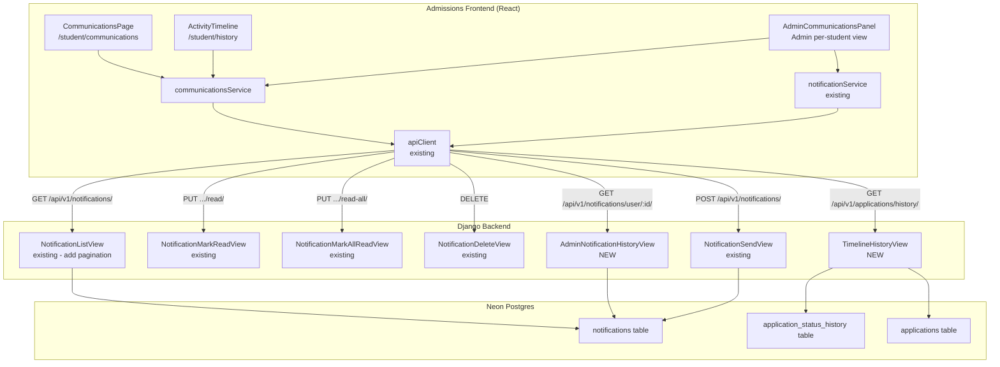

# Design Document: Communications History

## Overview

This feature adds a full-page communications center and activity timeline for students, plus an admin communications panel for per-student messaging and history. It wires existing backend data (Notification, ApplicationStatusHistory) into dedicated frontend pages and adds two new backend endpoints: a student timeline API and an admin per-user notification history API.

The design builds on existing infrastructure:
- Backend: `Notification` model, `ApplicationStatusHistory` model, existing notification CRUD endpoints
- Frontend: `notificationService`, `useNotificationPolling`, `NotificationBell`, UI primitives (`PageShell`, `SectionCard`, `EmptyState`, `ErrorDisplay`)
- Conventions: `/api/v1/` REST routes, `{"success": true, "data": ...}` envelope, cookie-based JWT auth, React Query for server state

### Key Design Decisions

1. **Reuse existing notification endpoints** for the student communications page (GET/PUT/DELETE on `/api/v1/notifications/`). Only add pagination support to the existing list endpoint rather than creating a new one.
2. **New timeline endpoint** under `/api/v1/applications/history/` since the existing application detail endpoint only embeds the last 10 status history records.
3. **New admin endpoint** at `/api/v1/notifications/user/<user_id>/` for per-student notification history, keeping it under the notifications URL namespace.
4. **Frontend service module** (`communicationsService`) centralizes all new API calls, following the `notificationService` pattern.
5. **Lazy-loaded routes** with `detail` skeleton type, consistent with existing student pages like Settings and ApplicationStatus.

## Architecture



### Data Flow

**Student Communications Page:**
1. Page mounts → `communicationsService.listNotifications({ page, pageSize, type?, readStatus? })` → `GET /api/v1/notifications/?page=1&pageSize=20&type=info&is_read=false`
2. Backend filters `Notification` records for `request.user`, applies filters, paginates, returns envelope
3. Mark read / mark all read / delete use existing endpoints via `notificationService`

**Student Activity Timeline:**
1. Page mounts → `communicationsService.listHistory({ page, pageSize })` → `GET /api/v1/applications/history/?page=1&pageSize=20`
2. Backend queries `ApplicationStatusHistory` joined with `Application` (filtered to user's apps), orders by `created_at` desc, paginates
3. Frontend groups entries by `application_number` for display

**Admin Communications Panel:**
1. Admin selects a student → `communicationsService.listUserNotifications(userId, { page, pageSize })` → `GET /api/v1/notifications/user/<user_id>/?page=1&pageSize=20`
2. Admin sends message → `notificationService.send({ to: userId, subject, message })` → `POST /api/v1/notifications/`
3. Admin views timeline → `communicationsService.listHistory({ page, pageSize, userId })` → `GET /api/v1/applications/history/?user_id=<uuid>&page=1&pageSize=20`

## Components and Interfaces

### Backend Components

#### 1. TimelineHistoryView (NEW)
- **Location:** `backend/apps/applications/history_views.py`
- **URL:** `GET /api/v1/applications/history/`
- **Auth:** `IsAuthenticated`
- **Behavior:**
  - For students: returns `ApplicationStatusHistory` records for all applications where `application__user_id == request.user.pk`
  - For admins: if `?user_id=<uuid>` query param is present, returns records for that user's applications
  - Orders by `created_at` descending
  - Includes `application_number` from the related `Application`
  - Supports pagination: `?page=1&pageSize=20`

#### 2. AdminNotificationHistoryView (NEW)
- **Location:** `backend/apps/common/notification_views.py` (add to existing file)
- **URL:** `GET /api/v1/notifications/user/<uuid:user_id>/`
- **Auth:** `IsAuthenticated, IsAdmin`
- **Behavior:**
  - Returns all `Notification` records for the specified `user_id`
  - Orders by `created_at` descending
  - Supports pagination
  - Returns 404 if user_id doesn't exist
  - Returns 403 for non-admin users

#### 3. NotificationListView Enhancement
- **Location:** `backend/apps/common/notification_views.py` (modify existing)
- **Add:** pagination support (`?page=1&pageSize=20`) and filtering (`?type=info&is_read=true/false`)
- **Backward compatible:** without query params, returns all notifications (existing behavior)

### Frontend Components

#### 1. CommunicationsPage
- **Location:** `apps/admissions/src/pages/student/Communications.tsx`
- **Route:** `/student/communications`, guard: `student`, lazy: `true`, skeleton: `detail`
- **Uses:** `PageShell`, `SectionCard`, `EmptyState`, `ErrorDisplay`
- **State:** React Query for notification list, local state for filters
- **Features:** type filter (all/info/success/warning/error), read status filter (all/unread/read), mark read, mark all read, delete, action_url navigation, pagination

#### 2. ActivityTimeline
- **Location:** `apps/admissions/src/pages/student/History.tsx`
- **Route:** `/student/history`, guard: `student`, lazy: `true`, skeleton: `detail`
- **Uses:** `PageShell`, `SectionCard`, `EmptyState`, `ErrorDisplay`
- **State:** React Query for timeline data
- **Features:** chronological timeline with color-coded status indicators, grouped by application_number, admin feedback inline, pagination

#### 3. AdminCommunicationsPanel
- **Location:** `apps/admissions/src/components/admin/AdminCommunicationsPanel.tsx`
- **Usage:** embedded in admin user detail or as a standalone admin view
- **Props:** `userId: string`, `studentName: string`
- **Features:** notification history list, send message form (title, message, type), inline timeline view, optimistic update on send

#### 4. communicationsService
- **Location:** `apps/admissions/src/services/communications.ts`
- **Methods:**
  - `listNotifications(params: PaginationParams & NotificationFilters): Promise<PaginatedResponse<StudentNotification>>`
  - `listHistory(params: PaginationParams & { userId?: string }): Promise<PaginatedResponse<TimelineEntry>>`
  - `listUserNotifications(userId: string, params: PaginationParams): Promise<PaginatedResponse<StudentNotification>>`

### Frontend Hooks

#### 1. useCommunications
- **Location:** `apps/admissions/src/hooks/useCommunications.ts`
- React Query wrapper for `communicationsService.listNotifications`
- Query key: `['communications', userId, filters]`
- Exposes: `notifications`, `isLoading`, `error`, `pagination`, `refetch`

#### 2. useTimeline
- **Location:** `apps/admissions/src/hooks/useTimeline.ts`
- React Query wrapper for `communicationsService.listHistory`
- Query key: `['timeline', userId, page]`
- Exposes: `entries`, `groupedEntries`, `isLoading`, `error`, `pagination`

## Data Models

### Existing Models (No Changes)

**Notification** (`backend/apps/common/models.py`):
```
id: UUID (PK)
user: FK → Profile
title: CharField(255)
message: TextField
type: CharField(50) — nullable (info, success, warning, error)
priority: CharField(20) — nullable
action_url: TextField — nullable
metadata: JSONField — nullable
is_read: BooleanField (default False)
read_at: DateTimeField — nullable
created_at: DateTimeField — nullable
updated_at: DateTimeField — nullable
idempotency_key: TextField — nullable, unique
```

**ApplicationStatusHistory** (`backend/apps/applications/models.py`):
```
id: UUID (PK)
application: FK → Application
status: CharField(20)
changed_by: FK → Profile — nullable
notes: TextField — nullable
changes: JSONField — nullable
ip_address: CharField(64) — nullable
user_agent: TextField — nullable
created_at: DateTimeField (auto_now_add)
old_status: TextField — nullable
new_status: TextField — nullable
```

### API Response Shapes

**GET /api/v1/notifications/?page=1&pageSize=20&type=info&is_read=false**
```json
{
  "success": true,
  "data": {
    "page": 1,
    "pageSize": 20,
    "totalCount": 42,
    "results": [
      {
        "id": "uuid",
        "title": "Application Submitted",
        "message": "Your application #APP-20250101-ABCDEFGH has been submitted.",
        "type": "success",
        "is_read": false,
        "action_url": "/student/application/uuid/status",
        "created_at": "2025-01-15T10:30:00Z"
      }
    ]
  }
}
```

**GET /api/v1/applications/history/?page=1&pageSize=20**
```json
{
  "success": true,
  "data": {
    "page": 1,
    "pageSize": 20,
    "totalCount": 15,
    "results": [
      {
        "id": "uuid",
        "application_id": "uuid",
        "application_number": "APP-20250101-ABCDEFGH",
        "old_status": "submitted",
        "new_status": "under_review",
        "notes": "Application moved to review queue",
        "changed_by_name": "Admin User",
        "created_at": "2025-01-15T14:00:00Z"
      }
    ]
  }
}
```

**GET /api/v1/notifications/user/<user_id>/?page=1&pageSize=20**
Same shape as the student notification list response.

### Frontend Types

```typescript
// Timeline entry from the history API
interface TimelineEntry {
  id: string
  application_id: string
  application_number: string
  old_status: string | null
  new_status: string | null
  notes: string | null
  changed_by_name: string | null
  created_at: string
}

// Paginated response envelope
interface PaginatedResponse<T> {
  page: number
  pageSize: number
  totalCount: number
  results: T[]
}

// Filter params for communications page
interface NotificationFilters {
  type?: 'info' | 'success' | 'warning' | 'error'
  is_read?: boolean
}

// Pagination params
interface PaginationParams {
  page?: number
  pageSize?: number
}
```

## Correctness Properties

*A property is a characteristic or behavior that should hold true across all valid executions of a system — essentially, a formal statement about what the system should do. Properties serve as the bridge between human-readable specifications and machine-verifiable correctness guarantees.*

### Property 1: Chronological ordering

*For any* API response from the notifications list, timeline history, or admin notification history endpoints, the `results` array SHALL be sorted by `created_at` in descending order — i.e., for every consecutive pair of items `results[i]` and `results[i+1]`, `results[i].created_at >= results[i+1].created_at`.

**Validates: Requirements 1.1, 2.1, 3.2, 6.1, 7.3**

### Property 2: Notification display completeness

*For any* Notification object, the rendered communications page item SHALL contain the notification's `title`, `message`, `type`, read/unread indicator, and a human-readable timestamp derived from `created_at`.

**Validates: Requirements 1.2**

### Property 3: Timeline entry display completeness

*For any* TimelineEntry object returned by the history API, the entry SHALL include non-null `application_number`, and the rendered timeline item SHALL display `old_status`, `new_status`, `notes` (when present), and a formatted `created_at` timestamp.

**Validates: Requirements 2.2, 3.3**

### Property 4: Filter correctness

*For any* set of notifications and any combination of type filter and read-status filter, the filtered result set SHALL contain only notifications where `type` matches the type filter (when set) AND `is_read` matches the read-status filter (when set). The filtered set SHALL be a subset of the unfiltered set.

**Validates: Requirements 1.7**

### Property 5: Action URL conditional rendering

*For any* Notification, if `action_url` is non-null and non-empty, the rendered item SHALL contain a navigable link element with that URL as its target. If `action_url` is null or empty, no link element SHALL be rendered for navigation.

**Validates: Requirements 1.8**

### Property 6: Status color mapping totality

*For any* application status string value (including `draft`, `submitted`, `under_review`, `approved`, `rejected`, `waitlisted`, and any unknown value), the status-to-color mapping function SHALL return a defined, non-empty CSS class string. No status value SHALL produce an undefined or null mapping.

**Validates: Requirements 2.3**

### Property 7: Timeline grouping correctness

*For any* list of TimelineEntry objects with mixed `application_number` values, the grouping function SHALL produce groups where every entry within a group shares the same `application_number`, and every entry from the input appears in exactly one group.

**Validates: Requirements 2.4**

### Property 8: Student ownership scoping

*For any* authenticated student request to `GET /api/v1/applications/history/`, every returned `StatusHistoryEntry` SHALL belong to an application where `application.user_id` equals the authenticated user's ID. No records from other users' applications SHALL appear in the response.

**Validates: Requirements 3.1, 3.6**

### Property 9: Response envelope format

*For any* successful response from the timeline history API or admin notification history API, the response body SHALL match the structure `{"success": true, "data": {...}}` where `data` contains `page`, `pageSize`, `totalCount`, and `results` keys.

**Validates: Requirements 3.4, 7.4**

### Property 10: Pagination invariants

*For any* paginated API response from the timeline or notification history endpoints, `results.length` SHALL be less than or equal to `pageSize`, and `totalCount` SHALL be greater than or equal to `results.length`. When `page * pageSize < totalCount`, `results` SHALL be non-empty.

**Validates: Requirements 3.5, 7.5**

### Property 11: Admin-only access enforcement

*For any* request to `GET /api/v1/notifications/user/<user_id>/` from a non-admin authenticated user, the API SHALL return HTTP 403 with error code `FORBIDDEN`. The response SHALL NOT contain any notification data.

**Validates: Requirements 6.7, 7.2**

### Property 12: Admin user-scoped notification retrieval

*For any* admin request to `GET /api/v1/notifications/user/<user_id>/`, every returned Notification record SHALL have `user_id` equal to the `<user_id>` path parameter. No notifications belonging to other users SHALL appear in the response.

**Validates: Requirements 3.8, 7.1**

## Error Handling

### Backend Error Handling

| Scenario | Endpoint | Response |
|----------|----------|----------|
| Unauthenticated request | All new endpoints | 401 `{"success": false, "error": "Authentication credentials were not provided.", "code": "NOT_AUTHENTICATED"}` |
| Non-admin accesses admin endpoint | `GET /notifications/user/<id>/` | 403 `{"success": false, "error": "Admin access required", "code": "FORBIDDEN"}` |
| Non-existent user_id | `GET /notifications/user/<id>/` | 404 `{"success": false, "error": "User not found", "code": "NOT_FOUND"}` |
| Invalid UUID format | `GET /notifications/user/<id>/` | 404 (Django URL resolver rejects non-UUID) |
| Invalid page/pageSize params | All paginated endpoints | Default to page=1, pageSize=20; clamp pageSize to max 100 |
| Database error | All endpoints | 500 via `envelope_exception_handler`, logged to `ErrorLog` |

### Frontend Error Handling

| Scenario | Component | Behavior |
|----------|-----------|----------|
| API fetch fails | CommunicationsPage, ActivityTimeline | Show `ErrorDisplay` with retry action; React Query handles retry logic |
| Empty results | CommunicationsPage, ActivityTimeline | Show `EmptyState` with appropriate message |
| Send notification fails | AdminCommunicationsPanel | Show inline error, preserve form content for retry |
| Network timeout | All pages | apiClient retry logic (2 retries with backoff), then ErrorDisplay |
| 401 during fetch | All pages | apiClient 401 interceptor handles refresh; if refresh fails, redirect to login |

## Testing Strategy

### Property-Based Testing

Property-based tests use `fast-check` (frontend) and `hypothesis` (backend) with a minimum of 100 iterations per property.

**Frontend (fast-check):**
- Test file: `apps/admissions/tests/property/communicationsHistory.property.test.ts`
- Properties to implement:
  - Property 1 (ordering): generate random notification/timeline arrays, verify sort invariant
  - Property 2 (notification display): generate random notification objects, verify rendered output contains required fields
  - Property 4 (filter correctness): generate random notification arrays + filter combos, verify subset invariant
  - Property 5 (action_url rendering): generate notifications with/without action_url, verify link presence
  - Property 6 (status color mapping): generate random status strings, verify mapping returns defined value
  - Property 7 (grouping): generate random timeline entries with mixed application_numbers, verify grouping invariants

**Backend (hypothesis):**
- Test file: `backend/tests/property/test_communications_history_properties.py`
- Properties to implement:
  - Property 1 (ordering): generate random history records, verify API returns them sorted
  - Property 8 (ownership scoping): generate records for multiple users, verify API filters correctly
  - Property 9 (envelope format): verify response structure for generated inputs
  - Property 10 (pagination): generate varying page/pageSize params, verify pagination invariants
  - Property 11 (admin access): verify 403 for non-admin users with generated user_ids
  - Property 12 (admin scoping): generate notifications for multiple users, verify admin endpoint filters correctly

Each property test MUST include a comment tag:
```
// Feature: communications-history, Property {N}: {title}
```

### Unit Testing

Unit tests complement property tests for specific examples and edge cases:

**Frontend (vitest):**
- Test file: `apps/admissions/tests/unit/communicationsHistory.test.ts`
- Cases: empty state rendering, error display on fetch failure, mark-read API call on click, mark-all-read action, delete action, route registration verification (4.1–4.3), navigation link presence (4.4)

**Backend (pytest):**
- Test file: `backend/tests/unit/test_communications_history.py`
- Cases: 401 for unauthenticated requests (3.7), 404 for non-existent user_id (7.7), 403 for non-admin on admin endpoint (7.6), admin feedback inclusion in timeline (2.6), default pagination when no params provided

### Test Configuration

- Frontend: `vitest` with `fast-check` — each property test runs minimum 100 iterations via `fc.assert(fc.property(...), { numRuns: 100 })`
- Backend: `pytest` with `hypothesis` — each property test uses `@given(...)` with `@settings(max_examples=100)`
- Both test suites run in CI via existing `bun run test:admissions` and `cd backend && python3 -m pytest` commands
