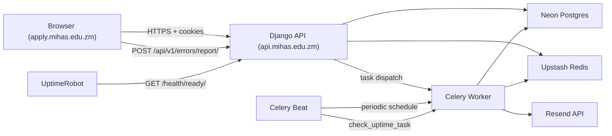
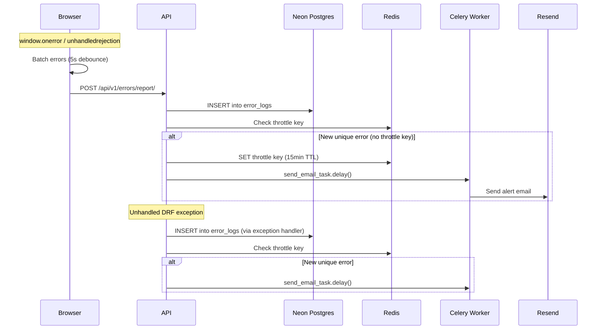

# Design Document — CTO Assessment Remediation

## Overview

This design addresses eight remediation items from the CTO Assessment (March 30, 2026). The work spans the Django backend (`backend/`), the admissions frontend (`apps/admissions/`), and operational documentation (`docs/`). All changes respect the existing constraints: `managed = False` models on Neon Postgres, cookie-based JWT auth on `.mihas.edu.zm`, Celery + Upstash Redis for async work, and Resend for email delivery.

The eight workstreams are:

1. **JWT Middleware Completion** — Replace the pass-through stub in `JWTAuthenticationMiddleware` with real token extraction and validation, reusing the existing `JWTUser` class and `JWTCookieAuthentication` decode logic.
2. **Email Task Wiring** — Wire `send_email_task.delay()` at the two remaining TODO locations in `accounts/services.py` and `accounts/views.py`.
3. **Error Monitoring** — Add a self-hosted `ErrorLog` model, extend the DRF exception handler, expose a `POST /api/v1/errors/report/` endpoint, and add a frontend error reporter.
4. **Backend Concurrency Scaling** — Increase `WEB_CONCURRENCY` to 3 and update `DEPLOY.md` with scaling guidance.
5. **Uptime Monitoring** — Document UptimeRobot setup, add a `check_uptime_task` Celery periodic task, and configure Celery Beat.
6. **Secrets Rotation Runbook** — Create `docs/runbooks/secrets-rotation.md` covering all production secrets.
7. **Audit Log Cleanup** — Add a `cleanup_audit_logs_task` Celery periodic task with batched deletes.
8. **Bcrypt Re-Hash Coverage** — Confirm existing re-hash behavior and add explicit test coverage.

## Architecture

### System Context



### Middleware Chain (Updated)

Position 8 in the middleware chain (`JWTAuthenticationMiddleware`) changes from a pass-through stub to a real implementation:

```
Request → SecurityHeaders → Django Security → WhiteNoise → CORS → RequestID → RateLimit → CommonMiddleware
       → JWTAuthenticationMiddleware (NEW: extract + decode JWT, set request.user)
       → CSRFEnforcement → Audit → View
```

The middleware decodes the JWT and attaches a `JWTUser` to `request.user`. DRF's `JWTCookieAuthentication` then either detects the pre-authenticated user or re-validates independently — both paths produce correct results.

### Celery Beat (New Process)

A new Celery Beat scheduler process is required on Koyeb. It dispatches two periodic tasks:

| Task | Schedule | Purpose |
|------|----------|---------|
| `check_uptime_task` | Every 5 minutes | Internal health check with email alerts |
| `cleanup_audit_logs_task` | Daily at 03:00 UTC | Purge expired audit log records |

### Error Monitoring Flow



## Components and Interfaces

### 1. JWTAuthenticationMiddleware (Modified)

**File:** `backend/apps/common/middleware.py`

The stub `__call__` method is replaced with real logic:

```python
class JWTAuthenticationMiddleware:
    """Extract JWT from cookies/Bearer header and set request.user."""

    COOKIE_NAME = "access_token"

    def __init__(self, get_response):
        self.get_response = get_response
        self._signing_key = None
        self._algorithm = None

    def __call__(self, request):
        token = self._extract_token(request)
        if token:
            user = self._authenticate(token)
            if user:
                request.user = user
        return self.get_response(request)

    def _extract_token(self, request) -> str | None:
        # 1. Cookie first
        token = request.COOKIES.get(self.COOKIE_NAME)
        if token:
            return token
        # 2. Authorization: Bearer fallback
        auth = request.META.get("HTTP_AUTHORIZATION", "")
        if auth.startswith("Bearer "):
            return auth[7:].strip()
        return None

    def _authenticate(self, token: str):
        # Lazy-load signing key from settings
        # Decode with PyJWT, validate token_type=access and user_id present
        # Return JWTUser on success, None on any failure
        # Log warnings for invalid tokens, no DB queries
        ...
```

**Key decisions:**
- Reuses `JWTUser` from `accounts/authentication.py` — no new user class.
- On any decode failure (expired, malformed, wrong type), the middleware silently passes through, leaving `request.user` unset. DRF permission classes handle enforcement.
- No database queries — the middleware is purely stateless JWT validation.
- Signing key and algorithm are lazy-loaded from `settings.SIMPLE_JWT` on first use.

### 2. Email Task Wiring (Modified)

**Files:** `backend/apps/accounts/services.py`, `backend/apps/accounts/views.py`

Two TODO locations are wired:

**`services.py:send_lockout_email()`** — Creates an `EmailQueue` record with a lockout notification body, then dispatches `send_email_task.delay(email_queue_id)`.

**`views.py:PasswordResetRequestView.post()`** — Creates an `EmailQueue` record with a password reset link (`https://apply.mihas.edu.zm/auth/reset-password?token={raw_token}`), then dispatches `send_email_task.delay(email_queue_id)`.

Both locations wrap the `EmailQueue.objects.create()` + `send_email_task.delay()` in a try/except that logs errors but never raises to the caller.

### 3. Error Monitoring Components (New)

#### 3a. ErrorLog Model

**File:** `backend/apps/common/models.py`

```python
class ErrorLog(models.Model):
    id = models.UUIDField(primary_key=True, default=uuid.uuid4)
    source = models.CharField(max_length=20)       # 'backend' or 'frontend'
    level = models.CharField(max_length=20)         # 'error' or 'warning'
    message = models.TextField()
    stack_trace = models.TextField(null=True, blank=True)
    context = models.JSONField(null=True, blank=True)
    request_path = models.TextField(null=True, blank=True)
    user_id = models.UUIDField(null=True, blank=True)
    ip_hash = models.CharField(max_length=64, null=True, blank=True)
    created_at = models.DateTimeField(auto_now_add=True)

    class Meta:
        managed = False
        db_table = 'error_logs'
```

A SQL migration script will be provided to create the `error_logs` table in Neon.

#### 3b. Extended Exception Handler

**File:** `backend/apps/common/exceptions.py`

The existing `envelope_exception_handler` is extended: after building the error response, if the response status is 500 (unhandled server error), it creates an `ErrorLog` record with `source='backend'` and dispatches an alert email (throttled via Redis).

#### 3c. Error Report Endpoint

**File:** `backend/apps/common/error_views.py` (new)

```
POST /api/v1/errors/report/
```

- Accepts: `{ message, stack_trace?, context?, url?, user_agent? }`
- Permission: `AllowAny` (both authenticated and unauthenticated)
- CSRF exempt: Added to `CSRFEnforcementMiddleware.EXEMPT_PATTERNS` since the frontend error reporter fires on `window.onerror` which can happen before any CSRF token is available
- Rate limit: 10/IP/5min (added to `RateLimitMiddleware.SCOPE_LIMITS`)
- Hashes client IP with SHA-256 before storing
- Creates `ErrorLog` with `source='frontend'`
- Dispatches throttled alert email for `level='error'`

**URL registration:** `backend/config/urls.py` adds `path("api/v1/errors/", include("apps.common.error_urls"))`.

#### 3d. Alert Email Throttling

Uses Redis keys with pattern `error_alert:{sha256(message)[:16]}` and 15-minute TTL. Before dispatching an alert email, the handler checks if the key exists. If it does, the alert is suppressed.

#### 3e. Frontend Error Reporter

**File:** `apps/admissions/src/lib/errorReporter.ts` (new)

```typescript
// Registers window.onerror and unhandledrejection handlers
// Batches errors with 5-second debounce
// POSTs to /api/v1/errors/report/ via apiClient
// Includes page URL, user agent, VITE_APP_VERSION
// On POST failure: console.error, no retry
```

Initialized in the app entry point (`main.tsx`).

### 4. Backend Concurrency Scaling (Config Change)

**Files:** `backend/Dockerfile`, `backend/DEPLOY.md`, `backend/.env.example`

- `Dockerfile`: Change `WEB_CONCURRENCY=1` default to `WEB_CONCURRENCY=3`
- `DEPLOY.md`: Update the web service table to show `WEB_CONCURRENCY=3`, add scaling guidance section
- `.env.example`: Update comment to reflect `3` as the recommended starting value

### 5. Uptime Monitoring Components

#### 5a. UptimeRobot Documentation

**File:** `backend/DEPLOY.md` — New section documenting UptimeRobot free-tier setup for `/health/ready/`.

#### 5b. check_uptime_task

**File:** `backend/apps/common/tasks.py`

```python
@shared_task(bind=True, max_retries=0)
def check_uptime_task(self):
    """Internal health check — pings /health/ready/ and alerts on failure."""
    # GET configured HEALTH_CHECK_URL (default: https://api.mihas.edu.zm/health/ready/)
    # 10-second timeout
    # Track previous status in Redis key 'uptime:last_status'
    # On failure: dispatch alert email if previous status was 'ok'
    # On recovery: dispatch recovery email if previous status was 'down'
```

#### 5c. Celery Beat Configuration

**File:** `backend/config/settings/base.py`

```python
CELERY_BEAT_SCHEDULE = {
    "check-uptime": {
        "task": "apps.common.tasks.check_uptime_task",
        "schedule": 300.0,  # every 5 minutes
    },
    "cleanup-audit-logs": {
        "task": "apps.common.tasks.cleanup_audit_logs_task",
        "schedule": crontab(hour=3, minute=0),  # daily at 03:00 UTC
    },
}
```

**DEPLOY.md:** Documents running Celery Beat as a third Koyeb service with command `celery -A config beat -l info`.

### 6. Secrets Rotation Runbook (New Document)

**File:** `docs/runbooks/secrets-rotation.md`

Covers rotation procedures for: `JWT_SIGNING_KEY` (dual-key overlap), `SECRET_KEY`, R2 credentials, `DATABASE_URL`, `RESEND_API_KEY`, `REDIS_URL`. Includes recommended rotation schedule and post-rotation verification checklist.

### 7. Audit Log Cleanup Task

**File:** `backend/apps/common/tasks.py`

```python
@shared_task(bind=True, max_retries=1, default_retry_delay=300)
def cleanup_audit_logs_task(self):
    """Purge expired audit log records in batches of 1000."""
    # Delete standard records older than 90 days
    # Delete security records older than 365 days
    # Batch deletes: DELETE ... LIMIT 1000 in a loop
    # Log counts per category
```

### 8. Bcrypt Re-Hash Test Coverage

**File:** `backend/tests/unit/test_password_rehash.py` (new)

Tests:
- `test_sha256_user_can_login_and_hash_is_upgraded` — Creates a Profile with a SHA-256 hash, calls the login flow, verifies the stored hash is now bcrypt.
- `test_needs_rehash_true_for_sha256` — Verifies `needs_rehash()` returns `True` for SHA-256 hashes.
- `test_needs_rehash_false_for_bcrypt` — Verifies `needs_rehash()` returns `False` for bcrypt hashes.

## Data Models

### ErrorLog Table (New)

```sql
CREATE TABLE error_logs (
    id UUID PRIMARY KEY DEFAULT gen_random_uuid(),
    source VARCHAR(20) NOT NULL,          -- 'backend' or 'frontend'
    level VARCHAR(20) NOT NULL,           -- 'error' or 'warning'
    message TEXT NOT NULL,
    stack_trace TEXT,
    context JSONB,
    request_path TEXT,
    user_id UUID,
    ip_hash VARCHAR(64),
    created_at TIMESTAMPTZ NOT NULL DEFAULT NOW()
);

CREATE INDEX idx_error_logs_created_at ON error_logs (created_at);
CREATE INDEX idx_error_logs_source_level ON error_logs (source, level);
```

### Existing Models Referenced (No Changes)

| Model | Table | Key Fields Used |
|-------|-------|-----------------|
| `AuditLog` | `audit_logs` | `retention_category`, `created_at` |
| `EmailQueue` | `email_queue` | `recipient_email`, `subject`, `body`, `status` |
| `Profile` | `profiles` | `email`, `password_hash`, `role`, `is_active` |

### Redis Keys (New)

| Key Pattern | TTL | Purpose |
|-------------|-----|---------|
| `error_alert:{hash}` | 900s (15 min) | Throttle duplicate alert emails |
| `uptime:last_status` | None (persistent) | Track health check state for recovery detection |

### Configuration Additions

| Setting | Location | Default |
|---------|----------|---------|
| `ERROR_ALERT_EMAIL` | `backend/.env.example` | `ops@mihas.edu.zm` |
| `HEALTH_CHECK_URL` | `backend/.env.example` | `https://api.mihas.edu.zm/health/ready/` |
| `CELERY_BEAT_SCHEDULE` | `backend/config/settings/base.py` | See §5c above |


## Correctness Properties

*A property is a characteristic or behavior that should hold true across all valid executions of a system — essentially, a formal statement about what the system should do. Properties serve as the bridge between human-readable specifications and machine-verifiable correctness guarantees.*

### Property 1: Valid JWT produces authenticated request.user

*For any* valid JWT payload containing `user_id`, `email`, `role`, and `token_type=access`, encoding it with the configured signing key and placing it in either the `access_token` cookie or the `Authorization: Bearer` header, the middleware should attach a `JWTUser` to `request.user` with matching `id`, `email`, and `role` fields — and the result should be identical regardless of which extraction path (cookie vs. header) was used.

**Validates: Requirements 1.1, 1.2**

### Property 2: Invalid JWT does not set request.user

*For any* invalid JWT token — including expired tokens, tokens signed with the wrong key, malformed strings, tokens with `token_type != 'access'`, and tokens with missing or empty `user_id` — the middleware should allow the request to proceed without setting `request.user` to an authenticated user.

**Validates: Requirements 1.3, 1.4, 1.6, 1.7**

### Property 3: Email dispatch creates EmailQueue record before task dispatch

*For any* email dispatch (password reset or lockout), an `EmailQueue` record with `status='pending'`, a non-empty `recipient_email`, non-empty `subject`, and non-empty `body` must exist in the database before `send_email_task.delay()` is called with that record's ID.

**Validates: Requirements 2.3**

### Property 4: Password reset email contains token and base URL

*For any* generated password reset token, the `EmailQueue` record body created for the reset email must contain both the raw token string and the frontend base URL (`https://apply.mihas.edu.zm`).

**Validates: Requirements 2.5**

### Property 5: Unhandled DRF exceptions produce ErrorLog records

*For any* unhandled exception raised in a DRF view that results in a 500 response, the exception handler should create an `ErrorLog` record with `source='backend'`, `level='error'`, and a non-empty `message` field.

**Validates: Requirements 3.2**

### Property 6: Error-level ErrorLog triggers throttled alert email

*For any* `ErrorLog` record with `level='error'`, if no alert has been sent for the same error message within the last 15 minutes (as tracked by Redis), an alert email should be dispatched via `send_email_task.delay()`. If an alert was already sent within the window, no duplicate alert should be dispatched.

**Validates: Requirements 3.3, 3.11**

### Property 7: Frontend error reports hash client IP

*For any* error report submitted to `POST /api/v1/errors/report/`, the `ip_hash` stored in the resulting `ErrorLog` record should equal the SHA-256 hex digest of the client's IP address, and the raw IP should not appear anywhere in the record.

**Validates: Requirements 3.6**

### Property 8: Frontend error reporter batches and includes metadata

*For any* sequence of errors occurring within a 5-second window, the error reporter should send at most one POST request containing all accumulated errors. Each error payload in the batch must include the current page URL, user agent string, and app version.

**Validates: Requirements 3.8, 3.9**

### Property 9: Uptime task alerts on failure and recovers

*For any* sequence of health check results, the `check_uptime_task` should dispatch an alert email when the health endpoint transitions from healthy to unhealthy (non-200 or timeout), and dispatch a recovery email when it transitions from unhealthy back to healthy (200). Repeated failures without a recovery should not produce duplicate alerts.

**Validates: Requirements 5.3, 5.4**

### Property 10: Audit log cleanup respects retention periods

*For any* set of `AuditLog` records, after `cleanup_audit_logs_task` runs, no records should remain where `retention_category='standard'` and `created_at` is older than 90 days, and no records should remain where `retention_category='security'` and `created_at` is older than 365 days. Records within their retention period must not be deleted.

**Validates: Requirements 7.2, 7.3**

### Property 11: needs_rehash correctly classifies hash formats

*For any* bcrypt hash (starting with `$2`), `needs_rehash()` should return `False`. *For any* SHA-256 hex digest (64 hex characters, not starting with `$2`), `needs_rehash()` should return `True`.

**Validates: Requirements 8.4**

### Property 12: Legacy hash is upgraded to bcrypt on login

*For any* user whose `password_hash` is a SHA-256 digest of their password, after a successful login through `LoginView`, the stored `password_hash` on the `Profile` record should start with `$2` (bcrypt prefix) and `needs_rehash()` should return `False` for the updated hash.

**Validates: Requirements 8.1**

## Error Handling

### JWT Middleware Errors

| Scenario | Behavior |
|----------|----------|
| Expired token | Pass through silently, `request.user` not set |
| Malformed token | Pass through silently, log warning, `request.user` not set |
| Invalid signature | Pass through silently, log warning, `request.user` not set |
| Missing signing key | Pass through silently, log error, `request.user` not set |
| Wrong `token_type` | Pass through silently, `request.user` not set |

The middleware never returns an error response directly. Authentication enforcement is delegated to DRF permission classes, which return 401/403 as appropriate.

### Email Dispatch Errors

| Scenario | Behavior |
|----------|----------|
| `EmailQueue.objects.create()` fails | Log error, continue original request processing |
| `send_email_task.delay()` fails | Log error, continue original request processing |
| Resend API failure (in task) | Celery retries with exponential backoff (60s, 120s, 240s) |
| Max retries exhausted | Mark `EmailQueue` record as `failed`, log error |

### Error Monitoring Errors

| Scenario | Behavior |
|----------|----------|
| `ErrorLog.objects.create()` fails in exception handler | Log to Python logger, return original error response |
| Alert email dispatch fails | Swallow silently (avoid recursive error loops) |
| Frontend error report POST fails | `console.error()`, no retry |
| Redis throttle check fails | Skip throttle, dispatch alert (fail-open for alerting) |

### Uptime Task Errors

| Scenario | Behavior |
|----------|----------|
| Health endpoint unreachable | Treat as failure, dispatch alert |
| Health endpoint timeout (>10s) | Treat as failure, dispatch alert |
| Redis state read/write fails | Log error, treat as new incident |
| Alert email dispatch fails | Log error, do not retry the uptime check |

### Audit Cleanup Errors

| Scenario | Behavior |
|----------|----------|
| Database error during batch delete | Log error, retry once after 5 minutes |
| Retry also fails | Log error, task completes (next daily run will retry) |

## Testing Strategy

### Testing Libraries

| Layer | Library | Purpose |
|-------|---------|---------|
| Backend unit tests | pytest + pytest-django | Specific examples, edge cases, mocking |
| Backend property tests | hypothesis | Universal properties across generated inputs |
| Frontend unit tests | Vitest | Component and utility testing |
| Frontend property tests | fast-check | API client and error reporter properties |

### Property-Based Testing Configuration

- Minimum 100 iterations per property test (Hypothesis default `max_examples=100`)
- Each property test must reference its design document property via a comment tag
- Tag format: `# Feature: cto-assessment-remediation, Property {N}: {title}`
- Each correctness property is implemented by a single property-based test
- Hypothesis settings: `@settings(max_examples=100, deadline=None)`
- fast-check settings: `fc.assert(property, { numRuns: 100 })`

### Backend Property Tests

**File:** `backend/tests/property/test_jwt_middleware.py`

| Test | Property | Strategy |
|------|----------|----------|
| `test_valid_jwt_produces_authenticated_user` | Property 1 | Generate random JWT payloads with valid claims, encode with test signing key, verify `request.user` matches |
| `test_invalid_jwt_does_not_set_user` | Property 2 | Generate expired tokens, wrong-key tokens, malformed strings, wrong token_type, missing user_id — verify `request.user` not set |

**File:** `backend/tests/property/test_email_dispatch.py`

| Test | Property | Strategy |
|------|----------|----------|
| `test_email_dispatch_creates_queue_record` | Property 3 | Generate random email parameters, call dispatch helper, verify EmailQueue record exists with correct fields |
| `test_reset_email_contains_token_and_url` | Property 4 | Generate random tokens, create reset email body, verify token and base URL are present |

**File:** `backend/tests/property/test_error_monitoring.py`

| Test | Property | Strategy |
|------|----------|----------|
| `test_unhandled_exception_creates_error_log` | Property 5 | Generate random exception types and messages, invoke exception handler, verify ErrorLog record |
| `test_error_alert_throttling` | Property 6 | Generate sequences of error messages, verify alert dispatch follows throttle rules |
| `test_error_report_hashes_ip` | Property 7 | Generate random IP addresses, submit error reports, verify stored ip_hash equals SHA-256 of IP |

**File:** `backend/tests/property/test_uptime_task.py`

| Test | Property | Strategy |
|------|----------|----------|
| `test_uptime_state_transitions` | Property 9 | Generate sequences of health check results (200/non-200), verify alert/recovery emails match state transitions |

**File:** `backend/tests/property/test_audit_cleanup.py`

| Test | Property | Strategy |
|------|----------|----------|
| `test_cleanup_respects_retention_periods` | Property 10 | Generate random AuditLog records with various retention categories and ages, run cleanup, verify only expired records are deleted |

**File:** `backend/tests/property/test_password_rehash.py`

| Test | Property | Strategy |
|------|----------|----------|
| `test_needs_rehash_classifies_correctly` | Property 11 | Generate bcrypt hashes and SHA-256 hex digests, verify `needs_rehash()` returns correct boolean |
| `test_legacy_hash_upgraded_on_login` | Property 12 | Generate random passwords, create SHA-256 hashes, simulate login, verify hash is upgraded to bcrypt |

### Frontend Property Tests

**File:** `apps/admissions/tests/property/errorReporter.property.test.ts`

| Test | Property | Strategy |
|------|----------|----------|
| `test_error_batching_and_metadata` | Property 8 | Generate random error events, fire them within 5s window, verify single POST with all errors and required metadata fields |

### Backend Unit Tests

**File:** `backend/tests/unit/test_jwt_middleware.py`

- No-token request passes through as anonymous
- Cookie takes precedence over Bearer header when both present
- Middleware does not make database queries (mock DB, assert no calls)

**File:** `backend/tests/unit/test_email_wiring.py`

- Password reset request dispatches email task (mock `send_email_task.delay`)
- Lockout triggers email task (mock `send_email_task.delay`)
- EmailQueue creation failure does not raise to caller
- Lockout email body contains lockout message

**File:** `backend/tests/unit/test_error_monitoring.py`

- `POST /api/v1/errors/report/` returns 200 for valid payload
- `POST /api/v1/errors/report/` returns 400 for missing `message` field
- Error report endpoint works for unauthenticated requests

**File:** `backend/tests/unit/test_audit_cleanup.py`

- Cleanup logs deletion counts
- Cleanup retries once on database error

**File:** `backend/tests/unit/test_password_rehash.py`

- SHA-256 user can log in and hash is upgraded to bcrypt
- `needs_rehash()` returns True for SHA-256, False for bcrypt
- `needs_rehash()` returns False for empty string
